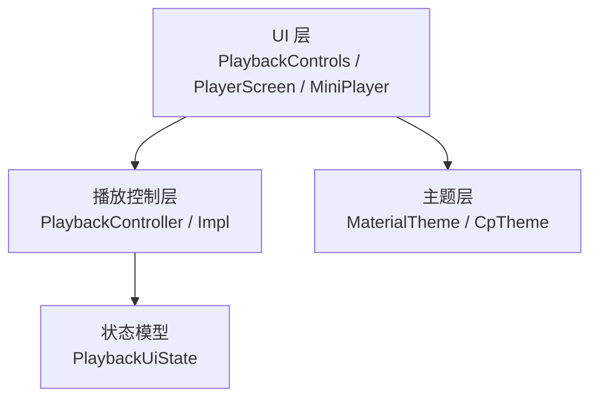
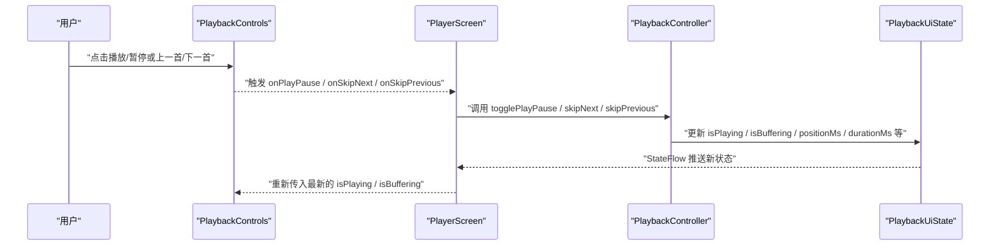
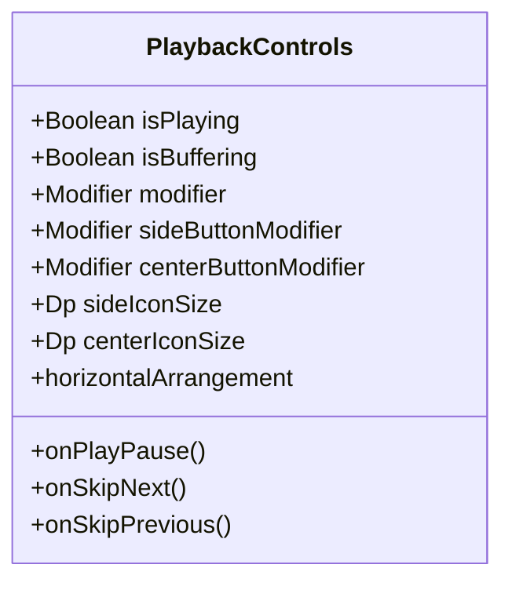
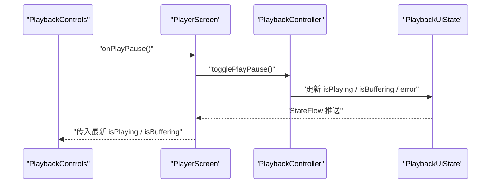
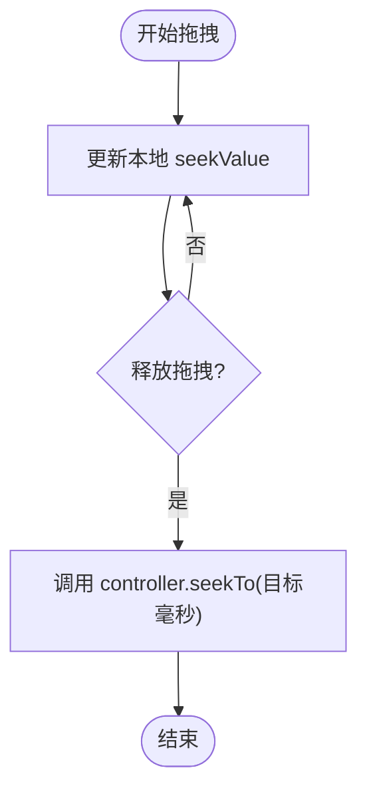
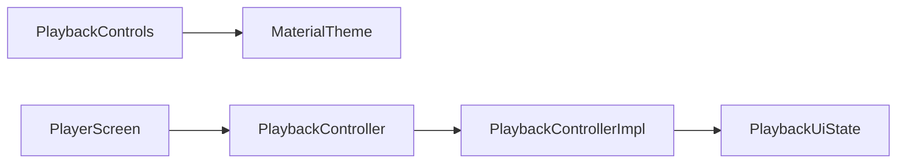

# PlaybackControls 播放控制组件

<cite>
**本文引用的文件**
- [PlaybackControls.kt](file://app/src/commonMain/kotlin/cp/player/app/ui/component/PlaybackControls.kt)
- [PlayerScreen.kt](file://app/src/commonMain/kotlin/cp/player/app/ui/screen/PlayerScreen.kt)
- [MiniPlayer.kt](file://app/src/commonMain/kotlin/cp/player/app/ui/component/MiniPlayer.kt)
- [PlaybackController.kt](file://kmp-pro/src/commonMain/kotlin/cp/player/kmp/playback/PlaybackController.kt)
- [PlaybackControllerImpl.kt](file://kmp-pro/src/commonMain/kotlin/cp/player/kmp/playback/PlaybackControllerImpl.kt)
- [PlaybackUiState.kt](file://kmp-pro/src/commonMain/kotlin/cp/player/kmp/playback/PlaybackUiState.kt)
- [Theme.kt](file://app/src/commonMain/kotlin/cp/player/app/ui/theme/Theme.kt)
</cite>

## 目录
1. [简介](#简介)
2. [项目结构](#项目结构)
3. [核心组件](#核心组件)
4. [架构总览](#架构总览)
5. [详细组件分析](#详细组件分析)
6. [依赖分析](#依赖分析)
7. [性能考虑](#性能考虑)
8. [故障排查指南](#故障排查指南)
9. [结论](#结论)
10. [附录](#附录)

## 简介
PlaybackControls 是音乐播放的核心控制组件，提供播放/暂停、上一首/下一首等基础控制能力。它通过外部传入的状态与回调与上层播放器控制器对接，实现状态同步与用户交互反馈。该组件专注于“控制按钮”的呈现与点击事件派发，不包含进度条拖动与音量调节逻辑（这些由上层 PlayerScreen 与控制器负责）。

## 项目结构
- UI 层：
  - PlaybackControls：三按钮控件（上一首/播放暂停/下一首），支持缓冲态显示加载指示器。
  - PlayerScreen：全屏播放页，集成进度条、队列、收藏、循环、随机、睡眠定时等，并调用 PlaybackControls。
  - MiniPlayer：底部迷你播放器，复用播放控制语义。
- 播放控制层：
  - PlaybackController / PlaybackControllerImpl：唯一播放控制入口，暴露 state 流与播控方法（播放/暂停、跳转、切歌、循环、随机、音量等）。
  - PlaybackUiState：UI 渲染所需的全部不可变状态（当前曲目、是否播放、是否缓冲、位置、时长、错误信息等）。
- 主题层：
  - Theme：应用主题入口，提供颜色方案与形状，供 PlaybackControls 使用 Material 主题色。

图表来源
- [PlaybackControls.kt:30-118](file://app/src/commonMain/kotlin/cp/player/app/ui/component/PlaybackControls.kt#L30-L118)
- [PlayerScreen.kt:118-156](file://app/src/commonMain/kotlin/cp/player/app/ui/screen/PlayerScreen.kt#L118-L156)
- [PlaybackController.kt:16-100](file://kmp-pro/src/commonMain/kotlin/cp/player/kmp/playback/PlaybackController.kt#L16-L100)
- [PlaybackUiState.kt:12-35](file://kmp-pro/src/commonMain/kotlin/cp/player/kmp/playback/PlaybackUiState.kt#L12-L35)
- [Theme.kt:31-65](file://app/src/commonMain/kotlin/cp/player/app/ui/theme/Theme.kt#L31-L65)

章节来源
- [PlaybackControls.kt:30-118](file://app/src/commonMain/kotlin/cp/player/app/ui/component/PlaybackControls.kt#L30-L118)
- [PlayerScreen.kt:118-156](file://app/src/commonMain/kotlin/cp/player/app/ui/screen/PlayerScreen.kt#L118-L156)
- [PlaybackController.kt:16-100](file://kmp-pro/src/commonMain/kotlin/cp/player/kmp/playback/PlaybackController.kt#L16-L100)
- [PlaybackUiState.kt:12-35](file://kmp-pro/src/commonMain/kotlin/cp/player/kmp/playback/PlaybackUiState.kt#L12-L35)
- [Theme.kt:31-65](file://app/src/commonMain/kotlin/cp/player/app/ui/theme/Theme.kt#L31-L65)

## 核心组件
- PlaybackControls
  - 职责：渲染上一首/播放暂停/下一首三个按钮；在缓冲时以圆形进度条替代播放/暂停图标。
  - 输入：isPlaying、isBuffering、onPlayPause、onSkipNext、onSkipPrevious 以及若干修饰符与尺寸参数。
  - 输出：无直接输出，仅触发回调。
  - 主题：使用 MaterialTheme.colorScheme 的 onSurface、primary、onPrimary 等颜色。
- PlayerScreen
  - 职责：订阅 PlaybackController.state，驱动 UI；处理进度条拖拽、循环/随机、收藏、睡眠定时等。
  - 与 PlaybackControls 的对接：将 state.isPlaying、state.isBuffering 与控制器回调传入组件。
- PlaybackController / Impl
  - 职责：统一播放控制入口；维护队列、播放顺序、歌词、收藏、音质、睡眠定时等；对外暴露 state 流与播控 API。
  - 关键状态：isPlaying、isBuffering、positionMs、durationMs、error、repeatMode、shuffleEnabled 等。
- Theme
  - 职责：提供全局颜色与形状；PlaybackControls 通过 MaterialTheme 自动适配浅色/深色与动态取色。

章节来源
- [PlaybackControls.kt:30-118](file://app/src/commonMain/kotlin/cp/player/app/ui/component/PlaybackControls.kt#L30-L118)
- [PlayerScreen.kt:118-156](file://app/src/commonMain/kotlin/cp/player/app/ui/screen/PlayerScreen.kt#L118-L156)
- [PlaybackController.kt:16-100](file://kmp-pro/src/commonMain/kotlin/cp/player/kmp/playback/PlaybackController.kt#L16-L100)
- [PlaybackControllerImpl.kt:96-127](file://kmp-pro/src/commonMain/kotlin/cp/player/kmp/playback/PlaybackControllerImpl.kt#L96-L127)
- [PlaybackUiState.kt:12-35](file://kmp-pro/src/commonMain/kotlin/cp/player/kmp/playback/PlaybackUiState.kt#L12-L35)
- [Theme.kt:31-65](file://app/src/commonMain/kotlin/cp/player/app/ui/theme/Theme.kt#L31-L65)

## 架构总览
PlaybackControls 作为纯展示与事件派发组件，不持有业务状态；所有状态来自 PlaybackController.state，所有操作通过控制器完成。PlayerScreen 作为编排者，订阅状态并转发到 PlaybackControls。

图表来源
- [PlaybackControls.kt:39-118](file://app/src/commonMain/kotlin/cp/player/app/ui/component/PlaybackControls.kt#L39-L118)
- [PlayerScreen.kt:118-156](file://app/src/commonMain/kotlin/cp/player/app/ui/screen/PlayerScreen.kt#L118-L156)
- [PlaybackController.kt:16-100](file://kmp-pro/src/commonMain/kotlin/cp/player/kmp/playback/PlaybackController.kt#L16-L100)
- [PlaybackControllerImpl.kt:96-127](file://kmp-pro/src/commonMain/kotlin/cp/player/kmp/playback/PlaybackControllerImpl.kt#L96-L127)
- [PlaybackUiState.kt:12-35](file://kmp-pro/src/commonMain/kotlin/cp/player/kmp/playback/PlaybackUiState.kt#L12-L35)

## 详细组件分析

### PlaybackControls 组件分析
- 功能要点
  - 三按钮布局：上一首、播放/暂停、下一首。
  - 缓冲态：当 isBuffering 为真时，中央按钮显示圆形进度条，否则显示播放/暂停图标。
  - 可配置项：侧边按钮与中心按钮的修饰符、图标尺寸、水平排列方式等。
  - 无障碍：为图标设置 contentDescription，便于读屏器识别。
- 属性与回调
  - 输入状态：isPlaying、isBuffering。
  - 回调：onPlayPause、onSkipNext、onSkipPrevious。
  - 外观：sideButtonModifier、centerButtonModifier、sideIconSize、centerIconSize、horizontalArrangement。
- 用户交互行为
  - 点击反馈：通过 Surface 包裹按钮，具备默认点击态；可通过 sideButtonModifier/centerButtonModifier 自定义按压效果。
  - 缓冲体验：缓冲期间中央按钮切换为 CircularProgressIndicator，避免误触。
- 主题与样式覆盖
  - 颜色：使用 MaterialTheme.colorScheme.onSurface、primary、onPrimary。
  - 形状：外层容器为圆形，中心按钮为圆角矩形。
  - 覆盖方式：通过传入 Modifier 调整尺寸、背景、阴影、圆角等；或通过主题替换颜色方案。

图表来源
- [PlaybackControls.kt:39-118](file://app/src/commonMain/kotlin/cp/player/app/ui/component/PlaybackControls.kt#L39-L118)

章节来源
- [PlaybackControls.kt:39-118](file://app/src/commonMain/kotlin/cp/player/app/ui/component/PlaybackControls.kt#L39-L118)

### 与播放控制器的对接与状态同步
- 状态来源
  - PlayerScreen 订阅 PlaybackController.state，得到 PlaybackUiState。
  - 将 state.isPlaying、state.isBuffering 传入 PlaybackControls。
- 操作路径
  - 用户点击 PlaybackControls → 触发回调 → PlayerScreen 调用控制器对应方法（togglePlayPause/skipNext/skipPrevious）→ 控制器更新状态 → UI 刷新。
- 错误处理
  - 控制器内部可能设置 error；PlayerScreen 根据 state.error 显示提示文本。

图表来源
- [PlayerScreen.kt:118-156](file://app/src/commonMain/kotlin/cp/player/app/ui/screen/PlayerScreen.kt#L118-L156)
- [PlaybackController.kt:16-100](file://kmp-pro/src/commonMain/kotlin/cp/player/kmp/playback/PlaybackController.kt#L16-L100)
- [PlaybackControllerImpl.kt:96-127](file://kmp-pro/src/commonMain/kotlin/cp/player/kmp/playback/PlaybackControllerImpl.kt#L96-L127)
- [PlaybackUiState.kt:12-35](file://kmp-pro/src/commonMain/kotlin/cp/player/kmp/playback/PlaybackUiState.kt#L12-L35)

章节来源
- [PlayerScreen.kt:118-156](file://app/src/commonMain/kotlin/cp/player/app/ui/screen/PlayerScreen.kt#L118-L156)
- [PlaybackController.kt:16-100](file://kmp-pro/src/commonMain/kotlin/cp/player/kmp/playback/PlaybackController.kt#L16-L100)
- [PlaybackControllerImpl.kt:96-127](file://kmp-pro/src/commonMain/kotlin/cp/player/kmp/playback/PlaybackControllerImpl.kt#L96-L127)
- [PlaybackUiState.kt:12-35](file://kmp-pro/src/commonMain/kotlin/cp/player/kmp/playback/PlaybackUiState.kt#L12-L35)

### 进度条拖动与手势支持
- 进度条
  - 由 PlayerScreen 中的 ProgressRow 实现，基于 Slider 绑定 state.positionMs 与 state.durationMs。
  - 拖拽时本地缓存 seekValue，释放后调用 controller.seekTo 进行跳转。
- 手势
  - 播放器页面支持垂直下拉关闭手势（仅在播放器页生效），用于返回上一页。
- 与 PlaybackControls 的关系
  - PlaybackControls 不负责进度条与手势；其职责集中在三按钮控制。

图表来源
- [PlayerScreen.kt:678-720](file://app/src/commonMain/kotlin/cp/player/app/ui/screen/PlayerScreen.kt#L678-L720)

章节来源
- [PlayerScreen.kt:678-720](file://app/src/commonMain/kotlin/cp/player/app/ui/screen/PlayerScreen.kt#L678-L720)

### 音量调节
- 说明
  - PlaybackControls 不提供音量调节 UI。
  - 音量控制接口位于控制器：setVolume(volume: Float)，范围 0f~1f。
  - 可在上层界面（如设置页或悬浮面板）调用该接口实现音量调节。

章节来源
- [PlaybackController.kt:99-100](file://kmp-pro/src/commonMain/kotlin/cp/player/kmp/playback/PlaybackController.kt#L99-L100)
- [PlaybackControllerImpl.kt:483-486](file://kmp-pro/src/commonMain/kotlin/cp/player/kmp/playback/PlaybackControllerImpl.kt#L483-L486)

### 动画效果与视觉反馈
- 缓冲态动画：中央按钮在缓冲时显示 CircularProgressIndicator。
- 主题过渡：通过 MaterialTheme 自动适配浅色/深色与动态取色。
- 页面级动画：PlayerScreen 使用共享元素与滑入/淡出动画提升体验（与 PlaybackControls 无直接耦合）。

章节来源
- [PlaybackControls.kt:84-99](file://app/src/commonMain/kotlin/cp/player/app/ui/component/PlaybackControls.kt#L84-L99)
- [Theme.kt:31-65](file://app/src/commonMain/kotlin/cp/player/app/ui/theme/Theme.kt#L31-L65)
- [PlayerScreen.kt:118-156](file://app/src/commonMain/kotlin/cp/player/app/ui/screen/PlayerScreen.kt#L118-L156)

### 无障碍支持
- 图标描述：为上一首、播放/暂停、下一首图标设置 contentDescription，便于读屏器播报。
- 建议：如需进一步无障碍增强，可为外层 Surface 添加 role 与焦点管理（当前已具备基本可读性）。

章节来源
- [PlaybackControls.kt:62-115](file://app/src/commonMain/kotlin/cp/player/app/ui/component/PlaybackControls.kt#L62-L115)

### 主题定制与样式覆盖
- 主题定制
  - 通过 CpTheme 配置主题模式与动态取色；PlaybackControls 自动继承 MaterialTheme 的颜色与形状。
- 样式覆盖
  - 通过传入 sideButtonModifier/centerButtonModifier 自定义按钮尺寸、背景、阴影、圆角等。
  - 通过 sideIconSize/centerIconSize 调整图标大小。
  - 通过 horizontalArrangement 调整按钮间距与对齐。

章节来源
- [Theme.kt:31-65](file://app/src/commonMain/kotlin/cp/player/app/ui/theme/Theme.kt#L31-L65)
- [PlaybackControls.kt:39-118](file://app/src/commonMain/kotlin/cp/player/app/ui/component/PlaybackControls.kt#L39-L118)

## 依赖分析
- 组件间依赖
  - PlaybackControls 依赖 MaterialTheme（主题）与 Compose 基础组件。
  - PlayerScreen 依赖 PlaybackController 与 PlaybackUiState。
  - PlaybackControllerImpl 依赖 PlatformPlayer、UnifiedMusicSource、MusicApiService 等底层能力。
- 耦合度
  - PlaybackControls 低耦合：仅依赖状态与回调，易于复用。
  - PlayerScreen 高内聚：编排 UI 与控制器交互。
- 外部依赖
  - 播放引擎差异被控制器屏蔽，UI 无需感知平台细节。

图表来源
- [PlaybackControls.kt:30-118](file://app/src/commonMain/kotlin/cp/player/app/ui/component/PlaybackControls.kt#L30-L118)
- [PlayerScreen.kt:118-156](file://app/src/commonMain/kotlin/cp/player/app/ui/screen/PlayerScreen.kt#L118-L156)
- [PlaybackController.kt:16-100](file://kmp-pro/src/commonMain/kotlin/cp/player/kmp/playback/PlaybackController.kt#L16-L100)
- [PlaybackControllerImpl.kt:35-44](file://kmp-pro/src/commonMain/kotlin/cp/player/kmp/playback/PlaybackControllerImpl.kt#L35-L44)
- [PlaybackUiState.kt:12-35](file://kmp-pro/src/commonMain/kotlin/cp/player/kmp/playback/PlaybackUiState.kt#L12-L35)

章节来源
- [PlaybackControls.kt:30-118](file://app/src/commonMain/kotlin/cp/player/app/ui/component/PlaybackControls.kt#L30-L118)
- [PlayerScreen.kt:118-156](file://app/src/commonMain/kotlin/cp/player/app/ui/screen/PlayerScreen.kt#L118-L156)
- [PlaybackController.kt:16-100](file://kmp-pro/src/commonMain/kotlin/cp/player/kmp/playback/PlaybackController.kt#L16-L100)
- [PlaybackControllerImpl.kt:35-44](file://kmp-pro/src/commonMain/kotlin/cp/player/kmp/playback/PlaybackControllerImpl.kt#L35-L44)
- [PlaybackUiState.kt:12-35](file://kmp-pro/src/commonMain/kotlin/cp/player/kmp/playback/PlaybackUiState.kt#L12-L35)

## 性能考虑
- 状态更新频率
  - 控制器将平台状态折叠进 PlaybackUiState，UI 仅订阅必要字段，减少重绘。
- 缓冲态优化
  - 缓冲时切换为加载指示器，避免频繁图标切换导致的重绘。
- 列表与页面
  - 播放器页面使用 Pager 与 LazyColumn 优化滚动性能（与 PlaybackControls 无直接关系）。
- 主题与绘制
  - 使用 MaterialTheme 颜色与形状，避免自定义复杂绘制。

[本节为通用指导，不直接分析具体文件]

## 故障排查指南
- 常见问题
  - 点击无效：检查 PlayerScreen 是否正确将回调传递给 PlaybackControls。
  - 状态不同步：确认 PlayerScreen 订阅了 PlaybackController.state，并将最新状态传入组件。
  - 缓冲卡住：查看控制器 error 字段，必要时重试或降级音质。
- 定位步骤
  - 打开 PlayerScreen 的错误提示区域，观察 state.error。
  - 在控制器中检查 platform 状态与 URL 获取结果。
  - 若网络问题导致无法获取播放地址，尝试切换音质等级。

章节来源
- [PlayerScreen.kt:594-605](file://app/src/commonMain/kotlin/cp/player/app/ui/screen/PlayerScreen.kt#L594-L605)
- [PlaybackControllerImpl.kt:525-554](file://kmp-pro/src/commonMain/kotlin/cp/player/kmp/playback/PlaybackControllerImpl.kt#L525-L554)

## 结论
PlaybackControls 是一个简洁、可复用的播放控制组件，专注于三按钮控制与缓冲态反馈。通过与 PlaybackController 的状态与回调对接，实现了清晰的分层与解耦。结合 PlayerScreen 的进度条、手势与主题体系，可提供完整的播放体验。建议在需要扩展功能时优先在上层编排，保持 PlaybackControls 的低耦合与高内聚。

[本节为总结，不直接分析具体文件]

## 附录
- 完整集成示例（步骤）
  - 在 PlayerScreen 中订阅 PlaybackController.state。
  - 将 state.isPlaying、state.isBuffering 与控制器回调传入 PlaybackControls。
  - 在进度条拖拽释放时调用 controller.seekTo。
  - 在更多菜单中调用 setRepeatMode、toggleShuffle、setSleepTimer 等方法。
  - 监听 state.error 并展示错误信息。
- 参考路径
  - 集成位置：[PlayerScreen.kt:118-156](file://app/src/commonMain/kotlin/cp/player/app/ui/screen/PlayerScreen.kt#L118-L156)
  - 进度条实现：[PlayerScreen.kt:678-720](file://app/src/commonMain/kotlin/cp/player/app/ui/screen/PlayerScreen.kt#L678-L720)
  - 控制器接口：[PlaybackController.kt:16-100](file://kmp-pro/src/commonMain/kotlin/cp/player/kmp/playback/PlaybackController.kt#L16-L100)
  - 状态模型：[PlaybackUiState.kt:12-35](file://kmp-pro/src/commonMain/kotlin/cp/player/kmp/playback/PlaybackUiState.kt#L12-L35)