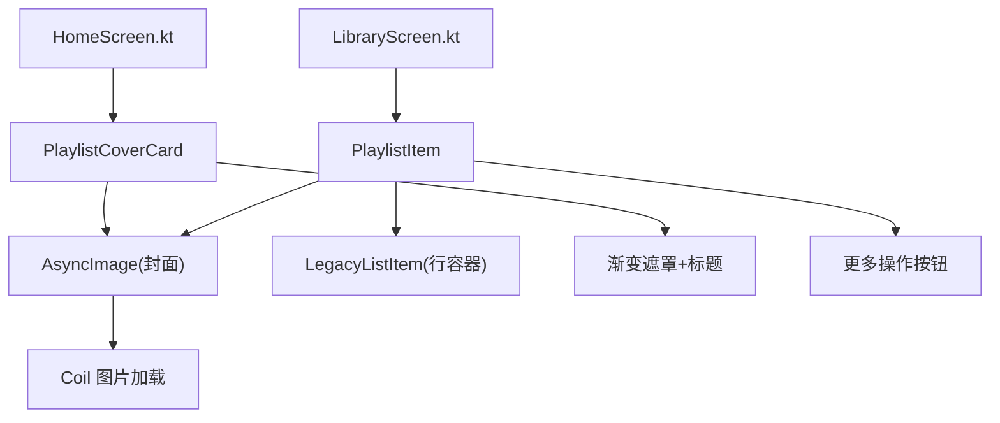
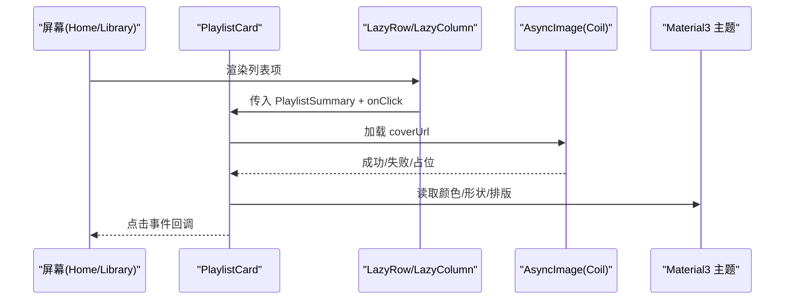
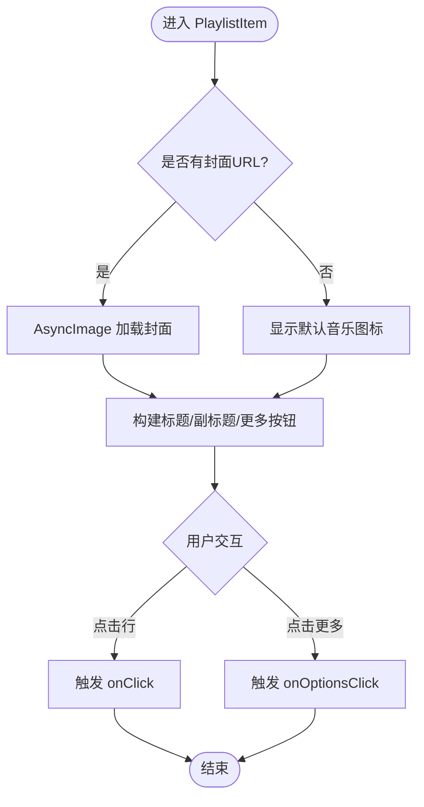
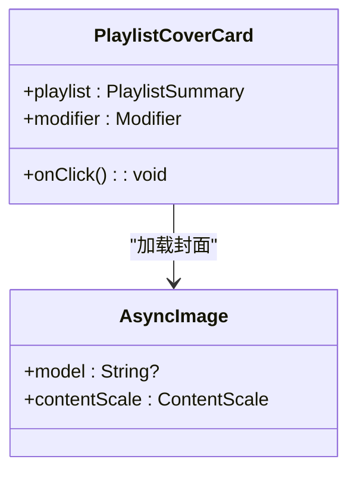
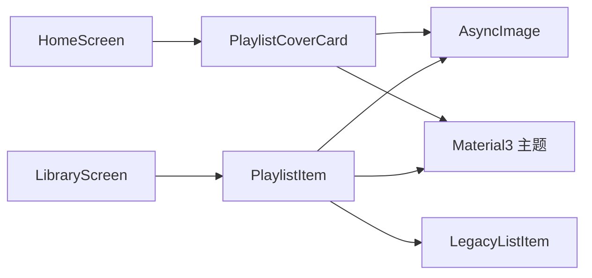

# PlaylistCard 播放列表卡片组件

<cite>
**本文引用的文件**
- [PlaylistCard.kt](file://app/src/commonMain/kotlin/cp/player/app/ui/component/PlaylistCard.kt)
- [LegacyListItem.kt](file://app/src/commonMain/kotlin/cp/player/app/ui/component/LegacyListItem.kt)
- [HomeScreen.kt](file://app/src/commonMain/kotlin/cp/player/app/ui/screen/HomeScreen.kt)
- [LibraryScreen.kt](file://app/src/commonMain/kotlin/cp/player/app/ui/screen/LibraryScreen.kt)
- [MusicSource.kt](file://kmp-pro/src/commonMain/kotlin/cp/player/kmp/music/MusicSource.kt)
- [Playlist.kt](file://kmp-pro/src/commonMain/kotlin/cp/player/kmp/model/Playlist.kt)
</cite>

## 目录
1. [简介](#简介)
2. [项目结构](#项目结构)
3. [核心组件](#核心组件)
4. [架构总览](#架构总览)
5. [详细组件分析](#详细组件分析)
6. [依赖关系分析](#依赖关系分析)
7. [性能与内存优化](#性能与内存优化)
8. [故障排查指南](#故障排查指南)
9. [结论](#结论)
10. [附录：属性接口与使用示例](#附录属性接口与使用示例)

## 简介
本文件为 PlaylistCard 播放列表卡片组件的使用文档。该组件用于在列表中展示播放列表卡片，包含封面图片、标题、创建者、歌曲数量等信息，并提供点击与更多操作回调。组件提供两种形态：
- PlaylistItem：适用于纵向列表（如“我的歌单”），左侧封面 + 标题/副标题 + 右侧更多按钮。
- PlaylistCoverCard：适用于横向滚动或网格布局的卡片（如首页推荐歌单），正方形封面 + 渐变遮罩 + 底部标题。

组件基于 Compose UI，遵循 Material3 Expressive 风格，支持响应式布局、触摸反馈、图片加载与占位图、以及无障碍描述。

## 项目结构
- 组件实现位于 app 模块的 commonMain 中，便于多端共享。
- 数据模型来自 kmp-pro 模块，统一由 MusicSource 暴露给 UI 层。
- 页面通过 HomeScreen 和 LibraryScreen 消费组件，演示了不同场景下的用法。

图表来源
- [HomeScreen.kt:160-170](file://app/src/commonMain/kotlin/cp/player/app/ui/screen/HomeScreen.kt#L160-L170)
- [LibraryScreen.kt:330-354](file://app/src/commonMain/kotlin/cp/player/app/ui/screen/LibraryScreen.kt#L330-L354)
- [PlaylistCard.kt:46-125](file://app/src/commonMain/kotlin/cp/player/app/ui/component/PlaylistCard.kt#L46-L125)
- [PlaylistCard.kt:132-184](file://app/src/commonMain/kotlin/cp/player/app/ui/component/PlaylistCard.kt#L132-L184)
- [LegacyListItem.kt:21-54](file://app/src/commonMain/kotlin/cp/player/app/ui/component/LegacyListItem.kt#L21-L54)

章节来源
- [HomeScreen.kt:160-170](file://app/src/commonMain/kotlin/cp/player/app/ui/screen/HomeScreen.kt#L160-L170)
- [LibraryScreen.kt:330-354](file://app/src/commonMain/kotlin/cp/player/app/ui/screen/LibraryScreen.kt#L330-L354)
- [PlaylistCard.kt:46-184](file://app/src/commonMain/kotlin/cp/player/app/ui/component/PlaylistCard.kt#L46-L184)
- [LegacyListItem.kt:21-66](file://app/src/commonMain/kotlin/cp/player/app/ui/component/LegacyListItem.kt#L21-L66)

## 核心组件
- PlaylistItem：列表项形态，适合纵向滚动列表。包含封面、标题、副标题（创建者与曲目数）、更多操作按钮。
- PlaylistCoverCard：卡片形态，适合横向或网格展示。包含封面、渐变遮罩、底部标题。

两者均接收播放列表数据模型（PlaylistSummary）与点击回调，内部使用 Coil 进行图片异步加载，并在无封面时显示默认图标或背景。

章节来源
- [PlaylistCard.kt:46-125](file://app/src/commonMain/kotlin/cp/player/app/ui/component/PlaylistCard.kt#L46-L125)
- [PlaylistCard.kt:132-184](file://app/src/commonMain/kotlin/cp/player/app/ui/component/PlaylistCard.kt#L132-L184)

## 架构总览
UI 层通过屏幕组件调用 PlaylistCard 的两个函数，数据来源于 MusicSource 暴露的 PlaylistSummary。图片加载由 Coil 处理，布局采用 Material3 主题与形状系统。

图表来源
- [HomeScreen.kt:160-170](file://app/src/commonMain/kotlin/cp/player/app/ui/screen/HomeScreen.kt#L160-L170)
- [LibraryScreen.kt:330-354](file://app/src/commonMain/kotlin/cp/player/app/ui/screen/LibraryScreen.kt#L330-L354)
- [PlaylistCard.kt:46-184](file://app/src/commonMain/kotlin/cp/player/app/ui/component/PlaylistCard.kt#L46-L184)

## 详细组件分析

### PlaylistItem（列表项）
- 作用：在纵向列表中展示播放列表条目，适配分段圆角样式。
- 布局结构：
  - 左侧：封面区域（有图则裁剪填充，无图则显示音乐图标）。
  - 中间：标题（歌单名）与副标题（创建者 · 曲目数）。
  - 右侧：圆形“更多”按钮，触发 onOptionsClick。
- 交互：
  - 整行可点击，触发 onClick。
  - 右侧按钮独立点击，触发 onOptionsClick。
- 样式：
  - 使用 LegacyListItem 作为行容器，自动处理分段圆角与按压缩放。
  - 封面尺寸固定，圆角矩形；文本溢出省略。
- 无障碍：
  - “更多”按钮提供内容描述，便于读屏器识别。

图表来源
- [PlaylistCard.kt:46-125](file://app/src/commonMain/kotlin/cp/player/app/ui/component/PlaylistCard.kt#L46-L125)
- [LegacyListItem.kt:21-54](file://app/src/commonMain/kotlin/cp/player/app/ui/component/LegacyListItem.kt#L21-L54)

章节来源
- [PlaylistCard.kt:46-125](file://app/src/commonMain/kotlin/cp/player/app/ui/component/PlaylistCard.kt#L46-L125)
- [LegacyListItem.kt:21-66](file://app/src/commonMain/kotlin/cp/player/app/ui/component/LegacyListItem.kt#L21-L66)

### PlaylistCoverCard（卡片）
- 作用：在横向或网格中展示播放列表卡片，强调封面视觉。
- 布局结构：
  - 封面区域：正方形，圆角，裁剪填充；无封面时显示默认图标与背景。
  - 渐变遮罩：从透明到半透明黑色，增强文字可读性。
  - 底部标题：歌单名，最多两行，溢出省略。
- 交互：
  - 点击整个卡片触发 onClick。
- 样式：
  - 使用 Material3 shapes.extraLarge 圆角。
  - 文本颜色为白色，适配深色背景。

图表来源
- [PlaylistCard.kt:132-184](file://app/src/commonMain/kotlin/cp/player/app/ui/component/PlaylistCard.kt#L132-L184)

章节来源
- [PlaylistCard.kt:132-184](file://app/src/commonMain/kotlin/cp/player/app/ui/component/PlaylistCard.kt#L132-L184)

### 数据模型与类型
- 组件接收的数据类型为 PlaylistSummary，定义于 MusicSource 模块，供 UI 层消费。
- 同时存在 Playlist 数据类，用于更完整的播放列表信息（如订阅状态、时长等），可在需要时扩展使用。

章节来源
- [MusicSource.kt:76-...](file://kmp-pro/src/commonMain/kotlin/cp/player/kmp/music/MusicSource.kt#L76-L...)
- [Playlist.kt:6-17](file://kmp-pro/src/commonMain/kotlin/cp/player/kmp/model/Playlist.kt#L6-L17)

## 依赖关系分析
- 组件依赖：
  - Compose 基础库（布局、修饰符、主题）。
  - Coil 图片加载（AsyncImage）。
  - Material3 主题与形状系统。
  - LegacyListItem 提供统一的行容器与分段圆角。
- 页面依赖：
  - HomeScreen 使用 PlaylistCoverCard 展示推荐歌单。
  - LibraryScreen 使用 PlaylistItem 展示用户歌单列表。

图表来源
- [HomeScreen.kt:160-170](file://app/src/commonMain/kotlin/cp/player/app/ui/screen/HomeScreen.kt#L160-L170)
- [LibraryScreen.kt:330-354](file://app/src/commonMain/kotlin/cp/player/app/ui/screen/LibraryScreen.kt#L330-L354)
- [PlaylistCard.kt:46-184](file://app/src/commonMain/kotlin/cp/player/app/ui/component/PlaylistCard.kt#L46-L184)
- [LegacyListItem.kt:21-66](file://app/src/commonMain/kotlin/cp/player/app/ui/component/LegacyListItem.kt#L21-L66)

章节来源
- [HomeScreen.kt:160-170](file://app/src/commonMain/kotlin/cp/player/app/ui/screen/HomeScreen.kt#L160-L170)
- [LibraryScreen.kt:330-354](file://app/src/commonMain/kotlin/cp/player/app/ui/screen/LibraryScreen.kt#L330-L354)
- [PlaylistCard.kt:46-184](file://app/src/commonMain/kotlin/cp/player/app/ui/component/PlaylistCard.kt#L46-L184)
- [LegacyListItem.kt:21-66](file://app/src/commonMain/kotlin/cp/player/app/ui/component/LegacyListItem.kt#L21-L66)

## 性能与内存优化
- 图片加载：
  - 使用 Coil 的 AsyncImage 进行异步加载，避免阻塞主线程。
  - 对封面使用裁剪缩放，减少大图渲染开销。
  - 无封面时回退到默认图标/背景，降低网络请求压力。
- 列表性能：
  - 在 LazyRow/LazyColumn 中使用组件，仅渲染可见项，提升滚动性能。
  - LegacyListItem 提供按压缩放效果，不引入额外重绘负担。
- 内存管理：
  - 图片资源由 Coil 管理生命周期，组件销毁时自动释放。
  - 避免在 Composable 内创建昂贵对象，保持轻量级渲染。
- 建议：
  - 对大量封面图启用缓存策略（由 Coil 默认行为保障）。
  - 在大数据集下确保 key 稳定，避免不必要的重组。

[本节为通用性能指导，无需特定文件引用]

## 故障排查指南
- 封面不显示：
  - 检查 coverUrl 是否为空或无效 URL。
  - 确认网络权限与图片服务可达。
  - 查看是否触发了无封面回退逻辑（显示默认图标）。
- 点击无响应：
  - 确认 onClick 已正确传入并绑定。
  - 对于 PlaylistItem，检查 LegacyListItem 的 enabled 状态与点击区域。
- 文本截断异常：
  - 调整 maxLines 与 overflow 设置，确保标题与副标题完整显示。
- 无障碍问题：
  - 为关键控件补充 contentDescription，便于读屏器识别。

章节来源
- [PlaylistCard.kt:46-184](file://app/src/commonMain/kotlin/cp/player/app/ui/component/PlaylistCard.kt#L46-L184)
- [LegacyListItem.kt:21-66](file://app/src/commonMain/kotlin/cp/player/app/ui/component/LegacyListItem.kt#L21-L66)

## 结论
PlaylistCard 组件提供了两种常用形态以适配不同界面需求：列表项与卡片。组件封装了封面加载、布局与交互细节，结合 Material3 主题与 Coil 图片加载，具备良好的可复用性与性能表现。通过清晰的属性接口与回调机制，开发者可以便捷地绑定数据、处理用户交互并自定义外观。

[本节为总结性内容，无需特定文件引用]

## 附录：属性接口与使用示例

### 属性接口
- PlaylistItem
  - playlist: 播放列表摘要数据（包含封面、名称、创建者、曲目数等）。
  - onClick: 点击整行回调。
  - onOptionsClick: 点击“更多”按钮回调。
  - modifier: 布局修饰符。
  - index, total: 用于分段圆角计算。
- PlaylistCoverCard
  - playlist: 播放列表摘要数据。
  - onClick: 点击卡片回调。
  - modifier: 布局修饰符。

章节来源
- [PlaylistCard.kt:46-125](file://app/src/commonMain/kotlin/cp/player/app/ui/component/PlaylistCard.kt#L46-L125)
- [PlaylistCard.kt:132-184](file://app/src/commonMain/kotlin/cp/player/app/ui/component/PlaylistCard.kt#L132-L184)

### 使用示例
- 在首页横向展示推荐歌单：
  - 使用 PlaylistCoverCard，绑定 playlist 与 onClick，导航至详情页。
  - 参考路径：[HomeScreen.kt:160-170](file://app/src/commonMain/kotlin/cp/player/app/ui/screen/HomeScreen.kt#L160-L170)
- 在“我的歌单”列表展示条目：
  - 使用 PlaylistItem，绑定 playlist、onClick、onOptionsClick，并传入 index 与 total。
  - 参考路径：[LibraryScreen.kt:330-354](file://app/src/commonMain/kotlin/cp/player/app/ui/screen/LibraryScreen.kt#L330-L354)

章节来源
- [HomeScreen.kt:160-170](file://app/src/commonMain/kotlin/cp/player/app/ui/screen/HomeScreen.kt#L160-L170)
- [LibraryScreen.kt:330-354](file://app/src/commonMain/kotlin/cp/player/app/ui/screen/LibraryScreen.kt#L330-L354)

### 布局结构与响应式设计
- 列表项：
  - 封面固定尺寸，圆角矩形；文本溢出省略；右侧按钮圆形。
  - 通过 LegacyListItem 自动处理分段圆角与按压缩放。
- 卡片：
  - 正方形封面，圆角较大；渐变遮罩提升文字可读性；标题最多两行。
- 响应式：
  - 使用 Compose 的 Modifier 与主题系统，适配不同屏幕密度与方向。
  - 文本与图标尺寸基于 dp 单位，保证一致性。

章节来源
- [PlaylistCard.kt:46-184](file://app/src/commonMain/kotlin/cp/player/app/ui/component/PlaylistCard.kt#L46-L184)
- [LegacyListItem.kt:21-66](file://app/src/commonMain/kotlin/cp/player/app/ui/component/LegacyListItem.kt#L21-L66)

### 触摸反馈与无障碍
- 触摸反馈：
  - LegacyListItem 内置按压缩放效果，提升交互体验。
- 无障碍：
  - “更多”按钮提供内容描述，便于读屏器识别。
  - 建议在业务层为封面与标题补充语义化描述（如需）。

章节来源
- [PlaylistCard.kt:46-125](file://app/src/commonMain/kotlin/cp/player/app/ui/component/PlaylistCard.kt#L46-L125)
- [LegacyListItem.kt:21-54](file://app/src/commonMain/kotlin/cp/player/app/ui/component/LegacyListItem.kt#L21-L54)

### 状态管理、图片加载与内存管理
- 状态管理：
  - 组件本身无复杂状态，依赖上层传入的数据与回调。
  - 上层可通过 ViewModel/StateHolder 管理播放列表数据与交互结果。
- 图片加载：
  - 使用 Coil 的 AsyncImage，自动处理缓存、重试与占位。
  - 无封面时回退到默认图标/背景，避免空白。
- 内存管理：
  - Coil 负责图片生命周期管理，组件销毁时释放资源。
  - 避免在 Composable 内创建大对象，保持轻量渲染。

章节来源
- [PlaylistCard.kt:46-184](file://app/src/commonMain/kotlin/cp/player/app/ui/component/PlaylistCard.kt#L46-L184)

### 多语言本地化考虑
- 当前组件中的文案（如“更多操作”、“歌单”）为硬编码字符串。
- 建议将文案抽取至资源文件，并通过本地化工具进行多语言适配。
- 在业务层统一维护多语言键值，确保一致性与可维护性。

[本节为通用本地化建议，无需特定文件引用]