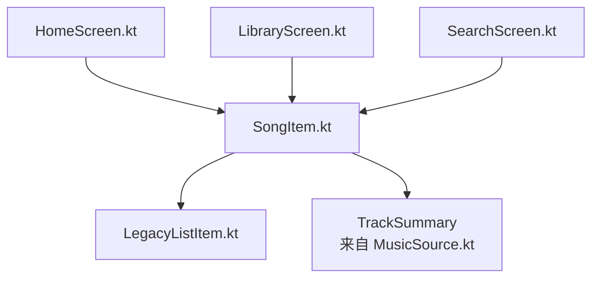
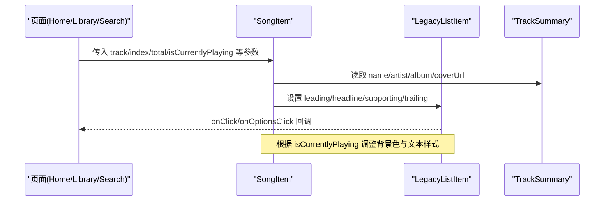
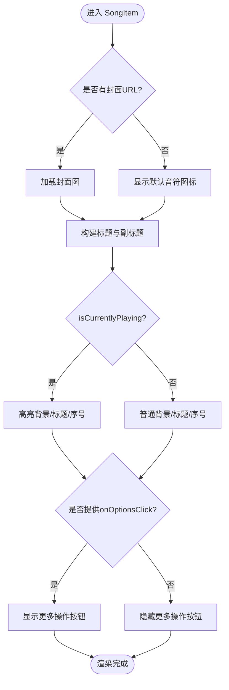
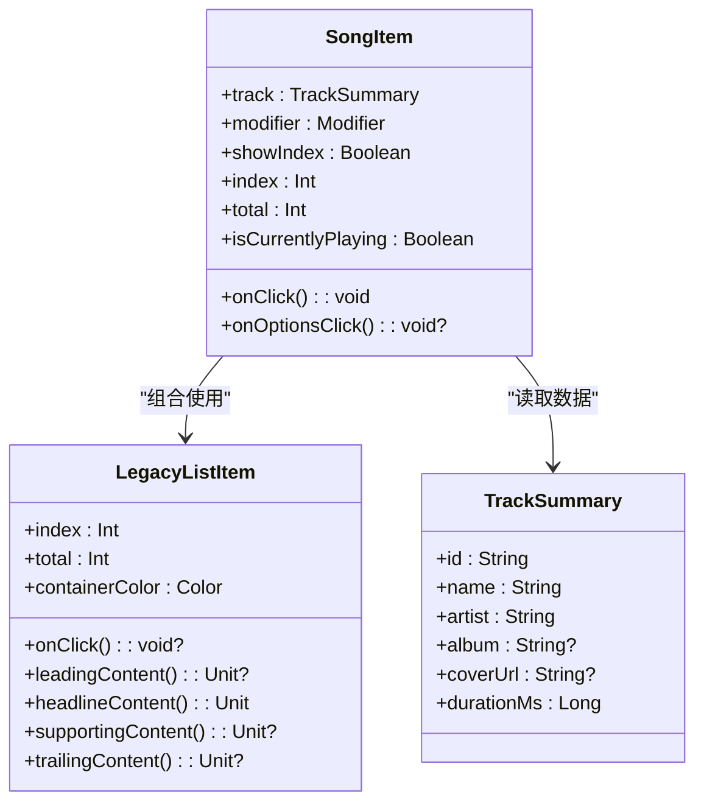

# SongItem 歌曲项组件

<cite>
**本文引用的文件**
- [SongItem.kt](file://app/src/commonMain/kotlin/cp/player/app/ui/component/SongItem.kt)
- [LegacyListItem.kt](file://app/src/commonMain/kotlin/cp/player/app/ui/component/LegacyListItem.kt)
- [MusicSource.kt](file://kmp-pro/src/commonMain/kotlin/cp/player/kmp/music/MusicSource.kt)
- [HomeScreen.kt](file://app/src/commonMain/kotlin/cp/player/app/ui/screen/HomeScreen.kt)
- [LibraryScreen.kt](file://app/src/commonMain/kotlin/cp/player/app/ui/screen/LibraryScreen.kt)
- [SearchScreen.kt](file://app/src/commonMain/kotlin/cp/player/app/ui/screen/SearchScreen.kt)
</cite>

## 目录
1. [简介](#简介)
2. [项目结构](#项目结构)
3. [核心组件](#核心组件)
4. [架构总览](#架构总览)
5. [详细组件分析](#详细组件分析)
6. [依赖关系分析](#依赖关系分析)
7. [性能考量](#性能考量)
8. [故障排查指南](#故障排查指南)
9. [结论](#结论)
10. [附录：使用示例与最佳实践](#附录使用示例与最佳实践)

## 简介
SongItem 是一个用于在列表中展示单首歌曲信息的 Compose 组件，支持显示封面图片、歌曲名称、艺术家与专辑信息，并提供点击主体区域与“更多操作”按钮的回调。该组件基于 LegacyListItem 构建，具备统一的列表项样式与圆角分段效果，同时通过 isCurrentlyPlaying 提供当前播放状态的高亮视觉反馈。

## 项目结构
SongItem 位于应用 UI 组件层，依赖跨平台音乐数据模型 TrackSummary，并通过 LegacyListItem 实现通用列表项布局与交互。

图表来源
- [SongItem.kt:32-129](file://app/src/commonMain/kotlin/cp/player/app/ui/component/SongItem.kt#L32-L129)
- [LegacyListItem.kt:19-65](file://app/src/commonMain/kotlin/cp/player/app/ui/component/LegacyListItem.kt#L19-L65)
- [MusicSource.kt:96-103](file://kmp-pro/src/commonMain/kotlin/cp/player/kmp/music/MusicSource.kt#L96-L103)
- [HomeScreen.kt:190-210](file://app/src/commonMain/kotlin/cp/player/app/ui/screen/HomeScreen.kt#L190-L210)
- [LibraryScreen.kt:220-232](file://app/src/commonMain/kotlin/cp/player/app/ui/screen/LibraryScreen.kt#L220-L232)
- [SearchScreen.kt:165-185](file://app/src/commonMain/kotlin/cp/player/app/ui/screen/SearchScreen.kt#L165-L185)

章节来源
- [SongItem.kt:32-129](file://app/src/commonMain/kotlin/cp/player/app/ui/component/SongItem.kt#L32-L129)
- [LegacyListItem.kt:19-65](file://app/src/commonMain/kotlin/cp/player/app/ui/component/LegacyListItem.kt#L19-L65)
- [MusicSource.kt:96-103](file://kmp-pro/src/commonMain/kotlin/cp/player/kmp/music/MusicSource.kt#L96-L103)

## 核心组件
- SongItem：负责渲染单个歌曲项，包含封面、标题、副标题、可选序号与右侧“更多操作”按钮；处理点击与高亮状态。
- LegacyListItem：通用列表项容器，提供点击、按压缩放、分段圆角与内容槽位（leading/headline/supporting/trailing）。
- TrackSummary：歌曲摘要数据模型，包含 id、name、artist、album、coverUrl、durationMs。

章节来源
- [SongItem.kt:32-129](file://app/src/commonMain/kotlin/cp/player/app/ui/component/SongItem.kt#L32-L129)
- [LegacyListItem.kt:19-65](file://app/src/commonMain/kotlin/cp/player/app/ui/component/LegacyListItem.kt#L19-L65)
- [MusicSource.kt:96-103](file://kmp-pro/src/commonMain/kotlin/cp/player/kmp/music/MusicSource.kt#L96-L103)

## 架构总览
SongItem 将业务数据 TrackSummary 映射为 UI 展示，并委托 LegacyListItem 完成布局与交互。上层屏幕（首页、媒体库、搜索）以列表形式消费 SongItem，绑定数据与事件。

图表来源
- [SongItem.kt:39-129](file://app/src/commonMain/kotlin/cp/player/app/ui/component/SongItem.kt#L39-L129)
- [LegacyListItem.kt:21-53](file://app/src/commonMain/kotlin/cp/player/app/ui/component/LegacyListItem.kt#L21-L53)
- [MusicSource.kt:96-103](file://kmp-pro/src/commonMain/kotlin/cp/player/kmp/music/MusicSource.kt#L96-L103)

## 详细组件分析

### 属性与行为
- track（TrackSummary）：必需。提供歌曲元数据与封面 URL。
- onClick（() -> Unit）：必需。点击主体区域触发，通常用于开始播放或进入详情页。
- onOptionsClick（(() -> Unit)? = null）：可选。点击右侧“更多操作”按钮时触发，常用于弹出菜单或底部表单。
- modifier（Modifier = Modifier）：可选。用于外部修饰布局与尺寸。
- showIndex（Boolean = false）：可选。是否在左侧显示序号。
- index（Int = 0）：当前项索引，配合 total 计算分段圆角。
- total（Int = 0）：列表总数，用于决定首尾项圆角。
- isCurrentlyPlaying（Boolean = false）：是否正在播放。影响背景色、标题字体粗细与颜色。

章节来源
- [SongItem.kt:39-48](file://app/src/commonMain/kotlin/cp/player/app/ui/component/SongItem.kt#L39-L48)

### 视觉样式
- 封面尺寸：固定 56dp，采用圆角矩形裁剪；若无封面则显示默认音符图标。
- 文本溢出：标题与副标题均限制为单行并以省略号截断。
- 当前播放高亮：
  - 容器背景切换为主题主容器色。
  - 标题加粗并使用主题主色。
  - 若启用序号，序号文字也使用主色。
- 右侧“更多操作”：圆形按钮，尺寸 40dp，仅在传入 onOptionsClick 时显示。

章节来源
- [SongItem.kt:57-84](file://app/src/commonMain/kotlin/cp/player/app/ui/component/SongItem.kt#L57-L84)
- [SongItem.kt:86-110](file://app/src/commonMain/kotlin/cp/player/app/ui/component/SongItem.kt#L86-L110)
- [SongItem.kt:112-127](file://app/src/commonMain/kotlin/cp/player/app/ui/component/SongItem.kt#L112-L127)

### 与 LegacyListItem 的关系
- SongItem 通过 LegacyListItem 复用统一列表项布局与交互能力，包括：
  - 点击与按压缩放
  - 分段圆角（首项、末项、中间项不同圆角）
  - 内容槽位：leading（序号+封面）、headline（歌名）、supporting（艺术家·专辑）、trailing（更多操作）
- 继承特性体现在组合而非类继承：SongItem 作为 Composable 组合 LegacyListItem，从而获得其样式与行为。

章节来源
- [LegacyListItem.kt:19-65](file://app/src/commonMain/kotlin/cp/player/app/ui/component/LegacyListItem.kt#L19-L65)
- [SongItem.kt:50-128](file://app/src/commonMain/kotlin/cp/player/app/ui/component/SongItem.kt#L50-L128)

### 数据流与处理逻辑
- 输入：TrackSummary 提供歌曲基本信息与封面 URL。
- 渲染：
  - 封面优先加载图片，否则回退到默认图标。
  - 标题与副标题按规则拼接与截断。
  - 根据 isCurrentlyPlaying 动态调整颜色与字体粗细。
- 输出：onClick 与 onOptionsClick 回调由调用方处理业务逻辑。

图表来源
- [SongItem.kt:57-127](file://app/src/commonMain/kotlin/cp/player/app/ui/component/SongItem.kt#L57-L127)

### 使用示例（来自实际页面）
- 首页最近播放列表：传递 track、index、total，并设置 onClick 播放队列与 onOptionsClick 打开选项面板。
- 媒体库列表：遍历 songs，逐项传入 SongItem，点击后执行 onSongClick。
- 搜索结果列表：每项绑定 onClick 播放队列与 onOptionsClick 打开选项面板。

章节来源
- [HomeScreen.kt:190-210](file://app/src/commonMain/kotlin/cp/player/app/ui/screen/HomeScreen.kt#L190-L210)
- [LibraryScreen.kt:220-232](file://app/src/commonMain/kotlin/cp/player/app/ui/screen/LibraryScreen.kt#L220-L232)
- [SearchScreen.kt:165-185](file://app/src/commonMain/kotlin/cp/player/app/ui/screen/SearchScreen.kt#L165-L185)

## 依赖关系分析
- 直接依赖：
  - LegacyListItem：提供列表项容器与交互。
  - TrackSummary：数据模型，定义歌曲元数据。
- 间接依赖：
  - MaterialTheme：主题颜色与形状。
  - Coil AsyncImage：异步加载封面图。
  - 各页面（Home/Library/Search）：消费 SongItem 并绑定事件。

图表来源
- [SongItem.kt:39-129](file://app/src/commonMain/kotlin/cp/player/app/ui/component/SongItem.kt#L39-L129)
- [LegacyListItem.kt:21-53](file://app/src/commonMain/kotlin/cp/player/app/ui/component/LegacyListItem.kt#L21-L53)
- [MusicSource.kt:96-103](file://kmp-pro/src/commonMain/kotlin/cp/player/kmp/music/MusicSource.kt#L96-L103)

章节来源
- [SongItem.kt:39-129](file://app/src/commonMain/kotlin/cp/player/app/ui/component/SongItem.kt#L39-L129)
- [LegacyListItem.kt:21-53](file://app/src/commonMain/kotlin/cp/player/app/ui/component/LegacyListItem.kt#L21-L53)
- [MusicSource.kt:96-103](file://kmp-pro/src/commonMain/kotlin/cp/player/kmp/music/MusicSource.kt#L96-L103)

## 性能考量
- 封面加载：使用异步图片加载，避免阻塞 UI；建议在上层列表中使用稳定的 key（如 track.id）以提升重组效率。
- 文本溢出：单行截断减少重绘与测量开销。
- 状态更新：isCurrentlyPlaying 变化仅影响少量样式，应尽量减少不必要的 recomposition（例如在列表外层缓存状态）。
- 列表滚动：结合 LazyColumn 的分段圆角与按需渲染，保证长列表流畅性。

[本节为通用指导，不直接分析具体文件]

## 故障排查指南
- 封面不显示：检查 track.coverUrl 是否为空或不可访问；组件在无封面时会显示默认音符图标。
- 文本被截断：确认文本长度与 maxLines=1 的行为是否符合预期；必要时可在上层进行换行或折叠策略。
- 点击无响应：确保 onClick 已正确传入且未被外部 Modifier 拦截；LegacyListItem 会禁用无点击时的交互。
- 更多操作未显示：确认 onOptionsClick 不为 null；否则右侧按钮不会渲染。
- 播放高亮异常：核对 isCurrentlyPlaying 的状态来源与更新时机，确保与播放状态同步。

章节来源
- [SongItem.kt:57-127](file://app/src/commonMain/kotlin/cp/player/app/ui/component/SongItem.kt#L57-L127)
- [LegacyListItem.kt:32-53](file://app/src/commonMain/kotlin/cp/player/app/ui/component/LegacyListItem.kt#L32-L53)

## 结论
SongItem 提供了简洁而强大的歌曲项展示能力，结合 LegacyListItem 的统一样式与 TrackSummary 的数据模型，能够适配多种列表场景。通过 isCurrentlyPlaying 实现清晰的播放状态反馈，并通过 onClick 与 onOptionsClick 解耦业务逻辑，便于在不同页面中复用。

[本节为总结，不直接分析具体文件]

## 附录：使用示例与最佳实践
- 数据绑定：
  - 从列表数据源获取 TrackSummary 列表，逐项传入 SongItem。
  - 使用 index 与 total 确保分段圆角正确。
- 事件处理：
  - onClick：用于播放或跳转详情。
  - onOptionsClick：用于打开选项面板（收藏、加入队列、添加到歌单等）。
- 样式定制：
  - 通过 modifier 控制整体布局与尺寸。
  - 利用 isCurrentlyPlaying 实现高亮；如需自定义颜色，可考虑在上层包裹 Surface 或使用主题扩展。
- 列表优化：
  - 使用稳定 key（track.id）提升重组性能。
  - 合理设置 LazyColumn 的 contentPadding 与间距。

章节来源
- [HomeScreen.kt:190-210](file://app/src/commonMain/kotlin/cp/player/app/ui/screen/HomeScreen.kt#L190-L210)
- [LibraryScreen.kt:220-232](file://app/src/commonMain/kotlin/cp/player/app/ui/screen/LibraryScreen.kt#L220-L232)
- [SearchScreen.kt:165-185](file://app/src/commonMain/kotlin/cp/player/app/ui/screen/SearchScreen.kt#L165-L185)