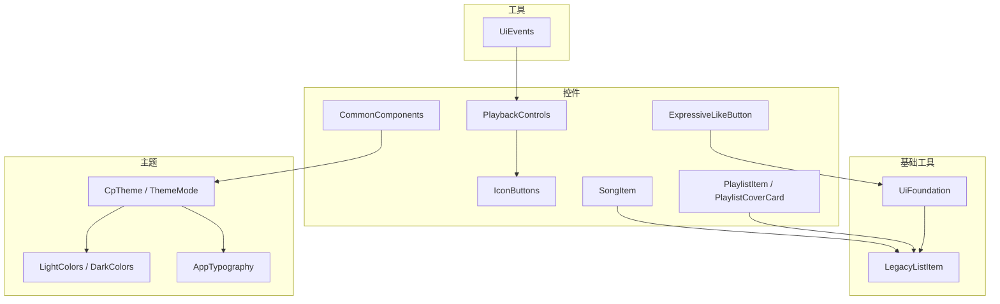
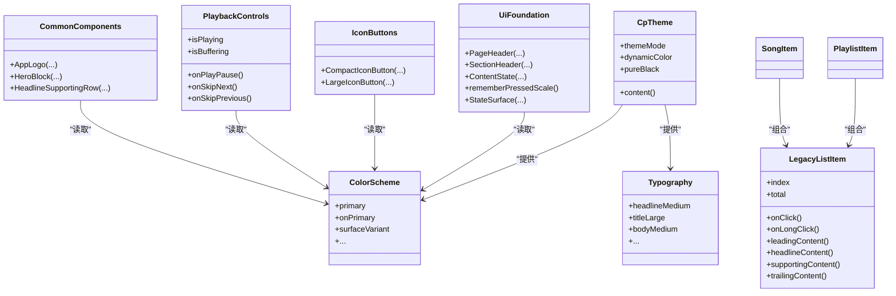
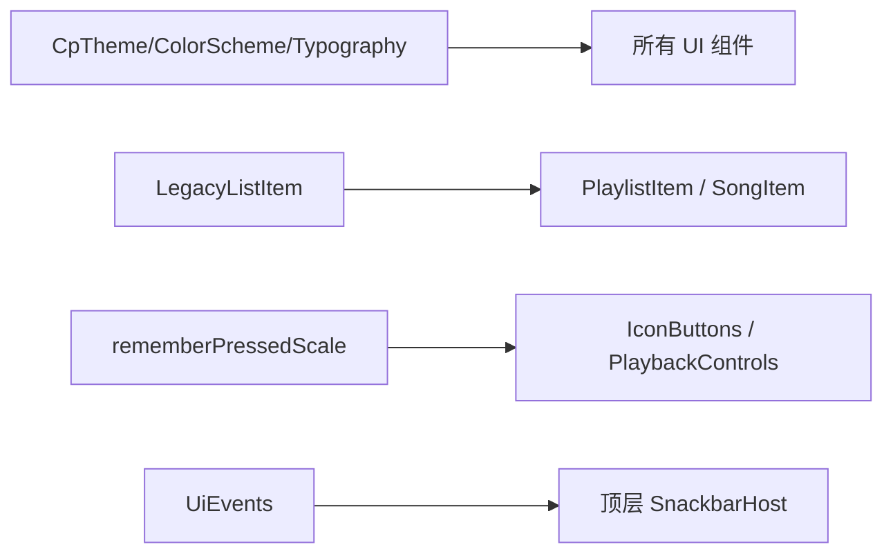

# UI 基础组件

<cite>
**本文引用的文件**
- [UiFoundation.kt](file://app/src/commonMain/kotlin/cp/player/app/ui/component/UiFoundation.kt)
- [IconButtons.kt](file://app/src/commonMain/kotlin/cp/player/app/ui/component/IconButtons.kt)
- [CommonComponents.kt](file://app/src/commonMain/kotlin/cp/player/app/ui/components/CommonComponents.kt)
- [ExpressiveLikeButton.kt](file://app/src/commonMain/kotlin/cp/player/app/ui/component/ExpressiveLikeButton.kt)
- [PlaybackControls.kt](file://app/src/commonMain/kotlin/cp/player/app/ui/component/PlaybackControls.kt)
- [PlaylistCard.kt](file://app/src/commonMain/kotlin/cp/player/app/ui/component/PlaylistCard.kt)
- [SongItem.kt](file://app/src/commonMain/kotlin/cp/player/app/ui/component/SongItem.kt)
- [LegacyListItem.kt](file://app/src/commonMain/kotlin/cp/player/app/ui/component/LegacyListItem.kt)
- [Theme.kt](file://app/src/commonMain/kotlin/cp/player/app/ui/theme/Theme.kt)
- [Color.kt](file://app/src/commonMain/kotlin/cp/player/app/ui/theme/Color.kt)
- [Type.kt](file://app/src/commonMain/kotlin/cp/player/app/ui/theme/Type.kt)
- [UiEvents.kt](file://app/src/commonMain/kotlin/cp/player/app/ui/util/UiEvents.kt)
</cite>

## 目录
1. [简介](#简介)
2. [项目结构](#项目结构)
3. [核心组件](#核心组件)
4. [架构总览](#架构总览)
5. [详细组件分析](#详细组件分析)
6. [依赖关系分析](#依赖关系分析)
7. [性能考量](#性能考量)
8. [故障排查指南](#故障排查指南)
9. [结论](#结论)
10. [附录](#附录)

## 简介
本文件为 CPPlayer-KMP 的 UI 基础组件使用文档，聚焦于 UiFoundation 提供的通用 UI 工具与基础组件，包括布局辅助、状态展示、动画封装、图标按钮、播放控制、列表项与卡片等。文档同时覆盖主题定制、国际化支持与测试方法，并提供在其它组件中复用这些基础组件的最佳实践与示例路径。

## 项目结构
UI 基础能力主要分布在以下模块：
- 通用工具与布局：UiFoundation.kt（页面头部、区块头部、内容状态、按压缩放、状态容器）
- 图标按钮与播放控件：IconButtons.kt、PlaybackControls.kt
- 业务型基础组件：PlaylistCard.kt、SongItem.kt、CommonComponents.kt（Logo、Hero、标题行）
- 列表基元：LegacyListItem.kt（分段圆角、点击/长按、按压动效）
- 主题体系：Theme.kt、Color.kt、Type.kt（颜色、排版、主题入口）
- 全局事件：UiEvents.kt（一次性提示总线）

图表来源
- [UiFoundation.kt:38-182](file://app/src/commonMain/kotlin/cp/player/app/ui/component/UiFoundation.kt#L38-L182)
- [IconButtons.kt:15-54](file://app/src/commonMain/kotlin/cp/player/app/ui/component/IconButtons.kt#L15-L54)
- [PlaybackControls.kt:30-118](file://app/src/commonMain/kotlin/cp/player/app/ui/component/PlaybackControls.kt#L30-L118)
- [ExpressiveLikeButton.kt:21-64](file://app/src/commonMain/kotlin/cp/player/app/ui/component/ExpressiveLikeButton.kt#L21-L64)
- [PlaylistCard.kt:39-185](file://app/src/commonMain/kotlin/cp/player/app/ui/component/PlaylistCard.kt#L39-L185)
- [SongItem.kt:35-149](file://app/src/commonMain/kotlin/cp/player/app/ui/component/SongItem.kt#L35-L149)
- [LegacyListItem.kt:21-83](file://app/src/commonMain/kotlin/cp/player/app/ui/component/LegacyListItem.kt#L21-L83)
- [Theme.kt:11-67](file://app/src/commonMain/kotlin/cp/player/app/ui/theme/Theme.kt#L11-L67)
- [Color.kt:69-98](file://app/src/commonMain/kotlin/cp/player/app/ui/theme/Color.kt#L69-L98)
- [Type.kt:10-27](file://app/src/commonMain/kotlin/cp/player/app/ui/theme/Type.kt#L10-L27)
- [UiEvents.kt:7-22](file://app/src/commonMain/kotlin/cp/player/app/ui/util/UiEvents.kt#L7-L22)

章节来源
- [UiFoundation.kt:38-182](file://app/src/commonMain/kotlin/cp/player/app/ui/component/UiFoundation.kt#L38-L182)
- [IconButtons.kt:15-54](file://app/src/commonMain/kotlin/cp/player/app/ui/component/IconButtons.kt#L15-L54)
- [PlaybackControls.kt:30-118](file://app/src/commonMain/kotlin/cp/player/app/ui/component/PlaybackControls.kt#L30-L118)
- [PlaylistCard.kt:39-185](file://app/src/commonMain/kotlin/cp/player/app/ui/component/PlaylistCard.kt#L39-L185)
- [SongItem.kt:35-149](file://app/src/commonMain/kotlin/cp/player/app/ui/component/SongItem.kt#L35-L149)
- [LegacyListItem.kt:21-83](file://app/src/commonMain/kotlin/cp/player/app/ui/component/LegacyListItem.kt#L21-L83)
- [Theme.kt:11-67](file://app/src/commonMain/kotlin/cp/player/app/ui/theme/Theme.kt#L11-L67)
- [Color.kt:69-98](file://app/src/commonMain/kotlin/cp/player/app/ui/theme/Color.kt#L69-L98)
- [Type.kt:10-27](file://app/src/commonMain/kotlin/cp/player/app/ui/theme/Type.kt#L10-L27)
- [UiEvents.kt:7-22](file://app/src/commonMain/kotlin/cp/player/app/ui/util/UiEvents.kt#L7-L22)

## 核心组件
- 布局与状态
  - PageHeader：页面标题区，支持副标题与右侧操作区。
  - SectionHeader：区块标题区，支持说明文字与右侧操作区。
  - ContentState：统一的内容状态占位（加载中、空态、错误态），可带动作按钮。
  - rememberPressedScale：高强调表面的轻微按压缩放动效封装。
  - StateSurface：统一的状态容器背景。
- 图标按钮
  - CompactIconButton：紧凑圆形图标按钮（常用于 MiniPlayer）。
  - LargeIconButton：大尺寸圆形图标按钮（常用于播放控制）。
- 播放控件
  - PlaybackControls：上一首/播放暂停/下一首组合控件，含缓冲态指示。
- 列表与卡片
  - LegacyListItem：分段圆角列表项，支持点击/长按、按压缩放、三列布局。
  - PlaylistItem：歌单列表项（封面+信息+更多）。
  - PlaylistCoverCard：横向滚动歌单卡片（封面+渐变遮罩+标题）。
  - SongItem：歌曲列表项（封面/序号+信息+更多），支持多选模式与当前播放高亮。
- 通用组件
  - AppLogo：应用 Logo 占位。
  - HeroBlock：标题+描述 Hero 区域。
  - HeadlineSupportingRow：标题+副标题行。
- 主题
  - CpTheme：主题入口，支持跟随系统/浅色/深色、动态取色、纯黑模式。
  - LightColors/DarkColors：Material 3 Expressive 静态回退色板。
  - AppTypography：统一的字号与字重阶梯。
- 工具
  - UiEvents：一次性全局提示事件总线。

章节来源
- [UiFoundation.kt:49-182](file://app/src/commonMain/kotlin/cp/player/app/ui/component/UiFoundation.kt#L49-L182)
- [IconButtons.kt:15-54](file://app/src/commonMain/kotlin/cp/player/app/ui/component/IconButtons.kt#L15-L54)
- [PlaybackControls.kt:30-118](file://app/src/commonMain/kotlin/cp/player/app/ui/component/PlaybackControls.kt#L30-L118)
- [PlaylistCard.kt:39-185](file://app/src/commonMain/kotlin/cp/player/app/ui/component/PlaylistCard.kt#L39-L185)
- [SongItem.kt:35-149](file://app/src/commonMain/kotlin/cp/player/app/ui/component/SongItem.kt#L35-L149)
- [LegacyListItem.kt:21-83](file://app/src/commonMain/kotlin/cp/player/app/ui/component/LegacyListItem.kt#L21-L83)
- [CommonComponents.kt:26-86](file://app/src/commonMain/kotlin/cp/player/app/ui/components/CommonComponents.kt#L26-L86)
- [Theme.kt:11-67](file://app/src/commonMain/kotlin/cp/player/app/ui/theme/Theme.kt#L11-L67)
- [Color.kt:69-98](file://app/src/commonMain/kotlin/cp/player/app/ui/theme/Color.kt#L69-L98)
- [Type.kt:10-27](file://app/src/commonMain/kotlin/cp/player/app/ui/theme/Type.kt#L10-L27)
- [UiEvents.kt:7-22](file://app/src/commonMain/kotlin/cp/player/app/ui/util/UiEvents.kt#L7-L22)

## 架构总览
UI 基础层以 Material 3 为主题底座，通过 CpTheme 注入 ColorScheme、Typography、Shapes；各组件通过 MaterialTheme 获取样式，保证一致性与可定制性。交互反馈通过 rememberPressedScale 与弹簧动画统一实现。列表项基于 LegacyListItem 抽象出三段式布局与分段圆角，上层 PlaylistItem/SongItem 组合数据与图标。

图表来源
- [Theme.kt:31-67](file://app/src/commonMain/kotlin/cp/player/app/ui/theme/Theme.kt#L31-L67)
- [Color.kt:69-98](file://app/src/commonMain/kotlin/cp/player/app/ui/theme/Color.kt#L69-L98)
- [Type.kt:10-27](file://app/src/commonMain/kotlin/cp/player/app/ui/theme/Type.kt#L10-L27)
- [UiFoundation.kt:49-182](file://app/src/commonMain/kotlin/cp/player/app/ui/component/UiFoundation.kt#L49-L182)
- [IconButtons.kt:15-54](file://app/src/commonMain/kotlin/cp/player/app/ui/component/IconButtons.kt#L15-L54)
- [PlaybackControls.kt:30-118](file://app/src/commonMain/kotlin/cp/player/app/ui/component/PlaybackControls.kt#L30-L118)
- [LegacyListItem.kt:21-83](file://app/src/commonMain/kotlin/cp/player/app/ui/component/LegacyListItem.kt#L21-L83)
- [PlaylistCard.kt:39-185](file://app/src/commonMain/kotlin/cp/player/app/ui/component/PlaylistCard.kt#L39-L185)
- [SongItem.kt:35-149](file://app/src/commonMain/kotlin/cp/player/app/ui/component/SongItem.kt#L35-L149)
- [CommonComponents.kt:26-86](file://app/src/commonMain/kotlin/cp/player/app/ui/components/CommonComponents.kt#L26-L86)

## 详细组件分析

### 布局与状态（UiFoundation）
- PageHeader：用于页面顶部标题与可选副标题，右侧可扩展操作区。适合主屏导航或详情页标题。
- SectionHeader：用于区块标题与说明，右侧可扩展操作区。适合分组标题。
- ContentState：统一处理加载、空态、错误态，支持自定义动作按钮。
- rememberPressedScale：为 Surface/按钮提供按压缩放反馈，配合弹簧动画提升触感。
- StateSurface：统一状态容器背景，便于居中放置状态内容。

使用要点
- 通过 MaterialTheme 的颜色与排版保持一致性。
- 在需要按压反馈的交互处优先使用 rememberPressedScale。
- 将 ContentState 作为数据未就绪时的兜底视图。

章节来源
- [UiFoundation.kt:49-182](file://app/src/commonMain/kotlin/cp/player/app/ui/component/UiFoundation.kt#L49-L182)

### 图标按钮（IconButtons）
- CompactIconButton：40dp 圆形按钮，适用于空间紧凑场景（如 MiniPlayer）。
- LargeIconButton：56dp 圆形按钮，适用于主播放控制等大交互区域。

属性接口
- icon：图标矢量
- contentDescription：无障碍描述
- onClick：点击回调
- enabled：是否可用
- tint：图标颜色
- containerColor（仅 LargeIconButton）：容器颜色

使用要点
- 始终提供 contentDescription 以提升可访问性。
- 根据交互密度选择合适尺寸。

章节来源
- [IconButtons.kt:15-54](file://app/src/commonMain/kotlin/cp/player/app/ui/component/IconButtons.kt#L15-L54)

### 收藏按钮（ExpressiveLikeButton）
- 表达性收藏按钮：点击时放大回弹，颜色在收藏/未收藏间平滑切换。
- 参数：isFavorite、onClick、modifier。

使用要点
- 将 isFavorite 交由外部状态管理，点击后更新状态并触发业务逻辑。
- 适合歌曲、专辑、歌单的收藏场景。

章节来源
- [ExpressiveLikeButton.kt:21-64](file://app/src/commonMain/kotlin/cp/player/app/ui/component/ExpressiveLikeButton.kt#L21-L64)

### 播放控件（PlaybackControls）
- 三键布局：上一首/播放暂停/下一首，外层半透明 surfaceVariant 容器，中央按钮 primary 背景。
- 缓冲态：isBuffering 为真时显示 CircularProgressIndicator。
- 参数：isPlaying、isBuffering、onPlayPause、onSkipNext、onSkipPrevious、侧边/中心按钮修饰符、图标尺寸、排列方式。

使用要点
- 将播放状态与缓冲状态与播放器状态同步。
- 可通过 sideButtonModifier/centerButtonModifier 定制尺寸与对齐。

章节来源
- [PlaybackControls.kt:30-118](file://app/src/commonMain/kotlin/cp/player/app/ui/component/PlaybackControls.kt#L30-L118)

### 列表项基元（LegacyListItem）
- 三段式布局：leadingContent、headlineContent、supportingContent、trailingContent。
- 分段圆角：根据 index/total 计算圆角，形成连续列表外观。
- 交互：支持点击与长按（combinedClickable），按压缩放由 rememberPressedScale 提供。

使用要点
- 所有列表项应基于此组件构建，确保一致的视觉与交互。
- 长按场景需显式传入 onLongClick。

章节来源
- [LegacyListItem.kt:21-83](file://app/src/commonMain/kotlin/cp/player/app/ui/component/LegacyListItem.kt#L21-L83)

### 歌单组件（PlaylistCard）
- PlaylistItem：封面 56dp + 歌单名/创建者/曲目数 + 右侧更多按钮。
- PlaylistCoverCard：160dp 正方形封面 + 渐变遮罩 + 底部标题，适合横向滚动。

使用要点
- 无封面时使用默认音乐图标与 surfaceVariant 背景。
- 文本溢出使用省略，避免换行破坏布局。

章节来源
- [PlaylistCard.kt:39-185](file://app/src/commonMain/kotlin/cp/player/app/ui/component/PlaylistCard.kt#L39-L185)

### 歌曲项（SongItem）
- 封面/序号 + 歌名/歌手+专辑 + 更多按钮。
- 支持多选模式（Checkbox）、当前播放高亮、索引显示。
- 使用 LegacyListItem 承载布局与交互。

使用要点
- selectionMode=true 时隐藏更多按钮并显示 Checkbox。
- isCurrentlyPlaying 时高亮标题与序号。

章节来源
- [SongItem.kt:35-149](file://app/src/commonMain/kotlin/cp/player/app/ui/component/SongItem.kt#L35-L149)

### 通用组件（CommonComponents）
- AppLogo：圆形 Logo 占位，默认音乐音符图标。
- HeroBlock：大标题+描述，适合引导页或详情头图。
- HeadlineSupportingRow：标题+副标题行，用于小信息块。

章节来源
- [CommonComponents.kt:26-86](file://app/src/commonMain/kotlin/cp/player/app/ui/components/CommonComponents.kt#L26-L86)

### 主题与样式（Theme）
- CpTheme：主题入口，支持 SYSTEM/LIGHT/DARK、动态取色、纯黑模式。
- LightColors/DarkColors：Material 3 Expressive 静态回退色板。
- AppTypography：统一的字号与字重阶梯。

使用要点
- 在应用根节点包裹 CpTheme，确保全局样式一致。
- 通过 pureBlack 开启 OLED 友好纯黑背景。

章节来源
- [Theme.kt:11-67](file://app/src/commonMain/kotlin/cp/player/app/ui/theme/Theme.kt#L11-L67)
- [Color.kt:69-98](file://app/src/commonMain/kotlin/cp/player/app/ui/theme/Color.kt#L69-L98)
- [Type.kt:10-27](file://app/src/commonMain/kotlin/cp/player/app/ui/theme/Type.kt#L10-L27)

### 全局事件（UiEvents）
- 一次性消息总线：各 Screen/ScreenModel 通过 notify 发送提示，由顶层 SnackbarHost 统一消费。
- 适合“收藏成功”、“已加入队列”等轻提示。

章节来源
- [UiEvents.kt:7-22](file://app/src/commonMain/kotlin/cp/player/app/ui/util/UiEvents.kt#L7-L22)

## 依赖关系分析
- 组件对主题的依赖：所有组件通过 MaterialTheme 读取颜色与排版，降低耦合度，便于主题切换。
- 列表项对 LegacyListItem 的依赖：PlaylistItem、SongItem 均组合该基元，保证一致性。
- 播放控件对图标按钮的复用：内部使用 Surface/Icon 组合，风格与 IconButtons 一致。
- 动画与交互：rememberPressedScale 被列表项与按钮广泛复用，统一触感。

图表来源
- [Theme.kt:31-67](file://app/src/commonMain/kotlin/cp/player/app/ui/theme/Theme.kt#L31-L67)
- [LegacyListItem.kt:21-83](file://app/src/commonMain/kotlin/cp/player/app/ui/component/LegacyListItem.kt#L21-L83)
- [PlaylistCard.kt:39-185](file://app/src/commonMain/kotlin/cp/player/app/ui/component/PlaylistCard.kt#L39-L185)
- [SongItem.kt:35-149](file://app/src/commonMain/kotlin/cp/player/app/ui/component/SongItem.kt#L35-L149)
- [IconButtons.kt:15-54](file://app/src/commonMain/kotlin/cp/player/app/ui/component/IconButtons.kt#L15-L54)
- [PlaybackControls.kt:30-118](file://app/src/commonMain/kotlin/cp/player/app/ui/component/PlaybackControls.kt#L30-L118)
- [UiEvents.kt:7-22](file://app/src/commonMain/kotlin/cp/player/app/ui/util/UiEvents.kt#L7-L22)

章节来源
- [Theme.kt:31-67](file://app/src/commonMain/kotlin/cp/player/app/ui/theme/Theme.kt#L31-L67)
- [LegacyListItem.kt:21-83](file://app/src/commonMain/kotlin/cp/player/app/ui/component/LegacyListItem.kt#L21-L83)
- [PlaylistCard.kt:39-185](file://app/src/commonMain/kotlin/cp/player/app/ui/component/PlaylistCard.kt#L39-L185)
- [SongItem.kt:35-149](file://app/src/commonMain/kotlin/cp/player/app/ui/component/SongItem.kt#L35-L149)
- [IconButtons.kt:15-54](file://app/src/commonMain/kotlin/cp/player/app/ui/component/IconButtons.kt#L15-L54)
- [PlaybackControls.kt:30-118](file://app/src/commonMain/kotlin/cp/player/app/ui/component/PlaybackControls.kt#L30-L118)
- [UiEvents.kt:7-22](file://app/src/commonMain/kotlin/cp/player/app/ui/util/UiEvents.kt#L7-L22)

## 性能考量
- 图片加载：封面使用异步加载并裁剪，建议结合缩略图尺寸以减少内存占用。
- 动画成本：弹簧动画仅在必要时启用（如收藏按钮、按压缩放），避免在长列表中频繁触发。
- 列表渲染：使用 LegacyListItem 的分段圆角与最小化重组，减少不必要的 recomposition。
- 主题切换：CpTheme 在根节点设置一次，避免重复重建。

[本节为通用指导，不直接分析具体文件]

## 故障排查指南
- 主题颜色异常
  - 检查是否在应用根节点包裹了 CpTheme。
  - 确认 themeMode 与 dynamicColor 配置是否符合预期。
- 列表项点击无效
  - 若需长按，请传入 onLongClick，否则使用 Surface 自带 onClick。
  - 确认 LegacyListItem 的 enabled 状态与 onClick 是否为空。
- 播放控件缓冲态不显示
  - 检查 isBuffering 状态是否与播放器状态同步。
- 收藏按钮状态不同步
  - 确保 isFavorite 由外部状态驱动，并在 onClick 中更新。
- 全局提示未显示
  - 确认顶层存在 SnackbarHost 并订阅 UiEvents.messages。

章节来源
- [Theme.kt:31-67](file://app/src/commonMain/kotlin/cp/player/app/ui/theme/Theme.kt#L31-L67)
- [LegacyListItem.kt:21-83](file://app/src/commonMain/kotlin/cp/player/app/ui/component/LegacyListItem.kt#L21-L83)
- [PlaybackControls.kt:30-118](file://app/src/commonMain/kotlin/cp/player/app/ui/component/PlaybackControls.kt#L30-L118)
- [ExpressiveLikeButton.kt:21-64](file://app/src/commonMain/kotlin/cp/player/app/ui/component/ExpressiveLikeButton.kt#L21-L64)
- [UiEvents.kt:7-22](file://app/src/commonMain/kotlin/cp/player/app/ui/util/UiEvents.kt#L7-L22)

## 结论
UiFoundation 与相关基础组件提供了统一的布局、状态、动画与主题能力，配合 LegacyListItem 与业务型组件（PlaylistItem、SongItem）可快速构建一致的界面。通过 CpTheme 进行主题定制，借助 UiEvents 实现轻量全局提示，满足跨平台 Compose 的多端一致性需求。

[本节为总结，不直接分析具体文件]

## 附录

### 设计原则与命名约定
- 设计原则
  - 单一职责：每个组件专注一种用途（如按钮、列表项、状态占位）。
  - 可组合：通过 leading/headline/supporting/trailing 插槽组合复杂列表项。
  - 可主题化：全部样式来自 MaterialTheme，避免硬编码颜色与字号。
  - 可访问性：为图标与按钮提供 contentDescription。
- 命名约定
  - 组件以功能命名：如 PlaybackControls、PlaylistItem、SongItem。
  - 工具函数以动词开头：如 rememberPressedScale。
  - 主题常量以语义命名：如 PrimaryLight、OnSurfaceVariantDark。

[本节为通用指导，不直接分析具体文件]

### 主题定制
- 切换主题模式：在 CpTheme 中设置 themeMode（SYSTEM/LIGHT/DARK）。
- 启用动态取色：Android 12+ 可开启 dynamicColor。
- 纯黑模式：设置 pureBlack 以获得 OLED 友好的黑色背景。
- 自定义色板：替换 LightColors/DarkColors 中的 ColorScheme。

章节来源
- [Theme.kt:31-67](file://app/src/commonMain/kotlin/cp/player/app/ui/theme/Theme.kt#L31-L67)
- [Color.kt:69-98](file://app/src/commonMain/kotlin/cp/player/app/ui/theme/Color.kt#L69-L98)

### 国际化支持
- 文案抽取：将 title、subtitle、actionLabel 等字符串抽离至资源文件。
- 组件适配：在调用处传入本地化后的字符串，保持组件无语言耦合。
- 方向与排版：通过 AppTypography 与 MaterialTheme 自动适配多语言排版。

[本节为通用指导，不直接分析具体文件]

### 测试方法
- 单元测试
  - 对纯函数（如 legacySegmentShape）进行断言，验证分段圆角逻辑。
- 组合测试
  - 使用 Compose 测试框架渲染组件树，校验可见元素与交互行为（如点击、长按）。
- 主题测试
  - 在不同主题模式下验证颜色与排版是否正确应用。
- 事件流测试
  - 模拟 UiEvents.notify 并验证 SnackbarHost 消费消息。

章节来源
- [LegacyListItem.kt:73-83](file://app/src/commonMain/kotlin/cp/player/app/ui/component/LegacyListItem.kt#L73-L83)
- [UiEvents.kt:7-22](file://app/src/commonMain/kotlin/cp/player/app/ui/util/UiEvents.kt#L7-L22)

### 代码示例路径（引用而非粘贴）
- 页面头部与区块头部
  - [PageHeader/SectionHeader 用法参考:49-108](file://app/src/commonMain/kotlin/cp/player/app/ui/component/UiFoundation.kt#L49-L108)
- 内容状态占位
  - [ContentState 用法参考:110-150](file://app/src/commonMain/kotlin/cp/player/app/ui/component/UiFoundation.kt#L110-L150)
- 按压缩放封装
  - [rememberPressedScale 用法参考:152-167](file://app/src/commonMain/kotlin/cp/player/app/ui/component/UiFoundation.kt#L152-L167)
- 图标按钮
  - [CompactIconButton 用法参考:15-33](file://app/src/commonMain/kotlin/cp/player/app/ui/component/IconButtons.kt#L15-L33)
  - [LargeIconButton 用法参考:35-54](file://app/src/commonMain/kotlin/cp/player/app/ui/component/IconButtons.kt#L35-L54)
- 收藏按钮
  - [ExpressiveLikeButton 用法参考:21-64](file://app/src/commonMain/kotlin/cp/player/app/ui/component/ExpressiveLikeButton.kt#L21-L64)
- 播放控件
  - [PlaybackControls 用法参考:30-118](file://app/src/commonMain/kotlin/cp/player/app/ui/component/PlaybackControls.kt#L30-L118)
- 列表项基元
  - [LegacyListItem 用法参考:21-83](file://app/src/commonMain/kotlin/cp/player/app/ui/component/LegacyListItem.kt#L21-L83)
- 歌单组件
  - [PlaylistItem 用法参考:45-125](file://app/src/commonMain/kotlin/cp/player/app/ui/component/PlaylistCard.kt#L45-L125)
  - [PlaylistCoverCard 用法参考:132-185](file://app/src/commonMain/kotlin/cp/player/app/ui/component/PlaylistCard.kt#L132-L185)
- 歌曲项
  - [SongItem 用法参考:42-149](file://app/src/commonMain/kotlin/cp/player/app/ui/component/SongItem.kt#L42-L149)
- 通用组件
  - [AppLogo/HeroBlock/HeadlineSupportingRow 用法参考:26-86](file://app/src/commonMain/kotlin/cp/player/app/ui/components/CommonComponents.kt#L26-L86)
- 主题入口
  - [CpTheme 用法参考:31-67](file://app/src/commonMain/kotlin/cp/player/app/ui/theme/Theme.kt#L31-L67)
- 全局提示
  - [UiEvents 用法参考:7-22](file://app/src/commonMain/kotlin/cp/player/app/ui/util/UiEvents.kt#L7-L22)