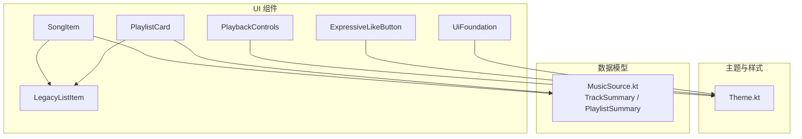
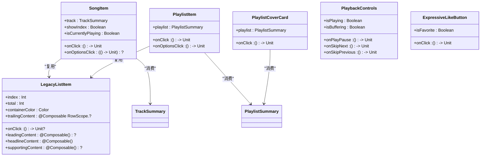
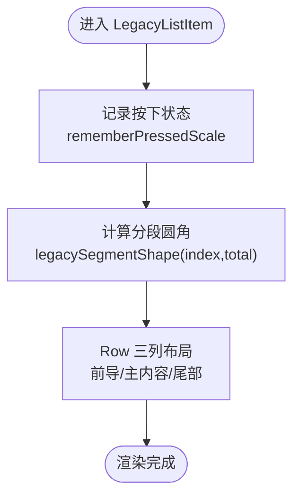
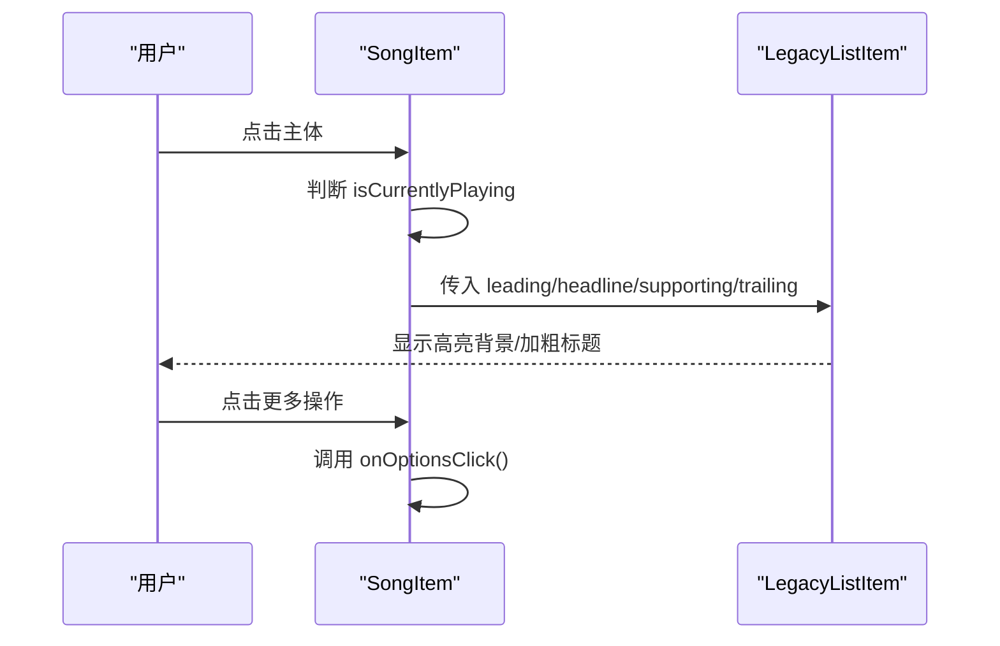
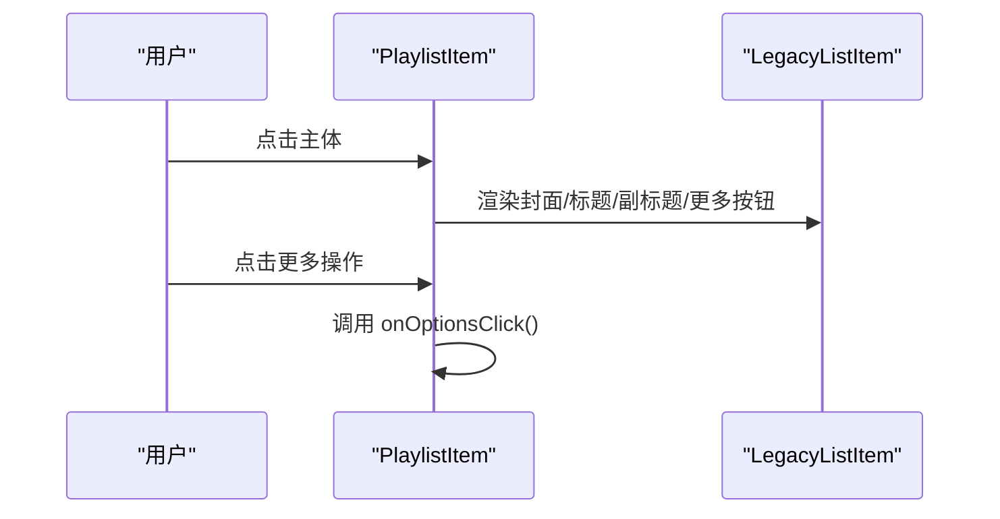
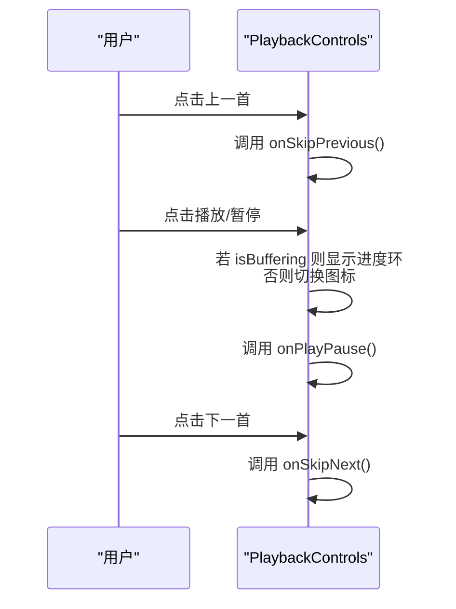
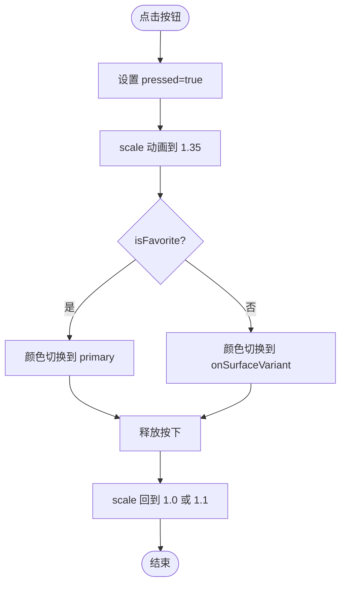
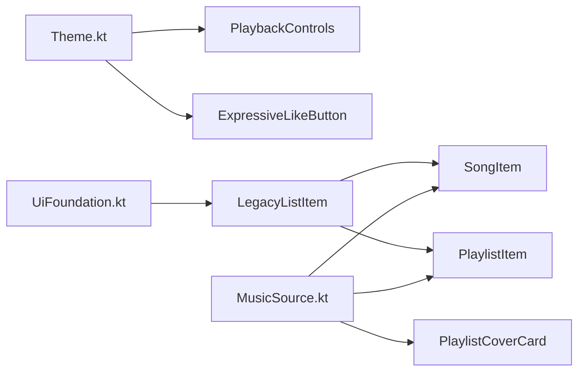

# UI 组件库

<cite>
**本文引用的文件**
- [SongItem.kt](file://app/src/commonMain/kotlin/cp/player/app/ui/component/SongItem.kt)
- [PlaylistCard.kt](file://app/src/commonMain/kotlin/cp/player/app/ui/component/PlaylistCard.kt)
- [PlaybackControls.kt](file://app/src/commonMain/kotlin/cp/player/app/ui/component/PlaybackControls.kt)
- [LegacyListItem.kt](file://app/src/commonMain/kotlin/cp/player/app/ui/component/LegacyListItem.kt)
- [ExpressiveLikeButton.kt](file://app/src/commonMain/kotlin/cp/player/app/ui/component/ExpressiveLikeButton.kt)
- [UiFoundation.kt](file://app/src/commonMain/kotlin/cp/player/app/ui/component/UiFoundation.kt)
- [Theme.kt](file://app/src/commonMain/kotlin/cp/player/app/ui/theme/Theme.kt)
- [MusicSource.kt](file://kmp-pro/src/commonMain/kotlin/cp/player/kmp/music/MusicSource.kt)
</cite>

## 目录
1. [简介](#简介)
2. [项目结构](#项目结构)
3. [核心组件](#核心组件)
4. [架构总览](#架构总览)
5. [详细组件分析](#详细组件分析)
6. [依赖关系分析](#依赖关系分析)
7. [性能考虑](#性能考虑)
8. [故障排查指南](#故障排查指南)
9. [结论](#结论)
10. [附录：使用示例与最佳实践](#附录使用示例与最佳实践)

## 简介
本开发文档面向可复用的 UI 组件，覆盖 SongItem（歌曲项）、PlaylistCard（播放列表卡片）、PlaybackControls（播放控制）、LegacyListItem（遗留列表项）和 ExpressiveLikeButton（表达性点赞按钮）。文档从设计模式、属性接口、事件回调、样式定制、组合方式、状态管理、动画效果、用户交互、响应式适配、无障碍访问与性能优化等维度进行系统化说明，并提供丰富的代码级引用路径，帮助开发者快速理解并正确扩展这些组件。

## 项目结构
UI 组件位于 app 模块的 commonMain 中，遵循 Compose Multiplatform 规范；数据模型位于 kmp-pro 模块的 commonMain 中，供 UI 层消费。主题系统通过 Material3 提供颜色、排版与形状，支持动态取色与纯黑模式。

图表来源
- [SongItem.kt:38-129](file://app/src/commonMain/kotlin/cp/player/app/ui/component/SongItem.kt#L38-L129)
- [PlaylistCard.kt:45-184](file://app/src/commonMain/kotlin/cp/player/app/ui/component/PlaylistCard.kt#L45-L184)
- [PlaybackControls.kt:37-118](file://app/src/commonMain/kotlin/cp/player/app/ui/component/PlaybackControls.kt#L37-L118)
- [LegacyListItem.kt:20-66](file://app/src/commonMain/kotlin/cp/player/app/ui/component/LegacyListItem.kt#L20-L66)
- [ExpressiveLikeButton.kt:24-64](file://app/src/commonMain/kotlin/cp/player/app/ui/component/ExpressiveLikeButton.kt#L24-L64)
- [UiFoundation.kt:152-167](file://app/src/commonMain/kotlin/cp/player/app/ui/component/UiFoundation.kt#L152-L167)
- [Theme.kt:31-65](file://app/src/commonMain/kotlin/cp/player/app/ui/theme/Theme.kt#L31-L65)
- [MusicSource.kt:76-103](file://kmp-pro/src/commonMain/kotlin/cp/player/kmp/music/MusicSource.kt#L76-L103)

章节来源
- [Theme.kt:31-65](file://app/src/commonMain/kotlin/cp/player/app/ui/theme/Theme.kt#L31-L65)
- [MusicSource.kt:76-103](file://kmp-pro/src/commonMain/kotlin/cp/player/kmp/music/MusicSource.kt#L76-L103)

## 核心组件
- LegacyListItem：通用列表行容器，负责点击态缩放、分段圆角、三列布局（前导内容、主标题+副标题、尾部操作）。
- SongItem：基于 LegacyListItem 的歌曲项，展示封面、歌名、歌手/专辑，支持当前播放高亮与更多操作按钮。
- PlaylistCard：包含 PlaylistItem（列表项）与 PlaylistCoverCard（横向卡片），分别用于列表与网格场景。
- PlaybackControls：播放控制条，上一首/播放暂停/下一首，支持缓冲态指示与尺寸定制。
- ExpressiveLikeButton：收藏按钮，带弹簧放大回弹与颜色渐变切换。

章节来源
- [LegacyListItem.kt:20-66](file://app/src/commonMain/kotlin/cp/player/app/ui/component/LegacyListItem.kt#L20-L66)
- [SongItem.kt:38-129](file://app/src/commonMain/kotlin/cp/player/app/ui/component/SongItem.kt#L38-L129)
- [PlaylistCard.kt:45-184](file://app/src/commonMain/kotlin/cp/player/app/ui/component/PlaylistCard.kt#L45-L184)
- [PlaybackControls.kt:37-118](file://app/src/commonMain/kotlin/cp/player/app/ui/component/PlaybackControls.kt#L37-L118)
- [ExpressiveLikeButton.kt:24-64](file://app/src/commonMain/kotlin/cp/player/app/ui/component/ExpressiveLikeButton.kt#L24-L64)

## 架构总览
组件以“基础容器 + 业务视图”的分层组织：
- 基础容器：LegacyListItem 提供统一的点击反馈、分段圆角与三列布局。
- 业务视图：SongItem、PlaylistItem、PlaylistCoverCard 复用 LegacyListItem 或独立构建。
- 控制组件：PlaybackControls、ExpressiveLikeButton 作为独立可组合函数，直接消费主题与动画能力。
- 数据契约：TrackSummary、PlaylistSummary 定义最小必要字段，保证跨平台一致性。

图表来源
- [LegacyListItem.kt:20-66](file://app/src/commonMain/kotlin/cp/player/app/ui/component/LegacyListItem.kt#L20-L66)
- [SongItem.kt:38-129](file://app/src/commonMain/kotlin/cp/player/app/ui/component/SongItem.kt#L38-L129)
- [PlaylistCard.kt:45-184](file://app/src/commonMain/kotlin/cp/player/app/ui/component/PlaylistCard.kt#L45-L184)
- [PlaybackControls.kt:37-118](file://app/src/commonMain/kotlin/cp/player/app/ui/component/PlaybackControls.kt#L37-L118)
- [ExpressiveLikeButton.kt:24-64](file://app/src/commonMain/kotlin/cp/player/app/ui/component/ExpressiveLikeButton.kt#L24-L64)
- [MusicSource.kt:76-103](file://kmp-pro/src/commonMain/kotlin/cp/player/kmp/music/MusicSource.kt#L76-L103)

## 详细组件分析

### LegacyListItem（遗留列表项）
- 职责：统一列表行的点击反馈、分段圆角、三列布局（前导内容、主标题+副标题、尾部操作）。
- 关键特性：
  - 点击缩放：通过 rememberPressedScale 实现轻微压缩动画。
  - 分段圆角：legacySegmentShape 根据 index/total 计算首尾与中间项的圆角。
  - 可配置容器颜色与可选的前导/尾部内容。
- 复杂度：O(1)，仅布局与少量状态。
- 无障碍：Surface 默认支持焦点与语义；建议为图标提供 contentDescription。
- 扩展点：可通过 containerColor、leadingContent、trailingContent 自定义外观与行为。

图表来源
- [LegacyListItem.kt:20-66](file://app/src/commonMain/kotlin/cp/player/app/ui/component/LegacyListItem.kt#L20-L66)
- [UiFoundation.kt:152-167](file://app/src/commonMain/kotlin/cp/player/app/ui/component/UiFoundation.kt#L152-L167)

章节来源
- [LegacyListItem.kt:20-66](file://app/src/commonMain/kotlin/cp/player/app/ui/component/LegacyListItem.kt#L20-L66)
- [UiFoundation.kt:152-167](file://app/src/commonMain/kotlin/cp/player/app/ui/component/UiFoundation.kt#L152-L167)

### SongItem（歌曲项）
- 职责：展示歌曲封面、名称、歌手/专辑，支持当前播放高亮与更多操作。
- 属性接口：
  - track: TrackSummary（来自 MusicSource.kt）
  - onClick: 点击主体区域触发
  - onOptionsClick: 可选，点击右侧 MoreVert 触发
  - showIndex/index/total: 是否显示序号及序号信息
  - isCurrentlyPlaying: 当前播放高亮（背景、文字加粗、主色调）
- 样式定制：
  - 封面占位：无图时显示音乐音符图标
  - 文本溢出：单行省略
  - 主题色：使用 MaterialTheme.colorScheme 相关色
- 交互与状态：
  - 点击主体触发 onClick
  - 更多操作按钮触发 onOptionsClick
  - 当前播放状态影响视觉呈现
- 无障碍：
  - 封面图片 contentDescription 为空（装饰性）
  - 更多操作按钮提供 contentDescription
- 性能：
  - 图片加载使用 AsyncImage，按需裁剪
  - 避免不必要的 recomposition（参数稳定）

图表来源
- [SongItem.kt:38-129](file://app/src/commonMain/kotlin/cp/player/app/ui/component/SongItem.kt#L38-L129)
- [LegacyListItem.kt:20-66](file://app/src/commonMain/kotlin/cp/player/app/ui/component/LegacyListItem.kt#L20-L66)

章节来源
- [SongItem.kt:38-129](file://app/src/commonMain/kotlin/cp/player/app/ui/component/SongItem.kt#L38-L129)
- [MusicSource.kt:96-103](file://kmp-pro/src/commonMain/kotlin/cp/player/kmp/music/MusicSource.kt#L96-L103)

### PlaylistCard（播放列表卡片）
- PlaylistItem（列表项）：
  - 基于 LegacyListItem，展示封面、歌单名、创建者与曲目数，右侧更多操作按钮。
  - 封面占位：无图时使用队列图标。
  - 文本溢出：单行省略。
- PlaylistCoverCard（横向卡片）：
  - 正方形封面 + 渐变叠加层 + 底部歌单名。
  - 点击触发导航或详情打开。
- 数据契约：
  - playlist: PlaylistSummary（来自 MusicSource.kt）
- 无障碍：
  - 封面图片 contentDescription 为空（装饰性）
  - 更多操作按钮提供 contentDescription
- 性能：
  - 图片裁剪与渐变叠加减少重绘开销

图表来源
- [PlaylistCard.kt:45-125](file://app/src/commonMain/kotlin/cp/player/app/ui/component/PlaylistCard.kt#L45-L125)
- [LegacyListItem.kt:20-66](file://app/src/commonMain/kotlin/cp/player/app/ui/component/LegacyListItem.kt#L20-L66)

章节来源
- [PlaylistCard.kt:45-184](file://app/src/commonMain/kotlin/cp/player/app/ui/component/PlaylistCard.kt#L45-L184)
- [MusicSource.kt:76-82](file://kmp-pro/src/commonMain/kotlin/cp/player/kmp/music/MusicSource.kt#L76-L82)

### PlaybackControls（播放控制）
- 职责：提供上一首/播放暂停/下一首三个主要操作，支持缓冲态指示。
- 属性接口：
  - isPlaying: 当前播放状态
  - isBuffering: 缓冲中状态（显示进度环）
  - onPlayPause/onSkipNext/onSkipPrevious: 回调
  - sideButtonModifier/centerButtonModifier: 侧边与中心按钮修饰符
  - sideIconSize/centerIconSize: 图标尺寸
  - horizontalArrangement: 水平排列方式
- 样式定制：
  - 外层圆形 Surface，半透明 surfaceVariant 背景
  - 中心按钮 primary 色，圆角 24dp，白色图标
  - 缓冲态用 CircularProgressIndicator 替代播放/暂停图标
- 交互与状态：
  - 点击切换播放/暂停
  - 缓冲态自动切换图标与进度指示
- 无障碍：
  - 每个按钮提供 contentDescription（如 Previous、Play/Pause、Next）
- 性能：
  - 条件渲染避免多余重组
  - 图标尺寸可控，减少过大绘制

图表来源
- [PlaybackControls.kt:37-118](file://app/src/commonMain/kotlin/cp/player/app/ui/component/PlaybackControls.kt#L37-L118)

章节来源
- [PlaybackControls.kt:37-118](file://app/src/commonMain/kotlin/cp/player/app/ui/component/PlaybackControls.kt#L37-L118)

### ExpressiveLikeButton（表达性点赞按钮）
- 职责：收藏按钮，点击时低阻尼弹簧放大回弹，颜色渐变切换。
- 属性接口：
  - isFavorite: 是否已收藏
  - onClick: 点击回调
  - modifier: 修饰符
- 动画与交互：
  - 按下时 scale 放大至 1.35，松开后回弹
  - 收藏状态下保持轻微放大 1.1
  - 颜色在 primary 与 onSurfaceVariant 之间平滑过渡
- 无障碍：
  - 根据 isFavorite 提供不同的 contentDescription（收藏/取消收藏）
- 性能：
  - 使用 animateFloatAsState/animateColorAsState 高效动画
  - 内部 pressed 状态本地管理，避免外部状态抖动

图表来源
- [ExpressiveLikeButton.kt:24-64](file://app/src/commonMain/kotlin/cp/player/app/ui/component/ExpressiveLikeButton.kt#L24-L64)

章节来源
- [ExpressiveLikeButton.kt:24-64](file://app/src/commonMain/kotlin/cp/player/app/ui/component/ExpressiveLikeButton.kt#L24-L64)

## 依赖关系分析
- 组件对主题的依赖：所有组件通过 MaterialTheme 获取颜色、排版与形状，确保一致的主题体验。
- 组件对数据模型的依赖：SongItem 与 PlaylistCard 消费 TrackSummary 与 PlaylistSummary，保证数据契约稳定。
- 基础能力：UiFoundation 提供 rememberPressedScale 与页面间距常量，被 LegacyListItem 复用。

图表来源
- [Theme.kt:31-65](file://app/src/commonMain/kotlin/cp/player/app/ui/theme/Theme.kt#L31-L65)
- [UiFoundation.kt:152-167](file://app/src/commonMain/kotlin/cp/player/app/ui/component/UiFoundation.kt#L152-L167)
- [LegacyListItem.kt:20-66](file://app/src/commonMain/kotlin/cp/player/app/ui/component/LegacyListItem.kt#L20-L66)
- [SongItem.kt:38-129](file://app/src/commonMain/kotlin/cp/player/app/ui/component/SongItem.kt#L38-L129)
- [PlaylistCard.kt:45-184](file://app/src/commonMain/kotlin/cp/player/app/ui/component/PlaylistCard.kt#L45-L184)
- [MusicSource.kt:76-103](file://kmp-pro/src/commonMain/kotlin/cp/player/kmp/music/MusicSource.kt#L76-L103)

章节来源
- [Theme.kt:31-65](file://app/src/commonMain/kotlin/cp/player/app/ui/theme/Theme.kt#L31-L65)
- [MusicSource.kt:76-103](file://kmp-pro/src/commonMain/kotlin/cp/player/kmp/music/MusicSource.kt#L76-L103)

## 性能考虑
- 图片加载：使用 AsyncImage 并指定 ContentScale.Crop，减少大图绘制成本；无图时提供轻量占位图标。
- 动画效率：使用 animateFloatAsState/animateColorAsState，配合 spring 配置获得流畅反馈。
- 布局优化：LegacyListItem 使用固定内边距与 Row 布局，避免复杂嵌套；分段圆角仅在必要时计算。
- 重组控制：组件参数尽量不可变，避免频繁 recomposition；局部状态（如 pressed）在组件内管理。
- 主题适配：通过 MaterialTheme 统一资源，减少重复样式定义。

[本节为通用性能指导，不直接分析具体文件]

## 故障排查指南
- 图片未显示：检查 coverUrl 是否为空；若无图将显示占位图标。确认网络权限与图片 URL 有效性。
- 点击无反馈：确认 onClick 已传入且非 null；LegacyListItem 仅在 onClick != null 时启用点击缩放。
- 缓冲态异常：PlaybackControls 的 isBuffering 应与服务端状态同步；若持续显示进度环，检查状态更新逻辑。
- 主题不一致：确保应用包裹 CpTheme，并使用 MaterialTheme 提供的颜色与形状；避免硬编码颜色。
- 无障碍缺失：为图标与按钮提供合适的 contentDescription，便于屏幕阅读器识别。

章节来源
- [SongItem.kt:73-82](file://app/src/commonMain/kotlin/cp/player/app/ui/component/SongItem.kt#L73-L82)
- [PlaylistCard.kt:65-78](file://app/src/commonMain/kotlin/cp/player/app/ui/component/PlaylistCard.kt#L65-L78)
- [PlaybackControls.kt:85-97](file://app/src/commonMain/kotlin/cp/player/app/ui/component/PlaybackControls.kt#L85-L97)
- [Theme.kt:31-65](file://app/src/commonMain/kotlin/cp/player/app/ui/theme/Theme.kt#L31-L65)

## 结论
本 UI 组件库以 LegacyListItem 为基础，结合 Material3 主题与 Compose 动画，提供了高内聚、低耦合的可复用组件。SongItem、PlaylistCard、PlaybackControls、ExpressiveLikeButton 均具备良好的扩展性与可定制性，适用于多端场景。通过明确的数据契约与主题抽象，组件在不同平台与主题下保持一致的视觉与交互体验。

[本节为总结性内容，不直接分析具体文件]

## 附录：使用示例与最佳实践
- 组合 SongItem 与 LegacyListItem：
  - 使用 showIndex/index/total 展示序号与总数
  - 通过 isCurrentlyPlaying 高亮当前播放项
  - 提供 onOptionsClick 以展开更多操作
  - 参考路径：[SongItem.kt:38-129](file://app/src/commonMain/kotlin/cp/player/app/ui/component/SongItem.kt#L38-L129)、[LegacyListItem.kt:20-66](file://app/src/commonMain/kotlin/cp/player/app/ui/component/LegacyListItem.kt#L20-L66)
- 使用 PlaylistItem 与 PlaylistCoverCard：
  - 列表场景使用 PlaylistItem，网格场景使用 PlaylistCoverCard
  - 封面图缺失时自动降级为占位图标
  - 参考路径：[PlaylistCard.kt:45-184](file://app/src/commonMain/kotlin/cp/player/app/ui/component/PlaylistCard.kt#L45-L184)
- 集成 PlaybackControls：
  - 将 isPlaying/isBuffering 与播放器状态同步
  - 通过 sideButtonModifier/centerButtonModifier 调整按钮尺寸与布局
  - 参考路径：[PlaybackControls.kt:37-118](file://app/src/commonMain/kotlin/cp/player/app/ui/component/PlaybackControls.kt#L37-L118)
- 使用 ExpressiveLikeButton：
  - 将 isFavorite 与收藏状态绑定
  - 利用内置动画提升交互反馈
  - 参考路径：[ExpressiveLikeButton.kt:24-64](file://app/src/commonMain/kotlin/cp/player/app/ui/component/ExpressiveLikeButton.kt#L24-L64)
- 主题与响应式：
  - 使用 CpTheme 包裹应用，启用动态取色或纯黑模式
  - 通过 LocalIsExpanded 判断窗口宽度以调整布局（由上层提供）
  - 参考路径：[Theme.kt:31-65](file://app/src/commonMain/kotlin/cp/player/app/ui/theme/Theme.kt#L31-L65)、[UiFoundation.kt:38-47](file://app/src/commonMain/kotlin/cp/player/app/ui/component/UiFoundation.kt#L38-L47)

[本节为使用指引，不直接分析具体文件]