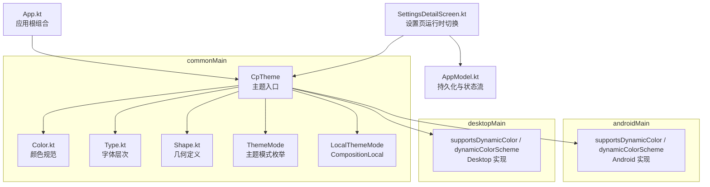
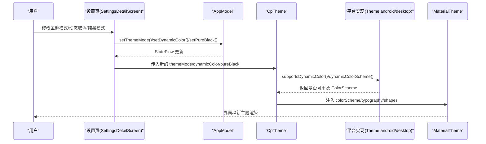
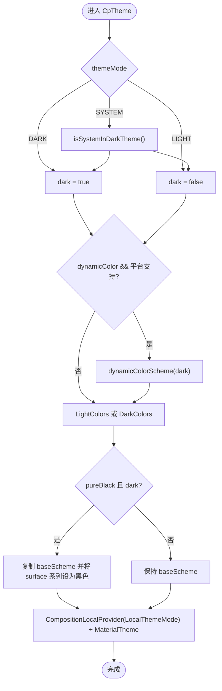
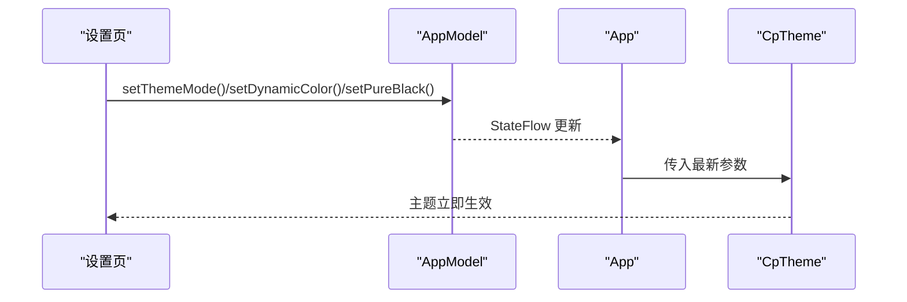
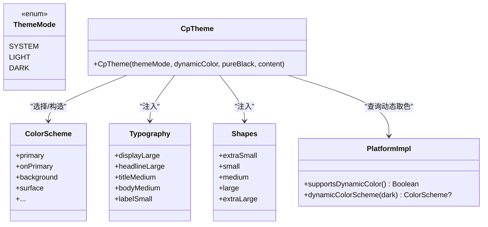
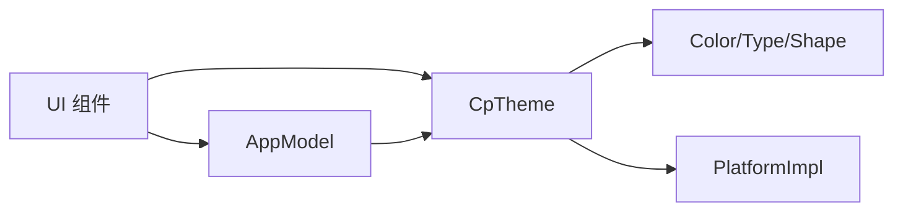

# 主题系统与样式

<cite>
**本文引用的文件**
- [Color.kt](file://app/src/commonMain/kotlin/cp/player/app/ui/theme/Color.kt)
- [Type.kt](file://app/src/commonMain/kotlin/cp/player/app/ui/theme/Type.kt)
- [Shape.kt](file://app/src/commonMain/kotlin/cp/player/app/ui/theme/Shape.kt)
- [Theme.kt](file://app/src/commonMain/kotlin/cp/player/app/ui/theme/Theme.kt)
- [Theme.android.kt](file://app/src/androidMain/kotlin/cp/player/app/ui/theme/Theme.android.kt)
- [Theme.desktop.kt](file://app/src/desktopMain/kotlin/cp/player/app/ui/theme/Theme.desktop.kt)
- [App.kt](file://app/src/commonMain/kotlin/cp/player/app/App.kt)
- [AppModel.kt](file://app/src/commonMain/kotlin/cp/player/app/AppModel.kt)
- [SettingsDetailScreen.kt](file://app/src/commonMain/kotlin/cp/player/app/ui/screen/SettingsDetailScreen.kt)
</cite>

## 目录
1. [简介](#简介)
2. [项目结构](#项目结构)
3. [核心组件](#核心组件)
4. [架构总览](#架构总览)
5. [详细组件分析](#详细组件分析)
6. [依赖关系分析](#依赖关系分析)
7. [性能考量](#性能考量)
8. [故障排查指南](#故障排查指南)
9. [结论](#结论)
10. [附录](#附录)

## 简介
本技术文档围绕基于 Material Design 3 的主题系统，系统性说明颜色、字体排版、形状定义与暗色模式支持；记录 Theme 组件配置项、动态主题切换机制与平台特定适配；并给出扩展主题、创建自定义样式与品牌化设计的实践方法。重点强调跨平台一致性与响应式设计原则，确保在 Android 与桌面端获得统一且可定制的视觉体验。

## 项目结构
主题相关代码集中在 app 模块的 ui/theme 包中，采用 Compose Multiplatform 的分平台实现：
- commonMain：定义通用主题规范（颜色、字体、形状）与主题入口 CpTheme，以及主题模式枚举与 CompositionLocal。
- androidMain：实现动态取色能力检测与 ColorScheme 生成。
- desktopMain：提供不支持动态取色的回退实现。
- App 根组合函数应用主题，并通过设置页进行运行时切换。

图表来源
- [Theme.kt:1-67](file://app/src/commonMain/kotlin/cp/player/app/ui/theme/Theme.kt#L1-L67)
- [Color.kt:1-98](file://app/src/commonMain/kotlin/cp/player/app/ui/theme/Color.kt#L1-L98)
- [Type.kt:1-27](file://app/src/commonMain/kotlin/cp/player/app/ui/theme/Type.kt#L1-L27)
- [Shape.kt:1-27](file://app/src/commonMain/kotlin/cp/player/app/ui/theme/Shape.kt#L1-L27)
- [Theme.android.kt:1-17](file://app/src/androidMain/kotlin/cp/player/app/ui/theme/Theme.android.kt#L1-L17)
- [Theme.desktop.kt:1-10](file://app/src/desktopMain/kotlin/cp/player/app/ui/theme/Theme.desktop.kt#L1-L10)
- [App.kt:31-70](file://app/src/commonMain/kotlin/cp/player/app/App.kt#L31-L70)
- [SettingsDetailScreen.kt:43-118](file://app/src/commonMain/kotlin/cp/player/app/ui/screen/SettingsDetailScreen.kt#L43-L118)

章节来源
- [Theme.kt:1-67](file://app/src/commonMain/kotlin/cp/player/app/ui/theme/Theme.kt#L1-L67)
- [App.kt:31-70](file://app/src/commonMain/kotlin/cp/player/app/App.kt#L31-L70)

## 核心组件
- 颜色系统（Color.kt）
  - 定义浅色/深色两套完整的 Material 3 颜色令牌，覆盖主色、辅助色、强调色、错误色、背景、表面、轮廓等语义化角色。
  - 通过 lightColorScheme/darkColorScheme 构建 ColorScheme，供主题注入。
- 字体排版（Type.kt）
  - 定义 Typography，包含 display/headline/title/body/label 各层级字号、行高与字重，遵循 M3 规格。
- 形状定义（Shape.kt）
  - 定义 Shapes 圆角阶梯，并提供业务专用形状对象（如全屏圆角、底部表单、迷你播放器）。
- 主题入口（Theme.kt）
  - 暴露 CpTheme 组合函数，接收 themeMode、dynamicColor、pureBlack 参数，计算最终 ColorScheme，并注入 MaterialTheme。
  - 提供 ThemeMode 枚举（跟随系统/浅色/深色）与 LocalThemeMode CompositionLocal 供 UI 读取当前主题模式。
- 平台适配（Theme.android.kt / Theme.desktop.kt）
  - Android 端检测系统版本并返回动态取色方案；桌面端默认禁用动态取色。
- 应用集成（App.kt / SettingsDetailScreen.kt / AppModel.kt）
  - App 根组合使用 CpTheme 包裹整个界面，并从 AppModel 读取主题设置。
  - 设置页提供主题模式、动态取色、纯黑模式的开关，调用 AppModel 持久化并触发即时刷新。

章节来源
- [Color.kt:1-98](file://app/src/commonMain/kotlin/cp/player/app/ui/theme/Color.kt#L1-L98)
- [Type.kt:1-27](file://app/src/commonMain/kotlin/cp/player/app/ui/theme/Type.kt#L1-L27)
- [Shape.kt:1-27](file://app/src/commonMain/kotlin/cp/player/app/ui/theme/Shape.kt#L1-L27)
- [Theme.kt:1-67](file://app/src/commonMain/kotlin/cp/player/app/ui/theme/Theme.kt#L1-L67)
- [Theme.android.kt:1-17](file://app/src/androidMain/kotlin/cp/player/app/ui/theme/Theme.android.kt#L1-L17)
- [Theme.desktop.kt:1-10](file://app/src/desktopMain/kotlin/cp/player/app/ui/theme/Theme.desktop.kt#L1-L10)
- [App.kt:31-70](file://app/src/commonMain/kotlin/cp/player/app/App.kt#L31-L70)
- [SettingsDetailScreen.kt:43-118](file://app/src/commonMain/kotlin/cp/player/app/ui/screen/SettingsDetailScreen.kt#L43-L118)
- [AppModel.kt:67-102](file://app/src/commonMain/kotlin/cp/player/app/AppModel.kt#L67-L102)

## 架构总览
主题系统以 CpTheme 为入口，聚合颜色、字体、形状，并根据平台能力与用户偏好选择最终 ColorScheme。设置页通过 AppModel 持久化主题选项，并在运行时更新 StateFlow，驱动界面重新组合以应用新主题。

图表来源
- [SettingsDetailScreen.kt:43-118](file://app/src/commonMain/kotlin/cp/player/app/ui/screen/SettingsDetailScreen.kt#L43-L118)
- [AppModel.kt:67-102](file://app/src/commonMain/kotlin/cp/player/app/AppModel.kt#L67-L102)
- [Theme.kt:31-65](file://app/src/commonMain/kotlin/cp/player/app/ui/theme/Theme.kt#L31-L65)
- [Theme.android.kt:8-17](file://app/src/androidMain/kotlin/cp/player/app/ui/theme/Theme.android.kt#L8-L17)
- [Theme.desktop.kt:6-10](file://app/src/desktopMain/kotlin/cp/player/app/ui/theme/Theme.desktop.kt#L6-L10)

## 详细组件分析

### 颜色系统（Color.kt）
- 设计要点
  - 提供 Light/Dark 两套完整语义色板，覆盖 primary/secondary/tertiary/error/background/surface/outline 等角色及其容器与前景色。
  - 通过 lightColorScheme/darkColorScheme 构造 ColorScheme，便于主题注入。
- 复杂度与影响
  - 常量定义 O(1)，构建 ColorScheme 为轻量级对象创建，对性能影响可忽略。
- 可扩展性
  - 新增品牌色时，按语义角色补充对应 Light/Dark 常量，并加入 ColorScheme 即可全局生效。

章节来源
- [Color.kt:1-98](file://app/src/commonMain/kotlin/cp/player/app/ui/theme/Color.kt#L1-L98)

### 字体排版（Type.kt）
- 设计要点
  - 定义 Typography，包含 display/headline/title/body/label 层级，统一字号、行高与字重，符合 M3 规范。
- 使用方式
  - 通过 MaterialTheme.typography 在各组件中引用，保证一致性。
- 可扩展性
  - 可按品牌需求调整字号或字重，但需保持层级对比度与可读性。

章节来源
- [Type.kt:1-27](file://app/src/commonMain/kotlin/cp/player/app/ui/theme/Type.kt#L1-L27)

### 形状定义（Shape.kt）
- 设计要点
  - 提供 RoundedCornerShape 阶梯（extraSmall/small/medium/large/extraLarge），体现 Expressive 风格。
  - 定义 CpShapes 业务专用形状：全屏圆角、底部表单圆角、迷你播放器圆角。
- 使用方式
  - 通过 MaterialTheme.shapes 引用通用形状；业务组件可直接使用 CpShapes。
- 可扩展性
  - 新增场景形状可在 CpShapes 中追加，避免散落硬编码。

章节来源
- [Shape.kt:1-27](file://app/src/commonMain/kotlin/cp/player/app/ui/theme/Shape.kt#L1-L27)

### 主题入口与运行时切换（Theme.kt）
- 关键逻辑
  - 根据 themeMode 决定 dark 标志（DARK/LIGHT/SYSTEM）。
  - 若启用 dynamicColor 且平台支持，则使用动态取色方案；否则回退到静态 LightColors/DarkColors。
  - 支持 pureBlack 模式：在深色下将 surface 系列置为纯黑，适合 OLED 省电。
  - 通过 CompositionLocalProvider 注入 LocalThemeMode，供 UI 读取当前主题模式。
  - 最终通过 MaterialTheme 注入 colorScheme、typography、shapes。
- 平台差异
  - Android：supportsDynamicColor 检查系统版本，动态ColorScheme 由系统壁纸生成。
  - Desktop：不支持动态取色，直接返回 null。

图表来源
- [Theme.kt:31-65](file://app/src/commonMain/kotlin/cp/player/app/ui/theme/Theme.kt#L31-L65)
- [Theme.android.kt:8-17](file://app/src/androidMain/kotlin/cp/player/app/ui/theme/Theme.android.kt#L8-L17)
- [Theme.desktop.kt:6-10](file://app/src/desktopMain/kotlin/cp/player/app/ui/theme/Theme.desktop.kt#L6-L10)

章节来源
- [Theme.kt:1-67](file://app/src/commonMain/kotlin/cp/player/app/ui/theme/Theme.kt#L1-L67)

### 应用集成与设置页（App.kt / SettingsDetailScreen.kt / AppModel.kt）
- 应用根组合
  - 从 AppModel 收集 themeMode、dynamicColor、pureBlack 状态，传递给 CpTheme。
  - 使用 Surface 填充背景色，并使用 Navigator 管理路由。
- 设置页
  - 提供主题模式（跟随系统/浅色/深色）、动态取色开关、纯黑模式开关。
  - 调用 AppModel 的 set* 方法持久化并更新本地状态，触发界面重组。
- 状态与持久化
  - AppModel 维护 StateFlow 暴露当前设置，读写 SettingsStorage，保证重启后保持一致。

图表来源
- [App.kt:31-70](file://app/src/commonMain/kotlin/cp/player/app/App.kt#L31-L70)
- [SettingsDetailScreen.kt:43-118](file://app/src/commonMain/kotlin/cp/player/app/ui/screen/SettingsDetailScreen.kt#L43-L118)
- [AppModel.kt:67-102](file://app/src/commonMain/kotlin/cp/player/app/AppModel.kt#L67-L102)

章节来源
- [App.kt:31-70](file://app/src/commonMain/kotlin/cp/player/app/App.kt#L31-L70)
- [SettingsDetailScreen.kt:43-118](file://app/src/commonMain/kotlin/cp/player/app/ui/screen/SettingsDetailScreen.kt#L43-L118)
- [AppModel.kt:67-102](file://app/src/commonMain/kotlin/cp/player/app/AppModel.kt#L67-L102)

### 类与关系图（主题相关）

图表来源
- [Theme.kt:11-65](file://app/src/commonMain/kotlin/cp/player/app/ui/theme/Theme.kt#L11-L65)
- [Theme.android.kt:8-17](file://app/src/androidMain/kotlin/cp/player/app/ui/theme/Theme.android.kt#L8-L17)
- [Theme.desktop.kt:6-10](file://app/src/desktopMain/kotlin/cp/player/app/ui/theme/Theme.desktop.kt#L6-L10)

## 依赖关系分析
- 组件耦合
  - CpTheme 依赖 Color.kt/Type.kt/Shape.kt 提供的静态资源，以及平台实现的动态取色能力。
  - App 与设置页通过 AppModel 解耦主题状态与 UI 展示。
- 外部依赖
  - Compose Material3 提供 ColorScheme/Typography/Shapes/MaterialTheme。
  - Android 平台 API 用于动态取色检测与生成。
- 循环依赖
  - 无循环依赖；主题层仅向下依赖资源与平台能力，向上被 UI 消费。

图表来源
- [Theme.kt:31-65](file://app/src/commonMain/kotlin/cp/player/app/ui/theme/Theme.kt#L31-L65)
- [App.kt:31-70](file://app/src/commonMain/kotlin/cp/player/app/App.kt#L31-L70)
- [AppModel.kt:67-102](file://app/src/commonMain/kotlin/cp/player/app/AppModel.kt#L67-L102)

章节来源
- [Theme.kt:31-65](file://app/src/commonMain/kotlin/cp/player/app/ui/theme/Theme.kt#L31-L65)
- [App.kt:31-70](file://app/src/commonMain/kotlin/cp/player/app/App.kt#L31-L70)
- [AppModel.kt:67-102](file://app/src/commonMain/kotlin/cp/player/app/AppModel.kt#L67-L102)

## 性能考量
- 主题切换开销
  - 主题切换仅重建受 MaterialTheme 影响的子树，Compose 会最小化重组范围。
- 动态取色
  - Android 12+ 动态取色在首次生成时有一定成本，建议仅在必要时开启。
- 纯黑模式
  - 在深色下将 surface 系列设为纯黑，可减少 OLED 功耗，但需注意对比度与可访问性。

[本节为通用指导，不直接分析具体文件]

## 故障排查指南
- 动态取色无效
  - 检查是否在 Android 12+ 设备上启用 dynamicColor，并确保 supportsDynamicColor 返回 true。
  - 确认设置页中动态取色开关已打开，且 AppModel 已持久化。
- 主题未生效
  - 确认 App 根组合正确包裹了 CpTheme，且传入最新的 themeMode/dynamicColor/pureBlack。
  - 检查设置页是否正确调用 set* 方法并更新了本地状态。
- 纯黑模式异常
  - 确认仅在 dark 模式下启用 pureBlack，避免浅色模式下出现不可读内容。

章节来源
- [Theme.android.kt:8-17](file://app/src/androidMain/kotlin/cp/player/app/ui/theme/Theme.android.kt#L8-L17)
- [Theme.desktop.kt:6-10](file://app/src/desktopMain/kotlin/cp/player/app/ui/theme/Theme.desktop.kt#L6-L10)
- [SettingsDetailScreen.kt:43-118](file://app/src/commonMain/kotlin/cp/player/app/ui/screen/SettingsDetailScreen.kt#L43-L118)
- [AppModel.kt:67-102](file://app/src/commonMain/kotlin/cp/player/app/AppModel.kt#L67-L102)

## 结论
本项目实现了基于 Material Design 3 的完整主题系统，涵盖颜色、字体、形状与暗色模式，并通过 CpTheme 统一管理。支持跟随系统、强制浅色/深色、动态取色与纯黑模式，具备跨平台一致性与良好的可扩展性。通过 AppModel 与设置页，用户可在运行时无缝切换主题，满足品牌化与个性化需求。

[本节为总结，不直接分析具体文件]

## 附录

### 主题继承与自定义主题创建
- 继承机制
  - 通过 MaterialTheme 注入 colorScheme/typography/shapes，所有子组件自动继承。
- 自定义主题
  - 在 Color.kt 中新增品牌色常量，并加入 LightColors/DarkColors。
  - 在 Type.kt 中调整字体层级以匹配品牌调性。
  - 在 Shape.kt 中定义业务专用形状，或在 CpShapes 中扩展。
  - 如需完全自定义，可在 CpTheme 中替换 ColorScheme/Typography/Shapes。

章节来源
- [Color.kt:1-98](file://app/src/commonMain/kotlin/cp/player/app/ui/theme/Color.kt#L1-L98)
- [Type.kt:1-27](file://app/src/commonMain/kotlin/cp/player/app/ui/theme/Type.kt#L1-L27)
- [Shape.kt:1-27](file://app/src/commonMain/kotlin/cp/player/app/ui/theme/Shape.kt#L1-L27)
- [Theme.kt:31-65](file://app/src/commonMain/kotlin/cp/player/app/ui/theme/Theme.kt#L31-L65)

### 运行时主题切换实现
- 设置页提供主题模式、动态取色、纯黑模式开关。
- 调用 AppModel.set* 方法持久化并更新 StateFlow。
- App 根组合监听 StateFlow，将最新参数传入 CpTheme，实现即时刷新。

章节来源
- [SettingsDetailScreen.kt:43-118](file://app/src/commonMain/kotlin/cp/player/app/ui/screen/SettingsDetailScreen.kt#L43-L118)
- [AppModel.kt:67-102](file://app/src/commonMain/kotlin/cp/player/app/AppModel.kt#L67-L102)
- [App.kt:31-70](file://app/src/commonMain/kotlin/cp/player/app/App.kt#L31-L70)

### 跨平台样式一致性与响应式设计原则
- 一致性
  - 通过 commonMain 中的主题规范确保 Android 与桌面端视觉一致。
  - 平台差异（动态取色）通过 expect/actual 隔离，不影响上层主题逻辑。
- 响应式
  - 使用 Material3 的语义化颜色与形状，结合不同屏幕尺寸自适应布局。
  - 字体层级与行高保证在不同密度下的可读性。

[本节为通用指导，不直接分析具体文件]