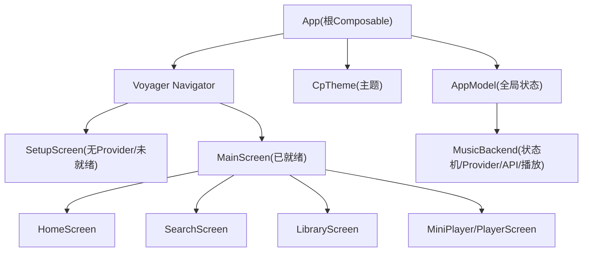
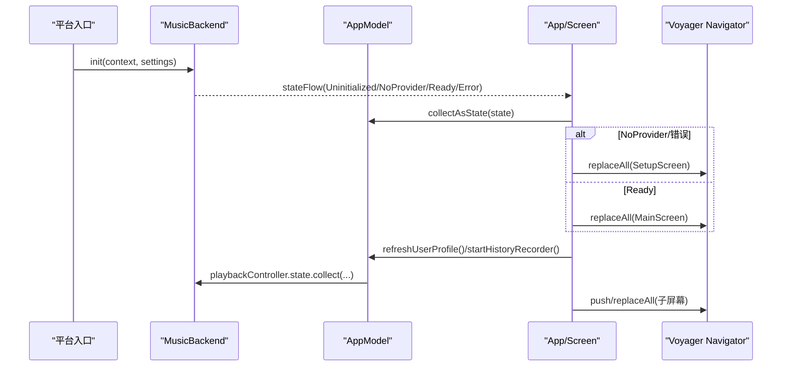
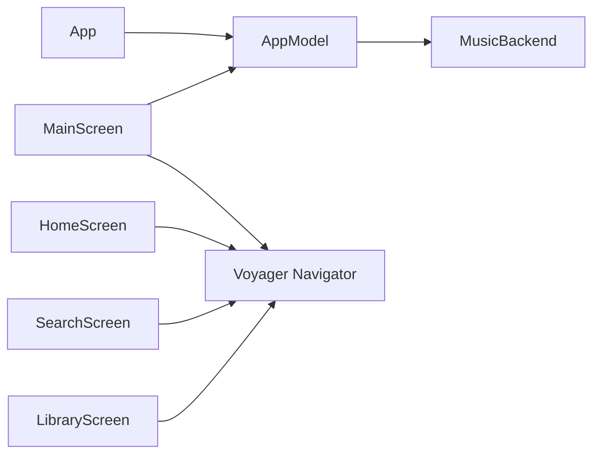

# 应用架构与导航

<cite>
**本文引用的文件**
- [App.kt](file://app/src/commonMain/kotlin/cp/player/app/App.kt)
- [AppModel.kt](file://app/src/commonMain/kotlin/cp/player/app/AppModel.kt)
- [MusicBackend.kt](file://kmp-pro/src/commonMain/kotlin/cp/player/kmp/MusicBackend.kt)
- [MainScreen.kt](file://app/src/commonMain/kotlin/cp/player/app/ui/screen/MainScreen.kt)
- [SetupScreen.kt](file://app/src/commonMain/kotlin/cp/player/app/ui/screen/SetupScreen.kt)
- [HomeScreen.kt](file://app/src/commonMain/kotlin/cp/player/app/ui/screen/HomeScreen.kt)
- [SearchScreen.kt](file://app/src/commonMain/kotlin/cp/player/app/ui/screen/SearchScreen.kt)
- [LibraryScreen.kt](file://app/src/commonMain/kotlin/cp/player/app/ui/screen/LibraryScreen.kt)
- [AppScaffold.kt](file://app/src/commonMain/kotlin/cp/player/app/ui/component/AppScaffold.kt)
- [Theme.kt](file://app/src/commonMain/kotlin/cp/player/app/ui/theme/Theme.kt)
</cite>

## 目录
1. [简介](#简介)
2. [项目结构](#项目结构)
3. [核心组件](#核心组件)
4. [架构总览](#架构总览)
5. [详细组件分析](#详细组件分析)
6. [依赖关系分析](#依赖关系分析)
7. [性能考量](#性能考量)
8. [故障排查指南](#故障排查指南)
9. [结论](#结论)
10. [附录：如何添加新屏幕与页面跳转示例](#附录如何添加新屏幕与页面跳转示例)

## 简介
本文件面向 CPPlayer-KMP 的跨平台应用架构与导航系统，聚焦基于 Jetpack Compose 的 UI 层、Voyager 导航、后端 MusicBackend 的状态机与 Provider 管理、全局状态与主题系统。文档将说明应用初始化流程、导航状态管理、屏幕路由配置、App 生命周期、依赖注入机制、全局状态管理，以及 MainScreen 的布局结构与响应式适配，并给出实际代码路径以演示如何添加新屏幕、实现页面跳转和处理导航状态。

## 项目结构
- 应用入口与根 Composable：App.kt 负责主题应用、启动副作用（音质同步、用户资料刷新、播放历史）、根据后端状态选择初始路由（SetupScreen 或 MainScreen），并通过 Voyager Navigator 管理根级导航栈。
- 主界面壳层：MainScreen.kt 提供响应式布局（移动端底部导航栏、桌面端侧边导航栏），维护 Tab 切换、MiniPlayer/全屏播放器展开、全局 Snackbar 与共享过渡动画。
- 设置与引导：SetupScreen.kt 用于导入音源模块、选择活跃 Provider、进入主界面。
- 业务屏幕：HomeScreen、SearchScreen、LibraryScreen 等通过 Screen 模型组织数据加载与交互，使用 LocalNavigator 进行页面跳转。
- 统一界面框架：AppScaffold.kt 提供可复用的 Scaffold 封装，包含 TopBar、返回按钮、操作按钮、加载指示与内容区。
- 主题系统：Theme.kt 定义主题模式、动态取色与纯黑模式，并在 App 中作为根主题包裹。
- 后端与状态：MusicBackend.kt 提供单例后端，管理 Provider 生命周期、状态机（Uninitialized/NoProvider/Ready/Error）、API 访问、缓存与健康监控；AppModel.kt 作为应用顶层服务定位器，聚合后端能力并提供 UI 友好的 StateFlow 暴露。

图表来源
- [App.kt:31-69](file://app/src/commonMain/kotlin/cp/player/app/App.kt#L31-L69)
- [MainScreen.kt:73-233](file://app/src/commonMain/kotlin/cp/player/app/ui/screen/MainScreen.kt#L73-L233)
- [SetupScreen.kt:54-78](file://app/src/commonMain/kotlin/cp/player/app/ui/screen/SetupScreen.kt#L54-L78)
- [Theme.kt:31-65](file://app/src/commonMain/kotlin/cp/player/app/ui/theme/Theme.kt#L31-L65)
- [MusicBackend.kt:93-179](file://kmp-pro/src/commonMain/kotlin/cp/player/kmp/MusicBackend.kt#L93-L179)

章节来源
- [App.kt:31-69](file://app/src/commonMain/kotlin/cp/player/app/App.kt#L31-L69)
- [MainScreen.kt:73-233](file://app/src/commonMain/kotlin/cp/player/app/ui/screen/MainScreen.kt#L73-L233)
- [SetupScreen.kt:54-78](file://app/src/commonMain/kotlin/cp/player/app/ui/screen/SetupScreen.kt#L54-L78)
- [Theme.kt:31-65](file://app/src/commonMain/kotlin/cp/player/app/ui/theme/Theme.kt#L31-L65)
- [MusicBackend.kt:93-179](file://kmp-pro/src/commonMain/kotlin/cp/player/kmp/MusicBackend.kt#L93-L179)

## 核心组件
- App（根 Composable）
  - 职责：应用初始化副作用（音质同步、用户资料刷新、播放历史记录）、主题应用、根据后端状态选择初始路由、监听状态变化自动替换为 MainScreen。
  - 关键点：LaunchedEffect 触发一次性初始化；collectAsState 订阅 themeMode/dynamicColor/pureBlack；stateFlow 驱动路由切换；Navigator.replaceAll 保证根栈一致性。
- AppModel（应用服务定位器）
  - 职责：聚合 MusicBackend、SettingsStorage、PlaybackController；暴露主题、音质、用户资料、最近播放、Provider 管理等 StateFlow；提供类型安全的结果包装方法。
  - 关键点：持久化设置键值；播放音质即时同步到控制器；用户资料刷新后联动收藏列表；历史记录去重与持久化。
- MusicBackend（后端统一入口）
  - 职责：生命周期与状态机（Uninitialized/NoProvider/Ready/Error）、Provider 导入/切换/删除、音乐 API（直通与缓存）、统一数据源、播放控制器创建与释放、健康监控。
  - 关键点：init 时计算终态；importModule 自动激活首个可用 Provider；switchProviderInternal 更新状态机；playbackController 惰性创建并绑定平台播放器与统一数据源。
- MainScreen（主壳层）
  - 职责：响应式布局（移动端 BottomNavigation、桌面端 NavigationRail）、Tab 内容保持与复用、MiniPlayer 与全屏播放器切换、全局 Snackbar、TopBar 与滚动行为。
  - 关键点：BoxWithConstraints 检测宽度决定布局；CompositionLocal 传递展开状态；SharedTransitionLayout + AnimatedContent 实现平滑过渡；Tab 内容通过 Layout 自定义渲染保留历史。
- SetupScreen（设置与引导）
  - 职责：导入音源模块、显示已加载 Provider、选择并激活、进入主界面。
  - 关键点：rememberZipPicker 调用平台文件选择；ScreenModel 管理导入状态与消息；navigator.replaceAll 切换到 MainScreen。
- AppScaffold（统一界面框架）
  - 职责：封装 Material3 Scaffold，提供标题、返回按钮、顶部操作、浮动按钮、加载指示与内容区；支持透明容器与滚动行为。
  - 关键点：TopBar 容器颜色自适应；isLoading 居中进度条；bottomBar 与 contentPadding 处理。
- Theme（主题系统）
  - 职责：主题模式（跟随系统/浅色/深色）、动态取色、纯黑模式；提供 CpTheme 作为根主题。
  - 关键点：supportsDynamicColor/dynamicColorScheme 为 expect/actual；pureBlack 覆盖 surface/background 系列颜色。

章节来源
- [App.kt:31-69](file://app/src/commonMain/kotlin/cp/player/app/App.kt#L31-L69)
- [AppModel.kt:17-65](file://app/src/commonMain/kotlin/cp/player/app/AppModel.kt#L17-L65)
- [MusicBackend.kt:30-179](file://kmp-pro/src/commonMain/kotlin/cp/player/kmp/MusicBackend.kt#L30-L179)
- [MainScreen.kt:73-233](file://app/src/commonMain/kotlin/cp/player/app/ui/screen/MainScreen.kt#L73-L233)
- [SetupScreen.kt:54-78](file://app/src/commonMain/kotlin/cp/player/app/ui/screen/SetupScreen.kt#L54-L78)
- [AppScaffold.kt:33-109](file://app/src/commonMain/kotlin/cp/player/app/ui/component/AppScaffold.kt#L33-L109)
- [Theme.kt:31-65](file://app/src/commonMain/kotlin/cp/player/app/ui/theme/Theme.kt#L31-L65)

## 架构总览
CPPlayer-KMP 采用分层架构：
- UI 层：Compose 组件（App、MainScreen、各 Screen）+ Voyager 导航 + Material3 主题。
- 应用层：AppModel 作为服务定位器，聚合后端能力与设置存储，暴露响应式状态。
- 后端层：MusicBackend 管理 Provider 生命周期、状态机、API 访问、缓存与健康监控，提供统一的播放控制入口。
- 平台差异：expect/actual 动态取色与平台上下文；PlatformActions/PlatformFilePicker 在 androidMain/desktopMain 分别实现。

图表来源
- [MusicBackend.kt:330-388](file://kmp-pro/src/commonMain/kotlin/cp/player/kmp/MusicBackend.kt#L330-L388)
- [App.kt:31-69](file://app/src/commonMain/kotlin/cp/player/app/App.kt#L31-L69)
- [SetupScreen.kt:54-78](file://app/src/commonMain/kotlin/cp/player/app/ui/screen/SetupScreen.kt#L54-L78)
- [MainScreen.kt:73-233](file://app/src/commonMain/kotlin/cp/player/app/ui/screen/MainScreen.kt#L73-L233)

## 详细组件分析

### 应用初始化与导航状态管理
- 初始化流程
  - 平台入口完成 MusicBackend.init，内部构建 ProviderManager、ModuleManager、CookieStorage、API 服务与缓存，并计算终态。
  - App 组合时收集 themeMode/dynamicColor/pureBlack，执行一次性副作用：同步播放音质、刷新用户资料、启动播放历史。
  - 根据 BackendState 选择初始路由：NoProvider/Error → SetupScreen；Ready → MainScreen。
- 导航状态管理
  - Voyager Navigator 管理根栈；当 state 变为 Ready 且当前不在 MainScreen 时，replaceAll 替换为 MainScreen。
  - SlideTransition 提供页面切换动画。
- 关键实现路径
  - 后端初始化与状态计算：[MusicBackend.kt:330-388](file://kmp-pro/src/commonMain/kotlin/cp/player/kmp/MusicBackend.kt#L330-L388)
  - 根 Composable 路由判定与自动切换：[App.kt:31-69](file://app/src/commonMain/kotlin/cp/player/app/App.kt#L31-L69)

章节来源
- [MusicBackend.kt:330-388](file://kmp-pro/src/commonMain/kotlin/cp/player/kmp/MusicBackend.kt#L330-L388)
- [App.kt:31-69](file://app/src/commonMain/kotlin/cp/player/app/App.kt#L31-L69)

### 依赖注入机制与全局状态管理
- 依赖注入
  - MusicBackend 单例由 init 构造，内部注入 PlatformContext、SettingsStorage、ProviderManager、ModuleManager、API 服务与缓存。
  - AppModel 作为应用层服务定位器，持有 backend、settings、playbackController 等引用，对外暴露 StateFlow。
- 全局状态管理
  - 主题模式、动态取色、纯黑模式通过 SettingsStorage 持久化，并以 StateFlow 暴露给 UI。
  - 播放音质设置后立即同步到 PlaybackController。
  - 用户资料与收藏列表刷新后联动播放器的 likedIds。
  - 最近播放去重并持久化为 JSON，按时间前移。
- 关键实现路径
  - 后端单例与状态流：[MusicBackend.kt:93-179](file://kmp-pro/src/commonMain/kotlin/cp/player/kmp/MusicBackend.kt#L93-L179)
  - 应用服务定位器与设置持久化：[AppModel.kt:17-130](file://app/src/commonMain/kotlin/cp/player/app/AppModel.kt#L17-L130)
  - 用户资料刷新与收藏联动：[AppModel.kt:131-179](file://app/src/commonMain/kotlin/cp/player/app/AppModel.kt#L131-L179)
  - 最近播放记录与持久化：[AppModel.kt:181-254](file://app/src/commonMain/kotlin/cp/player/app/AppModel.kt#L181-L254)

章节来源
- [MusicBackend.kt:93-179](file://kmp-pro/src/commonMain/kotlin/cp/player/kmp/MusicBackend.kt#L93-L179)
- [AppModel.kt:17-254](file://app/src/commonMain/kotlin/cp/player/app/AppModel.kt#L17-L254)

### MainScreen 布局结构与导航逻辑
- 响应式布局
  - BoxWithConstraints 检测 maxWidth >= 840.dp 决定是否使用 NavigationRail（桌面）或 BottomNavigationBar（移动）。
  - CompositionLocal 传递 LocalIsExpanded 以控制内容缩放与变暗效果。
- 导航与 Tab 管理
  - 维护 selectedIndex 与 visitedTabs，确保首次访问的 Tab 被保留并复用。
  - TabContent 使用自定义 Layout 仅渲染已访问的 Tab，提升性能。
- MiniPlayer 与全屏播放器
  - 底部 MiniPlayer 点击展开全屏播放器；AnimatedContent + SharedTransitionLayout 实现淡入淡出与共享元素过渡。
  - 返回键捕获：BackHandler 在展开状态下按下返回关闭播放器。
- 全局反馈
  - SnackbarHost 收集 UiEvents.messages 展示操作反馈，位置随播放器高度调整。
- 关键实现路径
  - 响应式布局与导航：[MainScreen.kt:120-153](file://app/src/commonMain/kotlin/cp/player/app/ui/screen/MainScreen.kt#L120-L153)
  - Tab 内容与复用：[MainScreen.kt:285-305](file://app/src/commonMain/kotlin/cp/player/app/ui/screen/MainScreen.kt#L285-L305)
  - MiniPlayer 与播放器切换：[MainScreen.kt:178-229](file://app/src/commonMain/kotlin/cp/player/app/ui/screen/MainScreen.kt#L178-L229)
  - 全局 Snackbar：[MainScreen.kt:95-104](file://app/src/commonMain/kotlin/cp/player/app/ui/screen/MainScreen.kt#L95-L104), [MainScreen.kt:164-176](file://app/src/commonMain/kotlin/cp/player/app/ui/screen/MainScreen.kt#L164-L176)

章节来源
- [MainScreen.kt:120-153](file://app/src/commonMain/kotlin/cp/player/app/ui/screen/MainScreen.kt#L120-L153)
- [MainScreen.kt:178-229](file://app/src/commonMain/kotlin/cp/player/app/ui/screen/MainScreen.kt#L178-L229)
- [MainScreen.kt:285-305](file://app/src/commonMain/kotlin/cp/player/app/ui/screen/MainScreen.kt#L285-L305)
- [MainScreen.kt:95-104](file://app/src/commonMain/kotlin/cp/player/app/ui/screen/MainScreen.kt#L95-L104)
- [MainScreen.kt:164-176](file://app/src/commonMain/kotlin/cp/player/app/ui/screen/MainScreen.kt#L164-L176)

### AppScaffold 统一界面框架
- 功能
  - 提供 LargeTopAppBar，支持标题、返回按钮、顶部操作按钮、滚动行为。
  - 支持 bottomBar、floatingActionButton、containerColor、topBarContainerColor。
  - isLoading 居中显示 CircularProgressIndicator。
- 设计要点
  - 透明容器与滚动行为结合，使 TopBar 在未滚动时与背景融合。
  - 返回按钮默认生成，若提供 onBackPressed 则启用。
- 关键实现路径
  - Scaffold 封装与 TopBar：[AppScaffold.kt:33-109](file://app/src/commonMain/kotlin/cp/player/app/ui/component/AppScaffold.kt#L33-L109)
  - 字符串标题重载：[AppScaffold.kt:111-145](file://app/src/commonMain/kotlin/cp/player/app/ui/component/AppScaffold.kt#L111-L145)

章节来源
- [AppScaffold.kt:33-109](file://app/src/commonMain/kotlin/cp/player/app/ui/component/AppScaffold.kt#L33-L109)
- [AppScaffold.kt:111-145](file://app/src/commonMain/kotlin/cp/player/app/ui/component/AppScaffold.kt#L111-L145)

### 主题系统集成与平台特定 UI 差异
- 主题系统
  - CpTheme 接收 themeMode、dynamicColor、pureBlack，计算 dark 模式与 ColorScheme，提供 MaterialTheme。
  - supportsDynamicColor/dynamicColorScheme 为 expect/actual，Android 12+ 可用动态取色。
  - pureBlack 覆盖 surface/background 系列颜色，满足 OLED 纯黑需求。
- 平台差异
  - androidMain/desktopMain 分别实现 supportsDynamicColor 与 dynamicColorScheme。
  - PlatformActions/PlatformFilePicker 在 androidMain/desktopMain 分别实现文件选择与平台动作。
- 关键实现路径
  - 主题入口与模式计算：[Theme.kt:31-65](file://app/src/commonMain/kotlin/cp/player/app/ui/theme/Theme.kt#L31-L65)
  - 平台 expect/actual 声明：[Theme.kt:20-25](file://app/src/commonMain/kotlin/cp/player/app/ui/theme/Theme.kt#L20-L25)

章节来源
- [Theme.kt:20-65](file://app/src/commonMain/kotlin/cp/player/app/ui/theme/Theme.kt#L20-L65)

### 屏幕路由配置与页面跳转
- 路由配置
  - 根路由由 App 根据 BackendState 决定：SetupScreen 或 MainScreen。
  - MainScreen 内三个主要目的地：HomeScreen、SearchScreen、LibraryScreen，通过 Tab 切换。
- 页面跳转
  - 使用 Voyager 的 LocalNavigator.currentOrThrow 获取 Navigator，调用 push/replaceAll 进行跳转。
  - 典型场景：从 HomeScreen 跳转到 PlaylistDetailScreen；从 SearchScreen 播放歌曲队列；从 LibraryScreen 打开歌单详情。
- 关键实现路径
  - 根路由判定：[App.kt:49-65](file://app/src/commonMain/kotlin/cp/player/app/App.kt#L49-L65)
  - 设置页跳转：[SetupScreen.kt:54-78](file://app/src/commonMain/kotlin/cp/player/app/ui/screen/SetupScreen.kt#L54-L78)
  - 首页跳转歌单详情：[HomeScreen.kt:115-129](file://app/src/commonMain/kotlin/cp/player/app/ui/screen/HomeScreen.kt#L115-L129)
  - 搜索页播放队列：[SearchScreen.kt:170-184](file://app/src/commonMain/kotlin/cp/player/app/ui/screen/SearchScreen.kt#L170-L184)
  - 库页跳转歌单详情：[LibraryScreen.kt:111-119](file://app/src/commonMain/kotlin/cp/player/app/ui/screen/LibraryScreen.kt#L111-L119)

章节来源
- [App.kt:49-65](file://app/src/commonMain/kotlin/cp/player/app/App.kt#L49-L65)
- [SetupScreen.kt:54-78](file://app/src/commonMain/kotlin/cp/player/app/ui/screen/SetupScreen.kt#L54-L78)
- [HomeScreen.kt:115-129](file://app/src/commonMain/kotlin/cp/player/app/ui/screen/HomeScreen.kt#L115-L129)
- [SearchScreen.kt:170-184](file://app/src/commonMain/kotlin/cp/player/app/ui/screen/SearchScreen.kt#L170-L184)
- [LibraryScreen.kt:111-119](file://app/src/commonMain/kotlin/cp/player/app/ui/screen/LibraryScreen.kt#L111-L119)

## 依赖关系分析
- 组件耦合
  - App 依赖 AppModel 与 MusicBackend；AppModel 依赖 MusicBackend 与 SettingsStorage；MainScreen 依赖 AppModel 与 Voyager Navigator。
  - 各 Screen 通过 ScreenModel 管理本地状态，使用 LocalNavigator 进行跳转。
- 外部依赖
  - Voyager 导航库；Material3 组件；Coil 图片加载；Kotlinx Serialization 用于 JSON 解析。
- 潜在循环依赖
  - 未发现直接循环依赖；AppModel 与 MusicBackend 单向依赖；Screen 与 ScreenModel 解耦。
- 接口契约
  - MusicBackend 暴露 stateFlow、providersFlow、activeProviderFlow、playbackController 等接口；AppModel 封装这些接口并提供更高层语义。

图表来源
- [App.kt:31-69](file://app/src/commonMain/kotlin/cp/player/app/App.kt#L31-L69)
- [AppModel.kt:17-65](file://app/src/commonMain/kotlin/cp/player/app/AppModel.kt#L17-L65)
- [MusicBackend.kt:93-179](file://kmp-pro/src/commonMain/kotlin/cp/player/kmp/MusicBackend.kt#L93-L179)
- [MainScreen.kt:73-233](file://app/src/commonMain/kotlin/cp/player/app/ui/screen/MainScreen.kt#L73-L233)

章节来源
- [App.kt:31-69](file://app/src/commonMain/kotlin/cp/player/app/App.kt#L31-L69)
- [AppModel.kt:17-65](file://app/src/commonMain/kotlin/cp/player/app/AppModel.kt#L17-L65)
- [MusicBackend.kt:93-179](file://kmp-pro/src/commonMain/kotlin/cp/player/kmp/MusicBackend.kt#L93-L179)
- [MainScreen.kt:73-233](file://app/src/commonMain/kotlin/cp/player/app/ui/screen/MainScreen.kt#L73-L233)

## 性能考量
- 懒加载与复用
  - MainScreen 的 TabContent 仅渲染已访问的 Tab，避免不必要的重建。
  - LazyColumn/LazyRow 用于长列表与横向滚动区域，提升滚动性能。
- 状态订阅优化
  - collectAsState 仅在需要时订阅 StateFlow，减少重组开销。
  - LaunchedEffect 用于一次性副作用，避免重复执行。
- 动画与过渡
  - AnimatedContent + SharedTransitionLayout 提供平滑过渡，注意动画时长与复杂度对性能的影响。
- 网络与缓存
  - CachedMusicApiService 先返回缓存，后台拉取并指纹比对，减少网络请求与 UI 阻塞。

## 故障排查指南
- 后端状态异常
  - 检查 MusicBackend.init 是否成功调用；查看 lastLoadError 与 stateFlow 的值。
  - 若处于 Error 状态，确认 Provider 是否就绪，必要时重新导入或切换。
- 导航问题
  - 确认 LocalNavigator 是否正确获取；push/replaceAll 调用时机是否在组合阶段。
  - 检查根路由是否正确根据 BackendState 切换。
- 主题与平台差异
  - 确认 supportsDynamicColor/dynamicColorScheme 的 actual 实现是否存在；pureBlack 模式下颜色覆盖是否符合预期。
- 播放控制
  - 检查 playbackController 是否已创建；播放队列与 likedIds 是否与用户资料刷新同步。

章节来源
- [MusicBackend.kt:247-248](file://kmp-pro/src/commonMain/kotlin/cp/player/kmp/MusicBackend.kt#L247-L248)
- [App.kt:49-65](file://app/src/commonMain/kotlin/cp/player/app/App.kt#L49-L65)
- [Theme.kt:31-65](file://app/src/commonMain/kotlin/cp/player/app/ui/theme/Theme.kt#L31-L65)

## 结论
CPPlayer-KMP 的应用架构清晰分层，UI 层通过 Compose 与 Voyager 实现响应式与可维护的导航；应用层 AppModel 聚合后端能力并提供全局状态；后端层 MusicBackend 管理 Provider 生命周期与状态机，确保稳定的数据访问与播放控制。主题系统与平台差异通过 expect/actual 机制妥善处理。整体设计兼顾可扩展性与性能，便于后续功能扩展与维护。

## 附录：如何添加新屏幕与页面跳转示例
- 步骤概览
  - 新建 Screen 类并实现 Content Composable。
  - 在需要的地方使用 LocalNavigator.currentOrThrow 获取 Navigator，调用 push/replaceAll 进行跳转。
  - 如需全局反馈，使用 UiEvents 发送消息，MainScreen 中的 SnackbarHost 会展示。
- 示例路径
  - 新增屏幕定义：参考 [HomeScreen.kt:68-73](file://app/src/commonMain/kotlin/cp/player/app/ui/screen/HomeScreen.kt#L68-L73)
  - 页面跳转示例：参考 [HomeScreen.kt:115-129](file://app/src/commonMain/kotlin/cp/player/app/ui/screen/HomeScreen.kt#L115-L129)
  - 全局反馈示例：参考 [MainScreen.kt:95-104](file://app/src/commonMain/kotlin/cp/player/app/ui/screen/MainScreen.kt#L95-L104)
- 导航状态处理
  - 在 Screen 中使用 rememberSaveable 保存本地状态，避免重组丢失。
  - 使用 collectAsState 订阅 AppModel 的 StateFlow，确保 UI 与状态同步。

章节来源
- [HomeScreen.kt:68-73](file://app/src/commonMain/kotlin/cp/player/app/ui/screen/HomeScreen.kt#L68-L73)
- [HomeScreen.kt:115-129](file://app/src/commonMain/kotlin/cp/player/app/ui/screen/HomeScreen.kt#L115-L129)
- [MainScreen.kt:95-104](file://app/src/commonMain/kotlin/cp/player/app/ui/screen/MainScreen.kt#L95-L104)