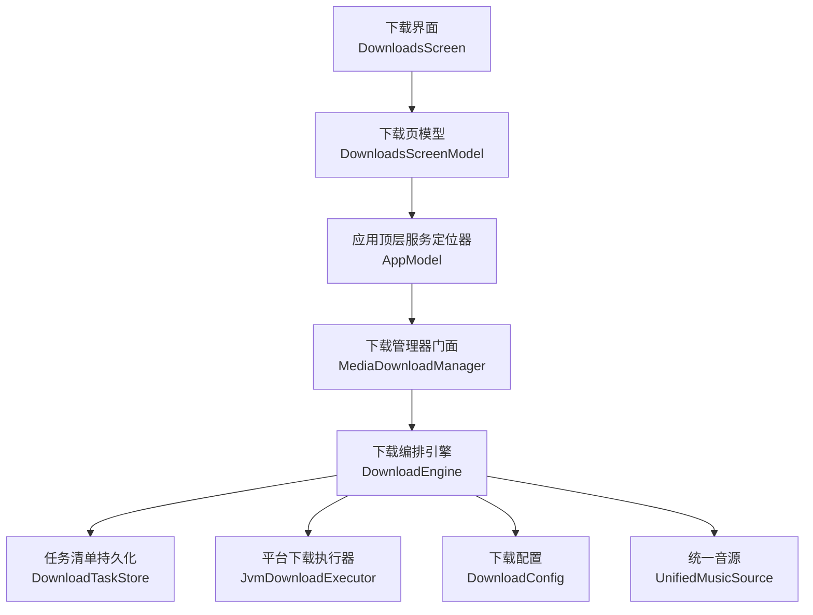
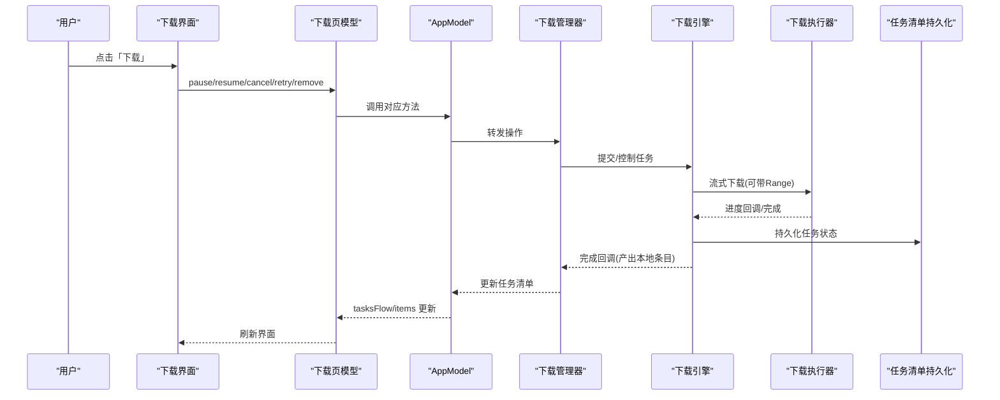
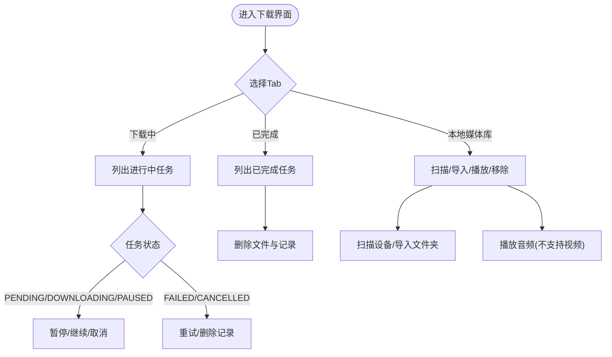
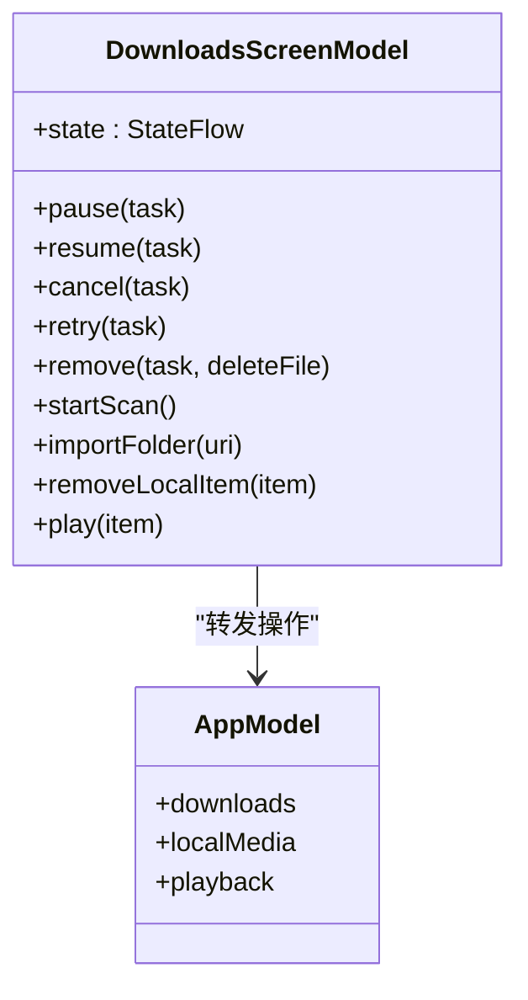
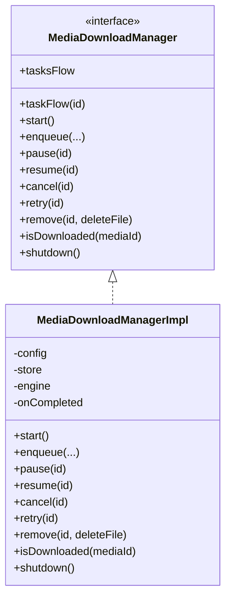
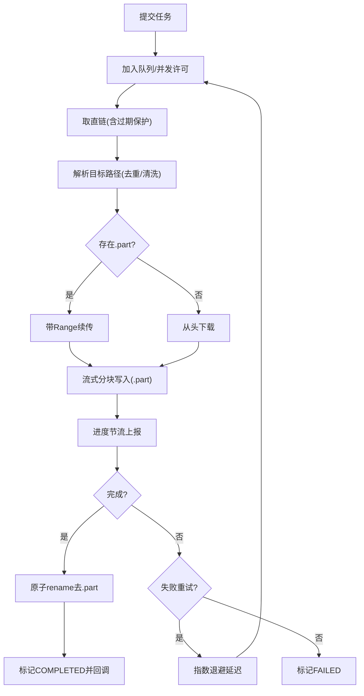
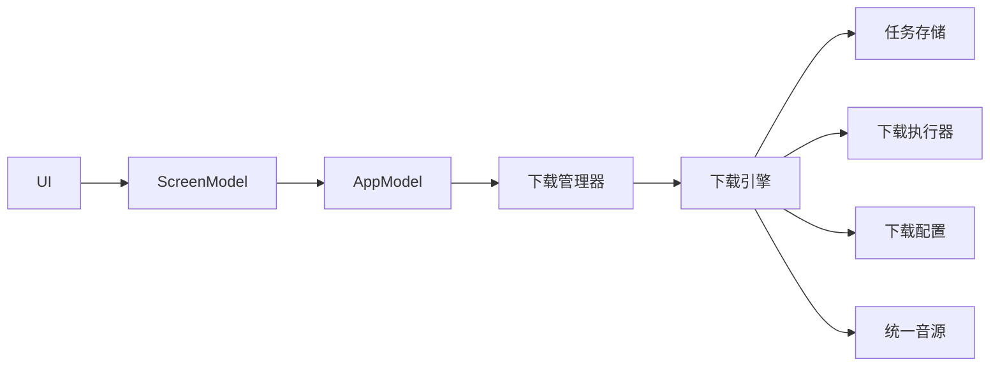

# 下载界面

<cite>
**本文引用的文件**
- [DownloadsScreen.kt](file://app/src/commonMain/kotlin/cp/player/app/ui/screen/DownloadsScreen.kt)
- [DownloadsScreenModel.kt](file://app/src/commonMain/kotlin/cp/player/app/ui/model/DownloadsScreenModel.kt)
- [MediaDownloadManager.kt](file://kmp-pro/src/commonMain/kotlin/cp/player/kmp/download/MediaDownloadManager.kt)
- [DownloadEngine.kt](file://kmp-pro/src/commonMain/kotlin/cp/player/kmp/download/DownloadEngine.kt)
- [DownloadTaskStore.kt](file://kmp-pro/src/commonMain/kotlin/cp/player/kmp/download/DownloadTaskStore.kt)
- [DownloadConfig.kt](file://kmp-pro/src/commonMain/kotlin/cp/player/kmp/download/DownloadConfig.kt)
- [JvmDownloadExecutor.kt](file://kmp-pro/src/jvmMain/kotlin/cp/player/kmp/download/JvmDownloadExecutor.kt)
- [DownloadTask.kt](file://kmp-pro/src/commonMain/kotlin/cp/player/kmp/model/DownloadTask.kt)
- [LocalMediaItem.kt](file://kmp-pro/src/commonMain/kotlin/cp/player/kmp/media/LocalMediaItem.kt)
- [AppModel.kt](file://app/src/commonMain/kotlin/cp/player/app/AppModel.kt)
</cite>

## 目录
1. [简介](#简介)
2. [项目结构](#项目结构)
3. [核心组件](#核心组件)
4. [架构总览](#架构总览)
5. [详细组件分析](#详细组件分析)
6. [依赖关系分析](#依赖关系分析)
7. [性能考量](#性能考量)
8. [故障排查指南](#故障排查指南)
9. [结论](#结论)
10. [附录](#附录)

## 简介
本文件聚焦于“下载界面”的实现与工作机制，覆盖从 UI 展示、状态管理到后台下载引擎的完整链路。该界面提供三类视图：
- 下载中：实时显示等待、下载中、暂停、失败、已取消的任务，支持暂停/继续/重试/取消/删除记录等操作。
- 已完成：展示已完成任务及本地路径，支持删除文件与记录。
- 本地媒体库：聚合“已下载”和“导入/扫描”的本地媒体条目，支持播放（音频）、移除条目、扫描设备、导入文件夹等。

## 项目结构
下载界面位于应用层 UI 模块，通过 ScreenModel 订阅后端状态流并转发用户操作；下载能力由 KMP 模块提供统一的下载门面与执行引擎，负责并发控制、断点续传、持久化与平台 I/O。

图表来源
- [DownloadsScreen.kt:70-149](file://app/src/commonMain/kotlin/cp/player/app/ui/screen/DownloadsScreen.kt#L70-L149)
- [DownloadsScreenModel.kt:70-113](file://app/src/commonMain/kotlin/cp/player/app/ui/model/DownloadsScreenModel.kt#L70-L113)
- [MediaDownloadManager.kt:26-77](file://kmp-pro/src/commonMain/kotlin/cp/player/kmp/download/MediaDownloadManager.kt#L26-L77)
- [DownloadEngine.kt:50-106](file://kmp-pro/src/commonMain/kotlin/cp/player/kmp/download/DownloadEngine.kt#L50-L106)
- [DownloadTaskStore.kt:27-60](file://kmp-pro/src/commonMain/kotlin/cp/player/kmp/download/DownloadTaskStore.kt#L27-L60)
- [JvmDownloadExecutor.kt:33-79](file://kmp-pro/src/jvmMain/kotlin/cp/player/kmp/download/JvmDownloadExecutor.kt#L33-L79)
- [DownloadConfig.kt:16-31](file://kmp-pro/src/commonMain/kotlin/cp/player/kmp/download/DownloadConfig.kt#L16-L31)

章节来源
- [DownloadsScreen.kt:70-149](file://app/src/commonMain/kotlin/cp/player/app/ui/screen/DownloadsScreen.kt#L70-L149)
- [DownloadsScreenModel.kt:70-113](file://app/src/commonMain/kotlin/cp/player/app/ui/model/DownloadsScreenModel.kt#L70-L113)
- [MediaDownloadManager.kt:26-77](file://kmp-pro/src/commonMain/kotlin/cp/player/kmp/download/MediaDownloadManager.kt#L26-L77)
- [DownloadEngine.kt:50-106](file://kmp-pro/src/commonMain/kotlin/cp/player/kmp/download/DownloadEngine.kt#L50-L106)
- [DownloadTaskStore.kt:27-60](file://kmp-pro/src/commonMain/kotlin/cp/player/kmp/download/DownloadTaskStore.kt#L27-L60)
- [JvmDownloadExecutor.kt:33-79](file://kmp-pro/src/jvmMain/kotlin/cp/player/kmp/download/JvmDownloadExecutor.kt#L33-L79)
- [DownloadConfig.kt:16-31](file://kmp-pro/src/commonMain/kotlin/cp/player/kmp/download/DownloadConfig.kt#L16-L31)

## 核心组件
- 下载界面（UI）：以三个 Tab 组织内容，使用 Compose 列表与进度条展示任务状态与进度，并提供操作按钮。
- 下载页模型（ScreenModel）：订阅后端 StateFlow，将任务与本地媒体库数据映射为 UI 状态，并将用户操作转发给后端。
- 下载管理器门面：对外唯一入口，封装入队、暂停/恢复/重试/取消/移除、是否已下载等能力，并在完成时产出本地条目回调。
- 下载引擎：队列 + 并发控制、取直链、目标路径解析、断点续传、失败指数退避重试、进度节流、持久化。
- 任务清单持久化：JSON 存储，启动时复位未完成状态，超限裁剪策略。
- 平台下载执行器：基于 Ktor 流式分块写入，支持 Range 续传与异常处理。
- 下载配置：根目录与最大并发数，动态读取设置。

章节来源
- [DownloadsScreen.kt:70-597](file://app/src/commonMain/kotlin/cp/player/app/ui/screen/DownloadsScreen.kt#L70-L597)
- [DownloadsScreenModel.kt:21-204](file://app/src/commonMain/kotlin/cp/player/app/ui/model/DownloadsScreenModel.kt#L21-L204)
- [MediaDownloadManager.kt:19-205](file://kmp-pro/src/commonMain/kotlin/cp/player/kmp/download/MediaDownloadManager.kt#L19-L205)
- [DownloadEngine.kt:33-488](file://kmp-pro/src/commonMain/kotlin/cp/player/kmp/download/DownloadEngine.kt#L33-L488)
- [DownloadTaskStore.kt:13-81](file://kmp-pro/src/commonMain/kotlin/cp/player/kmp/download/DownloadTaskStore.kt#L13-L81)
- [JvmDownloadExecutor.kt:19-115](file://kmp-pro/src/jvmMain/kotlin/cp/player/kmp/download/JvmDownloadExecutor.kt#L19-L115)
- [DownloadConfig.kt:7-41](file://kmp-pro/src/commonMain/kotlin/cp/player/kmp/download/DownloadConfig.kt#L7-L41)

## 架构总览
下载界面通过 ScreenModel 订阅任务流和本地媒体流，渲染三栏视图；用户操作经 AppModel 转发至下载管理器，再由引擎调度执行器进行网络下载与落盘，完成后回调生成本地条目并入本地媒体索引。

图表来源
- [DownloadsScreenModel.kt:75-113](file://app/src/commonMain/kotlin/cp/player/app/ui/model/DownloadsScreenModel.kt#L75-L113)
- [AppModel.kt:132-225](file://app/src/commonMain/kotlin/cp/player/app/AppModel.kt#L132-L225)
- [MediaDownloadManager.kt:127-205](file://kmp-pro/src/commonMain/kotlin/cp/player/kmp/download/MediaDownloadManager.kt#L127-L205)
- [DownloadEngine.kt:236-308](file://kmp-pro/src/commonMain/kotlin/cp/player/kmp/download/DownloadEngine.kt#L236-L308)
- [JvmDownloadExecutor.kt:52-79](file://kmp-pro/src/jvmMain/kotlin/cp/player/kmp/download/JvmDownloadExecutor.kt#L52-L79)
- [DownloadTaskStore.kt:47-60](file://kmp-pro/src/commonMain/kotlin/cp/player/kmp/download/DownloadTaskStore.kt#L47-L60)

## 详细组件分析

### 下载界面（UI）
- 顶部 Tab 切换：下载中、已完成、本地媒体库。
- 下载中：
  - 空态提示；非空则 LazyColumn 展示卡片，包含封面、标题、艺术家、进度条、状态文案。
  - 根据任务状态显示不同操作：暂停/继续/重试/取消/删除记录。
- 已完成：
  - 展示标题与本地路径，支持删除文件与记录。
- 本地媒体库：
  - 顶部按钮：扫描设备（带进度）、导入文件夹。
  - 分组展示“已下载”和“本地导入”，支持播放（仅音频）与从库中移除。
- 工具函数：进度计算、状态文案、字节格式化。

图表来源
- [DownloadsScreen.kt:77-149](file://app/src/commonMain/kotlin/cp/player/app/ui/screen/DownloadsScreen.kt#L77-L149)
- [DownloadsScreen.kt:152-323](file://app/src/commonMain/kotlin/cp/player/app/ui/screen/DownloadsScreen.kt#L152-L323)
- [DownloadsScreen.kt:325-523](file://app/src/commonMain/kotlin/cp/player/app/ui/screen/DownloadsScreen.kt#L325-L523)
- [DownloadsScreen.kt:525-597](file://app/src/commonMain/kotlin/cp/player/app/ui/screen/DownloadsScreen.kt#L525-L597)

章节来源
- [DownloadsScreen.kt:70-597](file://app/src/commonMain/kotlin/cp/player/app/ui/screen/DownloadsScreen.kt#L70-L597)

### 下载页模型（ScreenModel）
- 初始化时订阅：
  - 下载任务清单（tasksFlow），实时更新 UI 状态。
  - 本地媒体库条目（items）。
  - 扫描状态（isScanningFlow）。
- 下载操作：pause/resume/cancel/retry/remove，均转发至 AppModel.downloads。
- 本地媒体库操作：startScan/importFolder/removeLocalItem/play。
- 权限处理：扫描失败请求媒体权限，授权后自动重试一次扫描。

图表来源
- [DownloadsScreenModel.kt:70-204](file://app/src/commonMain/kotlin/cp/player/app/ui/model/DownloadsScreenModel.kt#L70-L204)
- [AppModel.kt:132-225](file://app/src/commonMain/kotlin/cp/player/app/AppModel.kt#L132-L225)

章节来源
- [DownloadsScreenModel.kt:21-204](file://app/src/commonMain/kotlin/cp/player/app/ui/model/DownloadsScreenModel.kt#L21-L204)
- [AppModel.kt:132-225](file://app/src/commonMain/kotlin/cp/player/app/AppModel.kt#L132-L225)

### 下载管理器门面（MediaDownloadManager）
- 对外暴露：
  - tasksFlow/taskFlow：任务清单与单任务流。
  - start：应用启动恢复持久化任务。
  - enqueue：幂等入队（同 mediaId 已完成且文件存在直接返回；失败/取消/完成但文件丢失自动重试）。
  - pause/resume/cancel/retry/remove/isDownloaded/shutdown。
- 默认实现：
  - 组合 DownloadConfig、DownloadTaskStore、DownloadEngine。
  - 下载完成回调组装 LocalMediaItem（source=DOWNLOADED），供上层登记本地媒体索引。

图表来源
- [MediaDownloadManager.kt:26-77](file://kmp-pro/src/commonMain/kotlin/cp/player/kmp/download/MediaDownloadManager.kt#L26-L77)
- [MediaDownloadManager.kt:88-205](file://kmp-pro/src/commonMain/kotlin/cp/player/kmp/download/MediaDownloadManager.kt#L88-L205)

章节来源
- [MediaDownloadManager.kt:19-205](file://kmp-pro/src/commonMain/kotlin/cp/player/kmp/download/MediaDownloadManager.kt#L19-L205)

### 下载引擎（DownloadEngine）
- 职责：
  - 队列与并发控制（Semaphore 限制 maxConcurrent）。
  - 流程：执行时取直链 → 过期保护 → 解析目标路径（含非法字符清洗与冲突处理）→ 写 .part → 支持 Range 续传 → 注入 Cookie → 完成原子 rename → 失败指数退避重试。
  - 控制：pause/resume/cancel/retry/remove。
  - 进度：节流上报（250ms）。
  - 持久化：每次状态/进度变更写入 store。
- 关键细节：
  - 目标路径稳定性：首次解析即确定 localPath 并持久化，保证续传一致性。
  - 竞态安全：条件式原子迁移（updateTaskIf）避免覆盖 pause/cancel 写入的状态。
  - 直链获取：expireAt 保护，接近过期自动刷新。

图表来源
- [DownloadEngine.kt:95-177](file://kmp-pro/src/commonMain/kotlin/cp/player/kmp/download/DownloadEngine.kt#L95-L177)
- [DownloadEngine.kt:202-308](file://kmp-pro/src/commonMain/kotlin/cp/player/kmp/download/DownloadEngine.kt#L202-L308)
- [DownloadEngine.kt:323-414](file://kmp-pro/src/commonMain/kotlin/cp/player/kmp/download/DownloadEngine.kt#L323-L414)

章节来源
- [DownloadEngine.kt:33-488](file://kmp-pro/src/commonMain/kotlin/cp/player/kmp/download/DownloadEngine.kt#L33-L488)

### 任务清单持久化（DownloadTaskStore）
- 加载：缺失或损坏返回空；DOWNLOADING/PENDING 复位为 FAILED（error="上次未完成"）。
- 保存：临时文件 + 原子 rename，超限裁剪（保留 COMPLETED 最近优先，其余按创建时间裁剪）。
- 位置：数据目录下 downloads.json，与应用可见下载目录分离。

章节来源
- [DownloadTaskStore.kt:13-81](file://kmp-pro/src/commonMain/kotlin/cp/player/kmp/download/DownloadTaskStore.kt#L13-L81)

### 平台下载执行器（JvmDownloadExecutor）
- 独立 HttpClient（OkHttp），无整体请求超时，socket 超时 5 分钟，连接超时 30 秒。
- 流式分块写入 RandomAccessFile，支持 Range 续传。
- 异常处理：服务端不支持续传（200 或 416）抛出特定异常，交由引擎清空 .part 重下。

章节来源
- [JvmDownloadExecutor.kt:19-115](file://kmp-pro/src/jvmMain/kotlin/cp/player/kmp/download/JvmDownloadExecutor.kt#L19-L115)

### 数据模型
- 下载任务（DownloadTask）：包含媒体 ID、来源、标题、艺术家、封面、媒体类型、音质档位、状态、进度、大小、本地路径、错误信息、创建时间。
- 本地媒体条目（LocalMediaItem）：路径、标题、艺术家、专辑、时长、大小、媒体类型、封面 URI、来源（下载/导入）、最后修改时间。

章节来源
- [DownloadTask.kt:6-69](file://kmp-pro/src/commonMain/kotlin/cp/player/kmp/model/DownloadTask.kt#L6-L69)
- [LocalMediaItem.kt:5-45](file://kmp-pro/src/commonMain/kotlin/cp/player/kmp/media/LocalMediaItem.kt#L5-L45)

## 依赖关系分析
- UI 层依赖 ScreenModel 提供的 StateFlow 状态。
- ScreenModel 依赖 AppModel 作为统一入口，再委托到后端 MusicBackend 的下载管理器与本地媒体源。
- 下载管理器组合配置、存储、引擎和执行器，屏蔽平台差异。
- 引擎依赖统一音源获取直链，并通过执行器进行网络 I/O。
- 持久化与配置解耦，便于扩展与测试。

图表来源
- [DownloadsScreenModel.kt:70-113](file://app/src/commonMain/kotlin/cp/player/app/ui/model/DownloadsScreenModel.kt#L70-L113)
- [AppModel.kt:132-225](file://app/src/commonMain/kotlin/cp/player/app/AppModel.kt#L132-L225)
- [MediaDownloadManager.kt:88-205](file://kmp-pro/src/commonMain/kotlin/cp/player/kmp/download/MediaDownloadManager.kt#L88-L205)
- [DownloadEngine.kt:50-106](file://kmp-pro/src/commonMain/kotlin/cp/player/kmp/download/DownloadEngine.kt#L50-L106)

章节来源
- [DownloadsScreenModel.kt:70-113](file://app/src/commonMain/kotlin/cp/player/app/ui/model/DownloadsScreenModel.kt#L70-L113)
- [AppModel.kt:132-225](file://app/src/commonMain/kotlin/cp/player/app/AppModel.kt#L132-L225)
- [MediaDownloadManager.kt:88-205](file://kmp-pro/src/commonMain/kotlin/cp/player/kmp/download/MediaDownloadManager.kt#L88-L205)
- [DownloadEngine.kt:50-106](file://kmp-pro/src/commonMain/kotlin/cp/player/kmp/download/DownloadEngine.kt#L50-L106)

## 性能考量
- 并发控制：默认最大并发 3，避免过多连接导致资源争用。
- 进度节流：250ms 上报一次，降低 UI 刷新压力。
- 直链过期保护：距过期不足 60s 自动刷新，减少下载中断。
- 断点续传：利用 HTTP Range 头与 .part 文件，提升弱网稳定性。
- 文件名冲突处理：自动追加序号，避免覆盖。
- 持久化原子写入：临时文件 + rename，防止清单损坏。

[本节为通用指导，不直接分析具体文件]

## 故障排查指南
- 下载失败：
  - 检查直链获取是否成功（可能为空或受限），查看错误信息。
  - 若服务端不支持续传，引擎会清空 .part 并重试一次；多次失败将标记 FAILED。
- 无法续传：
  - 确认服务器是否支持 Range；若返回 200 或 416，将触发重下逻辑。
- 任务未恢复：
  - 应用启动时 DOWNLOADING/PENDING 会被复位为 FAILED，需手动重试。
- 权限问题：
  - 扫描设备需要媒体读取权限；拒绝后将提示并可在授权后自动重试一次。
- 文件删除：
  - 删除记录可选择是否同时删除文件；注意区分“删除记录”与“删除文件”。

章节来源
- [DownloadEngine.kt:202-308](file://kmp-pro/src/commonMain/kotlin/cp/player/kmp/download/DownloadEngine.kt#L202-L308)
- [DownloadTaskStore.kt:32-45](file://kmp-pro/src/commonMain/kotlin/cp/player/kmp/download/DownloadTaskStore.kt#L32-L45)
- [DownloadsScreenModel.kt:128-165](file://app/src/commonMain/kotlin/cp/player/app/ui/model/DownloadsScreenModel.kt#L128-L165)

## 结论
下载界面通过清晰的三层架构（UI/模型/后端）实现了稳定的下载体验：支持多任务并发、断点续传、失败重试、持久化恢复以及本地媒体库整合。其设计注重健壮性与可维护性，适合在跨平台环境中复用与扩展。

[本节为总结，不直接分析具体文件]

## 附录
- 关键常量与默认值：
  - 默认音质档位：exhigh
  - 最大并发：3
  - 进度节流间隔：250ms
  - 直链过期保护余量：60s
  - 单次执行内取链尝试次数：3
  - 文件名最大长度：120
  - 清单上限：200 条

章节来源
- [MediaDownloadManager.kt:73-77](file://kmp-pro/src/commonMain/kotlin/cp/player/kmp/download/MediaDownloadManager.kt#L73-L77)
- [DownloadConfig.kt:33-39](file://kmp-pro/src/commonMain/kotlin/cp/player/kmp/download/DownloadConfig.kt#L33-L39)
- [DownloadEngine.kt:465-486](file://kmp-pro/src/commonMain/kotlin/cp/player/kmp/download/DownloadEngine.kt#L465-L486)
- [DownloadTaskStore.kt:73-79](file://kmp-pro/src/commonMain/kotlin/cp/player/kmp/download/DownloadTaskStore.kt#L73-L79)