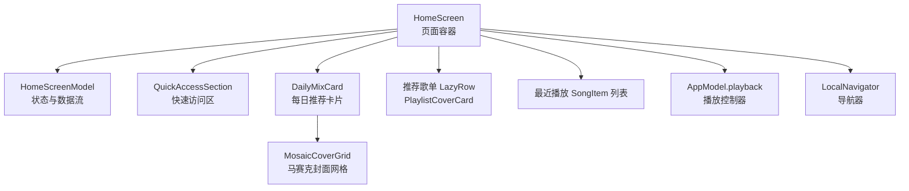
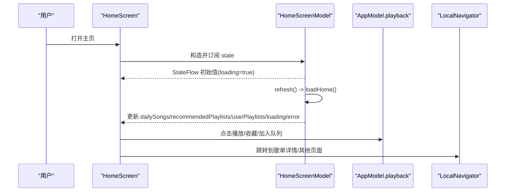
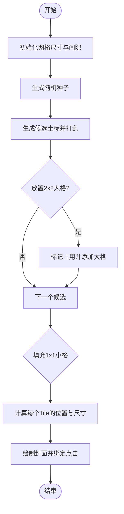
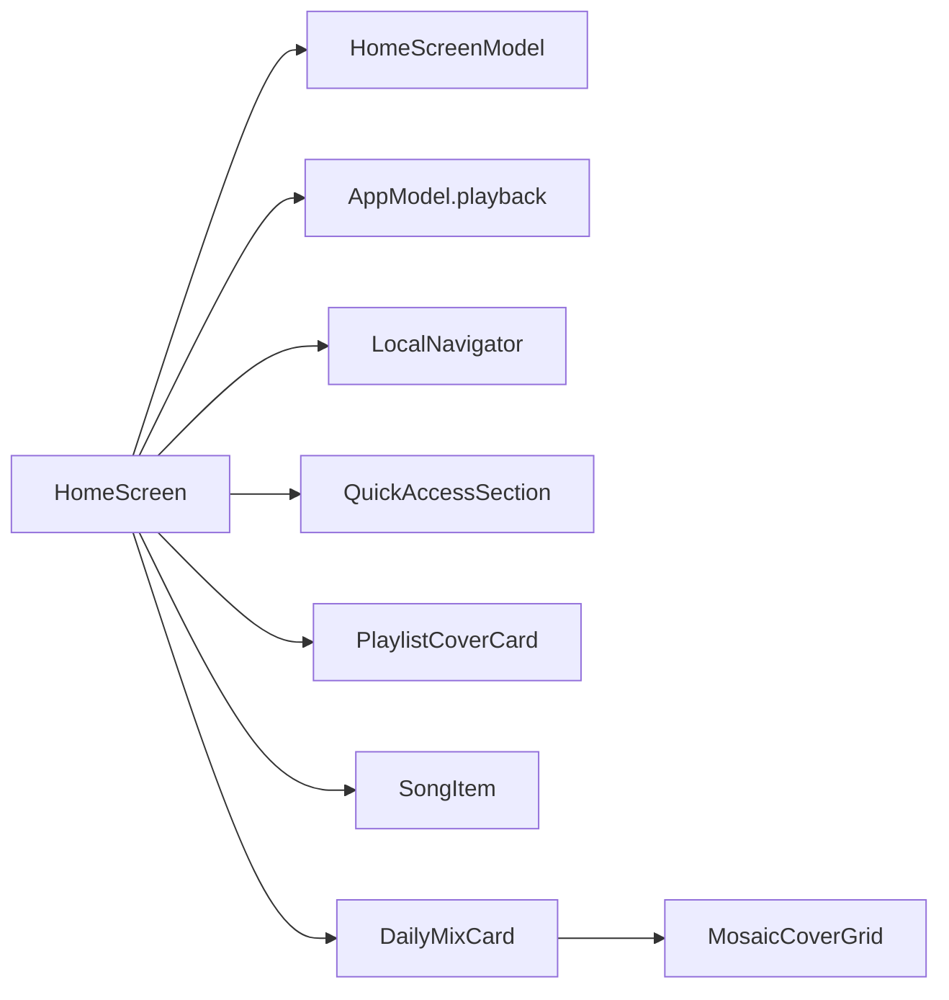

# 主界面组件

<cite>
**本文引用的文件**
- [HomeScreen.kt](file://app/src/commonMain/kotlin/cp/player/app/ui/screen/HomeScreen.kt)
- [HomeScreenModel.kt](file://app/src/commonMain/kotlin/cp/player/app/ui/model/HomeScreenModel.kt)
- [PlaylistCard.kt](file://app/src/commonMain/kotlin/cp/player/app/ui/component/PlaylistCard.kt)
- [QuickAccessSection.kt](file://app/src/commonMain/kotlin/cp/player/app/ui/component/QuickAccessSection.kt)
- [SongItem.kt](file://app/src/commonMain/kotlin/cp/player/app/ui/component/SongItem.kt)
- [UiFoundation.kt](file://app/src/commonMain/kotlin/cp/player/app/ui/component/UiFoundation.kt)
- [LegacyListItem.kt](file://app/src/commonMain/kotlin/cp/player/app/ui/component/LegacyListItem.kt)
</cite>

## 目录
1. [简介](#简介)
2. [项目结构](#项目结构)
3. [核心组件](#核心组件)
4. [架构总览](#架构总览)
5. [详细组件分析](#详细组件分析)
6. [依赖关系分析](#依赖关系分析)
7. [性能考量](#性能考量)
8. [故障排查指南](#故障排查指南)
9. [结论](#结论)

## 简介
本技术文档聚焦于主界面组件 HomeScreen，系统性说明其功能实现与状态管理：每日推荐歌曲展示、推荐歌单列表、最近播放记录与快速访问区域；阐述 HomeScreenModel 如何集中管理 UI 状态与数据流；深入解析每日推荐卡片（DailyMixCard）的封面网格布局、渐变背景与响应式适配；详解马赛克封面网格（MosaicCoverGrid）的算法实现与性能优化；覆盖用户交互（点击播放、加入队列、收藏、添加到歌单等），并重点说明与播放控制器的集成及导航机制。

## 项目结构
HomeScreen 由“屏幕层 + 模型层 + 组件层”构成：
- 屏幕层：HomeScreen.kt 负责页面组装、事件绑定与导航跳转。
- 模型层：HomeScreenModel.kt 通过 StateFlow 暴露 UI 状态，封装数据加载与刷新逻辑。
- 组件层：PlaylistCard、QuickAccessSection、SongItem、UiFoundation、LegacyListItem 等提供可复用 UI 元素。

图表来源
- [HomeScreen.kt:75-271](file://app/src/commonMain/kotlin/cp/player/app/ui/screen/HomeScreen.kt#L75-L271)
- [HomeScreenModel.kt:26-95](file://app/src/commonMain/kotlin/cp/player/app/ui/model/HomeScreenModel.kt#L26-L95)
- [PlaylistCard.kt:132-185](file://app/src/commonMain/kotlin/cp/player/app/ui/component/PlaylistCard.kt#L132-L185)
- [QuickAccessSection.kt:52-161](file://app/src/commonMain/kotlin/cp/player/app/ui/component/QuickAccessSection.kt#L52-L161)
- [SongItem.kt:38-130](file://app/src/commonMain/kotlin/cp/player/app/ui/component/SongItem.kt#L38-L130)

章节来源
- [HomeScreen.kt:75-271](file://app/src/commonMain/kotlin/cp/player/app/ui/screen/HomeScreen.kt#L75-L271)
- [HomeScreenModel.kt:26-95](file://app/src/commonMain/kotlin/cp/player/app/ui/model/HomeScreenModel.kt#L26-L95)

## 核心组件
- HomeScreenContent：组合页面各区块，监听 HomeScreenModel.state，处理加载/错误/空态，组织滚动列表。
- DailyMixCard：展示每日推荐标题、数量、播放全部按钮，以及马赛克封面网格。
- MosaicCoverGrid：基于固定行列网格与随机大格占位算法生成不规则封面布局。
- QuickAccessSection：横向分页的快速访问卡片（为你推荐/私人FM/个人歌单预览）。
- PlaylistCoverCard：推荐歌单的方形封面卡片，带渐变遮罩与名称。
- SongItem：最近播放的歌曲条目，支持选项菜单与当前播放高亮。
- UiFoundation：全局间距、页面头部、内容状态、按压缩放等基础能力。
- LegacyListItem：通用分段列表项容器，统一圆角与点击反馈。

章节来源
- [HomeScreen.kt:75-271](file://app/src/commonMain/kotlin/cp/player/app/ui/screen/HomeScreen.kt#L75-L271)
- [PlaylistCard.kt:132-185](file://app/src/commonMain/kotlin/cp/player/app/ui/component/PlaylistCard.kt#L132-L185)
- [QuickAccessSection.kt:52-161](file://app/src/commonMain/kotlin/cp/player/app/ui/component/QuickAccessSection.kt#L52-L161)
- [SongItem.kt:38-130](file://app/src/commonMain/kotlin/cp/player/app/ui/component/SongItem.kt#L38-L130)
- [UiFoundation.kt:38-182](file://app/src/commonMain/kotlin/cp/player/app/ui/component/UiFoundation.kt#L38-L182)
- [LegacyListItem.kt:19-66](file://app/src/commonMain/kotlin/cp/player/app/ui/component/LegacyListItem.kt#L19-L66)

## 架构总览
HomeScreen 采用“屏幕-模型-组件”分层：
- 屏幕层只关注 UI 组合与事件派发，不持有业务状态。
- 模型层通过 StateFlow 暴露不可变状态，使用协程在 IO 线程拉取数据，统一错误与加载态。
- 组件层高度解耦，通过回调与参数驱动渲染。

图表来源
- [HomeScreen.kt:75-271](file://app/src/commonMain/kotlin/cp/player/app/ui/screen/HomeScreen.kt#L75-L271)
- [HomeScreenModel.kt:26-95](file://app/src/commonMain/kotlin/cp/player/app/ui/model/HomeScreenModel.kt#L26-L95)

## 详细组件分析

### HomeScreen 与状态管理
- 状态来源：HomeScreenModel.state 暴露 HomeUiState，包含 dailySongs、recommendedPlaylists、userPlaylists、loading、error。
- 数据加载：refresh() 在 IO 线程调用 loadHome()，依次请求推荐歌曲、推荐歌单、用户歌单，合并结果并设置 loading=false。
- 播放集成：通过 AppModel.playback.playQueue 将媒体 ID 入队播放；收藏与加入队列分别调用 toggleFavoriteFor 与 addToQueue。
- 导航：使用 LocalNavigator.push 进入 PlaylistDetailScreen。
- 响应式：根据 LocalIsExpanded 调整卡片宽度与网格行数，实现大屏与小屏自适应。

章节来源
- [HomeScreen.kt:75-271](file://app/src/commonMain/kotlin/cp/player/app/ui/screen/HomeScreen.kt#L75-L271)
- [HomeScreenModel.kt:26-95](file://app/src/commonMain/kotlin/cp/player/app/ui/model/HomeScreenModel.kt#L26-L95)

### 每日推荐卡片（DailyMixCard）
- 封面背景：首曲封面图铺满顶部区域，叠加垂直渐变遮罩提升文字可读性。
- 标题与操作：显示“每日推荐”与曲目数，右侧“播放全部”按钮触发从首曲开始播放整列。
- 网格布局：委托给 MosaicCoverGrid，根据 expanded 状态选择不同行数，形成紧凑或舒展的视觉密度。
- 响应式：在 Expanded 模式下限制最大宽度，避免在大屏上过度拉伸。

章节来源
- [HomeScreen.kt:273-338](file://app/src/commonMain/kotlin/cp/player/app/ui/screen/HomeScreen.kt#L273-L338)

### 马赛克封面网格（MosaicCoverGrid）算法与优化
- 网格规格：固定 6 列，行数为配置参数（默认 4 行）。单元格宽度由父容器约束计算，考虑间隙像素换算。
- 大格占位：随机候选位置中优先放置 2x2 大格，最多 4 个，标记占用矩阵，确保不重叠。
- 填充剩余：遍历网格，未占用位置以 1x1 小格填充，按顺序映射到可用封面 URL。
- 稳定性：使用种子随机数，保证同一组歌曲的布局稳定，避免抖动。
- 性能要点：
  - 仅对可见区域进行绘制，利用 Compose 懒渲染特性。
  - 图片加载使用异步组件，避免阻塞主线程。
  - 计算一次后缓存 tiles，减少重复计算。
  - 圆角裁剪与偏移计算在单次循环内完成，降低开销。

图表来源
- [HomeScreen.kt:340-406](file://app/src/commonMain/kotlin/cp/player/app/ui/screen/HomeScreen.kt#L340-L406)

章节来源
- [HomeScreen.kt:340-406](file://app/src/commonMain/kotlin/cp/player/app/ui/screen/HomeScreen.kt#L340-L406)

### 快速访问区域（QuickAccessSection）
- 内容组成：第一个页为 FM 入口（为你推荐/私人FM），后续页为用户歌单预览。
- 交互：点击卡片主体或箭头图标触发对应动作；指示器随当前页变化，支持动画过渡。
- 响应式：Expanded 模式减小动画幅度与间距，适配大屏体验。

章节来源
- [QuickAccessSection.kt:52-161](file://app/src/commonMain/kotlin/cp/player/app/ui/component/QuickAccessSection.kt#L52-L161)

### 推荐歌单列表（PlaylistCoverCard）
- 外观：正方形封面，底部渐变遮罩与歌单名；无封面时回退到占位图标。
- 行为：点击跳转至歌单详情页。

章节来源
- [PlaylistCard.kt:132-185](file://app/src/commonMain/kotlin/cp/player/app/ui/component/PlaylistCard.kt#L132-L185)

### 最近播放（SongItem）
- 外观：左侧封面，中间歌名与专辑信息，右侧更多操作按钮；当前播放项高亮。
- 行为：点击播放该曲；更多操作弹出选项面板（播放、收藏、加入队列、添加到歌单）。

章节来源
- [SongItem.kt:38-130](file://app/src/commonMain/kotlin/cp/player/app/ui/component/SongItem.kt#L38-L130)

### 基础组件（UiFoundation、LegacyListItem）
- UiFoundation：提供 LocalIsExpanded、CpSpacing、PageHeader、SectionHeader、ContentState、StateSurface、按压缩放等。
- LegacyListItem：统一列表项容器，支持 leading/headline/supporting/trailing 插槽与分段圆角。

章节来源
- [UiFoundation.kt:38-182](file://app/src/commonMain/kotlin/cp/player/app/ui/component/UiFoundation.kt#L38-L182)
- [LegacyListItem.kt:19-66](file://app/src/commonMain/kotlin/cp/player/app/ui/component/LegacyListItem.kt#L19-L66)

## 依赖关系分析
- HomeScreen 依赖 HomeScreenModel 获取状态，依赖 AppModel.playback 执行播放相关操作，依赖 LocalNavigator 进行页面跳转。
- DailyMixCard 依赖 MosaicCoverGrid 完成复杂网格布局。
- QuickAccessSection 与 PlaylistCoverCard 用于展示与导航到歌单详情。
- SongItem 与 LegacyListItem 提供统一的列表项样式与交互。

图表来源
- [HomeScreen.kt:75-271](file://app/src/commonMain/kotlin/cp/player/app/ui/screen/HomeScreen.kt#L75-L271)
- [HomeScreenModel.kt:26-95](file://app/src/commonMain/kotlin/cp/player/app/ui/model/HomeScreenModel.kt#L26-L95)

章节来源
- [HomeScreen.kt:75-271](file://app/src/commonMain/kotlin/cp/player/app/ui/screen/HomeScreen.kt#L75-L271)
- [HomeScreenModel.kt:26-95](file://app/src/commonMain/kotlin/cp/player/app/ui/model/HomeScreenModel.kt#L26-L95)

## 性能考量
- 数据加载：所有网络请求在 IO 线程执行，避免阻塞 UI；加载态与错误态清晰分离，减少重绘。
- 网格布局：tiles 计算结果缓存，随机种子保证布局稳定；仅在必要时重新计算。
- 图片渲染：使用异步图片组件，按需加载与裁剪，避免大图阻塞。
- 响应式：根据窗口宽度调整布局密度与动画强度，提升大屏体验。
- 列表渲染：LazyColumn/LazyRow 仅渲染可见项，降低内存与 CPU 压力。

[本节为通用性能建议，不直接分析具体文件]

## 故障排查指南
- 推荐内容为空：检查登录状态与 API 返回；若未登录或过期，loadHome 会设置 error 提示。
- 加载卡住：确认 refresh 是否被调用且 loading 标志正确切换；查看日志输出定位 IO 线程执行情况。
- 播放失败：核对媒体 ID 格式（provider://song/id），确保 AppModel.playback 已正确注入。
- 网格异常：检查 songs 列表是否为空；确认 coverUrl 存在；验证 gridRows 与 gridCols 配置。
- 导航无效：确认 LocalNavigator 可用且目标 Screen 已注册。

章节来源
- [HomeScreenModel.kt:51-95](file://app/src/commonMain/kotlin/cp/player/app/ui/model/HomeScreenModel.kt#L51-L95)
- [HomeScreen.kt:92-236](file://app/src/commonMain/kotlin/cp/player/app/ui/screen/HomeScreen.kt#L92-L236)

## 结论
HomeScreen 通过清晰的“屏幕-模型-组件”分层实现了主界面的核心功能：每日推荐、推荐歌单、最近播放与快速访问。HomeScreenModel 以 StateFlow 统一管理状态与数据流，配合 AppModel.playback 与 LocalNavigator 完成播放与导航。DailyMixCard 与 MosaicCoverGrid 提供了美观且高性能的马赛克封面布局，结合响应式设计在不同屏幕下表现一致。整体代码结构易于扩展与维护，适合持续迭代与功能增强。