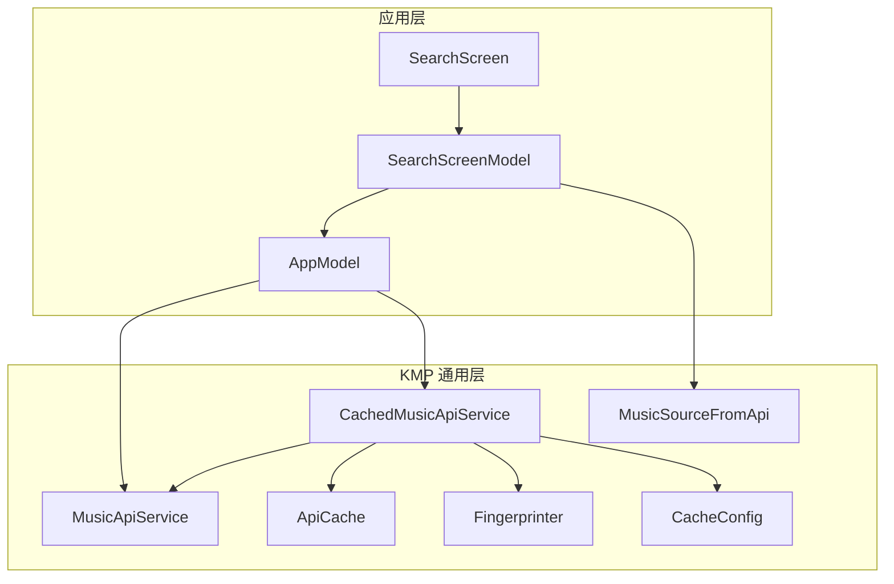
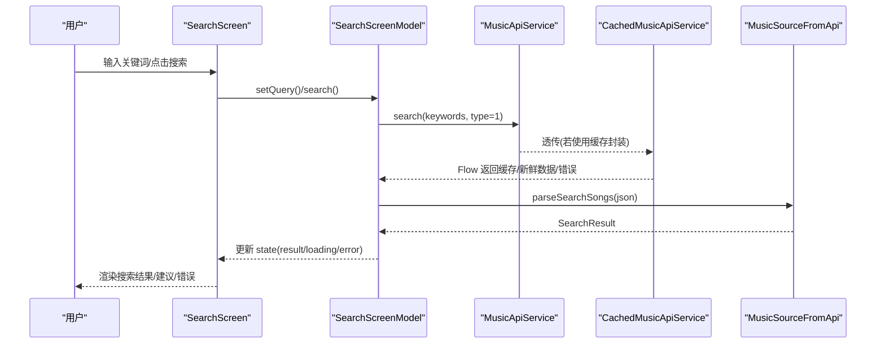
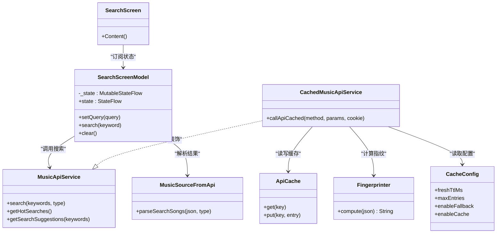
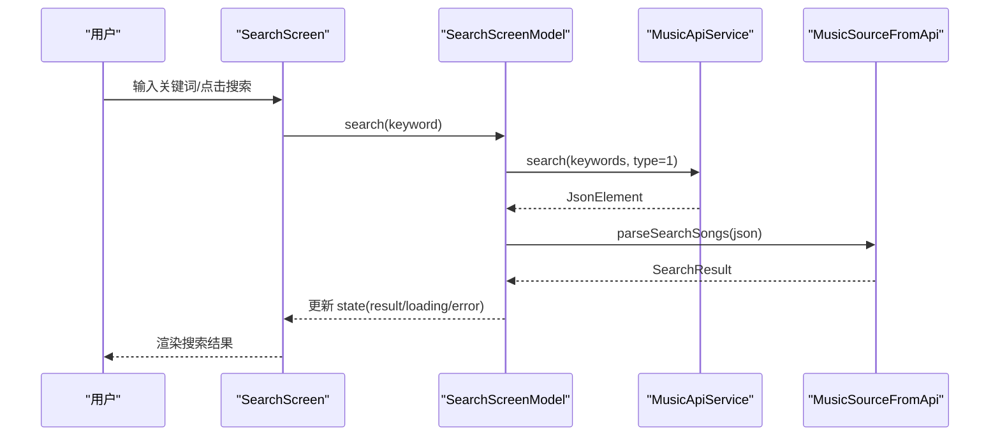
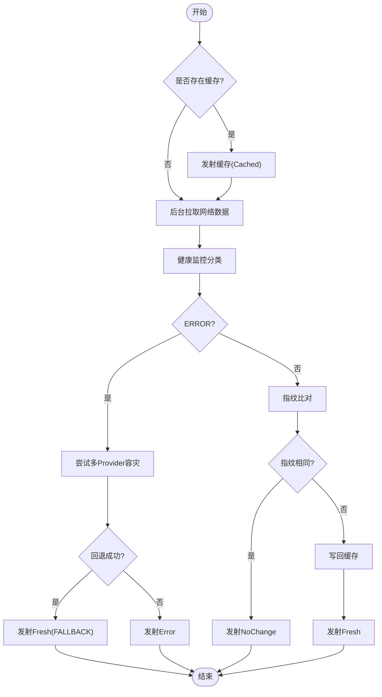

# 搜索界面组件

<cite>
**本文引用的文件**
- [SearchScreen.kt](file://app/src/commonMain/kotlin/cp/player/app/ui/screen/SearchScreen.kt)
- [SearchScreenModel.kt](file://app/src/commonMain/kotlin/cp/player/app/ui/model/SearchScreenModel.kt)
- [MusicApiService.kt](file://kmp-pro/src/commonMain/kotlin/cp/player/kmp/api/MusicApiService.kt)
- [CachedMusicApiService.kt](file://kmp-pro/src/commonMain/kotlin/cp/player/kmp/cache/CachedMusicApiService.kt)
- [MusicSourceFromApi.kt](file://kmp-pro/src/commonMain/kotlin/cp/player/kmp/music/MusicSourceFromApi.kt)
- [ApiCache.kt](file://kmp-pro/src/commonMain/kotlin/cp/player/kmp/cache/ApiCache.kt)
- [CacheConfig.kt](file://kmp-pro/src/commonMain/kotlin/cp/player/kmp/cache/CacheConfig.kt)
- [Fingerprinter.kt](file://kmp-pro/src/commonMain/kotlin/cp/player/kmp/cache/Fingerprinter.kt)
- [AppModel.kt](file://app/src/commonMain/kotlin/cp/player/app/AppModel.kt)
</cite>

## 目录
1. [简介](#简介)
2. [项目结构](#项目结构)
3. [核心组件](#核心组件)
4. [架构总览](#架构总览)
5. [详细组件分析](#详细组件分析)
6. [依赖关系分析](#依赖关系分析)
7. [性能与缓存](#性能与缓存)
8. [故障排查指南](#故障排查指南)
9. [结论](#结论)
10. [附录：关键流程时序图](#附录：关键流程时序图)

## 简介
本技术文档围绕搜索界面组件展开，重点说明 SearchScreen 的实时搜索、搜索结果展示与搜索历史管理；阐述状态管理模式（SearchScreenModel）如何驱动 UI 状态；解释搜索算法实现（关键词匹配、模糊搜索、排序策略）、分页加载与缓存机制；说明搜索建议与历史记录功能，以及如何通过 MusicApiService 统一接入后端并处理结果。同时提供异步请求与错误重试的实践要点。

## 项目结构
搜索相关代码主要分布在应用层 UI 与 KMP 通用模块中：
- 应用层 UI：SearchScreen（Compose 界面）、SearchScreenModel（状态与业务编排）
- KMP 通用层：MusicApiService（统一 API 接口）、CachedMusicApiService（带缓存与健康监控封装）、MusicSourceFromApi（JSON→领域模型解析）、ApiCache/Fingerprinter/CacheConfig（缓存与指纹）

图表来源
- [SearchScreen.kt:52-227](file://app/src/commonMain/kotlin/cp/player/app/ui/screen/SearchScreen.kt#L52-L227)
- [SearchScreenModel.kt:23-76](file://app/src/commonMain/kotlin/cp/player/app/ui/model/SearchScreenModel.kt#L23-L76)
- [MusicApiService.kt:150-162](file://kmp-pro/src/commonMain/kotlin/cp/player/kmp/api/MusicApiService.kt#L150-L162)
- [CachedMusicApiService.kt:46-88](file://kmp-pro/src/commonMain/kotlin/cp/player/kmp/cache/CachedMusicApiService.kt#L46-L88)
- [MusicSourceFromApi.kt:85-99](file://kmp-pro/src/commonMain/kotlin/cp/player/kmp/music/MusicSourceFromApi.kt#L85-L99)
- [ApiCache.kt:11-18](file://kmp-pro/src/commonMain/kotlin/cp/player/kmp/cache/ApiCache.kt#L11-L18)
- [CacheConfig.kt:11-16](file://kmp-pro/src/commonMain/kotlin/cp/player/kmp/cache/CacheConfig.kt#L11-L16)
- [Fingerprinter.kt:24-62](file://kmp-pro/src/commonMain/kotlin/cp/player/kmp/cache/Fingerprinter.kt#L24-L62)

章节来源
- [SearchScreen.kt:52-227](file://app/src/commonMain/kotlin/cp/player/app/ui/screen/SearchScreen.kt#L52-L227)
- [SearchScreenModel.kt:23-76](file://app/src/commonMain/kotlin/cp/player/app/ui/model/SearchScreenModel.kt#L23-L76)
- [MusicApiService.kt:150-162](file://kmp-pro/src/commonMain/kotlin/cp/player/kmp/api/MusicApiService.kt#L150-L162)
- [CachedMusicApiService.kt:46-88](file://kmp-pro/src/commonMain/kotlin/cp/player/kmp/cache/CachedMusicApiService.kt#L46-L88)
- [MusicSourceFromApi.kt:85-99](file://kmp-pro/src/commonMain/kotlin/cp/player/kmp/music/MusicSourceFromApi.kt#L85-L99)
- [ApiCache.kt:11-18](file://kmp-pro/src/commonMain/kotlin/cp/player/kmp/cache/ApiCache.kt#L11-L18)
- [CacheConfig.kt:11-16](file://kmp-pro/src/commonMain/kotlin/cp/player/kmp/cache/CacheConfig.kt#L11-L16)
- [Fingerprinter.kt:24-62](file://kmp-pro/src/commonMain/kotlin/cp/player/kmp/cache/Fingerprinter.kt#L24-L62)

## 核心组件
- SearchScreen：基于 Compose 的搜索界面，包含搜索输入框、搜索建议/热门搜索标签、搜索结果列表、播放与收藏等交互。
- SearchScreenModel：维护搜索状态（查询词、结果、加载中、错误、建议、热搜），负责发起搜索、获取建议与热搜、更新状态。
- MusicApiService：统一的音乐 API 接口，定义搜索、热搜、建议等方法。
- CachedMusicApiService：为 API 调用增加“先返回缓存、后台拉取、指纹比对、健康监控与多 Provider 容灾”的能力。
- MusicSourceFromApi：将 JSON 响应解析为强类型领域模型（如 SearchResult）。
- ApiCache/Fingerprinter/CacheConfig：内存 LRU 缓存、响应指纹计算、缓存配置。

章节来源
- [SearchScreen.kt:52-227](file://app/src/commonMain/kotlin/cp/player/app/ui/screen/SearchScreen.kt#L52-L227)
- [SearchScreenModel.kt:23-76](file://app/src/commonMain/kotlin/cp/player/app/ui/model/SearchScreenModel.kt#L23-L76)
- [MusicApiService.kt:150-162](file://kmp-pro/src/commonMain/kotlin/cp/player/kmp/api/MusicApiService.kt#L150-L162)
- [CachedMusicApiService.kt:46-88](file://kmp-pro/src/commonMain/kotlin/cp/player/kmp/cache/CachedMusicApiService.kt#L46-L88)
- [MusicSourceFromApi.kt:85-99](file://kmp-pro/src/commonMain/kotlin/cp/player/kmp/music/MusicSourceFromApi.kt#L85-L99)
- [ApiCache.kt:11-18](file://kmp-pro/src/commonMain/kotlin/cp/player/kmp/cache/ApiCache.kt#L11-L18)
- [CacheConfig.kt:11-16](file://kmp-pro/src/commonMain/kmp/cache/CacheConfig.kt#L11-L16)
- [Fingerprinter.kt:24-62](file://kmp-pro/src/commonMain/kotlin/cp/player/kmp/cache/Fingerprinter.kt#L24-L62)

## 架构总览
搜索流程从 UI 触发，经 ScreenModel 编排，调用 MusicApiService 进行网络请求，并通过 MusicSourceFromApi 将 JSON 转换为领域模型，再由 UI 渲染。缓存层在 CachedMusicApiService 中提供“先缓存后刷新”的体验，并结合健康监控与多 Provider 容灾提升可用性。

图表来源
- [SearchScreen.kt:68-188](file://app/src/commonMain/kotlin/cp/player/app/ui/screen/SearchScreen.kt#L68-L188)
- [SearchScreenModel.kt:39-74](file://app/src/commonMain/kotlin/cp/player/app/ui/model/SearchScreenModel.kt#L39-L74)
- [MusicApiService.kt:150-162](file://kmp-pro/src/commonMain/kotlin/cp/player/kmp/api/MusicApiService.kt#L150-L162)
- [CachedMusicApiService.kt:60-88](file://kmp-pro/src/commonMain/kotlin/cp/player/kmp/cache/CachedMusicApiService.kt#L60-L88)
- [MusicSourceFromApi.kt:85-99](file://kmp-pro/src/commonMain/kotlin/cp/player/kmp/music/MusicSourceFromApi.kt#L85-L99)

## 详细组件分析

### SearchScreen（UI 层）
- 搜索输入：支持清空、回车触发搜索、显示加载/错误/空结果状态。
- 搜索建议与热门搜索：当无搜索结果时展示建议或热门标签，点击即触发搜索。
- 搜索结果列表：LazyColumn 展示歌曲条目，支持播放、收藏、加入歌单等操作。
- 与播放系统集成：通过 AppModel.playback 操作播放队列与收藏状态。

章节来源
- [SearchScreen.kt:68-188](file://app/src/commonMain/kotlin/cp/player/app/ui/screen/SearchScreen.kt#L68-L188)
- [SearchScreen.kt:192-224](file://app/src/commonMain/kotlin/cp/player/app/ui/screen/SearchScreen.kt#L192-L224)

### SearchScreenModel（状态与业务编排）
- 状态模型：SearchUiState 包含 query、result、loading、error、hotSearches、suggestions。
- 初始化：启动时加载热搜。
- 实时建议：setQuery 时根据关键词更新 suggestions。
- 搜索执行：search 方法清理空查询、设置 loading、调用 MusicSourceFromApi.search 并处理成功/失败/不支持三种结果。
- 错误处理：将错误信息写入 state.error，UI 可据此提示并重试。

章节来源
- [SearchScreenModel.kt:14-21](file://app/src/commonMain/kotlin/cp/player/app/ui/model/SearchScreenModel.kt#L14-L21)
- [SearchScreenModel.kt:27-37](file://app/src/commonMain/kotlin/cp/player/app/ui/model/SearchScreenModel.kt#L27-L37)
- [SearchScreenModel.kt:39-54](file://app/src/commonMain/kotlin/cp/player/app/ui/model/SearchScreenModel.kt#L39-L54)
- [SearchScreenModel.kt:58-74](file://app/src/commonMain/kotlin/cp/player/app/ui/model/SearchScreenModel.kt#L58-L74)

### MusicApiService（统一 API 入口）
- 搜索相关方法：search（云搜索，type 指定类型）、getHotSearches（热搜）、getSearchSuggestions（搜索建议）。
- 设计原则：所有方法返回 JsonElement，由上层解析；内部自动注入 cookie；错误统一格式。

章节来源
- [MusicApiService.kt:150-162](file://kmp-pro/src/commonMain/kotlin/cp/player/kmp/api/MusicApiService.kt#L150-L162)

### CachedMusicApiService（缓存与健康监控）
- 调用流程：callApiCached 先返回缓存（若存在），后台拉取新数据，比较指纹决定是否替换；错误时尝试多 Provider 容灾回退。
- 缓存键：providerId#method#sortedParams#cookieHash。
- 指纹计算：Fingerprinter 生成稳定签名，避免重复更新。
- 健康监控：根据 HealthMonitor 分类决定回退与告警。

章节来源
- [CachedMusicApiService.kt:18-45](file://kmp-pro/src/commonMain/kotlin/cp/player/kmp/cache/CachedMusicApiService.kt#L18-L45)
- [CachedMusicApiService.kt:60-88](file://kmp-pro/src/commonMain/kotlin/cp/player/kmp/cache/CachedMusicApiService.kt#L60-L88)
- [CachedMusicApiService.kt:90-140](file://kmp-pro/src/commonMain/kotlin/cp/player/kmp/cache/CachedMusicApiService.kt#L90-L140)
- [CachedMusicApiService.kt:142-180](file://kmp-pro/src/commonMain/kotlin/cp/player/kmp/cache/CachedMusicApiService.kt#L142-L180)
- [ApiCache.kt:51-67](file://kmp-pro/src/commonMain/kotlin/cp/player/kmp/cache/ApiCache.kt#L51-L67)
- [Fingerprinter.kt:24-62](file://kmp-pro/src/commonMain/kotlin/cp/player/kmp/cache/Fingerprinter.kt#L24-L62)

### MusicSourceFromApi（JSON→领域模型）
- 搜索解析：parseSearchSongs 从 result.songs/playlists/artists 提取数据，构建 SearchResult。
- 统一错误处理：toMusicResult 对 code/status 判断是否成功、不支持或错误，并提取消息。

章节来源
- [MusicSourceFromApi.kt:29-60](file://kmp-pro/src/commonMain/kotlin/cp/player/kmp/music/MusicSourceFromApi.kt#L29-L60)
- [MusicSourceFromApi.kt:85-99](file://kmp-pro/src/commonMain/kotlin/cp/player/kmp/music/MusicSourceFromApi.kt#L85-L99)

### AppModel（应用服务定位器）
- 暴露 api 与 cachedApi：供 UI 选择直通或带缓存的 API 调用。
- 播放控制：playback 用于播放队列与收藏操作。

章节来源
- [AppModel.kt:51-63](file://app/src/commonMain/kotlin/cp/player/app/AppModel.kt#L51-L63)

## 依赖关系分析
- SearchScreen 依赖 SearchScreenModel 的状态流。
- SearchScreenModel 依赖 AppModel.api 与 MusicSourceFromApi。
- MusicApiService 被 CachedMusicApiService 装饰，提供缓存与健康监控能力。
- ApiCache 与 Fingerprinter 支撑缓存与指纹比对。
- CacheConfig 控制缓存行为。

图表来源
- [SearchScreen.kt:52-227](file://app/src/commonMain/kotlin/cp/player/app/ui/screen/SearchScreen.kt#L52-L227)
- [SearchScreenModel.kt:23-76](file://app/src/commonMain/kotlin/cp/player/app/ui/model/SearchScreenModel.kt#L23-L76)
- [MusicApiService.kt:150-162](file://kmp-pro/src/commonMain/kotlin/cp/player/kmp/api/MusicApiService.kt#L150-L162)
- [CachedMusicApiService.kt:46-88](file://kmp-pro/src/commonMain/kotlin/cp/player/kmp/cache/CachedMusicApiService.kt#L46-L88)
- [MusicSourceFromApi.kt:85-99](file://kmp-pro/src/commonMain/kotlin/cp/player/kmp/music/MusicSourceFromApi.kt#L85-L99)
- [ApiCache.kt:11-18](file://kmp-pro/src/commonMain/kotlin/cp/player/kmp/cache/ApiCache.kt#L11-L18)
- [CacheConfig.kt:11-16](file://kmp-pro/src/commonMain/kotlin/cp/player/kmp/cache/CacheConfig.kt#L11-L16)
- [Fingerprinter.kt:24-62](file://kmp-pro/src/commonMain/kotlin/cp/player/kmp/cache/Fingerprinter.kt#L24-L62)

## 性能与缓存
- 实时建议：setQuery 触发 updateSuggestions，减少无效搜索请求。
- 缓存优先：CachedMusicApiService 先返回缓存，后台拉取并比对指纹，避免频繁 UI 更新。
- 指纹优化：Fingerprinter 仅关注关键字段与主数组 id，降低比对开销。
- 容灾回退：健康监控 ERROR 时尝试其他 Provider，提高可用性。
- 分页加载：当前实现未显式分页，建议在 MusicApiService.search 扩展 offset/limit 参数，并在 UI 层实现滚动加载更多。
- 网络请求优化：结合 Debounce（可在 ScreenModel 中实现）减少高频输入导致的请求风暴。

章节来源
- [SearchScreenModel.kt:39-54](file://app/src/commonMain/kotlin/cp/player/app/ui/model/SearchScreenModel.kt#L39-L54)
- [CachedMusicApiService.kt:60-88](file://kmp-pro/src/commonMain/kotlin/cp/player/kmp/cache/CachedMusicApiService.kt#L60-L88)
- [Fingerprinter.kt:24-62](file://kmp-pro/src/commonMain/kotlin/cp/player/kmp/cache/Fingerprinter.kt#L24-L62)
- [MusicApiService.kt:150-162](file://kmp-pro/src/commonMain/kotlin/cp/player/kmp/api/MusicApiService.kt#L150-L162)

## 故障排查指南
- 搜索失败：检查 SearchScreenModel.search 中的错误分支，确认 BackendResult.Error/Unsupported 的处理逻辑。
- 缓存异常：查看 CachedMusicApiService 的 emitNetworkResult 捕获异常路径，确认缓存键与指纹是否正确。
- 健康监控：关注 HealthMonitor 记录，必要时启用 enableFallback 以切换 Provider。
- 建议为空：确认 getSearchSuggestions 的实现与返回数据格式。

章节来源
- [SearchScreenModel.kt:58-74](file://app/src/commonMain/kotlin/cp/player/app/ui/model/SearchScreenModel.kt#L58-L74)
- [CachedMusicApiService.kt:90-140](file://kmp-pro/src/commonMain/kotlin/cp/player/kmp/cache/CachedMusicApiService.kt#L90-L140)

## 结论
SearchScreen 通过 SearchScreenModel 统一管理搜索状态，结合 MusicApiService 与 MusicSourceFromApi 完成搜索请求与结果解析；CachedMusicApiService 提供缓存与健康监控，显著提升用户体验与稳定性。未来可扩展分页加载、防抖与更丰富的搜索算法以提升检索质量。

## 附录：关键流程时序图

### 搜索请求与结果处理

图表来源
- [SearchScreen.kt:68-188](file://app/src/commonMain/kotlin/cp/player/app/ui/screen/SearchScreen.kt#L68-L188)
- [SearchScreenModel.kt:58-74](file://app/src/commonMain/kotlin/cp/player/app/ui/model/SearchScreenModel.kt#L58-L74)
- [MusicApiService.kt:150-162](file://kmp-pro/src/commonMain/kotlin/cp/player/kmp/api/MusicApiService.kt#L150-L162)
- [MusicSourceFromApi.kt:85-99](file://kmp-pro/src/commonMain/kotlin/cp/player/kmp/music/MusicSourceFromApi.kt#L85-L99)

### 缓存与健康监控流程

图表来源
- [CachedMusicApiService.kt:60-88](file://kmp-pro/src/commonMain/kotlin/cp/player/kmp/cache/CachedMusicApiService.kt#L60-L88)
- [CachedMusicApiService.kt:90-140](file://kmp-pro/src/commonMain/kotlin/cp/player/kmp/cache/CachedMusicApiService.kt#L90-L140)
- [CachedMusicApiService.kt:142-180](file://kmp-pro/src/commonMain/kotlin/cp/player/kmp/cache/CachedMusicApiService.kt#L142-L180)
- [Fingerprinter.kt:24-62](file://kmp-pro/src/commonMain/kotlin/cp/player/kmp/cache/Fingerprinter.kt#L24-L62)