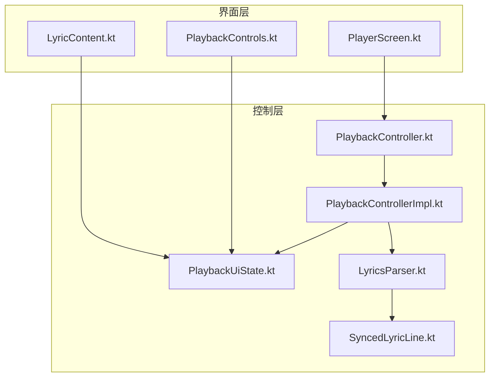
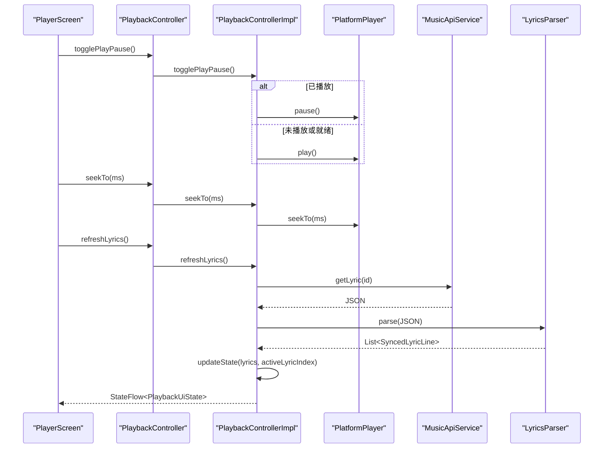
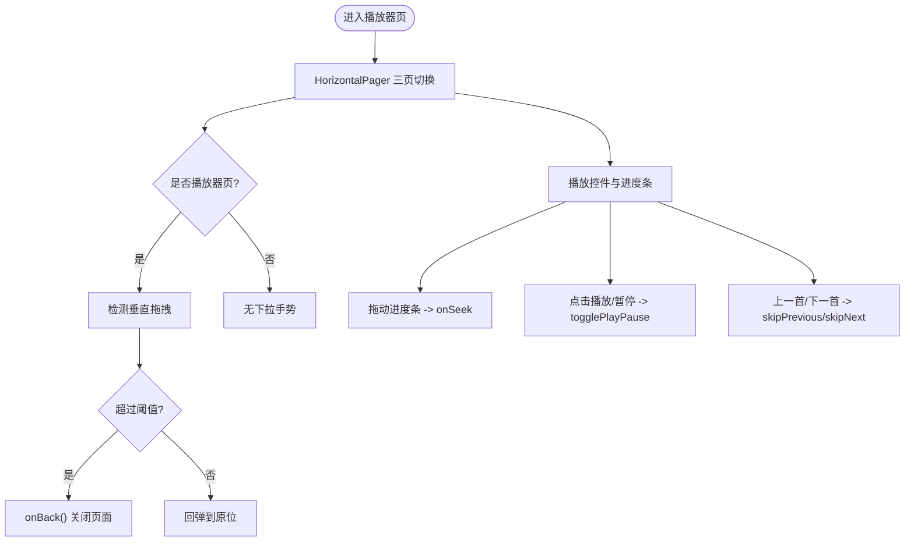
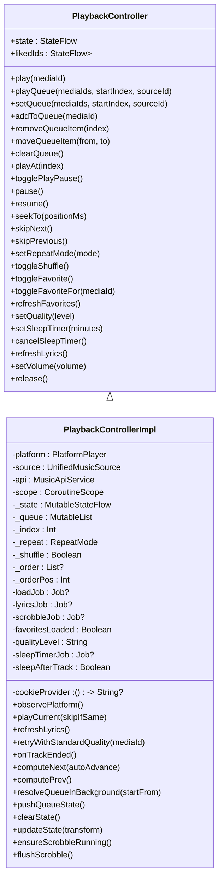
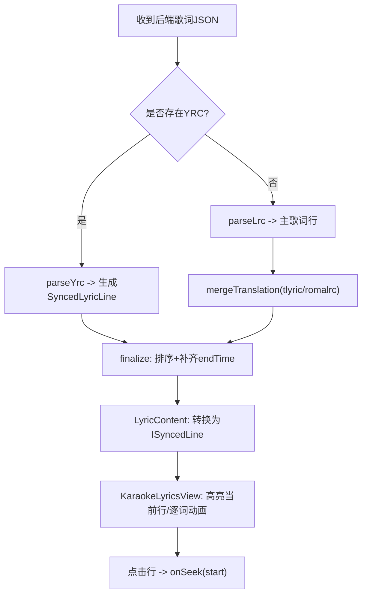
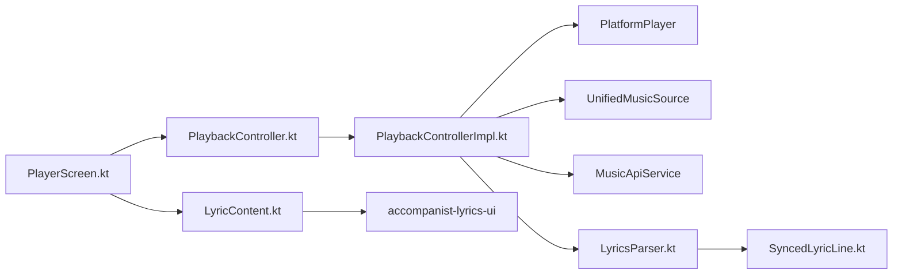

# 播放界面组件

<cite>
**本文引用的文件**
- [PlayerScreen.kt](file://app/src/commonMain/kotlin/cp/player/app/ui/screen/PlayerScreen.kt)
- [PlaybackController.kt](file://kmp-pro/src/commonMain/kotlin/cp/player/kmp/playback/PlaybackController.kt)
- [PlaybackControllerImpl.kt](file://kmp-pro/src/commonMain/kotlin/cp/player/kmp/playback/PlaybackControllerImpl.kt)
- [LyricsParser.kt](file://kmp-pro/src/commonMain/kotlin/cp/player/kmp/playback/LyricsParser.kt)
- [LyricContent.kt](file://app/src/commonMain/kotlin/cp/player/app/ui/component/LyricContent.kt)
- [PlaybackControls.kt](file://app/src/commonMain/kotlin/cp/player/app/ui/component/PlaybackControls.kt)
- [PlaybackUiState.kt](file://kmp-pro/src/commonMain/kotlin/cp/player/kmp/playback/PlaybackUiState.kt)
- [SyncedLyricLine.kt](file://kmp-pro/src/commonMain/kotlin/cp/player/kmp/playback/SyncedLyricLine.kt)
</cite>

## 目录
1. [简介](#简介)
2. [项目结构](#项目结构)
3. [核心组件](#核心组件)
4. [架构总览](#架构总览)
5. [详细组件分析](#详细组件分析)
6. [依赖关系分析](#依赖关系分析)
7. [性能考量](#性能考量)
8. [故障排查指南](#故障排查指南)
9. [结论](#结论)
10. [附录：自定义控件与交互示例](#附录自定义控件与交互示例)

## 简介
本技术文档聚焦于播放界面组件 PlayerScreen，围绕全屏播放器界面、歌词同步显示、播放进度控制、媒体信息展示、播放状态管理、手势处理、响应式设计与主题适配、以及与音频引擎的通信和状态同步机制进行系统化说明。文档同时给出与 PlaybackController 的集成方式，并解释歌词解析与时间轴对齐、动画效果实现路径，帮助开发者快速理解并扩展播放器 UI。

## 项目结构
- 界面层（Compose）：
  - 全屏播放页：PlayerScreen.kt，包含三页 HorizontalPager（歌词 / 播放器 / 评论），下拉关闭手势、TopBar 动态标题、底部工具栏等。
  - 歌词渲染：LyricContent.kt，基于 accompanist-lyrics-ui 的 KaraokeLyricsView，支持行级与逐字歌词、翻译与罗马音。
  - 播放控件：PlaybackControls.kt，上一首/播放暂停/下一首按钮，缓冲态加载指示。
- 播放控制层（KMP）：
  - PlaybackController 接口与 PlaybackControllerImpl 实现，负责队列、播放、收藏、音质、睡眠定时、歌词刷新、音量、Scrobble 上报等。
  - 状态模型：PlaybackUiState，UI 唯一数据源；歌词状态 LyricsState（由控制器维护）。
  - 歌词解析：LyricsParser，统一 LRC/YRC/翻译/罗马音到 SyncedLyricLine。
  - 数据结构：SyncedLyricLine，统一歌词行与逐词时间戳。

图表来源
- [PlayerScreen.kt:118-156](file://app/src/commonMain/kotlin/cp/player/app/ui/screen/PlayerScreen.kt#L118-L156)
- [LyricContent.kt:33-142](file://app/src/commonMain/kotlin/cp/player/app/ui/component/LyricContent.kt#L33-L142)
- [PlaybackControls.kt:37-118](file://app/src/commonMain/kotlin/cp/player/app/ui/component/PlaybackControls.kt#L37-L118)
- [PlaybackController.kt:16-106](file://kmp-pro/src/commonMain/kotlin/cp/player/kmp/playback/PlaybackController.kt#L16-L106)
- [PlaybackControllerImpl.kt:35-127](file://kmp-pro/src/commonMain/kotlin/cp/player/kmp/playback/PlaybackControllerImpl.kt#L35-L127)
- [LyricsParser.kt:21-51](file://kmp-pro/src/commonMain/kotlin/cp/player/kmp/playback/LyricsParser.kt#L21-L51)
- [SyncedLyricLine.kt:14-29](file://kmp-pro/src/commonMain/kotlin/cp/player/kmp/playback/SyncedLyricLine.kt#L14-L29)

章节来源
- [PlayerScreen.kt:118-156](file://app/src/commonMain/kotlin/cp/player/app/ui/screen/PlayerScreen.kt#L118-L156)
- [PlaybackController.kt:16-106](file://kmp-pro/src/commonMain/kotlin/cp/player/kmp/playback/PlaybackController.kt#L16-L106)

## 核心组件
- PlayerScreen：全屏播放页，三页切换（歌词/播放器/评论），下拉关闭手势，顶部栏根据页面动态显示，底部工具栏提供循环、随机、收藏、更多操作。
- PlaybackController：前端播放控制的唯一入口，暴露 state 流供 UI 订阅，封装队列、播放、收藏、音质、睡眠定时、歌词刷新、音量等操作。
- LyricsParser：将后端返回的 JSON 歌词（LRC/YRC/翻译/罗马音）解析为统一的 SyncedLyricLine 列表，并按时间排序补齐结束时间。
- LyricContent：基于 accompanist-lyrics-ui 的歌词视图，支持行级与逐字歌词、翻译与罗马音显示，点击歌词行可跳转播放位置。
- PlaybackControls：标准播放控件行，支持缓冲态加载指示与主题色适配。
- PlaybackUiState：不可变状态对象，承载当前曲目、队列、播放状态、进度、歌词、格式信息、错误、收藏、音质、睡眠定时等。

章节来源
- [PlayerScreen.kt:160-426](file://app/src/commonMain/kotlin/cp/player/app/ui/screen/PlayerScreen.kt#L160-L426)
- [PlaybackController.kt:16-106](file://kmp-pro/src/commonMain/kotlin/cp/player/kmp/playback/PlaybackController.kt#L16-L106)
- [LyricsParser.kt:21-152](file://kmp-pro/src/commonMain/kotlin/cp/player/kmp/playback/LyricsParser.kt#L21-L152)
- [LyricContent.kt:33-142](file://app/src/commonMain/kotlin/cp/player/app/ui/component/LyricContent.kt#L33-L142)
- [PlaybackControls.kt:37-118](file://app/src/commonMain/kotlin/cp/player/app/ui/component/PlaybackControls.kt#L37-L118)
- [PlaybackUiState.kt:5-35](file://kmp-pro/src/commonMain/kotlin/cp/player/kmp/playback/PlaybackUiState.kt#L5-L35)

## 架构总览
播放器采用“界面层 + 控制层”的分层设计：
- 界面层通过 collect PlaybackController.state 获取完整渲染状态，零业务逻辑，仅做 UI 呈现与用户事件回调。
- 控制层聚合平台播放器、音乐源、API 服务，负责队列管理、URL 解析、歌词拉取与解析、状态折叠、自动切歌、收藏与 Scrobble 上报、睡眠定时等。
- 歌词系统：LyricsParser 将多格式歌词统一为 SyncedLyricLine，LyricContent 使用 accompanist-lyrics-ui 渲染并支持点击跳转。

图表来源
- [PlaybackControllerImpl.kt:261-276](file://kmp-pro/src/commonMain/kotlin/cp/player/kmp/playback/PlaybackControllerImpl.kt#L261-L276)
- [PlaybackControllerImpl.kt:457-481](file://kmp-pro/src/commonMain/kotlin/cp/player/kmp/playback/PlaybackControllerImpl.kt#L457-L481)
- [LyricsParser.kt:21-51](file://kmp-pro/src/commonMain/kotlin/cp/player/kmp/playback/LyricsParser.kt#L21-L51)
- [PlayerScreen.kt:120-156](file://app/src/commonMain/kotlin/cp/player/app/ui/screen/PlayerScreen.kt#L120-L156)

## 详细组件分析

### PlayerScreen：全屏播放器界面
- 三页布局：HorizontalPager 管理歌词页、播放器页、评论页；顶部栏根据当前页动态显示标题与操作。
- 下拉关闭手势：仅在播放器页启用 detectVerticalDragGestures，超过阈值触发 onBack，否则回弹。
- 媒体信息与进度：封面图、歌曲名、歌手、进度条（含音质 chip）、主控件行（上一首/播放暂停/下一首）。
- 主题与背景：深色/浅色背景渐变，MaterialTheme 色彩体系；封面与标题使用 sharedBounds 过渡动画。
- 与 PlaybackController 集成：通过 AppModel.playback 获取控制器实例，调用 togglePlayPause、seekTo、skipNext、skipPrevious、setRepeatMode、toggleShuffle、clearQueue、playAt、removeQueueItem、moveQueueItem、toggleFavorite、setSleepTimer、cancelSleepTimer 等方法。

图表来源
- [PlayerScreen.kt:194-258](file://app/src/commonMain/kotlin/cp/player/app/ui/screen/PlayerScreen.kt#L194-L258)
- [PlayerScreen.kt:577-720](file://app/src/commonMain/kotlin/cp/player/app/ui/screen/PlayerScreen.kt#L577-L720)

章节来源
- [PlayerScreen.kt:160-426](file://app/src/commonMain/kotlin/cp/player/app/ui/screen/PlayerScreen.kt#L160-L426)
- [PlayerScreen.kt:481-676](file://app/src/commonMain/kotlin/cp/player/app/ui/screen/PlayerScreen.kt#L481-L676)

### PlaybackController：播放状态管理与引擎通信
- 状态流：state 暴露 PlaybackUiState，UI 直接订阅渲染。
- 队列管理：playQueue/setQueue/addToQueue/removeQueueItem/moveQueueItem/clearQueue/playAt，支持 shuffle 顺序与懒解析 TrackSummary。
- 播控：togglePlayPause/pause/resume/seekTo/skipNext/skipPrevious/setRepeatMode/toggleShuffle。
- 收藏：likedIds 集合，toggleFavorite/toggleFavoriteFor/refreshFavorites，乐观更新失败回滚。
- 音质：setQuality，影响后续 URL 请求等级；播放失败时自动降级到 standard 重试。
- 睡眠定时：setSleepTimer/cancelSleepTimer，支持“N分钟后暂停”与“播完当前后暂停”。
- 歌词：refreshLyrics，调用 MusicApiService.getLyric → LyricsParser.parse → 更新 lyrics 与 activeLyricIndex。
- 音量：setVolume，映射到 PlatformPlayer。
- 平台事件监听：observePlatform 将 PlatformPlayer 的状态/位置/时长/格式信息 fold 进 PlaybackUiState，并在 ended 时自动切歌或重复。

图表来源
- [PlaybackController.kt:16-106](file://kmp-pro/src/commonMain/kotlin/cp/player/kmp/playback/PlaybackController.kt#L16-L106)
- [PlaybackControllerImpl.kt:35-127](file://kmp-pro/src/commonMain/kotlin/cp/player/kmp/playback/PlaybackControllerImpl.kt#L35-L127)
- [PlaybackControllerImpl.kt:144-315](file://kmp-pro/src/commonMain/kotlin/cp/player/kmp/playback/PlaybackControllerImpl.kt#L144-L315)
- [PlaybackControllerImpl.kt:319-453](file://kmp-pro/src/commonMain/kotlin/cp/player/kmp/playback/PlaybackControllerImpl.kt#L319-L453)
- [PlaybackControllerImpl.kt:457-602](file://kmp-pro/src/commonMain/kotlin/cp/player/kmp/playback/PlaybackControllerImpl.kt#L457-L602)
- [PlaybackControllerImpl.kt:604-758](file://kmp-pro/src/commonMain/kotlin/cp/player/kmp/playback/PlaybackControllerImpl.kt#L604-L758)

章节来源
- [PlaybackController.kt:16-106](file://kmp-pro/src/commonMain/kotlin/cp/player/kmp/playback/PlaybackController.kt#L16-L106)
- [PlaybackControllerImpl.kt:35-127](file://kmp-pro/src/commonMain/kotlin/cp/player/kmp/playback/PlaybackControllerImpl.kt#L35-L127)
- [PlaybackControllerImpl.kt:144-315](file://kmp-pro/src/commonMain/kotlin/cp/player/kmp/playback/PlaybackControllerImpl.kt#L144-L315)
- [PlaybackControllerImpl.kt:319-453](file://kmp-pro/src/commonMain/kotlin/cp/player/kmp/playback/PlaybackControllerImpl.kt#L319-L453)
- [PlaybackControllerImpl.kt:457-602](file://kmp-pro/src/commonMain/kotlin/cp/player/kmp/playback/PlaybackControllerImpl.kt#L457-L602)
- [PlaybackControllerImpl.kt:604-758](file://kmp-pro/src/commonMain/kotlin/cp/player/kmp/playback/PlaybackControllerImpl.kt#L604-L758)

### 歌词解析与同步显示
- 解析流程：
  - 优先 YRC 逐字歌词，若存在则解析为 SyncedLyricLine 列表并 finalize。
  - 否则解析 LRC 行级歌词，合并翻译与罗马音（按时间近似相等合并，容差约 500ms）。
  - finalize 阶段按 time 升序排序，补齐 endTime（若无则用下一行起始时间或默认 4s）。
- 同步显示：
  - LyricContent 将 SyncedLyricLine 转换为 accompanist-lyrics-ui 的 ISyncedLine（KaraokeLine 或 SyncedLine），传入 KaraokeLyricsView。
  - currentPositionProvider 实时提供 positionMs，视图据此高亮当前行与逐词动画。
  - 点击歌词行触发 onSeek(line.start)，实现歌词跳转播放。
- 时间轴对齐：
  - PlaybackControllerImpl.computeLyricIndex 在 positionMs 变化时计算 activeLyricIndex（最后一行 time<=pos）。
  - LyricsParser.mergeTranslation 以 500ms 容差匹配翻译/罗马音行。

图表来源
- [LyricsParser.kt:21-51](file://kmp-pro/src/commonMain/kotlin/cp/player/kmp/playback/LyricsParser.kt#L21-L51)
- [LyricsParser.kt:57-96](file://kmp-pro/src/commonMain/kotlin/cp/player/kmp/playback/LyricsParser.kt#L57-L96)
- [LyricsParser.kt:104-149](file://kmp-pro/src/commonMain/kotlin/cp/player/kmp/playback/LyricsParser.kt#L104-L149)
- [LyricContent.kt:62-142](file://app/src/commonMain/kotlin/cp/player/app/ui/component/LyricContent.kt#L62-L142)
- [PlaybackControllerImpl.kt:131-140](file://kmp-pro/src/commonMain/kotlin/cp/player/kmp/playback/PlaybackControllerImpl.kt#L131-L140)

章节来源
- [LyricsParser.kt:21-152](file://kmp-pro/src/commonMain/kotlin/cp/player/kmp/playback/LyricsParser.kt#L21-L152)
- [LyricContent.kt:33-142](file://app/src/commonMain/kotlin/cp/player/app/ui/component/LyricContent.kt#L33-L142)
- [PlaybackControllerImpl.kt:131-140](file://kmp-pro/src/commonMain/kotlin/cp/player/kmp/playback/PlaybackControllerImpl.kt#L131-L140)

### 播放进度控制与媒体信息展示
- 进度条：ProgressRow 使用 Slider 绑定 state.positionMs 与 durationMs，拖动结束时调用 onSeek。
- 媒体信息：封面图（AsyncImage）、歌曲名与歌手（Text），支持共享边界动画（sharedBounds）。
- 音质 chip：formatInfo.qualityLabel 显示当前音质等级。
- 错误提示：state.error 非空时显示错误文本。

章节来源
- [PlayerScreen.kt:577-720](file://app/src/commonMain/kotlin/cp/player/app/ui/screen/PlayerScreen.kt#L577-L720)
- [PlayerScreen.kt:509-576](file://app/src/commonMain/kotlin/cp/player/app/ui/screen/PlayerScreen.kt#L509-L576)

### 手势处理：滑动切换、音量调节、进度拖动
- 滑动切换：HorizontalPager 管理三页切换；播放器页启用 detectVerticalDragGestures 实现下拉关闭。
- 进度拖动：Slider 的 onValueChange/onValueChangeFinished 实现拖动与提交 seek。
- 音量调节：PlaybackController.setVolume 映射到 PlatformPlayer.setVolume（UI 侧可通过设置面板或滑块接入）。
- 注意：当前代码未直接在 PlayerScreen 中实现音量滑动手势，但提供了 setVolume 接口以便扩展。

章节来源
- [PlayerScreen.kt:194-258](file://app/src/commonMain/kotlin/cp/player/app/ui/screen/PlayerScreen.kt#L194-L258)
- [PlayerScreen.kt:678-720](file://app/src/commonMain/kotlin/cp/player/app/ui/screen/PlayerScreen.kt#L678-L720)
- [PlaybackController.kt:99-100](file://kmp-pro/src/commonMain/kotlin/cp/player/kmp/playback/PlaybackController.kt#L99-L100)

### 响应式设计与主题适配
- 主题：使用 MaterialTheme.colorScheme 与 isSystemInDarkTheme 决定背景渐变与颜色。
- 布局：固定移动布局（窄屏样式），桌面与移动端一致；封面与标题使用 sharedBounds 过渡。
- 尺寸适配：封面区域 aspectRatio(1f) 与 fillMaxWidth(0.95f) 保证比例与留白；控件尺寸通过 Modifier.weight 与固定高度协调。

章节来源
- [PlayerScreen.kt:208-225](file://app/src/commonMain/kotlin/cp/player/app/ui/screen/PlayerScreen.kt#L208-L225)
- [PlayerScreen.kt:509-576](file://app/src/commonMain/kotlin/cp/player/app/ui/screen/PlayerScreen.kt#L509-L576)

## 依赖关系分析
- PlayerScreen 依赖 PlaybackController 提供的 state 流与方法回调。
- PlaybackControllerImpl 依赖 PlatformPlayer（播放/缓冲/位置/时长/格式）、UnifiedMusicSource（URL/详情）、MusicApiService（歌词/收藏/打卡）。
- LyricsParser 依赖 SyncedLyricLine 作为统一输出结构。
- LyricContent 依赖 accompanist-lyrics-ui 的 KaraokeLyricsView 与 ISyncedLine 模型。

图表来源
- [PlayerScreen.kt:118-156](file://app/src/commonMain/kotlin/cp/player/app/ui/screen/PlayerScreen.kt#L118-L156)
- [PlaybackControllerImpl.kt:35-41](file://kmp-pro/src/commonMain/kotlin/cp/player/kmp/playback/PlaybackControllerImpl.kt#L35-L41)
- [LyricsParser.kt:21-51](file://kmp-pro/src/commonMain/kotlin/cp/player/kmp/playback/LyricsParser.kt#L21-L51)
- [LyricContent.kt:21-27](file://app/src/commonMain/kotlin/cp/player/app/ui/component/LyricContent.kt#L21-L27)

章节来源
- [PlaybackControllerImpl.kt:35-41](file://kmp-pro/src/commonMain/kotlin/cp/player/kmp/playback/PlaybackControllerImpl.kt#L35-L41)
- [LyricsParser.kt:21-51](file://kmp-pro/src/commonMain/kotlin/cp/player/kmp/playback/LyricsParser.kt#L21-L51)
- [LyricContent.kt:21-27](file://app/src/commonMain/kotlin/cp/player/app/ui/component/LyricContent.kt#L21-L27)

## 性能考量
- 状态更新最小化：UI 仅订阅 PlaybackController.state，避免重复计算。
- 歌词解析优化：LyricsParser 优先 YRC，减少不必要的 LRC 解析；finalize 阶段一次性排序与补齐。
- 队列懒解析：TrackSummary 按需解析，批量 resolveQueueInBackground 提升加载效率。
- 自动降级：播放失败时自动降级到 standard 音质重试一次，降低格式兼容性问题。
- Scrobble 上报：后台每秒计数，每 30 秒上报一次，避免频繁网络请求。

[本节为通用性能建议，不直接分析具体文件]

## 故障排查指南
- 无法获取播放地址：检查 UnifiedMusicSource.getSongUrl 返回值与 headers（Cookie）注入是否正确。
- 歌词为空或错误：确认 MusicApiService.getLyric 返回结构，LyricsParser 是否能正确解析 LRC/YRC/翻译/罗马音。
- 播放卡顿或缓冲：观察 PlatformPlayer 状态（Buffering/Ready/Playing），检查网络与音质等级；必要时降低音质。
- 收藏状态不同步：确保 ensureFavoritesLoaded 成功，toggleFavoriteFor 失败时回滚逻辑生效。
- 睡眠定时未生效：检查 setSleepTimer 参数与 sleepTimerJob 生命周期，确认到时后 platform.pause 被调用。

章节来源
- [PlaybackControllerImpl.kt:496-556](file://kmp-pro/src/commonMain/kotlin/cp/player/kmp/playback/PlaybackControllerImpl.kt#L496-L556)
- [PlaybackControllerImpl.kt:413-441](file://kmp-pro/src/commonMain/kotlin/cp/player/kmp/playback/PlaybackControllerImpl.kt#L413-L441)
- [PlaybackControllerImpl.kt:319-401](file://kmp-pro/src/commonMain/kotlin/cp/player/kmp/playback/PlaybackControllerImpl.kt#L319-L401)

## 结论
PlayerScreen 作为全屏播放器界面，通过 PlaybackController 统一管理播放状态与引擎通信，结合 LyricsParser 与 LyricContent 实现高质量的歌词同步显示。其手势处理、响应式设计、主题适配与进度控制共同构建了流畅的用户体验。开发者可基于现有接口扩展自定义控件与复杂交互，同时保持与音频引擎的稳定通信与状态同步。

[本节为总结性内容，不直接分析具体文件]

## 附录：自定义控件与交互示例
- 自定义播放控件：
  - 复用 PlaybackControls 的三按钮布局，通过 sideButtonModifier/centerButtonModifier 调整尺寸与排列。
  - 在缓冲态显示 CircularProgressIndicator，播放态显示播放/暂停图标。
- 复杂用户交互：
  - 在 PlayerScreen 中添加音量滑动手势：监听 vertical drag 或新增 Slider，调用 controller.setVolume。
  - 在歌词页添加长按行为：弹出菜单选择翻译/罗马音显示开关，联动 showTranslation 状态。
- 与音频引擎通信：
  - 通过 PlaybackController.seekTo、togglePlayPause、skipNext/skipPrevious 控制播放。
  - 通过 state.collectAsState 订阅 positionMs/durationMs/isPlaying/isBuffering/error 等状态，驱动 UI 更新。

章节来源
- [PlaybackControls.kt:37-118](file://app/src/commonMain/kotlin/cp/player/app/ui/component/PlaybackControls.kt#L37-L118)
- [PlayerScreen.kt:120-156](file://app/src/commonMain/kotlin/cp/player/app/ui/screen/PlayerScreen.kt#L120-L156)
- [PlaybackController.kt:48-100](file://kmp-pro/src/commonMain/kotlin/cp/player/kmp/playback/PlaybackController.kt#L48-L100)