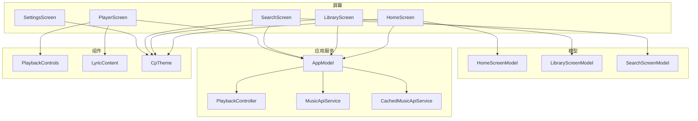
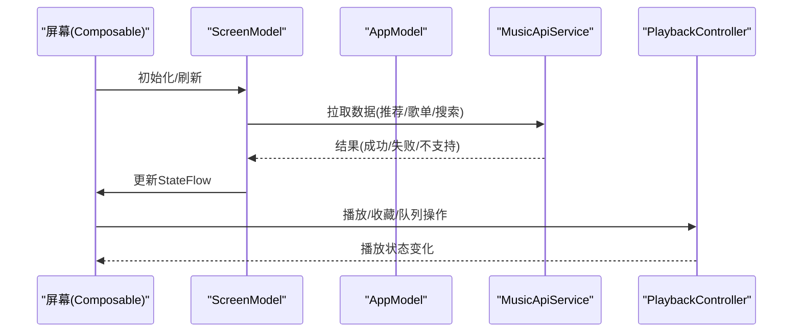
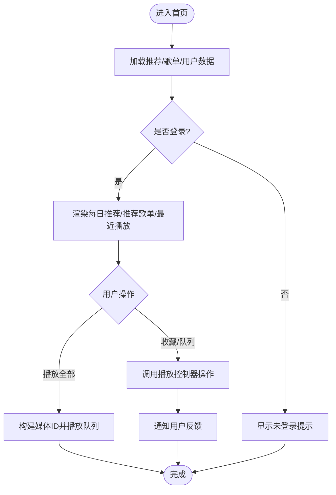
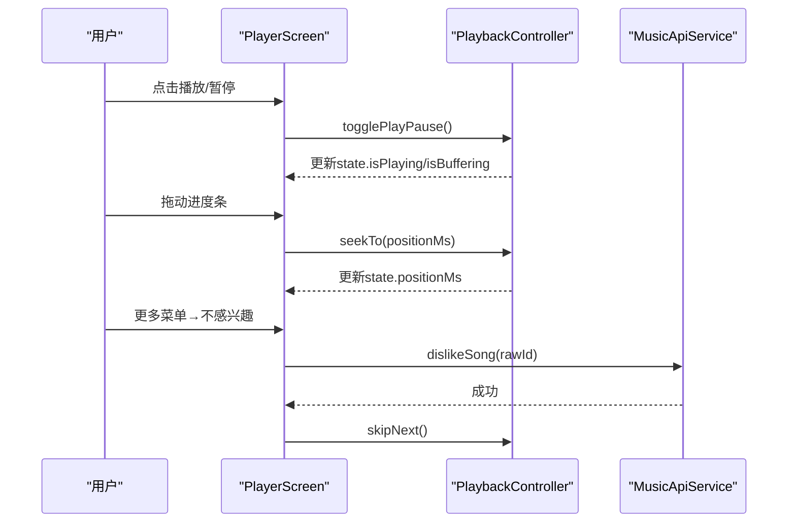
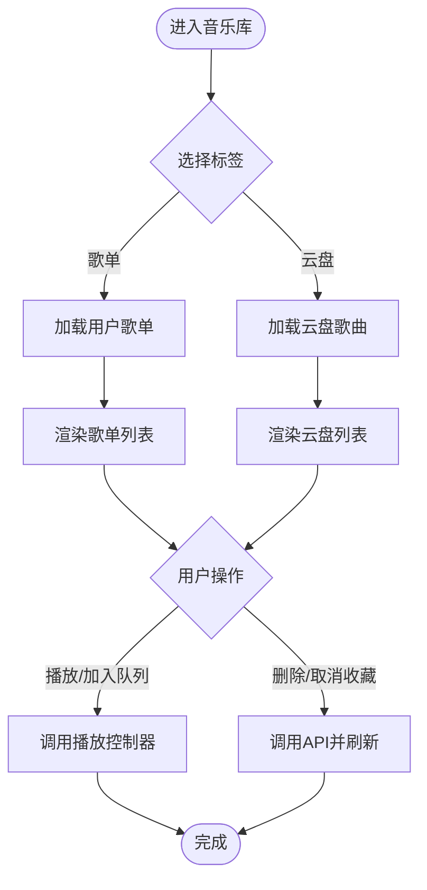
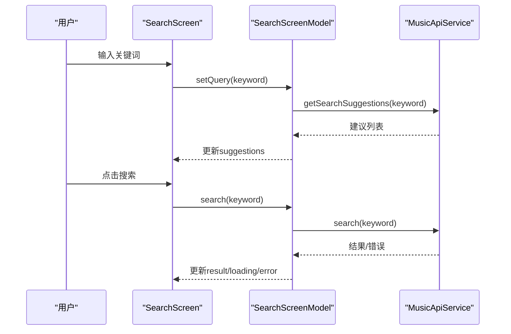
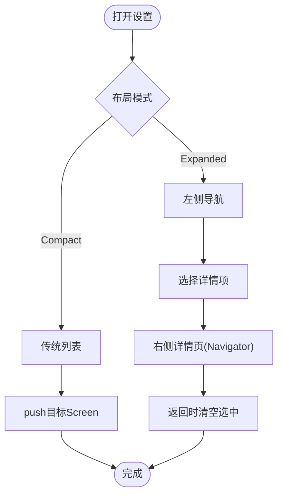
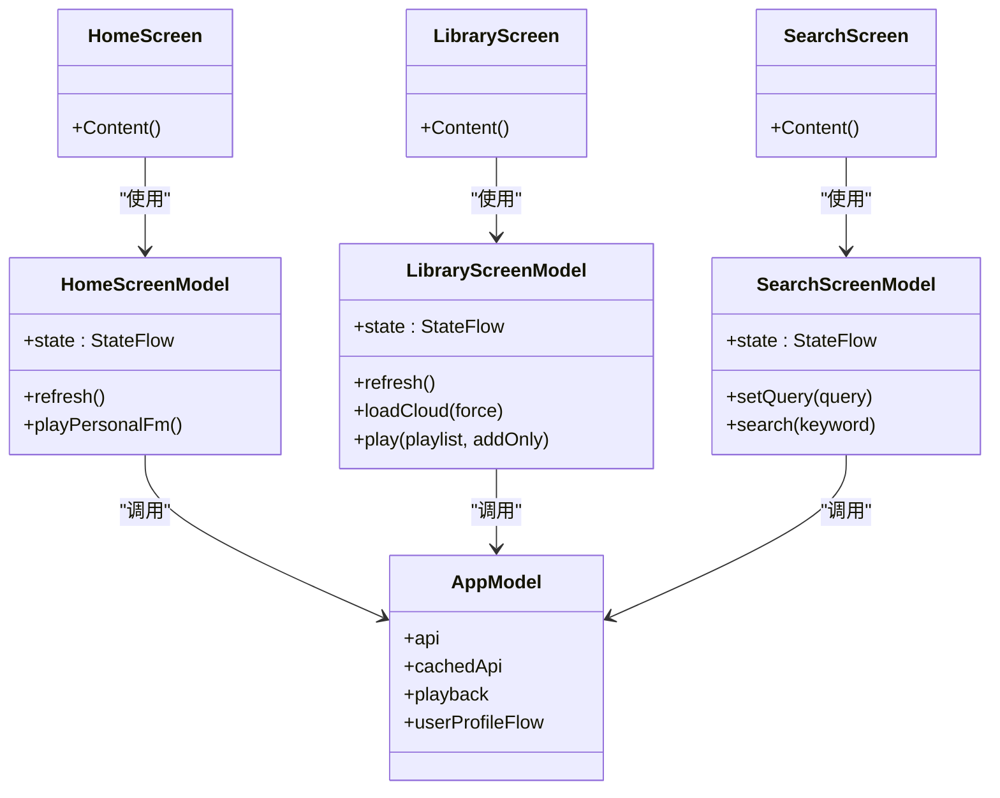

# 核心屏幕组件

<cite>
**本文引用的文件**
- [HomeScreen.kt](file://app/src/commonMain/kotlin/cp/player/app/ui/screen/HomeScreen.kt)
- [PlayerScreen.kt](file://app/src/commonMain/kotlin/cp/player/app/ui/screen/PlayerScreen.kt)
- [LibraryScreen.kt](file://app/src/commonMain/kotlin/cp/player/app/ui/screen/LibraryScreen.kt)
- [SearchScreen.kt](file://app/src/commonMain/kotlin/cp/player/app/ui/screen/SearchScreen.kt)
- [SettingsScreen.kt](file://app/src/commonMain/kotlin/cp/player/app/ui/screen/SettingsScreen.kt)
- [HomeScreenModel.kt](file://app/src/commonMain/kotlin/cp/player/app/ui/model/HomeScreenModel.kt)
- [LibraryScreenModel.kt](file://app/src/commonMain/kotlin/cp/player/app/ui/model/LibraryScreenModel.kt)
- [SearchScreenModel.kt](file://app/src/commonMain/kotlin/cp/player/app/ui/model/SearchScreenModel.kt)
- [AppModel.kt](file://app/src/commonMain/kotlin/cp/player/app/AppModel.kt)
- [PlaybackControls.kt](file://app/src/commonMain/kotlin/cp/player/app/ui/component/PlaybackControls.kt)
- [LyricContent.kt](file://app/src/commonMain/kotlin/cp/player/app/ui/component/LyricContent.kt)
- [Theme.kt](file://app/src/commonMain/kotlin/cp/player/app/ui/theme/Theme.kt)
</cite>

## 目录
1. [简介](#简介)
2. [项目结构](#项目结构)
3. [核心组件](#核心组件)
4. [架构总览](#架构总览)
5. [详细组件分析](#详细组件分析)
6. [依赖关系分析](#依赖关系分析)
7. [性能考虑](#性能考虑)
8. [故障排查指南](#故障排查指南)
9. [结论](#结论)
10. [附录](#附录)

## 简介
本技术文档聚焦 CPPlayer-KMP 的核心屏幕组件：主界面（HomeScreen）、播放界面（PlayerScreen）、音乐库（LibraryScreen）、搜索界面（SearchScreen）与设置界面（SettingsScreen）。文档从状态管理、数据绑定、业务逻辑、屏幕间通信、参数传递、生命周期、响应式布局、手势处理与动画效果等维度进行系统化说明，并重点阐述基于 ViewModel（ScreenModel）的状态管理模式与数据流设计。同时提供可操作的自定义屏幕实现示例路径，帮助读者快速上手扩展。

## 项目结构
- 屏幕层：位于 app/src/commonMain/kotlin/cp/player/app/ui/screen，每个屏幕以 Voyager Screen 形式组织，内部通过 Composable 渲染 UI。
- 模型层：位于 app/src/commonMain/kotlin/cp/player/app/ui/model，使用 Voyager ScreenModel 暴露 StateFlow 给 UI 消费。
- 应用服务：AppModel 作为顶层服务定位器，统一暴露 API、缓存 API、播放控制器、用户资料、最近播放、主题与音质设置等能力。
- 组件层：通用 UI 组件（如 PlaybackControls、LyricContent）在 ui/component 下复用。
- 主题层：ui/theme 提供主题模式、动态取色与纯黑背景支持。

图表来源
- [HomeScreen.kt:68-271](file://app/src/commonMain/kotlin/cp/player/app/ui/screen/HomeScreen.kt#L68-L271)
- [PlayerScreen.kt:118-426](file://app/src/commonMain/kotlin/cp/player/app/ui/screen/PlayerScreen.kt#L118-L426)
- [LibraryScreen.kt:67-187](file://app/src/commonMain/kotlin/cp/player/app/ui/screen/LibraryScreen.kt#L67-L187)
- [SearchScreen.kt:52-227](file://app/src/commonMain/kotlin/cp/player/app/ui/screen/SearchScreen.kt#L52-L227)
- [SettingsScreen.kt:62-146](file://app/src/commonMain/kotlin/cp/player/app/ui/screen/SettingsScreen.kt#L62-L146)
- [HomeScreenModel.kt:26-96](file://app/src/commonMain/kotlin/cp/player/app/ui/model/HomeScreenModel.kt#L26-L96)
- [LibraryScreenModel.kt:30-138](file://app/src/commonMain/kotlin/cp/player/app/ui/model/LibraryScreenModel.kt#L30-L138)
- [SearchScreenModel.kt:23-76](file://app/src/commonMain/kotlin/cp/player/app/ui/model/SearchScreenModel.kt#L23-L76)
- [AppModel.kt:29-64](file://app/src/commonMain/kotlin/cp/player/app/AppModel.kt#L29-L64)
- [PlaybackControls.kt:37-118](file://app/src/commonMain/kotlin/cp/player/app/ui/component/PlaybackControls.kt#L37-L118)
- [LyricContent.kt:33-142](file://app/src/commonMain/kotlin/cp/player/app/ui/component/LyricContent.kt#L33-L142)
- [Theme.kt:31-65](file://app/src/commonMain/kotlin/cp/player/app/ui/theme/Theme.kt#L31-L65)

章节来源
- [HomeScreen.kt:68-271](file://app/src/commonMain/kotlin/cp/player/app/ui/screen/HomeScreen.kt#L68-L271)
- [PlayerScreen.kt:118-426](file://app/src/commonMain/kotlin/cp/player/app/ui/screen/PlayerScreen.kt#L118-L426)
- [LibraryScreen.kt:67-187](file://app/src/commonMain/kotlin/cp/player/app/ui/screen/LibraryScreen.kt#L67-L187)
- [SearchScreen.kt:52-227](file://app/src/commonMain/kotlin/cp/player/app/ui/screen/SearchScreen.kt#L52-L227)
- [SettingsScreen.kt:62-146](file://app/src/commonMain/kotlin/cp/player/app/ui/screen/SettingsScreen.kt#L62-L146)
- [AppModel.kt:29-64](file://app/src/commonMain/kotlin/cp/player/app/AppModel.kt#L29-L64)

## 核心组件
- HomeScreen：展示每日推荐、推荐歌单、最近播放与快捷入口；支持播放全部、收藏、加入队列、添加到歌单等操作。
- PlayerScreen：三页 HorizontalPager（歌词/播放器/评论），支持下拉关闭、进度条拖动、循环/随机切换、睡眠定时、不感兴趣、队列管理等。
- LibraryScreen：歌单与云盘双标签页；支持创建、删除/取消收藏、播放歌单、加载云盘歌曲。
- SearchScreen：搜索输入框、建议与热门搜索；搜索结果列表与操作（播放、收藏、加入队列、添加到歌单）。
- SettingsScreen：Compact/Expanded 双布局；左侧导航+右侧详情或传统列表跳转；包含音源管理、登录、偏好、健康监控、关于。

章节来源
- [HomeScreen.kt:68-271](file://app/src/commonMain/kotlin/cp/player/app/ui/screen/HomeScreen.kt#L68-L271)
- [PlayerScreen.kt:118-426](file://app/src/commonMain/kotlin/cp/player/app/ui/screen/PlayerScreen.kt#L118-L426)
- [LibraryScreen.kt:67-187](file://app/src/commonMain/kotlin/cp/player/app/ui/screen/LibraryScreen.kt#L67-L187)
- [SearchScreen.kt:52-227](file://app/src/commonMain/kotlin/cp/player/app/ui/screen/SearchScreen.kt#L52-L227)
- [SettingsScreen.kt:62-146](file://app/src/commonMain/kotlin/cp/player/app/ui/screen/SettingsScreen.kt#L62-L146)

## 架构总览
- 状态管理：各 Screen 通过 rememberScreenModel 持有 ScreenModel，UI 通过 collectAsState 订阅 StateFlow。
- 数据流：ScreenModel 调用 AppModel.api 或 MusicSourceFromApi 获取数据，封装为 StateFlow 返回 UI。
- 播放控制：所有播放相关动作通过 AppModel.playback 统一执行，保证全局一致性与可观测性。
- 主题与响应式：CpTheme 提供主题模式与动态取色；SettingsScreen 根据 LocalIsExpanded 切换 Compact/Expanded 布局。
- 导航与通信：Voyager Navigator 用于页面跳转；跨屏共享状态通过 AppModel 的 StateFlow（如 playback.state、recentTracksFlow、userProfileFlow）。

图表来源
- [HomeScreenModel.kt:51-96](file://app/src/commonMain/kotlin/cp/player/app/ui/model/HomeScreenModel.kt#L51-L96)
- [LibraryScreenModel.kt:44-138](file://app/src/commonMain/kotlin/cp/player/app/ui/model/LibraryScreenModel.kt#L44-L138)
- [SearchScreenModel.kt:39-76](file://app/src/commonMain/kotlin/cp/player/app/ui/model/SearchScreenModel.kt#L39-L76)
- [AppModel.kt:51-64](file://app/src/commonMain/kotlin/cp/player/app/AppModel.kt#L51-L64)

章节来源
- [HomeScreenModel.kt:26-96](file://app/src/commonMain/kotlin/cp/player/app/ui/model/HomeScreenModel.kt#L26-L96)
- [LibraryScreenModel.kt:30-138](file://app/src/commonMain/kotlin/cp/player/app/ui/model/LibraryScreenModel.kt#L30-L138)
- [SearchScreenModel.kt:23-76](file://app/src/commonMain/kotlin/cp/player/app/ui/model/SearchScreenModel.kt#L23-L76)
- [AppModel.kt:29-64](file://app/src/commonMain/kotlin/cp/player/app/AppModel.kt#L29-L64)

## 详细组件分析

### HomeScreen（主界面）
- 功能与交互
  - 展示每日推荐、推荐歌单、最近播放与快捷入口。
  - 点击“播放全部”或歌曲项触发播放队列；支持收藏、加入队列、添加到歌单。
- 状态管理与数据绑定
  - 通过 HomeScreenModel.state 收集 dailySongs、recommendedPlaylists、userPlaylists、loading、error。
  - 订阅 AppModel.playback.likedIds 与 AppModel.recentTracksFlow 以显示收藏状态与最近播放。
- 业务逻辑
  - 播放私人 FM：调用 MusicSourceFromApi.getPersonalFm 并整体入队。
  - 刷新：并发拉取推荐歌曲、推荐歌单、用户歌单，合并错误信息。
- 响应式与动画
  - 根据 LocalIsExpanded 调整卡片宽度与网格行数。
  - 使用 LazyColumn/LazyRow 优化长列表滚动性能。
- 代码示例路径
  - 播放全部与单曲播放：[HomeScreen.kt:116-149](file://app/src/commonMain/kotlin/cp/player/app/ui/screen/HomeScreen.kt#L116-L149)
  - 收藏与加入队列：[HomeScreen.kt:238-263](file://app/src/commonMain/kotlin/cp/player/app/ui/screen/HomeScreen.kt#L238-L263)
  - 刷新与错误处理：[HomeScreenModel.kt:51-96](file://app/src/commonMain/kotlin/cp/player/app/ui/model/HomeScreenModel.kt#L51-L96)

图表来源
- [HomeScreen.kt:116-235](file://app/src/commonMain/kotlin/cp/player/app/ui/screen/HomeScreen.kt#L116-L235)
- [HomeScreenModel.kt:51-96](file://app/src/commonMain/kotlin/cp/player/app/ui/model/HomeScreenModel.kt#L51-L96)

章节来源
- [HomeScreen.kt:68-271](file://app/src/commonMain/kotlin/cp/player/app/ui/screen/HomeScreen.kt#L68-L271)
- [HomeScreenModel.kt:26-96](file://app/src/commonMain/kotlin/cp/player/app/ui/model/HomeScreenModel.kt#L26-L96)

### PlayerScreen（播放界面）
- 功能与交互
  - 三页 HorizontalPager：歌词、播放器、评论。
  - 播放器页支持下拉关闭、进度条拖动、循环/随机切换、睡眠定时、不感兴趣、队列管理。
- 状态管理与数据绑定
  - 直接订阅 AppModel.playback.state（PlaybackUiState），包括当前曲目、播放状态、缓冲、错误、歌词、队列等。
- 业务逻辑
  - 播放控制：togglePlayPause、seekTo、skipNext、skipPrevious、setRepeatMode、toggleShuffle、clearQueue、playAt、removeQueueItem、moveQueueItem。
  - 收藏与不感兴趣：toggleFavorite、dislikeSong。
- 手势与动画
  - detectVerticalDragGestures 实现下拉关闭；AnimatedVisibility/AnimatedContent 实现标题与内容切换动画；sharedBounds 实现封面与标题过渡。
- 代码示例路径
  - 下拉关闭与手势：[PlayerScreen.kt:232-258](file://app/src/commonMain/kotlin/cp/player/app/ui/screen/PlayerScreen.kt#L232-L258)
  - 播放控件与菜单：[PlayerScreen.kt:581-673](file://app/src/commonMain/kotlin/cp/player/app/ui/screen/PlayerScreen.kt#L581-L673)
  - 歌词与评论页：[PlayerScreen.kt:430-479](file://app/src/commonMain/kotlin/cp/player/app/ui/screen/PlayerScreen.kt#L430-L479), [PlayerScreen.kt:724-763](file://app/src/commonMain/kotlin/cp/player/app/ui/screen/PlayerScreen.kt#L724-L763)

图表来源
- [PlayerScreen.kt:118-426](file://app/src/commonMain/kotlin/cp/player/app/ui/screen/PlayerScreen.kt#L118-L426)
- [PlaybackControls.kt:37-118](file://app/src/commonMain/kotlin/cp/player/app/ui/component/PlaybackControls.kt#L37-L118)
- [LyricContent.kt:33-142](file://app/src/commonMain/kotlin/cp/player/app/ui/component/LyricContent.kt#L33-L142)

章节来源
- [PlayerScreen.kt:118-426](file://app/src/commonMain/kotlin/cp/player/app/ui/screen/PlayerScreen.kt#L118-L426)
- [PlaybackControls.kt:37-118](file://app/src/commonMain/kotlin/cp/player/app/ui/component/PlaybackControls.kt#L37-L118)
- [LyricContent.kt:33-142](file://app/src/commonMain/kotlin/cp/player/app/ui/component/LyricContent.kt#L33-L142)

### LibraryScreen（音乐库）
- 功能与交互
  - 歌单与云盘双标签页；支持新建歌单、删除/取消收藏、播放歌单、加载云盘歌曲。
- 状态管理与数据绑定
  - LibraryScreenModel.state 包含 playlists、cloudSongs、loading、error 等。
  - 监听 AppModel.userProfileFlow 变化自动刷新媒体库。
- 业务逻辑
  - 刷新歌单：解析用户歌单列表；云盘加载：获取云端歌曲；播放：将歌单曲目转换为媒体ID并播放或加入队列。
- 代码示例路径
  - 标签切换与列表渲染：[LibraryScreen.kt:91-131](file://app/src/commonMain/kotlin/cp/player/app/ui/screen/LibraryScreen.kt#L91-L131)
  - 云盘加载与播放：[LibraryScreenModel.kt:66-98](file://app/src/commonMain/kotlin/cp/player/app/ui/model/LibraryScreenModel.kt#L66-L98)
  - 歌单操作：[LibraryScreenModel.kt:108-136](file://app/src/commonMain/kotlin/cp/player/app/ui/model/LibraryScreenModel.kt#L108-L136)

图表来源
- [LibraryScreen.kt:91-131](file://app/src/commonMain/kotlin/cp/player/app/ui/screen/LibraryScreen.kt#L91-L131)
- [LibraryScreenModel.kt:44-138](file://app/src/commonMain/kotlin/cp/player/app/ui/model/LibraryScreenModel.kt#L44-L138)

章节来源
- [LibraryScreen.kt:67-187](file://app/src/commonMain/kotlin/cp/player/app/ui/screen/LibraryScreen.kt#L67-L187)
- [LibraryScreenModel.kt:30-138](file://app/src/commonMain/kotlin/cp/player/app/ui/model/LibraryScreenModel.kt#L30-L138)

### SearchScreen（搜索界面）
- 功能与交互
  - 搜索输入框、建议与热门搜索；搜索结果列表；支持播放、收藏、加入队列、添加到歌单。
- 状态管理与数据绑定
  - SearchScreenModel.state 包含 query、result、loading、error、hotSearches、suggestions。
- 业务逻辑
  - 设置查询词时更新建议；搜索时调用 MusicSourceFromApi.search；错误与空结果友好提示。
- 代码示例路径
  - 搜索输入与建议：[SearchScreen.kt:68-93](file://app/src/commonMain/kotlin/cp/player/app/ui/screen/SearchScreen.kt#L68-L93)
  - 搜索结果与操作：[SearchScreen.kt:152-187](file://app/src/commonMain/kotlin/cp/player/app/ui/screen/SearchScreen.kt#L152-L187)
  - 搜索逻辑：[SearchScreenModel.kt:39-76](file://app/src/commonMain/kotlin/cp/player/app/ui/model/SearchScreenModel.kt#L39-L76)

图表来源
- [SearchScreen.kt:68-187](file://app/src/commonMain/kotlin/cp/player/app/ui/screen/SearchScreen.kt#L68-L187)
- [SearchScreenModel.kt:39-76](file://app/src/commonMain/kotlin/cp/player/app/ui/model/SearchScreenModel.kt#L39-L76)

章节来源
- [SearchScreen.kt:52-227](file://app/src/commonMain/kotlin/cp/player/app/ui/screen/SearchScreen.kt#L52-L227)
- [SearchScreenModel.kt:23-76](file://app/src/commonMain/kotlin/cp/player/app/ui/model/SearchScreenModel.kt#L23-L76)

### SettingsScreen（设置界面）
- 功能与交互
  - Compact/Expanded 双布局；左侧导航+右侧详情或传统列表跳转；包含音源管理、登录、偏好、健康监控、关于。
- 状态管理与数据绑定
  - 使用 LocalIsExpanded 判断布局模式；selectedDetail 控制右侧详情页。
- 业务逻辑
  - 根据选中项映射到对应 Voyager Screen；Compact 模式下直接 push 导航。
- 代码示例路径
  - 双布局与详情导航：[SettingsScreen.kt:69-146](file://app/src/commonMain/kotlin/cp/player/app/ui/screen/SettingsScreen.kt#L69-L146)
  - 设置项映射：[SettingsScreen.kt:148-155](file://app/src/commonMain/kotlin/cp/player/app/ui/screen/SettingsScreen.kt#L148-L155)

图表来源
- [SettingsScreen.kt:69-146](file://app/src/commonMain/kotlin/cp/player/app/ui/screen/SettingsScreen.kt#L69-L146)
- [SettingsScreen.kt:148-155](file://app/src/commonMain/kotlin/cp/player/app/ui/screen/SettingsScreen.kt#L148-L155)

章节来源
- [SettingsScreen.kt:62-146](file://app/src/commonMain/kotlin/cp/player/app/ui/screen/SettingsScreen.kt#L62-L146)

## 依赖关系分析
- 屏幕与模型：每个 Screen 通过 rememberScreenModel 持有对应的 ScreenModel，避免重复实例化。
- 模型与服务：ScreenModel 依赖 AppModel 提供的 api、cachedApi、playback、userProfileFlow 等。
- 组件复用：PlaybackControls、LyricContent 被 PlayerScreen 复用，确保一致的交互体验。
- 主题依赖：所有屏幕通过 CpTheme 提供主题上下文，支持动态取色与纯黑背景。

图表来源
- [HomeScreen.kt:68-271](file://app/src/commonMain/kotlin/cp/player/app/ui/screen/HomeScreen.kt#L68-L271)
- [HomeScreenModel.kt:26-96](file://app/src/commonMain/kotlin/cp/player/app/ui/model/HomeScreenModel.kt#L26-L96)
- [LibraryScreen.kt:67-187](file://app/src/commonMain/kotlin/cp/player/app/ui/screen/LibraryScreen.kt#L67-L187)
- [LibraryScreenModel.kt:30-138](file://app/src/commonMain/kotlin/cp/player/app/ui/model/LibraryScreenModel.kt#L30-L138)
- [SearchScreen.kt:52-227](file://app/src/commonMain/kotlin/cp/player/app/ui/screen/SearchScreen.kt#L52-L227)
- [SearchScreenModel.kt:23-76](file://app/src/commonMain/kotlin/cp/player/app/ui/model/SearchScreenModel.kt#L23-L76)
- [AppModel.kt:29-64](file://app/src/commonMain/kotlin/cp/player/app/AppModel.kt#L29-L64)

章节来源
- [HomeScreenModel.kt:26-96](file://app/src/commonMain/kotlin/cp/player/app/ui/model/HomeScreenModel.kt#L26-L96)
- [LibraryScreenModel.kt:30-138](file://app/src/commonMain/kotlin/cp/player/app/ui/model/LibraryScreenModel.kt#L30-L138)
- [SearchScreenModel.kt:23-76](file://app/src/commonMain/kotlin/cp/player/app/ui/model/SearchScreenModel.kt#L23-L76)
- [AppModel.kt:29-64](file://app/src/commonMain/kotlin/cp/player/app/AppModel.kt#L29-L64)

## 性能考虑
- 列表优化：使用 LazyColumn/LazyRow 与 itemsIndexed 减少不必要的重组与绘制。
- 图片加载：AsyncImage 配合 ContentScale.Crop 提升大图渲染效率。
- 状态去重：ScreenModel 中 loading 标志与 cloudLoaded 缓存避免重复请求。
- 协程调度：IO 线程执行网络请求，Default 线程处理后台任务（如历史记录记录）。
- 主题与动态取色：仅在必要时计算颜色方案，减少频繁重建。

## 故障排查指南
- 首页推荐未加载：检查 HomeScreenModel.refresh 中的错误分支与登录状态；确认 API 返回类型与解析逻辑。
- 播放失败：查看 PlayerScreen 的错误提示与 PlaybackController.state.error；确认媒体ID格式与 Provider 激活状态。
- 搜索无结果：检查 SearchScreenModel.search 的请求参数与后端返回；确认 hotSearches/suggestions 模拟数据是否正确。
- 云盘加载失败：确认 LibraryScreenModel.loadCloud 的 force 参数与 cloudLoaded 缓存；查看错误消息并提示重试。
- 设置页导航异常：验证 SettingsDetail.toScreen 映射与 Navigator 生命周期；确保 Expanded 模式下 key(detail) 正确重建。

章节来源
- [HomeScreenModel.kt:51-96](file://app/src/commonMain/kotlin/cp/player/app/ui/model/HomeScreenModel.kt#L51-L96)
- [PlayerScreen.kt:594-605](file://app/src/commonMain/kotlin/cp/player/app/ui/screen/PlayerScreen.kt#L594-L605)
- [SearchScreenModel.kt:58-76](file://app/src/commonMain/kotlin/cp/player/app/ui/model/SearchScreenModel.kt#L58-L76)
- [LibraryScreenModel.kt:66-89](file://app/src/commonMain/kotlin/cp/player/app/ui/model/LibraryScreenModel.kt#L66-L89)
- [SettingsScreen.kt:103-115](file://app/src/commonMain/kotlin/cp/player/app/ui/screen/SettingsScreen.kt#L103-L115)

## 结论
本项目采用清晰的 Screen + ScreenModel 分层架构，结合 AppModel 统一服务定位，实现了高内聚、低耦合的可维护代码结构。各屏幕通过 StateFlow 实现单向数据流，播放控制与用户资料等全局状态集中管理，便于扩展与测试。响应式布局、手势与动画提升了用户体验。建议在新增屏幕时遵循现有模式：定义 ScreenModel、暴露 StateFlow、通过 AppModel 访问 API 与播放控制器，并使用 Voyager 进行导航。

## 附录
- 自定义屏幕实现步骤
  - 创建 Screen 类并实现 Content()，使用 rememberScreenModel 持有模型。
  - 定义 ScreenModel，使用 MutableStateFlow 暴露 state，并在 init 中加载数据。
  - 在 Composable 中 collectAsState 订阅状态，处理用户交互并通过 AppModel 执行业务逻辑。
  - 使用 Voyager Navigator 进行页面跳转，传递必要参数。
- 关键参考路径
  - 屏幕模板：[HomeScreen.kt:68-73](file://app/src/commonMain/kotlin/cp/player/app/ui/screen/HomeScreen.kt#L68-L73)
  - 模型模板：[HomeScreenModel.kt:26-33](file://app/src/commonMain/kotlin/cp/player/app/ui/model/HomeScreenModel.kt#L26-L33)
  - 播放控制：[PlaybackControls.kt:37-118](file://app/src/commonMain/kotlin/cp/player/app/ui/component/PlaybackControls.kt#L37-L118)
  - 主题配置：[Theme.kt:31-65](file://app/src/commonMain/kotlin/cp/player/app/ui/theme/Theme.kt#L31-L65)