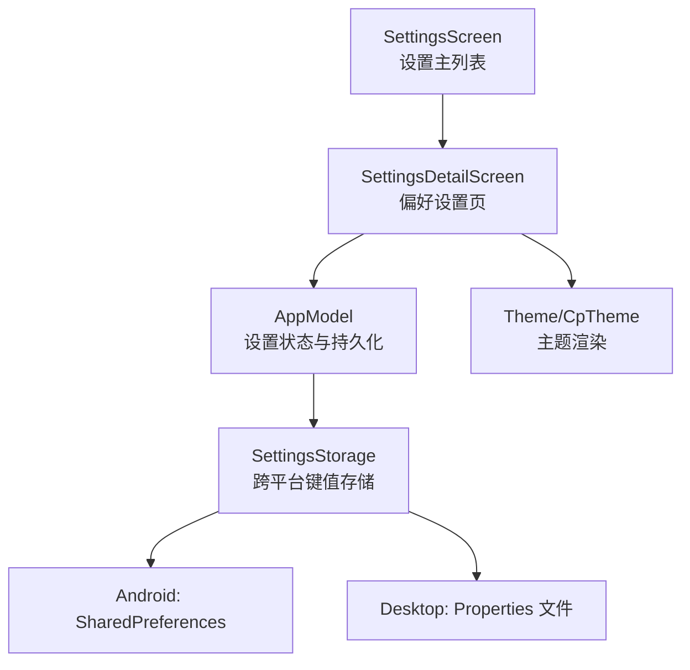
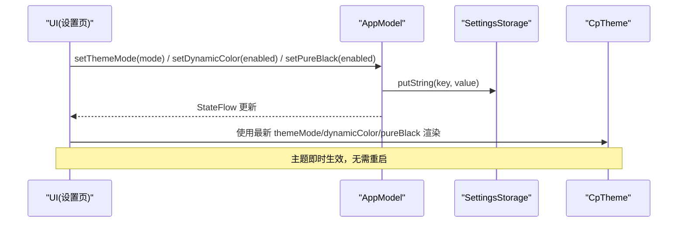
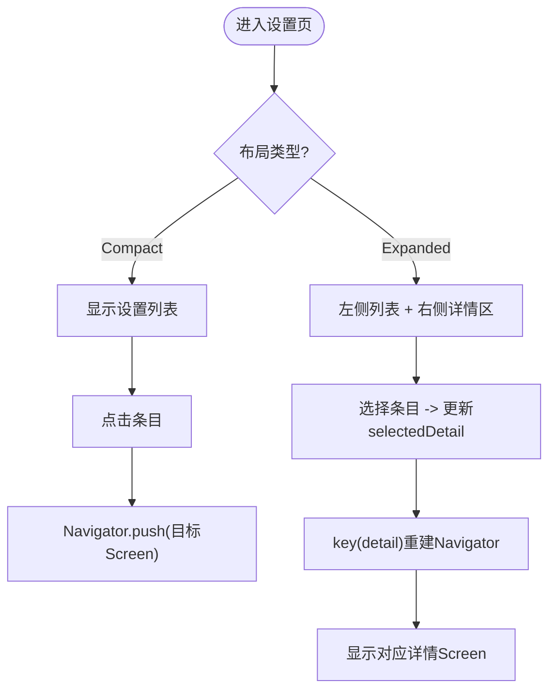
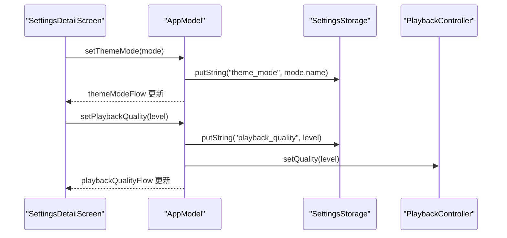
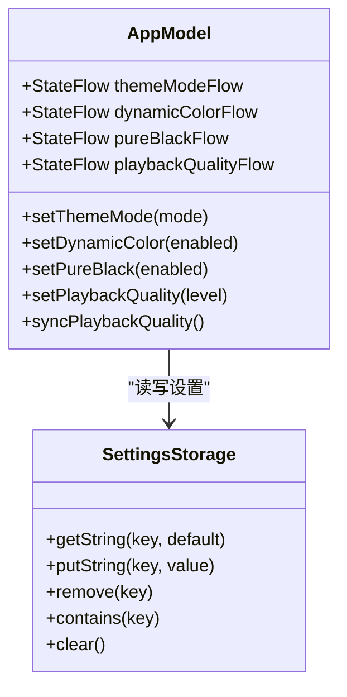
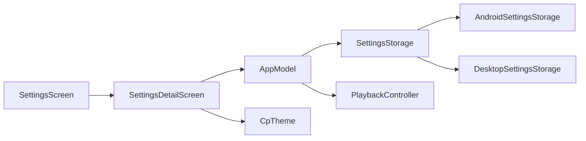

# 设置界面组件

<cite>
**本文引用的文件**
- [SettingsScreen.kt](file://app/src/commonMain/kotlin/cp/player/app/ui/screen/SettingsScreen.kt)
- [SettingsDetailScreen.kt](file://app/src/commonMain/kotlin/cp/player/app/ui/screen/SettingsDetailScreen.kt)
- [AppModel.kt](file://app/src/commonMain/kotlin/cp/player/app/AppModel.kt)
- [Theme.kt](file://app/src/commonMain/kotlin/cp/player/app/ui/theme/Theme.kt)
- [SettingsStorage.kt](file://kmp-pro/src/commonMain/kotlin/cp/player/kmp/util/SettingsStorage.kt)
- [AndroidSettingsStorage.kt](file://kmp-pro/src/androidMain/kotlin/cp/player/kmp/util/AndroidSettingsStorage.kt)
- [DesktopSettingsStorage.kt](file://kmp-pro/src/desktopMain/kotlin/cp/player/kmp/util/DesktopSettingsStorage.kt)
</cite>

## 目录
1. [简介](#简介)
2. [项目结构](#项目结构)
3. [核心组件](#核心组件)
4. [架构总览](#架构总览)
5. [详细组件分析](#详细组件分析)
6. [依赖关系分析](#依赖关系分析)
7. [性能考虑](#性能考虑)
8. [故障排查指南](#故障排查指南)
9. [结论](#结论)
10. [附录](#附录)

## 简介
本技术文档聚焦于 CP Player KMP 项目的“设置界面组件”，围绕 SettingsScreen 与偏好设置页（SettingsDetailScreen）展开，系统阐述应用设置管理、主题配置、播放设置、网络相关入口的组织方式；说明状态管理模式与变更通知机制；解释设置的验证规则与默认值处理；并重点说明与跨平台 SettingsStorage 的集成及同步策略。同时提供动态设置项生成与实时更新机制的实现思路与代码路径指引。

## 项目结构
设置界面由两个主要 Compose 屏幕组成：
- SettingsScreen：设置主列表与详情导航（支持紧凑与扩展布局）。
- SettingsDetailScreen：偏好设置详情页，包含外观、播放、存储等分组。

设置数据通过 AppModel 进行集中管理与持久化，底层使用 kmp-pro 模块提供的 SettingsStorage 抽象，在 Android 与 Desktop 平台分别以 SharedPreferences 与 Properties 文件实现。

图表来源
- [SettingsScreen.kt:62-155](file://app/src/commonMain/kotlin/cp/player/app/ui/screen/SettingsScreen.kt#L62-L155)
- [SettingsDetailScreen.kt:43-188](file://app/src/commonMain/kotlin/cp/player/app/ui/screen/SettingsDetailScreen.kt#L43-L188)
- [AppModel.kt:67-129](file://app/src/commonMain/kotlin/cp/player/app/AppModel.kt#L67-L129)
- [SettingsStorage.kt:12-25](file://kmp-pro/src/commonMain/kotlin/cp/player/kmp/util/SettingsStorage.kt#L12-L25)
- [AndroidSettingsStorage.kt:9-35](file://kmp-pro/src/androidMain/kotlin/cp/player/kmp/util/AndroidSettingsStorage.kt#L9-L35)
- [DesktopSettingsStorage.kt:12-47](file://kmp-pro/src/desktopMain/kotlin/cp/player/kmp/util/DesktopSettingsStorage.kt#L12-L47)

章节来源
- [SettingsScreen.kt:62-155](file://app/src/commonMain/kotlin/cp/player/app/ui/screen/SettingsScreen.kt#L62-L155)
- [SettingsDetailScreen.kt:43-188](file://app/src/commonMain/kotlin/cp/player/app/ui/screen/SettingsDetailScreen.kt#L43-L188)
- [AppModel.kt:67-129](file://app/src/commonMain/kotlin/cp/player/app/AppModel.kt#L67-L129)
- [SettingsStorage.kt:12-25](file://kmp-pro/src/commonMain/kotlin/cp/player/kmp/util/SettingsStorage.kt#L12-L25)

## 核心组件
- SettingsScreen：负责展示设置分组与条目，支持 Compact/Expanded 两种布局；通过 Voyager Navigator 驱动子页面导航。
- SettingsDetailScreen：呈现“外观”、“播放”、“存储”等分组设置项，直接调用 AppModel 更新状态并持久化。
- AppModel：集中管理设置状态（主题模式、动态取色、纯黑模式、播放音质），提供 StateFlow 暴露给 UI 订阅；读写底层 SettingsStorage。
- Theme/CpTheme：根据 AppModel 中的主题设置渲染 Material3 主题，支持动态取色与纯黑背景。
- SettingsStorage：跨平台键值存储抽象，Android 使用 SharedPreferences，Desktop 使用内存 Map + Properties 文件持久化。

章节来源
- [SettingsScreen.kt:62-155](file://app/src/commonMain/kotlin/cp/player/app/ui/screen/SettingsScreen.kt#L62-L155)
- [SettingsDetailScreen.kt:43-188](file://app/src/commonMain/kotlin/cp/player/app/ui/screen/SettingsDetailScreen.kt#L43-L188)
- [AppModel.kt:67-129](file://app/src/commonMain/kotlin/cp/player/app/AppModel.kt#L67-L129)
- [Theme.kt:11-67](file://app/src/commonMain/kotlin/cp/player/app/ui/theme/Theme.kt#L11-L67)
- [SettingsStorage.kt:12-25](file://kmp-pro/src/commonMain/kotlin/cp/player/kmp/util/SettingsStorage.kt#L12-L25)

## 架构总览
设置界面的数据流遵循“UI → AppModel → Storage”的单向流：
- UI 层（SettingsScreen/SettingsDetailScreen）读取 AppModel 暴露的 StateFlow 或当前值，用户交互时调用 AppModel 的设置方法。
- AppModel 将新值写入 SettingsStorage，并更新内部 MutableStateFlow，触发 UI 重新组合。
- 主题渲染由 CpTheme 基于 AppModel 的主题设置实时生效。

图表来源
- [SettingsDetailScreen.kt:72-118](file://app/src/commonMain/kotlin/cp/player/app/ui/screen/SettingsDetailScreen.kt#L72-L118)
- [AppModel.kt:83-102](file://app/src/commonMain/kotlin/cp/player/app/AppModel.kt#L83-L102)
- [Theme.kt:31-67](file://app/src/commonMain/kotlin/cp/player/app/ui/theme/Theme.kt#L31-L67)

## 详细组件分析

### SettingsScreen：设置主列表与导航
- 功能要点
  - 支持 Compact（传统列表）与 Expanded（左侧面板+右侧详情）两种布局。
  - 使用 Voyager 的 Navigator 管理子页面（ProviderManagement、Login、Preferences、Health、About）。
  - 通过 SettingsSection/SettingsRow 渲染分组与条目，支持选中高亮与箭头指示。
- 关键流程
  - 选择某项后，在 Expanded 模式下更新 selectedDetail，并在右侧用 key(detail) 重建 Navigator 以切换详情。
  - 在 Compact 模式下直接 push 目标 Screen。

图表来源
- [SettingsScreen.kt:67-155](file://app/src/commonMain/kotlin/cp/player/app/ui/screen/SettingsScreen.kt#L67-L155)
- [SettingsScreen.kt:164-228](file://app/src/commonMain/kotlin/cp/player/app/ui/screen/SettingsScreen.kt#L164-L228)

章节来源
- [SettingsScreen.kt:62-155](file://app/src/commonMain/kotlin/cp/player/app/ui/screen/SettingsScreen.kt#L62-L155)
- [SettingsScreen.kt:164-228](file://app/src/commonMain/kotlin/cp/player/app/ui/screen/SettingsScreen.kt#L164-L228)

### SettingsDetailScreen：偏好设置页
- 分组组织
  - 外观：主题模式（跟随系统/浅色/深色）、动态取色（平台能力检测）、纯黑模式。
  - 播放：在线播放音质（标准/极高/无损/Hi-Res）。
  - 存储：清理图片缓存（调用平台能力）。
- 状态与持久化
  - 通过 AppModel 的 StateFlow 获取当前值，用户操作时调用 setXxx 方法写入 SettingsStorage 并更新本地状态。
  - 音质设置会立即同步到播放控制器，影响后续加载曲目。

图表来源
- [SettingsDetailScreen.kt:72-148](file://app/src/commonMain/kotlin/cp/player/app/ui/screen/SettingsDetailScreen.kt#L72-L148)
- [AppModel.kt:83-129](file://app/src/commonMain/kotlin/cp/player/app/AppModel.kt#L83-L129)

章节来源
- [SettingsDetailScreen.kt:43-188](file://app/src/commonMain/kotlin/cp/player/app/ui/screen/SettingsDetailScreen.kt#L43-L188)
- [AppModel.kt:83-129](file://app/src/commonMain/kotlin/cp/player/app/AppModel.kt#L83-L129)

### AppModel：设置状态管理与持久化
- 状态模型
  - 主题模式：ThemeMode（SYSTEM/LIGHT/DARK），默认 SYSTEM。
  - 动态取色：Boolean，默认 false。
  - 纯黑模式：Boolean，默认 false。
  - 播放音质：String（standard/exhigh/lossless/hires），默认 exhigh。
- 持久化键
  - theme_mode、dynamic_color、pure_black、playback_quality。
- 变更通知
  - 使用 MutableStateFlow + asStateFlow 暴露给 UI 订阅。
  - 设置变更后立即写盘并更新 Flow，确保 UI 实时响应。
- 播放控制联动
  - setPlaybackQuality 会调用 playback.setQuality，使音质设置对后续播放生效。
  - syncPlaybackQuality 用于启动时将持久化音质同步到播放器。

图表来源
- [AppModel.kt:67-129](file://app/src/commonMain/kotlin/cp/player/app/AppModel.kt#L67-L129)
- [SettingsStorage.kt:12-19](file://kmp-pro/src/commonMain/kotlin/cp/player/kmp/util/SettingsStorage.kt#L12-L19)

章节来源
- [AppModel.kt:67-129](file://app/src/commonMain/kotlin/cp/player/app/AppModel.kt#L67-L129)

### 主题配置与渲染
- 主题模式
  - ThemeMode 枚举定义三种模式，CpTheme 根据模式决定暗/亮主题。
  - 动态取色：仅在 Android 12+ 可用，通过 supportsDynamicColor 检测。
  - 纯黑模式：在深色下将 surface/background 等置为黑色，省电屏友好。
- 实时生效
  - 设置变更后，AppModel 更新 Flow，UI 重组并使用新的 ColorScheme 渲染。

章节来源
- [Theme.kt:11-67](file://app/src/commonMain/kotlin/cp/player/app/ui/theme/Theme.kt#L11-L67)
- [SettingsDetailScreen.kt:72-118](file://app/src/commonMain/kotlin/cp/player/app/ui/screen/SettingsDetailScreen.kt#L72-L118)

### 设置项分类与组织结构
- 音源与账号：Provider 管理、登录、偏好设置入口。
- 诊断：API 健康监控。
- 关于：版本与维护者信息。
- 偏好设置内部分组：外观、播放、存储。

章节来源
- [SettingsScreen.kt:176-228](file://app/src/commonMain/kotlin/cp/player/app/ui/screen/SettingsScreen.kt#L176-L228)
- [SettingsDetailScreen.kt:65-176](file://app/src/commonMain/kotlin/cp/player/app/ui/screen/SettingsDetailScreen.kt#L65-L176)

### 设置验证规则与默认值处理
- 主题模式：从存储读取字符串，尝试解析为 ThemeMode；失败则回退到 SYSTEM。
- 动态取色/纯黑模式：布尔值解析失败回退到 false。
- 播放音质：若存储为空，默认 exhigh；设置时仅接受 qualityOptions 中定义的等级。
- 平台能力：动态取色开关在非 Android 12+ 平台禁用并提示不支持。

章节来源
- [AppModel.kt:83-129](file://app/src/commonMain/kotlin/cp/player/app/AppModel.kt#L83-L129)
- [SettingsDetailScreen.kt:95-118](file://app/src/commonMain/kotlin/cp/player/app/ui/screen/SettingsDetailScreen.kt#L95-L118)

### 设置导入导出与备份恢复
- 现状
  - 当前代码未提供统一的“设置导入/导出”入口；偏好设置通过 SettingsStorage 持久化。
  - Provider 管理支持导入模块（zip），但属于后端模块而非通用设置。
- 建议方案（概念性）
  - 导出：遍历 AppModel 管理的设置键，序列化 JSON 并通过平台文件选择器保存。
  - 导入：读取 JSON 文件，校验键与值格式，批量写入 SettingsStorage 并刷新 Flow。
  - 注意：不同平台存储实现差异（SharedPreferences vs Properties），需保证键一致性与兼容性。

[本节为概念性说明，不直接分析具体文件]

### 动态设置项生成与实时更新机制
- 动态生成
  - 可通过配置表（如 qualityOptions）驱动 FilterChip 列表渲染，新增选项仅需扩展配置。
  - 示例路径：音质选项在 AppModel.qualityOptions 中定义，UI 通过遍历渲染。
- 实时更新
  - 所有设置变更均通过 AppModel 的 StateFlow 广播，UI 使用 collectAsState 订阅，自动重组。
  - 主题与音质变更即时生效，无需重启应用。

章节来源
- [AppModel.kt:104-129](file://app/src/commonMain/kotlin/cp/player/app/AppModel.kt#L104-L129)
- [SettingsDetailScreen.kt:128-148](file://app/src/commonMain/kotlin/cp/player/app/ui/screen/SettingsDetailScreen.kt#L128-L148)

### 与 SettingsStorage 的集成与跨平台同步
- 抽象接口
  - SettingsStorage 提供 getString/putString/remove/contains/clear。
- 平台实现
  - Android：基于 SharedPreferences，命名空间隔离。
  - Desktop：内存 Map + Properties 文件持久化，自动读写。
- 同步策略
  - AppModel 作为唯一入口，统一读写 SettingsStorage，避免 UI 直接耦合平台细节。
  - 启动时可调用 syncPlaybackQuality 将持久化设置同步到运行时。

章节来源
- [SettingsStorage.kt:12-25](file://kmp-pro/src/commonMain/kotlin/cp/player/kmp/util/SettingsStorage.kt#L12-L25)
- [AndroidSettingsStorage.kt:9-35](file://kmp-pro/src/androidMain/kotlin/cp/player/kmp/util/AndroidSettingsStorage.kt#L9-L35)
- [DesktopSettingsStorage.kt:12-47](file://kmp-pro/src/desktopMain/kotlin/cp/player/kmp/util/DesktopSettingsStorage.kt#L12-L47)
- [AppModel.kt:126-129](file://app/src/commonMain/kotlin/cp/player/app/AppModel.kt#L126-L129)

## 依赖关系分析
- UI 层依赖 AppModel 暴露的状态与行为。
- AppModel 依赖 SettingsStorage 进行持久化，并可选联动 PlaybackController。
- 主题渲染依赖 CpTheme 与平台动态取色能力。

图表来源
- [SettingsScreen.kt:62-155](file://app/src/commonMain/kotlin/cp/player/app/ui/screen/SettingsScreen.kt#L62-L155)
- [SettingsDetailScreen.kt:43-188](file://app/src/commonMain/kotlin/cp/player/app/ui/screen/SettingsDetailScreen.kt#L43-L188)
- [AppModel.kt:67-129](file://app/src/commonMain/kotlin/cp/player/app/AppModel.kt#L67-L129)
- [SettingsStorage.kt:12-25](file://kmp-pro/src/commonMain/kotlin/cp/player/kmp/util/SettingsStorage.kt#L12-L25)

章节来源
- [SettingsScreen.kt:62-155](file://app/src/commonMain/kotlin/cp/player/app/ui/screen/SettingsScreen.kt#L62-L155)
- [SettingsDetailScreen.kt:43-188](file://app/src/commonMain/kotlin/cp/player/app/ui/screen/SettingsDetailScreen.kt#L43-L188)
- [AppModel.kt:67-129](file://app/src/commonMain/kotlin/cp/player/app/AppModel.kt#L67-L129)
- [SettingsStorage.kt:12-25](file://kmp-pro/src/commonMain/kotlin/cp/player/kmp/util/SettingsStorage.kt#L12-L25)

## 性能考虑
- 状态更新最小化：AppModel 使用 StateFlow 精确推送变更，避免全量重组。
- 存储写入合并：Desktop 实现每次 putString 后持久化，可考虑批量写入优化（如需）。
- 主题切换开销：CpTheme 在设置变化时重组，应尽量减少频繁切换。
- 音质同步：setPlaybackQuality 仅作用于后续加载，避免中断当前播放。

[本节为一般性指导，不直接分析具体文件]

## 故障排查指南
- 主题未生效
  - 检查 AppModel.setThemeMode 是否被调用，确认 StateFlow 已更新。
  - 确认 CpTheme 参数是否正确传入最新值。
- 动态取色不可用
  - 平台不支持时开关应禁用；检查 supportsDynamicColor 返回值。
- 音质设置无效
  - 确认 setPlaybackQuality 调用了 playback.setQuality；检查 qualityOptions 是否包含该等级。
- 存储异常
  - Android：确认 initKmpAndroidContext 已在 Application.onCreate 中注入 Context。
  - Desktop：检查 Properties 文件权限与路径。

章节来源
- [AndroidSettingsStorage.kt:27-35](file://kmp-pro/src/androidMain/kotlin/cp/player/kmp/util/AndroidSettingsStorage.kt#L27-L35)
- [DesktopSettingsStorage.kt:18-44](file://kmp-pro/src/desktopMain/kotlin/cp/player/kmp/util/DesktopSettingsStorage.kt#L18-L44)
- [AppModel.kt:83-129](file://app/src/commonMain/kotlin/cp/player/app/AppModel.kt#L83-L129)

## 结论
本设置界面组件通过清晰的层次划分与单向数据流，实现了主题、播放、存储等设置的统一管理、持久化与实时更新。AppModel 作为中枢协调 UI 与存储，SettingsStorage 抽象屏蔽平台差异，确保跨平台一致性。未来可扩展导入导出功能，提升配置迁移与备份能力。

[本节为总结性内容，不直接分析具体文件]

## 附录
- 关键代码路径参考
  - 设置主列表与导航：[SettingsScreen.kt:62-155](file://app/src/commonMain/kotlin/cp/player/app/ui/screen/SettingsScreen.kt#L62-L155)
  - 偏好设置页：[SettingsDetailScreen.kt:43-188](file://app/src/commonMain/kotlin/cp/player/app/ui/screen/SettingsDetailScreen.kt#L43-L188)
  - 设置状态与持久化：[AppModel.kt:67-129](file://app/src/commonMain/kotlin/cp/player/app/AppModel.kt#L67-L129)
  - 主题渲染：[Theme.kt:11-67](file://app/src/commonMain/kotlin/cp/player/app/ui/theme/Theme.kt#L11-L67)
  - 跨平台存储抽象与实现：[SettingsStorage.kt:12-25](file://kmp-pro/src/commonMain/kotlin/cp/player/kmp/util/SettingsStorage.kt#L12-L25)、[AndroidSettingsStorage.kt:9-35](file://kmp-pro/src/androidMain/kotlin/cp/player/kmp/util/AndroidSettingsStorage.kt#L9-L35)、[DesktopSettingsStorage.kt:12-47](file://kmp-pro/src/desktopMain/kotlin/cp/player/kmp/util/DesktopSettingsStorage.kt#L12-L47)