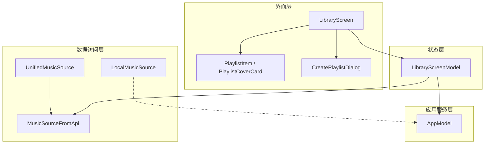
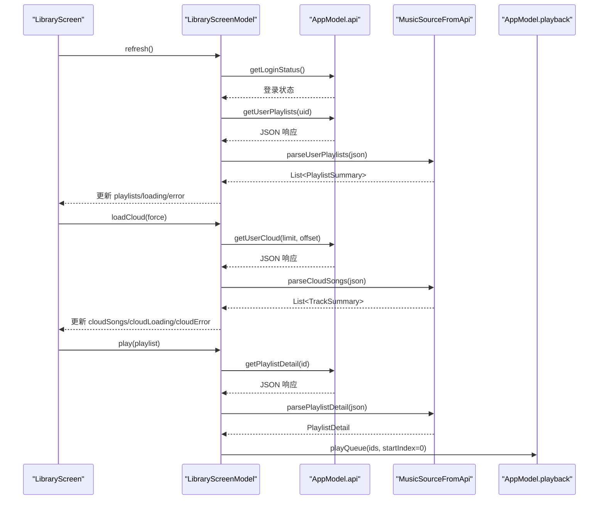
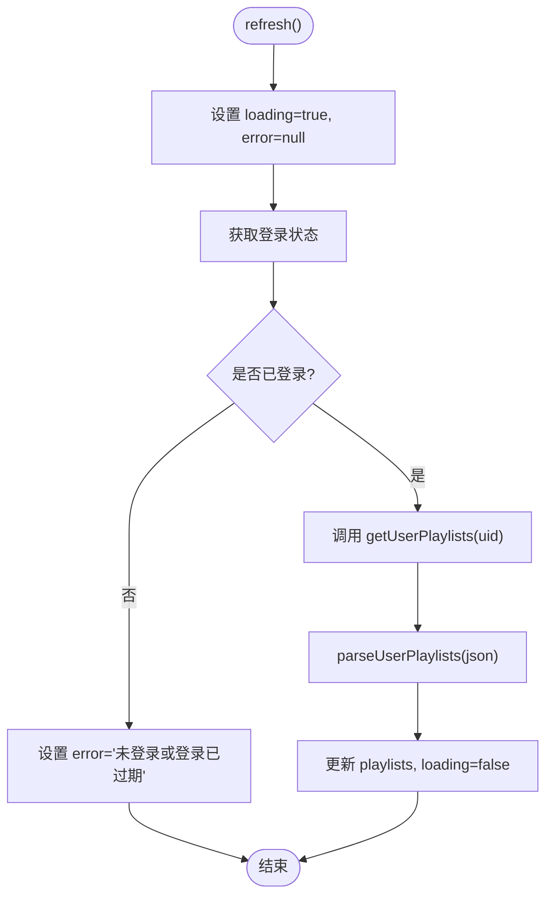
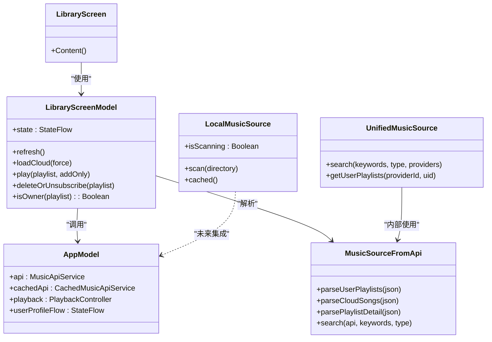
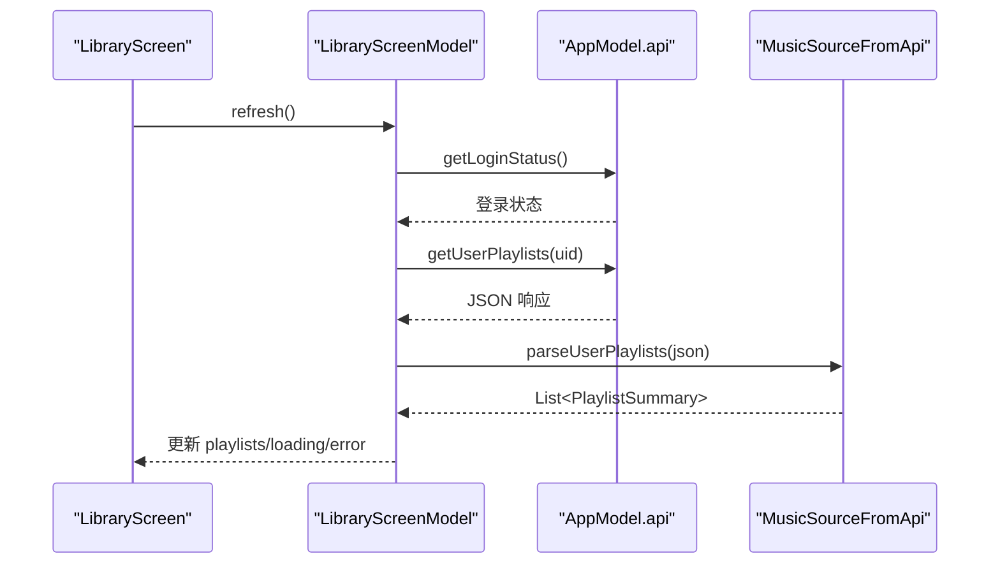
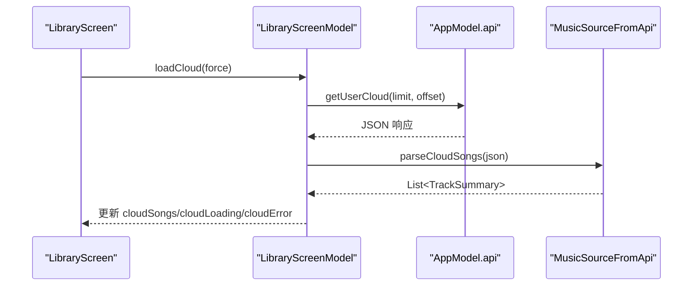
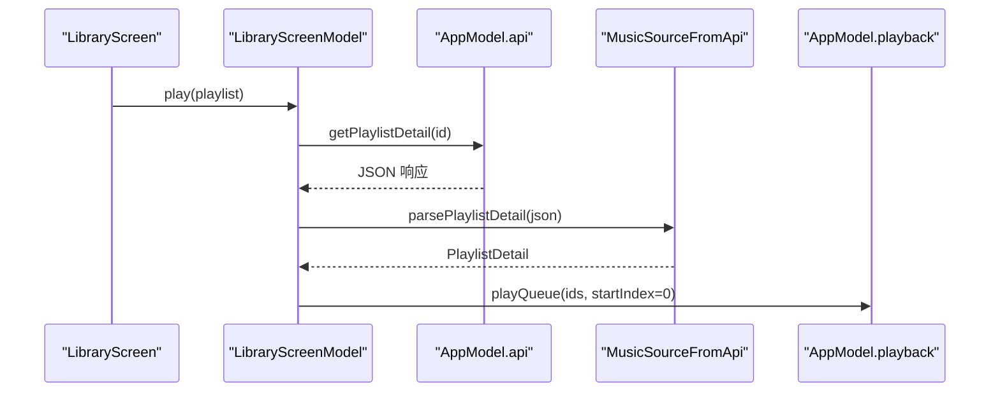

# 音乐库界面组件

<cite>
**本文引用的文件**
- [LibraryScreen.kt](file://app/src/commonMain/kotlin/cp/player/app/ui/screen/LibraryScreen.kt)
- [LibraryScreenModel.kt](file://app/src/commonMain/kotlin/cp/player/app/ui/model/LibraryScreenModel.kt)
- [UnifiedMusicSource.kt](file://kmp-pro/src/commonMain/kotlin/cp/player/kmp/music/UnifiedMusicSource.kt)
- [MusicSourceFromApi.kt](file://kmp-pro/src/commonMain/kotlin/cp/player/kmp/music/MusicSourceFromApi.kt)
- [LocalMusicSource.kt](file://kmp-pro/src/commonMain/kotlin/cp/player/kmp/local/LocalMusicSource.kt)
- [PlaylistCard.kt](file://app/src/commonMain/kotlin/cp/player/app/ui/component/PlaylistCard.kt)
- [CreatePlaylistDialog.kt](file://app/src/commonMain/kotlin/cp/player/app/ui/component/CreatePlaylistDialog.kt)
- [AppModel.kt](file://app/src/commonMain/kotlin/cp/player/app/AppModel.kt)
</cite>

## 目录
1. [简介](#简介)
2. [项目结构](#项目结构)
3. [核心组件](#核心组件)
4. [架构总览](#架构总览)
5. [详细组件分析](#详细组件分析)
6. [依赖关系分析](#依赖关系分析)
7. [性能与内存优化](#性能与内存优化)
8. [故障排查指南](#故障排查指南)
9. [结论](#结论)
10. [附录：关键流程时序图](#附录：关键流程时序图)

## 简介
本技术文档聚焦于音乐库界面组件 LibraryScreen，围绕本地音乐扫描、播放列表管理、音乐文件浏览、状态管理模式（LibraryScreenModel）、搜索与过滤、分页加载与内存优化、以及本地存储与异步数据处理进行系统化说明。该组件基于 Compose UI 与 Voyager 屏幕模型，通过统一音乐源抽象对接云端 Provider 与本地音乐能力，提供歌单浏览、云盘歌曲展示、新建/删除/收藏等交互，并配合 AppModel 提供的全局状态与播放控制完成端到端体验。

## 项目结构
- 界面层：LibraryScreen 负责“歌单”和“云盘”两个 Tab 的渲染与用户交互，使用 HorizontalPager 切换页面，LazyColumn 高效渲染列表。
- 状态层：LibraryScreenModel 维护 UI 状态（loading/error/success），封装刷新、云盘加载、播放队列操作、歌单删除/取消收藏等逻辑。
- 数据访问层：通过 MusicSourceFromApi 解析 API 响应为领域模型；UnifiedMusicSource 定义统一接口；LocalMusicSource 定义本地音乐扫描接口。
- 应用服务层：AppModel 暴露全局 API、缓存 API、播放控制器、用户资料流等。

图表来源
- [LibraryScreen.kt:67-187](file://app/src/commonMain/kotlin/cp/player/app/ui/screen/LibraryScreen.kt#L67-L187)
- [LibraryScreenModel.kt:30-138](file://app/src/commonMain/kotlin/cp/player/app/ui/model/LibraryScreenModel.kt#L30-L138)
- [MusicSourceFromApi.kt:27-221](file://kmp-pro/src/commonMain/kotlin/cp/player/kmp/music/MusicSourceFromApi.kt#L27-L221)
- [UnifiedMusicSource.kt:7-38](file://kmp-pro/src/commonMain/kotlin/cp/player/kmp/music/UnifiedMusicSource.kt#L7-L38)
- [LocalMusicSource.kt:15-31](file://kmp-pro/src/commonMain/kotlin/cp/player/kmp/local/LocalMusicSource.kt#L15-L31)
- [PlaylistCard.kt:46-125](file://app/src/commonMain/kotlin/cp/player/app/ui/component/PlaylistCard.kt#L46-L125)
- [CreatePlaylistDialog.kt:31-85](file://app/src/commonMain/kotlin/cp/player/app/ui/component/CreatePlaylistDialog.kt#L31-L85)
- [AppModel.kt:29-63](file://app/src/commonMain/kotlin/cp/player/app/AppModel.kt#L29-L63)

章节来源
- [LibraryScreen.kt:67-187](file://app/src/commonMain/kotlin/cp/player/app/ui/screen/LibraryScreen.kt#L67-L187)
- [LibraryScreenModel.kt:30-138](file://app/src/commonMain/kotlin/cp/player/app/ui/model/LibraryScreenModel.kt#L30-L138)
- [MusicSourceFromApi.kt:27-221](file://kmp-pro/src/commonMain/kotlin/cp/player/kmp/music/MusicSourceFromApi.kt#L27-L221)
- [UnifiedMusicSource.kt:7-38](file://kmp-pro/src/commonMain/kotlin/cp/player/kmp/music/UnifiedMusicSource.kt#L7-L38)
- [LocalMusicSource.kt:15-31](file://kmp-pro/src/commonMain/kotlin/cp/player/kmp/local/LocalMusicSource.kt#L15-L31)
- [PlaylistCard.kt:46-125](file://app/src/commonMain/kotlin/cp/player/app/ui/component/PlaylistCard.kt#L46-L125)
- [CreatePlaylistDialog.kt:31-85](file://app/src/commonMain/kotlin/cp/player/app/ui/component/CreatePlaylistDialog.kt#L31-L85)
- [AppModel.kt:29-63](file://app/src/commonMain/kotlin/cp/player/app/AppModel.kt#L29-L63)

## 核心组件
- LibraryScreen：组合顶部筛选栏、HorizontalPager、歌单页与云盘页，处理创建歌单对话框、选项菜单与删除确认。
- LibraryScreenModel：以 StateFlow 管理 UI 状态，封装 refresh/loadCloud/play/deleteOrUnsubscribe 等操作，监听登录态变化自动刷新媒体库。
- MusicSourceFromApi：将 JSON 响应解析为强类型领域模型（歌单摘要、曲目摘要、搜索结果等），统一错误码与不支持场景。
- UnifiedMusicSource：前端统一调用入口，支持跨 Provider 搜索、获取歌单详情、播放地址等。
- LocalMusicSource：定义本地音乐扫描接口与元数据结构，便于后续平台实现接入。
- PlaylistCard：歌单列表项与封面卡片，用于 LibraryScreen 中的歌单展示。
- CreatePlaylistDialog：新建歌单对话框，调用 API 创建并反馈结果。
- AppModel：全局服务定位器，提供 API、缓存 API、播放控制器、用户资料流等。

章节来源
- [LibraryScreen.kt:67-187](file://app/src/commonMain/kotlin/cp/player/app/ui/screen/LibraryScreen.kt#L67-L187)
- [LibraryScreenModel.kt:30-138](file://app/src/commonMain/kotlin/cp/player/app/ui/model/LibraryScreenModel.kt#L30-L138)
- [MusicSourceFromApi.kt:27-221](file://kmp-pro/src/commonMain/kotlin/cp/player/kmp/music/MusicSourceFromApi.kt#L27-L221)
- [UnifiedMusicSource.kt:7-38](file://kmp-pro/src/commonMain/kotlin/cp/player/kmp/music/UnifiedMusicSource.kt#L7-L38)
- [LocalMusicSource.kt:15-31](file://kmp-pro/src/commonMain/kotlin/cp/player/kmp/local/LocalMusicSource.kt#L15-L31)
- [PlaylistCard.kt:46-125](file://app/src/commonMain/kotlin/cp/player/app/ui/component/PlaylistCard.kt#L46-L125)
- [CreatePlaylistDialog.kt:31-85](file://app/src/commonMain/kotlin/cp/player/app/ui/component/CreatePlaylistDialog.kt#L31-L85)
- [AppModel.kt:29-63](file://app/src/commonMain/kotlin/cp/player/app/AppModel.kt#L29-L63)

## 架构总览
LibraryScreen 通过 LibraryScreenModel 驱动 UI 状态，UI 事件触发 Model 方法，Model 调用 AppModel 提供的 API 或播放控制器，并通过 MusicSourceFromApi 解析响应。歌单页与云盘页分别对应不同的数据源与加载策略。

图表来源
- [LibraryScreenModel.kt:44-136](file://app/src/commonMain/kotlin/cp/player/app/ui/model/LibraryScreenModel.kt#L44-L136)
- [MusicSourceFromApi.kt:103-221](file://kmp-pro/src/commonMain/kotlin/cp/player/kmp/music/MusicSourceFromApi.kt#L103-L221)
- [AppModel.kt:51-63](file://app/src/commonMain/kotlin/cp/player/app/AppModel.kt#L51-L63)

## 详细组件分析

### LibraryScreen 界面与交互
- 顶部筛选栏：使用 LazyRow 展示“歌单”“云盘”标签，点击切换 HorizontalPager 页面。
- 歌单页：LazyColumn 渲染 PlaylistItem，支持点击跳转详情页与更多操作弹出。
- 云盘页：LazyColumn 渲染 TrackSummary 列表，首次进入自动加载，支持重试与空态提示。
- 新建歌单：弹出 CreatePlaylistDialog，创建成功后回调刷新列表。
- 删除/取消收藏：弹出确认对话框，根据是否拥有者决定删除或取消收藏。

章节来源
- [LibraryScreen.kt:74-187](file://app/src/commonMain/kotlin/cp/player/app/ui/screen/LibraryScreen.kt#L74-L187)
- [PlaylistCard.kt:46-125](file://app/src/commonMain/kotlin/cp/player/app/ui/component/PlaylistCard.kt#L46-L125)
- [CreatePlaylistDialog.kt:31-85](file://app/src/commonMain/kotlin/cp/player/app/ui/component/CreatePlaylistDialog.kt#L31-L85)

### LibraryScreenModel 状态管理与业务逻辑
- 状态模型：LibraryUiState 包含歌单列表、加载与错误状态，以及云盘歌曲列表、加载与错误状态。
- 初始化：启动时执行 refresh，并订阅 AppModel.userProfileFlow 变化，登录后自动刷新媒体库。
- 刷新媒体库：在 IO 线程调用 API，解析歌单列表，更新 loading/error/playlists。
- 云盘加载：防抖防止重复请求，支持强制刷新；解析云盘歌曲并更新状态。
- 播放控制：从歌单详情提取曲目 ID，构造 provider://song/id 形式的 mediaId，调用 playback.playQueue 或 addToQueue。
- 歌单管理：isOwner 判断当前用户是否为歌单创建者；deleteOrUnsubscribe 根据归属执行删除或取消收藏，成功后刷新列表。

图表来源
- [LibraryScreenModel.kt:44-62](file://app/src/commonMain/kotlin/cp/player/app/ui/model/LibraryScreenModel.kt#L44-L62)

章节来源
- [LibraryScreenModel.kt:20-138](file://app/src/commonMain/kotlin/cp/player/app/ui/model/LibraryScreenModel.kt#L20-L138)

### 音乐文件扫描机制（本地）
- 接口设计：LocalMusicSource 定义 scan(directory)、cached()、isScanning 三个能力，返回 LocalSongMetadata 列表。
- 元数据结构：LocalSongMetadata 包含路径、标题、艺术家、专辑、时长、采样率、位深、比特率等字段，避免耦合具体解析库。
- 集成方式：当前版本仅定义接口，具体平台实现由 actual 或后续版本提供；后端可通过 MusicBackend 聚合本地与云端数据源，使前端无需区分数据来源。

章节来源
- [LocalMusicSource.kt:15-48](file://kmp-pro/src/commonMain/kotlin/cp/player/kmp/local/LocalMusicSource.kt#L15-L48)

### 播放列表 CRUD 操作
- 创建：CreatePlaylistDialog 调用 AppModel.api.createPlaylist，解析返回 ID，成功则通知并回调刷新。
- 读取：LibraryScreenModel.refresh 调用 getUserPlaylists 并解析为 PlaylistSummary 列表。
- 更新：当前未直接提供编辑名称/描述的方法，可在后续扩展。
- 删除/取消收藏：deleteOrUnsubscribe 根据 isOwner 选择 deletePlaylist 或 subscribePlaylist(t=2)，成功后刷新列表。
- 排序：当前未提供排序功能，可在后续扩展。

章节来源
- [CreatePlaylistDialog.kt:31-85](file://app/src/commonMain/kotlin/cp/player/app/ui/component/CreatePlaylistDialog.kt#L31-L85)
- [LibraryScreenModel.kt:108-121](file://app/src/commonMain/kotlin/cp/player/app/ui/model/LibraryScreenModel.kt#L108-L121)

### 搜索与过滤
- 搜索：UnifiedMusicSource.search 支持跨多个 provider 搜索并聚合结果；MusicSourceFromApi.parseSearchSongs 将 JSON 解析为 SearchResult（单曲、歌单、歌手）。
- 过滤：LibraryScreen 通过 HorizontalPager 实现“歌单”与“云盘”两类内容过滤；未来可扩展关键词过滤与分类显示。

章节来源
- [UnifiedMusicSource.kt:26-30](file://kmp-pro/src/commonMain/kotlin/cp/player/kmp/music/UnifiedMusicSource.kt#L26-L30)
- [MusicSourceFromApi.kt:87-99](file://kmp-pro/src/commonMain/kotlin/cp/player/kmp/music/MusicSourceFromApi.kt#L87-L99)
- [LibraryScreen.kt:85-131](file://app/src/commonMain/kotlin/cp/player/app/ui/screen/LibraryScreen.kt#L85-L131)

### 分页加载与内存优化
- 云盘加载：loadCloud 支持 limit 与 offset 参数，可结合 UI 滚动实现分页加载；当前默认 limit=200，offset=0。
- 列表渲染：使用 LazyColumn 按需渲染可见项，减少内存占用；图片加载使用 Coil 异步加载，避免阻塞主线程。
- 去重与缓存：AppModel.cachedApi 提供带缓存的音乐 API，后台拉取并指纹比对差异，减少重复网络请求。

章节来源
- [MusicSourceFromApi.kt:216-217](file://kmp-pro/src/commonMain/kotlin/cp/player/kmp/music/MusicSourceFromApi.kt#L216-L217)
- [PlaylistCard.kt:65-78](file://app/src/commonMain/kotlin/cp/player/app/ui/component/PlaylistCard.kt#L65-L78)
- [AppModel.kt:54-55](file://app/src/commonMain/kotlin/cp/player/app/AppModel.kt#L54-L55)

### 与本地存储的集成与异步处理
- 用户资料：AppModel.refreshUserProfile 在 IO 线程拉取用户信息并刷新收藏列表，登出时清空资料。
- 最近播放：AppModel.startHistoryRecorder 监听播放状态，记录最近播放曲目并持久化到 SettingsStorage。
- 异步模式：所有网络与解析均在 withContext(Dispatchers.IO) 中执行，UI 仅在 Main 线程更新状态。

章节来源
- [AppModel.kt:153-179](file://app/src/commonMain/kotlin/cp/player/app/AppModel.kt#L153-L179)
- [AppModel.kt:191-254](file://app/src/commonMain/kotlin/cp/player/app/AppModel.kt#L191-L254)
- [LibraryScreenModel.kt:44-88](file://app/src/commonMain/kotlin/cp/player/app/ui/model/LibraryScreenModel.kt#L44-L88)

## 依赖关系分析
- LibraryScreen 依赖 LibraryScreenModel 提供状态与操作。
- LibraryScreenModel 依赖 AppModel 获取 API、播放控制器与用户资料流。
- MusicSourceFromApi 依赖 MusicApiService 返回的 JSON 并解析为领域模型。
- UnifiedMusicSource 作为统一入口，屏蔽底层 Provider 差异。
- LocalMusicSource 为本地音乐能力预留接口，便于后续扩展。

图表来源
- [LibraryScreen.kt:67-187](file://app/src/commonMain/kotlin/cp/player/app/ui/screen/LibraryScreen.kt#L67-L187)
- [LibraryScreenModel.kt:30-138](file://app/src/commonMain/kotlin/cp/player/app/ui/model/LibraryScreenModel.kt#L30-L138)
- [AppModel.kt:29-63](file://app/src/commonMain/kotlin/cp/player/app/AppModel.kt#L29-L63)
- [MusicSourceFromApi.kt:27-221](file://kmp-pro/src/commonMain/kotlin/cp/player/kmp/music/MusicSourceFromApi.kt#L27-L221)
- [UnifiedMusicSource.kt:7-38](file://kmp-pro/src/commonMain/kotlin/cp/player/kmp/music/UnifiedMusicSource.kt#L7-L38)
- [LocalMusicSource.kt:15-31](file://kmp-pro/src/commonMain/kotlin/cp/player/kmp/local/LocalMusicSource.kt#L15-L31)

章节来源
- [LibraryScreen.kt:67-187](file://app/src/commonMain/kotlin/cp/player/app/ui/screen/LibraryScreen.kt#L67-L187)
- [LibraryScreenModel.kt:30-138](file://app/src/commonMain/kotlin/cp/player/app/ui/model/LibraryScreenModel.kt#L30-L138)
- [AppModel.kt:29-63](file://app/src/commonMain/kotlin/cp/player/app/AppModel.kt#L29-L63)
- [MusicSourceFromApi.kt:27-221](file://kmp-pro/src/commonMain/kotlin/cp/player/kmp/music/MusicSourceFromApi.kt#L27-L221)
- [UnifiedMusicSource.kt:7-38](file://kmp-pro/src/commonMain/kotlin/cp/player/kmp/music/UnifiedMusicSource.kt#L7-L38)
- [LocalMusicSource.kt:15-31](file://kmp-pro/src/commonMain/kotlin/cp/player/kmp/local/LocalMusicSource.kt#L15-L31)

## 性能与内存优化
- 列表虚拟化：使用 LazyColumn/LazyRow 仅渲染可见项，降低内存与绘制开销。
- 图片异步加载：使用 Coil 异步加载封面，避免阻塞主线程。
- 网络缓存：AppModel.cachedApi 提供缓存与指纹比对，减少重复请求。
- 防抖与幂等：loadCloud 防止重复请求；refresh 在登录态变化时自动触发，避免手动重复刷新。
- 分页加载：cloud 加载支持 limit/offset，可结合 UI 滚动实现增量加载。

[本节为通用性能建议，不直接分析具体文件]

## 故障排查指南
- 媒体库加载失败：检查登录状态与网络，查看 error 字段；可点击重试按钮重新加载。
- 云盘加载失败：检查是否已登录且 Provider 支持云盘；查看 cloudError 并尝试强制刷新。
- 歌单操作失败：确认当前账号权限（是否拥有者），检查 API 返回码与消息。
- 播放队列异常：检查 mediaId 格式是否正确（provider://song/id），确认 activeProviderId 是否有效。

章节来源
- [LibraryScreen.kt:199-233](file://app/src/commonMain/kotlin/cp/player/app/ui/screen/LibraryScreen.kt#L199-L233)
- [LibraryScreenModel.kt:44-88](file://app/src/commonMain/kotlin/cp/player/app/ui/model/LibraryScreenModel.kt#L44-L88)
- [MusicSourceFromApi.kt:45-60](file://kmp-pro/src/commonMain/kotlin/cp/player/kmp/music/MusicSourceFromApi.kt#L45-L60)

## 结论
LibraryScreen 通过清晰的职责划分与状态管理，实现了歌单浏览、云盘展示、新建/删除/收藏等核心功能。借助 MusicSourceFromApi 的统一解析与 AppModel 的全局服务，界面与数据层解耦良好。本地音乐扫描接口已预留，便于后续扩展。整体架构支持分页加载、缓存与异步处理，满足大量音乐数据的性能需求。

[本节为总结性内容，不直接分析具体文件]

## 附录：关键流程时序图

### 刷新媒体库流程

图表来源
- [LibraryScreenModel.kt:44-62](file://app/src/commonMain/kotlin/cp/player/app/ui/model/LibraryScreenModel.kt#L44-L62)
- [MusicSourceFromApi.kt:116-122](file://kmp-pro/src/commonMain/kotlin/cp/player/kmp/music/MusicSourceFromApi.kt#L116-L122)

### 云盘加载流程

图表来源
- [LibraryScreenModel.kt:66-88](file://app/src/commonMain/kotlin/cp/player/app/ui/model/LibraryScreenModel.kt#L66-L88)
- [MusicSourceFromApi.kt:132-145](file://kmp-pro/src/commonMain/kotlin/cp/player/kmp/music/MusicSourceFromApi.kt#L132-L145)

### 播放歌单流程

图表来源
- [LibraryScreenModel.kt:123-136](file://app/src/commonMain/kotlin/cp/player/app/ui/model/LibraryScreenModel.kt#L123-L136)
- [MusicSourceFromApi.kt:204-205](file://kmp-pro/src/commonMain/kotlin/cp/player/kmp/music/MusicSourceFromApi.kt#L204-L205)