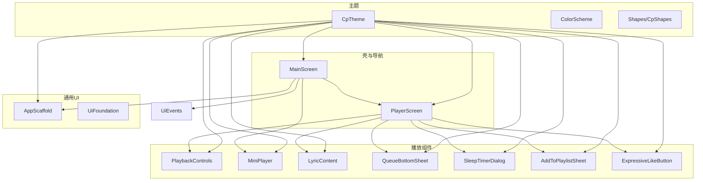
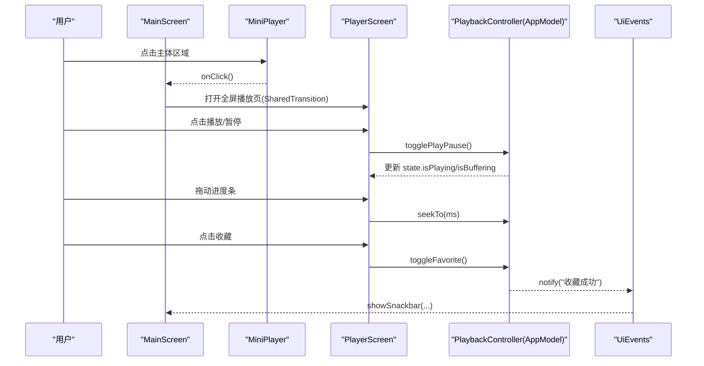
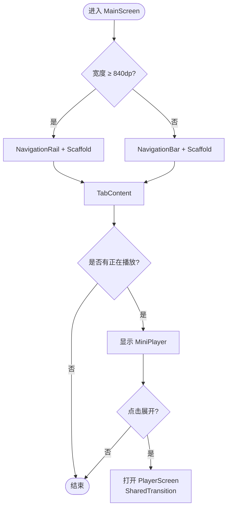
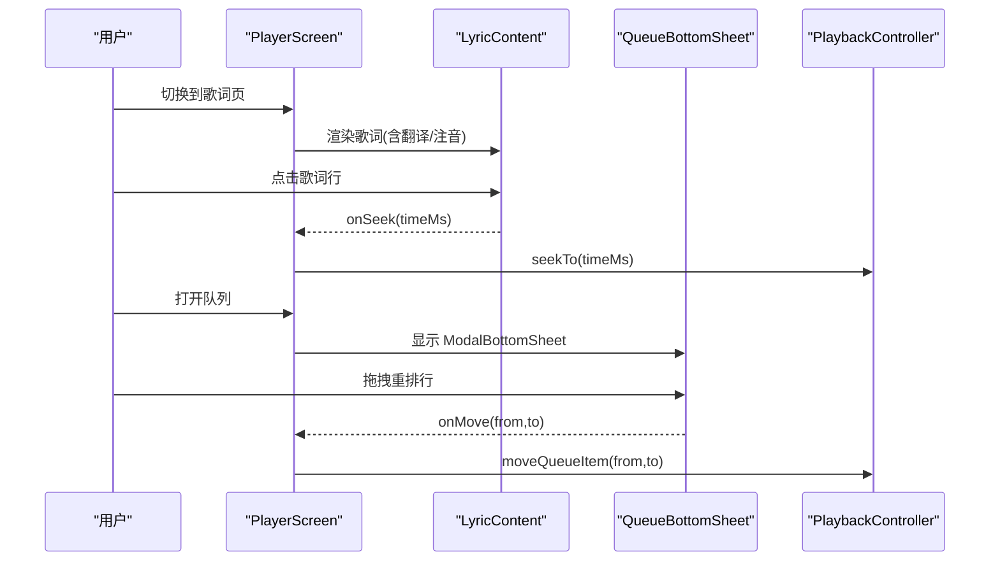
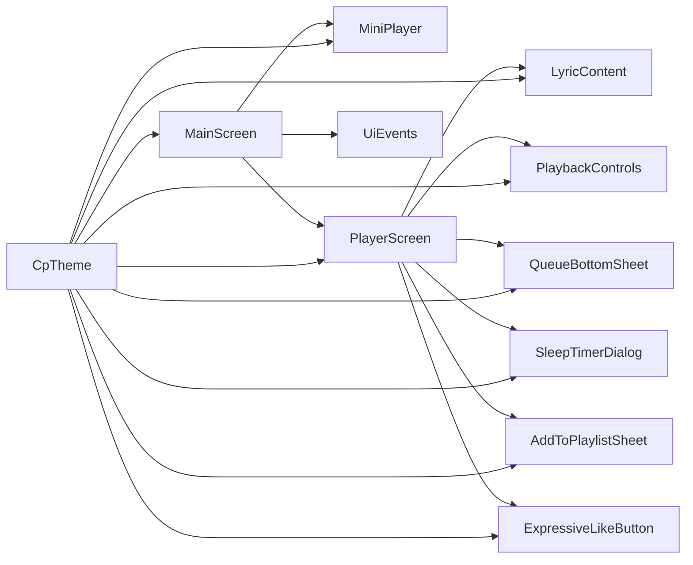

# 用户界面组件

<cite>
**本文引用的文件**
- [AppScaffold.kt](file://app/src/commonMain/kotlin/cp/player/app/ui/component/AppScaffold.kt)
- [Theme.kt](file://app/src/commonMain/kotlin/cp/player/app/ui/theme/Theme.kt)
- [Color.kt](file://app/src/commonMain/kotlin/cp/player/app/ui/theme/Color.kt)
- [Shape.kt](file://app/src/commonMain/kotlin/cp/player/app/ui/theme/Shape.kt)
- [MainScreen.kt](file://app/src/commonMain/kotlin/cp/player/app/ui/screen/MainScreen.kt)
- [PlayerScreen.kt](file://app/src/commonMain/kotlin/cp/player/app/ui/screen/PlayerScreen.kt)
- [PlaybackControls.kt](file://app/src/commonMain/kotlin/cp/player/app/ui/component/PlaybackControls.kt)
- [MiniPlayer.kt](file://app/src/commonMain/kotlin/cp/player/app/ui/component/MiniPlayer.kt)
- [UiFoundation.kt](file://app/src/commonMain/kotlin/cp/player/app/ui/component/UiFoundation.kt)
- [LyricContent.kt](file://app/src/commonMain/kotlin/cp/player/app/ui/component/LyricContent.kt)
- [QueueBottomSheet.kt](file://app/src/commonMain/kotlin/cp/player/app/ui/component/QueueBottomSheet.kt)
- [SleepTimerDialog.kt](file://app/src/commonMain/kotlin/cp/player/app/ui/component/SleepTimerDialog.kt)
- [AddToPlaylistSheet.kt](file://app/src/commonMain/kotlin/cp/player/app/ui/component/AddToPlaylistSheet.kt)
- [ExpressiveLikeButton.kt](file://app/src/commonMain/kotlin/cp/player/app/ui/component/ExpressiveLikeButton.kt)
- [UiEvents.kt](file://app/src/commonMain/kotlin/cp/player/app/ui/util/UiEvents.kt)
</cite>

## 目录
1. [简介](#简介)
2. [项目结构](#项目结构)
3. [核心组件](#核心组件)
4. [架构总览](#架构总览)
5. [详细组件分析](#详细组件分析)
6. [依赖关系分析](#依赖关系分析)
7. [性能考虑](#性能考虑)
8. [故障排查指南](#故障排查指南)
9. [结论](#结论)
10. [附录：使用示例与最佳实践](#附录使用示例与最佳实践)

## 简介
本技术文档聚焦 CPPlayer-KMP 的用户界面组件，围绕基于 Jetpack Compose 的跨平台 UI 实现，系统阐述视觉外观、行为模式、用户交互、属性与事件、插槽（Composable 内容）、主题与样式定制、响应式布局、无障碍访问、状态管理、动画与过渡效果、跨浏览器/跨平台兼容性以及性能优化。重点覆盖应用壳层、播放控制、迷你播放器、全屏播放页、歌词展示、队列抽屉、睡眠定时、加入歌单等关键组件，并说明其与导航架构和状态管理的集成方式。

## 项目结构
- 主题与样式
  - 主题入口与模式切换：CpTheme 提供跟随系统/浅色/深色模式，支持动态取色与纯黑背景选项，统一注入 MaterialTheme。
  - 颜色与形状：定义 Light/Dark ColorScheme 与 Expressive 风格圆角；提供 CpShapes 用于底部卡片、迷你播放器等特定形状。
- 应用壳与导航
  - MainScreen 作为主容器，根据宽度在底部导航栏与侧边导航轨之间切换；承载顶部栏、标签页内容与全局 Snackbar。
  - PlayerScreen 为全屏播放页，采用三页 HorizontalPager（歌词/播放器/评论），支持下拉关闭与共享元素过渡。
- 通用 UI 基础
  - AppScaffold 封装 Scaffold + LargeTopAppBar，支持加载态、滚动行为、容器色与顶部栏容器色。
  - UiFoundation 提供 PageHeader、SectionHeader、ContentState、rememberPressedScale、StateSurface 等基础构建块。
- 播放相关组件
  - PlaybackControls：上一首/播放暂停/下一首控件行，支持缓冲态指示。
  - MiniPlayer：底部迷你条，显示封面、标题、歌手、进度与播放控制，点击展开全屏播放页。
  - LyricContent：歌词展示，支持卡拉OK逐字高亮、翻译与注音。
  - QueueBottomSheet：队列管理，支持定位当前、保存为歌单、清空队列与拖拽重排。
  - SleepTimerDialog：睡眠定时选择对话框。
  - AddToPlaylistSheet：加入歌单/新建歌单并添加曲目。
  - ExpressiveLikeButton：收藏按钮，带弹簧放大与颜色渐变。
- 全局事件总线
  - UiEvents：轻量 SharedFlow 事件总线，集中展示一次性提示（如收藏成功、已加入队列）。

图表来源
- [MainScreen.kt:72-233](file://app/src/commonMain/kotlin/cp/player/app/ui/screen/MainScreen.kt#L72-L233)
- [PlayerScreen.kt:118-426](file://app/src/commonMain/kotlin/cp/player/app/ui/screen/PlayerScreen.kt#L118-L426)
- [AppScaffold.kt:33-109](file://app/src/commonMain/kotlin/cp/player/app/ui/component/AppScaffold.kt#L33-L109)
- [Theme.kt:31-65](file://app/src/commonMain/kotlin/cp/player/app/ui/theme/Theme.kt#L31-L65)
- [Color.kt:69-97](file://app/src/commonMain/kotlin/cp/player/app/ui/theme/Color.kt#L69-L97)
- [Shape.kt:9-26](file://app/src/commonMain/kotlin/cp/player/app/ui/theme/Shape.kt#L9-L26)

章节来源
- [Theme.kt:31-65](file://app/src/commonMain/kotlin/cp/player/app/ui/theme/Theme.kt#L31-L65)
- [Color.kt:69-97](file://app/src/commonMain/kotlin/cp/player/app/ui/theme/Color.kt#L69-L97)
- [Shape.kt:9-26](file://app/src/commonMain/kotlin/cp/player/app/ui/theme/Shape.kt#L9-L26)
- [MainScreen.kt:72-233](file://app/src/commonMain/kotlin/cp/player/app/ui/screen/MainScreen.kt#L72-L233)
- [AppScaffold.kt:33-109](file://app/src/commonMain/kotlin/cp/player/app/ui/component/AppScaffold.kt#L33-L109)

## 核心组件
- 应用壳 AppScaffold
  - 作用：统一 Scaffold + LargeTopAppBar，支持返回导航、顶部操作按钮、浮动按钮、加载指示器、滚动行为与容器色定制。
  - 关键属性：title、onBackPressed、navigationIcon、topBarActions、floatingActionButton、isLoading、scrollBehavior、bottomBar、containerColor、topBarContainerColor、content。
  - 行为：自动处理未指定 topBarContainerColor 时的透明融合；嵌套滚动与内容内边距适配。
- 主题 CpTheme
  - 作用：提供 ThemeMode（SYSTEM/LIGHT/DARK）、动态取色开关、纯黑背景模式，统一注入 MaterialTheme。
  - 关键点：根据 themeMode 计算 dark；若启用 dynamicColor 且可用则使用动态 ColorScheme；pureBlack 将 surface 系列置黑。
- 主屏幕 MainScreen
  - 作用：响应式外壳，宽屏使用 NavigationRail，窄屏使用 NavigationBar；承载 Tab 内容、顶部栏、全局 Snackbar、MiniPlayer 与全屏 PlayerScreen 过渡。
  - 交互：点击 MiniPlayer 展开全屏播放页；支持返回键收起；页面缩放与遮罩过渡。
- 播放控制 PlaybackControls
  - 作用：上一首/播放暂停/下一首控件行，缓冲态显示圆形进度。
  - 关键属性：isPlaying、isBuffering、onPlayPause、onSkipNext、onSkipPrevious、尺寸与排列参数。
- 迷你播放器 MiniPlayer
  - 作用：底部迷你条，展示封面、标题、歌手、进度与播放控制；点击展开全屏播放页。
  - 动画：进度平滑动画；共享元素过渡（封面、标题、艺术家）到全屏播放页。
- 全屏播放页 PlayerScreen
  - 作用：三页 HorizontalPager（歌词/播放器/评论），支持下拉关闭、更多菜单、队列、睡眠定时、收藏、随机/循环等。
  - 交互：进度条拖动 seek；歌词点击跳转；队列拖拽重排；更多菜单项触发业务动作。
- 歌词 LyricContent
  - 作用：基于 accompanist-lyrics-ui 的歌词渲染，支持逐字高亮、翻译、注音与点击跳转。
- 队列 QueueBottomSheet
  - 作用：ModalBottomSheet 展示队列，支持定位当前、保存为歌单、清空、拖拽重排。
- 睡眠定时 SleepTimerDialog
  - 作用：选择 N 分钟后暂停或播完当前后暂停，支持取消已有定时。
- 加入歌单 AddToPlaylistSheet
  - 作用：列出用户歌单，支持新建歌单并添加曲目；通过 UiEvents 反馈结果。
- 收藏 ExpressiveLikeButton
  - 作用：收藏按钮，带弹簧放大与颜色渐变。
- 全局事件 UiEvents
  - 作用：一次性消息广播，由 MainScreen 的全局 SnackbarHost 统一展示。

章节来源
- [AppScaffold.kt:33-109](file://app/src/commonMain/kotlin/cp/player/app/ui/component/AppScaffold.kt#L33-L109)
- [Theme.kt:31-65](file://app/src/commonMain/kotlin/cp/player/app/ui/theme/Theme.kt#L31-L65)
- [MainScreen.kt:72-233](file://app/src/commonMain/kotlin/cp/player/app/ui/screen/MainScreen.kt#L72-L233)
- [PlaybackControls.kt:37-118](file://app/src/commonMain/kotlin/cp/player/app/ui/component/PlaybackControls.kt#L37-L118)
- [MiniPlayer.kt:53-199](file://app/src/commonMain/kotlin/cp/player/app/ui/component/MiniPlayer.kt#L53-L199)
- [PlayerScreen.kt:118-426](file://app/src/commonMain/kotlin/cp/player/app/ui/screen/PlayerScreen.kt#L118-L426)
- [LyricContent.kt:33-142](file://app/src/commonMain/kotlin/cp/player/app/ui/component/LyricContent.kt#L33-L142)
- [QueueBottomSheet.kt:64-187](file://app/src/commonMain/kotlin/cp/player/app/ui/component/QueueBottomSheet.kt#L64-L187)
- [SleepTimerDialog.kt:24-78](file://app/src/commonMain/kotlin/cp/player/app/ui/component/SleepTimerDialog.kt#L24-L78)
- [AddToPlaylistSheet.kt:56-206](file://app/src/commonMain/kotlin/cp/player/app/ui/component/AddToPlaylistSheet.kt#L56-L206)
- [ExpressiveLikeButton.kt:24-64](file://app/src/commonMain/kotlin/cp/player/app/ui/component/ExpressiveLikeButton.kt#L24-L64)
- [UiEvents.kt:13-21](file://app/src/commonMain/kotlin/cp/player/app/ui/util/UiEvents.kt#L13-L21)

## 架构总览
- 主题系统：CpTheme 作为根 CompositionLocalProvider，向全树提供 colorScheme、typography、shapes；支持动态取色与纯黑模式。
- 导航架构：MainScreen 使用 Voyager Screen 组合首页/搜索/我的三个目的地；PlayerScreen 以独立 Screen 入栈，支持 pop 返回。
- 状态管理：播放状态来自 AppModel.playback.state（CollectAsState），各组件通过回调向上委派控制（togglePlayPause、seekTo、skipNext/Prev、repeat/shuffle、clearQueue、playAt、remove/move queue item）。
- 事件总线：UiEvents 提供一次性消息，MainScreen 订阅并展示 Snackbar。
- 动画与过渡：SharedTransitionLayout 配合 sharedBounds 实现封面/标题/艺术家从 MiniPlayer 到 PlayerPage 的共享元素过渡；AnimatedContent 控制全屏/迷你播放器显隐；手势驱动的下拉关闭与缩放过渡。

图表来源
- [MainScreen.kt:106-229](file://app/src/commonMain/kotlin/cp/player/app/ui/screen/MainScreen.kt#L106-L229)
- [MiniPlayer.kt:75-199](file://app/src/commonMain/kotlin/cp/player/app/ui/component/MiniPlayer.kt#L75-L199)
- [PlayerScreen.kt:160-426](file://app/src/commonMain/kotlin/cp/player/app/ui/screen/PlayerScreen.kt#L160-L426)
- [UiEvents.kt:13-21](file://app/src/commonMain/kotlin/cp/player/app/ui/util/UiEvents.kt#L13-L21)

## 详细组件分析

### 应用壳 AppScaffold
- 职责：封装 Scaffold + LargeTopAppBar，提供统一的顶部栏、加载态、滚动行为与容器色。
- 关键特性：
  - 自动处理 topBarContainerColor 与 containerColor 的透明融合。
  - 支持自定义 navigationIcon、topBarActions、floatingActionButton、bottomBar。
  - 内置 CircularProgressIndicator 居中显示。
- 使用建议：
  - 列表页建议使用 exitUntilCollapsedScrollBehavior 以获得折叠效果。
  - 需要透明顶栏时传入 containerColor=Transparent，避免顶栏遮挡背景。

章节来源
- [AppScaffold.kt:33-109](file://app/src/commonMain/kotlin/cp/player/app/ui/component/AppScaffold.kt#L33-L109)

### 主题系统 CpTheme
- 职责：统一主题模式、动态取色、纯黑背景与 MaterialTheme 注入。
- 关键特性：
  - ThemeMode.SYSTEM/LIGHT/DARK 三种模式。
  - supportsDynamicColor/dynamicColorScheme 仅在 Android 12+ 生效。
  - pureBlack 将 surface 系列置黑，适合 OLED 省电。
- 使用建议：
  - 在应用根节点包裹 CpTheme，确保全树一致的主题上下文。
  - 结合 Color.kt 与 Shape.kt 进行品牌化定制。

章节来源
- [Theme.kt:31-65](file://app/src/commonMain/kotlin/cp/player/app/ui/theme/Theme.kt#L31-L65)
- [Color.kt:69-97](file://app/src/commonMain/kotlin/cp/player/app/ui/theme/Color.kt#L69-L97)
- [Shape.kt:9-26](file://app/src/commonMain/kotlin/cp/player/app/ui/theme/Shape.kt#L9-L26)

### 主屏幕 MainScreen
- 职责：响应式外壳，承载导航、全局 Snackbar、MiniPlayer 与全屏播放页过渡。
- 关键特性：
  - 宽屏≥840dp 使用 NavigationRail，否则使用 NavigationBar。
  - 使用 SharedTransitionLayout 与 AnimatedContent 实现全屏/迷你播放器切换。
  - 全局 Snackbar 收集 UiEvents 消息。
- 交互流程：
  - 点击 MiniPlayer 展开全屏播放页；返回键收起。
  - 页面缩放与遮罩过渡提升沉浸感。

图表来源
- [MainScreen.kt:120-233](file://app/src/commonMain/kotlin/cp/player/app/ui/screen/MainScreen.kt#L120-L233)

章节来源
- [MainScreen.kt:72-233](file://app/src/commonMain/kotlin/cp/player/app/ui/screen/MainScreen.kt#L72-L233)

### 播放控制 PlaybackControls
- 职责：上一首/播放暂停/下一首控件行，缓冲态显示圆形进度。
- 关键属性：isPlaying、isBuffering、onPlayPause、onSkipNext、onSkipPrevious、尺寸与排列参数。
- 行为：
  - 缓冲态替换播放/暂停图标为 CircularProgressIndicator。
  - 中央按钮使用 primary 色与 onPrimary 图标色。
- 使用建议：
  - 在 PlayerPage 中通过 weight 与 height 控制按钮大小与比例。

章节来源
- [PlaybackControls.kt:37-118](file://app/src/commonMain/kotlin/cp/player/app/ui/component/PlaybackControls.kt#L37-L118)

### 迷你播放器 MiniPlayer
- 职责：底部迷你条，展示封面、标题、歌手、进度与播放控制；点击展开全屏播放页。
- 关键特性：
  - 进度条线性动画；错误信息提示。
  - 共享元素过渡（封面、标题、艺术家）到全屏播放页。
- 使用建议：
  - 仅当 currentTrack 非空时渲染；注意与底部导航栏的间距以避免遮挡。

章节来源
- [MiniPlayer.kt:53-199](file://app/src/commonMain/kotlin/cp/player/app/ui/component/MiniPlayer.kt#L53-L199)

### 全屏播放页 PlayerScreen
- 职责：三页 HorizontalPager（歌词/播放器/评论），支持下拉关闭、更多菜单、队列、睡眠定时、收藏、随机/循环等。
- 关键特性：
  - 播放器页支持垂直拖拽关闭；Pager 切换带动画。
  - 进度条 seek；歌词点击跳转；队列拖拽重排。
  - 更多菜单包含“加入歌单”“睡眠定时”“不感兴趣”。
- 使用建议：
  - 通过 AppModel.playback 回调控制播放逻辑；错误信息通过 AnimatedVisibility 展示。

图表来源
- [PlayerScreen.kt:160-426](file://app/src/commonMain/kotlin/cp/player/app/ui/screen/PlayerScreen.kt#L160-L426)
- [LyricContent.kt:33-142](file://app/src/commonMain/kotlin/cp/player/app/ui/component/LyricContent.kt#L33-L142)
- [QueueBottomSheet.kt:64-187](file://app/src/commonMain/kotlin/cp/player/app/ui/component/QueueBottomSheet.kt#L64-L187)

章节来源
- [PlayerScreen.kt:118-426](file://app/src/commonMain/kotlin/cp/player/app/ui/screen/PlayerScreen.kt#L118-L426)

### 歌词 LyricContent
- 职责：歌词展示，支持逐字高亮、翻译、注音与点击跳转。
- 关键特性：
  - 将 KMP LyricsState 转换为 accompanist-lyrics 模型。
  - 支持 normal/accompaniment/phonetic 文本样式配置。
- 使用建议：
  - 在歌词页中按需开启翻译与注音；点击行调用 onSeek 实现跳转。

章节来源
- [LyricContent.kt:33-142](file://app/src/commonMain/kotlin/cp/player/app/ui/component/LyricContent.kt#L33-L142)

### 队列 QueueBottomSheet
- 职责：队列管理，支持定位当前、保存为歌单、清空队列与拖拽重排。
- 关键特性：
  - LazyColumn 高效渲染；当前行高亮。
  - 长按拖拽 handle 触发 onMove。
- 使用建议：
  - 保存为歌单时异步执行，并通过 UiEvents 反馈结果。

章节来源
- [QueueBottomSheet.kt:64-187](file://app/src/commonMain/kotlin/cp/player/app/ui/component/QueueBottomSheet.kt#L64-L187)

### 睡眠定时 SleepTimerDialog
- 职责：选择 N 分钟后暂停或播完当前后暂停，支持取消已有定时。
- 关键特性：
  - FilterChip 快速选择；显示当前生效的定时状态。
- 使用建议：
  - 选择后立即关闭；取消定时需调用 onCancelTimer。

章节来源
- [SleepTimerDialog.kt:24-78](file://app/src/commonMain/kotlin/cp/player/app/ui/component/SleepTimerDialog.kt#L24-L78)

### 加入歌单 AddToPlaylistSheet
- 职责：列出用户歌单，支持新建歌单并添加曲目；通过 UiEvents 反馈结果。
- 关键特性：
  - 异步加载歌单；新建歌单并立即添加。
- 使用建议：
  - 网络请求在 IO 调度器执行；结果在主线程反馈。

章节来源
- [AddToPlaylistSheet.kt:56-206](file://app/src/commonMain/kotlin/cp/player/app/ui/component/AddToPlaylistSheet.kt#L56-L206)

### 收藏 ExpressiveLikeButton
- 职责：收藏按钮，带弹簧放大与颜色渐变。
- 关键特性：
  - 按下时放大回弹；收藏状态切换颜色。
- 使用建议：
  - 在播放器页与歌词页均可复用。

章节来源
- [ExpressiveLikeButton.kt:24-64](file://app/src/commonMain/kotlin/cp/player/app/ui/component/ExpressiveLikeButton.kt#L24-L64)

### 全局事件 UiEvents
- 职责：一次性消息广播，由 MainScreen 的全局 SnackbarHost 统一展示。
- 关键特性：
  - SharedFlow 保证顺序消费；缓冲满时丢弃最旧语义。
- 使用建议：
  - 在各 Screen/ScreenModel 中通过 notify 发送提示。

章节来源
- [UiEvents.kt:13-21](file://app/src/commonMain/kotlin/cp/player/app/ui/util/UiEvents.kt#L13-L21)

## 依赖关系分析
- 组件耦合
  - MainScreen 依赖 AppModel.playback 与 UiEvents，协调 MiniPlayer 与 PlayerScreen。
  - PlayerScreen 依赖 PlaybackController 回调与多个子组件（LyricContent、QueueBottomSheet、SleepTimerDialog、AddToPlaylistSheet、ExpressiveLikeButton）。
  - 主题系统通过 CpTheme 向所有组件提供颜色、排版与形状。
- 外部依赖
  - Voyager Navigator：页面导航与返回。
  - Coil3 AsyncImage：图片加载。
  - Accompanist Lyrics：歌词渲染。
- 潜在循环依赖
  - 组件间通过回调与状态解耦，未见直接循环导入；保持单向数据流。

图表来源
- [MainScreen.kt:72-233](file://app/src/commonMain/kotlin/cp/player/app/ui/screen/MainScreen.kt#L72-L233)
- [PlayerScreen.kt:118-426](file://app/src/commonMain/kotlin/cp/player/app/ui/screen/PlayerScreen.kt#L118-L426)
- [Theme.kt:31-65](file://app/src/commonMain/kotlin/cp/player/app/ui/theme/Theme.kt#L31-L65)

章节来源
- [MainScreen.kt:72-233](file://app/src/commonMain/kotlin/cp/player/app/ui/screen/MainScreen.kt#L72-L233)
- [PlayerScreen.kt:118-426](file://app/src/commonMain/kotlin/cp/player/app/ui/screen/PlayerScreen.kt#L118-L426)
- [Theme.kt:31-65](file://app/src/commonMain/kotlin/cp/player/app/ui/theme/Theme.kt#L31-L65)

## 性能考虑
- 列表与懒加载
  - 队列与评论使用 LazyColumn，避免不必要渲染；合理设置 key 提升重组效率。
- 图片加载
  - 使用 Coil3 AsyncImage，注意 contentScale 与占位图；封面大图裁剪减少内存占用。
- 动画与过渡
  - 共享元素过渡（sharedBounds）与 AnimatedContent 控制显隐；避免过度动画导致卡顿。
- 状态更新频率
  - 进度条使用 animateFloatAsState 平滑更新；避免高频重组。
- 主题与颜色
  - 动态取色仅在 Android 12+ 生效；纯黑模式可减少 OLED 功耗。
- 网络与后台
  - 歌单加载与 API 调用在 IO 调度器执行，主线程仅做 UI 更新。

[本节为通用指导，无需具体文件引用]

## 故障排查指南
- 无封面或封面加载失败
  - 检查 coverUrl 是否为空；必要时显示默认图标与占位背景。
- 歌词不显示
  - 确认 LyricsState 为 Success 且 lines 非空；检查 translation/phonetic 字段。
- 队列操作无效
  - 确认 onMove/onRemove/onClear 回调正确绑定；检查 currentIndex 与队列索引范围。
- 睡眠定时未生效
  - 确认 onSelect 与 onCancelTimer 调用；检查 activeRemainingMs 与 afterTrackActive 状态。
- 加入歌单失败
  - 检查登录状态与 API 返回；通过 UiEvents 获取错误提示。
- 主题异常
  - 确认 CpTheme 包裹在应用根节点；检查 themeMode 与 dynamicColor 配置。

章节来源
- [LyricContent.kt:33-142](file://app/src/commonMain/kotlin/cp/player/app/ui/component/LyricContent.kt#L33-L142)
- [QueueBottomSheet.kt:64-187](file://app/src/commonMain/kotlin/cp/player/app/ui/component/QueueBottomSheet.kt#L64-L187)
- [SleepTimerDialog.kt:24-78](file://app/src/commonMain/kotlin/cp/player/app/ui/component/SleepTimerDialog.kt#L24-L78)
- [AddToPlaylistSheet.kt:56-206](file://app/src/commonMain/kotlin/cp/player/app/ui/component/AddToPlaylistSheet.kt#L56-L206)
- [Theme.kt:31-65](file://app/src/commonMain/kotlin/cp/player/app/ui/theme/Theme.kt#L31-L65)

## 结论
CPPlayer-KMP 的 UI 组件以 Jetpack Compose 为核心，通过主题系统、响应式布局、共享元素过渡与状态管理，构建了流畅一致的跨平台播放体验。组件职责清晰、耦合度低，便于扩展与维护。遵循本文档的使用建议与最佳实践，可快速集成与定制，同时保障性能与可访问性。

[本节为总结，无需具体文件引用]

## 附录：使用示例与最佳实践
- 主题接入
  - 在应用根节点包裹 CpTheme，设置 themeMode、dynamicColor、pureBlack。
  - 参考路径：[Theme.kt:31-65](file://app/src/commonMain/kotlin/cp/player/app/ui/theme/Theme.kt#L31-L65)
- 应用壳使用
  - 使用 AppScaffold 包装页面内容，设置 title、isLoading、scrollBehavior 等。
  - 参考路径：[AppScaffold.kt:33-109](file://app/src/commonMain/kotlin/cp/player/app/ui/component/AppScaffold.kt#L33-L109)
- 主屏幕导航
  - 在 MainScreen 中配置 tabs、selectTab、全局 Snackbar 与 MiniPlayer。
  - 参考路径：[MainScreen.kt:72-233](file://app/src/commonMain/kotlin/cp/player/app/ui/screen/MainScreen.kt#L72-L233)
- 播放控制集成
  - 在 PlayerPage 中调用 PlaybackControls，并绑定 onTogglePlay、onSkipNext/Prev。
  - 参考路径：[PlayerScreen.kt:577-592](file://app/src/commonMain/kotlin/cp/player/app/ui/screen/PlayerScreen.kt#L577-L592)、[PlaybackControls.kt:37-118](file://app/src/commonMain/kotlin/cp/player/app/ui/component/PlaybackControls.kt#L37-L118)
- 歌词展示
  - 在 LyricsPage 中渲染 LyricContent，并处理 onSeek。
  - 参考路径：[PlayerScreen.kt:428-479](file://app/src/commonMain/kotlin/cp/player/app/ui/screen/PlayerScreen.kt#L428-L479)、[LyricContent.kt:33-142](file://app/src/commonMain/kotlin/cp/player/app/ui/component/LyricContent.kt#L33-L142)
- 队列管理
  - 在 PlayerScreen 中打开 QueueBottomSheet，处理 onPlayAt、onRemove、onMove、onClear。
  - 参考路径：[PlayerScreen.kt:398-408](file://app/src/commonMain/kotlin/cp/player/app/ui/screen/PlayerScreen.kt#L398-L408)、[QueueBottomSheet.kt:64-187](file://app/src/commonMain/kotlin/cp/player/app/ui/component/QueueBottomSheet.kt#L64-L187)
- 睡眠定时
  - 通过 SleepTimerDialog 设置或取消定时。
  - 参考路径：[PlayerScreen.kt:417-425](file://app/src/commonMain/kotlin/cp/player/app/ui/screen/PlayerScreen.kt#L417-L425)、[SleepTimerDialog.kt:24-78](file://app/src/commonMain/kotlin/cp/player/app/ui/component/SleepTimerDialog.kt#L24-L78)
- 加入歌单
  - 使用 AddToPlaylistSheet 列出歌单并添加曲目。
  - 参考路径：[PlayerScreen.kt:410-415](file://app/src/commonMain/kotlin/cp/player/app/ui/screen/PlayerScreen.kt#L410-L415)、[AddToPlaylistSheet.kt:56-206](file://app/src/commonMain/kotlin/cp/player/app/ui/component/AddToPlaylistSheet.kt#L56-L206)
- 收藏按钮
  - 在播放器页与歌词页复用 ExpressiveLikeButton。
  - 参考路径：[PlayerScreen.kt:571-574](file://app/src/commonMain/kotlin/cp/player/app/ui/screen/PlayerScreen.kt#L571-L574)、[ExpressiveLikeButton.kt:24-64](file://app/src/commonMain/kotlin/cp/player/app/ui/component/ExpressiveLikeButton.kt#L24-L64)
- 全局提示
  - 通过 UiEvents.notify 发送一次性提示，由 MainScreen 的 SnackbarHost 展示。
  - 参考路径：[UiEvents.kt:13-21](file://app/src/commonMain/kotlin/cp/player/app/ui/util/UiEvents.kt#L13-L21)、[MainScreen.kt:96-104](file://app/src/commonMain/kotlin/cp/player/app/ui/screen/MainScreen.kt#L96-L104)

[本节为使用指引，无需额外图表]