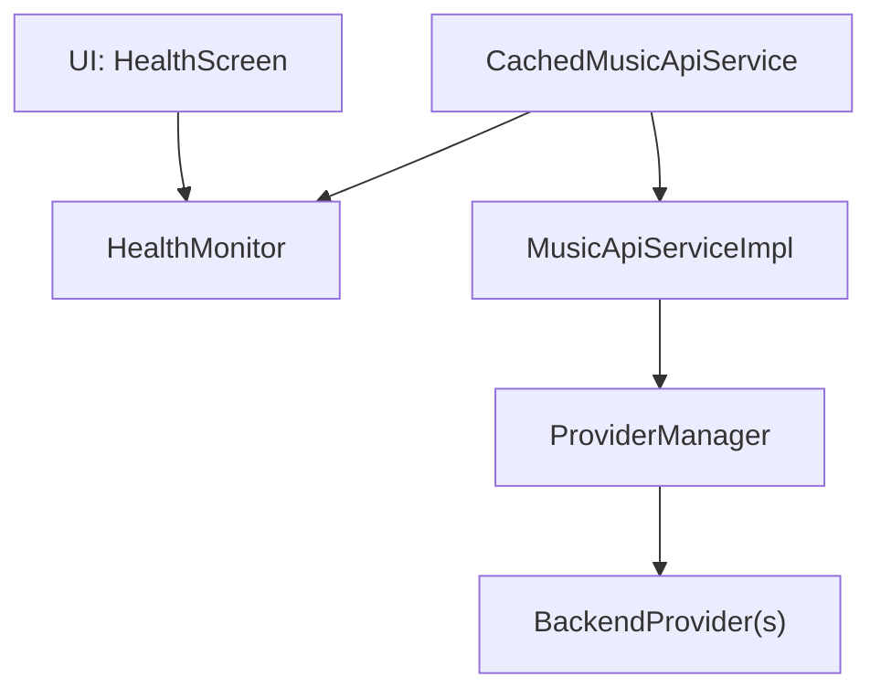
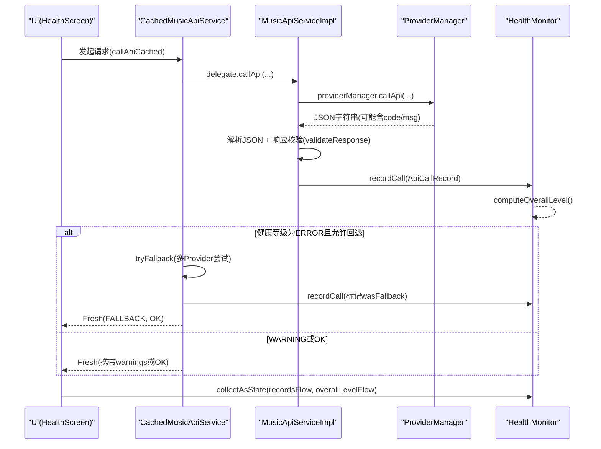
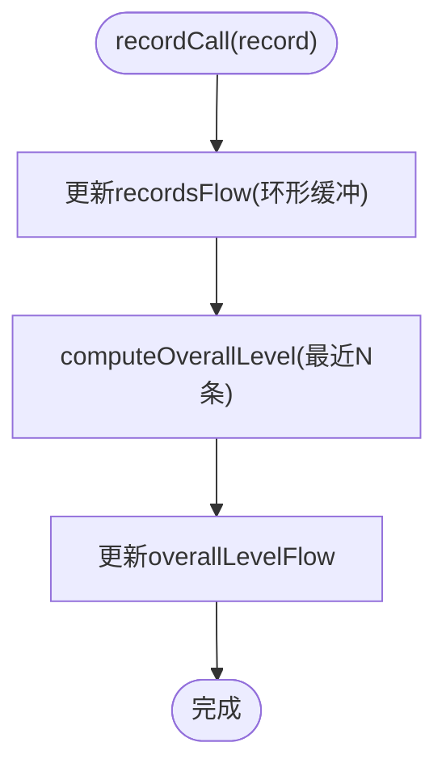
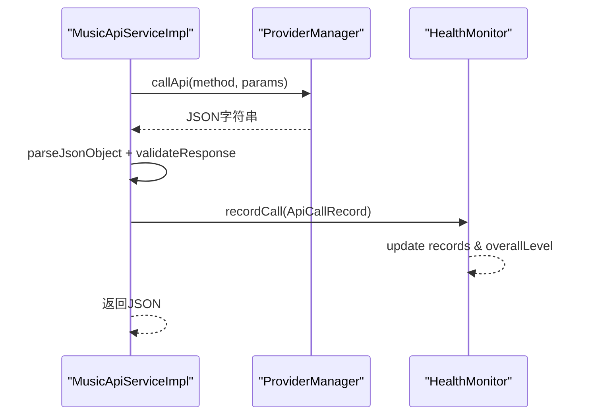
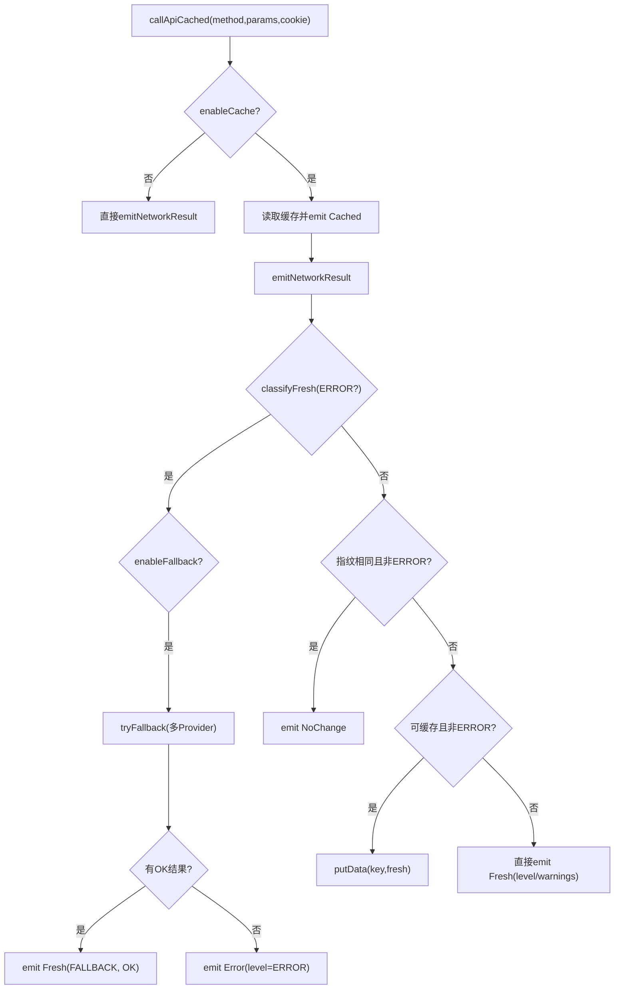
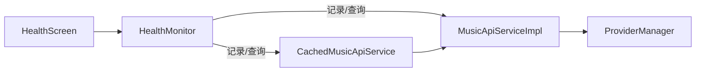

# 健康监控系统

<cite>
**本文引用的文件**
- [HealthMonitor.kt](file://kmp-pro/src/commonMain/kotlin/cp/player/kmp/monitor/HealthMonitor.kt)
- [CachedMusicApiService.kt](file://kmp-pro/src/commonMain/kotlin/cp/player/kmp/cache/CachedMusicApiService.kt)
- [MusicApiServiceImpl.kt](file://kmp-pro/src/commonMain/kotlin/cp/player/kmp/api/MusicApiServiceImpl.kt)
- [ProviderManager.kt](file://kmp-pro/src/commonMain/kotlin/cp/player/kmp/provider/ProviderManager.kt)
- [HealthScreen.kt](file://app/src/commonMain/kotlin/cp/player/app/ui/screen/HealthScreen.kt)
</cite>

## 目录
1. [简介](#简介)
2. [项目结构](#项目结构)
3. [核心组件](#核心组件)
4. [架构总览](#架构总览)
5. [详细组件分析](#详细组件分析)
6. [依赖关系分析](#依赖关系分析)
7. [性能考量](#性能考量)
8. [故障排查指南](#故障排查指南)
9. [结论](#结论)
10. [附录](#附录)

## 简介
本技术文档围绕 CPPlayer-KMP 的健康监控系统展开，重点说明 HealthMonitor 的三级分类机制（OK、WARNING、ERROR）及其状态转换规则；阐述健康检查触发条件、监控指标收集与状态更新流程；记录容灾回退策略的实现原理（服务降级、备用 Provider 切换、数据源故障转移）；提供健康状态的可视化展示方法与监控告警配置建议；并通过具体代码路径示例，展示如何在 CachedMusicApiService 中集成健康检查与自动恢复功能；最后给出性能监控指标的收集与分析方法，帮助开发者优化系统稳定性。

## 项目结构
健康监控相关代码主要分布在以下模块：
- 监控核心：kmp-pro/commonMain/.../monitor/HealthMonitor.kt
- API 实现与响应校验：kmp-pro/commonMain/.../api/MusicApiServiceImpl.kt
- 缓存与健康深度集成：kmp-pro/commonMain/.../cache/CachedMusicApiService.kt
- Provider 管理与切换：kmp-pro/commonMain/.../provider/ProviderManager.kt
- UI 健康监控页面：app/commonMain/.../ui/screen/HealthScreen.kt

图表来源
- [HealthScreen.kt:46-100](file://app/src/commonMain/kotlin/cp/player/app/ui/screen/HealthScreen.kt#L46-L100)
- [HealthMonitor.kt:110-143](file://kmp-pro/src/commonMain/kotlin/cp/player/kmp/monitor/HealthMonitor.kt#L110-L143)
- [CachedMusicApiService.kt:60-140](file://kmp-pro/src/commonMain/kotlin/cp/player/kmp/cache/CachedMusicApiService.kt#L60-L140)
- [MusicApiServiceImpl.kt:35-101](file://kmp-pro/src/commonMain/kotlin/cp/player/kmp/api/MusicApiServiceImpl.kt#L35-L101)
- [ProviderManager.kt:129-141](file://kmp-pro/src/commonMain/kotlin/cp/player/kmp/provider/ProviderManager.kt#L129-L141)

章节来源
- [HealthMonitor.kt:1-290](file://kmp-pro/src/commonMain/kotlin/cp/player/kmp/monitor/HealthMonitor.kt#L1-L290)
- [CachedMusicApiService.kt:1-219](file://kmp-pro/src/commonMain/kotlin/cp/player/kmp/cache/CachedMusicApiService.kt#L1-L219)
- [MusicApiServiceImpl.kt:1-714](file://kmp-pro/src/commonMain/kotlin/cp/player/kmp/api/MusicApiServiceImpl.kt#L1-L714)
- [ProviderManager.kt:1-156](file://kmp-pro/src/commonMain/kotlin/cp/player/kmp/provider/ProviderManager.kt#L1-L156)
- [HealthScreen.kt:1-187](file://app/src/commonMain/kotlin/cp/player/app/ui/screen/HealthScreen.kt#L1-L187)

## 核心组件
- HealthMonitor：集中管理调用记录、健康等级判定、综合状态流与统计查询。
- MusicApiServiceImpl：统一拦截 API 调用，进行响应校验、警告收集、健康等级判定并记录到 HealthMonitor。
- CachedMusicApiService：在缓存层深度集成健康监控，根据健康等级决定回退、缓存写入与结果发射。
- ProviderManager：管理当前活跃 Provider，支持切换与持久化，并在 callApi 时返回“不支持”等错误码供上层处理。
- HealthScreen：基于 StateFlow 实时展示健康状态与调用明细，支持过滤与原始响应查看。

章节来源
- [HealthMonitor.kt:25-143](file://kmp-pro/src/commonMain/kotlin/cp/player/kmp/monitor/HealthMonitor.kt#L25-L143)
- [MusicApiServiceImpl.kt:35-101](file://kmp-pro/src/commonMain/kotlin/cp/player/kmp/api/MusicApiServiceImpl.kt#L35-L101)
- [CachedMusicApiService.kt:60-140](file://kmp-pro/src/commonMain/kotlin/cp/player/kmp/cache/CachedMusicApiService.kt#L60-L140)
- [ProviderManager.kt:129-141](file://kmp-pro/src/commonMain/kotlin/cp/player/kmp/provider/ProviderManager.kt#L129-L141)
- [HealthScreen.kt:46-100](file://app/src/commonMain/kotlin/cp/player/app/ui/screen/HealthScreen.kt#L46-L100)

## 架构总览
健康监控贯穿“API 调用 → 响应校验 → 健康等级判定 → 记录与统计 → 回退与缓存 → UI 展示”的全链路。

图表来源
- [CachedMusicApiService.kt:60-140](file://kmp-pro/src/commonMain/kotlin/cp/player/kmp/cache/CachedMusicApiService.kt#L60-L140)
- [MusicApiServiceImpl.kt:35-101](file://kmp-pro/src/commonMain/kotlin/cp/player/kmp/api/MusicApiServiceImpl.kt#L35-L101)
- [ProviderManager.kt:129-141](file://kmp-pro/src/commonMain/kotlin/cp/player/kmp/provider/ProviderManager.kt#L129-L141)
- [HealthMonitor.kt:110-143](file://kmp-pro/src/commonMain/kotlin/cp/player/kmp/monitor/HealthMonitor.kt#L110-L143)
- [HealthScreen.kt:46-100](file://app/src/commonMain/kotlin/cp/player/app/ui/screen/HealthScreen.kt#L46-L100)

## 详细组件分析

### HealthMonitor 三级分类与状态转换
- 三级分类语义
  - OK：响应正常，可直接使用。
  - WARNING：勉强可用（缺字段、慢响应、空数据等），可降级使用。
  - ERROR：不可用（报错、解析失败、Provider 不支持），需回退。
- 分类规则
  - 通过 classify(ResponseWarning) 将警告归入 WARNING 或 ERROR。
  - 综合等级 computeOverallLevel 扫描最近窗口（默认最近 100 条），按最差优先原则（ERROR > WARNING > OK）计算整体等级。
- 状态存储与更新
  - 使用 MutableStateFlow<List<ApiCallRecord>> 维护环形缓冲区（最大 500 条）。
  - 每次记录后更新 _overallLevelFlow，暴露 overallLevelFlow 给 UI。
- 统计与查询
  - getStats/getAllStats：按 Provider 聚合成功率、平均耗时、P95、回退次数、健康分数等。
  - getRecentRecords：支持按 Provider、仅异常/警告/错误过滤。
  - getStatsByMethod：按方法维度聚合统计。

图表来源
- [HealthMonitor.kt:119-143](file://kmp-pro/src/commonMain/kotlin/cp/player/kmp/monitor/HealthMonitor.kt#L119-L143)
- [HealthMonitor.kt:220-233](file://kmp-pro/src/commonMain/kotlin/cp/player/kmp/monitor/HealthMonitor.kt#L220-L233)

章节来源
- [HealthMonitor.kt:25-143](file://kmp-pro/src/commonMain/kotlin/cp/player/kmp/monitor/HealthMonitor.kt#L25-L143)
- [HealthMonitor.kt:147-216](file://kmp-pro/src/commonMain/kotlin/cp/player/kmp/monitor/HealthMonitor.kt#L147-L216)
- [HealthMonitor.kt:220-290](file://kmp-pro/src/commonMain/kotlin/cp/player/kmp/monitor/HealthMonitor.kt#L220-L290)

### MusicApiServiceImpl 健康检查与记录
- 统一入口 callApi：注入 cookie、调用 Provider、解析 JSON、执行 validateResponse 收集警告、判定 success 与 warnings。
- 健康等级判定 classifyLevel：success=false → ERROR；warnings 包含 ERROR 级警告 → ERROR；否则 OK 或 WARNING。
- 记录到 HealthMonitor：包含时间戳、Provider、方法、耗时、成功与否、错误码/信息、警告列表、期望字段、原始响应等。
- 特殊端点处理：如 SONG_URL_V1_302 重定向 URL 有效即视为成功；QR 中间态 code 特殊处理。

图表来源
- [MusicApiServiceImpl.kt:35-101](file://kmp-pro/src/commonMain/kotlin/cp/player/kmp/api/MusicApiServiceImpl.kt#L35-L101)
- [MusicApiServiceImpl.kt:594-658](file://kmp-pro/src/commonMain/kotlin/cp/player/kmp/api/MusicApiServiceImpl.kt#L594-L658)
- [HealthMonitor.kt:119-143](file://kmp-pro/src/commonMain/kotlin/cp/player/kmp/monitor/HealthMonitor.kt#L119-L143)

章节来源
- [MusicApiServiceImpl.kt:35-101](file://kmp-pro/src/commonMain/kotlin/cp/player/kmp/api/MusicApiServiceImpl.kt#L35-L101)
- [MusicApiServiceImpl.kt:594-658](file://kmp-pro/src/commonMain/kotlin/cp/player/kmp/api/MusicApiServiceImpl.kt#L594-L658)

### CachedMusicApiService 健康深度集成与容灾回退
- 调用流程
  - 先返回缓存（若存在），再后台拉取新数据。
  - 根据 classifyFresh(json, warnings) 判定健康等级：
    - ERROR：若 enableFallback=true，则触发 tryFallback 多 Provider 容灾；成功则标记 FALLBACK 并返回 OK；失败则返回 Error。
    - WARNING：仍发射数据，附带 warnings。
    - OK：正常发射。
  - 指纹比对：若与缓存相同且非 ERROR，则 NoChange；否则写回缓存并发射 Fresh。
- 多 Provider 容灾 tryFallback
  - 遍历所有 Provider（跳过已失败的当前 Provider），按 apiMap 映射方法名调用。
  - 对每个 Provider 的成功尝试记录 wasFallback 与 fallbackFrom，便于追踪回退路径。
- 缓存策略
  - 仅幂等读类接口缓存；写/动作类直通网络。
  - 健康等级为 ERROR 时不写缓存，避免污染缓存。

图表来源
- [CachedMusicApiService.kt:60-140](file://kmp-pro/src/commonMain/kotlin/cp/player/kmp/cache/CachedMusicApiService.kt#L60-L140)
- [CachedMusicApiService.kt:149-180](file://kmp-pro/src/commonMain/kotlin/cp/player/kmp/cache/CachedMusicApiService.kt#L149-L180)
- [CachedMusicApiService.kt:194-218](file://kmp-pro/src/commonMain/kotlin/cp/player/kmp/cache/CachedMusicApiService.kt#L194-L218)

章节来源
- [CachedMusicApiService.kt:60-140](file://kmp-pro/src/commonMain/kotlin/cp/player/kmp/cache/CachedMusicApiService.kt#L60-L140)
- [CachedMusicApiService.kt:149-180](file://kmp-pro/src/commonMain/kotlin/cp/player/kmp/cache/CachedMusicApiService.kt#L149-L180)
- [CachedMusicApiService.kt:194-218](file://kmp-pro/src/commonMain/kotlin/cp/player/kmp/cache/CachedMusicApiService.kt#L194-L218)

### ProviderManager 服务降级与切换
- 当前 Provider 管理：currentProvider 与 currentProviderFlow 暴露状态。
- 切换逻辑：停止旧服务、启动新服务、端口探测与回退、持久化选择。
- 调用封装：callApi 在 IO 调度器执行，若映射为 unsupported 返回特定错误码，供上层判定与回退。

章节来源
- [ProviderManager.kt:31-145](file://kmp-pro/src/commonMain/kotlin/cp/player/kmp/provider/ProviderManager.kt#L31-L145)

### UI 健康监控展示
- HealthScreen 订阅 HealthMonitor 的 recordsFlow 与 overallLevelFlow，实时渲染总体状态与明细。
- 支持过滤“全部/仅异常”，点击条目可查看原始响应。
- 顶部概览卡片显示综合状态与记录总数。

章节来源
- [HealthScreen.kt:46-100](file://app/src/commonMain/kotlin/cp/player/app/ui/screen/HealthScreen.kt#L46-L100)
- [HealthScreen.kt:103-186](file://app/src/commonMain/kotlin/cp/player/app/ui/screen/HealthScreen.kt#L103-L186)

## 依赖关系分析
- HealthMonitor 被 MusicApiServiceImpl、CachedMusicApiService 共同依赖，用于记录与查询。
- MusicApiServiceImpl 依赖 ProviderManager 获取当前 Provider 并调用其 API。
- CachedMusicApiService 依赖 MusicApiServiceImpl、ProviderManager 以及缓存实现，实现健康深度集成与回退。
- UI 层 HealthScreen 依赖 HealthMonitor 的 Flow 进行状态展示。

图表来源
- [HealthMonitor.kt:110-143](file://kmp-pro/src/commonMain/kotlin/cp/player/kmp/monitor/HealthMonitor.kt#L110-L143)
- [MusicApiServiceImpl.kt:35-101](file://kmp-pro/src/commonMain/kotlin/cp/player/kmp/api/MusicApiServiceImpl.kt#L35-L101)
- [CachedMusicApiService.kt:60-140](file://kmp-pro/src/commonMain/kotlin/cp/player/kmp/cache/CachedMusicApiService.kt#L60-L140)
- [ProviderManager.kt:129-141](file://kmp-pro/src/commonMain/kotlin/cp/player/kmp/provider/ProviderManager.kt#L129-L141)
- [HealthScreen.kt:46-100](file://app/src/commonMain/kotlin/cp/player/app/ui/screen/HealthScreen.kt#L46-L100)

章节来源
- [HealthMonitor.kt:110-143](file://kmp-pro/src/commonMain/kotlin/cp/player/kmp/monitor/HealthMonitor.kt#L110-L143)
- [MusicApiServiceImpl.kt:35-101](file://kmp-pro/src/commonMain/kotlin/cp/player/kmp/api/MusicApiServiceImpl.kt#L35-L101)
- [CachedMusicApiService.kt:60-140](file://kmp-pro/src/commonMain/kotlin/cp/player/kmp/cache/CachedMusicApiService.kt#L60-L140)
- [ProviderManager.kt:129-141](file://kmp-pro/src/commonMain/kotlin/cp/player/kmp/provider/ProviderManager.kt#L129-L141)
- [HealthScreen.kt:46-100](file://app/src/commonMain/kotlin/cp/player/app/ui/screen/HealthScreen.kt#L46-L100)

## 性能考量
- 记录路径优化：使用 MutableStateFlow.update 避免完整列表复制；环形缓冲区预分配 ArrayList，减少扩容开销。
- 统计查询非阻塞：从 Flow snapshot 计算，不影响记录路径。
- 健康评分模型：结合成功率、平均响应时间、干净率（无警告/错误比例）加权计算，辅助定位退化趋势。
- P95 延迟：按延迟排序取第 95 百分位，识别长尾问题。
- 缓存命中与指纹比对：减少重复网络请求与无效更新，降低负载。

[本节为通用性能指导，无需特定文件引用]

## 故障排查指南
- 快速定位问题
  - 打开 HealthScreen，查看综合状态与最近调用明细，筛选“仅异常”聚焦错误。
  - 点击条目查看原始响应 rawResponse，结合 errorMessage 与 responseCode 定位根因。
- 常见告警类型
  - MISSING_CODE：缺少 code 字段。
  - UNEXPECTED_CODE：非预期 code。
  - MISSING_DATA_FIELD：期望字段缺失。
  - EMPTY_DATA_ARRAY/OBJECT：空数组或对象。
  - MALFORMED_RESPONSE：响应格式异常（非 JSON）。
  - UNSUPPORTED_BY_PROVIDER：Provider 不支持。
  - SLOW_RESPONSE：响应过慢（阈值 5000ms）。
- 回退与恢复
  - 当健康等级为 ERROR 且启用回退时，系统会尝试其他 Provider；若成功，记录 wasFallback 与 fallbackFrom。
  - 若所有 Provider 均失败，最终返回 Error，UI 可提示用户重试或切换 Provider。
- 日志与指标
  - 使用 HealthMonitor.getStats/getAllStats/getStatsByMethod 获取聚合指标，关注 errorCount、warningCount、avgResponseMs、p95ResponseMs、fallbackCount。
  - 结合 getRecentRecords(limit, onlyFailures/onlyWarnings/onlyErrors) 快速回溯问题。

章节来源
- [HealthScreen.kt:46-100](file://app/src/commonMain/kotlin/cp/player/app/ui/screen/HealthScreen.kt#L46-L100)
- [HealthMonitor.kt:147-216](file://kmp-pro/src/commonMain/kotlin/cp/player/kmp/monitor/HealthMonitor.kt#L147-L216)
- [MusicApiServiceImpl.kt:594-658](file://kmp-pro/src/commonMain/kotlin/cp/player/kmp/api/MusicApiServiceImpl.kt#L594-L658)
- [CachedMusicApiService.kt:149-180](file://kmp-pro/src/commonMain/kotlin/cp/player/kmp/cache/CachedMusicApiService.kt#L149-L180)

## 结论
CPPlayer-KMP 的健康监控系统以 HealthMonitor 为核心，结合 MusicApiServiceImpl 的响应校验与 CachedMusicApiService 的深度集成，实现了从调用记录、健康等级判定、统计查询到容灾回退与 UI 展示的完整闭环。通过三级分类机制与多 Provider 容灾策略，系统在外部依赖不稳定时仍能保持可用性；同时提供丰富的指标与可视化能力，便于快速定位与优化。建议在生产环境中持续观察健康评分、P95 延迟与回退频率，结合告警策略保障系统稳定性。

[本节为总结性内容，无需特定文件引用]

## 附录

### 健康检查触发条件与状态更新流程
- 触发点
  - MusicApiServiceImpl.callApi：每次 API 调用后进行响应校验与警告收集，并记录到 HealthMonitor。
  - CachedMusicApiService.emitNetworkResult：根据 classifyFresh 判定健康等级，必要时触发回退。
- 状态更新
  - HealthMonitor.recordCall 更新 recordsFlow 与 overallLevelFlow。
  - UI 通过 collectAsState 订阅 Flow，实时更新展示。

章节来源
- [MusicApiServiceImpl.kt:35-101](file://kmp-pro/src/commonMain/kotlin/cp/player/kmp/api/MusicApiServiceImpl.kt#L35-L101)
- [CachedMusicApiService.kt:90-140](file://kmp-pro/src/commonMain/kotlin/cp/player/kmp/cache/CachedMusicApiService.kt#L90-L140)
- [HealthMonitor.kt:119-143](file://kmp-pro/src/commonMain/kotlin/cp/player/kmp/monitor/HealthMonitor.kt#L119-L143)
- [HealthScreen.kt:46-100](file://app/src/commonMain/kotlin/cp/player/app/ui/screen/HealthScreen.kt#L46-L100)

### 容灾回退策略实现原理
- 服务降级：当健康等级为 WARNING 时，仍可返回数据但携带 warnings；为 ERROR 时触发回退。
- 备用 Provider 切换：tryFallback 遍历其他 Provider，按 apiMap 映射方法名调用，首个 OK 即返回。
- 数据源故障转移：若当前 Provider 返回错误或解析失败，自动尝试其他 Provider；记录 wasFallback 与 fallbackFrom 以便追踪。

章节来源
- [CachedMusicApiService.kt:149-180](file://kmp-pro/src/commonMain/kotlin/cp/player/kmp/cache/CachedMusicApiService.kt#L149-L180)
- [MusicApiServiceImpl.kt:437-479](file://kmp-pro/src/commonMain/kotlin/cp/player/kmp/api/MusicApiServiceImpl.kt#L437-L479)
- [ProviderManager.kt:129-141](file://kmp-pro/src/commonMain/kotlin/cp/player/kmp/provider/ProviderManager.kt#L129-L141)

### 可视化展示与监控告警配置建议
- 可视化
  - HealthScreen 展示综合状态与明细，支持过滤与原始响应查看。
  - 可使用 Provider 维度统计（getStats）与方法维度统计（getStatsByMethod）构建仪表盘。
- 告警配置
  - 基于 HealthMonitor.getStats 的 healthScore、errorCount、avgResponseMs、p95ResponseMs、fallbackCount 设置阈值告警。
  - 针对 ResponseWarning 类型（如 MALFORMED_RESPONSE、UNSUPPORTED_BY_PROVIDER）设置专项告警。
  - 结合 UI 状态（overallLevelFlow）推送通知或标记系统健康度。

章节来源
- [HealthScreen.kt:46-100](file://app/src/commonMain/kotlin/cp/player/app/ui/screen/HealthScreen.kt#L46-L100)
- [HealthMonitor.kt:147-216](file://kmp-pro/src/commonMain/kotlin/cp/player/kmp/monitor/HealthMonitor.kt#L147-L216)

### 在 CachedMusicApiService 中集成健康检查与自动恢复的代码示例路径
- 健康检查与回退主流程
  - 参考路径：[CachedMusicApiService.kt:60-140](file://kmp-pro/src/commonMain/kotlin/cp/player/kmp/cache/CachedMusicApiService.kt#L60-L140)
- 多 Provider 容灾回退实现
  - 参考路径：[CachedMusicApiService.kt:149-180](file://kmp-pro/src/commonMain/kotlin/cp/player/kmp/cache/CachedMusicApiService.kt#L149-L180)
- 健康等级判定与缓存策略
  - 参考路径：[CachedMusicApiService.kt:194-218](file://kmp-pro/src/commonMain/kotlin/cp/player/kmp/cache/CachedMusicApiService.kt#L194-L218)

[本节为路径指引，无需额外引用]