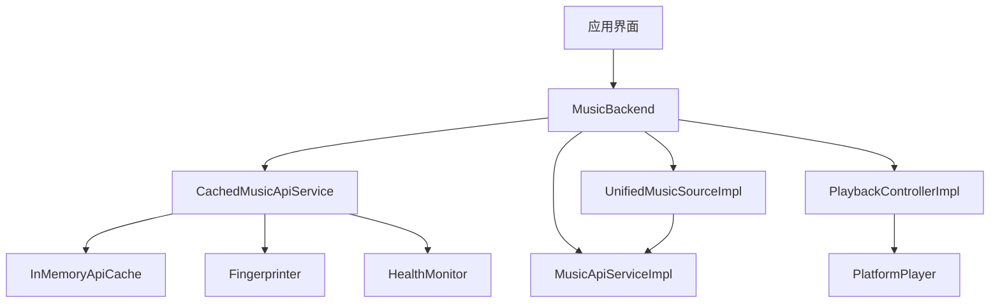
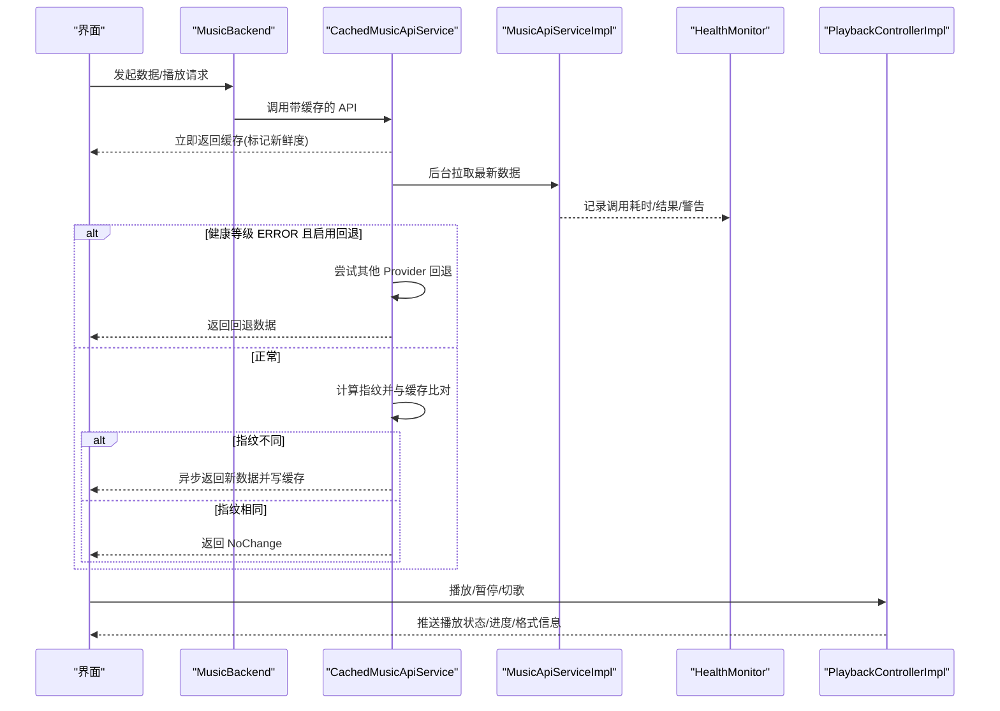
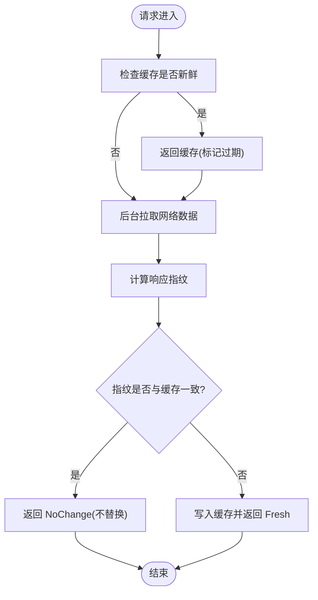
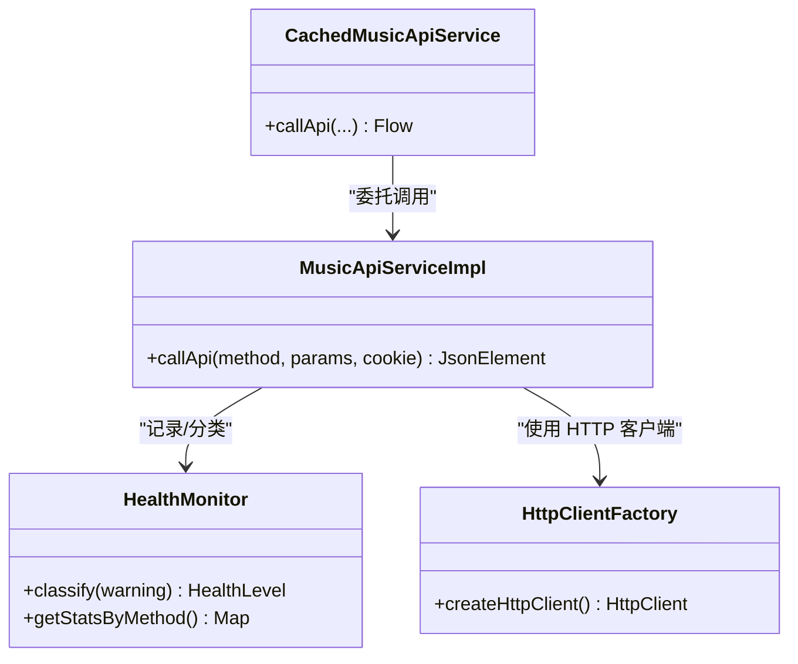
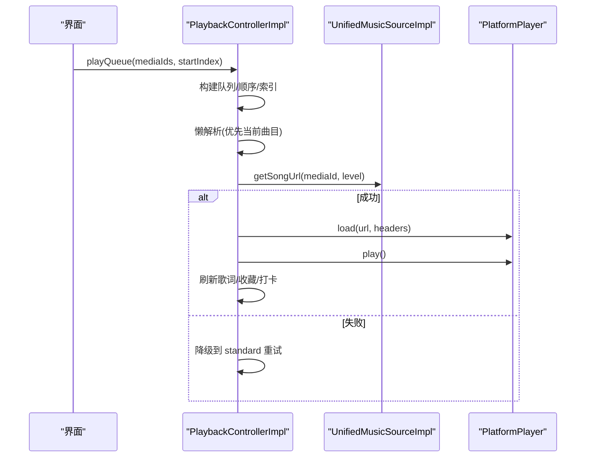
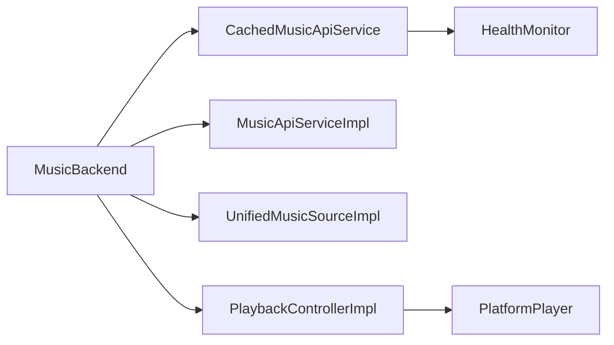

# 性能优化策略

<cite>
**本文引用的文件**
- [MusicBackend.kt](file://kmp-pro/src/commonMain/kotlin/cp/player/kmp/MusicBackend.kt)
- [CachedMusicApiService.kt](file://kmp-pro/src/commonMain/kotlin/cp/player/kmp/cache/CachedMusicApiService.kt)
- [ApiCache.kt](file://kmp-pro/src/commonMain/kotlin/cp/player/kmp/cache/ApiCache.kt)
- [CacheConfig.kt](file://kmp-pro/src/commonMain/kotlin/cp/player/kmp/cache/CacheConfig.kt)
- [CacheEntry.kt](file://kmp-pro/src/commonMain/kotlin/cp/player/kmp/cache/CacheEntry.kt)
- [Fingerprinter.kt](file://kmp-pro/src/commonMain/kotlin/cp/player/kmp/cache/Fingerprinter.kt)
- [HealthMonitor.kt](file://kmp-pro/src/commonMain/kotlin/cp/player/kmp/monitor/HealthMonitor.kt)
- [MusicApiServiceImpl.kt](file://kmp-pro/src/commonMain/kotlin/cp/player/kmp/api/MusicApiServiceImpl.kt)
- [HttpClientFactory.kt](file://kmp-pro/src/jvmMain/kotlin/cp/player/kmp/util/HttpClientFactory.kt)
- [PlaybackControllerImpl.kt](file://kmp-pro/src/commonMain/kotlin/cp/player/kmp/playback/PlaybackControllerImpl.kt)
- [PlatformPlayer.kt](file://kmp-pro/src/commonMain/kotlin/cp/player/kmp/playback/PlatformPlayer.kt)
- [UnifiedMusicSourceImpl.kt](file://kmp-pro/src/commonMain/kotlin/cp/player/kmp/music/UnifiedMusicSourceImpl.kt)
- [HealthScreen.kt](file://app/src/commonMain/kotlin/cp/player/app/ui/screen/HealthScreen.kt)
</cite>

## 目录
1. [简介](#简介)
2. [项目结构](#项目结构)
3. [核心组件](#核心组件)
4. [架构总览](#架构总览)
5. [详细组件分析](#详细组件分析)
6. [依赖关系分析](#依赖关系分析)
7. [性能考量](#性能考量)
8. [故障排查指南](#故障排查指南)
9. [结论](#结论)
10. [附录](#附录)

## 简介
本技术文档聚焦 CPPlayer-KMP 的性能优化策略，围绕多级缓存、网络层优化、播放控制器预加载与缓冲、并发与异步调度、资源管理、以及性能监控与基准测试展开。目标是为工程团队提供可落地的优化方案与量化评估方法，帮助提升内存命中率、降低网络请求、缩短首包时间、提高吞吐与稳定性。

## 项目结构
本项目采用 KMP 分层架构：
- 数据访问层：统一音乐源（UnifiedMusicSource）封装云 API 与本地源；API 服务通过 ProviderManager 路由到具体后端。
- 缓存层：进程内 LRU 缓存 + 指纹比对 + 健康监控驱动的容灾回退。
- 播放控制层：跨平台播放控制器聚合队列、歌词、收藏、音质切换、睡眠定时等能力，并驱动底层 PlatformPlayer。
- 监控层：三级健康等级（OK/WARNING/ERROR），统计最近调用、失败率、响应耗时、降级次数等。
- 网络层：Ktor + OkHttp 引擎，配置连接/读写超时与 Socket 超时。

图表来源
- [MusicBackend.kt:73-161](file://kmp-pro/src/commonMain/kotlin/cp/player/kmp/MusicBackend.kt#L73-L161)
- [CachedMusicApiService.kt:18-118](file://kmp-pro/src/commonMain/kotlin/cp/player/kmp/cache/CachedMusicApiService.kt#L18-L118)
- [ApiCache.kt:20-49](file://kmp-pro/src/commonMain/kotlin/cp/player/kmp/cache/ApiCache.kt#L20-L49)
- [Fingerprinter.kt:24-62](file://kmp-pro/src/commonMain/kotlin/cp/player/kmp/cache/Fingerprinter.kt#L24-L62)
- [HealthMonitor.kt:25-56](file://kmp-pro/src/commonMain/kotlin/cp/player/kmp/monitor/HealthMonitor.kt#L25-L56)
- [UnifiedMusicSourceImpl.kt:15-118](file://kmp-pro/src/commonMain/kotlin/cp/player/kmp/music/UnifiedMusicSourceImpl.kt#L15-L118)
- [PlaybackControllerImpl.kt:35-161](file://kmp-pro/src/commonMain/kotlin/cp/player/kmp/playback/PlaybackControllerImpl.kt#L35-L161)
- [PlatformPlayer.kt:16-31](file://kmp-pro/src/commonMain/kotlin/cp/player/kmp/playback/PlatformPlayer.kt#L16-L31)

章节来源
- [MusicBackend.kt:73-161](file://kmp-pro/src/commonMain/kotlin/cp/player/kmp/MusicBackend.kt#L73-L161)
- [CachedMusicApiService.kt:18-118](file://kmp-pro/src/commonMain/kotlin/cp/player/kmp/cache/CachedMusicApiService.kt#L18-L118)
- [ApiCache.kt:20-49](file://kmp-pro/src/commonMain/kotlin/cp/player/kmp/cache/ApiCache.kt#L20-L49)
- [Fingerprinter.kt:24-62](file://kmp-pro/src/commonMain/kotlin/cp/player/kmp/cache/Fingerprinter.kt#L24-L62)
- [HealthMonitor.kt:25-56](file://kmp-pro/src/commonMain/kotlin/cp/player/kmp/monitor/HealthMonitor.kt#L25-L56)
- [UnifiedMusicSourceImpl.kt:15-118](file://kmp-pro/src/commonMain/kotlin/cp/player/kmp/music/UnifiedMusicSourceImpl.kt#L15-L118)
- [PlaybackControllerImpl.kt:35-161](file://kmp-pro/src/commonMain/kotlin/cp/player/kmp/playback/PlaybackControllerImpl.kt#L35-L161)
- [PlatformPlayer.kt:16-31](file://kmp-pro/src/commonMain/kotlin/cp/player/kmp/playback/PlatformPlayer.kt#L16-L31)

## 核心组件
- 多级缓存与指纹比对：以进程内 LRU 为基座，结合“新鲜度阈值”与“指纹比对”，实现先返回缓存再后台拉取对比的“热路径优先”体验。
- 健康监控与多 Provider 容灾：对 API 调用进行三级分类，错误时自动尝试其他 Provider 作为回退，保障可用性。
- 播放控制器：集中处理队列、懒解析、音质切换、歌词抓取、收藏状态同步、听歌打卡与自动下一曲。
- 网络客户端：基于 Ktor+OkHttp，设置合理的连接/读写/Socket 超时，避免阻塞与资源泄漏。
- 统一音乐源：屏蔽 Provider 差异，批量获取歌曲详情与 URL，减少请求次数。

章节来源
- [CacheConfig.kt:1-16](file://kmp-pro/src/commonMain/kotlin/cp/player/kmp/cache/CacheConfig.kt#L1-L16)
- [ApiCache.kt:20-49](file://kmp-pro/src/commonMain/kotlin/cp/player/kmp/cache/ApiCache.kt#L20-L49)
- [Fingerprinter.kt:24-62](file://kmp-pro/src/commonMain/kotlin/cp/player/kmp/cache/Fingerprinter.kt#L24-L62)
- [HealthMonitor.kt:25-56](file://kmp-pro/src/commonMain/kotlin/cp/player/kmp/monitor/HealthMonitor.kt#L25-L56)
- [PlaybackControllerImpl.kt:35-161](file://kmp-pro/src/commonMain/kotlin/cp/player/kmp/playback/PlaybackControllerImpl.kt#L35-L161)
- [HttpClientFactory.kt:8-21](file://kmp-pro/src/jvmMain/kotlin/cp/player/kmp/util/HttpClientFactory.kt#L8-L21)
- [UnifiedMusicSourceImpl.kt:54-118](file://kmp-pro/src/commonMain/kotlin/cp/player/kmp/music/UnifiedMusicSourceImpl.kt#L54-L118)

## 架构总览
下图展示从 UI 到数据层与播放层的完整链路，突出缓存、健康监控与播放控制的交互。

图表来源
- [CachedMusicApiService.kt:18-118](file://kmp-pro/src/commonMain/kotlin/cp/player/kmp/cache/CachedMusicApiService.kt#L18-L118)
- [MusicApiServiceImpl.kt:576-594](file://kmp-pro/src/commonMain/kotlin/cp/player/kmp/api/MusicApiServiceImpl.kt#L576-L594)
- [HealthMonitor.kt:180-216](file://kmp-pro/src/commonMain/kotlin/cp/player/kmp/monitor/HealthMonitor.kt#L180-L216)
- [PlaybackControllerImpl.kt:496-556](file://kmp-pro/src/commonMain/kotlin/cp/player/kmp/playback/PlaybackControllerImpl.kt#L496-L556)

## 详细组件分析

### 多级缓存策略与效果
- 设计要点
  - 新鲜度阈值：超过阈值的缓存仍先返回，同时后台拉取更新，保证首屏速度。
  - 指纹比对：仅当新响应指纹与缓存不同时才替换，避免无意义的数据覆盖与 UI 抖动。
  - 容量控制：进程内 LRU 限制最大条目数，防止内存膨胀。
  - 键生成：按 providerId、method、排序后的参数与 cookie 哈希生成稳定键。
- 性能收益
  - 内存命中率提升：热点列表/推荐/搜索在短时间窗口内命中 LRU，显著降低重复解析与渲染开销。
  - 网络请求减少：指纹相同则跳过替换，减少无效写入与后续读取竞争。
  - 用户体验改善：首帧更快，滚动更流畅。
- 调优建议
  - 根据业务场景调整 freshTtlMs 与 maxEntries，平衡新鲜度与内存占用。
  - 针对大数组响应，确保指纹主数组识别准确，避免误判。

图表来源
- [CachedMusicApiService.kt:18-118](file://kmp-pro/src/commonMain/kotlin/cp/player/kmp/cache/CachedMusicApiService.kt#L18-L118)
- [Fingerprinter.kt:24-62](file://kmp-pro/src/commonMain/kotlin/cp/player/kmp/cache/Fingerprinter.kt#L24-L62)
- [ApiCache.kt:20-49](file://kmp-pro/src/commonMain/kotlin/cp/player/kmp/cache/ApiCache.kt#L20-L49)

章节来源
- [CacheConfig.kt:1-16](file://kmp-pro/src/commonMain/kotlin/cp/player/kmp/cache/CacheConfig.kt#L1-L16)
- [ApiCache.kt:20-49](file://kmp-pro/src/commonMain/kotlin/cp/player/kmp/cache/ApiCache.kt#L20-L49)
- [Fingerprinter.kt:24-62](file://kmp-pro/src/commonMain/kotlin/cp/player/kmp/cache/Fingerprinter.kt#L24-L62)
- [CachedMusicApiService.kt:18-118](file://kmp-pro/src/commonMain/kotlin/cp/player/kmp/cache/CachedMusicApiService.kt#L18-L118)

### 网络层优化：连接池、超时与容灾
- 连接池与超时
  - 使用 OkHttp 引擎，设置连接/读/写超时与 Socket 超时，避免长尾请求拖垮线程池。
  - 合理超时有助于在高延迟网络下快速失败并重试或降级。
- 请求合并
  - 统一音乐源支持批量获取歌曲详情（分块请求），减少往返次数。
- 响应压缩
  - 当前未显式启用 gzip/deflate；若服务端支持，可在 OkHttp 引擎中启用压缩以减少带宽占用。
- 多 Provider 容灾
  - 健康监控将异常响应归类为 ERROR，触发回退到其他 Provider，保障可用性。

图表来源
- [HttpClientFactory.kt:8-21](file://kmp-pro/src/jvmMain/kotlin/cp/player/kmp/util/HttpClientFactory.kt#L8-L21)
- [MusicApiServiceImpl.kt:576-594](file://kmp-pro/src/commonMain/kotlin/cp/player/kmp/api/MusicApiServiceImpl.kt#L576-L594)
- [HealthMonitor.kt:180-216](file://kmp-pro/src/commonMain/kotlin/cp/player/kmp/monitor/HealthMonitor.kt#L180-L216)
- [CachedMusicApiService.kt:18-118](file://kmp-pro/src/commonMain/kotlin/cp/player/kmp/cache/CachedMusicApiService.kt#L18-L118)

章节来源
- [HttpClientFactory.kt:8-21](file://kmp-pro/src/jvmMain/kotlin/cp/player/kmp/util/HttpClientFactory.kt#L8-L21)
- [UnifiedMusicSourceImpl.kt:54-118](file://kmp-pro/src/commonMain/kotlin/cp/player/kmp/music/UnifiedMusicSourceImpl.kt#L54-L118)
- [HealthMonitor.kt:25-56](file://kmp-pro/src/commonMain/kotlin/cp/player/kmp/monitor/HealthMonitor.kt#L25-L56)

### 播放控制器：预加载、缓冲与内存优化
- 预加载机制
  - 队列懒解析：仅在需要时解析 TrackSummary，避免一次性全量解析带来的卡顿。
  - 批量解析：按 chunked(50) 分批拉取详情，降低单次负载。
- 缓冲策略
  - 平台播放器状态流转（Idle/Buffering/Ready/Playing/Paused/Ended/Error），控制器将其折叠进 UI 状态，减少频繁刷新。
  - 播放失败自动降级到 standard 音质重试，提升兼容性。
- 内存优化
  - 队列项 Entry 仅保存 mediaId，summary 延迟填充。
  - 协程 Job 管理：加载、歌词、打卡、收藏、睡眠定时等任务均受控于生命周期，释放时统一取消。
- 关键流程

图表来源
- [PlaybackControllerImpl.kt:144-172](file://kmp-pro/src/commonMain/kotlin/cp/player/kmp/playback/PlaybackControllerImpl.kt#L144-L172)
- [PlaybackControllerImpl.kt:496-556](file://kmp-pro/src/commonMain/kotlin/cp/player/kmp/playback/PlaybackControllerImpl.kt#L496-L556)
- [UnifiedMusicSourceImpl.kt:100-118](file://kmp-pro/src/commonMain/kotlin/cp/player/kmp/music/UnifiedMusicSourceImpl.kt#L100-L118)
- [PlatformPlayer.kt:23-31](file://kmp-pro/src/commonMain/kotlin/cp/player/kmp/playback/PlatformPlayer.kt#L23-L31)

章节来源
- [PlaybackControllerImpl.kt:144-172](file://kmp-pro/src/commonMain/kotlin/cp/player/kmp/playback/PlaybackControllerImpl.kt#L144-L172)
- [PlaybackControllerImpl.kt:496-556](file://kmp-pro/src/commonMain/kotlin/cp/player/kmp/playback/PlaybackControllerImpl.kt#L496-L556)
- [PlatformPlayer.kt:23-31](file://kmp-pro/src/commonMain/kotlin/cp/player/kmp/playback/PlatformPlayer.kt#L23-L31)

### 并发处理、异步调度与资源管理
- 并发模型
  - 使用协程与 StateFlow 进行状态广播，避免阻塞主线程。
  - 队列解析与歌词抓取等任务在独立 Job 中执行，支持取消与复用。
- 资源管理
  - release 时统一取消所有 Job 并释放播放器资源，防止内存泄漏。
  - 收藏列表只加载一次，避免重复请求。
- 最佳实践
  - 对长时间任务使用 SupervisorJob 隔离异常。
  - 对 UI 相关状态使用不可变对象（StateFlow）减少竞态。

章节来源
- [PlaybackControllerImpl.kt:487-491](file://kmp-pro/src/commonMain/kotlin/cp/player/kmp/playback/PlaybackControllerImpl.kt#L487-L491)
- [PlaybackControllerImpl.kt:319-401](file://kmp-pro/src/commonMain/kotlin/cp/player/kmp/playback/PlaybackControllerImpl.kt#L319-L401)
- [MusicBackend.kt:142-161](file://kmp-pro/src/commonMain/kotlin/cp/player/kmp/MusicBackend.kt#L142-L161)

## 依赖关系分析
- 耦合与内聚
  - MusicBackend 作为唯一入口，内聚 Provider、模块、API、缓存与播放控制器，降低外部耦合。
  - 缓存层与 API 层解耦，通过接口与配置注入，便于替换实现。
- 直接/间接依赖
  - CachedMusicApiService 依赖 MusicApiServiceImpl、HealthMonitor、ProviderManager。
  - PlaybackControllerImpl 依赖 UnifiedMusicSourceImpl、MusicApiServiceImpl、PlatformPlayer。
- 循环依赖
  - 未见明显循环依赖；各层职责清晰。
- 外部依赖
  - Ktor + OkHttp 用于网络；协程用于异步；序列化用于 JSON。

图表来源
- [MusicBackend.kt:73-161](file://kmp-pro/src/commonMain/kotlin/cp/player/kmp/MusicBackend.kt#L73-L161)
- [CachedMusicApiService.kt:18-118](file://kmp-pro/src/commonMain/kotlin/cp/player/kmp/cache/CachedMusicApiService.kt#L18-L118)
- [HealthMonitor.kt:25-56](file://kmp-pro/src/commonMain/kotlin/cp/player/kmp/monitor/HealthMonitor.kt#L25-L56)
- [UnifiedMusicSourceImpl.kt:15-118](file://kmp-pro/src/commonMain/kotlin/cp/player/kmp/music/UnifiedMusicSourceImpl.kt#L15-L118)
- [PlaybackControllerImpl.kt:35-161](file://kmp-pro/src/commonMain/kotlin/cp/player/kmp/playback/PlaybackControllerImpl.kt#L35-L161)
- [PlatformPlayer.kt:16-31](file://kmp-pro/src/commonMain/kotlin/cp/player/kmp/playback/PlatformPlayer.kt#L16-L31)

章节来源
- [MusicBackend.kt:73-161](file://kmp-pro/src/commonMain/kotlin/cp/player/kmp/MusicBackend.kt#L73-L161)
- [CachedMusicApiService.kt:18-118](file://kmp-pro/src/commonMain/kotlin/cp/player/kmp/cache/CachedMusicApiService.kt#L18-L118)
- [HealthMonitor.kt:25-56](file://kmp-pro/src/commonMain/kotlin/cp/player/kmp/monitor/HealthMonitor.kt#L25-L56)
- [UnifiedMusicSourceImpl.kt:15-118](file://kmp-pro/src/commonMain/kotlin/cp/player/kmp/music/UnifiedMusicSourceImpl.kt#L15-L118)
- [PlaybackControllerImpl.kt:35-161](file://kmp-pro/src/commonMain/kotlin/cp/player/kmp/playback/PlaybackControllerImpl.kt#L35-L161)
- [PlatformPlayer.kt:16-31](file://kmp-pro/src/commonMain/kotlin/cp/player/kmp/playback/PlatformPlayer.kt#L16-L31)

## 性能考量
- 关键性能指标（KPI）定义
  - 响应时间：API 调用平均耗时与 P95 耗时（HealthMonitor 已统计 avgResponseMs、p95ResponseMs）。
  - 吞吐量：单位时间内成功处理的请求数（可通过 getStatsByMethod 汇总）。
  - 资源利用率：CPU/内存峰值与 GC 频率（需配合系统工具观测）。
  - 缓存命中率：缓存命中次数 / 总请求次数（可通过埋点统计）。
  - 网络成功率：成功请求占比（successCount / totalCalls）。
  - 降级率：回退次数占比（fallbackCount / totalCalls）。
- 基准测试方法
  - 压测脚本：模拟高频列表/搜索/播放 URL 请求，测量首包时间与 P95。
  - 缓存开关对比：enableCache=true/false 对比命中率与网络请求数。
  - 指纹比对影响：关闭指纹比对观察数据替换频率与 UI 抖动。
  - 音质降级：高音质失败率与标准音质成功率对比。
- 优化热点识别
  - 通过 HealthMonitor 的方法级统计定位慢接口与错误热点。
  - 播放控制器日志关注加载失败与降级路径。
  - 队列解析耗时与批量大小（chunked 大小）调优。

章节来源
- [HealthMonitor.kt:180-216](file://kmp-pro/src/commonMain/kotlin/cp/player/kmp/monitor/HealthMonitor.kt#L180-L216)
- [HealthMonitor.kt:235-289](file://kmp-pro/src/commonMain/kotlin/cp/player/kmp/monitor/HealthMonitor.kt#L235-L289)
- [PlaybackControllerImpl.kt:496-556](file://kmp-pro/src/commonMain/kotlin/cp/player/kmp/playback/PlaybackControllerImpl.kt#L496-L556)

## 故障排查指南
- 健康监控面板
  - 使用 HealthScreen 查看整体健康等级、调用记录过滤（仅异常/警告）、统计卡片。
- 常见问题定位
  - 接口报错：查看 ResponseWarning 类型（缺失字段、格式异常、不支持等）。
  - 缓存不更新：检查指纹主数组识别是否正确，确认 freshTtlMs 与缓存键生成。
  - 播放失败：关注音质降级路径，确认 Cookie 注入与 URL 有效性。
- 调试步骤
  - 开启 HealthMonitor 统计，导出方法级指标。
  - 在 CachedMusicApiService 中打印指纹变化与回退决策。
  - 在 PlaybackControllerImpl 中记录加载失败与降级重试结果。

章节来源
- [HealthScreen.kt:85-114](file://app/src/commonMain/kotlin/cp/player/app/ui/screen/HealthScreen.kt#L85-L114)
- [MusicApiServiceImpl.kt:576-594](file://kmp-pro/src/commonMain/kotlin/cp/player/kmp/api/MusicApiServiceImpl.kt#L576-L594)
- [CachedMusicApiService.kt:18-118](file://kmp-pro/src/commonMain/kotlin/cp/player/kmp/cache/CachedMusicApiService.kt#L18-L118)
- [PlaybackControllerImpl.kt:496-556](file://kmp-pro/src/commonMain/kotlin/cp/player/kmp/playback/PlaybackControllerImpl.kt#L496-L556)

## 结论
CPPlayer-KMP 通过多级缓存、指纹比对、健康监控与多 Provider 容灾，显著提升了首屏速度与稳定性；播放控制器采用懒解析与批量拉取，降低内存与网络压力；网络层合理超时与潜在压缩优化进一步改善吞吐与可靠性。建议持续完善监控埋点、压测回归与调参闭环，确保在不同网络与设备环境下保持优良体验。

## 附录
- 配置建议
  - CacheConfig.freshTtlMs：根据业务更新频率调整，常见 5 分钟。
  - CacheConfig.maxEntries：根据内存预算调整，常见 64。
  - 网络超时：连接 10s、读/写 30s、Socket 30s，可根据网络环境微调。
- 扩展方向
  - 启用响应压缩（gzip/deflate）以降低带宽。
  - 引入持久化缓存（跨重启保留热点数据）。
  - 增强指纹算法以适配更多响应结构。