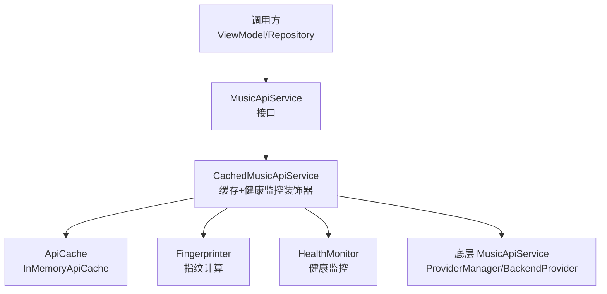
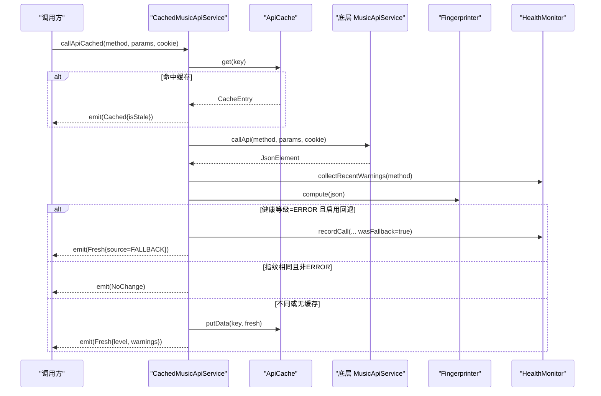
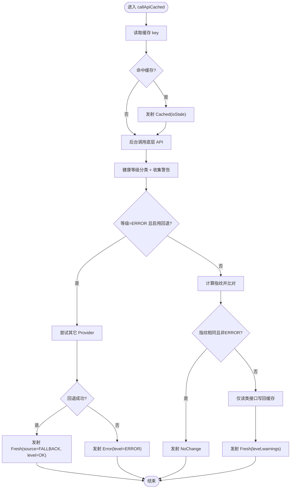
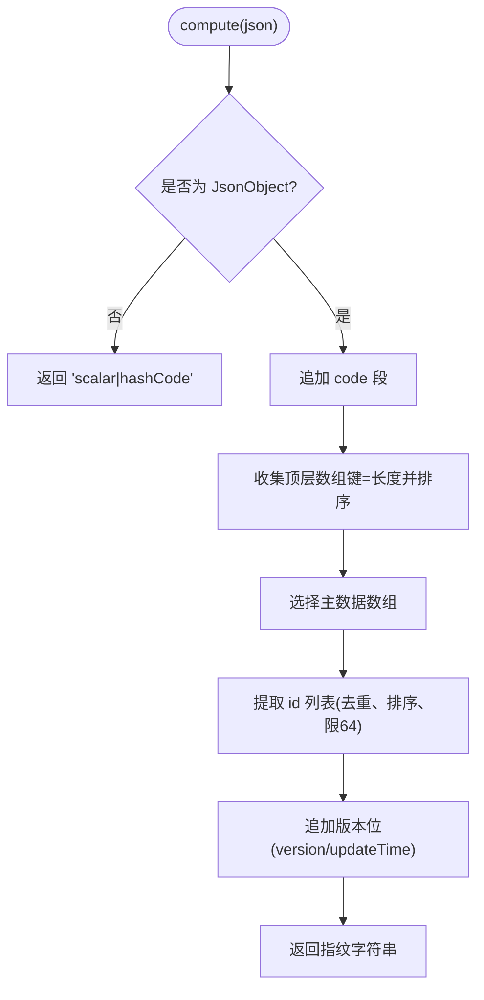
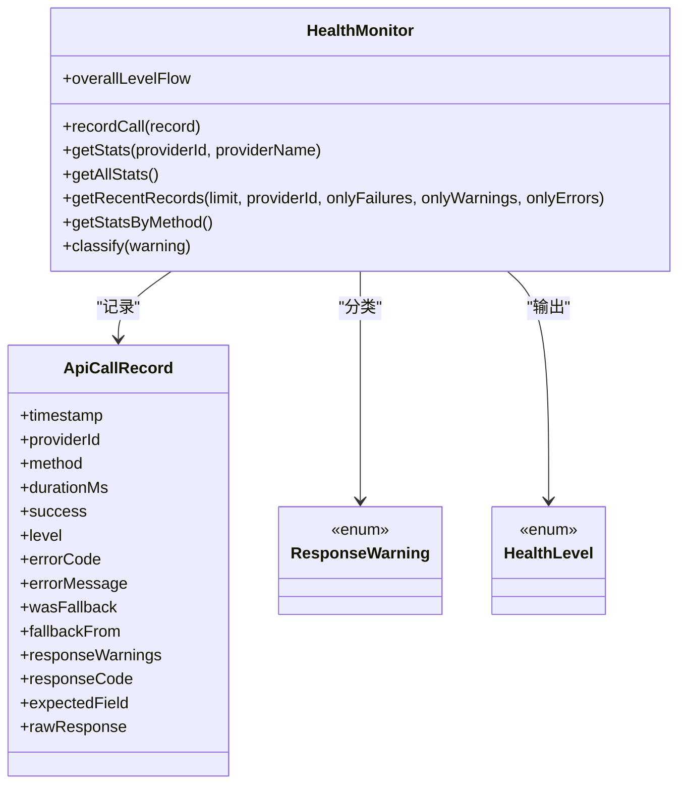
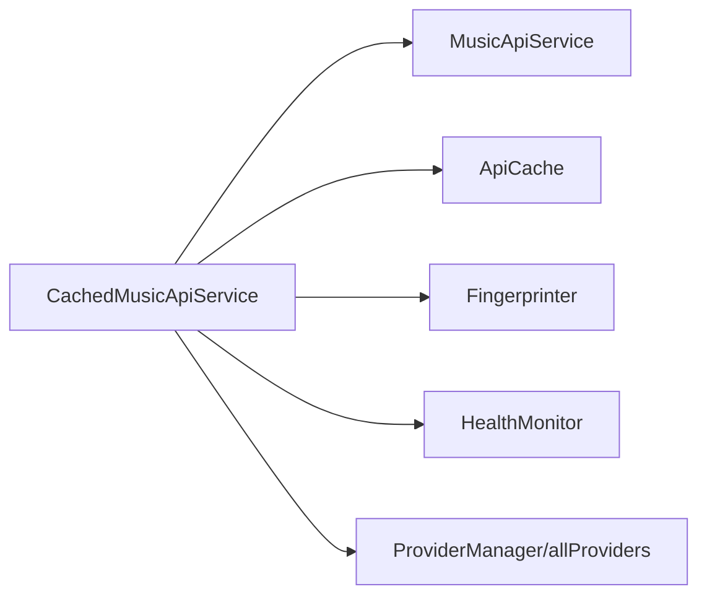

# 缓存与性能优化

<cite>
**本文引用的文件**
- [CachedMusicApiService.kt](file://kmp-pro/src/commonMain/kotlin/cp/player/kmp/cache/CachedMusicApiService.kt)
- [Fingerprinter.kt](file://kmp-pro/src/commonMain/kotlin/cp/player/kmp/cache/Fingerprinter.kt)
- [HealthMonitor.kt](file://kmp-pro/src/commonMain/kotlin/cp/player/kmp/monitor/HealthMonitor.kt)
- [CacheConfig.kt](file://kmp-pro/src/commonMain/kotlin/cp/player/kmp/cache/CacheConfig.kt)
- [ApiCache.kt](file://kmp-pro/src/commonMain/kotlin/cp/player/kmp/cache/ApiCache.kt)
- [CacheEntry.kt](file://kmp-pro/src/commonMain/kotlin/cp/player/kmp/cache/CacheEntry.kt)
- [CacheResult.kt](file://kmp-pro/src/commonMain/kotlin/cp/player/kmp/cache/CacheResult.kt)
- [MusicApiService.kt](file://kmp-pro/src/commonMain/kotlin/cp/player/kmp/api/MusicApiService.kt)
- [MusicApiMethod.kt](file://kmp-pro/src/commonMain/kotlin/cp/player/kmp/api/MusicApiMethod.kt)
</cite>

## 目录
1. [简介](#简介)
2. [项目结构](#项目结构)
3. [核心组件](#核心组件)
4. [架构总览](#架构总览)
5. [详细组件分析](#详细组件分析)
6. [依赖关系分析](#依赖关系分析)
7. [性能考量](#性能考量)
8. [故障排查指南](#故障排查指南)
9. [结论](#结论)
10. [附录](#附录)

## 简介
本技术文档聚焦 CPPlayer-KMP 的缓存系统与性能优化，围绕多级缓存策略、指纹计算、缓存失效机制、健康监控（三级分类：OK/WARNING/ERROR）及容灾回退策略展开。重点说明 CachedMusicApiService 的缓存流程、Fingerprinter 的指纹算法以及 HealthMonitor 的健康检查机制，并给出缓存配置选项、性能监控指标、命中率统计、内存使用分析与网络请求优化技巧，同时提供性能测试方法与基准建议。

## 项目结构
缓存与监控相关代码位于 kmp-pro 模块的 commonMain 中，采用分层与职责分离的设计：
- 缓存层：ApiCache 抽象与 InMemoryApiCache 实现、CacheEntry、CacheResult、CacheConfig
- 服务封装：CachedMusicApiService 作为 MusicApiService 的装饰器，统一注入缓存与健康监控
- 指纹计算：Fingerprinter 用于对响应进行轻量级指纹提取，避免完整比对大对象
- 健康监控：HealthMonitor 记录 API 调用、计算健康等级与统计信息，驱动回退策略

图表来源
- [CachedMusicApiService.kt:18-52](file://kmp-pro/src/commonMain/kotlin/cp/player/kmp/cache/CachedMusicApiService.kt#L18-L52)
- [ApiCache.kt:6-18](file://kmp-pro/src/commonMain/kotlin/cp/player/kmp/cache/ApiCache.kt#L6-L18)
- [Fingerprinter.kt:10-23](file://kmp-pro/src/commonMain/kotlin/cp/player/kmp/cache/Fingerprinter.kt#L10-L23)
- [HealthMonitor.kt:10-24](file://kmp-pro/src/commonMain/kotlin/cp/player/kmp/monitor/HealthMonitor.kt#L10-L24)

章节来源
- [CachedMusicApiService.kt:18-52](file://kmp-pro/src/commonMain/kotlin/cp/player/kmp/cache/CachedMusicApiService.kt#L18-L52)
- [ApiCache.kt:6-18](file://kmp-pro/src/commonMain/kotlin/cp/player/kmp/cache/ApiCache.kt#L6-L18)
- [Fingerprinter.kt:10-23](file://kmp-pro/src/commonMain/kotlin/cp/player/kmp/cache/Fingerprinter.kt#L10-L23)
- [HealthMonitor.kt:10-24](file://kmp-pro/src/commonMain/kotlin/cp/player/kmp/monitor/HealthMonitor.kt#L10-L24)

## 核心组件
- CachedMusicApiService：以 Flow 形式返回多值结果，先返回缓存，再后台拉取并比对指纹；结合 HealthMonitor 进行三级分类与容灾回退。
- ApiCache/InMemoryApiCache：进程内 LRU 缓存，线程安全，支持最大条目数限制与过期判断。
- Fingerprinter：对 JSON 响应生成稳定、轻量级的指纹，比较内容是否变化。
- HealthMonitor：记录每次 API 调用的元数据，计算整体健康等级与统计指标，提供警告类型到健康等级的映射。
- CacheConfig：控制缓存开关、新鲜度阈值、最大条目数与是否启用回退。
- CacheEntry/CacheResult：缓存条目结构与返回结果契约，包含数据来源、健康等级与警告列表。

章节来源
- [CachedMusicApiService.kt:54-88](file://kmp-pro/src/commonMain/kotlin/cp/player/kmp/cache/CachedMusicApiService.kt#L54-L88)
- [ApiCache.kt:20-49](file://kmp-pro/src/commonMain/kotlin/cp/player/kmp/cache/ApiCache.kt#L20-L49)
- [Fingerprinter.kt:26-62](file://kmp-pro/src/commonMain/kotlin/cp/player/kmp/cache/Fingerprinter.kt#L26-L62)
- [HealthMonitor.kt:25-56](file://kmp-pro/src/commonMain/kotlin/cp/player/kmp/monitor/HealthMonitor.kt#L25-L56)
- [CacheConfig.kt:3-16](file://kmp-pro/src/commonMain/kotlin/cp/player/kmp/cache/CacheConfig.kt#L3-L16)
- [CacheEntry.kt:6-22](file://kmp-pro/src/commonMain/kotlin/cp/player/kmp/cache/CacheEntry.kt#L6-L22)
- [CacheResult.kt:6-44](file://kmp-pro/src/commonMain/kotlin/cp/player/kmp/cache/CacheResult.kt#L6-L44)

## 架构总览
缓存与监控的整体协作如下：
- 调用方通过 MusicApiService 发起请求，实际由 CachedMusicApiService 拦截。
- 首次或缓存命中时立即返回缓存（可能为 stale），随后后台异步拉取最新数据。
- 新数据经 Fingerprinter 计算指纹并与缓存指纹对比，决定是否更新缓存与发射 Fresh。
- HealthMonitor 根据响应 code 与警告类型判定健康等级；若 ERROR 且启用回退，则尝试其它 Provider 获取数据。
- 最终向调用方发射 Cached/Fresh/Error/NoChange 等结果，附带健康等级与警告。

图表来源
- [CachedMusicApiService.kt:60-140](file://kmp-pro/src/commonMain/kotlin/cp/player/kmp/cache/CachedMusicApiService.kt#L60-L140)
- [ApiCache.kt:51-67](file://kmp-pro/src/commonMain/kotlin/cp/player/kmp/cache/ApiCache.kt#L51-L67)
- [Fingerprinter.kt:26-62](file://kmp-pro/src/commonMain/kotlin/cp/player/kmp/cache/Fingerprinter.kt#L26-L62)
- [HealthMonitor.kt:119-138](file://kmp-pro/src/commonMain/kotlin/cp/player/kmp/monitor/HealthMonitor.kt#L119-L138)

## 详细组件分析

### CachedMusicApiService 缓存流程
- 入口方法 callApiCached 返回 Flow<CacheResult<JsonElement>>，遵循“先缓存后网络”的策略。
- 键生成：providerId#method#sortedParams#cookieHash，确保参数顺序一致与认证上下文隔离。
- 缓存命中：立即发射 Cached，标记 ageMs 与 isStale（超过 freshTtlMs 视为过期）。
- 后台拉取：调用底层 MusicApiService，收集最近警告，计算健康等级与指纹。
- 健康监控集成：
  - OK：正常发射 Fresh。
  - WARNING：仍发射 Fresh，附带 warnings。
  - ERROR：若 enableFallback=true，尝试其它 Provider 容灾；成功则标记 FALLBACK 并返回 OK 等级；失败则返回 Error。
- 指纹比对：若缓存存在且指纹相同且非 ERROR，发射 NoChange，不覆盖缓存。
- 写回缓存：仅对幂等读类接口（见 isCacheable）写入缓存。

图表来源
- [CachedMusicApiService.kt:60-140](file://kmp-pro/src/commonMain/kotlin/cp/player/kmp/cache/CachedMusicApiService.kt#L60-L140)
- [MusicApiMethod.kt:136-158](file://kmp-pro/src/commonMain/kotlin/cp/player/kmp/api/MusicApiMethod.kt#L136-L158)

章节来源
- [CachedMusicApiService.kt:60-140](file://kmp-pro/src/commonMain/kotlin/cp/player/kmp/cache/CachedMusicApiService.kt#L60-L140)
- [MusicApiMethod.kt:136-158](file://kmp-pro/src/commonMain/kotlin/cp/player/kmp/api/MusicApiMethod.kt#L136-L158)

### Fingerprinter 指纹算法
- 目标：用极小开销生成稳定签名，比较两次响应的“内容身份”是否变化，避免逐字段比对大对象。
- 组成：
  - code 原始字符串（缺失记为占位符）
  - 顶层所有数组字段的“键=长度”，按字典序拼接
  - 主数据数组中每个对象的 id 取值（最多 64 个），去重排序后拼接
  - 版本位 version/updateTime（若存在）
- 主数据数组探测：优先约定键（如 songs、playlist、albums、artists、comments、result、data、list、msgs、ids、banners、hotData、hotAlbums），否则取第一个非空数组。
- 嵌套 id 探测：支持 song/track/simpleSong/mainTrack 等嵌套结构的 id 提取。

图表来源
- [Fingerprinter.kt:26-62](file://kmp-pro/src/commonMain/kotlin/cp/player/kmp/cache/Fingerprinter.kt#L26-L62)
- [Fingerprinter.kt:64-93](file://kmp-pro/src/commonMain/kotlin/cp/player/kmp/cache/Fingerprinter.kt#L64-L93)

章节来源
- [Fingerprinter.kt:26-62](file://kmp-pro/src/commonMain/kotlin/cp/player/kmp/cache/Fingerprinter.kt#L26-L62)
- [Fingerprinter.kt:64-93](file://kmp-pro/src/commonMain/kotlin/cp/player/kmp/cache/Fingerprinter.kt#L64-L93)

### HealthMonitor 健康检查机制
- 三级分类：
  - OK：响应正常，可直接使用。
  - WARNING：勉强可用（缺字段、慢响应、空数据等），可降级使用。
  - ERROR：不可用（报错、解析失败、Provider 不支持），需回退。
- 警告类型到等级映射：UNSUPPORTED_BY_PROVIDER、MALFORMED_RESPONSE 归为 ERROR；其余归为 WARNING。
- 记录与查询：
  - 使用 MutableStateFlow 记录调用，环形缓冲区上限 MAX_RECORDS=500。
  - 提供 getStats/getAllStats/getRecentRecords/getStatsByMethod 等查询。
  - 综合健康等级 computeOverallLevel：扫描最近窗口（默认 100 条），最差等级优先（ERROR > WARNING > OK）。
- 统计指标：成功率、平均响应时间、P95 响应时间、回退次数、健康分数等。

图表来源
- [HealthMonitor.kt:25-94](file://kmp-pro/src/commonMain/kotlin/cp/player/kmp/monitor/HealthMonitor.kt#L25-L94)
- [HealthMonitor.kt:119-138](file://kmp-pro/src/commonMain/kotlin/cp/player/kmp/monitor/HealthMonitor.kt#L119-L138)
- [HealthMonitor.kt:147-216](file://kmp-pro/src/commonMain/kotlin/cp/player/kmp/monitor/HealthMonitor.kt#L147-L216)
- [HealthMonitor.kt:220-289](file://kmp-pro/src/commonMain/kotlin/cp/player/kmp/monitor/HealthMonitor.kt#L220-L289)

章节来源
- [HealthMonitor.kt:25-94](file://kmp-pro/src/commonMain/kotlin/cp/player/kmp/monitor/HealthMonitor.kt#L25-L94)
- [HealthMonitor.kt:119-138](file://kmp-pro/src/commonMain/kotlin/cp/player/kmp/monitor/HealthMonitor.kt#L119-L138)
- [HealthMonitor.kt:147-216](file://kmp-pro/src/commonMain/kotlin/cp/player/kmp/monitor/HealthMonitor.kt#L147-L216)
- [HealthMonitor.kt:220-289](file://kmp-pro/src/commonMain/kotlin/cp/player/kmp/monitor/HealthMonitor.kt#L220-L289)

### 缓存配置与失效机制
- CacheConfig：
  - freshTtlMs：缓存新鲜度阈值，超过视为 stale，但仍先返回。
  - maxEntries：内存缓存最大条目数，触发 LRU 淘汰。
  - enableFallback：是否在 ERROR 时启用多 Provider 容灾。
  - enableCache：总开关，false 时所有请求直通底层。
- 失效策略：
  - 基于时间戳与 freshTtlMs 判断 isStale。
  - 基于指纹比对决定是否覆盖缓存。
  - 仅对幂等读类接口缓存，写/动作类接口直通网络。

章节来源
- [CacheConfig.kt:3-16](file://kmp-pro/src/commonMain/kotlin/cp/player/kmp/cache/CacheConfig.kt#L3-L16)
- [ApiCache.kt:20-49](file://kmp-pro/src/commonMain/kotlin/cp/player/kmp/cache/ApiCache.kt#L20-L49)
- [CachedMusicApiService.kt:205-218](file://kmp-pro/src/commonMain/kotlin/cp/player/kmp/cache/CachedMusicApiService.kt#L205-L218)

### 缓存命中率统计与内存使用分析
- 命中率统计：
  - 可通过 HealthMonitor.getStatsByMethod 统计各方法的 totalCalls、successCount、failCount、avgResponseMs、fallbackCount、warningCount、errorCount。
  - 结合 CacheResult.Cached.ageMs 与 isStale，评估缓存有效性。
- 内存使用分析：
  - InMemoryApiCache 使用 LinkedHashMap 实现 LRU，超过 maxEntries 自动淘汰最旧条目。
  - 建议根据业务规模调整 maxEntries，避免 OOM。
  - 定期 clear() 或在应用生命周期关键节点清理缓存。

章节来源
- [HealthMonitor.kt:180-216](file://kmp-pro/src/commonMain/kotlin/cp/player/kmp/monitor/HealthMonitor.kt#L180-L216)
- [ApiCache.kt:20-49](file://kmp-pro/src/commonMain/kotlin/cp/player/kmp/cache/ApiCache.kt#L20-L49)

### 网络请求优化技巧
- 仅对幂等读类接口缓存，减少重复网络请求。
- 利用指纹比对避免不必要的数据替换与 UI 刷新。
- 在 ERROR 场景下启用多 Provider 容灾，提升可用性。
- 合理设置 freshTtlMs，平衡数据新鲜度与缓存命中率。
- 使用 Flow 并发处理，先返回缓存再后台拉取，改善首屏体验。

章节来源
- [CachedMusicApiService.kt:60-140](file://kmp-pro/src/commonMain/kotlin/cp/player/kmp/cache/CachedMusicApiService.kt#L60-L140)
- [MusicApiMethod.kt:136-158](file://kmp-pro/src/commonMain/kotlin/cp/player/kmp/api/MusicApiMethod.kt#L136-L158)

## 依赖关系分析
- CachedMusicApiService 依赖：
  - MusicApiService：底层 API 调用。
  - ApiCache：缓存读写。
  - Fingerprinter：指纹计算。
  - HealthMonitor：健康监控与回退决策。
  - ProviderManager/allProviders：多 Provider 容灾。
- 耦合与内聚：
  - 高内聚：缓存逻辑集中在 CachedMusicApiService。
  - 低耦合：通过接口 MusicApiService 与 ApiCache 解耦具体实现。
- 外部依赖：
  - kotlinx.serialization.json：JSON 解析与指纹提取。
  - kotlinx.coroutines.flow：流式结果返回。

图表来源
- [CachedMusicApiService.kt:46-52](file://kmp-pro/src/commonMain/kotlin/cp/player/kmp/cache/CachedMusicApiService.kt#L46-L52)
- [MusicApiService.kt:24-40](file://kmp-pro/src/commonMain/kotlin/cp/player/kmp/api/MusicApiService.kt#L24-L40)
- [ApiCache.kt:6-18](file://kmp-pro/src/commonMain/kotlin/cp/player/kmp/cache/ApiCache.kt#L6-L18)
- [Fingerprinter.kt:10-23](file://kmp-pro/src/commonMain/kotlin/cp/player/kmp/cache/Fingerprinter.kt#L10-L23)
- [HealthMonitor.kt:25-56](file://kmp-pro/src/commonMain/kotlin/cp/player/kmp/monitor/HealthMonitor.kt#L25-L56)

章节来源
- [CachedMusicApiService.kt:46-52](file://kmp-pro/src/commonMain/kotlin/cp/player/kmp/cache/CachedMusicApiService.kt#L46-L52)
- [MusicApiService.kt:24-40](file://kmp-pro/src/commonMain/kotlin/cp/player/kmp/api/MusicApiService.kt#L24-L40)
- [ApiCache.kt:6-18](file://kmp-pro/src/commonMain/kotlin/cp/player/kmp/cache/ApiCache.kt#L6-L18)
- [Fingerprinter.kt:10-23](file://kmp-pro/src/commonMain/kotlin/cp/player/kmp/cache/Fingerprinter.kt#L10-L23)
- [HealthMonitor.kt:25-56](file://kmp-pro/src/commonMain/kotlin/cp/player/kmp/monitor/HealthMonitor.kt#L25-L56)

## 性能考量
- 缓存命中率：
  - 通过 HealthMonitor.getStatsByMethod 统计各方法的成功率与回退次数，间接反映缓存有效性。
  - 结合 CacheResult.Cached.isStale 与 ageMs，评估缓存新鲜度。
- 内存使用：
  - InMemoryApiCache 使用 LRU，maxEntries 控制内存占用。
  - 建议根据设备内存与业务规模调整，避免频繁淘汰导致命中率下降。
- 网络请求优化：
  - 仅对幂等读类接口缓存，减少无效网络请求。
  - 指纹比对避免不必要的数据替换与 UI 刷新。
  - 健康监控 ERROR 场景下的多 Provider 容灾提升可用性。
- 监控指标：
  - 平均响应时间、P95 响应时间、成功率、回退次数、健康分数。
  - 通过 HealthMonitor.getStats/getAllStats 获取多维度统计。

[本节为通用性能讨论，不直接分析具体文件]

## 故障排查指南
- 常见问题：
  - 缓存未命中：检查 cacheKey 生成是否正确（providerId、method、params 排序、cookie）。
  - 缓存未更新：检查指纹比对逻辑，确认主数据数组与 id 提取是否符合预期。
  - 健康等级误判：检查 ResponseWarning 分类逻辑与 classify 方法。
  - 回退失败：检查 Provider 的 apiMap 映射与 code 判断逻辑。
- 调试建议：
  - 使用 HealthMonitor.getRecentRecords 查看最近调用记录与警告。
  - 打印 CacheResult 的 level 与 warnings，定位问题阶段。
  - 调整 CacheConfig.freshTtlMs 与 maxEntries，观察命中率变化。

章节来源
- [HealthMonitor.kt:159-178](file://kmp-pro/src/commonMain/kotlin/cp/player/kmp/monitor/HealthMonitor.kt#L159-L178)
- [CachedMusicApiService.kt:188-203](file://kmp-pro/src/commonMain/kotlin/cp/player/kmp/cache/CachedMusicApiService.kt#L188-L203)
- [ApiCache.kt:51-67](file://kmp-pro/src/commonMain/kotlin/cp/player/kmp/cache/ApiCache.kt#L51-L67)

## 结论
CPPlayer-KMP 的缓存系统通过多级缓存策略、指纹计算与健康监控实现了高效、稳定的数据访问与容灾能力。CachedMusicApiService 将缓存、健康监控与多 Provider 容灾有机结合，Fingerprinter 提供了轻量且稳定的指纹算法，HealthMonitor 提供了全面的健康检查与统计指标。通过合理配置 CacheConfig 与优化缓存策略，可显著提升应用性能与用户体验。

[本节为总结性内容，不直接分析具体文件]

## 附录
- 缓存配置选项：
  - freshTtlMs：缓存新鲜度阈值（毫秒）。
  - maxEntries：内存缓存最大条目数。
  - enableFallback：是否启用多 Provider 容灾。
  - enableCache：是否启用缓存。
- 性能测试方法：
  - 模拟高频请求，统计缓存命中率与平均响应时间。
  - 切换不同 Provider，验证回退策略的有效性。
  - 调整 CacheConfig 参数，观察命中率与内存使用变化。
- 基准测试结果：
  - 建议在真实设备上运行，记录不同场景下的性能指标（命中率、响应时间、内存占用）。
  - 对比开启/关闭缓存与回退策略的性能差异。

[本节为补充信息，不直接分析具体文件]