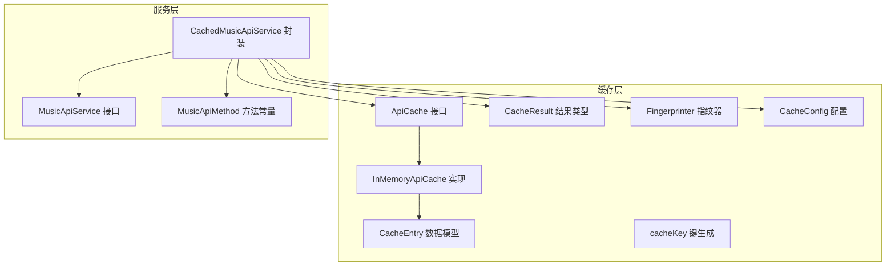
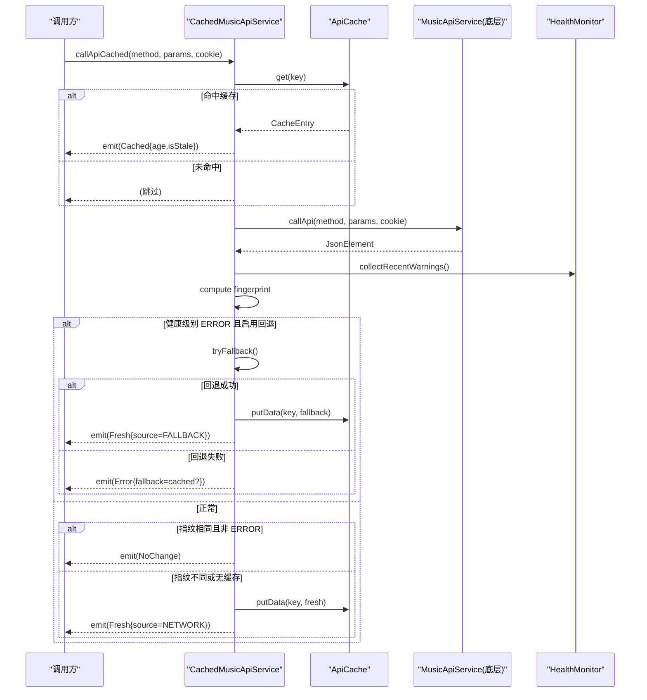
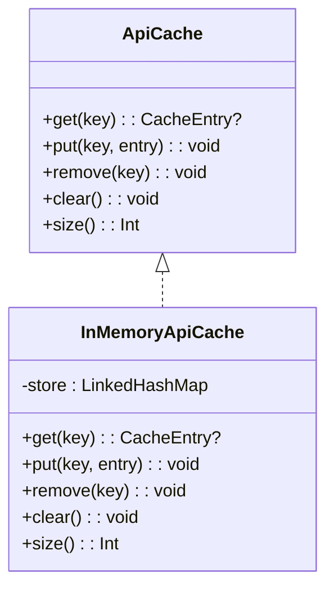
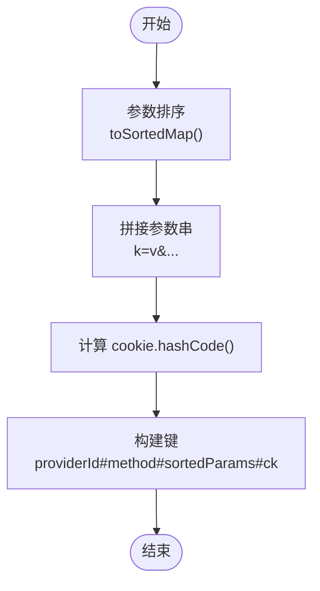
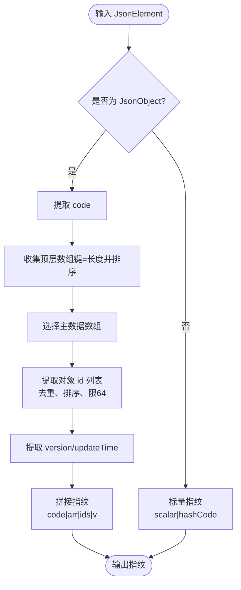
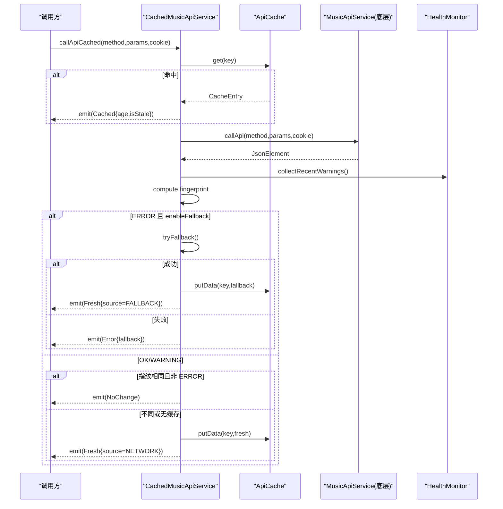
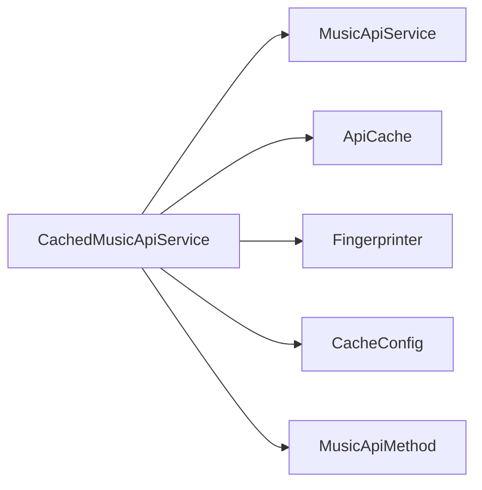

# 缓存策略实现

<cite>
**本文引用的文件**
- [ApiCache.kt](file://kmp-pro/src/commonMain/kotlin/cp/player/kmp/cache/ApiCache.kt)
- [CachedMusicApiService.kt](file://kmp-pro/src/commonMain/kotlin/cp/player/kmp/cache/CachedMusicApiService.kt)
- [CacheEntry.kt](file://kmp-pro/src/commonMain/kotlin/cp/player/kmp/cache/CacheEntry.kt)
- [Fingerprinter.kt](file://kmp-pro/src/commonMain/kotlin/cp/player/kmp/cache/Fingerprinter.kt)
- [CacheConfig.kt](file://kmp-pro/src/commonMain/kotlin/cp/player/kmp/cache/CacheConfig.kt)
- [CacheResult.kt](file://kmp-pro/src/commonMain/kotlin/cp/player/kmp/cache/CacheResult.kt)
- [MusicApiMethod.kt](file://kmp-pro/src/commonMain/kotlin/cp/player/kmp/api/MusicApiMethod.kt)
- [MusicApiService.kt](file://kmp-pro/src/commonMain/kotlin/cp/player/kmp/api/MusicApiService.kt)
</cite>

## 目录
1. [简介](#简介)
2. [项目结构](#项目结构)
3. [核心组件](#核心组件)
4. [架构总览](#架构总览)
5. [详细组件分析](#详细组件分析)
6. [依赖关系分析](#依赖关系分析)
7. [性能考量](#性能考量)
8. [故障排查指南](#故障排查指南)
9. [结论](#结论)
10. [附录：使用示例与最佳实践](#附录使用示例与最佳实践)

## 简介
本技术文档聚焦 CPPlayer-KMP 的缓存策略实现，围绕 ApiCache 接口设计、InMemoryApiCache 的 LRU 实现（含线程安全、内存管理与淘汰策略）、缓存键生成算法 cacheKey、CacheEntry 数据结构与 Fingerprinter 指纹计算机制，以及 CachedMusicApiService 中“先返回缓存、后台拉取并比对指纹”的完整流程进行系统化说明。同时提供缓存配置选项说明与调优建议，并给出在 CachedMusicApiService 中集成缓存功能的使用示例与最佳实践。

## 项目结构
缓存相关代码位于 kmp-pro 模块的 commonMain 下，采用按能力划分的组织方式：
- 抽象与实现：ApiCache 接口与 InMemoryApiCache 进程内 LRU 实现
- 数据模型：CacheEntry、CacheResult
- 工具：Fingerprinter 指纹计算、cacheKey 键生成
- 服务封装：CachedMusicApiService 将缓存与健康监控、多 Provider 容灾结合
- API 契约：MusicApiService 与 MusicApiMethod 定义统一调用入口与方法名常量

图表来源
- [ApiCache.kt:11-67](file://kmp-pro/src/commonMain/kotlin/cp/player/kmp/cache/ApiCache.kt#L11-L67)
- [CachedMusicApiService.kt:46-219](file://kmp-pro/src/commonMain/kotlin/cp/player/kmp/cache/CachedMusicApiService.kt#L46-L219)
- [CacheEntry.kt:16-22](file://kmp-pro/src/commonMain/kotlin/cp/player/kmp/cache/CacheEntry.kt#L16-L22)
- [Fingerprinter.kt:24-93](file://kmp-pro/src/commonMain/kotlin/cp/player/kmp/cache/Fingerprinter.kt#L24-L93)
- [CacheConfig.kt:11-16](file://kmp-pro/src/commonMain/kotlin/cp/player/kmp/cache/CacheConfig.kt#L11-L16)
- [CacheResult.kt:14-44](file://kmp-pro/src/commonMain/kotlin/cp/player/kmp/cache/CacheResult.kt#L14-L44)
- [MusicApiMethod.kt:14-458](file://kmp-pro/src/commonMain/kotlin/cp/player/kmp/api/MusicApiMethod.kt#L14-L458)
- [MusicApiService.kt:24-40](file://kmp-pro/src/commonMain/kotlin/cp/player/kmp/api/MusicApiService.kt#L24-L40)

章节来源
- [ApiCache.kt:11-67](file://kmp-pro/src/commonMain/kotlin/cp/player/kmp/cache/ApiCache.kt#L11-L67)
- [CachedMusicApiService.kt:46-219](file://kmp-pro/src/commonMain/kotlin/cp/player/kmp/cache/CachedMusicApiService.kt#L46-L219)
- [CacheEntry.kt:16-22](file://kmp-pro/src/commonMain/kotlin/cp/player/kmp/cache/CacheEntry.kt#L16-L22)
- [Fingerprinter.kt:24-93](file://kmp-pro/src/commonMain/kotlin/cp/player/kmp/cache/Fingerprinter.kt#L24-L93)
- [CacheConfig.kt:11-16](file://kmp-pro/src/commonMain/kotlin/cp/player/kmp/cache/CacheConfig.kt#L11-L16)
- [CacheResult.kt:14-44](file://kmp-pro/src/commonMain/kotlin/cp/player/kmp/cache/CacheResult.kt#L14-L44)
- [MusicApiMethod.kt:14-458](file://kmp-pro/src/commonMain/kotlin/cp/player/kmp/api/MusicApiMethod.kt#L14-L458)
- [MusicApiService.kt:24-40](file://kmp-pro/src/commonMain/kotlin/cp/player/kmp/api/MusicApiService.kt#L24-L40)

## 核心组件
- ApiCache 接口：定义 get/put/remove/clear/size 等基础操作，作为缓存抽象；默认实现为进程内 LRU。
- InMemoryApiCache：基于 LinkedHashMap（访问顺序）实现的 LRU 缓存，通过重写 removeEldestEntry 在超过 maxEntries 时自动淘汰最久未使用的条目；所有公开方法以同步锁保证线程安全。
- CacheEntry：保存完整 JSON 响应、内容指纹与时间戳，并提供 age(now) 计算条目年龄。
- Fingerprinter：对 JsonElement 计算轻量稳定的“简单数据指纹”，用于后台比对是否发生实质性变化。
- CacheResult：描述缓存读取结果（Cached/Fresh/Error/NoChange），包含数据来源、健康等级与警告信息。
- CacheConfig：控制 freshTtlMs、maxEntries、enableFallback、enableCache 等开关与阈值。
- CachedMusicApiService：封装 MusicApiService，实现“先返回缓存、后台拉取 + 指纹比对 + 健康监控 + 多 Provider 容灾”的完整流程。

章节来源
- [ApiCache.kt:11-67](file://kmp-pro/src/commonMain/kotlin/cp/player/kmp/cache/ApiCache.kt#L11-L67)
- [CacheEntry.kt:16-22](file://kmp-pro/src/commonMain/kotlin/cp/player/kmp/cache/CacheEntry.kt#L16-L22)
- [Fingerprinter.kt:24-93](file://kmp-pro/src/commonMain/kotlin/cp/player/kmp/cache/Fingerprinter.kt#L24-L93)
- [CacheResult.kt:14-44](file://kmp-pro/src/commonMain/kotlin/cp/player/kmp/cache/CacheResult.kt#L14-L44)
- [CacheConfig.kt:11-16](file://kmp-pro/src/commonMain/kotlin/cp/player/kmp/cache/CacheConfig.kt#L11-L16)
- [CachedMusicApiService.kt:46-219](file://kmp-pro/src/commonMain/kotlin/cp/player/kmp/cache/CachedMusicApiService.kt#L46-L219)

## 架构总览
CachedMusicApiService 作为带缓存的 MusicApiService 装饰器，遵循以下流程：
- 若关闭缓存开关，直接走网络请求。
- 否则根据 providerId、method、params、cookie 生成缓存键，优先返回缓存（可能过期）。
- 后台异步调用底层 MusicApiService 获取新鲜数据，计算指纹并与缓存对比：
  - 相同且非 ERROR：发射 NoChange（可忽略）。
  - 不同或无缓存：写回缓存并返回 Fresh。
  - 失败：返回 Error，并尝试多 Provider 容灾（如开启），成功则标记 FALLBACK。
- 健康监控深度集成：根据 HealthMonitor 分类决定回退与告警。

图表来源
- [CachedMusicApiService.kt:60-140](file://kmp-pro/src/commonMain/kotlin/cp/player/kmp/cache/CachedMusicApiService.kt#L60-L140)
- [ApiCache.kt:11-67](file://kmp-pro/src/commonMain/kotlin/cp/player/kmp/cache/ApiCache.kt#L11-L67)
- [MusicApiService.kt:24-40](file://kmp-pro/src/commonMain/kotlin/cp/player/kmp/api/MusicApiService.kt#L24-L40)

## 详细组件分析

### ApiCache 接口与 InMemoryApiCache 的 LRU 实现
- 设计目标：提供统一的缓存抽象，便于替换平台持久化实现；默认进程内 LRU 适合“先返回缓存、再后台比对”的临时存储。
- 线程安全：所有公共方法使用同步锁保护，避免并发读写导致的数据不一致。
- 内存管理：内部使用 LinkedHashMap(true) 维护访问顺序；当 size > maxEntries 时，removeEldestEntry 返回 true，触发淘汰最旧条目。
- 复杂度：get/put/remove/clear/size 均为 O(1) 均摊；LRU 淘汰由 LinkedHashMap 内部维护，无需额外数据结构。

图表来源
- [ApiCache.kt:11-49](file://kmp-pro/src/commonMain/kotlin/cp/player/kmp/cache/ApiCache.kt#L11-L49)

章节来源
- [ApiCache.kt:11-49](file://kmp-pro/src/commonMain/kotlin/cp/player/kmp/cache/ApiCache.kt#L11-L49)

### 缓存键生成算法 cacheKey
- 组成：providerId#method#sortedParams#cookieHash
- 参数排序：params 转为有序 Map（字典序），再拼接为 key=value&key=value 形式，确保相同参数集合的不同顺序产生相同键。
- Cookie 哈希：对可选 cookie 字符串计算 hashCode，作为会话标识的一部分。
- 作用：区分不同提供者、不同方法与参数组合，以及不同登录态（cookie）下的缓存隔离。

图表来源
- [ApiCache.kt:51-62](file://kmp-pro/src/commonMain/kotlin/cp/player/kmp/cache/ApiCache.kt#L51-L62)

章节来源
- [ApiCache.kt:51-62](file://kmp-pro/src/commonMain/kotlin/cp/player/kmp/cache/ApiCache.kt#L51-L62)

### CacheEntry 数据结构
- data：完整的 JSON 响应，用于 UI 快速展示。
- fingerprint：轻量内容指纹，用于后台比对是否发生实质性变化。
- timestamp：存入时间（epoch ms），配合 freshTtlMs 判断是否过期。
- age(now)：计算条目年龄，用于 isStale 判定。

章节来源
- [CacheEntry.kt:16-22](file://kmp-pro/src/commonMain/kotlin/cp/player/kmp/cache/CacheEntry.kt#L16-L22)

### Fingerprinter 指纹计算算法
- 目的：用极小开销生成稳定签名，比较两次响应的“内容身份”是否变化，避免逐字段比对大对象。
- 组成（| 分隔）：
  - code：原始状态码字符串（缺失记为 _）。
  - arr：顶层所有数组字段的“键=长度”，按字典序拼接。
  - ids：主数据数组中每个对象的 id 取值（最多 64 个），去重排序后拼接。
  - v：版本位 version/updateTime（若存在），否则 _。
- 主数据数组探测：优先从约定键（如 songs、playlist、playlists、albums、artists、comments、result、data、list、msgs、ids、banners、hotData、hotAlbums）中选取第一个数组；若无则取首个非空数组。
- 嵌套 id 提取：支持 song/track/simpleSong/mainTrack 等嵌套对象中的 id。
- 稳定性：同一份“内容”指纹稳定；增删/重排条目会改变指纹；无关字段变化不影响。

图表来源
- [Fingerprinter.kt:24-93](file://kmp-pro/src/commonMain/kotlin/cp/player/kmp/cache/Fingerprinter.kt#L24-L93)

章节来源
- [Fingerprinter.kt:24-93](file://kmp-pro/src/commonMain/kotlin/cp/player/kmp/cache/Fingerprinter.kt#L24-L93)

### CachedMusicApiService 的缓存集成流程
- 调用入口：callApiCached(method, params, cookie) 返回 Flow<CacheResult<JsonElement>>。
- 步骤：
  1) 若 enableCache=false，直接网络请求。
  2) 生成 key = cacheKey(providerId, method, params, cookie)。
  3) 立即返回缓存（若存在），标注 age/isStale/source=CACHE。
  4) 后台调用 delegate.callApi(...)，计算指纹并比对：
     - 健康级别 ERROR 且 enableFallback=true：尝试多 Provider 容灾，成功则写回缓存并返回 FALLBACK。
     - 指纹相同且非 ERROR：返回 NoChange。
     - 指纹不同或无缓存：写回缓存并返回 NETWORK。
  5) 异常时返回 Error，并附带 fallback 数据（若有）。
- 可缓存方法白名单：isCacheable(method) 仅对幂等读类接口缓存，写/动作类直通网络。

图表来源
- [CachedMusicApiService.kt:60-140](file://kmp-pro/src/commonMain/kotlin/cp/player/kmp/cache/CachedMusicApiService.kt#L60-L140)
- [MusicApiService.kt:24-40](file://kmp-pro/src/commonMain/kotlin/cp/player/kmp/api/MusicApiService.kt#L24-L40)

章节来源
- [CachedMusicApiService.kt:60-140](file://kmp-pro/src/commonMain/kotlin/cp/player/kmp/cache/CachedMusicApiService.kt#L60-L140)
- [MusicApiService.kt:24-40](file://kmp-pro/src/commonMain/kotlin/cp/player/kmp/api/MusicApiService.kt#L24-L40)

## 依赖关系分析
- CachedMusicApiService 依赖：
  - MusicApiService：底层网络调用。
  - ApiCache：缓存存取。
  - Fingerprinter：指纹计算。
  - CacheConfig：配置项。
  - MusicApiMethod：方法名常量（用于 isCacheable 白名单）。
- 耦合与内聚：
  - 缓存逻辑集中在 CachedMusicApiService，职责清晰；通过接口解耦具体缓存实现。
  - 指纹计算独立于业务，复用性强。
  - 健康监控与多 Provider 容灾作为横切关注点，增强鲁棒性。

图表来源
- [CachedMusicApiService.kt:46-219](file://kmp-pro/src/commonMain/kotlin/cp/player/kmp/cache/CachedMusicApiService.kt#L46-L219)
- [MusicApiMethod.kt:14-458](file://kmp-pro/src/commonMain/kotlin/cp/player/kmp/api/MusicApiMethod.kt#L14-L458)

章节来源
- [CachedMusicApiService.kt:46-219](file://kmp-pro/src/commonMain/kotlin/cp/player/kmp/cache/CachedMusicApiService.kt#L46-L219)
- [MusicApiMethod.kt:14-458](file://kmp-pro/src/commonMain/kotlin/cp/player/kmp/api/MusicApiMethod.kt#L14-L458)

## 性能考量
- 内存占用：
  - InMemoryApiCache 使用 LinkedHashMap，空间复杂度 O(n)，n 为缓存条目数；通过 maxEntries 限制上限。
  - CacheEntry 保存完整 JSON，注意大对象对内存的影响；可通过合理设置 maxEntries 与 freshTtlMs 平衡命中率与内存。
- 时间复杂度：
  - get/put/remove/clear/size 均为 O(1) 均摊；LRU 淘汰由 LinkedHashMap 内部维护。
  - 指纹计算为线性扫描 JSON 树，但仅提取关键字段，开销较小。
- 并发安全：
  - InMemoryApiCache 使用同步锁保护所有操作，避免竞态条件；在高并发场景下可能成为瓶颈，必要时可考虑分片或并发容器。
- 网络与回退：
  - 健康监控 ERROR 时触发多 Provider 容灾，提升可用性；但会增加额外网络开销，应谨慎评估。

[本节为通用性能讨论，不直接分析具体文件]

## 故障排查指南
- 缓存未命中：
  - 检查 key 生成是否正确（providerId/method/params/cookie 是否与预期一致）。
  - 确认 isCacheable(method) 是否允许缓存该接口。
- 缓存未更新：
  - 检查指纹计算是否因无关字段变化而未触发更新；必要时调整 Fingerprinter 规则。
- 回退未生效：
  - 确认 enableFallback 是否开启；检查 HealthMonitor 分类与多 Provider 映射 apiMap。
- 内存溢出风险：
  - 降低 maxEntries 或缩短 freshTtlMs；监控缓存大小与命中率。

章节来源
- [CachedMusicApiService.kt:60-219](file://kmp-pro/src/commonMain/kotlin/cp/player/kmp/cache/CachedMusicApiService.kt#L60-L219)
- [ApiCache.kt:11-67](file://kmp-pro/src/commonMain/kotlin/cp/player/kmp/cache/ApiCache.kt#L11-L67)
- [Fingerprinter.kt:24-93](file://kmp-pro/src/commonMain/kotlin/cp/player/kmp/cache/Fingerprinter.kt#L24-L93)

## 结论
CPPlayer-KMP 的缓存策略通过 ApiCache 抽象与 InMemoryApiCache 的 LRU 实现，提供了高效、线程安全的进程内缓存能力；结合 Fingerprinter 的轻量指纹计算与 CachedMusicApiService 的“先缓存、后台比对”流程，实现了低延迟与高可用性的平衡。通过 CacheConfig 的可配置项，可在不同场景下灵活调优。健康监控与多 Provider 容灾进一步增强了系统的鲁棒性。

[本节为总结，不直接分析具体文件]

## 附录：使用示例与最佳实践

### 在 CachedMusicApiService 中集成缓存功能
- 构造 CachedMusicApiService：
  - 传入底层 MusicApiService 实现。
  - 传入 ApiCache 实例（默认 InMemoryApiCache）。
  - 传入 ProviderManager 与 allProviders 函数以支持多 Provider 容灾。
  - 配置 CacheConfig（freshTtlMs、maxEntries、enableFallback、enableCache）。
- 调用 callApiCached：
  - 接收 Flow<CacheResult<JsonElement>>，处理 Cached/Fresh/Error/NoChange。
  - 根据 source 区分数据来源（CACHE/NETWORK/FALLBACK）。
  - 根据 level 与 warnings 进行 UI 提示或降级处理。

章节来源
- [CachedMusicApiService.kt:46-219](file://kmp-pro/src/commonMain/kotlin/cp/player/kmp/cache/CachedMusicApiService.kt#L46-L219)
- [MusicApiService.kt:24-40](file://kmp-pro/src/commonMain/kotlin/cp/player/kmp/api/MusicApiService.kt#L24-L40)

### 缓存配置选项与调优建议
- freshTtlMs：缓存“新鲜”阈值，超过视为 stale 但仍先返回；建议根据业务数据更新频率设置（例如 5 分钟）。
- maxEntries：内存缓存最大条目数；建议根据设备内存与热点接口数量调优（例如 64~256）。
- enableFallback：是否在 ERROR 时启用多 Provider 容灾；建议开启以提升可用性。
- enableCache：总开关；调试或特殊场景可关闭以直连网络。

章节来源
- [CacheConfig.kt:11-16](file://kmp-pro/src/commonMain/kotlin/cp/player/kmp/cache/CacheConfig.kt#L11-L16)

### 最佳实践
- 仅对幂等读类接口启用缓存：通过 isCacheable(method) 白名单控制。
- 合理使用 cookie：确保不同登录态的缓存隔离。
- 监控缓存命中率与内存占用：动态调整 maxEntries 与 freshTtlMs。
- 结合健康监控：在 WARNING/ERROR 时采取相应 UI 提示或降级策略。

[本节为通用实践指导，不直接分析具体文件]