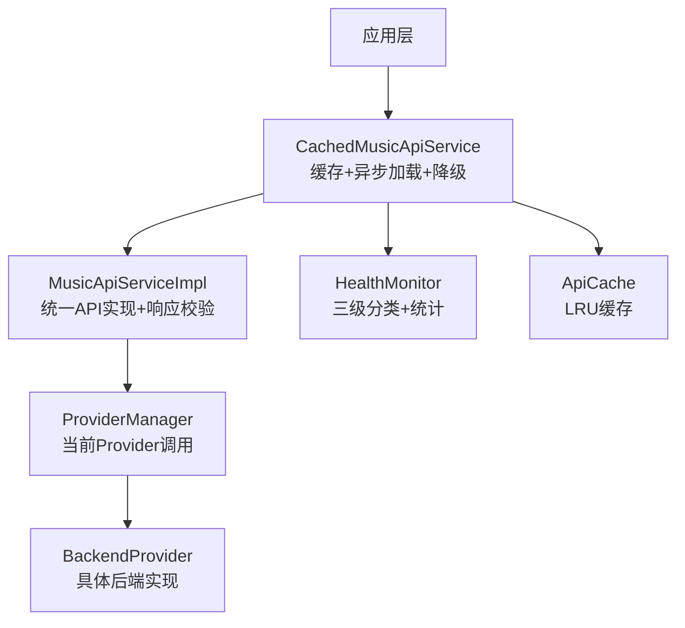
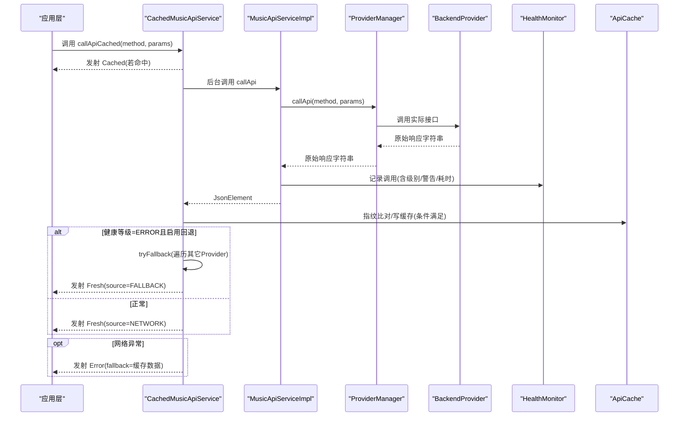
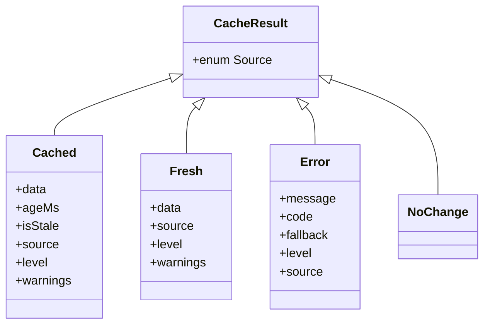
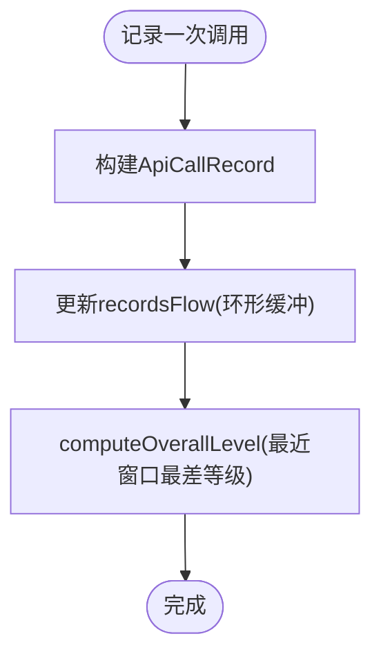
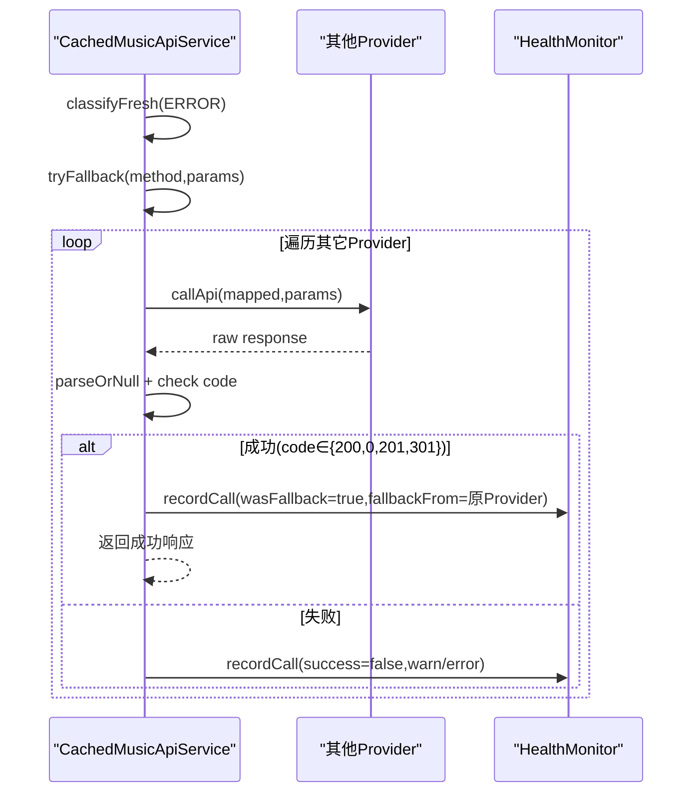
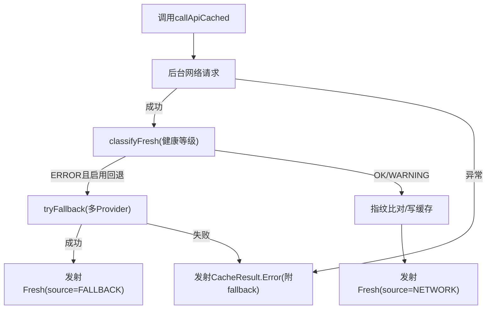
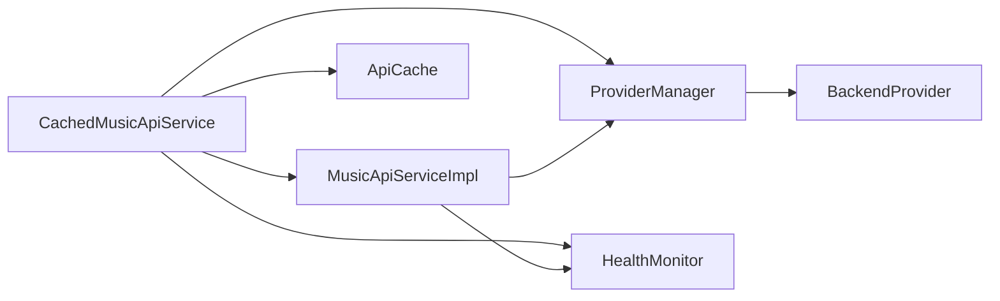

# 错误处理与降级

<cite>
**本文引用的文件**
- [CacheResult.kt](file://kmp-pro/src/commonMain/kotlin/cp/player/kmp/cache/CacheResult.kt)
- [HealthMonitor.kt](file://kmp-pro/src/commonMain/kotlin/cp/player/kmp/monitor/HealthMonitor.kt)
- [CachedMusicApiService.kt](file://kmp-pro/src/commonMain/kotlin/cp/player/kmp/cache/CachedMusicApiService.kt)
- [MusicApiServiceImpl.kt](file://kmp-pro/src/commonMain/kotlin/cp/player/kmp/api/MusicApiServiceImpl.kt)
- [ProviderManager.kt](file://kmp-pro/src/commonMain/kotlin/cp/player/kmp/provider/ProviderManager.kt)
- [CacheConfig.kt](file://kmp-pro/src/commonMain/kotlin/cp/player/kmp/cache/CacheConfig.kt)
- [ApiCache.kt](file://kmp-pro/src/commonMain/kotlin/cp/player/kmp/cache/ApiCache.kt)
</cite>

## 目录
1. [简介](#简介)
2. [项目结构](#项目结构)
3. [核心组件](#核心组件)
4. [架构总览](#架构总览)
5. [详细组件分析](#详细组件分析)
6. [依赖关系分析](#依赖关系分析)
7. [性能考量](#性能考量)
8. [故障排查指南](#故障排查指南)
9. [结论](#结论)
10. [附录](#附录)

## 简介
本技术文档聚焦 CPPlayer-KMP 的错误处理与降级机制，系统性说明异常处理、容灾降级策略与日志记录体系。重点覆盖：
- CacheResult 的多状态类型与语义
- HealthMonitor 的三级健康分类（OK/WARNING/ERROR）
- 多 Provider 错误回退的实现原理与流程
- 错误分类标准、重试机制与故障恢复策略
- 常见错误诊断、调试技巧与解决方案
- 网络异常、解析错误、Provider 不可用等场景的处理方式
- 缓存降级与用户体验保障机制

## 项目结构
围绕错误处理与降级的关键模块分布如下：
- 缓存层：CacheResult、ApiCache、CacheConfig、CachedMusicApiService
- 监控层：HealthMonitor（三级分类、统计、记录）
- API 实现层：MusicApiServiceImpl（统一拦截、响应校验、健康记录）
- 提供商管理：ProviderManager（当前 Provider 切换、调用封装）

图表来源
- [CachedMusicApiService.kt:46-88](file://kmp-pro/src/commonMain/kotlin/cp/player/kmp/cache/CachedMusicApiService.kt#L46-L88)
- [MusicApiServiceImpl.kt:35-101](file://kmp-pro/src/commonMain/kotlin/cp/player/kmp/api/MusicApiServiceImpl.kt#L35-L101)
- [ProviderManager.kt:129-141](file://kmp-pro/src/commonMain/kotlin/cp/player/kmp/provider/ProviderManager.kt#L129-L141)
- [HealthMonitor.kt:25-56](file://kmp-pro/src/commonMain/kotlin/cp/player/kmp/monitor/HealthMonitor.kt#L25-L56)
- [ApiCache.kt:26-49](file://kmp-pro/src/commonMain/kotlin/cp/player/kmp/cache/ApiCache.kt#L26-L49)

章节来源
- [CachedMusicApiService.kt:46-88](file://kmp-pro/src/commonMain/kotlin/cp/player/kmp/cache/CachedMusicApiService.kt#L46-L88)
- [MusicApiServiceImpl.kt:35-101](file://kmp-pro/src/commonMain/kotlin/cp/player/kmp/api/MusicApiServiceImpl.kt#L35-L101)
- [ProviderManager.kt:129-141](file://kmp-pro/src/commonMain/kotlin/cp/player/kmp/provider/ProviderManager.kt#L129-L141)
- [HealthMonitor.kt:25-56](file://kmp-pro/src/commonMain/kotlin/cp/player/kmp/monitor/HealthMonitor.kt#L25-L56)
- [ApiCache.kt:26-49](file://kmp-pro/src/commonMain/kotlin/cp/player/kmp/cache/ApiCache.kt#L26-L49)

## 核心组件
- CacheResult：定义缓存返回结果的状态契约，包括来自缓存、来自网络、错误（可带降级数据）、无变更等状态，并携带健康等级与警告列表。
- HealthMonitor：提供三级健康分类（OK/WARNING/ERROR），记录每次 API 调用的详细信息，计算综合健康等级与统计指标。
- CachedMusicApiService：在 MusicApiService 之上增加“先缓存后网络”的 Flow 流式返回；在网络失败或健康等级为 ERROR 时触发多 Provider 容灾回退。
- MusicApiServiceImpl：统一拦截所有 API 调用，进行响应兼容性验证、错误分类与健康记录；对 URL 类接口做特殊处理与自动回退。
- ProviderManager：管理当前活跃 Provider，封装 callApi，并在不支持或异常时返回标准化错误响应。
- ApiCache/CacheConfig：内存 LRU 缓存与配置项（是否启用缓存、是否启用回退、新鲜度阈值等）。

章节来源
- [CacheResult.kt:14-44](file://kmp-pro/src/commonMain/kotlin/cp/player/kmp/cache/CacheResult.kt#L14-L44)
- [HealthMonitor.kt:25-56](file://kmp-pro/src/commonMain/kotlin/cp/player/kmp/monitor/HealthMonitor.kt#L25-L56)
- [CachedMusicApiService.kt:46-88](file://kmp-pro/src/commonMain/kotlin/cp/player/kmp/cache/CachedMusicApiService.kt#L46-L88)
- [MusicApiServiceImpl.kt:35-101](file://kmp-pro/src/commonMain/kotlin/cp/player/kmp/api/MusicApiServiceImpl.kt#L35-L101)
- [ProviderManager.kt:129-141](file://kmp-pro/src/commonMain/kotlin/cp/player/kmp/provider/ProviderManager.kt#L129-L141)
- [ApiCache.kt:26-49](file://kmp-pro/src/commonMain/kotlin/cp/player/kmp/cache/ApiCache.kt#L26-L49)
- [CacheConfig.kt:11-16](file://kmp-pro/src/commonMain/kotlin/cp/player/kmp/cache/CacheConfig.kt#L11-L16)

## 架构总览
整体错误处理与降级链路如下：
- 调用进入 CachedMusicApiService.callApiCached，优先返回缓存（若存在），随后后台拉取最新数据。
- 底层通过 MusicApiServiceImpl.callApi 统一执行，并进行响应校验与健康记录。
- 若健康等级为 ERROR 且开启回退，则尝试其它 Provider 进行容灾；成功则标记 FALLBACK。
- 若网络请求抛出异常，直接返回 Error 并附带缓存作为 fallback（若存在）。
- HealthMonitor 持续记录每次调用，提供统计与 UI 指示。

图表来源
- [CachedMusicApiService.kt:60-140](file://kmp-pro/src/commonMain/kotlin/cp/player/kmp/cache/CachedMusicApiService.kt#L60-L140)
- [MusicApiServiceImpl.kt:35-101](file://kmp-pro/src/commonMain/kotlin/cp/player/kmp/api/MusicApiServiceImpl.kt#L35-L101)
- [ProviderManager.kt:129-141](file://kmp-pro/src/commonMain/kotlin/cp/player/kmp/provider/ProviderManager.kt#L129-L141)
- [HealthMonitor.kt:122-138](file://kmp-pro/src/commonMain/kotlin/cp/player/kmp/monitor/HealthMonitor.kt#L122-L138)
- [ApiCache.kt:64-67](file://kmp-pro/src/commonMain/kotlin/cp/player/kmp/cache/ApiCache.kt#L64-L67)

## 详细组件分析

### CacheResult 状态模型与语义
- Cached：来自缓存，包含年龄、是否过期、健康等级与警告列表。
- Fresh：来自网络，携带健康等级与警告列表。
- Error：请求失败，可附带降级数据（fallback），并标记健康等级为 ERROR。
- NoChange：后台比对发现与缓存一致，无需替换（可选信号）。

图表来源
- [CacheResult.kt:14-44](file://kmp-pro/src/commonMain/kotlin/cp/player/kmp/cache/CacheResult.kt#L14-L44)

章节来源
- [CacheResult.kt:14-44](file://kmp-pro/src/commonMain/kotlin/cp/player/kmp/cache/CacheResult.kt#L14-L44)

### HealthMonitor 三级分类与记录
- 三级分类：OK（正常）、WARNING（勉强可用）、ERROR（不可用需回退）。
- 分类规则：UNSUPPORTED_BY_PROVIDER 与 MALFORMED_RESPONSE 归为 ERROR；其余警告归为 WARNING。
- 记录与统计：记录每次 API 调用（时间戳、providerId、method、耗时、成功与否、级别、错误码、错误信息、是否回退、回退来源、响应警告、期望字段、原始响应），并提供按 provider 与方法维度的统计。
- 综合健康等级：基于最近窗口（默认 100 条）的最差等级决定 overallLevel。

图表来源
- [HealthMonitor.kt:122-138](file://kmp-pro/src/commonMain/kotlin/cp/player/kmp/monitor/HealthMonitor.kt#L122-L138)
- [HealthMonitor.kt:223-233](file://kmp-pro/src/commonMain/kotlin/cp/player/kmp/monitor/HealthMonitor.kt#L223-L233)

章节来源
- [HealthMonitor.kt:25-56](file://kmp-pro/src/commonMain/kotlin/cp/player/kmp/monitor/HealthMonitor.kt#L25-L56)
- [HealthMonitor.kt:122-138](file://kmp-pro/src/commonMain/kotlin/cp/player/kmp/monitor/HealthMonitor.kt#L122-L138)
- [HealthMonitor.kt:223-233](file://kmp-pro/src/commonMain/kotlin/cp/player/kmp/monitor/HealthMonitor.kt#L223-L233)

### 多 Provider 错误回退机制
- 触发条件：当网络响应健康等级为 ERROR 且启用回退时，CachedMusicApiService 会依次尝试其它已加载 Provider。
- 回退逻辑：遍历 ordered providers（将当前 Provider 置于末尾），跳过 unsupported 映射，调用并解析 JSON，检查 code 是否为成功值（200/0/201/301），成功后记录 HealthMonitor（wasFallback=true，fallbackFrom=原Provider）。
- 结果：第一个成功的响应被返回，并标记 source=FALLBACK；全部失败则返回 null，最终由上层发出 Error。

图表来源
- [CachedMusicApiService.kt:149-180](file://kmp-pro/src/commonMain/kotlin/cp/player/kmp/cache/CachedMusicApiService.kt#L149-L180)
- [HealthMonitor.kt:122-138](file://kmp-pro/src/commonMain/kotlin/cp/player/kmp/monitor/HealthMonitor.kt#L122-L138)

章节来源
- [CachedMusicApiService.kt:149-180](file://kmp-pro/src/commonMain/kotlin/cp/player/kmp/cache/CachedMusicApiService.kt#L149-L180)

### 网络异常与解析错误的处理
- 网络异常：在 emitNetworkResult 中捕获异常，直接发射 CacheResult.Error，并附带缓存数据作为 fallback（若存在）。
- 解析错误：MusicApiServiceImpl 在解析 JSON 失败时记录 HealthMonitor（MALFORMED_RESPONSE），并构造统一的错误响应（code=500，msg=解析错误信息）。
- URL 类接口：getSongUrl 优先尝试 302 版本，若无有效 URL 则自动回退到 v1 版本，并记录回退事件。

图表来源
- [CachedMusicApiService.kt:90-140](file://kmp-pro/src/commonMain/kotlin/cp/player/kmp/cache/CachedMusicApiService.kt#L90-L140)
- [MusicApiServiceImpl.kt:35-101](file://kmp-pro/src/commonMain/kotlin/cp/player/kmp/api/MusicApiServiceImpl.kt#L35-L101)
- [MusicApiServiceImpl.kt:189-210](file://kmp-pro/src/commonMain/kotlin/cp/player/kmp/api/MusicApiServiceImpl.kt#L189-L210)

章节来源
- [CachedMusicApiService.kt:90-140](file://kmp-pro/src/commonMain/kotlin/cp/player/kmp/cache/CachedMusicApiService.kt#L90-L140)
- [MusicApiServiceImpl.kt:35-101](file://kmp-pro/src/commonMain/kotlin/cp/player/kmp/api/MusicApiServiceImpl.kt#L35-L101)
- [MusicApiServiceImpl.kt:189-210](file://kmp-pro/src/commonMain/kotlin/cp/player/kmp/api/MusicApiServiceImpl.kt#L189-L210)

### 缓存降级与用户体验保障
- 先缓存后网络：若缓存存在，立即返回 Cached（可能 stale），同时后台拉取最新数据；若最新数据与缓存相同且非 ERROR，则发射 NoChange。
- 新鲜度控制：freshTtlMs 控制“新鲜”阈值，超过视为 stale，但仍先返回以提升用户体验。
- 写缓存条件：仅幂等读类接口写缓存；写/动作类接口直通网络，避免脏写。
- 回退写入：当回退成功时，会将回退数据写回缓存（若方法可缓存），保证后续请求更快可用。

章节来源
- [CachedMusicApiService.kt:60-88](file://kmp-pro/src/commonMain/kotlin/cp/player/kmp/cache/CachedMusicApiService.kt#L60-L88)
- [CachedMusicApiService.kt:118-132](file://kmp-pro/src/commonMain/kotlin/cp/player/kmp/cache/CachedMusicApiService.kt#L118-L132)
- [CacheConfig.kt:11-16](file://kmp-pro/src/commonMain/kotlin/cp/player/kmp/cache/CacheConfig.kt#L11-L16)
- [ApiCache.kt:64-67](file://kmp-pro/src/commonMain/kotlin/cp/player/kmp/cache/ApiCache.kt#L64-L67)

### 重试机制与故障恢复策略
- 多 Provider 重试：在 tryFallback 中依次尝试其它 Provider，每个 Provider 最多一次调用（URL 类接口在 callWithAllProviders 中有两次尝试，间隔 200ms）。
- 自动回退：URL 类接口在 302 版本无效时自动回退到 v1 版本。
- 恢复策略：当某 Provider 返回 UNSUPPORTED_BY_PROVIDER 或 MALFORMED_RESPONSE 时，HealthMonitor 将其归类为 ERROR，触发回退；回退成功后记录 wasFallback，便于追踪与优化。

章节来源
- [MusicApiServiceImpl.kt:437-479](file://kmp-pro/src/commonMain/kotlin/cp/player/kmp/api/MusicApiServiceImpl.kt#L437-L479)
- [MusicApiServiceImpl.kt:189-210](file://kmp-pro/src/commonMain/kotlin/cp/player/kmp/api/MusicApiServiceImpl.kt#L189-L210)
- [HealthMonitor.kt:52-56](file://kmp-pro/src/commonMain/kotlin/cp/player/kmp/monitor/HealthMonitor.kt#L52-L56)

## 依赖关系分析
- CachedMusicApiService 依赖 MusicApiServiceImpl、ProviderManager、ApiCache、HealthMonitor。
- MusicApiServiceImpl 依赖 ProviderManager、HealthMonitor。
- ProviderManager 依赖 BackendProvider（通过 apiMap 映射方法名）。
- HealthMonitor 被多处用于记录调用与健康等级，形成全局监控中心。

图表来源
- [CachedMusicApiService.kt:46-88](file://kmp-pro/src/commonMain/kotlin/cp/player/kmp/cache/CachedMusicApiService.kt#L46-L88)
- [MusicApiServiceImpl.kt:35-101](file://kmp-pro/src/commonMain/kotlin/cp/player/kmp/api/MusicApiServiceImpl.kt#L35-L101)
- [ProviderManager.kt:129-141](file://kmp-pro/src/commonMain/kotlin/cp/player/kmp/provider/ProviderManager.kt#L129-L141)

章节来源
- [CachedMusicApiService.kt:46-88](file://kmp-pro/src/commonMain/kotlin/cp/player/kmp/cache/CachedMusicApiService.kt#L46-L88)
- [MusicApiServiceImpl.kt:35-101](file://kmp-pro/src/commonMain/kotlin/cp/player/kmp/api/MusicApiServiceImpl.kt#L35-L101)
- [ProviderManager.kt:129-141](file://kmp-pro/src/commonMain/kotlin/cp/player/kmp/provider/ProviderManager.kt#L129-L141)

## 性能考量
- 健康记录路径使用 MutableStateFlow.update 避免完整列表复制，采用环形缓冲区（MAX_RECORDS=500）减少扩容开销。
- 统计查询从 Flow snapshot 计算，不阻塞记录路径。
- 缓存键生成包含 providerId、method、排序后的参数与 cookie 哈希，确保唯一性与隔离性。
- URL 类接口在 callWithAllProviders 中对失败尝试加入 200ms 延迟，降低瞬时压力。

章节来源
- [HealthMonitor.kt:27-24](file://kmp-pro/src/commonMain/kotlin/cp/player/kmp/monitor/HealthMonitor.kt#L27-L24)
- [HealthMonitor.kt:122-138](file://kmp-pro/src/commonMain/kotlin/cp/player/kmp/monitor/HealthMonitor.kt#L122-L138)
- [ApiCache.kt:52-62](file://kmp-pro/src/commonMain/kotlin/cp/player/kmp/cache/ApiCache.kt#L52-L62)
- [MusicApiServiceImpl.kt:447-476](file://kmp-pro/src/commonMain/kotlin/cp/player/kmp/api/MusicApiServiceImpl.kt#L447-L476)

## 故障排查指南
- 查看最近告警：通过 HealthMonitor.getRecentRecords(limit=100, onlyWarnings=true) 获取最近警告，结合 method 过滤定位问题接口。
- 查看失败记录：使用 onlyFailures=true 或 onlyErrors=true 筛选失败或错误记录，关注 errorMessage、errorCode、responseWarnings。
- 检查回退情况：wasFallback=true 表示使用了回退，fallbackFrom 显示回退来源 Provider。
- 解析错误：若出现 MALFORMED_RESPONSE，检查原始响应 rawResponse，确认是否为合法 JSON。
- Provider 不支持：若出现 UNSUPPORTED_BY_PROVIDER，检查 Provider 的 apiMap 映射是否正确。
- URL 类接口：若 getSongUrl 无法获取有效 URL，检查 302 版本响应是否包含 redirectUrl/url 字段，必要时回退到 v1 版本。

章节来源
- [HealthMonitor.kt:159-178](file://kmp-pro/src/commonMain/kotlin/cp/player/kmp/monitor/HealthMonitor.kt#L159-L178)
- [MusicApiServiceImpl.kt:571-592](file://kmp-pro/src/commonMain/kotlin/cp/player/kmp/api/MusicApiServiceImpl.kt#L571-L592)
- [MusicApiServiceImpl.kt:189-210](file://kmp-pro/src/commonMain/kotlin/cp/player/kmp/api/MusicApiServiceImpl.kt#L189-L210)

## 结论
CPPlayer-KMP 的错误处理与降级机制以 HealthMonitor 为核心，结合 CacheResult 的状态语义与 CachedMusicApiService 的缓存+回退策略，实现了高可用的 API 访问体验。通过三级健康分类、多 Provider 容灾、缓存降级与详细的日志记录，系统能够有效应对网络异常、解析错误与 Provider 不可用等场景，保障用户体验。建议在生产环境中合理配置 freshTtlMs、enableFallback 与 enableCache，并结合 HealthMonitor 的统计信息进行持续优化。

## 附录
- 最佳实践
  - 对幂等读接口启用缓存，写/动作接口直通网络。
  - 开启多 Provider 回退，提升容灾能力。
  - 定期清理或限制 HealthMonitor 记录数量，避免内存占用过高。
  - 针对 URL 类接口，优先使用 302 版本，失败时自动回退。
- 代码示例路径（不展示具体代码内容）
  - 缓存返回与网络回退：[CachedMusicApiService.kt:60-140](file://kmp-pro/src/commonMain/kotlin/cp/player/kmp/cache/CachedMusicApiService.kt#L60-L140)
  - 健康分类与记录：[HealthMonitor.kt:52-56](file://kmp-pro/src/commonMain/kotlin/cp/player/kmp/monitor/HealthMonitor.kt#L52-L56)、[HealthMonitor.kt:122-138](file://kmp-pro/src/commonMain/kotlin/cp/player/kmp/monitor/HealthMonitor.kt#L122-L138)
  - 多 Provider 回退：[CachedMusicApiService.kt:149-180](file://kmp-pro/src/commonMain/kotlin/cp/player/kmp/cache/CachedMusicApiService.kt#L149-L180)
  - 解析错误处理：[MusicApiServiceImpl.kt:35-101](file://kmp-pro/src/commonMain/kotlin/cp/player/kmp/api/MusicApiServiceImpl.kt#L35-L101)
  - URL 类接口回退：[MusicApiServiceImpl.kt:189-210](file://kmp-pro/src/commonMain/kotlin/cp/player/kmp/api/MusicApiServiceImpl.kt#L189-L210)