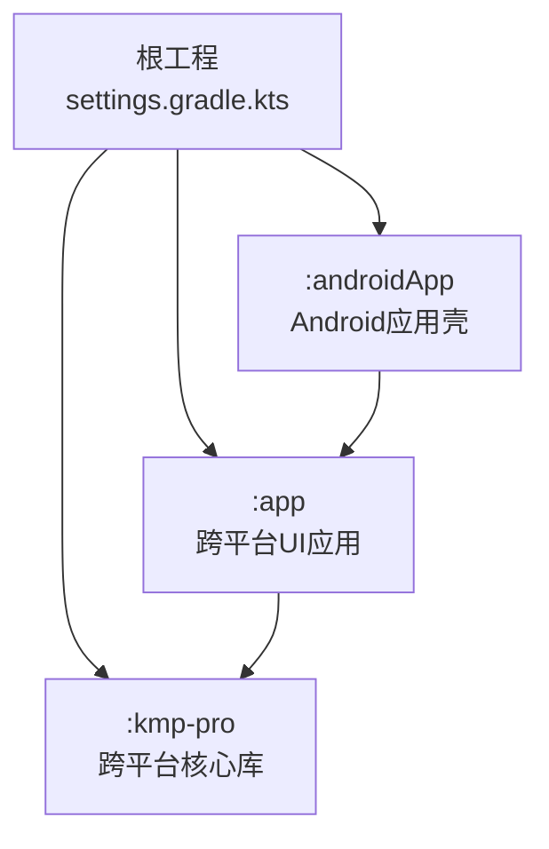
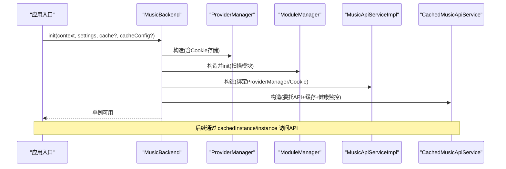
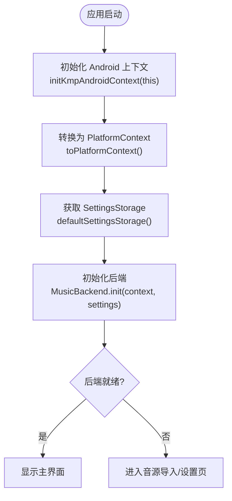
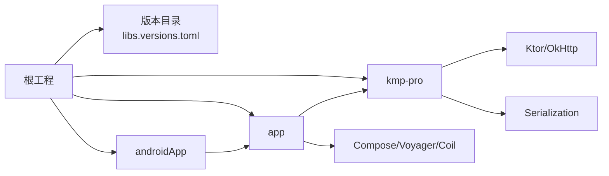

# 快速开始

<cite>
**本文引用的文件**
- [README.md](file://README.md)
- [settings.gradle.kts](file://settings.gradle.kts)
- [build.gradle.kts](file://build.gradle.kts)
- [gradle.properties](file://gradle.properties)
- [libs.versions.toml](file://gradle/libs.versions.toml)
- [kmp-pro/build.gradle.kts](file://kmp-pro/build.gradle.kts)
- [app/build.gradle.kts](file://app/build.gradle.kts)
- [androidApp/build.gradle.kts](file://androidApp/build.gradle.kts)
- [MusicBackend.kt](file://kmp-pro/src/commonMain/kotlin/cp/player/kmp/MusicBackend.kt)
- [MusicApiServiceFactory.kt](file://kmp-pro/src/commonMain/kotlin/cp/player/kmp/api/MusicApiServiceFactory.kt)
- [PlatformContext.kt（common）](file://kmp-pro/src/commonMain/kotlin/cp/player/kmp/util/PlatformContext.kt)
- [PlatformContext.kt（Android）](file://kmp-pro/src/androidMain/kotlin/cp/player/kmp/util/PlatformContext.kt)
- [PlatformContext.kt（Desktop）](file://kmp-pro/src/desktopMain/kotlin/cp/player/kmp/util/PlatformContext.kt)
- [MainActivity.kt](file://androidApp/src/main/kotlin/cp/player/app/MainActivity.kt)
- [Main.kt（Desktop）](file://app/src/desktopMain/kotlin/cp/player/app/Main.kt)
</cite>

## 目录
1. [简介](#简介)
2. [项目结构](#项目结构)
3. [核心组件](#核心组件)
4. [架构总览](#架构总览)
5. [详细组件分析](#详细组件分析)
6. [依赖分析](#依赖分析)
7. [性能考虑](#性能考虑)
8. [故障排除指南](#故障排除指南)
9. [结论](#结论)
10. [附录](#附录)

## 简介
本快速开始指南面向首次接触 CPPlayer-KMP 的开发者，目标是帮助你在最短时间内完成环境搭建、理解模块组织、正确初始化后端并调用 API。你将学到：
- 环境与工具版本要求（JDK、Android Studio、Gradle、Kotlin、AGP、Ktor 等）
- 工程目录与模块职责
- Android 与 Desktop 平台的初始化步骤
- 如何配置 MusicApiServiceFactory 与 PlatformContext
- 缓存版与非缓存版 API 的使用方式
- 常见配置项与自定义点
- 常见问题排查方法

## 项目结构
本项目采用 Kotlin Multiplatform + Compose Desktop + Android 的多端工程组织：
- 根工程负责插件与仓库管理
- kmp-pro：跨平台核心库（API、Provider、缓存、播放控制抽象等）
- app：跨平台 UI 应用（Compose Desktop / Android），依赖 kmp-pro
- androidApp：Android 应用壳，负责启动 Activity 与注入 Context

图表来源
- [settings.gradle.kts:1-26](file://settings.gradle.kts#L1-L26)
- [kmp-pro/build.gradle.kts:1-66](file://kmp-pro/build.gradle.kts#L1-L66)
- [app/build.gradle.kts:1-76](file://app/build.gradle.kts#L1-L76)
- [androidApp/build.gradle.kts:1-41](file://androidApp/build.gradle.kts#L1-L41)

章节来源
- [settings.gradle.kts:1-26](file://settings.gradle.kts#L1-L26)
- [build.gradle.kts:1-10](file://build.gradle.kts#L1-L10)
- [gradle.properties:1-9](file://gradle.properties#L1-L9)
- [libs.versions.toml:1-64](file://gradle/libs.versions.toml#L1-L64)

## 核心组件
- MusicBackend：后端统一入口，封装 Provider 管理、状态机、本地音乐、播放控制与健康监控。
- MusicApiServiceFactory：向后兼容的工厂层，内部委托 MusicBackend，提供 instance 与 cachedInstance。
- PlatformContext：平台上下文抽象，Android 包装 Context，Desktop 为空占位。
- 缓存层：CachedMusicApiService + ApiCache + Fingerprinter，实现“先返回缓存、后台拉取、指纹比对、差异回传”的流式结果。
- Provider/Module：通过 ModuleManager 加载 zip 模块，ProviderManager 管理当前活跃 Provider。

章节来源
- [MusicBackend.kt:30-130](file://kmp-pro/src/commonMain/kotlin/cp/player/kmp/MusicBackend.kt#L30-L130)
- [MusicApiServiceFactory.kt:12-57](file://kmp-pro/src/commonMain/kotlin/cp/player/kmp/api/MusicApiServiceFactory.kt#L12-L57)
- [PlatformContext.kt（common）:1-14](file://kmp-pro/src/commonMain/kotlin/cp/player/kmp/util/PlatformContext.kt#L1-L14)

## 架构总览
下图展示了从平台入口到后端核心、再到 API 与缓存层的调用关系。

图表来源
- [MusicBackend.kt:314-367](file://kmp-pro/src/commonMain/kotlin/cp/player/kmp/MusicBackend.kt#L314-L367)
- [MusicApiServiceFactory.kt:44-51](file://kmp-pro/src/commonMain/kotlin/cp/player/kmp/api/MusicApiServiceFactory.kt#L44-L51)

## 详细组件分析

### 环境搭建与版本要求
- Gradle Wrapper：复用主工程 gradle/wrapper（版本由 wrapper 指定）
- Kotlin：2.4.10
- AGP：9.1.1
- Ktor：3.0.3
- kotlinx-serialization：1.7.3
- Coroutines：1.9.0
- Compose：1.11.1
- JDK：建议 JDK 21（Android compile/target 为 21；Desktop JVM target 为 21）
- Android Studio：支持上述 AGP/Kotlin 版本的最新稳定版
- 代理设置：gradle.properties 中已配置 HTTP/HTTPS 代理地址与端口，可按需调整

章节来源
- [libs.versions.toml:1-64](file://gradle/libs.versions.toml#L1-L64)
- [gradle.properties:1-9](file://gradle.properties#L1-L9)
- [kmp-pro/build.gradle.kts:12-20](file://kmp-pro/build.gradle.kts#L12-L20)
- [androidApp/build.gradle.kts:15-30](file://androidApp/build.gradle.kts#L15-L30)

### 目录结构与模块职责
- :kmp-pro：跨平台核心库
  - commonMain：纯跨平台逻辑（API、缓存、模型、Provider 抽象、播放控制抽象）
  - jvmMain：JVM 共享实现（HTTP 引擎、二进制 Provider 等）
  - androidMain：Android 专属（Context、SharedPreferences、JNI Provider）
  - desktopMain：Desktop 专属（持久化、不支持的 JNI 模块）
- :app：跨平台 UI
  - commonMain：Compose 界面、导航、ScreenModel、主题等
  - androidMain/desktopMain：平台相关依赖与资源
- :androidApp：Android 应用壳
  - 负责 Application/Activity 生命周期、注入 Context、启动 UI

章节来源
- [kmp-pro/build.gradle.kts:22-65](file://kmp-pro/build.gradle.kts#L22-L65)
- [app/build.gradle.kts:24-64](file://app/build.gradle.kts#L24-L64)
- [androidApp/build.gradle.kts:15-41](file://androidApp/build.gradle.kts#L15-L41)

### 平台初始化（Android 与 Desktop）
- Android
  - 在 MainActivity.onCreate 中：
    - 调用 initKmpAndroidContext(this)
    - 调用 toPlatformContext() 获取 PlatformContext
    - 调用 defaultSettingsStorage() 获取 SettingsStorage
    - 调用 MusicBackend.init(...) 完成后端初始化
- Desktop
  - 在 main 函数中：
    - 使用 PlatformContext.EMPTY
    - 调用 defaultSettingsStorage()
    - 调用 MusicBackend.init(...)

章节来源
- [MainActivity.kt:14-25](file://androidApp/src/main/kotlin/cp/player/app/MainActivity.kt#L14-L25)
- [Main.kt（Desktop）:10-38](file://app/src/desktopMain/kotlin/cp/player/app/Main.kt#L10-L38)
- [PlatformContext.kt（Android）:1-14](file://kmp-pro/src/androidMain/kotlin/cp/player/kmp/util/PlatformContext.kt#L1-L14)
- [PlatformContext.kt（Desktop）:1-10](file://kmp-pro/src/desktopMain/kotlin/cp/player/kmp/util/PlatformContext.kt#L1-L10)

### 使用 API：缓存版与非缓存版
- 非缓存版（原始同步接口）
  - 通过 MusicApiServiceFactory.instance 获取 MusicApiServiceImpl
  - 直接调用各方法（如获取歌单详情），自动注入 Cookie 并记录健康信息
- 缓存版（推荐用于 UI 展示）
  - 通过 MusicApiServiceFactory.cachedInstance 获取 CachedMusicApiService
  - 调用 callApiCached(...) 返回 Flow<CacheResult<...>>，依次发射：
    - 缓存数据（可标记 stale）
    - Fresh（网络成功且内容变化）
    - NoChange（内容未变）
    - Error（网络异常或错误码，带降级缓存）

章节来源
- [MusicApiServiceFactory.kt:33-37](file://kmp-pro/src/commonMain/kotlin/cp/player/kmp/api/MusicApiServiceFactory.kt#L33-L37)
- [README.md:126-154](file://README.md#L126-L154)

### 配置选项与自定义
- CacheConfig
  - freshTtlMs：缓存新鲜度时间
  - maxEntries：最大缓存条目数
  - enableFallback：是否启用多 Provider 容灾回退
  - enableCache：是否启用缓存
- ApiCache
  - 默认 InMemoryApiCache（进程内 LRU）
  - 可通过 MusicBackend.init(cache, cacheConfig) 替换为自定义实现
- SettingsStorage
  - Android：基于 SharedPreferences
  - Desktop：基于 Properties 文件
  - 通过 defaultSettingsStorage() 获取平台默认实现

章节来源
- [MusicBackend.kt:330-367](file://kmp-pro/src/commonMain/kotlin/cp/player/kmp/MusicBackend.kt#L330-L367)
- [README.md:66-100](file://README.md#L66-L100)

### 初始化流程图（Android）

图表来源
- [MainActivity.kt:14-25](file://androidApp/src/main/kotlin/cp/player/app/MainActivity.kt#L14-L25)
- [MusicBackend.kt:314-367](file://kmp-pro/src/commonMain/kotlin/cp/player/kmp/MusicBackend.kt#L314-L367)

## 依赖分析
- 根工程声明了插件与仓库，子模块通过 libs.versions.toml 统一管理版本
- kmp-pro 依赖 Ktor、序列化、协程、datetime 等，并在 jvmMain 引入 OkHttp 引擎
- app 依赖 kmp-pro，并在 commonMain 引入 Compose、Voyager、Coil、歌词 UI 等
- androidApp 依赖 app 与 Android 运行时库

图表来源
- [settings.gradle.kts:1-26](file://settings.gradle.kts#L1-L26)
- [libs.versions.toml:1-64](file://gradle/libs.versions.toml#L1-L64)
- [kmp-pro/build.gradle.kts:29-47](file://kmp-pro/build.gradle.kts#L29-L47)
- [app/build.gradle.kts:24-64](file://app/build.gradle.kts#L24-L64)

章节来源
- [settings.gradle.kts:1-26](file://settings.gradle.kts#L1-L26)
- [libs.versions.toml:1-64](file://gradle/libs.versions.toml#L1-L64)

## 性能考虑
- 优先使用缓存版 API：Flow 会立即返回缓存数据，提升首屏速度
- 合理配置 CacheConfig：根据业务场景调整 freshTtlMs 与 maxEntries
- 利用健康监控：ERROR 级别触发多 Provider 容灾，提高可用性
- 避免频繁创建 MusicBackend：使用单例，减少重复初始化开销

## 故障排除指南
- 无法解析依赖或下载缓慢
  - 检查 gradle.properties 中的代理设置是否正确
  - 确认 mavenCentral/google 仓库可达
- 编译失败（JDK/AGP/Kotlin 不匹配）
  - 确保使用 JDK 21，AGP 与 Kotlin 版本与 libs.versions.toml 一致
- Android 启动崩溃（Context 为空）
  - 确认在 onCreate 中调用了 initKmpAndroidContext(this) 与 toPlatformContext()
- Desktop 启动无窗口
  - 确认 main 中调用了 MusicBackend.init(PlatformContext.EMPTY, ...)
- 音源不可用或报错
  - 查看 HealthMonitor 的三级分类（OK/WARNING/ERROR）
  - 若 ERROR，系统会尝试其他 Provider 容灾；若无可用 Provider，请导入模块并激活

章节来源
- [gradle.properties:1-9](file://gradle.properties#L1-L9)
- [MainActivity.kt:14-25](file://androidApp/src/main/kotlin/cp/player/app/MainActivity.kt#L14-L25)
- [Main.kt（Desktop）:10-38](file://app/src/desktopMain/kotlin/cp/player/app/Main.kt#L10-L38)
- [README.md:91-100](file://README.md#L91-L100)

## 结论
通过以上步骤，你可以在 Android 与 Desktop 平台上快速搭建 CPPlayer-KMP 开发环境，完成后端初始化，并使用缓存版或非缓存版 API 进行数据访问。结合健康监控与多 Provider 容灾机制，可获得更稳定的体验。建议在正式项目中优先使用 MusicBackend 提供的统一入口，逐步迁移到高层领域模型。

## 附录
- 构建命令（参考 README）
  - 编译 Desktop：./gradlew :kmp-pro:compileKotlinDesktop
  - 编译 Android：./gradlew :kmp-pro:compileDebugKotlinAndroid
  - 生成 Desktop Jar：./gradlew :kmp-pro:desktopJar
  - 打包 Android AAR：./gradlew :kmp-pro:assembleDebug

章节来源
- [README.md:30-41](file://README.md#L30-L41)