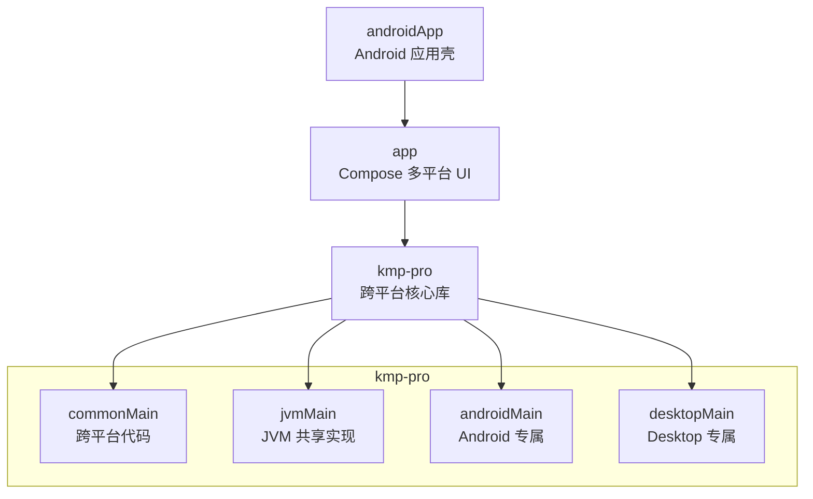
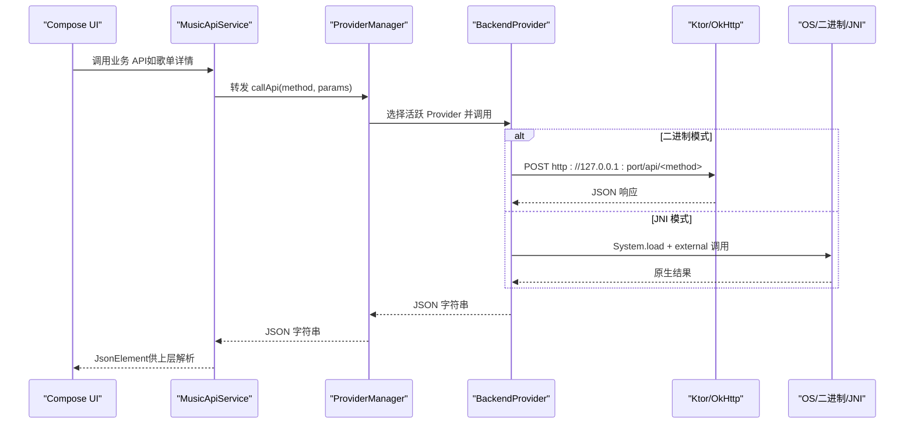
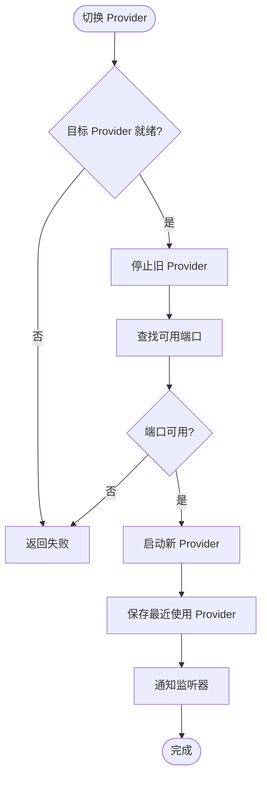
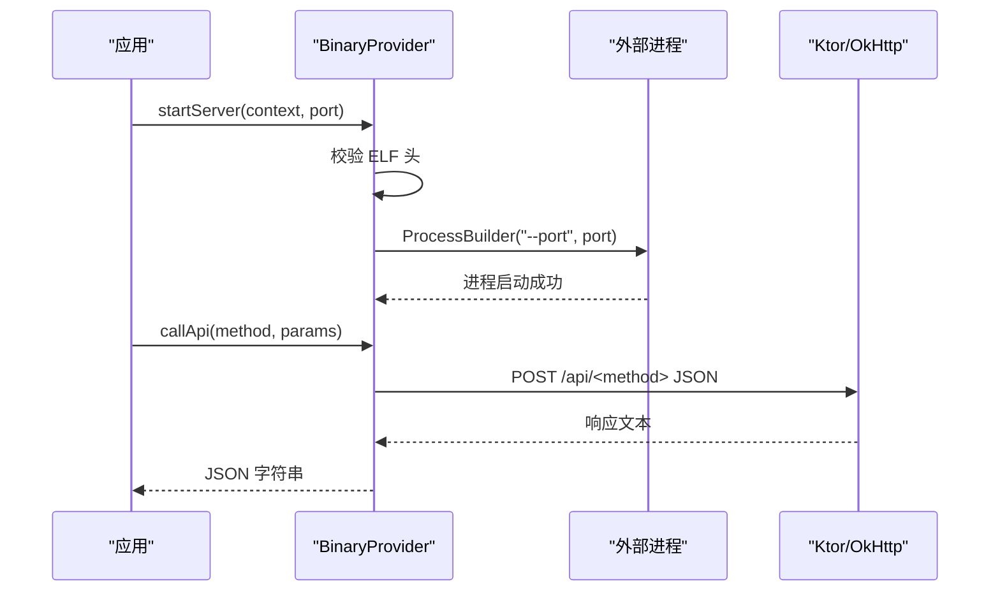
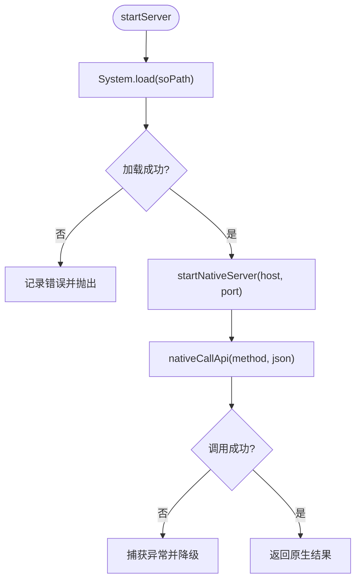
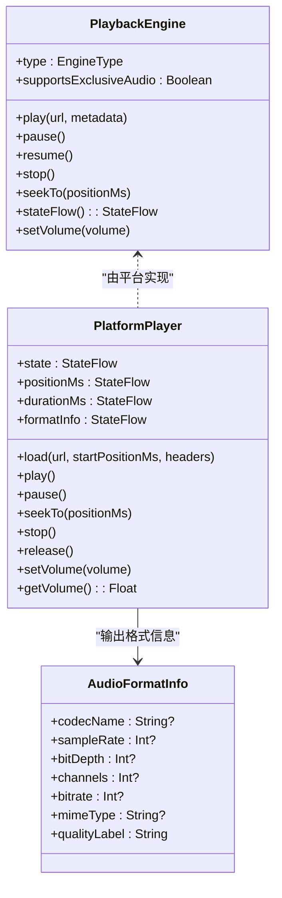
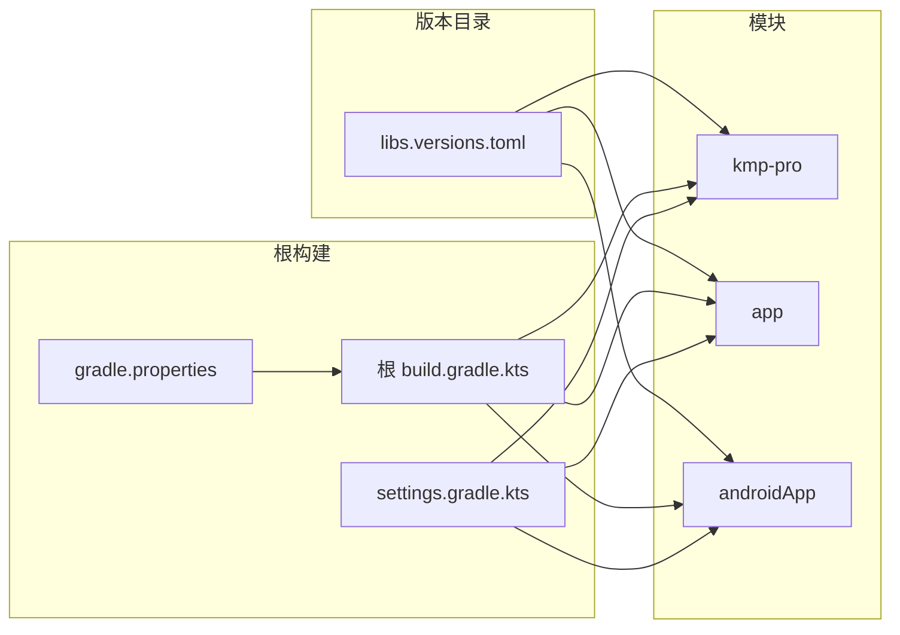

# 技术栈概览

<cite>
**本文引用的文件**
- [README.md](file://README.md)
- [gradle/libs.versions.toml](file://gradle/libs.versions.toml)
- [build.gradle.kts（根）](file://build.gradle.kts)
- [settings.gradle.kts](file://settings.gradle.kts)
- [gradle.properties](file://gradle.properties)
- [kmp-pro/build.gradle.kts](file://kmp-pro/build.gradle.kts)
- [app/build.gradle.kts](file://app/build.gradle.kts)
- [androidApp/build.gradle.kts](file://androidApp/build.gradle.kts)
- [MusicApiService.kt](file://kmp-pro/src/commonMain/kotlin/cp/player/kmp/api/MusicApiService.kt)
- [ProviderManager.kt](file://kmp-pro/src/commonMain/kotlin/cp/player/kmp/provider/ProviderManager.kt)
- [BinaryProvider.kt](file://kmp-pro/src/jvmMain/kotlin/cp/player/kmp/provider/BinaryProvider.kt)
- [JniProvider.kt](file://kmp-pro/src/jvmMain/kotlin/cp/player/kmp/provider/JniProvider.kt)
- [PlatformInfo.kt（common）](file://kmp-pro/src/commonMain/kotlin/cp/player/kmp/util/PlatformInfo.kt)
- [PlatformInfo.kt（android）](file://kmp-pro/src/androidMain/kotlin/cp/player/kmp/util/PlatformInfo.kt)
- [PlatformInfo.kt（desktop）](file://kmp-pro/src/desktopMain/kotlin/cp/player/kmp/util/PlatformInfo.kt)
- [HttpClientFactory.kt（common）](file://kmp-pro/src/commonMain/kotlin/cp/player/kmp/util/HttpClientFactory.kt)
- [HttpClientFactory.kt（jvm）](file://kmp-pro/src/jvmMain/kotlin/cp/player/kmp/util/HttpClientFactory.kt)
- [PlaybackEngine.kt](file://kmp-pro/src/commonMain/kotlin/cp/player/kmp/playback/PlaybackEngine.kt)
- [PlatformPlayer.kt](file://kmp-pro/src/commonMain/kotlin/cp/player/kmp/playback/PlatformPlayer.kt)
- [AudioFormatInfo.kt](file://kmp-pro/src/commonMain/kotlin/cp/player/kmp/playback/AudioFormatInfo.kt)
</cite>

## 目录
1. [简介](#简介)
2. [项目结构](#项目结构)
3. [核心组件](#核心组件)
4. [架构总览](#架构总览)
5. [详细组件分析](#详细组件分析)
6. [依赖关系分析](#依赖关系分析)
7. [性能与构建优化](#性能与构建优化)
8. [故障排查指南](#故障排查指南)
9. [结论](#结论)
10. [附录：版本与兼容性清单](#附录版本与兼容性清单)

## 简介
本技术栈概览面向 CPPlayer-KMP 项目的跨平台音乐播放后端与 API 层，聚焦 Kotlin Multiplatform (KMP)、Jetpack Compose、Ktor HTTP 客户端、Kotlinx Serialization、Coroutines、Media3 等关键依赖在项目中的作用与选型原因。文档同时覆盖 Gradle 构建配置、版本管理策略、构建工具链，以及 Android 平台的 JNI 集成与 Desktop 平台的二进制模块加载机制，并提供最佳实践与兼容性建议。

## 项目结构
项目采用多模块 KMP 工程组织：
- kmp-pro：跨平台核心库，提供 Provider 插件系统、API 服务封装、缓存与健康监控、播放引擎抽象等。
- app：基于 Compose Multiplatform 的 UI 应用模块，复用 kmp-pro 能力，并实现桌面端入口。
- androidApp：Android 应用壳，负责打包与平台特性接入。

图表来源
- [settings.gradle.kts:22-26](file://settings.gradle.kts#L22-L26)
- [kmp-pro/build.gradle.kts:12-27](file://kmp-pro/build.gradle.kts#L12-L27)

章节来源
- [settings.gradle.kts:1-26](file://settings.gradle.kts#L1-L26)
- [kmp-pro/build.gradle.kts:1-66](file://kmp-pro/build.gradle.kts#L1-L66)
- [app/build.gradle.kts:1-76](file://app/build.gradle.kts#L1-L76)
- [androidApp/build.gradle.kts:1-41](file://androidApp/build.gradle.kts#L1-L41)

## 核心组件
- 统一 API 服务接口：定义所有音乐相关 API 方法，返回 JsonElement，自动注入 Cookie，屏蔽底层 Provider 差异。
- Provider 插件系统：通过 BackendProvider 抽象支持多种后端（HTTP 直调、独立二进制进程、JNI 原生库），由 ProviderManager 管理生命周期与切换。
- 缓存与健康监控：在 API 层之上封装 CachedMusicApiService，提供“先缓存后刷新”的 Flow 语义，结合健康等级分类与多 Provider 容灾回退。
- 播放引擎抽象：PlaybackEngine 与 PlatformPlayer 将播放控制与数据源解耦，当前以 ComposeMediaPlayer 作为通用音频播放器骨架，后续可扩展 Media3 ExoPlayer 或 Rust JNI 引擎。
- 平台适配：通过 expect/actual 机制暴露 PlatformContext、PlatformInfo、HttpClient 等平台差异点。

章节来源
- [MusicApiService.kt:1-528](file://kmp-pro/src/commonMain/kotlin/cp/player/kmp/api/MusicApiService.kt#L1-L528)
- [ProviderManager.kt:1-156](file://kmp-pro/src/commonMain/kotlin/cp/player/kmp/provider/ProviderManager.kt#L1-L156)
- [PlaybackEngine.kt:1-96](file://kmp-pro/src/commonMain/kotlin/cp/player/kmp/playback/PlaybackEngine.kt#L1-L96)
- [PlatformPlayer.kt:1-135](file://kmp-pro/src/commonMain/kotlin/cp/player/kmp/playback/PlatformPlayer.kt#L1-L135)
- [AudioFormatInfo.kt:1-23](file://kmp-pro/src/commonMain/kotlin/cp/player/kmp/playback/AudioFormatInfo.kt#L1-L23)

## 架构总览
整体调用链路从 UI 到数据再到后端：
- UI（Compose）→ MusicApiService → ProviderManager → BackendProvider（HTTP/二进制/JNI）
- 播放控制：UI → PlaybackEngine/PlatformPlayer → 具体音频引擎（ComposeMediaPlayer/Media3/Rust JNI）

图表来源
- [MusicApiService.kt:1-528](file://kmp-pro/src/commonMain/kotlin/cp/player/kmp/api/MusicApiService.kt#L1-L528)
- [ProviderManager.kt:123-141](file://kmp-pro/src/commonMain/kotlin/cp/player/kmp/provider/ProviderManager.kt#L123-L141)
- [BinaryProvider.kt:88-104](file://kmp-pro/src/jvmMain/kotlin/cp/player/kmp/provider/BinaryProvider.kt#L88-L104)
- [JniProvider.kt:61-84](file://kmp-pro/src/jvmMain/kotlin/cp/player/kmp/provider/JniProvider.kt#L61-L84)

## 详细组件分析

### 统一 API 服务（MusicApiService）
- 职责：集中暴露所有音乐相关 API，返回 JsonElement；内部自动注入 Cookie；错误统一为 JSON 格式。
- 设计要点：
  - 所有方法均为 suspend，便于协程编排。
  - 方法名与参数严格对齐后端约定，新增接口优先在此扩展。
  - 上层 Repository/ViewModel 仅关注领域模型映射，不感知 Provider 细节。

章节来源
- [MusicApiService.kt:1-528](file://kmp-pro/src/commonMain/kotlin/cp/player/kmp/api/MusicApiService.kt#L1-L528)

### Provider 插件系统与管理器（ProviderManager）
- 职责：管理已加载的 BackendProvider 实例、当前活跃 Provider 切换、端口分配与持久化。
- 关键点：
  - 切换时自动停止旧服务并启动新服务。
  - 通过 StateFlow 暴露当前 Provider 状态，供 Compose 观察。
  - 自动持久化最近使用的 Provider ID，重启恢复。
  - 调用时按 apiMap 映射方法名，若不支持则返回友好提示。

图表来源
- [ProviderManager.kt:80-108](file://kmp-pro/src/commonMain/kotlin/cp/player/kmp/provider/ProviderManager.kt#L80-L108)

章节来源
- [ProviderManager.kt:1-156](file://kmp-pro/src/commonMain/kotlin/cp/player/kmp/provider/ProviderManager.kt#L1-156)

### 二进制模块加载（BinaryProvider）
- 职责：以独立可执行文件形式运行后端，通过本地 HTTP 通信。
- 关键点：
  - 延迟加载：构造函数仅校验文件存在，ELF 校验与进程启动在 startServer 中执行。
  - 通信协议：POST 到 http://127.0.0.1:port/api/<method>，请求体为 JSON。
  - 错误处理：文件不存在、ELF 校验失败、进程启动异常均会记录并抛出。

图表来源
- [BinaryProvider.kt:54-81](file://kmp-pro/src/jvmMain/kotlin/cp/player/kmp/provider/BinaryProvider.kt#L54-L81)
- [BinaryProvider.kt:88-104](file://kmp-pro/src/jvmMain/kotlin/cp/player/kmp/provider/BinaryProvider.kt#L88-L104)

章节来源
- [BinaryProvider.kt:1-108](file://kmp-pro/src/jvmMain/kotlin/cp/player/kmp/provider/BinaryProvider.kt#L1-L108)

### JNI 集成（JniProvider，Android）
- 职责：加载 .so 动态库并通过 external 函数调用原生服务。
- 关键点：
  - 加载前进行文件存在性、大小、权限与 ELF 头校验。
  - 启动原生服务并绑定本地端口，随后通过 nativeCallApi 发起调用。
  - 崩溃保护：捕获原生调用异常，降级为错误 JSON 并重置加载状态。

图表来源
- [JniProvider.kt:39-55](file://kmp-pro/src/jvmMain/kotlin/cp/player/kmp/provider/JniProvider.kt#L39-L55)
- [JniProvider.kt:61-84](file://kmp-pro/src/jvmMain/kotlin/cp/player/kmp/provider/JniProvider.kt#L61-L84)
- [JniProvider.kt:98-136](file://kmp-pro/src/jvmMain/kotlin/cp/player/kmp/provider/JniProvider.kt#L98-L136)

章节来源
- [JniProvider.kt:1-142](file://kmp-pro/src/jvmMain/kotlin/cp/player/kmp/provider/JniProvider.kt#L1-L142)

### 播放引擎与平台播放器（PlaybackEngine / PlatformPlayer）
- 职责：抽象播放控制与状态，屏蔽底层引擎差异；当前以 ComposeMediaPlayer 作为通用音频播放器骨架。
- 关键点：
  - 状态流：state、positionMs、durationMs、formatInfo 均以 Flow 暴露，便于 Compose 观察。
  - 元信息：AudioFormatInfo 提供 codec、采样率、位深、声道、码率、MIME 等字段，用于 UI 展示音质标签。
  - 扩展点：未来可在 Android 接入 Media3 ExoPlayer，或在 Desktop 接入 JavaFX/AWT 或 Rust JNI。

图表来源
- [PlaybackEngine.kt:21-96](file://kmp-pro/src/commonMain/kotlin/cp/player/kmp/playback/PlaybackEngine.kt#L21-L96)
- [PlatformPlayer.kt:16-135](file://kmp-pro/src/commonMain/kotlin/cp/player/kmp/playback/PlatformPlayer.kt#L16-L135)
- [AudioFormatInfo.kt:8-23](file://kmp-pro/src/commonMain/kotlin/cp/player/kmp/playback/AudioFormatInfo.kt#L8-L23)

章节来源
- [PlaybackEngine.kt:1-96](file://kmp-pro/src/commonMain/kotlin/cp/player/kmp/playback/PlaybackEngine.kt#L1-L96)
- [PlatformPlayer.kt:1-135](file://kmp-pro/src/commonMain/kotlin/cp/player/kmp/playback/PlatformPlayer.kt#L1-L135)
- [AudioFormatInfo.kt:1-23](file://kmp-pro/src/commonMain/kotlin/cp/player/kmp/playback/AudioFormatInfo.kt#L1-L23)

### 平台适配（expect/actual）
- PlatformContext：Android 包装 Context，Desktop 为空实现。
- PlatformInfo：提供 supportedAbis 与 modulesDirectory 的平台差异。
- HttpClientFactory：commonMain 声明，jvmMain 使用 OkHttp 引擎实现。

章节来源
- [PlatformInfo.kt（common）:5-20](file://kmp-pro/src/commonMain/kotlin/cp/player/kmp/util/PlatformInfo.kt#L5-L20)
- [PlatformInfo.kt（android）:6-13](file://kmp-pro/src/androidMain/kotlin/cp/player/kmp/util/PlatformInfo.kt#L6-L13)
- [PlatformInfo.kt（desktop）:5-13](file://kmp-pro/src/desktopMain/kotlin/cp/player/kmp/util/PlatformInfo.kt#L5-L13)
- [HttpClientFactory.kt（common）:1-10](file://kmp-pro/src/commonMain/kotlin/cp/player/kmp/util/HttpClientFactory.kt#L1-L10)
- [HttpClientFactory.kt（jvm）:1-21](file://kmp-pro/src/jvmMain/kotlin/cp/player/kmp/util/HttpClientFactory.kt#L1-L21)

## 依赖关系分析
- 版本管理：统一在 gradle/libs.versions.toml 中声明版本号与库别名，便于集中维护。
- 插件管理：根 build.gradle.kts 声明插件别名，settings.gradle.kts 配置仓库与模块包含。
- 模块依赖：
  - kmp-pro：commonMain 引入 Coroutines、Serialization、Ktor Core/Negotiation/JSON；jvmMain 引入 OkHttp 引擎；androidMain 引入 Coroutines Android、Media3 相关；desktopMain 引入 JavaFX、DBus-Java、JNA。
  - app：依赖 kmp-pro，并引入 Compose 组件、Voyager 导航、Coil 图片、Accompanist 歌词 UI、Ktor 客户端等。
  - androidApp：依赖 app，并引入 Activity Compose 与 Coroutines Android。

图表来源
- [gradle/libs.versions.toml:1-64](file://gradle/libs.versions.toml#L1-L64)
- [build.gradle.kts（根）:1-10](file://build.gradle.kts#L1-L10)
- [settings.gradle.kts:1-26](file://settings.gradle.kts#L1-L26)
- [gradle.properties:1-9](file://gradle.properties#L1-L9)

章节来源
- [gradle/libs.versions.toml:1-64](file://gradle/libs.versions.toml#L1-L64)
- [build.gradle.kts（根）:1-10](file://build.gradle.kts#L1-L10)
- [settings.gradle.kts:1-26](file://settings.gradle.kts#L1-L26)
- [gradle.properties:1-9](file://gradle.properties#L1-L9)

## 性能与构建优化
- 网络层：
  - Ktor + OkHttp 引擎设置连接/读写超时，避免阻塞与资源泄露。
  - 建议在高频接口启用连接池与缓存策略（如 ETag/If-None-Match）。
- 播放层：
  - 使用 Flow 轮询状态，注意节流与取消任务，避免内存泄漏。
  - 对大文件播放建议使用分段缓冲与断点续传（后续可结合 Media3 DataSource）。
- 构建与打包：
  - 使用版本目录统一管理依赖，减少冲突。
  - Desktop 打包时按需裁剪 JavaFX 组件，减小体积。
  - Android 开启非传递 RClass 以减少资源膨胀。

[本节为通用指导，无需特定文件引用]

## 故障排查指南
- 二进制模块加载失败：
  - 检查二进制文件路径与执行权限。
  - 确认 ELF 头校验通过，端口未被占用。
  - 查看日志中的 loadError 与启动异常信息。
- JNI 库加载失败：
  - 验证 .so 文件存在、大小合理、可读。
  - 确认 ABI 匹配与系统库依赖满足。
  - 捕获原生调用崩溃并记录堆栈。
- 网络异常：
  - 检查超时配置与代理设置。
  - 确认后端服务是否启动并可访问。
  - 使用健康监控与多级回退策略提升鲁棒性。

章节来源
- [BinaryProvider.kt:42-81](file://kmp-pro/src/jvmMain/kotlin/cp/player/kmp/provider/BinaryProvider.kt#L42-L81)
- [JniProvider.kt:23-55](file://kmp-pro/src/jvmMain/kotlin/cp/player/kmp/provider/JniProvider.kt#L23-L55)
- [JniProvider.kt:98-136](file://kmp-pro/src/jvmMain/kotlin/cp/player/kmp/provider/JniProvider.kt#L98-L136)
- [HttpClientFactory.kt（jvm）:8-21](file://kmp-pro/src/jvmMain/kotlin/cp/player/kmp/util/HttpClientFactory.kt#L8-L21)

## 结论
CPPlayer-KMP 通过 KMP 将 Provider 插件系统与 API 层抽象为跨平台能力，结合 Compose Multiplatform 实现多端 UI，借助 Ktor 与 Coroutines 构建高效网络与异步流程，并以 Media3/ComposeMediaPlayer 作为播放引擎基础。通过 expect/actual 机制隔离平台差异，配合健康监控与缓存策略，提升了系统的稳定性与可维护性。未来可在 Android 深度集成 Media3，在 Desktop 完善媒体控制与系统集成。

[本节为总结，无需特定文件引用]

## 附录：版本与兼容性清单
- Kotlin Multiplatform：Kotlin 2.4.10，AGP 9.1.1，Gradle 9.4.1
- 网络与序列化：Ktor 3.0.3，kotlinx-serialization 1.7.3，datetime 0.6.1
- 协程：coroutines 1.9.0
- UI 与多媒体：Compose 1.11.1，Media3 1.4.1，Coil 3.3.0
- 桌面端：JavaFX 21，DBus-Java 5.1.0，JNA 5.15.0

章节来源
- [gradle/libs.versions.toml:1-64](file://gradle/libs.versions.toml#L1-L64)
- [README.md:40-41](file://README.md#L40-L41)