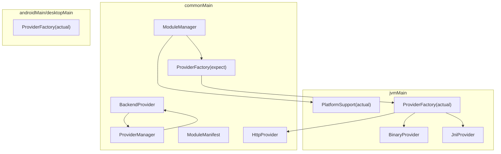
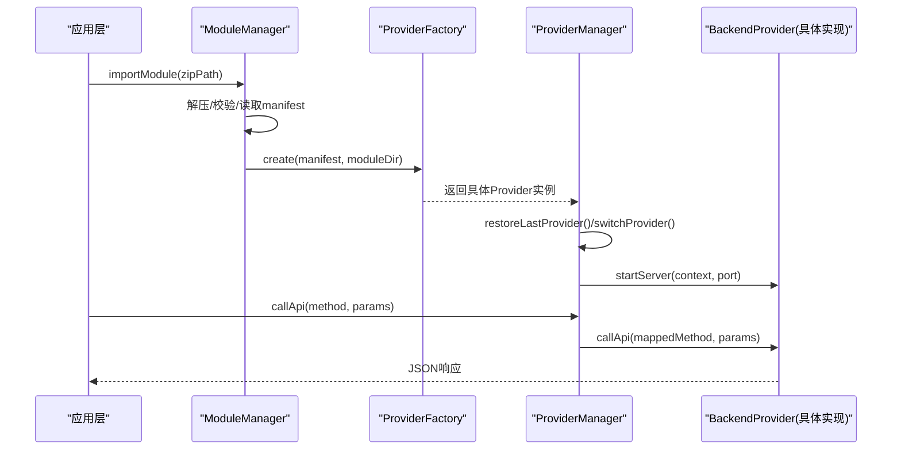
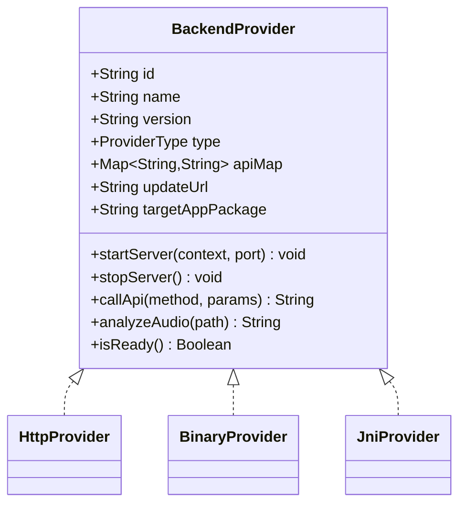
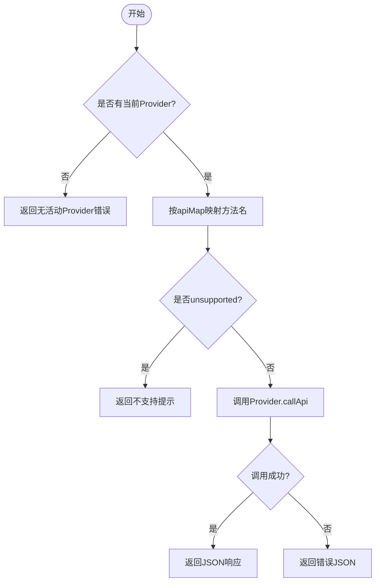
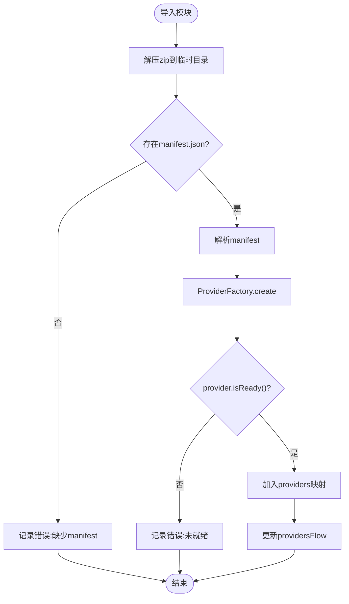
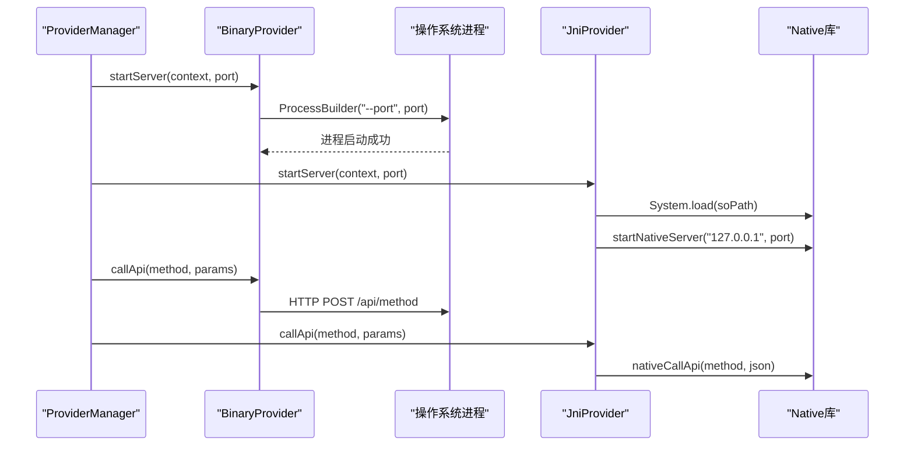
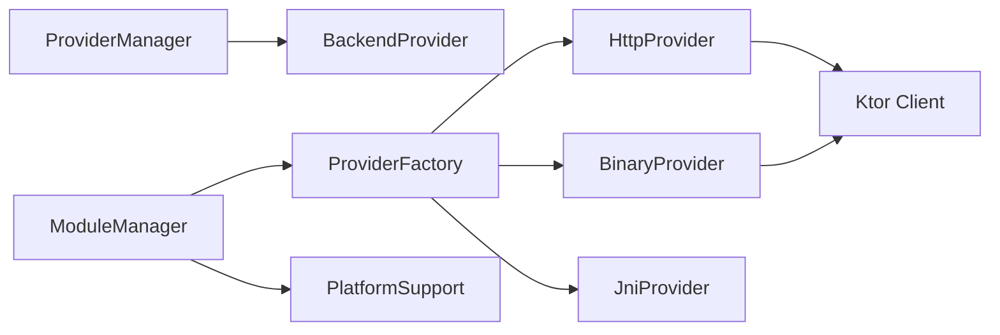

# Provider 插件系统

<cite>
**本文引用的文件**
- [BackendProvider.kt](file://kmp-pro/src/commonMain/kotlin/cp/player/kmp/provider/BackendProvider.kt)
- [ProviderManager.kt](file://kmp-pro/src/commonMain/kotlin/cp/player/kmp/provider/ProviderManager.kt)
- [ModuleManager.kt](file://kmp-pro/src/commonMain/kotlin/cp/player/kmp/provider/ModuleManager.kt)
- [ModuleManifest.kt](file://kmp-pro/src/commonMain/kotlin/cp/player/kmp/provider/ModuleManifest.kt)
- [HttpProvider.kt](file://kmp-pro/src/commonMain/kotlin/cp/player/kmp/provider/HttpProvider.kt)
- [BinaryProvider.kt](file://kmp-pro/src/jvmMain/kotlin/cp/player/kmp/provider/BinaryProvider.kt)
- [JniProvider.kt](file://kmp-pro/src/jvmMain/kotlin/cp/player/kmp/provider/JniProvider.kt)
- [ProviderFactory.kt（common）](file://kmp-pro/src/commonMain/kotlin/cp/player/kmp/provider/ProviderFactory.kt)
- [ProviderFactory.kt（jvm）](file://kmp-pro/src/jvmMain/kotlin/cp/player/kmp/provider/ProviderFactory.kt)
- [ProviderFactory.kt（android）](file://kmp-pro/src/androidMain/kotlin/cp/player/kmp/provider/ProviderFactory.kt)
- [ProviderFactory.kt（desktop）](file://kmp-pro/src/desktopMain/kotlin/cp/player/kmp/provider/ProviderFactory.kt)
- [PlatformSupport.kt](file://kmp-pro/src/commonMain/kotlin/cp/player/kmp/util/PlatformSupport.kt)
- [README.md](file://README.md)
</cite>

## 目录
1. [简介](#简介)
2. [项目结构](#项目结构)
3. [核心组件](#核心组件)
4. [架构总览](#架构总览)
5. [详细组件分析](#详细组件分析)
6. [依赖关系分析](#依赖关系分析)
7. [性能考量](#性能考量)
8. [故障排查指南](#故障排查指南)
9. [结论](#结论)
10. [附录：开发指南与示例](#附录开发指南与示例)

## 简介
本技术文档围绕 CPPlayer-KMP 的 Provider 插件系统展开，系统性阐述其架构设计、动态模块加载机制、JNI 与二进制模块支持、Provider 生命周期管理以及跨平台实现差异。读者将了解如何通过 ModuleManager 导入/激活/切换/删除模块，如何使用 ProviderManager 管理活跃 Provider，以及如何基于 BackendProvider 接口开发自定义 Provider 并集成到系统中。

## 项目结构
Provider 插件系统位于 kmp-pro 模块中，采用 Kotlin Multiplatform 分层组织：
- commonMain：定义抽象接口与通用逻辑（BackendProvider、ProviderManager、ModuleManager、ModuleManifest、HttpProvider、ProviderFactory expect）。
- jvmMain：共享 JVM 实现（BinaryProvider、JniProvider、PlatformSupport actual、ProviderFactory actual）。
- androidMain/desktopMain：平台特定 ProviderFactory actual（创建 JniProvider）。

图示来源
- [BackendProvider.kt:24-110](file://kmp-pro/src/commonMain/kotlin/cp/player/kmp/provider/BackendProvider.kt#L24-L110)
- [ProviderManager.kt:31-145](file://kmp-pro/src/commonMain/kotlin/cp/player/kmp/provider/ProviderManager.kt#L31-L145)
- [ModuleManager.kt:19-137](file://kmp-pro/src/commonMain/kotlin/cp/player/kmp/provider/ModuleManager.kt#L19-L137)
- [ModuleManifest.kt:5-31](file://kmp-pro/src/commonMain/kotlin/cp/player/kmp/provider/ModuleManifest.kt#L5-L31)
- [HttpProvider.kt:23-60](file://kmp-pro/src/commonMain/kotlin/cp/player/kmp/provider/HttpProvider.kt#L23-L60)
- [BinaryProvider.kt:25-108](file://kmp-pro/src/jvmMain/kotlin/cp/player/kmp/provider/BinaryProvider.kt#L25-L108)
- [JniProvider.kt:9-142](file://kmp-pro/src/jvmMain/kotlin/cp/player/kmp/provider/JniProvider.kt#L9-L142)
- [ProviderFactory.kt（common）:11-29](file://kmp-pro/src/commonMain/kotlin/cp/player/kmp/provider/ProviderFactory.kt#L11-L29)
- [ProviderFactory.kt（jvm）:5-31](file://kmp-pro/src/jvmMain/kotlin/cp/player/kmp/provider/ProviderFactory.kt#L5-L31)
- [PlatformSupport.kt:13-59](file://kmp-pro/src/commonMain/kotlin/cp/player/kmp/util/PlatformSupport.kt#L13-L59)

章节来源
- [README.md:1-167](file://README.md#L1-L167)

## 核心组件
- BackendProvider：统一的后端抽象，定义 id/name/version/type、API 映射、启动/停止服务、调用 API、音频分析、就绪检查等能力。
- ProviderManager：管理当前活跃 Provider、端口选择、切换流程、持久化最近使用、提供统一的 callApi 封装。
- ModuleManager：扫描/导入/更新/删除模块，解析 manifest.json，通过 ProviderFactory 创建具体 Provider，维护可用 Provider 列表。
- ModuleManifest：模块清单数据模型，描述 id/name/version/type/entryPoint/apiMap/updateUrl/targetAppPackage/supportedAbis。
- HttpProvider：通过 HTTP 连接外部 API 服务（start/stop 为空操作）。
- BinaryProvider：启动独立可执行进程并通过本地 HTTP 通信。
- JniProvider：加载本地库（.so/.dll/.dylib），通过 JNI 调用后端服务。
- ProviderFactory：根据 manifest.type 创建对应 Provider；jni 类型委托平台 actual 实现。

章节来源
- [BackendProvider.kt:24-110](file://kmp-pro/src/commonMain/kotlin/cp/player/kmp/provider/BackendProvider.kt#L24-L110)
- [ProviderManager.kt:31-145](file://kmp-pro/src/commonMain/kotlin/cp/player/kmp/provider/ProviderManager.kt#L31-L145)
- [ModuleManager.kt:19-137](file://kmp-pro/src/commonMain/kotlin/cp/player/kmp/provider/ModuleManager.kt#L19-L137)
- [ModuleManifest.kt:5-31](file://kmp-pro/src/commonMain/kotlin/cp/player/kmp/provider/ModuleManifest.kt#L5-L31)
- [HttpProvider.kt:23-60](file://kmp-pro/src/commonMain/kotlin/cp/player/kmp/provider/HttpProvider.kt#L23-L60)
- [BinaryProvider.kt:25-108](file://kmp-pro/src/jvmMain/kotlin/cp/player/kmp/provider/BinaryProvider.kt#L25-L108)
- [JniProvider.kt:9-142](file://kmp-pro/src/jvmMain/kotlin/cp/player/kmp/provider/JniProvider.kt#L9-L142)
- [ProviderFactory.kt（common）:11-29](file://kmp-pro/src/commonMain/kotlin/cp/player/kmp/provider/ProviderFactory.kt#L11-L29)
- [ProviderFactory.kt（jvm）:5-31](file://kmp-pro/src/jvmMain/kotlin/cp/player/kmp/provider/ProviderFactory.kt#L5-L31)

## 架构总览
Provider 插件系统以“声明式模块 + 动态加载 + 统一抽象”为核心思想：
- 模块以 zip 包形式分发，内含 manifest.json 与入口文件（HTTP entryPoint、二进制或 native 库）。
- ModuleManager 负责解压、校验、解析 manifest，并通过 ProviderFactory 创建具体 Provider。
- ProviderManager 维护当前活跃 Provider，处理端口分配、服务启停、切换与持久化。
- 上层通过 MusicApiService 间接调用 Provider，屏蔽底层差异。

图示来源
- [ModuleManager.kt:57-117](file://kmp-pro/src/commonMain/kotlin/cp/player/kmp/provider/ModuleManager.kt#L57-L117)
- [ProviderFactory.kt（jvm）:7-31](file://kmp-pro/src/jvmMain/kotlin/cp/player/kmp/provider/ProviderFactory.kt#L7-L31)
- [ProviderManager.kt:65-141](file://kmp-pro/src/commonMain/kotlin/cp/player/kmp/provider/ProviderManager.kt#L65-L141)
- [BackendProvider.kt:65-95](file://kmp-pro/src/commonMain/kotlin/cp/player/kmp/provider/BackendProvider.kt#L65-L95)

## 详细组件分析

### BackendProvider 接口抽象
- 职责：定义所有后端实现的统一契约，包括标识信息、API 映射、服务启停、API 调用、音频分析、就绪检查。
- 类型枚举：JNI、BINARY、WEBSOCKET（预留）、HTTP。
- 关键点：
  - apiMap 用于方法名映射，支持标记 unsupported。
  - isReady 用于快速判断可用性（如 JNI 库加载失败时返回 false）。
  - targetAppPackage 用于 Android 跳转官方 App 登录。

图示来源
- [BackendProvider.kt:24-110](file://kmp-pro/src/commonMain/kotlin/cp/player/kmp/provider/BackendProvider.kt#L24-L110)
- [HttpProvider.kt:23-60](file://kmp-pro/src/commonMain/kotlin/cp/player/kmp/provider/HttpProvider.kt#L23-L60)
- [BinaryProvider.kt:25-108](file://kmp-pro/src/jvmMain/kotlin/cp/player/kmp/provider/BinaryProvider.kt#L25-L108)
- [JniProvider.kt:9-142](file://kmp-pro/src/jvmMain/kotlin/cp/player/kmp/provider/JniProvider.kt#L9-L142)

章节来源
- [BackendProvider.kt:24-110](file://kmp-pro/src/commonMain/kotlin/cp/player/kmp/provider/BackendProvider.kt#L24-L110)

### ProviderManager 生命周期管理
- 功能：
  - 启动当前 Provider 的服务（自动检测端口可用性并回退）。
  - 切换 Provider：停止旧服务、启动新服务、持久化选择、通知监听器。
  - 恢复上次使用的 Provider。
  - 统一 callApi：按 apiMap 映射方法名，处理不支持与异常。
- 关键流程：
  - switchProvider：校验 isReady → 尝试分配端口 → 启动服务 → 更新状态 → 持久化。
  - callApi：在 IO 调度器执行，捕获异常并返回错误 JSON。

图示来源
- [ProviderManager.kt:65-141](file://kmp-pro/src/commonMain/kotlin/cp/player/kmp/provider/ProviderManager.kt#L65-L141)

章节来源
- [ProviderManager.kt:31-145](file://kmp-pro/src/commonMain/kotlin/cp/player/kmp/provider/ProviderManager.kt#L31-L145)

### ModuleManager 模块解析与加载
- 功能：
  - 扫描 modulesDir 子目录，加载所有模块。
  - 导入 zip 模块包：解压、校验 manifest、移动到目标目录、创建 Provider。
  - 删除模块：递归删除目录并从内存移除。
  - 暴露 providersFlow 供 UI 观察。
- 关键点：
  - 通过 PlatformSupport 进行跨平台文件操作与 ABI 解析。
  - 加载失败时记录 lastLoadError，便于 UI 展示。

图示来源
- [ModuleManager.kt:57-117](file://kmp-pro/src/commonMain/kotlin/cp/player/kmp/provider/ModuleManager.kt#L57-L117)
- [PlatformSupport.kt:38-59](file://kmp-pro/src/commonMain/kotlin/cp/player/kmp/util/PlatformSupport.kt#L38-L59)

章节来源
- [ModuleManager.kt:19-137](file://kmp-pro/src/commonMain/kotlin/cp/player/kmp/provider/ModuleManager.kt#L19-L137)

### 动态模块加载机制与平台差异
- 动态加载：
  - 模块以 zip 形式分发，包含 manifest.json 与入口文件。
  - ModuleManager 负责解压、校验、解析 manifest，并通过 ProviderFactory 创建 Provider。
  - 支持 supportedAbis 列表，按平台 ABI 顺序解析实际入口文件。
- 平台差异：
  - Android/Desktop 共享 jvmMain 实现：BinaryProvider、JniProvider、PlatformSupport actual。
  - 平台特定 ProviderFactory actual：androidMain/desktopMain 仅负责创建 JniProvider。
  - Desktop 上 JNI 模块不可用（createJniProvider 返回 null），详见 README。

章节来源
- [ProviderFactory.kt（common）:11-29](file://kmp-pro/src/commonMain/kotlin/cp/player/kmp/provider/ProviderFactory.kt#L11-L29)
- [ProviderFactory.kt（jvm）:5-31](file://kmp-pro/src/jvmMain/kotlin/cp/player/kmp/provider/ProviderFactory.kt#L5-L31)
- [ProviderFactory.kt（android）:1-13](file://kmp-pro/src/androidMain/kotlin/cp/player/kmp/provider/ProviderFactory.kt#L1-L13)
- [ProviderFactory.kt（desktop）:1-13](file://kmp-pro/src/desktopMain/kotlin/cp/player/kmp/provider/ProviderFactory.kt#L1-L13)
- [README.md:158-167](file://README.md#L158-L167)

### JNI 与二进制模块支持
- BinaryProvider：
  - 启动独立进程，参数 --port <port>。
  - 通过本地 HTTP POST 到 http://127.0.0.1:port/api/<method>。
  - 启动前校验 ELF 头与可执行权限。
- JniProvider：
  - 加载本地库（System.load），调用 external 函数。
  - 启动本地服务后通过 JNI 调用 API。
  - 对加载失败、调用崩溃进行错误隔离与日志记录。

图示来源
- [BinaryProvider.kt:54-104](file://kmp-pro/src/jvmMain/kotlin/cp/player/kmp/provider/BinaryProvider.kt#L54-L104)
- [JniProvider.kt:39-96](file://kmp-pro/src/jvmMain/kotlin/cp/player/kmp/provider/JniProvider.kt#L39-L96)

章节来源
- [BinaryProvider.kt:25-108](file://kmp-pro/src/jvmMain/kotlin/cp/player/kmp/provider/BinaryProvider.kt#L25-L108)
- [JniProvider.kt:9-142](file://kmp-pro/src/jvmMain/kotlin/cp/player/kmp/provider/JniProvider.kt#L9-L142)

## 依赖关系分析
- 耦合与内聚：
  - BackendProvider 高内聚，定义清晰边界；各实现类专注各自平台特性。
  - ProviderManager 低耦合，仅依赖 BackendProvider 抽象与 SettingsStorage。
  - ModuleManager 依赖 PlatformSupport 与 ProviderFactory，解耦具体实现。
- 外部依赖：
  - Ktor 用于 HTTP 通信（HttpProvider、BinaryProvider）。
  - kotlinx-serialization 用于 manifest 解析。
  - 协程用于异步任务与流式状态。

图示来源
- [ProviderManager.kt:31-145](file://kmp-pro/src/commonMain/kotlin/cp/player/kmp/provider/ProviderManager.kt#L31-L145)
- [ModuleManager.kt:19-137](file://kmp-pro/src/commonMain/kotlin/cp/player/kmp/provider/ModuleManager.kt#L19-L137)
- [ProviderFactory.kt（jvm）:5-31](file://kmp-pro/src/jvmMain/kotlin/cp/player/kmp/provider/ProviderFactory.kt#L5-L31)
- [HttpProvider.kt:23-60](file://kmp-pro/src/commonMain/kotlin/cp/player/kmp/provider/HttpProvider.kt#L23-L60)
- [BinaryProvider.kt:25-108](file://kmp-pro/src/jvmMain/kotlin/cp/player/kmp/provider/BinaryProvider.kt#L25-L108)
- [PlatformSupport.kt:13-59](file://kmp-pro/src/commonMain/kotlin/cp/player/kmp/util/PlatformSupport.kt#L13-L59)

章节来源
- [ProviderManager.kt:31-145](file://kmp-pro/src/commonMain/kotlin/cp/player/kmp/provider/ProviderManager.kt#L31-L145)
- [ModuleManager.kt:19-137](file://kmp-pro/src/commonMain/kotlin/cp/player/kmp/provider/ModuleManager.kt#L19-L137)
- [ProviderFactory.kt（jvm）:5-31](file://kmp-pro/src/jvmMain/kotlin/cp/player/kmp/provider/ProviderFactory.kt#L5-L31)

## 性能考量
- 端口分配：ProviderManager 使用 findAvailablePort 避免冲突，提升稳定性。
- 懒加载：BinaryProvider/JniProvider 延迟加载资源，减少启动开销。
- 缓存与降级：上层 MusicApiService 提供缓存与健康监控，降低网络压力。
- 序列化：使用 kotlinx-serialization 提高解析效率。

[本节为通用指导，不直接分析具体文件]

## 故障排查指南
- 常见问题：
  - 模块导入失败：检查 lastLoadError，确认 manifest.json 是否存在且格式正确。
  - Provider 未就绪：检查 isReady，确认二进制文件或 SO 文件路径与 ABI 匹配。
  - 端口占用：调整默认端口或等待释放。
  - JNI 加载失败：检查文件权限、ELF 头、依赖库完整性。
- 调试方法：
  - 查看日志输出（JniProvider 打印详细日志）。
  - 使用 PlatformSupport.validateElfHeader 验证二进制文件。
  - 通过 ProviderCookieStorage 检查 cookie 隔离是否正确。

章节来源
- [ModuleManager.kt:57-117](file://kmp-pro/src/commonMain/kotlin/cp/player/kmp/provider/ModuleManager.kt#L57-L117)
- [BinaryProvider.kt:42-80](file://kmp-pro/src/jvmMain/kotlin/cp/player/kmp/provider/BinaryProvider.kt#L42-L80)
- [JniProvider.kt:98-136](file://kmp-pro/src/jvmMain/kotlin/cp/player/kmp/provider/JniProvider.kt#L98-L136)
- [ProviderManager.kt:65-109](file://kmp-pro/src/commonMain/kotlin/cp/player/kmp/provider/ProviderManager.kt#L65-L109)

## 结论
CPPlayer-KMP 的 Provider 插件系统通过清晰的抽象、动态加载机制与跨平台实现，实现了高度可扩展的音乐后端接入能力。开发者可基于 BackendProvider 接口快速集成新的音源，利用 ModuleManager 和 ProviderManager 完成模块管理与生命周期控制。系统在设计上注重稳定性、可维护性与用户体验，适合大规模扩展与多平台部署。

[本节为总结性内容，不直接分析具体文件]

## 附录：开发指南与示例

### 接口实现要求
- 实现 BackendProvider 接口，提供 id/name/version/type 等基本信息。
- 实现 startServer/stopServer/callApi/analyzeAudio/isReady 等方法。
- 如需方法映射，提供 apiMap 配置。
- 对于 JNI/Binary 类型，确保入口文件存在且 ABI 匹配。

章节来源
- [BackendProvider.kt:24-110](file://kmp-pro/src/commonMain/kotlin/cp/player/kmp/provider/BackendProvider.kt#L24-L110)

### 错误处理机制
- 统一返回 JSON 格式错误响应，包含 code/msg 字段。
- 使用 isReady 快速判断可用性，避免无效调用。
- 记录 lastLoadError 便于 UI 展示与调试。

章节来源
- [ProviderManager.kt:129-141](file://kmp-pro/src/commonMain/kotlin/cp/player/kmp/provider/ProviderManager.kt#L129-L141)
- [ModuleManager.kt:29-31](file://kmp-pro/src/commonMain/kotlin/cp/player/kmp/provider/ModuleManager.kt#L29-L31)

### 调试方法
- 启用日志输出（JniProvider 打印详细日志）。
- 使用 PlatformSupport.validateElfHeader 验证二进制文件。
- 通过 ProviderCookieStorage 检查 cookie 隔离。

章节来源
- [JniProvider.kt:138-140](file://kmp-pro/src/jvmMain/kotlin/cp/player/kmp/provider/JniProvider.kt#L138-L140)
- [PlatformSupport.kt:48-52](file://kmp-pro/src/commonMain/kotlin/cp/player/kmp/util/PlatformSupport.kt#L48-L52)

### 创建自定义 Provider 示例
- 步骤：
  1. 实现 BackendProvider 接口。
  2. 在 manifest.json 中声明 type/entryPoint/apiMap 等信息。
  3. 打包为 zip，放入 modules 目录或通过 importModule 导入。
  4. 通过 ModuleManager 加载，ProviderManager 切换使用。
- 参考现有实现：
  - HttpProvider：HTTP 调用。
  - BinaryProvider：进程启动 + HTTP 通信。
  - JniProvider：JNI 调用。

章节来源
- [HttpProvider.kt:23-60](file://kmp-pro/src/commonMain/kotlin/cp/player/kmp/provider/HttpProvider.kt#L23-L60)
- [BinaryProvider.kt:25-108](file://kmp-pro/src/jvmMain/kotlin/cp/player/kmp/provider/BinaryProvider.kt#L25-L108)
- [JniProvider.kt:9-142](file://kmp-pro/src/jvmMain/kotlin/cp/player/kmp/provider/JniProvider.kt#L9-L142)
- [ModuleManifest.kt:5-31](file://kmp-pro/src/commonMain/kotlin/cp/player/kmp/provider/ModuleManifest.kt#L5-L31)