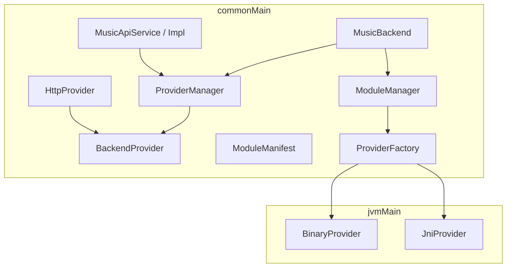
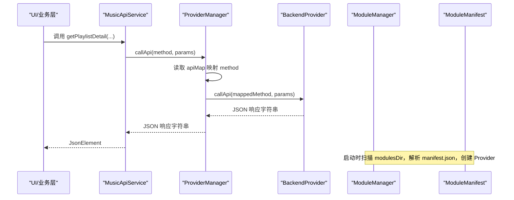
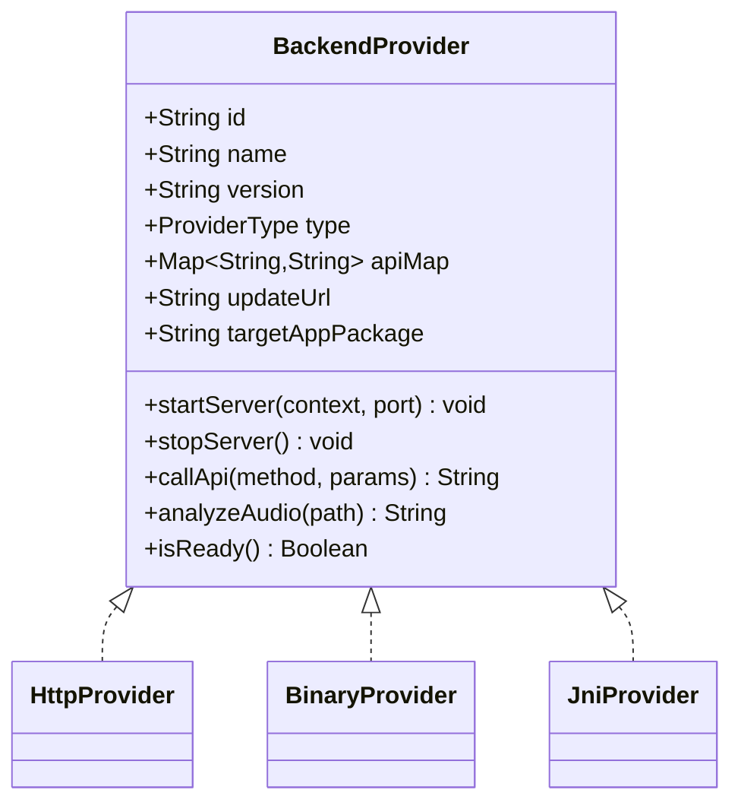
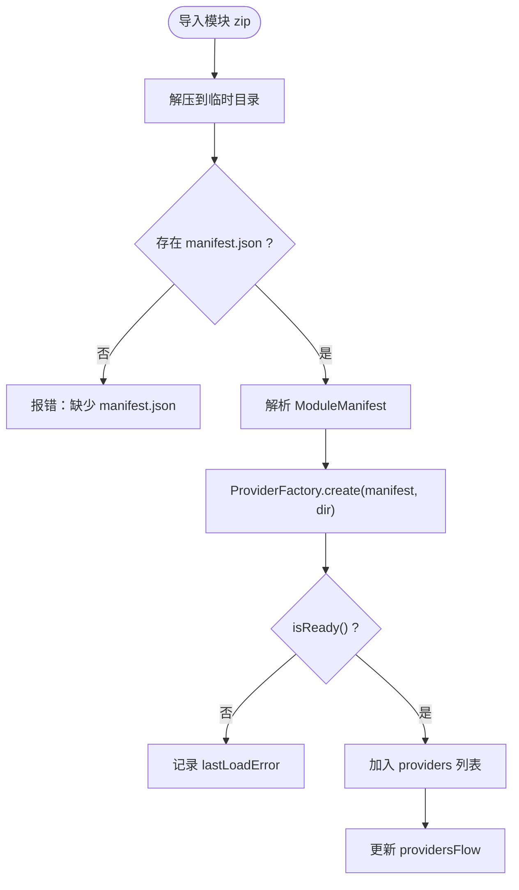
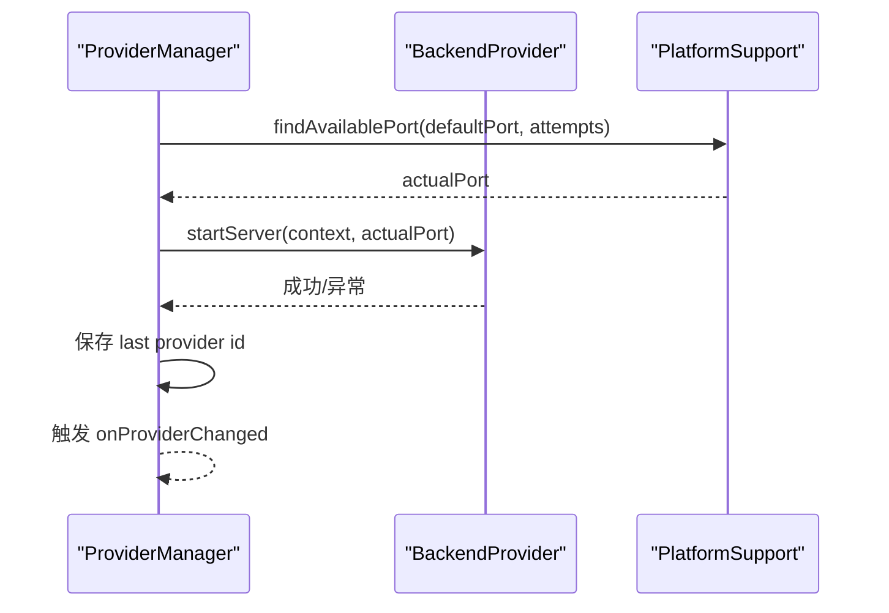
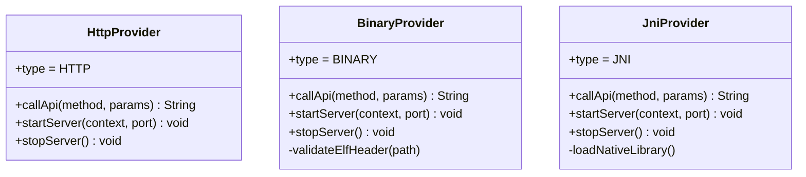
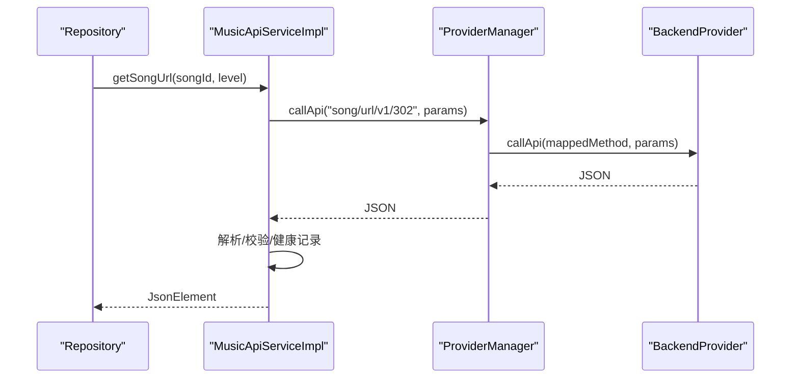
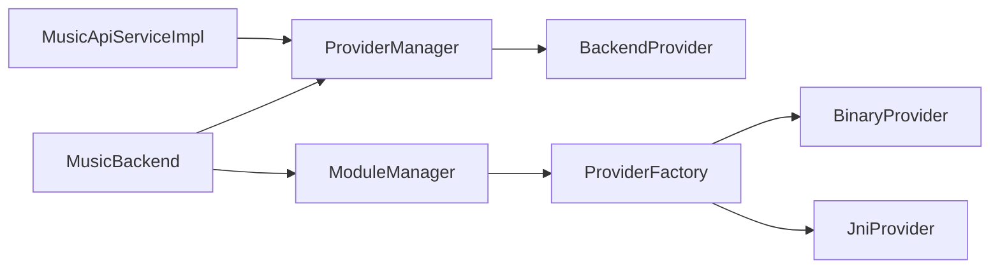

# Provider 架构设计

<cite>
**本文引用的文件**
- [BackendProvider.kt](file://kmp-pro/src/commonMain/kotlin/cp/player/kmp/provider/BackendProvider.kt)
- [ModuleManifest.kt](file://kmp-pro/src/commonMain/kotlin/cp/player/kmp/provider/ModuleManifest.kt)
- [ProviderManager.kt](file://kmp-pro/src/commonMain/kotlin/cp/player/kmp/provider/ProviderManager.kt)
- [ModuleManager.kt](file://kmp-pro/src/commonMain/kotlin/cp/player/kmp/provider/ModuleManager.kt)
- [HttpProvider.kt](file://kmp-pro/src/commonMain/kotlin/cp/player/kmp/provider/HttpProvider.kt)
- [BinaryProvider.kt](file://kmp-pro/src/jvmMain/kotlin/cp/player/kmp/provider/BinaryProvider.kt)
- [JniProvider.kt](file://kmp-pro/src/jvmMain/kotlin/cp/player/kmp/provider/JniProvider.kt)
- [ProviderFactory.kt](file://kmp-pro/src/commonMain/kotlin/cp/player/kmp/provider/ProviderFactory.kt)
- [MusicApiService.kt](file://kmp-pro/src/commonMain/kotlin/cp/player/kmp/api/MusicApiService.kt)
- [MusicApiServiceImpl.kt](file://kmp-pro/src/commonMain/kotlin/cp/player/kmp/api/MusicApiServiceImpl.kt)
- [MusicBackend.kt](file://kmp-pro/src/commonMain/kotlin/cp/player/kmp/MusicBackend.kt)
</cite>

## 目录
1. [简介](#简介)
2. [项目结构](#项目结构)
3. [核心组件](#核心组件)
4. [架构总览](#架构总览)
5. [详细组件分析](#详细组件分析)
6. [依赖关系分析](#依赖关系分析)
7. [性能与可用性考量](#性能与可用性考量)
8. [故障排查指南](#故障排查指南)
9. [结论](#结论)
10. [附录：自定义 BackendProvider 实现指南](#附录自定义-backendprovider-实现指南)

## 简介
本技术文档聚焦 CPPlayer-KMP 的 Provider 插件架构，围绕以下目标展开：
- 深入解释 BackendProvider 接口的设计原理：抽象方法、API 映射机制、生命周期管理。
- 详细说明 ModuleManifest 模块清单的作用与结构：模块元数据、依赖声明、版本兼容性检查。
- 阐述 Provider 插件系统的核心理念：解耦性、可扩展性、热插拔特性。
- 提供架构图展示各组件间关系与数据流向。
- 给出实现自定义 BackendProvider 的实践路径，包括 API 方法映射与错误处理机制。

## 项目结构
Provider 相关代码主要位于 kmp-pro 模块中，按职责分层组织：
- commonMain：跨平台共享的接口、管理器、HTTP Provider、模块清单等。
- jvmMain：JVM 共享实现（Android + Desktop），如 BinaryProvider、JniProvider、网络客户端工厂等。
- androidMain/desktopMain：平台特定能力（例如 JNI 加载、设置存储）。

图表来源
- [MusicBackend.kt:73-179](file://kmp-pro/src/commonMain/kotlin/cp/player/kmp/MusicBackend.kt#L73-L179)
- [ProviderManager.kt:31-145](file://kmp-pro/src/commonMain/kotlin/cp/player/kmp/provider/ProviderManager.kt#L31-L145)
- [ModuleManager.kt:19-137](file://kmp-pro/src/commonMain/kotlin/cp/player/kmp/provider/ModuleManager.kt#L19-L137)
- [BackendProvider.kt:24-110](file://kmp-pro/src/commonMain/kotlin/cp/player/kmp/provider/BackendProvider.kt#L24-L110)
- [HttpProvider.kt:23-60](file://kmp-pro/src/commonMain/kotlin/cp/player/kmp/provider/HttpProvider.kt#L23-L60)
- [BinaryProvider.kt:25-108](file://kmp-pro/src/jvmMain/kotlin/cp/player/kmp/provider/BinaryProvider.kt#L25-L108)
- [JniProvider.kt:9-142](file://kmp-pro/src/jvmMain/kotlin/cp/player/kmp/provider/JniProvider.kt#L9-L142)
- [ProviderFactory.kt:11-29](file://kmp-pro/src/commonMain/kotlin/cp/player/kmp/provider/ProviderFactory.kt#L11-L29)
- [MusicApiService.kt:24-528](file://kmp-pro/src/commonMain/kotlin/cp/player/kmp/api/MusicApiService.kt#L24-L528)

章节来源
- [MusicBackend.kt:73-179](file://kmp-pro/src/commonMain/kotlin/cp/player/kmp/MusicBackend.kt#L73-L179)
- [ProviderManager.kt:31-145](file://kmp-pro/src/commonMain/kotlin/cp/player/kmp/provider/ProviderManager.kt#L31-L145)
- [ModuleManager.kt:19-137](file://kmp-pro/src/commonMain/kotlin/cp/player/kmp/provider/ModuleManager.kt#L19-L137)

## 核心组件
- BackendProvider：统一的后端接入抽象，定义标识、名称、版本、类型、API 映射、更新地址、目标 App 包名、服务启停、API 调用、音频分析、就绪状态检查。
- ProviderManager：当前活跃 Provider 的管理者，负责端口分配、切换、持久化最近选择、统一调用封装与错误返回。
- ModuleManager：模块扫描、导入、卸载、加载；从 manifest.json 解析并创建 Provider，维护可用列表。
- ModuleManifest：模块清单数据结构，描述 id/name/version/type/entryPoint/apiMap/updateUrl/supportedAbis/targetAppPackage。
- HttpProvider/BinaryProvider/JniProvider：三种后端实现，分别对接 HTTP API、独立进程、JNI 本地库。
- MusicApiService/Impl：上层统一 API 入口，自动注入 cookie、健康监控、响应校验、多 Provider 容灾回退。
- MusicBackend：应用级后端门面，聚合 Provider 管理、音乐数据访问、播放控制、健康监控、状态机。

章节来源
- [BackendProvider.kt:24-110](file://kmp-pro/src/commonMain/kotlin/cp/player/kmp/provider/BackendProvider.kt#L24-L110)
- [ProviderManager.kt:31-145](file://kmp-pro/src/commonMain/kotlin/cp/player/kmp/provider/ProviderManager.kt#L31-L145)
- [ModuleManager.kt:19-137](file://kmp-pro/src/commonMain/kotlin/cp/player/kmp/provider/ModuleManager.kt#L19-L137)
- [ModuleManifest.kt:5-31](file://kmp-pro/src/commonMain/kotlin/cp/player/kmp/provider/ModuleManifest.kt#L5-L31)
- [HttpProvider.kt:23-60](file://kmp-pro/src/commonMain/kotlin/cp/player/kmp/provider/HttpProvider.kt#L23-L60)
- [BinaryProvider.kt:25-108](file://kmp-pro/src/jvmMain/kotlin/cp/player/kmp/provider/BinaryProvider.kt#L25-L108)
- [JniProvider.kt:9-142](file://kmp-pro/src/jvmMain/kotlin/cp/player/kmp/provider/JniProvider.kt#L9-L142)
- [MusicApiService.kt:24-528](file://kmp-pro/src/commonMain/kotlin/cp/player/kmp/api/MusicApiService.kt#L24-L528)
- [MusicApiServiceImpl.kt:28-101](file://kmp-pro/src/commonMain/kotlin/cp/player/kmp/api/MusicApiServiceImpl.kt#L28-L101)
- [MusicBackend.kt:73-179](file://kmp-pro/src/commonMain/kotlin/cp/player/kmp/MusicBackend.kt#L73-L179)

## 架构总览
Provider 架构以“接口抽象 + 管理器 + 可插拔实现”为核心，形成清晰的解耦边界：
- 上层通过 MusicApiService 发起请求，内部委托给 ProviderManager。
- ProviderManager 根据当前活跃 Provider，结合 apiMap 将标准方法名映射到具体端点，再调用 BackendProvider.callApi。
- 不同 BackendProvider 实现决定底层通信方式（HTTP、进程、JNI）。
- ModuleManager 负责模块发现与加载，依据 ModuleManifest 创建对应 Provider。
- MusicBackend 作为门面，统一管理状态、缓存、播放、健康监控与 Provider 生命周期。

图表来源
- [MusicApiService.kt:24-528](file://kmp-pro/src/commonMain/kotlin/cp/player/kmp/api/MusicApiService.kt#L24-L528)
- [MusicApiServiceImpl.kt:28-101](file://kmp-pro/src/commonMain/kotlin/cp/player/kmp/api/MusicApiServiceImpl.kt#L28-L101)
- [ProviderManager.kt:129-141](file://kmp-pro/src/commonMain/kotlin/cp/player/kmp/provider/ProviderManager.kt#L129-L141)
- [BackendProvider.kt:70-85](file://kmp-pro/src/commonMain/kotlin/cp/player/kmp/provider/BackendProvider.kt#L70-L85)
- [ModuleManager.kt:50-117](file://kmp-pro/src/commonMain/kotlin/cp/player/kmp/provider/ModuleManager.kt#L50-L117)
- [ModuleManifest.kt:5-31](file://kmp-pro/src/commonMain/kotlin/cp/player/kmp/provider/ModuleManifest.kt#L5-L31)

## 详细组件分析

### BackendProvider 接口设计
- 抽象方法定义：
  - startServer(context, port)：启动后端服务（HTTP 为空操作，二进制/JNI 需实际启动）。
  - stopServer()：停止后端服务。
  - callApi(method, params)：执行 API 调用，返回 JSON 字符串。
  - analyzeAudio(path)：可选音频分析。
  - isReady()：检查就绪状态（默认 true，JNI 可能失败）。
- API 映射机制：
  - apiMap 将 CPPlayer 内部标准方法名映射到 Provider 实际端点名；若为 "unsupported" 表示不支持；null 则直接使用内部方法名。
- 生命周期管理：
  - 由 ProviderManager 在切换时先停止旧 Provider，再启动新 Provider，并记录端口。
  - 通过 StateFlow 暴露当前 Provider 变更，供 UI 观察。

图表来源
- [BackendProvider.kt:24-110](file://kmp-pro/src/commonMain/kotlin/cp/player/kmp/provider/BackendProvider.kt#L24-L110)
- [HttpProvider.kt:23-60](file://kmp-pro/src/commonMain/kotlin/cp/player/kmp/provider/HttpProvider.kt#L23-L60)
- [BinaryProvider.kt:25-108](file://kmp-pro/src/jvmMain/kotlin/cp/player/kmp/provider/BinaryProvider.kt#L25-L108)
- [JniProvider.kt:9-142](file://kmp-pro/src/jvmMain/kotlin/cp/player/kmp/provider/JniProvider.kt#L9-L142)

章节来源
- [BackendProvider.kt:24-110](file://kmp-pro/src/commonMain/kotlin/cp/player/kmp/provider/BackendProvider.kt#L24-L110)
- [ProviderManager.kt:65-109](file://kmp-pro/src/commonMain/kotlin/cp/player/kmp/provider/ProviderManager.kt#L65-L109)

### ModuleManifest 模块清单
- 作用：描述模块元数据与加载所需信息，用于 ModuleManager 解析并创建对应 Provider。
- 关键字段：
  - id/name/version/type：模块标识、显示名、版本、类型（jni/binary/http）。
  - entryPoint：入口（链接库/二进制或 http entryPoint）。
  - apiMap：方法映射表。
  - updateUrl：检查更新 URL。
  - supportedAbis：支持的 CPU 架构列表，用于选择正确的 native library。
  - targetAppPackage：目标 App 包名（Android 登录跳转用）。

图表来源
- [ModuleManager.kt:57-117](file://kmp-pro/src/commonMain/kotlin/cp/player/kmp/provider/ModuleManager.kt#L57-L117)
- [ModuleManifest.kt:5-31](file://kmp-pro/src/commonMain/kotlin/cp/player/kmp/provider/ModuleManifest.kt#L5-L31)

章节来源
- [ModuleManifest.kt:5-31](file://kmp-pro/src/commonMain/kotlin/cp/player/kmp/provider/ModuleManifest.kt#L5-L31)
- [ModuleManager.kt:57-117](file://kmp-pro/src/commonMain/kotlin/cp/player/kmp/provider/ModuleManager.kt#L57-L117)

### ProviderManager 与生命周期
- 端口管理：使用 PlatformSupport.findAvailablePort 在默认端口附近寻找可用端口，避免冲突。
- 切换流程：
  - 停止旧 Provider 服务。
  - 为新 Provider 分配端口并启动。
  - 保存最近选择的 Provider ID。
  - 通知监听器，更新 StateFlow。
- 统一调用：
  - 通过 apiMap 映射方法名。
  - 若映射为空或 "unsupported"，返回不支持提示。
  - 捕获异常并返回统一错误格式。

图表来源
- [ProviderManager.kt:65-109](file://kmp-pro/src/commonMain/kotlin/cp/player/kmp/provider/ProviderManager.kt#L65-L109)
- [ProviderManager.kt:129-141](file://kmp-pro/src/commonMain/kotlin/cp/player/kmp/provider/ProviderManager.kt#L129-L141)

章节来源
- [ProviderManager.kt:65-109](file://kmp-pro/src/commonMain/kotlin/cp/player/kmp/provider/ProviderManager.kt#L65-L109)
- [ProviderManager.kt:129-141](file://kmp-pro/src/commonMain/kotlin/cp/player/kmp/provider/ProviderManager.kt#L129-L141)

### 三种 Provider 实现对比
- HttpProvider：
  - 适用于已有 HTTP API 服务（如 NeteaseCloudMusicApi）。
  - startServer/stopServer 为空操作，直接通过 Ktor 发送 POST 请求。
  - 错误统一包装为 JSON 响应。
- BinaryProvider：
  - 启动独立可执行文件，参数 --port <port>。
  - 通信：HTTP POST 到 http://127.0.0.1:port/api/<method>。
  - 启动前进行 ELF 头校验，确保二进制文件有效。
- JniProvider：
  - 通过 System.load 加载 .so/.dll/.dylib。
  - external fun 暴露 startNativeServer/nativeCallApi/analyzeAudioFile。
  - 启动失败或调用崩溃会记录 loadError，后续调用返回错误 JSON。

图表来源
- [HttpProvider.kt:23-60](file://kmp-pro/src/commonMain/kotlin/cp/player/kmp/provider/HttpProvider.kt#L23-L60)
- [BinaryProvider.kt:25-108](file://kmp-pro/src/jvmMain/kotlin/cp/player/kmp/provider/BinaryProvider.kt#L25-L108)
- [JniProvider.kt:9-142](file://kmp-pro/src/jvmMain/kotlin/cp/player/kmp/provider/JniProvider.kt#L9-L142)

章节来源
- [HttpProvider.kt:23-60](file://kmp-pro/src/commonMain/kotlin/cp/player/kmp/provider/HttpProvider.kt#L23-L60)
- [BinaryProvider.kt:25-108](file://kmp-pro/src/jvmMain/kotlin/cp/player/kmp/provider/BinaryProvider.kt#L25-L108)
- [JniProvider.kt:9-142](file://kmp-pro/src/jvmMain/kotlin/cp/player/kmp/provider/JniProvider.kt#L9-L142)

### MusicApiService 与统一调用链
- 统一入口：所有音乐 API 调用都通过 MusicApiService，禁止直接调用 ProviderManager。
- Cookie 注入：自动按 Provider 隔离注入 cookie，登录动作接口特殊处理。
- 健康监控：记录每次调用的时长、成功与否、级别分类（OK/WARNING/ERROR）、错误信息与警告。
- 容灾回退：对关键接口（如歌曲 URL）支持多 Provider 尝试，优先当前 Provider，失败则尝试其他。

图表来源
- [MusicApiServiceImpl.kt:28-101](file://kmp-pro/src/commonMain/kotlin/cp/player/kmp/api/MusicApiServiceImpl.kt#L28-L101)
- [MusicApiServiceImpl.kt:189-207](file://kmp-pro/src/commonMain/kotlin/cp/player/kmp/api/MusicApiServiceImpl.kt#L189-L207)
- [ProviderManager.kt:129-141](file://kmp-pro/src/commonMain/kotlin/cp/player/kmp/provider/ProviderManager.kt#L129-L141)

章节来源
- [MusicApiService.kt:24-528](file://kmp-pro/src/commonMain/kotlin/cp/player/kmp/api/MusicApiService.kt#L24-L528)
- [MusicApiServiceImpl.kt:28-101](file://kmp-pro/src/commonMain/kotlin/cp/player/kmp/api/MusicApiServiceImpl.kt#L28-L101)
- [MusicApiServiceImpl.kt:189-207](file://kmp-pro/src/commonMain/kotlin/cp/player/kmp/api/MusicApiServiceImpl.kt#L189-L207)

## 依赖关系分析
- 耦合与内聚：
  - BackendProvider 作为稳定接口，屏蔽底层差异，提高内聚性。
  - ProviderManager 仅依赖 BackendProvider 接口，降低与实现的耦合。
  - ModuleManager 通过 ProviderFactory 创建具体 Provider，解耦模块加载与实现细节。
- 外部依赖：
  - Ktor 用于 HTTP 通信。
  - kotlinx-serialization 用于 JSON 解析。
  - PlatformSupport 提供跨平台文件/进程/ELF 校验能力。
- 循环依赖：
  - 未发现明显循环依赖；MusicBackend 聚合各组件但不反向强依赖。

图表来源
- [MusicApiServiceImpl.kt:28-101](file://kmp-pro/src/commonMain/kotlin/cp/player/kmp/api/MusicApiServiceImpl.kt#L28-L101)
- [ProviderManager.kt:31-145](file://kmp-pro/src/commonMain/kotlin/cp/player/kmp/provider/ProviderManager.kt#L31-L145)
- [ModuleManager.kt:19-137](file://kmp-pro/src/commonMain/kotlin/cp/player/kmp/provider/ModuleManager.kt#L19-L137)
- [ProviderFactory.kt:11-29](file://kmp-pro/src/commonMain/kotlin/cp/player/kmp/provider/ProviderFactory.kt#L11-L29)
- [MusicBackend.kt:73-179](file://kmp-pro/src/commonMain/kotlin/cp/player/kmp/MusicBackend.kt#L73-L179)

章节来源
- [MusicApiServiceImpl.kt:28-101](file://kmp-pro/src/commonMain/kotlin/cp/player/kmp/api/MusicApiServiceImpl.kt#L28-L101)
- [ProviderManager.kt:31-145](file://kmp-pro/src/commonMain/kotlin/cp/player/kmp/provider/ProviderManager.kt#L31-L145)
- [ModuleManager.kt:19-137](file://kmp-pro/src/commonMain/kotlin/cp/player/kmp/provider/ModuleManager.kt#L19-L137)
- [ProviderFactory.kt:11-29](file://kmp-pro/src/commonMain/kotlin/cp/player/kmp/provider/ProviderFactory.kt#L11-L29)
- [MusicBackend.kt:73-179](file://kmp-pro/src/commonMain/kotlin/cp/player/kmp/MusicBackend.kt#L73-L179)

## 性能与可用性考量
- 端口冲突处理：ProviderManager 在默认端口附近尝试多个端口，提升启动成功率。
- 异步与线程：ProviderManager.callApi 在 IO 调度器执行，避免阻塞主线程。
- 健康监控：MusicApiServiceImpl 记录每次调用的耗时、成功与否、级别分类，便于定位慢接口与异常。
- 容灾回退：对关键接口（如歌曲 URL）支持多 Provider 尝试，提高可用性。
- 缓存层：CachedMusicApiService 提供缓存与指纹比对，减少重复网络请求。

[本节为通用指导，不直接分析具体文件]

## 故障排查指南
- 模块加载失败：
  - 检查 manifest.json 是否存在且格式正确。
  - 查看 ModuleManager.lastLoadError 获取详细错误信息。
- Provider 未就绪：
  - 对于 JNI 类型，检查 SO 文件是否存在、权限是否足够、ELF 头是否有效。
  - 对于 Binary 类型，检查二进制文件是否存在、是否可执行、ELF 校验是否通过。
- API 调用失败：
  - 检查 apiMap 是否正确映射方法名。
  - 查看 MusicApiServiceImpl 的健康监控记录，确认错误码与消息。
- 端口占用：
  - 确认默认端口及附近端口未被占用，必要时调整起始端口。

章节来源
- [ModuleManager.kt:57-117](file://kmp-pro/src/commonMain/kotlin/cp/player/kmp/provider/ModuleManager.kt#L57-L117)
- [JniProvider.kt:98-136](file://kmp-pro/src/jvmMain/kotlin/cp/player/kmp/provider/JniProvider.kt#L98-L136)
- [BinaryProvider.kt:54-81](file://kmp-pro/src/jvmMain/kotlin/cp/player/kmp/provider/BinaryProvider.kt#L54-L81)
- [MusicApiServiceImpl.kt:28-101](file://kmp-pro/src/commonMain/kotlin/cp/player/kmp/api/MusicApiServiceImpl.kt#L28-L101)

## 结论
CPPlayer-KMP 的 Provider 架构通过清晰的接口抽象、模块化管理和统一的调用入口，实现了高度的解耦与可扩展性。BackendProvider 定义了稳定的契约，ModuleManifest 提供了模块描述与兼容性信息，ProviderManager 与 ModuleManager 协同完成生命周期管理与模块加载。MusicApiService 与健康监控进一步提升了可用性与可观测性。该架构支持热插拔与多后端并存，便于扩展新的音源实现。

[本节为总结，不直接分析具体文件]

## 附录：自定义 BackendProvider 实现指南
- 步骤概览：
  - 定义模块清单：在模块目录创建 manifest.json，填写 id/name/version/type/entryPoint/apiMap/updateUrl/supportedAbis/targetAppPackage。
  - 实现 BackendProvider：根据类型选择 HttpProvider/BinaryProvider/JniProvider 或自定义实现，实现 startServer/stopServer/callApi/analyzeAudio/isReady。
  - 注册与加载：通过 ModuleManager 扫描模块目录，解析 manifest.json 并创建 Provider。
  - 切换与使用：通过 ProviderManager 切换当前 Provider，并通过 MusicApiService 调用 API。
- API 方法映射：
  - 在 manifest.json 或 Provider 构造中提供 apiMap，将内部标准方法名映射到 Provider 实际端点名。
  - 若某功能不支持，可将映射值设为 "unsupported"，上层将返回不支持提示。
- 错误处理机制：
  - 统一返回 JSON 格式，包含 code 与 msg 字段。
  - 捕获异常并转换为错误响应，避免上层崩溃。
  - 利用 HealthMonitor 记录错误与警告，便于诊断。

章节来源
- [ModuleManifest.kt:5-31](file://kmp-pro/src/commonMain/kotlin/cp/player/kmp/provider/ModuleManifest.kt#L5-L31)
- [BackendProvider.kt:24-110](file://kmp-pro/src/commonMain/kotlin/cp/player/kmp/provider/BackendProvider.kt#L24-L110)
- [ModuleManager.kt:57-117](file://kmp-pro/src/commonMain/kotlin/cp/player/kmp/provider/ModuleManager.kt#L57-L117)
- [ProviderManager.kt:129-141](file://kmp-pro/src/commonMain/kotlin/cp/player/kmp/provider/ProviderManager.kt#L129-L141)
- [MusicApiServiceImpl.kt:28-101](file://kmp-pro/src/commonMain/kotlin/cp/player/kmp/api/MusicApiServiceImpl.kt#L28-L101)