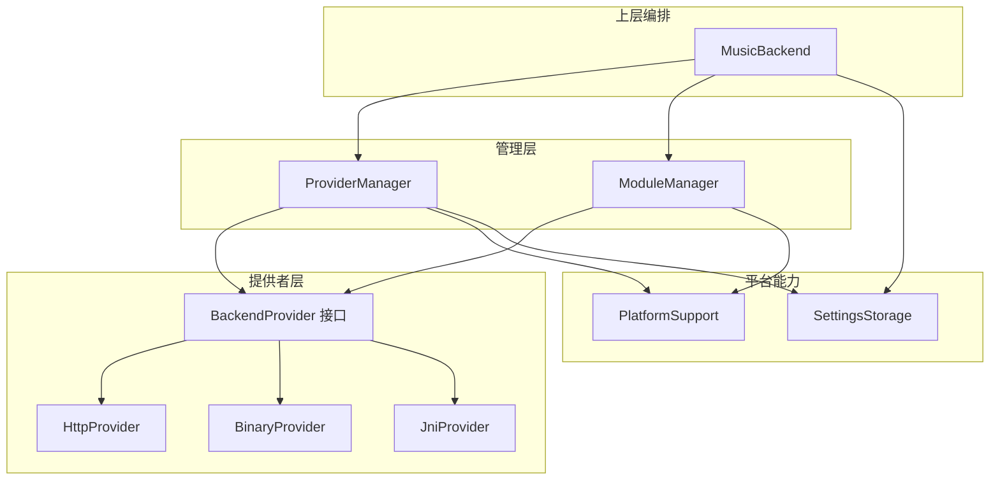
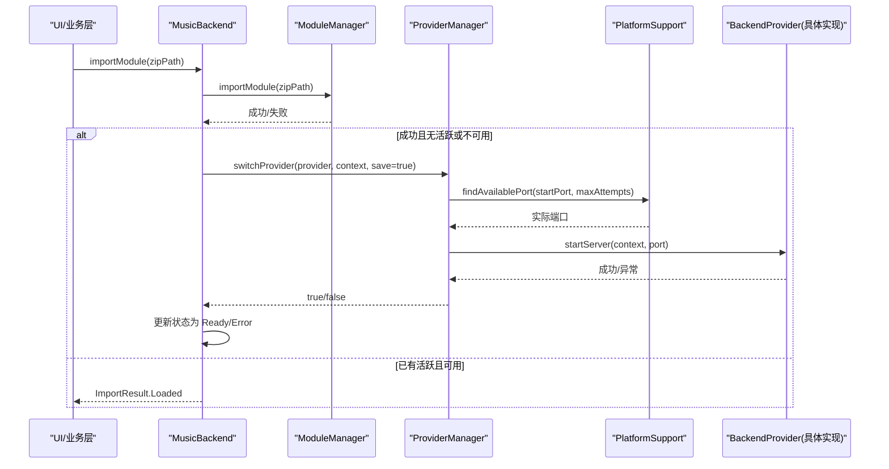
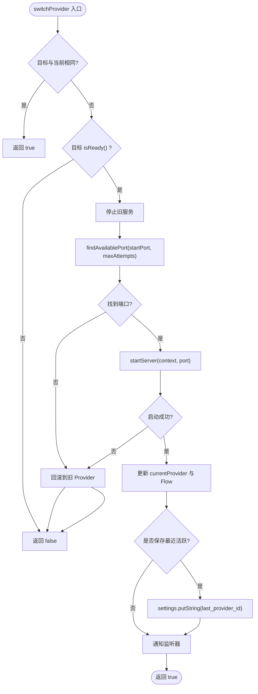
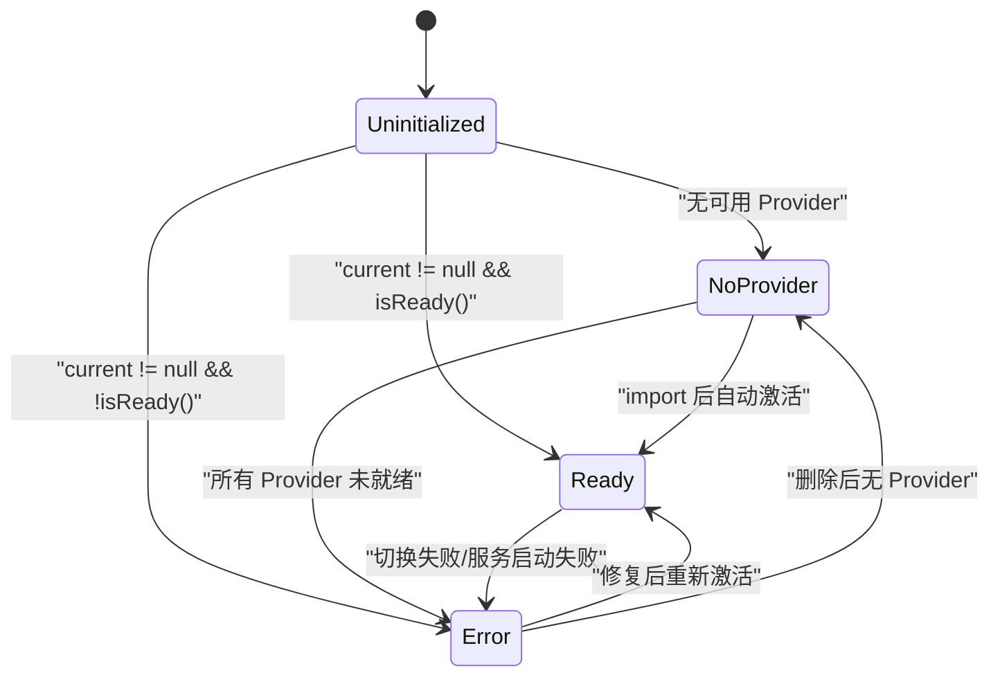
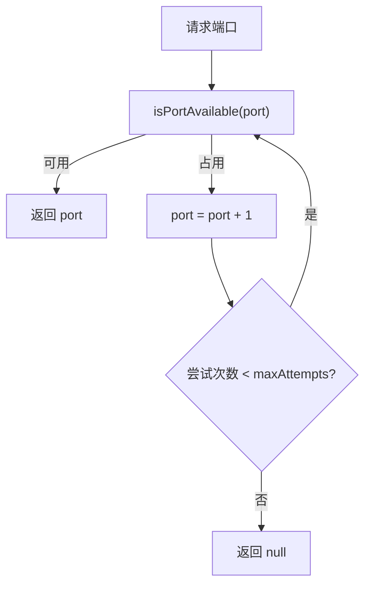
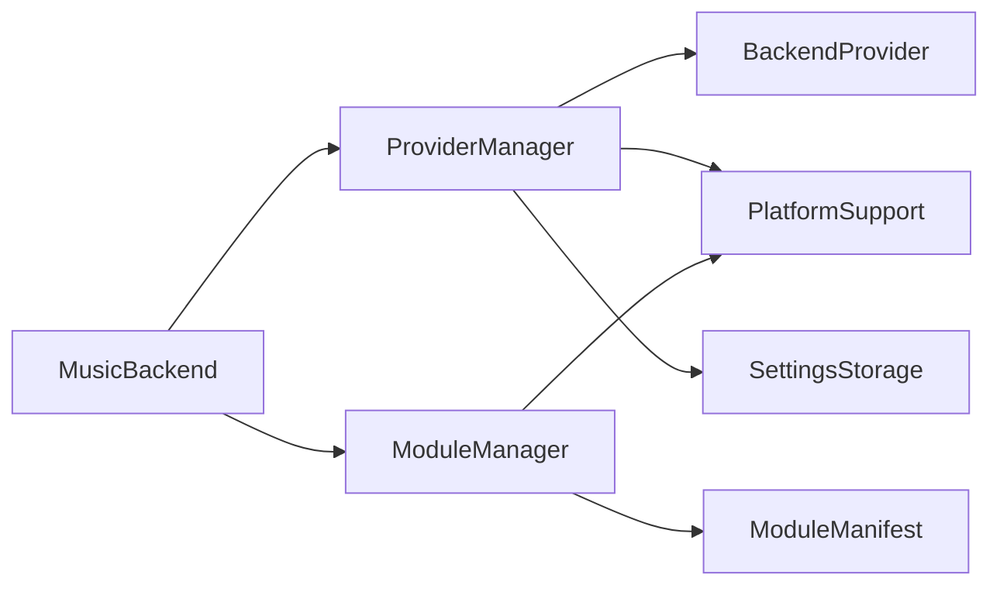

# Provider 生命周期管理

<cite>
**本文引用的文件**
- [ProviderManager.kt](file://kmp-pro/src/commonMain/kotlin/cp/player/kmp/provider/ProviderManager.kt)
- [BackendProvider.kt](file://kmp-pro/src/commonMain/kotlin/cp/player/kmp/provider/BackendProvider.kt)
- [HttpProvider.kt](file://kmp-pro/src/commonMain/kotlin/cp/player/kmp/provider/HttpProvider.kt)
- [BinaryProvider.kt](file://kmp-pro/src/jvmMain/kotlin/cp/player/kmp/provider/BinaryProvider.kt)
- [JniProvider.kt](file://kmp-pro/src/jvmMain/kotlin/cp/player/kmp/provider/JniProvider.kt)
- [ModuleManager.kt](file://kmp-pro/src/commonMain/kotlin/cp/player/kmp/provider/ModuleManager.kt)
- [ModuleManifest.kt](file://kmp-pro/src/commonMain/kotlin/cp/player/kmp/provider/ModuleManifest.kt)
- [PlatformSupport.kt](file://kmp-pro/src/commonMain/kotlin/cp/player/kmp/util/PlatformSupport.kt)
- [PlatformSupport.kt](file://kmp-pro/src/jvmMain/kotlin/cp/player/kmp/util/PlatformSupport.kt)
- [SettingsStorage.kt](file://kmp-pro/src/commonMain/kotlin/cp/player/kmp/util/SettingsStorage.kt)
- [MusicBackend.kt](file://kmp-pro/src/commonMain/kotlin/cp/player/kmp/MusicBackend.kt)
</cite>

## 目录
1. [简介](#简介)
2. [项目结构](#项目结构)
3. [核心组件](#核心组件)
4. [架构总览](#架构总览)
5. [详细组件分析](#详细组件分析)
6. [依赖关系分析](#依赖关系分析)
7. [性能考虑](#性能考虑)
8. [故障排查指南](#故障排查指南)
9. [结论](#结论)
10. [附录](#附录)

## 简介
本技术文档聚焦于 CPPlayer-KMP 的 Provider 生命周期管理，围绕 ProviderManager 如何管理 Provider 的创建、激活、切换、暂停与销毁展开。文档同时阐述状态机设计（由 MusicBackend 驱动）、端口管理机制（分配、冲突检测与自动回退）、Cookie 存储隔离机制（按 Provider 隔离会话），并给出并发安全与线程模型说明。文末提供常见问题的定位思路与最佳实践建议。

## 项目结构
CPPlayer-KMP 将 Provider 相关能力集中在 kmp-pro 模块中：
- 接口与抽象：BackendProvider 定义统一的后端接入契约；ProviderType 枚举标识实现类型。
- 管理器：ProviderManager 负责活跃 Provider 的生命周期与切换；ModuleManager 负责模块加载、导入与可用 Provider 列表维护。
- 具体实现：HttpProvider（HTTP API）、BinaryProvider（独立进程）、JniProvider（JNI 本地库）。
- 平台支持：PlatformSupport 提供跨平台的端口探测、文件操作、ELF 校验等能力。
- 上层编排：MusicBackend 作为后端统一入口，封装状态机、错误处理与自动激活策略。

图表来源
- [BackendProvider.kt:24-96](file://kmp-pro/src/commonMain/kotlin/cp/player/kmp/provider/BackendProvider.kt#L24-L96)
- [ProviderManager.kt:31-145](file://kmp-pro/src/commonMain/kotlin/cp/player/kmp/provider/ProviderManager.kt#L31-L145)
- [ModuleManager.kt:19-137](file://kmp-pro/src/commonMain/kotlin/cp/player/kmp/provider/ModuleManager.kt#L19-L137)
- [PlatformSupport.kt:13-59](file://kmp-pro/src/commonMain/kotlin/cp/player/kmp/util/PlatformSupport.kt#L13-L59)
- [PlatformSupport.kt:17-135](file://kmp-pro/src/jvmMain/kotlin/cp/player/kmp/util/PlatformSupport.kt#L17-L135)
- [MusicBackend.kt:73-389](file://kmp-pro/src/commonMain/kotlin/cp/player/kmp/MusicBackend.kt#L73-L389)

章节来源
- [BackendProvider.kt:24-110](file://kmp-pro/src/commonMain/kotlin/cp/player/kmp/provider/BackendProvider.kt#L24-L110)
- [ProviderManager.kt:31-145](file://kmp-pro/src/commonMain/kotlin/cp/player/kmp/provider/ProviderManager.kt#L31-L145)
- [ModuleManager.kt:19-137](file://kmp-pro/src/commonMain/kotlin/cp/player/kmp/provider/ModuleManager.kt#L19-L137)
- [PlatformSupport.kt:13-59](file://kmp-pro/src/commonMain/kotlin/cp/player/kmp/util/PlatformSupport.kt#L13-L59)
- [PlatformSupport.kt:17-135](file://kmp-pro/src/jvmMain/kotlin/cp/player/kmp/util/PlatformSupport.kt#L17-L135)
- [MusicBackend.kt:73-389](file://kmp-pro/src/commonMain/kotlin/cp/player/kmp/MusicBackend.kt#L73-L389)

## 核心组件
- BackendProvider：定义 Provider 的统一契约，包括 id/name/version/type、API 映射、启动/停止服务、调用 API、音频分析、就绪检查等。
- ProviderManager：管理当前活跃 Provider、端口选择与回退、切换流程、持久化最近活跃 Provider、暴露 StateFlow 供 UI 观察。
- ModuleManager：扫描/导入/删除模块，加载 manifest，创建 Provider 实例，维护可用 Provider 列表，并在初始化时尝试恢复或自动选择首个可用 Provider。
- 具体 Provider 实现：
  - HttpProvider：通过 Ktor HTTP 客户端调用外部 API，startServer/stopServer 为空操作。
  - BinaryProvider：启动独立可执行进程并通过 HTTP 通信，包含 ELF 校验与进程生命周期管理。
  - JniProvider：加载 .so 并调用 native 方法，包含加载失败与崩溃保护。
- PlatformSupport：跨平台能力抽象，提供端口探测、解压、文件读写、ABI 解析、ELF 校验等。
- SettingsStorage：键值存储抽象，用于 Cookie、最近 Provider ID 等持久化。
- MusicBackend：后端统一入口，封装状态机、错误处理、自动激活策略，协调 ProviderManager 与 ModuleManager。

章节来源
- [BackendProvider.kt:24-110](file://kmp-pro/src/commonMain/kotlin/cp/player/kmp/provider/BackendProvider.kt#L24-L110)
- [ProviderManager.kt:31-145](file://kmp-pro/src/commonMain/kotlin/cp/player/kmp/provider/ProviderManager.kt#L31-L145)
- [ModuleManager.kt:19-137](file://kmp-pro/src/commonMain/kotlin/cp/player/kmp/provider/ModuleManager.kt#L19-L137)
- [HttpProvider.kt:23-60](file://kmp-pro/src/commonMain/kotlin/cp/player/kmp/provider/HttpProvider.kt#L23-L60)
- [BinaryProvider.kt:25-108](file://kmp-pro/src/jvmMain/kotlin/cp/player/kmp/provider/BinaryProvider.kt#L25-L108)
- [JniProvider.kt:9-142](file://kmp-pro/src/jvmMain/kotlin/cp/player/kmp/provider/JniProvider.kt#L9-L142)
- [PlatformSupport.kt:13-59](file://kmp-pro/src/commonMain/kotlin/cp/player/kmp/util/PlatformSupport.kt#L13-L59)
- [PlatformSupport.kt:17-135](file://kmp-pro/src/jvmMain/kotlin/cp/player/kmp/util/PlatformSupport.kt#L17-L135)
- [SettingsStorage.kt:12-25](file://kmp-pro/src/commonMain/kotlin/cp/player/kmp/util/SettingsStorage.kt#L12-L25)
- [MusicBackend.kt:73-389](file://kmp-pro/src/commonMain/kotlin/cp/player/kmp/MusicBackend.kt#L73-L389)

## 架构总览
Provider 生命周期由 MusicBackend 的状态机驱动，ProviderManager 负责具体切换与端口管理，ModuleManager 负责模块加载与可用 Provider 列表，具体 Provider 实现各自管理底层资源（进程、JNI、HTTP 连接）。

图表来源
- [MusicBackend.kt:189-204](file://kmp-pro/src/commonMain/kotlin/cp/player/kmp/MusicBackend.kt#L189-L204)
- [ModuleManager.kt:57-86](file://kmp-pro/src/commonMain/kotlin/cp/player/kmp/provider/ModuleManager.kt#L57-L86)
- [ProviderManager.kt:80-109](file://kmp-pro/src/commonMain/kotlin/cp/player/kmp/provider/ProviderManager.kt#L80-L109)
- [PlatformSupport.kt:25-31](file://kmp-pro/src/jvmMain/kotlin/cp/player/kmp/util/PlatformSupport.kt#L25-L31)

章节来源
- [MusicBackend.kt:189-204](file://kmp-pro/src/commonMain/kotlin/cp/player/kmp/MusicBackend.kt#L189-L204)
- [ModuleManager.kt:57-86](file://kmp-pro/src/commonMain/kotlin/cp/player/kmp/provider/ModuleManager.kt#L57-L86)
- [ProviderManager.kt:80-109](file://kmp-pro/src/commonMain/kotlin/cp/player/kmp/provider/ProviderManager.kt#L80-L109)
- [PlatformSupport.kt:25-31](file://kmp-pro/src/jvmMain/kotlin/cp/player/kmp/util/PlatformSupport.kt#L25-L31)

## 详细组件分析

### ProviderManager：生命周期与端口管理
- 职责
  - 维护当前活跃 Provider 与端口。
  - 切换 Provider：先停止旧服务，再为新 Provider 寻找可用端口并启动。
  - 持久化最近活跃的 Provider ID。
  - 暴露 currentProviderFlow 给 UI 观察。
  - 提供 callApi 转发到当前 Provider，并处理不支持与异常。
- 端口管理
  - 使用 PlatformSupport.findAvailablePort 从默认端口开始尝试，最多尝试指定次数。
  - 若全部占用则返回 false，保持旧 Provider 不变。
- 切换流程
  - 若目标与当前相同直接返回成功。
  - 若目标未就绪则拒绝切换。
  - 停止旧服务后尝试新服务启动，失败则回滚到旧 Provider。
  - 成功后更新 currentProvider 与 Flow，并可选持久化。
- 监听器
  - 提供 add/removeOnProviderChangedListener，变更时通知所有监听器。

图表来源
- [ProviderManager.kt:80-109](file://kmp-pro/src/commonMain/kotlin/cp/player/kmp/provider/ProviderManager.kt#L80-L109)
- [PlatformSupport.kt:25-31](file://kmp-pro/src/jvmMain/kotlin/cp/player/kmp/util/PlatformSupport.kt#L25-L31)

章节来源
- [ProviderManager.kt:31-145](file://kmp-pro/src/commonMain/kotlin/cp/player/kmp/provider/ProviderManager.kt#L31-L145)

### 状态机设计（MusicBackend）
- 状态
  - Uninitialized：尚未初始化。
  - NoProvider：无可用 Provider。
  - Ready(provider)：有活跃且就绪的 Provider。
  - Error(message)：存在错误（如切换失败、服务启动失败）。
- 转换条件
  - 初始化完成后根据 currentProvider 与 isReady() 计算终态。
  - 导入模块后若无活跃或当前不可用，自动激活首个可用 Provider。
  - 删除模块时若删除的是当前活跃，尝试切换到剩余第一个；否则若无剩余则进入 NoProvider。
  - 切换失败或 Provider 未就绪时进入 Error。
- 事件触发
  - importModule：导入并可能自动激活。
  - switchProvider/switchProviderById：显式切换。
  - deleteModule：删除模块并处理状态迁移。

图表来源
- [MusicBackend.kt:373-388](file://kmp-pro/src/commonMain/kotlin/cp/player/kmp/MusicBackend.kt#L373-L388)
- [MusicBackend.kt:189-204](file://kmp-pro/src/commonMain/kotlin/cp/player/kmp/MusicBackend.kt#L189-L204)
- [MusicBackend.kt:229-242](file://kmp-pro/src/commonMain/kotlin/cp/player/kmp/MusicBackend.kt#L229-L242)

章节来源
- [MusicBackend.kt:189-204](file://kmp-pro/src/commonMain/kotlin/cp/player/kmp/MusicBackend.kt#L189-L204)
- [MusicBackend.kt:229-242](file://kmp-pro/src/commonMain/kotlin/cp/player/kmp/MusicBackend.kt#L229-L242)
- [MusicBackend.kt:373-388](file://kmp-pro/src/commonMain/kotlin/cp/player/kmp/MusicBackend.kt#L373-L388)

### 端口管理机制
- 分配策略
  - 从默认端口开始，依次尝试直到找到可用端口或达到最大尝试次数。
  - 使用 PlatformSupport.isPortAvailable 进行探测。
- 冲突检测
  - 基于 ServerSocket 绑定测试端口可用性。
- 自动回退
  - 若无法找到可用端口，ProviderManager 在切换时回滚到旧 Provider，避免中断服务。
- 适用场景
  - BinaryProvider 启动进程时传入 --port。
  - HttpProvider 由外部服务监听，但 Manager 仍记录当前端口。

图表来源
- [PlatformSupport.kt:25-31](file://kmp-pro/src/jvmMain/kotlin/cp/player/kmp/util/PlatformSupport.kt#L25-L31)
- [ProviderManager.kt:65-73](file://kmp-pro/src/commonMain/kotlin/cp/player/kmp/provider/ProviderManager.kt#L65-L73)

章节来源
- [PlatformSupport.kt:25-31](file://kmp-pro/src/jvmMain/kotlin/cp/player/kmp/util/PlatformSupport.kt#L25-L31)
- [ProviderManager.kt:65-73](file://kmp-pro/src/commonMain/kotlin/cp/player/kmp/provider/ProviderManager.kt#L65-L73)

### Cookie 存储隔离机制
- 设计要点
  - 通过 ProviderCookieStorage 包装 SettingsStorage，以 cookie_<providerId> 为键名，确保不同 Provider 的 Cookie 互不干扰。
  - 登录/登出时直接使用 MusicBackend.cookieStorage 存取对应 Provider 的 Cookie。
- 行为
  - saveCookie(providerId, cookie)：写入隔离键。
  - getCookie(providerId)：读取对应 Cookie。
  - clear(providerId)：清理对应 Cookie。
- 优势
  - 简单可靠，无需额外命名空间；切换 Provider 即切换会话上下文。

章节来源
- [ProviderManager.kt:147-156](file://kmp-pro/src/commonMain/kotlin/cp/player/kmp/provider/ProviderManager.kt#L147-L156)
- [MusicBackend.kt:90-93](file://kmp-pro/src/commonMain/kotlin/cp/player/kmp/MusicBackend.kt#L90-L93)
- [SettingsStorage.kt:12-25](file://kmp-pro/src/commonMain/kotlin/cp/player/kmp/util/SettingsStorage.kt#L12-L25)

### 具体 Provider 实现分析

#### HttpProvider
- 特点
  - 通过 Ktor HTTP 客户端调用外部 API，startServer/stopServer 为空操作。
  - callApi 构造 JSON 请求体并同步返回响应文本。
- 错误处理
  - 捕获异常并返回标准错误 JSON。

章节来源
- [HttpProvider.kt:23-60](file://kmp-pro/src/commonMain/kotlin/cp/player/kmp/provider/HttpProvider.kt#L23-L60)

#### BinaryProvider
- 特点
  - 启动独立进程，参数包含端口；通过 HTTP POST 到 127.0.0.1:<port>/api/<method>。
  - 启动前校验二进制文件存在性与 ELF 头合法性。
- 错误处理
  - 启动失败设置 loadError 并抛出异常；callApi 在未就绪时返回错误 JSON。

章节来源
- [BinaryProvider.kt:25-108](file://kmp-pro/src/jvmMain/kotlin/cp/player/kmp/provider/BinaryProvider.kt#L25-L108)
- [PlatformSupport.kt:89-121](file://kmp-pro/src/jvmMain/kotlin/cp/player/kmp/util/PlatformSupport.kt#L89-L121)

#### JniProvider
- 特点
  - 加载 .so 并调用 native 方法；startServer 调用 startNativeServer 启动本地服务。
  - 提供 analyzeAudioFile 原生能力。
- 错误处理
  - 加载失败设置 loadError；调用崩溃时重置状态并返回错误 JSON。

章节来源
- [JniProvider.kt:9-142](file://kmp-pro/src/jvmMain/kotlin/cp/player/kmp/provider/JniProvider.kt#L9-L142)

### 模块加载与清单
- ModuleManifest
  - 描述模块 id/name/version/type/entryPoint/apiMap/updateUrl/targetAppPackage/supportedAbis。
- ModuleManager
  - 扫描 modulesDir，加载每个子目录的 manifest.json，创建 Provider。
  - 导入 zip 包时解压、校验、移动至目标目录并加载。
  - 初始化时尝试恢复上次 Provider 或自动选择首个可用 Provider。

章节来源
- [ModuleManifest.kt:5-31](file://kmp-pro/src/commonMain/kotlin/cp/player/kmp/provider/ModuleManifest.kt#L5-L31)
- [ModuleManager.kt:19-137](file://kmp-pro/src/commonMain/kotlin/cp/player/kmp/provider/ModuleManager.kt#L19-L137)

## 依赖关系分析
- ProviderManager 依赖：
  - BackendProvider 接口（多实现）。
  - PlatformSupport 用于端口探测。
  - SettingsStorage 用于持久化。
- ModuleManager 依赖：
  - PlatformSupport 用于文件系统与 ABI 解析。
  - ProviderFactory（由 manifest 创建具体 Provider）。
- MusicBackend 依赖：
  - ProviderManager、ModuleManager、SettingsStorage。
  - 通过反射提取 Provider 的错误信息（兼容 JNI Provider）。

图表来源
- [MusicBackend.kt:73-389](file://kmp-pro/src/commonMain/kotlin/cp/player/kmp/MusicBackend.kt#L73-L389)
- [ProviderManager.kt:31-145](file://kmp-pro/src/commonMain/kotlin/cp/player/kmp/provider/ProviderManager.kt#L31-L145)
- [ModuleManager.kt:19-137](file://kmp-pro/src/commonMain/kotlin/cp/player/kmp/provider/ModuleManager.kt#L19-L137)
- [ModuleManifest.kt:5-31](file://kmp-pro/src/commonMain/kotlin/cp/player/kmp/provider/ModuleManifest.kt#L5-L31)

章节来源
- [MusicBackend.kt:73-389](file://kmp-pro/src/commonMain/kotlin/cp/player/kmp/MusicBackend.kt#L73-L389)
- [ProviderManager.kt:31-145](file://kmp-pro/src/commonMain/kotlin/cp/player/kmp/provider/ProviderManager.kt#L31-L145)
- [ModuleManager.kt:19-137](file://kmp-pro/src/commonMain/kotlin/cp/player/kmp/provider/ModuleManager.kt#L19-L137)
- [ModuleManifest.kt:5-31](file://kmp-pro/src/commonMain/kotlin/cp/player/kmp/provider/ModuleManifest.kt#L5-L31)

## 性能考虑
- 端口探测
  - 使用 ServerSocket 快速探测，避免阻塞主线程；默认最大尝试次数限制搜索范围。
- 网络 I/O
  - HttpProvider 与 BinaryProvider 均通过 Ktor HTTP 客户端发起请求；callApi 使用 runBlocking 适配同步契约，注意避免在主线程长时间阻塞。
- 进程与 JNI
  - BinaryProvider 启动进程开销较大，应尽量避免频繁切换；JniProvider 加载 .so 与调用 native 方法需保证稳定性。
- 状态流
  - 使用 StateFlow 暴露状态，减少不必要的重渲染；仅在必要时订阅。

[本节为通用指导，不直接分析具体文件]

## 故障排查指南
- 切换失败
  - 检查目标 Provider 是否就绪（isReady）；查看 lastLoadError 或 Provider 内部日志。
  - 确认端口未被占用；调整起始端口或增加最大尝试次数。
- 服务启动失败
  - BinaryProvider：确认二进制文件存在、权限正确、ELF 校验通过。
  - JniProvider：确认 .so 文件存在、可读、ABI 匹配；检查 native 调用是否崩溃。
- Cookie 问题
  - 确认使用 ProviderCookieStorage 按 providerId 存取 Cookie；切换 Provider 后 Cookie 隔离生效。
- 状态不一致
  - 通过 MusicBackend.stateFlow 观察状态变化；导入模块后若未自动激活，检查 activeProvider 是否为空或不可用。

章节来源
- [ProviderManager.kt:80-109](file://kmp-pro/src/commonMain/kotlin/cp/player/kmp/provider/ProviderManager.kt#L80-L109)
- [BinaryProvider.kt:54-81](file://kmp-pro/src/jvmMain/kotlin/cp/player/kmp/provider/BinaryProvider.kt#L54-L81)
- [JniProvider.kt:39-55](file://kmp-pro/src/jvmMain/kotlin/cp/player/kmp/provider/JniProvider.kt#L39-L55)
- [MusicBackend.kt:189-204](file://kmp-pro/src/commonMain/kotlin/cp/player/kmp/MusicBackend.kt#L189-L204)

## 结论
ProviderManager 通过严格的切换流程与端口回退策略，确保了 Provider 生命周期的稳定管理；MusicBackend 的状态机提供了清晰的状态转换与错误恢复路径；Cookie 隔离机制保障了多 Provider 会话互不干扰。结合 PlatformSupport 的跨平台能力，系统在不同平台上具备一致的行为与健壮性。建议在高频切换场景中优化端口探测与进程/库加载成本，并通过状态流与日志提升可观测性。

[本节为总结，不直接分析具体文件]

## 附录

### 并发安全与线程模型
- 协程作用域
  - MusicBackend 使用 SupervisorJob + Dispatchers.Main 构建 backendScope，播放控制器等内部协程在其上运行，便于统一管理与取消。
- 线程切换
  - ProviderManager.callApi 使用 withContext(Dispatchers.IO) 执行，避免阻塞主线程。
  - HttpProvider/BinaryProvider 的 callApi 使用 runBlocking 适配同步契约，注意调用方应避免在主线程长时间等待。
- 状态同步
  - 通过 StateFlow 暴露状态，UI 侧收集变更；Provider 切换完成后立即更新 Flow，确保 UI 与后端状态一致。
- 并发风险
  - 切换过程中先停止旧服务再启动新服务，若启动失败则回滚，降低竞态风险。
  - 端口探测使用原子性的 ServerSocket 绑定测试，避免重复分配。

章节来源
- [MusicBackend.kt:142-161](file://kmp-pro/src/commonMain/kotlin/cp/player/kmp/MusicBackend.kt#L142-L161)
- [ProviderManager.kt:129-141](file://kmp-pro/src/commonMain/kotlin/cp/player/kmp/provider/ProviderManager.kt#L129-L141)
- [HttpProvider.kt:41-57](file://kmp-pro/src/commonMain/kotlin/cp/player/kmp/provider/HttpProvider.kt#L41-L57)
- [BinaryProvider.kt:88-104](file://kmp-pro/src/jvmMain/kotlin/cp/player/kmp/provider/BinaryProvider.kt#L88-L104)

### 代码示例路径（不展示具体代码内容）
- 正确处理 Provider 切换
  - [MusicBackend.switchProvider:212-215](file://kmp-pro/src/commonMain/kotlin/cp/player/kmp/MusicBackend.kt#L212-L215)
  - [ProviderManager.switchProvider:80-109](file://kmp-pro/src/commonMain/kotlin/cp/player/kmp/provider/ProviderManager.kt#L80-L109)
- 错误恢复与状态同步
  - [MusicBackend.switchProviderInternal:273-293](file://kmp-pro/src/commonMain/kotlin/cp/player/kmp/MusicBackend.kt#L273-L293)
  - [MusicBackend.stateFromInit:373-388](file://kmp-pro/src/commonMain/kotlin/cp/player/kmp/MusicBackend.kt#L373-L388)
- 端口分配与回退
  - [PlatformSupport.findAvailablePort:25-31](file://kmp-pro/src/jvmMain/kotlin/cp/player/kmp/util/PlatformSupport.kt#L25-L31)
  - [ProviderManager.startServer:65-73](file://kmp-pro/src/commonMain/kotlin/cp/player/kmp/provider/ProviderManager.kt#L65-L73)
- Cookie 隔离
  - [ProviderCookieStorage.saveCookie/getCookie/clear:151-156](file://kmp-pro/src/commonMain/kotlin/cp/player/kmp/provider/ProviderManager.kt#L151-L156)
  - [MusicBackend.cookieStorage:90-93](file://kmp-pro/src/commonMain/kotlin/cp/player/kmp/MusicBackend.kt#L90-L93)