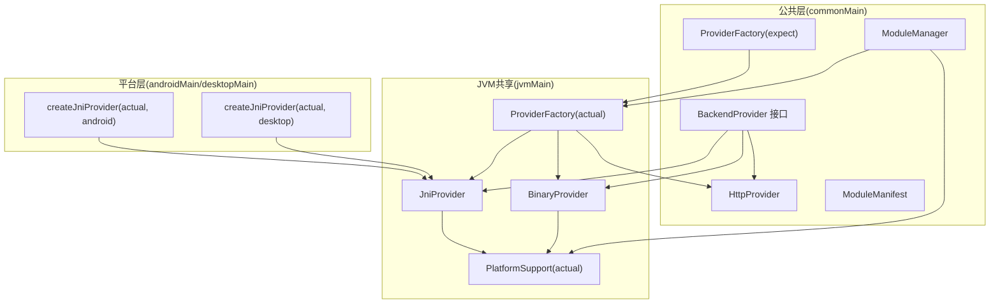
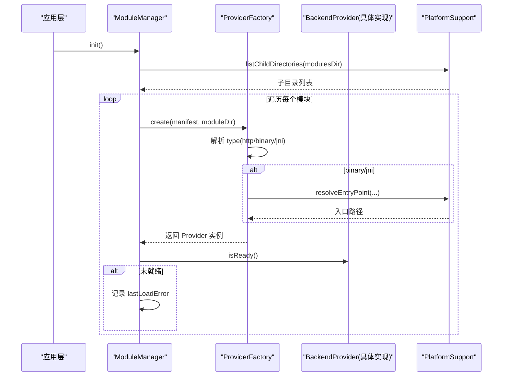
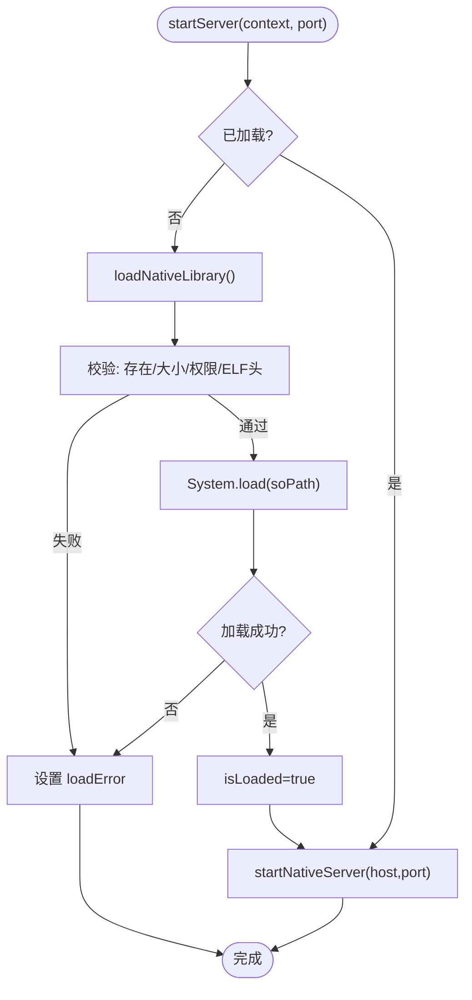
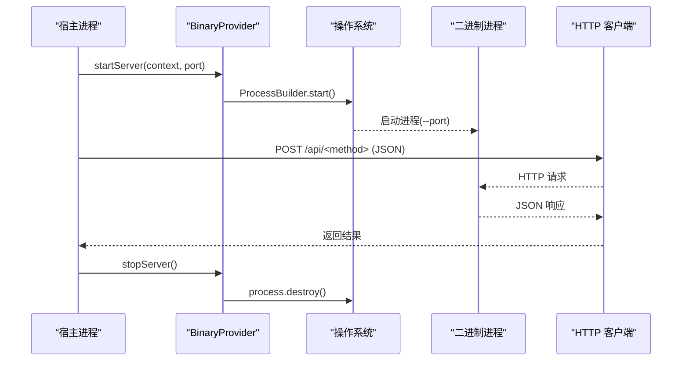
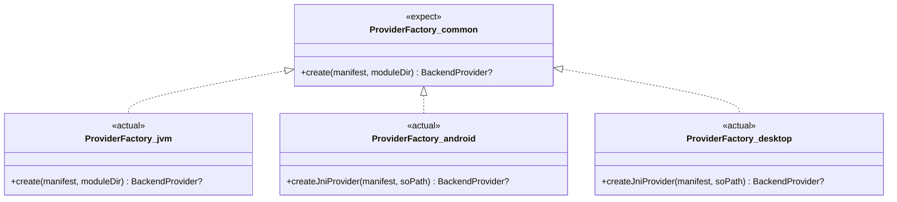
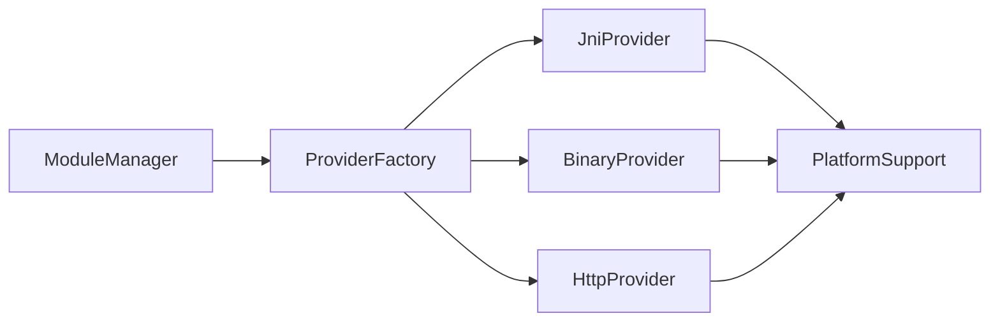

# 平台适配器实现

<cite>
**本文引用的文件**
- [BackendProvider.kt](file://kmp-pro/src/commonMain/kotlin/cp/player/kmp/provider/BackendProvider.kt)
- [ProviderFactory.kt（common）](file://kmp-pro/src/commonMain/kotlin/cp/player/kmp/provider/ProviderFactory.kt)
- [ProviderFactory.kt（jvm）](file://kmp-pro/src/jvmMain/kotlin/cp/player/kmp/provider/ProviderFactory.kt)
- [ProviderFactory.kt（android）](file://kmp-pro/src/androidMain/kotlin/cp/player/kmp/provider/ProviderFactory.kt)
- [ProviderFactory.kt（desktop）](file://kmp-pro/src/desktopMain/kotlin/cp/player/kmp/provider/ProviderFactory.kt)
- [JniProvider.kt](file://kmp-pro/src/jvmMain/kotlin/cp/player/kmp/provider/JniProvider.kt)
- [BinaryProvider.kt](file://kmp-pro/src/jvmMain/kotlin/cp/player/kmp/provider/BinaryProvider.kt)
- [HttpProvider.kt](file://kmp-pro/src/commonMain/kotlin/cp/player/kmp/provider/HttpProvider.kt)
- [ModuleManifest.kt](file://kmp-pro/src/commonMain/kotlin/cp/player/kmp/provider/ModuleManifest.kt)
- [ModuleManager.kt](file://kmp-pro/src/commonMain/kotlin/cp/player/kmp/provider/ModuleManager.kt)
- [PlatformSupport.kt（common）](file://kmp-pro/src/commonMain/kotlin/cp/player/kmp/util/PlatformSupport.kt)
- [PlatformSupport.kt（jvm）](file://kmp-pro/src/jvmMain/kotlin/cp/player/kmp/util/PlatformSupport.kt)
</cite>

## 目录
1. [简介](#简介)
2. [项目结构](#项目结构)
3. [核心组件](#核心组件)
4. [架构总览](#架构总览)
5. [详细组件分析](#详细组件分析)
6. [依赖关系分析](#依赖关系分析)
7. [性能考量](#性能考量)
8. [故障排查指南](#故障排查指南)
9. [结论](#结论)
10. [附录：新增平台适配器示例](#附录新增平台适配器示例)

## 简介
本技术文档聚焦 CPPlayer-KMP 的“平台适配器”实现，系统性说明 JniProvider 在 Android 平台上通过 JNI 调用原生模块的机制（动态库加载、内存与错误处理），以及 BinaryProvider 在 Desktop 平台上以进程隔离方式加载和执行二进制模块的策略。同时解释 ProviderFactory 在不同平台的差异、跨平台抽象层的设计目标与实践，并提供扩展新平台适配器的步骤与优化建议。

## 项目结构
KMP 模块将“平台无关接口”与“平台特定实现”解耦：
- commonMain：定义 BackendProvider 接口、ProviderFactory 期望、HTTP 实现、模块清单与模块管理器等。
- jvmMain：提供 JVM 共享的平台支持（端口探测、解压、ELF 校验、ABI 解析等）以及 JniProvider、BinaryProvider 的具体实现。
- androidMain/desktopMain：提供 createJniProvider 的平台实际实现（当前均返回 JniProvider）。

图表来源
- [BackendProvider.kt:24-96](file://kmp-pro/src/commonMain/kotlin/cp/player/kmp/provider/BackendProvider.kt#L24-L96)
- [ProviderFactory.kt（common）:11-20](file://kmp-pro/src/commonMain/kotlin/cp/player/kmp/provider/ProviderFactory.kt#L11-L20)
- [ProviderFactory.kt（jvm）:7-30](file://kmp-pro/src/jvmMain/kotlin/cp/player/kmp/provider/ProviderFactory.kt#L7-L30)
- [PlatformSupport.kt（jvm）:17-135](file://kmp-pro/src/jvmMain/kotlin/cp/player/kmp/util/PlatformSupport.kt#L17-L135)

章节来源
- [BackendProvider.kt:24-96](file://kmp-pro/src/commonMain/kotlin/cp/player/kmp/provider/BackendProvider.kt#L24-L96)
- [ProviderFactory.kt（common）:11-20](file://kmp-pro/src/commonMain/kotlin/cp/player/kmp/provider/ProviderFactory.kt#L11-L20)
- [ProviderFactory.kt（jvm）:7-30](file://kmp-pro/src/jvmMain/kotlin/cp/player/kmp/provider/ProviderFactory.kt#L7-L30)
- [PlatformSupport.kt（jvm）:17-135](file://kmp-pro/src/jvmMain/kotlin/cp/player/kmp/util/PlatformSupport.kt#L17-L135)

## 核心组件
- BackendProvider：统一的后端能力抽象，包含启动/停止服务、API 调用、音频分析、就绪检查等。
- ProviderFactory：根据模块 manifest 创建具体 Provider；JNI 类型委托到平台 createJniProvider。
- JniProvider：Android/Desktop 通过 System.load 加载 .so/.dll/.dylib，并调用 native 方法启动本地服务或执行 API。
- BinaryProvider：以独立进程运行二进制可执行文件，通过 HTTP 与宿主通信。
- HttpProvider：直接连接外部 HTTP API 服务。
- ModuleManager：扫描 modules 目录，加载 manifest，实例化 Provider 并暴露可用列表。
- PlatformSupport：端口探测、解压、文件操作、ABI 入口解析、ELF 头校验等。

章节来源
- [BackendProvider.kt:24-110](file://kmp-pro/src/commonMain/kotlin/cp/player/kmp/provider/BackendProvider.kt#L24-L110)
- [ProviderFactory.kt（common）:11-29](file://kmp-pro/src/commonMain/kotlin/cp/player/kmp/provider/ProviderFactory.kt#L11-L29)
- [JniProvider.kt:9-141](file://kmp-pro/src/jvmMain/kotlin/cp/player/kmp/provider/JniProvider.kt#L9-L141)
- [BinaryProvider.kt:25-107](file://kmp-pro/src/jvmMain/kotlin/cp/player/kmp/provider/BinaryProvider.kt#L25-L107)
- [HttpProvider.kt:23-60](file://kmp-pro/src/commonMain/kotlin/cp/player/kmp/provider/HttpProvider.kt#L23-L60)
- [ModuleManager.kt:19-137](file://kmp-pro/src/commonMain/kotlin/cp/player/kmp/provider/ModuleManager.kt#L19-L137)
- [PlatformSupport.kt（common）:13-59](file://kmp-pro/src/commonMain/kotlin/cp/player/kmp/util/PlatformSupport.kt#L13-L59)

## 架构总览
整体采用“接口 + expect/actual + 工厂”的分层设计：
- 上层仅依赖 BackendProvider 接口，不感知底层是 JNI、二进制还是 HTTP。
- ProviderFactory 负责按 manifest.type 选择实现；JNI 类型交由平台 actual 函数构造。
- PlatformSupport 屏蔽平台差异（ABI、端口、文件系统、ELF 校验）。

图表来源
- [ModuleManager.kt:38-117](file://kmp-pro/src/commonMain/kotlin/cp/player/kmp/provider/ModuleManager.kt#L38-L117)
- [ProviderFactory.kt（jvm）:7-30](file://kmp-pro/src/jvmMain/kotlin/cp/player/kmp/provider/ProviderFactory.kt#L7-L30)
- [PlatformSupport.kt（jvm）:67-82](file://kmp-pro/src/jvmMain/kotlin/cp/player/kmp/util/PlatformSupport.kt#L67-L82)

## 详细组件分析

### JniProvider（Android 平台通过 JNI 调用原生模块）
- 动态库加载
  - 延迟加载：构造函数仅校验 soPath 存在性；真正加载发生在 startServer。
  - 预检查：文件大小、可读性、ELF 头校验（validateElfHeader）。
  - 加载：System.load(soPath)，成功则标记已加载并清除错误。
- 内存与资源
  - 通过 external 声明的 native 方法启动本地服务（如 startNativeServer），由原生侧管理线程与资源。
  - 崩溃恢复：nativeCallApi/analyzeAudioFile 捕获异常，重置加载状态并返回统一错误 JSON。
- 错误处理
  - 统一错误码与消息格式，便于上层 UI 展示。
  - 提供 getLoadError 用于诊断。

图表来源
- [JniProvider.kt:39-55](file://kmp-pro/src/jvmMain/kotlin/cp/player/kmp/provider/JniProvider.kt#L39-L55)
- [JniProvider.kt:98-136](file://kmp-pro/src/jvmMain/kotlin/cp/player/kmp/provider/JniProvider.kt#L98-L136)
- [PlatformSupport.kt（jvm）:89-121](file://kmp-pro/src/jvmMain/kotlin/cp/player/kmp/util/PlatformSupport.kt#L89-L121)

章节来源
- [JniProvider.kt:9-141](file://kmp-pro/src/jvmMain/kotlin/cp/player/kmp/provider/JniProvider.kt#L9-L141)
- [PlatformSupport.kt（jvm）:89-121](file://kmp-pro/src/jvmMain/kotlin/cp/player/kmp/util/PlatformSupport.kt#L89-L121)

### BinaryProvider（Desktop 平台以进程隔离执行二进制模块）
- 进程隔离
  - 使用 ProcessBuilder 启动独立进程，参数 --port <port>。
  - 工作目录设置为二进制所在目录，合并错误流便于调试。
- 资源管理
  - stopServer 销毁进程，避免僵尸进程。
  - 启动前进行 ELF 头校验，防止加载错误架构的二进制。
- 通信协议
  - 通过 HTTP POST 到 http://127.0.0.1:<port>/api/<method>，请求体为 JSON。
  - 网络异常时返回统一错误 JSON。

图表来源
- [BinaryProvider.kt:54-86](file://kmp-pro/src/jvmMain/kotlin/cp/player/kmp/provider/BinaryProvider.kt#L54-L86)
- [BinaryProvider.kt:88-106](file://kmp-pro/src/jvmMain/kotlin/cp/player/kmp/provider/BinaryProvider.kt#L88-L106)

章节来源
- [BinaryProvider.kt:25-107](file://kmp-pro/src/jvmMain/kotlin/cp/player/kmp/provider/BinaryProvider.kt#L25-L107)

### ProviderFactory 平台差异
- common 层：声明 expect object ProviderFactory.create(...) 与 expect fun createJniProvider(...)。
- jvm 层：根据 manifest.type 创建对应 Provider；binary/jni 类型通过 PlatformSupport.resolveEntryPoint 解析 ABI 入口。
- 平台层：androidMain 与 desktopMain 的 createJniProvider 均返回 JniProvider（当前实现）。

图表来源
- [ProviderFactory.kt（common）:11-29](file://kmp-pro/src/commonMain/kotlin/cp/player/kmp/provider/ProviderFactory.kt#L11-L29)
- [ProviderFactory.kt（jvm）:7-30](file://kmp-pro/src/jvmMain/kotlin/cp/player/kmp/provider/ProviderFactory.kt#L7-L30)
- [ProviderFactory.kt（android）:3-12](file://kmp-pro/src/androidMain/kotlin/cp/player/kmp/provider/ProviderFactory.kt#L3-L12)
- [ProviderFactory.kt（desktop）:3-12](file://kmp-pro/src/desktopMain/kotlin/cp/player/kmp/provider/ProviderFactory.kt#L3-L12)

章节来源
- [ProviderFactory.kt（common）:11-29](file://kmp-pro/src/commonMain/kotlin/cp/player/kmp/provider/ProviderFactory.kt#L11-L29)
- [ProviderFactory.kt（jvm）:7-30](file://kmp-pro/src/jvmMain/kotlin/cp/player/kmp/provider/ProviderFactory.kt#L7-L30)
- [ProviderFactory.kt（android）:3-12](file://kmp-pro/src/androidMain/kotlin/cp/player/kmp/provider/ProviderFactory.kt#L3-L12)
- [ProviderFactory.kt（desktop）:3-12](file://kmp-pro/src/desktopMain/kotlin/cp/player/kmp/provider/ProviderFactory.kt#L3-L12)

### 跨平台抽象层设计
- 接口抽象：BackendProvider 统一了后端能力，屏蔽 JNI/二进制/HTTP 的差异。
- 期望/实际：ProviderFactory 与 PlatformSupport 通过 expect/actual 分离平台逻辑。
- 模块清单：ModuleManifest 描述模块元数据（id/name/version/type/entryPoint/apiMap/updateUrl/supportedAbis/targetAppPackage），驱动加载与适配。
- 模块管理器：ModuleManager 负责扫描、导入、删除模块，并通过 StateFlow 暴露可用 Provider 集合。

章节来源
- [BackendProvider.kt:24-110](file://kmp-pro/src/commonMain/kotlin/cp/player/kmp/provider/BackendProvider.kt#L24-L110)
- [ModuleManifest.kt:5-31](file://kmp-pro/src/commonMain/kotlin/cp/player/kmp/provider/ModuleManifest.kt#L5-L31)
- [ModuleManager.kt:19-137](file://kmp-pro/src/commonMain/kotlin/cp/player/kmp/provider/ModuleManager.kt#L19-L137)
- [PlatformSupport.kt（common）:13-59](file://kmp-pro/src/commonMain/kotlin/cp/player/kmp/util/PlatformSupport.kt#L13-L59)

## 依赖关系分析
- 耦合度
  - 上层仅依赖 BackendProvider 接口，低耦合。
  - ProviderFactory 与 PlatformSupport 承担平台适配职责，集中管理依赖。
- 外部依赖
  - Ktor 用于 HTTP 通信（HttpProvider/BinaryProvider）。
  - Java 标准库用于进程管理与文件操作（BinaryProvider/JniProvider）。
- 循环依赖
  - 未见明显循环依赖；ModuleManager 依赖 ProviderFactory 与 PlatformSupport，Provider 依赖 PlatformSupport。

图表来源
- [ModuleManager.kt:38-117](file://kmp-pro/src/commonMain/kotlin/cp/player/kmp/provider/ModuleManager.kt#L38-L117)
- [ProviderFactory.kt（jvm）:7-30](file://kmp-pro/src/jvmMain/kotlin/cp/player/kmp/provider/ProviderFactory.kt#L7-L30)
- [PlatformSupport.kt（jvm）:17-135](file://kmp-pro/src/jvmMain/kotlin/cp/player/kmp/util/PlatformSupport.kt#L17-L135)

章节来源
- [ModuleManager.kt:38-117](file://kmp-pro/src/commonMain/kotlin/cp/player/kmp/provider/ModuleManager.kt#L38-L117)
- [ProviderFactory.kt（jvm）:7-30](file://kmp-pro/src/jvmMain/kotlin/cp/player/kmp/provider/ProviderFactory.kt#L7-L30)
- [PlatformSupport.kt（jvm）:17-135](file://kmp-pro/src/jvmMain/kotlin/cp/player/kmp/util/PlatformSupport.kt#L17-L135)

## 性能考量
- 延迟加载
  - JniProvider 与 BinaryProvider 均在首次使用时才加载/启动，减少冷启动开销。
- 端口复用与冲突
  - PlatformSupport.findAvailablePort 自动寻找可用端口，避免端口占用导致的启动失败。
- I/O 与序列化
  - 使用 Ktor 异步客户端，callApi 同步封装时使用 runBlocking 保持接口一致性。
- 二进制校验
  - ELF 头校验提前拦截不兼容架构，避免无效进程启动。

[本节为通用指导，无需列出具体文件来源]

## 故障排查指南
- JNI 加载失败
  - 检查 soPath 是否存在、可读、大小合理、ELF 头匹配。
  - 查看 loadError 与日志输出定位 UnsatisfiedLinkError 原因。
- 二进制启动失败
  - 确认二进制文件存在且具备执行权限；检查 ELF 头与架构匹配。
  - 若进程启动后无法通信，检查端口是否被占用及防火墙策略。
- HTTP 调用失败
  - 检查 baseUrl 可达性与网络连通性；关注异常信息中的 URL 与方法名。
- 模块加载失败
  - 查看 ModuleManager.lastLoadError，常见原因为 ABI 不匹配或缺少入口文件。

章节来源
- [JniProvider.kt:23-33](file://kmp-pro/src/jvmMain/kotlin/cp/player/kmp/provider/JniProvider.kt#L23-L33)
- [JniProvider.kt:98-136](file://kmp-pro/src/jvmMain/kotlin/cp/player/kmp/provider/JniProvider.kt#L98-L136)
- [BinaryProvider.kt:42-80](file://kmp-pro/src/jvmMain/kotlin/cp/player/kmp/provider/BinaryProvider.kt#L42-L80)
- [ModuleManager.kt:91-123](file://kmp-pro/src/commonMain/kotlin/cp/player/kmp/provider/ModuleManager.kt#L91-L123)

## 结论
CPPlayer-KMP 通过统一的 BackendProvider 接口与 expect/actual 机制，实现了 JNI、二进制与 HTTP 三种后端能力的跨平台适配。JniProvider 在 Android 上通过 System.load 加载原生库并调用 native 方法；BinaryProvider 在 Desktop 上以进程隔离方式运行二进制模块并通过 HTTP 通信。ProviderFactory 与 PlatformSupport 进一步屏蔽平台差异，使上层代码与具体实现解耦，便于扩展与维护。

[本节为总结性内容，无需列出具体文件来源]

## 附录：新增平台适配器示例
以下以“新增一个基于 WebSocket 的 Provider”为例，展示如何在不破坏现有架构的前提下扩展平台能力。

- 步骤概览
  - 在 commonMain 中扩展 BackendProvider 或新增接口（如需新的能力）。
  - 在 jvmMain 中实现该 Provider（例如 WsProvider），实现 callApi/analyzeAudio/startServer/stopServer/isReady。
  - 在 ProviderFactory（jvm）中增加对新类型的分支，解析入口并实例化。
  - 若需要平台差异，可在 androidMain/desktopMain 提供 additional actual 函数。
  - 在 ModuleManifest 中新增 type 字段值（如 "websocket"），并在 UI 层展示。

- 关键要点
  - 遵循统一错误格式：{"code": ..., "msg": "..."}。
  - 使用 PlatformSupport 进行端口探测、文件校验与 ABI 解析。
  - 对长连接或异步任务，注意生命周期管理（start/stop）与资源释放。
  - 在 isReady 中反映真实就绪状态，避免不可用 Provider 被选中。

- 参考位置
  - 接口与类型定义：BackendProvider 与 ProviderType。
  - 工厂与平台分发：ProviderFactory（common/jvm/android/desktop）。
  - 平台工具：PlatformSupport（端口、文件、ELF 校验）。
  - 模块清单：ModuleManifest（type、supportedAbis 等）。

章节来源
- [BackendProvider.kt:24-110](file://kmp-pro/src/commonMain/kotlin/cp/player/kmp/provider/BackendProvider.kt#L24-L110)
- [ProviderFactory.kt（common）:11-29](file://kmp-pro/src/commonMain/kotlin/cp/player/kmp/provider/ProviderFactory.kt#L11-L29)
- [ProviderFactory.kt（jvm）:7-30](file://kmp-pro/src/jvmMain/kotlin/cp/player/kmp/provider/ProviderFactory.kt#L7-L30)
- [ModuleManifest.kt:5-31](file://kmp-pro/src/commonMain/kotlin/cp/player/kmp/provider/ModuleManifest.kt#L5-L31)
- [PlatformSupport.kt（jvm）:17-135](file://kmp-pro/src/jvmMain/kotlin/cp/player/kmp/util/PlatformSupport.kt#L17-L135)