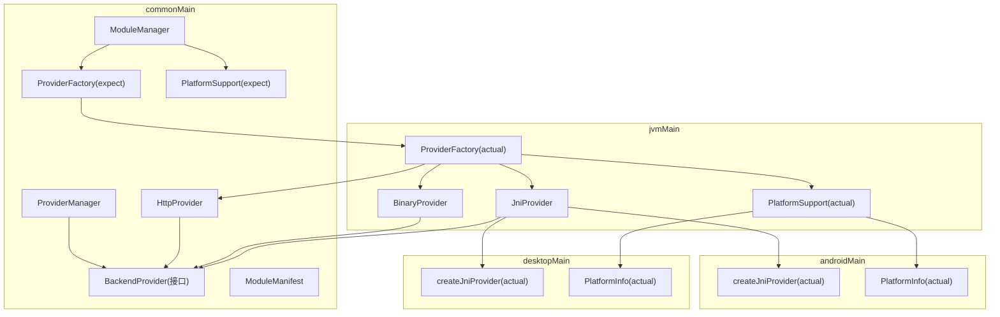
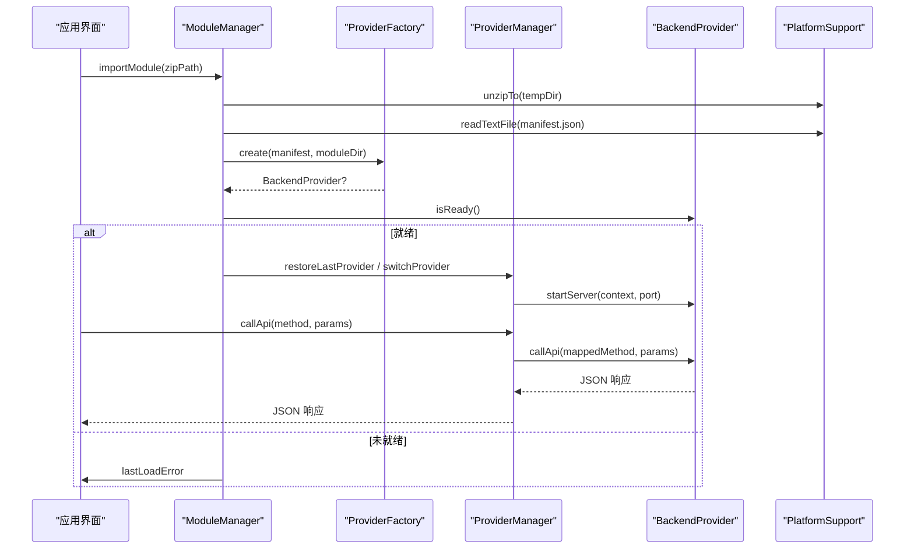
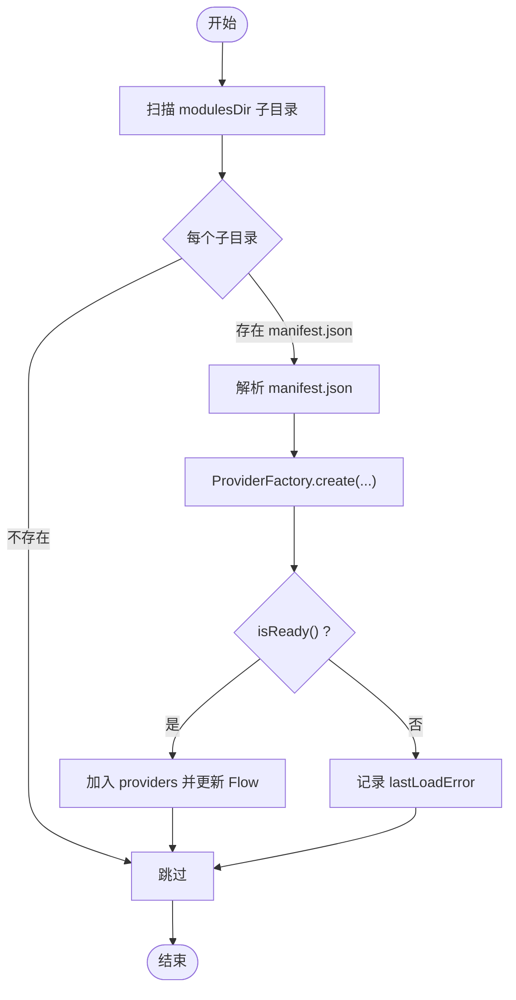
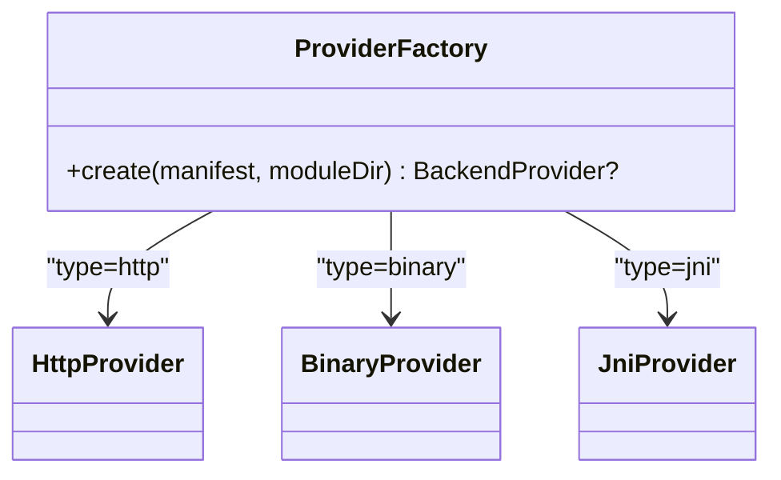
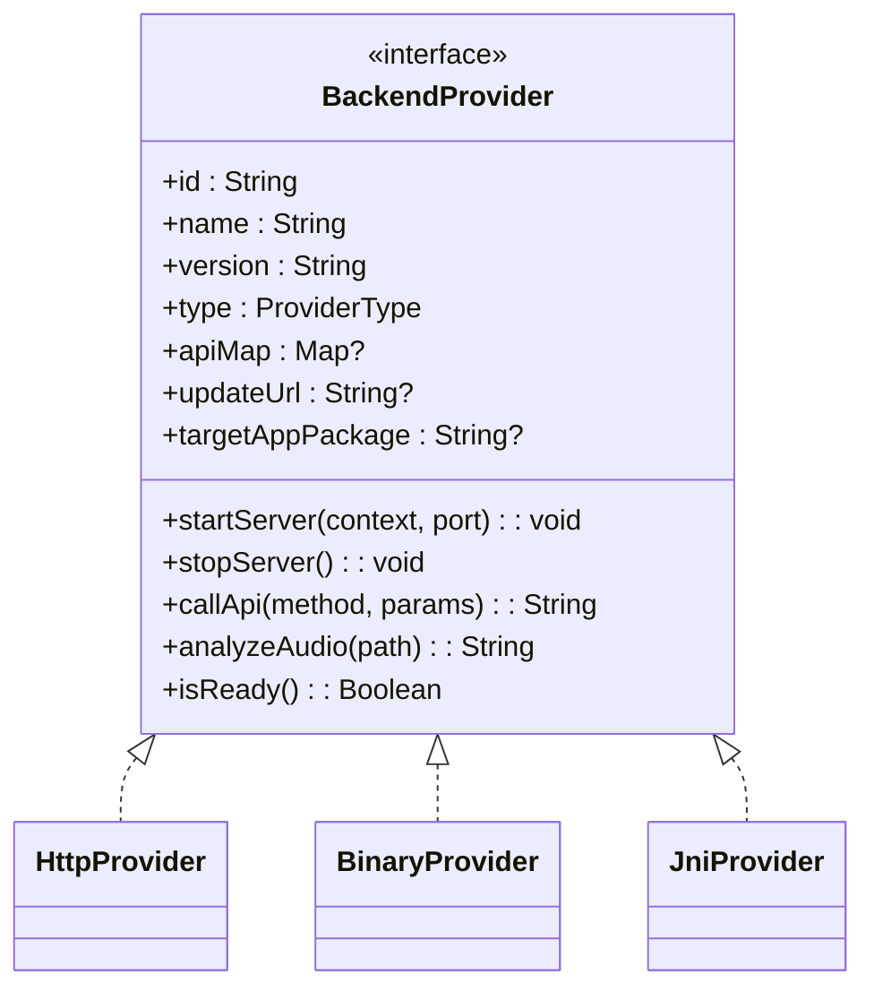
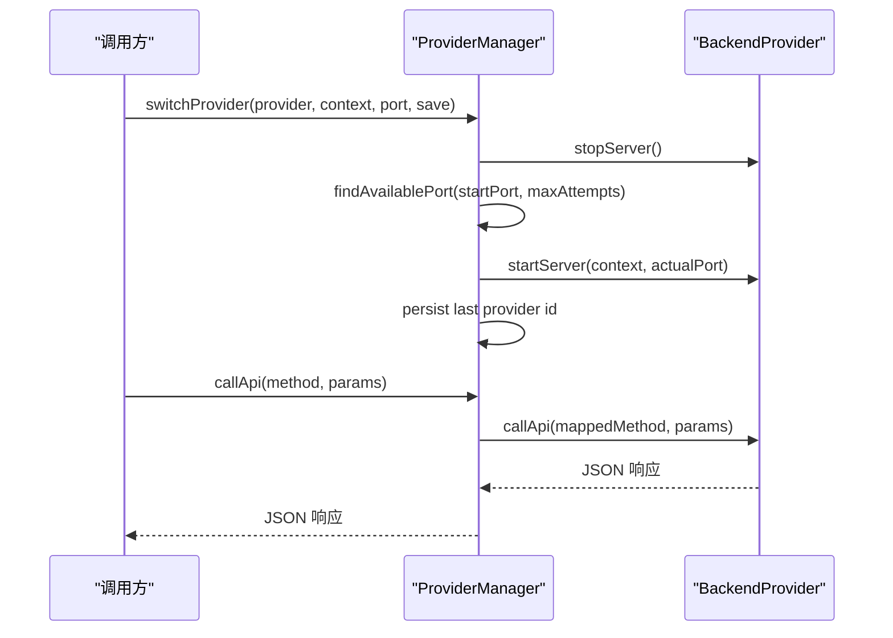
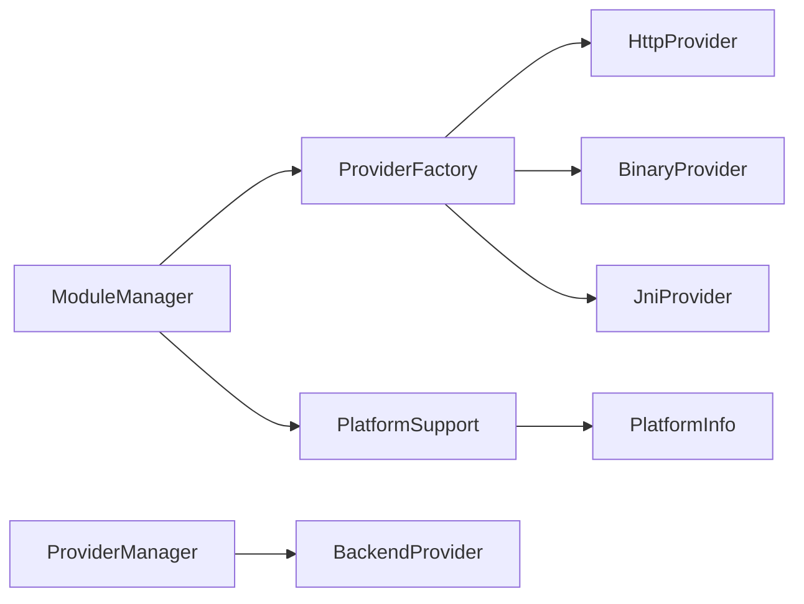

# 模块管理系统

<cite>
**本文引用的文件**
- [ModuleManager.kt](file://kmp-pro/src/commonMain/kotlin/cp/player/kmp/provider/ModuleManager.kt)
- [ProviderFactory.kt](file://kmp-pro/src/commonMain/kotlin/cp/player/kmp/provider/ProviderFactory.kt)
- [ProviderFactory (JVM).kt](file://kmp-pro/src/jvmMain/kotlin/cp/player/kmp/provider/ProviderFactory.kt)
- [ProviderFactory (Android).kt](file://kmp-pro/src/androidMain/kotlin/cp/player/kmp/provider/ProviderFactory.kt)
- [ProviderFactory (Desktop).kt](file://kmp-pro/src/desktopMain/kotlin/cp/player/kmp/provider/ProviderFactory.kt)
- [ModuleManifest.kt](file://kmp-pro/src/commonMain/kotlin/cp/player/kmp/provider/ModuleManifest.kt)
- [BackendProvider.kt](file://kmp-pro/src/commonMain/kotlin/cp/player/kmp/provider/BackendProvider.kt)
- [HttpProvider.kt](file://kmp-pro/src/commonMain/kotlin/cp/player/kmp/provider/HttpProvider.kt)
- [BinaryProvider.kt](file://kmp-pro/src/jvmMain/kotlin/cp/player/kmp/provider/BinaryProvider.kt)
- [JniProvider.kt](file://kmp-pro/src/jvmMain/kotlin/cp/player/kmp/provider/JniProvider.kt)
- [ProviderManager.kt](file://kmp-pro/src/commonMain/kotlin/cp/player/kmp/provider/ProviderManager.kt)
- [PlatformSupport.kt](file://kmp-pro/src/commonMain/kotlin/cp/player/kmp/util/PlatformSupport.kt)
- [PlatformSupport (JVM).kt](file://kmp-pro/src/jvmMain/kotlin/cp/player/kmp/util/PlatformSupport.kt)
- [PlatformInfo.kt](file://kmp-pro/src/commonMain/kotlin/cp/player/kmp/util/PlatformInfo.kt)
- [PlatformInfo (Android).kt](file://kmp-pro/src/androidMain/kotlin/cp/player/kmp/util/PlatformInfo.kt)
- [PlatformInfo (Desktop).kt](file://kmp-pro/src/desktopMain/kotlin/cp/player/kmp/util/PlatformInfo.kt)
</cite>

## 目录
1. [简介](#简介)
2. [项目结构](#项目结构)
3. [核心组件](#核心组件)
4. [架构总览](#架构总览)
5. [详细组件分析](#详细组件分析)
6. [依赖关系分析](#依赖关系分析)
7. [性能考量](#性能考量)
8. [故障排查指南](#故障排查指南)
9. [结论](#结论)
10. [附录](#附录)

## 简介
本技术文档围绕 CPPlayer-KMP 的模块管理系统，系统性阐述 ModuleManager 的模块解析、验证与加载流程；ProviderFactory 如何依据平台类型创建 Provider；模块生命周期（初始化、启动、停止、销毁）；模块依赖与冲突处理策略；并提供注册新模块、异常处理与状态管理的实践示例。同时给出模块文件格式规范与校验规则说明，帮助开发者正确编写 manifest.json 并安全地扩展后端能力。

## 项目结构
模块管理相关代码主要位于 kmp-pro 模块：
- commonMain：跨平台抽象与通用逻辑（接口、管理器、HTTP Provider、清单模型等）
- jvmMain：JVM 共享实现（二进制与 JNI Provider、平台支持工具）
- androidMain/desktopMain：平台特定 ProviderFactory 实际实现与平台信息

图表来源
- [ModuleManager.kt:1-137](file://kmp-pro/src/commonMain/kotlin/cp/player/kmp/provider/ModuleManager.kt#L1-L137)
- [ProviderFactory.kt:1-29](file://kmp-pro/src/commonMain/kotlin/cp/player/kmp/provider/ProviderFactory.kt#L1-L29)
- [ProviderFactory (JVM).kt:1-31](file://kmp-pro/src/jvmMain/kotlin/cp/player/kmp/provider/ProviderFactory.kt#L1-L31)
- [PlatformSupport.kt:1-59](file://kmp-pro/src/commonMain/kotlin/cp/player/kmp/util/PlatformSupport.kt#L1-L59)
- [PlatformSupport (JVM).kt:1-135](file://kmp-pro/src/jvmMain/kotlin/cp/player/kmp/util/PlatformSupport.kt#L1-L135)
- [PlatformInfo (Android).kt:1-13](file://kmp-pro/src/androidMain/kotlin/cp/player/kmp/util/PlatformInfo.kt#L1-L13)
- [PlatformInfo (Desktop).kt:1-13](file://kmp-pro/src/desktopMain/kotlin/cp/player/kmp/util/PlatformInfo.kt#L1-L13)

章节来源
- [ModuleManager.kt:1-137](file://kmp-pro/src/commonMain/kotlin/cp/player/kmp/provider/ModuleManager.kt#L1-L137)
- [ProviderManager.kt:1-156](file://kmp-pro/src/commonMain/kotlin/cp/player/kmp/provider/ProviderManager.kt#L1-L156)

## 核心组件
- ModuleManager：负责扫描 modulesDir、导入 zip 包、解析 manifest.json、调用 ProviderFactory 创建 Provider、维护可用 Provider 列表与错误信息。
- ProviderFactory：根据 manifest.type 创建对应 Provider（http/binary/jni），并通过 expect/actual 机制在 JVM 层统一实现，JNI 通过 createJniProvider 在 Android/Desktop 分别构造。
- BackendProvider 及实现：定义统一的 Provider 接口（startServer/stopServer/callApi/isReady 等），具体实现包括 HttpProvider、BinaryProvider、JniProvider。
- ProviderManager：管理当前活跃 Provider、端口分配、切换与持久化、API 调用转发、Cookie 隔离存储。
- PlatformSupport/PlatformInfo：提供端口探测、解压、文件操作、入口路径解析、ELF 校验以及 ABI 列表与模块目录的平台差异。

章节来源
- [BackendProvider.kt:1-110](file://kmp-pro/src/commonMain/kotlin/cp/player/kmp/provider/BackendProvider.kt#L1-L110)
- [HttpProvider.kt:1-60](file://kmp-pro/src/commonMain/kotlin/cp/player/kmp/provider/HttpProvider.kt#L1-L60)
- [BinaryProvider.kt:1-108](file://kmp-pro/src/jvmMain/kotlin/cp/player/kmp/provider/BinaryProvider.kt#L1-L108)
- [JniProvider.kt:1-142](file://kmp-pro/src/jvmMain/kotlin/cp/player/kmp/provider/JniProvider.kt#L1-L142)
- [ProviderManager.kt:1-156](file://kmp-pro/src/commonMain/kotlin/cp/player/kmp/provider/ProviderManager.kt#L1-L156)
- [PlatformSupport.kt:1-59](file://kmp-pro/src/commonMain/kotlin/cp/player/kmp/util/PlatformSupport.kt#L1-L59)
- [PlatformSupport (JVM).kt:1-135](file://kmp-pro/src/jvmMain/kotlin/cp/player/kmp/util/PlatformSupport.kt#L1-L135)
- [PlatformInfo.kt:1-20](file://kmp-pro/src/commonMain/kotlin/cp/player/kmp/util/PlatformInfo.kt#L1-L20)

## 架构总览
模块从磁盘或 zip 包导入后，由 ModuleManager 解析 manifest 并创建 Provider；ProviderManager 负责选择并激活某个 Provider，统一管理其生命周期与 API 路由。平台差异通过 expect/actual 解耦，确保同一套上层逻辑在 Android/Desktop/JVM 上运行一致。

图表来源
- [ModuleManager.kt:56-117](file://kmp-pro/src/commonMain/kotlin/cp/player/kmp/provider/ModuleManager.kt#L56-L117)
- [ProviderFactory (JVM).kt:7-30](file://kmp-pro/src/jvmMain/kotlin/cp/player/kmp/provider/ProviderFactory.kt#L7-L30)
- [ProviderManager.kt:65-141](file://kmp-pro/src/commonMain/kotlin/cp/player/kmp/provider/ProviderManager.kt#L65-L141)
- [PlatformSupport (JVM).kt:35-82](file://kmp-pro/src/jvmMain/kotlin/cp/player/kmp/util/PlatformSupport.kt#L35-L82)

## 详细组件分析

### ModuleManager：模块解析、验证与加载
- 扫描与加载：列出 modulesDir 子目录，逐个尝试加载 manifest.json，若存在则解码为 ModuleManifest，并调用 ProviderFactory.create 创建 Provider。
- 导入流程：解压 zip 到临时目录，校验 manifest.json 是否存在，移动到目标目录后再次加载，失败时清理临时目录并记录错误。
- 验证与就绪检查：创建 Provider 后调用 isReady()，若失败则尝试通过反射获取 getLoadError 提取原因，写入 lastLoadError。
- 状态同步：维护 providers 映射与 StateFlow<List<BackendProvider>>，供 UI 观察。

图表来源
- [ModuleManager.kt:38-117](file://kmp-pro/src/commonMain/kotlin/cp/player/kmp/provider/ModuleManager.kt#L38-L117)

章节来源
- [ModuleManager.kt:38-117](file://kmp-pro/src/commonMain/kotlin/cp/player/kmp/provider/ModuleManager.kt#L38-L117)

### ProviderFactory：按平台类型创建 Provider
- 类型分发：根据 manifest.type 创建对应 Provider：
  - http：使用 entryPoint 作为 baseUrl 构造 HttpProvider
  - binary：通过 PlatformSupport.resolveEntryPoint 解析二进制路径，校验存在性后构造 BinaryProvider
  - jni：解析 so 路径后调用 createJniProvider 构造 JniProvider（Android/Desktop 分别 actual）
- 不支持类型：返回 null，由调用方记录错误。

图表来源
- [ProviderFactory (JVM).kt:7-30](file://kmp-pro/src/jvmMain/kotlin/cp/player/kmp/provider/ProviderFactory.kt#L7-L30)
- [ProviderFactory.kt:1-29](file://kmp-pro/src/commonMain/kotlin/cp/player/kmp/provider/ProviderFactory.kt#L1-L29)

章节来源
- [ProviderFactory (JVM).kt:7-30](file://kmp-pro/src/jvmMain/kotlin/cp/player/kmp/provider/ProviderFactory.kt#L7-L30)
- [ProviderFactory (Android).kt:1-13](file://kmp-pro/src/androidMain/kotlin/cp/player/kmp/provider/ProviderFactory.kt#L1-L13)
- [ProviderFactory (Desktop).kt:1-13](file://kmp-pro/src/desktopMain/kotlin/cp/player/kmp/provider/ProviderFactory.kt#L1-L13)

### BackendProvider 及其实现：生命周期与通信
- 接口约定：id/name/version/type/apiMap/updateUrl/targetAppPackage/startServer/stopServer/callApi/analyzeAudio/isReady
- HttpProvider：以 Ktor 发起 HTTP POST 调用外部服务，start/stop 为空操作，callApi 封装参数为 JSON 并返回文本响应。
- BinaryProvider：启动独立进程（传入 --port），通过 HTTP 与进程通信；启动前进行 ELF 校验与权限设置；异常时记录 loadError。
- JniProvider：加载 .so 库并调用 native 方法；启动时加载库并启动本地服务；调用过程捕获崩溃并降级为错误 JSON。

图表来源
- [BackendProvider.kt:24-96](file://kmp-pro/src/commonMain/kotlin/cp/player/kmp/provider/BackendProvider.kt#L24-L96)
- [HttpProvider.kt:23-60](file://kmp-pro/src/commonMain/kotlin/cp/player/kmp/provider/HttpProvider.kt#L23-L60)
- [BinaryProvider.kt:25-108](file://kmp-pro/src/jvmMain/kotlin/cp/player/kmp/provider/BinaryProvider.kt#L25-L108)
- [JniProvider.kt:9-142](file://kmp-pro/src/jvmMain/kotlin/cp/player/kmp/provider/JniProvider.kt#L9-L142)

章节来源
- [BackendProvider.kt:24-96](file://kmp-pro/src/commonMain/kotlin/cp/player/kmp/provider/BackendProvider.kt#L24-L96)
- [HttpProvider.kt:23-60](file://kmp-pro/src/commonMain/kotlin/cp/player/kmp/provider/HttpProvider.kt#L23-L60)
- [BinaryProvider.kt:25-108](file://kmp-pro/src/jvmMain/kotlin/cp/player/kmp/provider/BinaryProvider.kt#L25-L108)
- [JniProvider.kt:9-142](file://kmp-pro/src/jvmMain/kotlin/cp/player/kmp/provider/JniProvider.kt#L9-L142)

### ProviderManager：活跃 Provider 管理与 API 路由
- 端口管理：自动检测可用端口，失败时回退并记录日志。
- 切换流程：停止旧 Provider 服务，启动新 Provider 服务，持久化 last_active_provider_id，触发变更监听。
- API 路由：通过 apiMap 将内部方法名映射到 Provider 实际端点；若映射为 unsupported 或不支持，返回友好错误。
- Cookie 隔离：ProviderCookieStorage 以 cookie_<providerId> 键隔离不同 Provider 的认证信息。

图表来源
- [ProviderManager.kt:65-141](file://kmp-pro/src/commonMain/kotlin/cp/player/kmp/provider/ProviderManager.kt#L65-L141)

章节来源
- [ProviderManager.kt:65-141](file://kmp-pro/src/commonMain/kotlin/cp/player/kmp/provider/ProviderManager.kt#L65-L141)

### 模块依赖与冲突解决策略
- 依赖解析：当前实现中，模块之间无显式依赖声明；Provider 通过各自 API 与服务交互。依赖关系由业务层保证。
- 冲突解决：
  - 端口冲突：ProviderManager 自动寻找可用端口，避免多实例冲突。
  - 模块覆盖：导入模块时若目标目录已存在，先删除再移动，避免重复安装。
  - ABI 不匹配：PlatformSupport.validateElfHeader 校验 ELF 头与架构，防止加载错误架构的二进制或 so。
  - 功能不支持：apiMap 中映射为 "unsupported" 时，调用方直接返回“不支持”提示，避免无效调用。

章节来源
- [PlatformSupport (JVM).kt:67-121](file://kmp-pro/src/jvmMain/kotlin/cp/player/kmp/util/PlatformSupport.kt#L67-L121)
- [ProviderManager.kt:65-141](file://kmp-pro/src/commonMain/kotlin/cp/player/kmp/provider/ProviderManager.kt#L65-L141)
- [ModuleManager.kt:56-117](file://kmp-pro/src/commonMain/kotlin/cp/player/kmp/provider/ModuleManager.kt#L56-L117)

## 依赖关系分析
- 模块管理器与工厂：ModuleManager 依赖 ProviderFactory 创建 Provider，依赖 PlatformSupport 进行文件系统与端口操作。
- 平台抽象：PlatformInfo 提供 ABI 与模块目录差异；PlatformSupport 在 JVM 层实现跨平台能力。
- Provider 实现：三种 Provider 均实现 BackendProvider 接口，屏蔽底层差异，统一对外暴露 API。

图表来源
- [ModuleManager.kt:1-137](file://kmp-pro/src/commonMain/kotlin/cp/player/kmp/provider/ModuleManager.kt#L1-L137)
- [ProviderFactory (JVM).kt:1-31](file://kmp-pro/src/jvmMain/kotlin/cp/player/kmp/provider/ProviderFactory.kt#L1-L31)
- [PlatformSupport (JVM).kt:1-135](file://kmp-pro/src/jvmMain/kotlin/cp/player/kmp/util/PlatformSupport.kt#L1-L135)
- [PlatformInfo (Android).kt:1-13](file://kmp-pro/src/androidMain/kotlin/cp/player/kmp/util/PlatformInfo.kt#L1-L13)
- [PlatformInfo (Desktop).kt:1-13](file://kmp-pro/src/desktopMain/kotlin/cp/player/kmp/util/PlatformInfo.kt#L1-L13)

章节来源
- [ModuleManager.kt:1-137](file://kmp-pro/src/commonMain/kotlin/cp/player/kmp/provider/ModuleManager.kt#L1-L137)
- [ProviderFactory (JVM).kt:1-31](file://kmp-pro/src/jvmMain/kotlin/cp/player/kmp/provider/ProviderFactory.kt#L1-L31)
- [PlatformSupport (JVM).kt:1-135](file://kmp-pro/src/jvmMain/kotlin/cp/player/kmp/util/PlatformSupport.kt#L1-L135)

## 性能考量
- 懒加载与延迟启动：BinaryProvider 与 JniProvider 在构造函数仅做基础校验，真正启动与加载在 startServer 中进行，减少冷启动开销。
- 端口探测优化：ProviderManager 使用有限次尝试查找可用端口，避免长时间阻塞。
- I/O 与协程：HttpProvider 使用 runBlocking 桥接异步 HTTP 调用，注意在高并发场景下可能成为瓶颈，建议上层采用异步调用模式。
- 资源释放：切换 Provider 时主动停止旧服务，避免僵尸进程或句柄泄漏。

[本节为通用指导，无需引用具体文件]

## 故障排查指南
- 模块导入失败：
  - 检查 zip 是否包含 manifest.json；查看 lastLoadError 中的“解压失败”“缺少 manifest.json”“移动临时目录失败”等提示。
  - 参考路径：[ModuleManager.kt:56-86](file://kmp-pro/src/commonMain/kotlin/cp/player/kmp/provider/ModuleManager.kt#L56-L86)
- Provider 创建失败：
  - http：确认 baseUrl 可达；查看 HTTP 调用异常信息。
  - binary：确认二进制文件存在且可执行；检查 ELF 校验结果与进程启动异常。
  - jni：确认 so 文件存在、可读、ABI 匹配；查看 JNI 加载与调用崩溃信息。
  - 参考路径：[ProviderFactory (JVM).kt:7-30](file://kmp-pro/src/jvmMain/kotlin/cp/player/kmp/provider/ProviderFactory.kt#L7-L30)、[BinaryProvider.kt:42-80](file://kmp-pro/src/jvmMain/kotlin/cp/player/kmp/provider/BinaryProvider.kt#L42-L80)、[JniProvider.kt:23-55](file://kmp-pro/src/jvmMain/kotlin/cp/player/kmp/provider/JniProvider.kt#L23-L55)
- 端口占用：
  - 查看 ProviderManager 日志输出；调整起始端口或增加最大尝试次数。
  - 参考路径：[ProviderManager.kt:65-73](file://kmp-pro/src/commonMain/kotlin/cp/player/kmp/provider/ProviderManager.kt#L65-L73)
- 功能不支持：
  - 检查 apiMap 映射是否为 "unsupported"；调用方应展示友好提示。
  - 参考路径：[ProviderManager.kt:129-141](file://kmp-pro/src/commonMain/kotlin/cp/player/kmp/provider/ProviderManager.kt#L129-L141)

章节来源
- [ModuleManager.kt:56-117](file://kmp-pro/src/commonMain/kotlin/cp/player/kmp/provider/ModuleManager.kt#L56-L117)
- [ProviderFactory (JVM).kt:7-30](file://kmp-pro/src/jvmMain/kotlin/cp/player/kmp/provider/ProviderFactory.kt#L7-L30)
- [BinaryProvider.kt:42-80](file://kmp-pro/src/jvmMain/kotlin/cp/player/kmp/provider/BinaryProvider.kt#L42-L80)
- [JniProvider.kt:23-55](file://kmp-pro/src/jvmMain/kotlin/cp/player/kmp/provider/JniProvider.kt#L23-L55)
- [ProviderManager.kt:65-141](file://kmp-pro/src/commonMain/kotlin/cp/player/kmp/provider/ProviderManager.kt#L65-L141)

## 结论
CPPlayer-KMP 的模块管理系统通过清晰的职责划分与跨平台抽象，实现了模块的安全导入、可靠加载与统一管理。ModuleManager 负责模块生命周期与错误上报，ProviderFactory 按类型创建 Provider，BackendProvider 统一接口屏蔽底层差异，ProviderManager 管理活跃 Provider 与 API 路由。结合 PlatformSupport/PlatformInfo 的平台适配，系统在 Android 与 Desktop 上具备一致的体验与健壮性。

[本节为总结，无需引用具体文件]

## 附录

### 模块文件格式规范（manifest.json）
- 字段说明：
  - id：模块唯一标识（字符串）
  - name：显示名称（字符串）
  - version：版本号（语义化版本字符串）
  - type：模块类型，可选值："jni"、"binary"、"http"
  - entryPoint：入口文件或地址（二进制/so 的文件名或 http 服务的 baseUrl）
  - apiMap：API 方法映射表（可选），key 为内部方法名，value 为 Provider 实际端点名；"unsupported" 表示不支持
  - updateUrl：检查更新 URL（可选）
  - supportedAbis：支持的 ABI 列表（可选），用于多架构模块选择正确的 lib/{abi}/entryPoint
  - targetAppPackage：目标 App 包名（可选，仅 Android 生效）
- 参考路径：[ModuleManifest.kt:5-31](file://kmp-pro/src/commonMain/kotlin/cp/player/kmp/provider/ModuleManifest.kt#L5-L31)

章节来源
- [ModuleManifest.kt:5-31](file://kmp-pro/src/commonMain/kotlin/cp/player/kmp/provider/ModuleManifest.kt#L5-L31)

### 验证规则与安全检查
- ZIP 解压安全：解压时进行路径穿越保护，拒绝条目超出目标目录。
- ELF 校验：读取魔数与机器码，校验架构是否与平台 ABI 匹配。
- 入口解析：优先按平台 ABI 顺序查找 lib/{abi}/entryPoint，其次按 manifest.supportedAbis 与平台 ABI 交集匹配，最后回退到根目录 entryPoint。
- 参考路径：
  - [PlatformSupport (JVM).kt:35-59](file://kmp-pro/src/jvmMain/kotlin/cp/player/kmp/util/PlatformSupport.kt#L35-L59)
  - [PlatformSupport (JVM).kt:67-82](file://kmp-pro/src/jvmMain/kotlin/cp/player/kmp/util/PlatformSupport.kt#L67-L82)
  - [PlatformSupport (JVM).kt:89-121](file://kmp-pro/src/jvmMain/kotlin/cp/player/kmp/util/PlatformSupport.kt#L89-L121)

章节来源
- [PlatformSupport (JVM).kt:35-121](file://kmp-pro/src/jvmMain/kotlin/cp/player/kmp/util/PlatformSupport.kt#L35-L121)

### 实践示例（代码片段路径）
- 注册新模块（导入 zip）：
  - 参考路径：[ModuleManager.kt:56-86](file://kmp-pro/src/commonMain/kotlin/cp/player/kmp/provider/ModuleManager.kt#L56-L86)
- 处理模块加载异常：
  - 参考路径：[ModuleManager.kt:88-117](file://kmp-pro/src/commonMain/kotlin/cp/player/kmp/provider/ModuleManager.kt#L88-L117)
- 管理模块状态（切换与恢复）：
  - 参考路径：[ProviderManager.kt:80-121](file://kmp-pro/src/commonMain/kotlin/cp/player/kmp/provider/ProviderManager.kt#L80-L121)
- 调用 Provider API（含映射与不支持处理）：
  - 参考路径：[ProviderManager.kt:129-141](file://kmp-pro/src/commonMain/kotlin/cp/player/kmp/provider/ProviderManager.kt#L129-L141)

章节来源
- [ModuleManager.kt:56-117](file://kmp-pro/src/commonMain/kotlin/cp/player/kmp/provider/ModuleManager.kt#L56-L117)
- [ProviderManager.kt:80-141](file://kmp-pro/src/commonMain/kotlin/cp/player/kmp/provider/ProviderManager.kt#L80-L141)