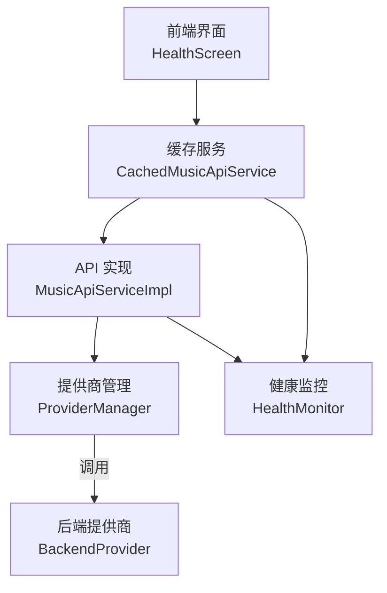
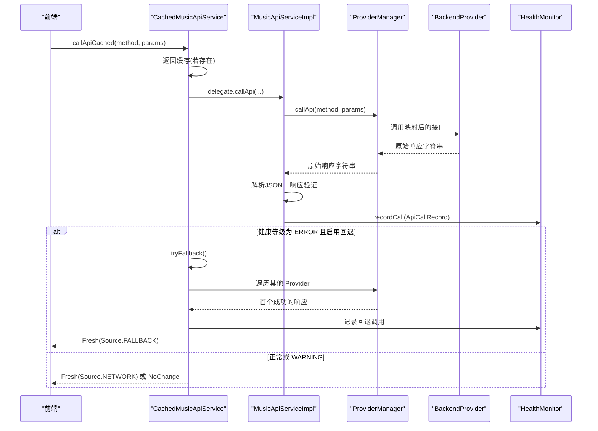
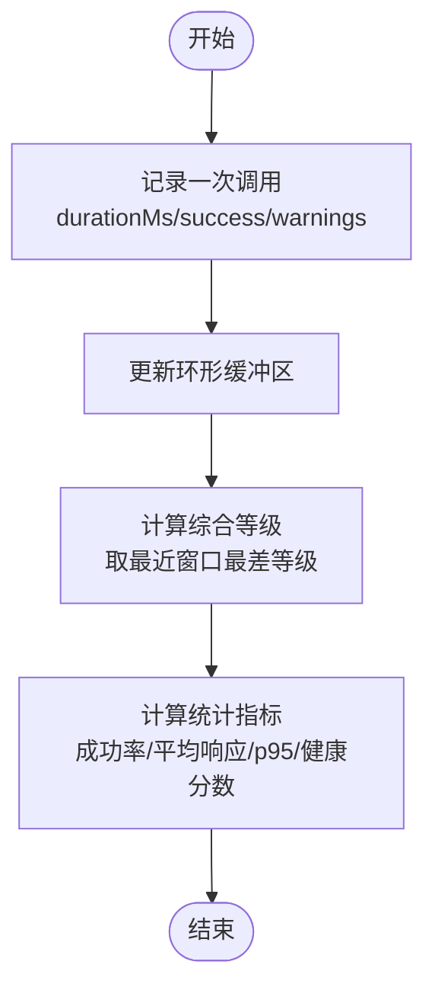
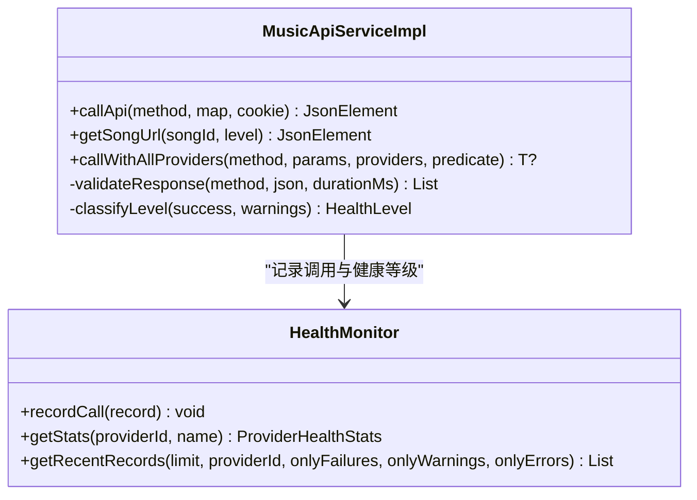
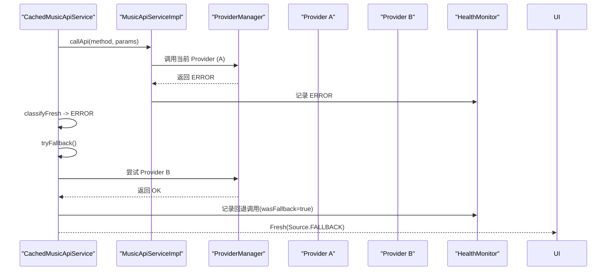
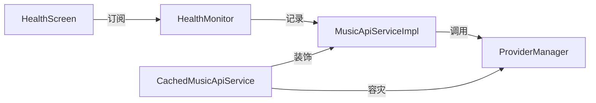

# 健康监控系统

<cite>
**本文引用的文件**
- [HealthMonitor.kt](file://kmp-pro/src/commonMain/kotlin/cp/player/kmp/monitor/HealthMonitor.kt)
- [MusicApiServiceImpl.kt](file://kmp-pro/src/commonMain/kotlin/cp/player/kmp/api/MusicApiServiceImpl.kt)
- [ProviderManager.kt](file://kmp-pro/src/commonMain/kotlin/cp/player/kmp/provider/ProviderManager.kt)
- [CacheResult.kt](file://kmp-pro/src/commonMain/kotlin/cp/player/kmp/cache/CacheResult.kt)
- [CachedMusicApiService.kt](file://kmp-pro/src/commonMain/kotlin/cp/player/kmp/cache/CachedMusicApiService.kt)
- [HealthScreen.kt](file://app/src/commonMain/kotlin/cp/player/app/ui/screen/HealthScreen.kt)
</cite>

## 目录
1. [简介](#简介)
2. [项目结构](#项目结构)
3. [核心组件](#核心组件)
4. [架构总览](#架构总览)
5. [详细组件分析](#详细组件分析)
6. [依赖关系分析](#依赖关系分析)
7. [性能考量](#性能考量)
8. [故障诊断指南](#故障诊断指南)
9. [结论](#结论)
10. [附录：配置与阈值、告警机制](#附录：配置与阈值、告警机制)

## 简介
本技术文档围绕 CPPlayer-KMP 的健康监控系统展开，重点解释三级健康分类体系（Healthy/OK、Degraded/WARNING、Unhealthy/ERROR）的设计理念与应用场景；详述 HealthMonitor 如何实现 API 服务的响应时间监控、错误率统计与服务可用性检查；介绍容灾降级机制（多 Provider 自动切换、故障转移策略与恢复检测）；说明 CacheResult 如何封装健康状态信息，以及前端如何根据健康状态调整用户体验；并提供健康监控的配置选项、阈值设置与告警机制建议，以及故障诊断工具与调试方法。

## 项目结构
健康监控相关代码主要分布在以下模块与文件中：
- 监控核心：HealthMonitor（三级分类、记录与统计）
- API 拦截与校验：MusicApiServiceImpl（统一入口、响应验证、健康记录）
- 提供商管理：ProviderManager（当前 Provider、端口管理、调用委托）
- 缓存与健康集成：CachedMusicApiService + CacheResult（缓存、回退、健康等级传播）
- 前端展示：HealthScreen（综合状态、记录列表、原始响应查看）

图表来源
- [HealthScreen.kt:46-100](file://app/src/commonMain/kotlin/cp/player/app/ui/screen/HealthScreen.kt#L46-L100)
- [CachedMusicApiService.kt:46-88](file://kmp-pro/src/commonMain/kotlin/cp/player/kmp/cache/CachedMusicApiService.kt#L46-L88)
- [MusicApiServiceImpl.kt:28-101](file://kmp-pro/src/commonMain/kotlin/cp/player/kmp/api/MusicApiServiceImpl.kt#L28-L101)
- [ProviderManager.kt:31-145](file://kmp-pro/src/commonMain/kotlin/cp/player/kmp/provider/ProviderManager.kt#L31-L145)
- [HealthMonitor.kt:25-143](file://kmp-pro/src/commonMain/kotlin/cp/player/kmp/monitor/HealthMonitor.kt#L25-L143)

章节来源
- [HealthScreen.kt:46-100](file://app/src/commonMain/kotlin/cp/player/app/ui/screen/HealthScreen.kt#L46-L100)
- [CachedMusicApiService.kt:46-88](file://kmp-pro/src/commonMain/kotlin/cp/player/kmp/cache/CachedMusicApiService.kt#L46-L88)
- [MusicApiServiceImpl.kt:28-101](file://kmp-pro/src/commonMain/kotlin/cp/player/kmp/api/MusicApiServiceImpl.kt#L28-L101)
- [ProviderManager.kt:31-145](file://kmp-pro/src/commonMain/kotlin/cp/player/kmp/provider/ProviderManager.kt#L31-L145)
- [HealthMonitor.kt:25-143](file://kmp-pro/src/commonMain/kotlin/cp/player/kmp/monitor/HealthMonitor.kt#L25-L143)

## 核心组件
- 三级健康分类体系
  - OK（Healthy）：响应正常，可直接使用
  - WARNING（Degraded）：勉强可用，可降级使用（如缺字段、慢响应、空数据）
  - ERROR（Unhealthy）：不可用，需回退（报错、解析失败、Provider 不支持）
- HealthMonitor：记录每次 API 调用的时间、成功与否、警告类型、是否回退等，并计算综合健康等级与统计指标
- MusicApiServiceImpl：统一拦截所有 API 调用，进行响应兼容性验证，生成健康记录
- ProviderManager：管理当前活跃 Provider，提供调用委托与切换能力
- CachedMusicApiService：在缓存层集成健康监控，支持多 Provider 容灾回退，并将健康等级传递给上层
- CacheResult：封装缓存/网络/回退三种结果，携带健康等级与警告信息
- HealthScreen：前端展示综合健康状态与最近调用记录，支持过滤与原始响应查看

章节来源
- [HealthMonitor.kt:10-94](file://kmp-pro/src/commonMain/kotlin/cp/player/kmp/monitor/HealthMonitor.kt#L10-L94)
- [MusicApiServiceImpl.kt:35-101](file://kmp-pro/src/commonMain/kotlin/cp/player/kmp/api/MusicApiServiceImpl.kt#L35-L101)
- [ProviderManager.kt:129-145](file://kmp-pro/src/commonMain/kotlin/cp/player/kmp/provider/ProviderManager.kt#L129-L145)
- [CachedMusicApiService.kt:46-140](file://kmp-pro/src/commonMain/kotlin/cp/player/kmp/cache/CachedMusicApiService.kt#L46-L140)
- [CacheResult.kt:6-44](file://kmp-pro/src/commonMain/kotlin/cp/player/kmp/cache/CacheResult.kt#L6-L44)
- [HealthScreen.kt:46-100](file://app/src/commonMain/kotlin/cp/player/app/ui/screen/HealthScreen.kt#L46-L100)

## 架构总览
健康监控贯穿“请求—校验—记录—统计—展示”的完整链路：
- 请求进入 MusicApiServiceImpl，执行参数注入、调用当前 Provider、解析 JSON、响应验证
- 响应验证阶段收集警告（缺失字段、异常 code、空数组/对象、慢响应、Provider 不支持等），并判定健康等级
- HealthMonitor 以环形缓冲区记录最近 N 条调用，实时计算综合健康等级
- 缓存层 CachedMusicApiService 在健康等级为 ERROR 时触发多 Provider 容灾回退，将回退结果标记为 FALLBACK
- 前端 HealthScreen 订阅健康流，展示综合状态与明细记录，支持过滤与原始响应查看

图表来源
- [CachedMusicApiService.kt:60-140](file://kmp-pro/src/commonMain/kotlin/cp/player/kmp/cache/CachedMusicApiService.kt#L60-L140)
- [MusicApiServiceImpl.kt:35-101](file://kmp-pro/src/commonMain/kotlin/cp/player/kmp/api/MusicApiServiceImpl.kt#L35-L101)
- [ProviderManager.kt:129-145](file://kmp-pro/src/commonMain/kotlin/cp/player/kmp/provider/ProviderManager.kt#L129-L145)
- [HealthMonitor.kt:117-143](file://kmp-pro/src/commonMain/kotlin/cp/player/kmp/monitor/HealthMonitor.kt#L117-L143)

## 详细组件分析

### 三级健康分类体系与设计理念
- 设计理念
  - OK：满足预期，无需降级
  - WARNING：数据不完美但可降级使用（例如缺少可选字段、响应偏慢、空集合）
  - ERROR：不可用，必须回退（例如解析失败、Provider 不支持、关键码异常）
- 分类规则
  - ResponseWarning.UNSUPPORTED_BY_PROVIDER、MALFORMED_RESPONSE → ERROR
  - 其余警告 → WARNING
  - 非成功请求 → ERROR
- 应用场景
  - 搜索、歌单、用户信息等读接口出现 WARNING 时仍可展示，但提示降级体验
  - URL 获取、登录态校验等关键路径出现 ERROR 时立即触发回退或提示不可用

章节来源
- [HealthMonitor.kt:10-56](file://kmp-pro/src/commonMain/kotlin/cp/player/kmp/monitor/HealthMonitor.kt#L10-L56)
- [MusicApiServiceImpl.kt:653-658](file://kmp-pro/src/commonMain/kotlin/cp/player/kmp/api/MusicApiServiceImpl.kt#L653-L658)

### HealthMonitor：API 健康状态检测与统计
- 响应时间监控
  - 记录 durationMs，计算平均响应时间与 p95 响应时间
  - 超过阈值的慢响应会记录 SLOW_RESPONSE 警告
- 错误率统计
  - success/fail 计数，warning/error 分类计数
  - 按 providerId、method 维度聚合统计
- 服务可用性检查
  - 通过 code 判断、期望字段存在性、URL 字段有效性等
  - 针对重定向类端点（302）特殊处理，只要含有效 http(s) URL 即视为成功
- 综合健康等级
  - 基于最近窗口（默认 100 条）的最差等级判定（ERROR > WARNING > OK）

图表来源
- [HealthMonitor.kt:117-143](file://kmp-pro/src/commonMain/kotlin/cp/player/kmp/monitor/HealthMonitor.kt#L117-L143)
- [HealthMonitor.kt:220-290](file://kmp-pro/src/commonMain/kotlin/cp/player/kmp/monitor/HealthMonitor.kt#L220-L290)

章节来源
- [HealthMonitor.kt:117-290](file://kmp-pro/src/commonMain/kotlin/cp/player/kmp/monitor/HealthMonitor.kt#L117-L290)

### MusicApiServiceImpl：响应兼容性与健康记录
- 统一入口
  - 注入 cookie、调用当前 Provider、解析 JSON、验证响应
- 响应验证
  - 检查 code、期望字段、空数组/对象、URL 字段、慢响应
  - 对重定向类端点（302）做特殊处理
- 健康记录
  - 将 success、level、warnings、fallback 信息写入 HealthMonitor
- 容灾回退（URL 获取）
  - 当 302 版本无有效 URL 时，自动回退到 v1 版本并记录回退

图表来源
- [MusicApiServiceImpl.kt:35-101](file://kmp-pro/src/commonMain/kotlin/cp/player/kmp/api/MusicApiServiceImpl.kt#L35-L101)
- [MusicApiServiceImpl.kt:189-209](file://kmp-pro/src/commonMain/kotlin/cp/player/kmp/api/MusicApiServiceImpl.kt#L189-L209)
- [MusicApiServiceImpl.kt:437-479](file://kmp-pro/src/commonMain/kotlin/cp/player/kmp/api/MusicApiServiceImpl.kt#L437-L479)
- [MusicApiServiceImpl.kt:594-658](file://kmp-pro/src/commonMain/kotlin/cp/player/kmp/api/MusicApiServiceImpl.kt#L594-L658)
- [HealthMonitor.kt:117-143](file://kmp-pro/src/commonMain/kotlin/cp/player/kmp/monitor/HealthMonitor.kt#L117-L143)

章节来源
- [MusicApiServiceImpl.kt:35-101](file://kmp-pro/src/commonMain/kotlin/cp/player/kmp/api/MusicApiServiceImpl.kt#L35-L101)
- [MusicApiServiceImpl.kt:189-209](file://kmp-pro/src/commonMain/kotlin/cp/player/kmp/api/MusicApiServiceImpl.kt#L189-L209)
- [MusicApiServiceImpl.kt:437-479](file://kmp-pro/src/commonMain/kotlin/cp/player/kmp/api/MusicApiServiceImpl.kt#L437-L479)
- [MusicApiServiceImpl.kt:594-658](file://kmp-pro/src/commonMain/kotlin/cp/player/kmp/api/MusicApiServiceImpl.kt#L594-L658)

### 容灾降级机制：多 Provider 自动切换与故障转移
- 触发条件
  - 健康等级为 ERROR 时，CachedMusicApiService 尝试其它 Provider
- 切换策略
  - 优先尝试当前 Provider（已移除后重新加入队列），再依次尝试其它 Provider
  - 仅接受成功响应（code ∈ {200,0,201,301}）
- 恢复检测
  - 回退成功后，将 source 标记为 FALLBACK，并在后续请求中继续观察健康等级
  - 若当前 Provider 恢复至 OK，则不再触发回退
- 记录与可视化
  - 每次回退尝试均记录到 HealthMonitor，包含 wasFallback、fallbackFrom、durationMs 等信息
  - 前端可在记录列表中看到“回退自某 Provider”的标注

图表来源
- [CachedMusicApiService.kt:90-140](file://kmp-pro/src/commonMain/kotlin/cp/player/kmp/cache/CachedMusicApiService.kt#L90-L140)
- [CachedMusicApiService.kt:142-180](file://kmp-pro/src/commonMain/kotlin/cp/player/kmp/cache/CachedMusicApiService.kt#L142-L180)
- [MusicApiServiceImpl.kt:437-479](file://kmp-pro/src/commonMain/kotlin/cp/player/kmp/api/MusicApiServiceImpl.kt#L437-L479)
- [HealthMonitor.kt:117-143](file://kmp-pro/src/commonMain/kotlin/cp/player/kmp/monitor/HealthMonitor.kt#L117-L143)

章节来源
- [CachedMusicApiService.kt:90-180](file://kmp-pro/src/commonMain/kotlin/cp/player/kmp/cache/CachedMusicApiService.kt#L90-L180)
- [MusicApiServiceImpl.kt:437-479](file://kmp-pro/src/commonMain/kotlin/cp/player/kmp/api/MusicApiServiceImpl.kt#L437-L479)
- [HealthMonitor.kt:117-143](file://kmp-pro/src/commonMain/kotlin/cp/player/kmp/monitor/HealthMonitor.kt#L117-L143)

### CacheResult：健康状态封装与前端体验调整
- 数据来源
  - CACHE：来自缓存，携带 ageMs、isStale、level、warnings
  - NETWORK：来自网络最新数据，携带 level、warnings
  - FALLBACK：来自回退，携带 level（通常为 OK）、warnings
  - ERROR：请求失败，可能附带 fallback 数据
- 前端体验调整
  - 根据 level 显示不同颜色与文案（健康/警告/错误）
  - 根据 isStale 提示数据新鲜度
  - 根据 warnings 提示降级原因（如慢响应、缺字段）
  - 支持查看原始响应内容，便于定位问题

章节来源
- [CacheResult.kt:6-44](file://kmp-pro/src/commonMain/kotlin/cp/player/kmp/cache/CacheResult.kt#L6-L44)
- [HealthScreen.kt:103-121](file://app/src/commonMain/kotlin/cp/player/app/ui/screen/HealthScreen.kt#L103-L121)
- [HealthScreen.kt:123-186](file://app/src/commonMain/kotlin/cp/player/app/ui/screen/HealthScreen.kt#L123-L186)

### 前端展示：HealthScreen
- 综合状态卡片：显示整体健康等级与记录总数
- 记录列表：按时间倒序展示最近调用，支持“全部/仅异常”过滤
- 原始响应弹窗：点击可查看 rawResponse，辅助定位问题
- 清空记录：一键清除历史监控记录

章节来源
- [HealthScreen.kt:46-100](file://app/src/commonMain/kotlin/cp/player/app/ui/screen/HealthScreen.kt#L46-L100)
- [HealthScreen.kt:103-186](file://app/src/commonMain/kotlin/cp/player/app/ui/screen/HealthScreen.kt#L103-L186)

## 依赖关系分析
- 耦合与内聚
  - HealthMonitor 高内聚：专注于记录与统计，对外暴露 Flow 与查询接口
  - MusicApiServiceImpl 低耦合：通过 ProviderManager 抽象具体 Provider 实现
  - CachedMusicApiService 作为装饰器，增强缓存与容灾能力，不侵入底层 API
- 直接依赖
  - MusicApiServiceImpl → HealthMonitor、ProviderManager
  - CachedMusicApiService → MusicApiService、ApiCache、ProviderManager、HealthMonitor
  - HealthScreen → HealthMonitor（读取 recordsFlow、overallLevelFlow）
- 外部集成点
  - PlatformSupport（端口查找）
  - SettingsStorage（持久化 Provider 选择）
  - CookieStorage（按 Provider 隔离账号）

图表来源
- [MusicApiServiceImpl.kt:28-101](file://kmp-pro/src/commonMain/kotlin/cp/player/kmp/api/MusicApiServiceImpl.kt#L28-L101)
- [ProviderManager.kt:31-145](file://kmp-pro/src/commonMain/kotlin/cp/player/kmp/provider/ProviderManager.kt#L31-L145)
- [CachedMusicApiService.kt:46-140](file://kmp-pro/src/commonMain/kotlin/cp/player/kmp/cache/CachedMusicApiService.kt#L46-L140)
- [HealthScreen.kt:46-100](file://app/src/commonMain/kotlin/cp/player/app/ui/screen/HealthScreen.kt#L46-L100)

章节来源
- [MusicApiServiceImpl.kt:28-101](file://kmp-pro/src/commonMain/kotlin/cp/player/kmp/api/MusicApiServiceImpl.kt#L28-L101)
- [ProviderManager.kt:31-145](file://kmp-pro/src/commonMain/kotlin/cp/player/kmp/provider/ProviderManager.kt#L31-L145)
- [CachedMusicApiService.kt:46-140](file://kmp-pro/src/commonMain/kotlin/cp/player/kmp/cache/CachedMusicApiService.kt#L46-L140)
- [HealthScreen.kt:46-100](file://app/src/commonMain/kotlin/cp/player/app/ui/screen/HealthScreen.kt#L46-L100)

## 性能考量
- 环形缓冲区与 Flow update
  - 使用 MutableStateFlow.update 避免完整列表复制，提升记录性能
  - 最大记录数限制（默认 500），防止内存膨胀
- 统计查询非阻塞
  - 从 Flow snapshot 计算统计，不阻塞记录路径
- 预分配与排序优化
  - 统计时使用 ArrayList 预分配，减少扩容开销
  - p95 计算采用排序后索引取值，复杂度 O(n log n)，适用于小样本窗口
- 缓存与指纹比对
  - 仅在数据变化时写回缓存，减少 I/O 压力
  - 指纹相同且非 ERROR 时发射 NoChange，避免重复渲染

章节来源
- [HealthMonitor.kt:117-143](file://kmp-pro/src/commonMain/kotlin/cp/player/kmp/monitor/HealthMonitor.kt#L117-L143)
- [HealthMonitor.kt:260-290](file://kmp-pro/src/commonMain/kotlin/cp/player/kmp/monitor/HealthMonitor.kt#L260-L290)
- [CachedMusicApiService.kt:74-88](file://kmp-pro/src/commonMain/kotlin/cp/player/kmp/cache/CachedMusicApiService.kt#L74-L88)
- [CachedMusicApiService.kt:118-132](file://kmp-pro/src/commonMain/kotlin/cp/player/kmp/cache/CachedMusicApiService.kt#L118-L132)

## 故障诊断指南
- 快速定位问题
  - 打开 HealthScreen，查看综合状态与最近记录
  - 使用“仅异常”过滤，聚焦 ERROR 与 WARNING 记录
  - 点击记录查看原始响应，确认服务端返回结构与字段
- 常见症状与排查
  - 慢响应：关注 SLOW_RESPONSE 警告，检查网络与后端负载
  - 缺字段：关注 MISSING_DATA_FIELD，核对期望字段与实际返回
  - 空数据：关注 EMPTY_DATA_ARRAY/EMPTY_DATA_OBJECT，确认业务逻辑
  - Provider 不支持：关注 UNSUPPORTED_BY_PROVIDER，检查 apiMap 映射
  - 解析失败：关注 MALFORMED_RESPONSE，检查响应是否为合法 JSON
- 回退与恢复
  - 若出现回退，记录中 will 显示 wasFallback 与 fallbackFrom
  - 观察后续请求是否仍触发回退，判断是否恢复
- 清理与复现
  - 使用“清空”按钮清除历史记录，便于复现问题
  - 结合日志与原始响应，定位根因

章节来源
- [HealthScreen.kt:46-100](file://app/src/commonMain/kotlin/cp/player/app/ui/screen/HealthScreen.kt#L46-L100)
- [HealthScreen.kt:123-186](file://app/src/commonMain/kotlin/cp/player/app/ui/screen/HealthScreen.kt#L123-L186)
- [MusicApiServiceImpl.kt:571-658](file://kmp-pro/src/commonMain/kotlin/cp/player/kmp/api/MusicApiServiceImpl.kt#L571-L658)

## 结论
CPPlayer-KMP 的健康监控系统通过三级分类体系、统一的 API 拦截与响应验证、多 Provider 容灾回退以及前端可视化展示，形成了完整的健康观测与自愈闭环。该设计在保证用户体验的同时，提供了强大的故障定位与调试能力，适合在高可用要求的音乐播放场景中落地。

## 附录：配置与阈值、告警机制
- 配置项
  - 缓存开关：enableCache（控制是否启用缓存）
  - 新鲜度阈值：freshTtlMs（缓存新鲜度时间，超过则标记 isStale）
  - 回退开关：enableFallback（是否在 ERROR 时触发多 Provider 回退）
  - 最大记录数：MAX_RECORDS（默认 500，用于环形缓冲区）
- 阈值与判定
  - 慢响应阈值：5000ms（超过记录 SLOW_RESPONSE）
  - 成功码集合：{200, 0, 201, 301}（用于 URL 获取与重定向类端点）
  - 期望字段映射：按 method 定义期望字段，缺失时记录警告
- 告警机制建议
  - 基于 HealthMonitor 的统计接口（getStats、getStatsByMethod）输出指标
  - 结合前端 HealthScreen 的过滤与原始响应查看，形成可视化告警
  - 可扩展：将健康分数（healthScore）与 p95 响应时间接入外部监控系统，设定阈值触发告警

章节来源
- [CachedMusicApiService.kt:46-52](file://kmp-pro/src/commonMain/kotlin/cp/player/kmp/cache/CachedMusicApiService.kt#L46-L52)
- [HealthMonitor.kt:27-29](file://kmp-pro/src/commonMain/kotlin/cp/player/kmp/monitor/HealthMonitor.kt#L27-L29)
- [MusicApiServiceImpl.kt:646-658](file://kmp-pro/src/commonMain/kotlin/cp/player/kmp/api/MusicApiServiceImpl.kt#L646-L658)
- [HealthMonitor.kt:267-290](file://kmp-pro/src/commonMain/kotlin/cp/player/kmp/monitor/HealthMonitor.kt#L267-L290)