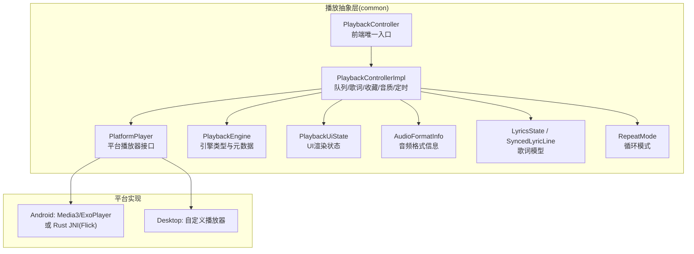
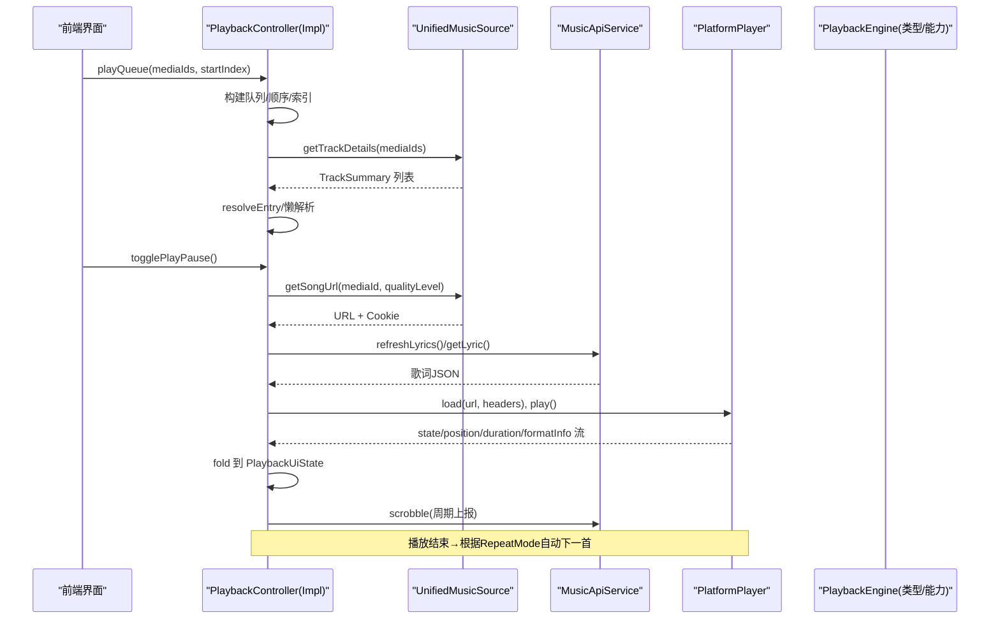
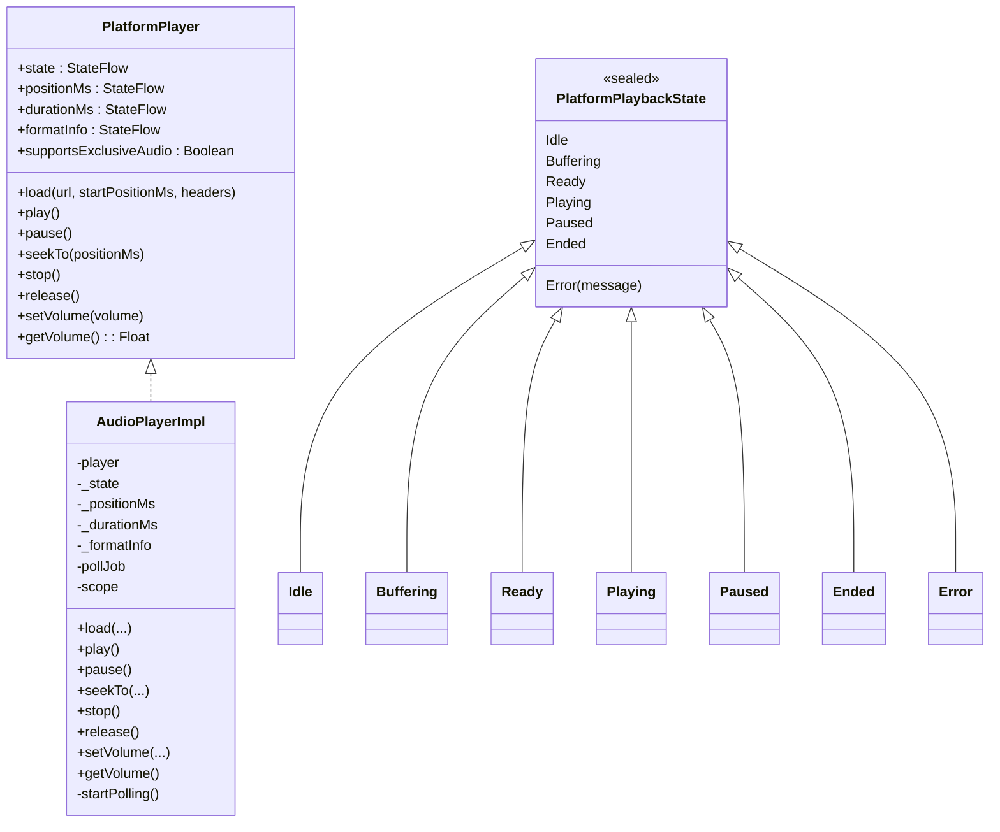
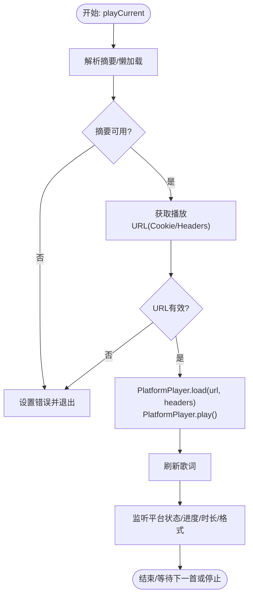
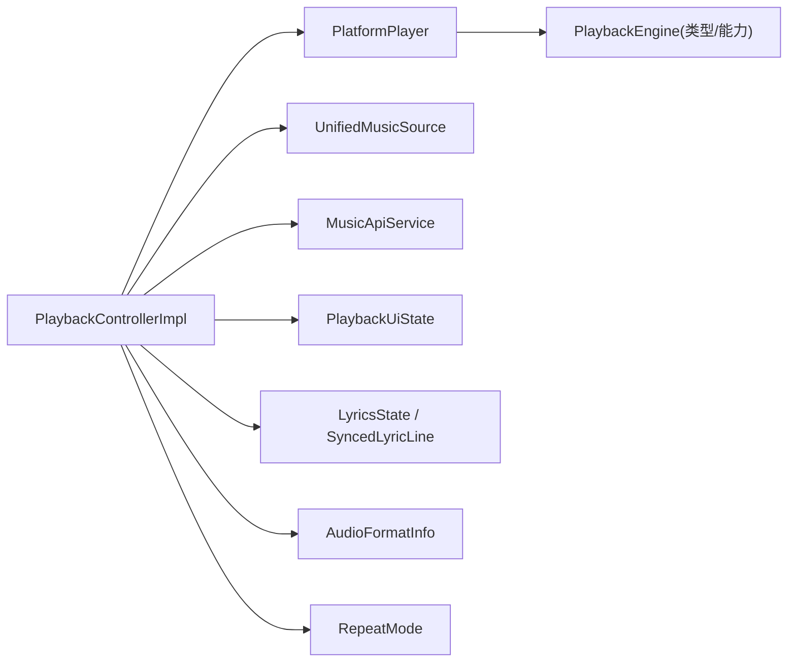

# 平台播放器抽象

<cite>
**本文引用的文件**
- [PlatformPlayer.kt](file://kmp-pro/src/commonMain/kotlin/cp/player/kmp/playback/PlatformPlayer.kt)
- [PlaybackEngine.kt](file://kmp-pro/src/commonMain/kotlin/cp/player/kmp/playback/PlaybackEngine.kt)
- [PlaybackController.kt](file://kmp-pro/src/commonMain/kotlin/cp/player/kmp/playback/PlaybackController.kt)
- [PlaybackControllerImpl.kt](file://kmp-pro/src/commonMain/kotlin/cp/player/kmp/playback/PlaybackControllerImpl.kt)
- [AudioFormatInfo.kt](file://kmp-pro/src/commonMain/kotlin/cp/player/kmp/playback/AudioFormatInfo.kt)
- [RepeatMode.kt](file://kmp-pro/src/commonMain/kotlin/cp/player/kmp/playback/RepeatMode.kt)
- [PlaybackUiState.kt](file://kmp-pro/src/commonMain/kotlin/cp/player/kmp/playback/PlaybackUiState.kt)
- [LyricsState.kt](file://kmp-pro/src/commonMain/kotlin/cp/player/kmp/playback/LyricsState.kt)
- [SyncedLyricLine.kt](file://kmp-pro/src/commonMain/kotlin/cp/player/kmp/playback/SyncedLyricLine.kt)
</cite>

## 目录
1. [简介](#简介)
2. [项目结构](#项目结构)
3. [核心组件](#核心组件)
4. [架构总览](#架构总览)
5. [详细组件分析](#详细组件分析)
6. [依赖关系分析](#依赖关系分析)
7. [性能与资源管理](#性能与资源管理)
8. [故障排查指南](#故障排查指南)
9. [结论](#结论)
10. [附录：扩展指南与示例路径](#附录：扩展指南与示例路径)

## 简介
本技术文档围绕 PlatformPlayer 平台抽象层，系统阐述跨平台播放器的架构设计与实现要点。通过依赖注入将 Android Media3（ExoPlayer）与 Desktop 自定义播放器统一为一致的接口，屏蔽底层差异；在通用层完成队列、歌词、收藏、音质切换、睡眠定时等能力编排，并以 StateFlow 暴露前端可渲染的完整状态。本文重点覆盖音频格式支持、音量控制、播放位置同步、错误处理与降级策略，以及不同平台的性能优化与资源管理方式，并提供扩展自定义播放器的实践建议与调试技巧。

## 项目结构
本项目采用 Kotlin Multiplatform 组织，播放相关代码集中在 kmp-pro 模块的 commonMain 中，提供平台无关的接口与实现骨架；Android 与 Desktop 的具体引擎实现可在对应 actual 目录扩展（当前仓库以 common 层为主）。

图表来源
- [PlatformPlayer.kt:16-31](file://kmp-pro/src/commonMain/kotlin/cp/player/kmp/playback/PlatformPlayer.kt#L16-L31)
- [PlaybackController.kt:6-15](file://kmp-pro/src/commonMain/kotlin/cp/player/kmp/playback/PlaybackController.kt#L6-L15)
- [PlaybackControllerImpl.kt:18-34](file://kmp-pro/src/commonMain/kotlin/cp/player/kmp/playback/PlaybackControllerImpl.kt#L18-L34)
- [PlaybackEngine.kt:21-60](file://kmp-pro/src/commonMain/kotlin/cp/player/kmp/playback/PlaybackEngine.kt#L21-L60)
- [PlaybackUiState.kt:5-11](file://kmp-pro/src/commonMain/kotlin/cp/player/kmp/playback/PlaybackUiState.kt#L5-L11)
- [AudioFormatInfo.kt:3-7](file://kmp-pro/src/commonMain/kotlin/cp/player/kmp/playback/AudioFormatInfo.kt#L3-L7)
- [LyricsState.kt:5-17](file://kmp-pro/src/commonMain/kotlin/cp/player/kmp/playback/LyricsState.kt#L5-L17)
- [RepeatMode.kt:3-11](file://kmp-pro/src/commonMain/kotlin/cp/player/kmp/playback/RepeatMode.kt#L3-L11)

章节来源
- [PlatformPlayer.kt:16-31](file://kmp-pro/src/commonMain/kotlin/cp/player/kmp/playback/PlatformPlayer.kt#L16-L31)
- [PlaybackController.kt:6-15](file://kmp-pro/src/commonMain/kotlin/cp/player/kmp/playback/PlaybackController.kt#L6-L15)
- [PlaybackEngine.kt:21-60](file://kmp-pro/src/commonMain/kotlin/cp/player/kmp/playback/PlaybackEngine.kt#L21-L60)

## 核心组件
- PlatformPlayer：定义跨平台播放器统一接口，包括加载、播放/暂停、跳转、停止、释放、音量控制，以及状态、位置、时长、格式信息的 StateFlow 暴露。
- PlaybackEngine：更高层的播放引擎抽象，声明引擎类型（EXO_PLAYER、FLICK_PLAYER、DESKTOP）、独占音频通路能力、播放/暂停/恢复/停止/跳转/状态流/音量设置等。
- PlaybackController：前端唯一入口，封装队列管理、URL 解析、歌词获取、收藏、音质切换、睡眠定时、自动续播等复杂逻辑。
- PlaybackControllerImpl：具体实现，协调 PlatformPlayer、UnifiedMusicSource、MusicApiService，并将平台事件折叠进 PlaybackUiState。
- PlaybackUiState：不可变 UI 状态，包含曲目、队列、播放态、缓冲态、进度、时长、循环/随机、歌词、格式信息、错误、来源、收藏、音质等级、睡眠定时等。
- AudioFormatInfo：音频格式信息（编解码器、采样率、位深、声道、码率、MIME），并生成质量标签用于 UI 展示。
- LyricsState / SyncedLyricLine：统一的歌词状态与行模型，支持时间戳、翻译、罗马音、逐字时间戳。
- RepeatMode：循环模式枚举（关闭、单曲循环、列表循环）。

章节来源
- [PlatformPlayer.kt:16-31](file://kmp-pro/src/commonMain/kotlin/cp/player/kmp/playback/PlatformPlayer.kt#L16-L31)
- [PlaybackEngine.kt:21-60](file://kmp-pro/src/commonMain/kotlin/cp/player/kmp/playback/PlaybackEngine.kt#L21-L60)
- [PlaybackController.kt:6-15](file://kmp-pro/src/commonMain/kotlin/cp/player/kmp/playback/PlaybackController.kt#L6-L15)
- [PlaybackControllerImpl.kt:18-34](file://kmp-pro/src/commonMain/kotlin/cp/player/kmp/playback/PlaybackControllerImpl.kt#L18-L34)
- [PlaybackUiState.kt:5-11](file://kmp-pro/src/commonMain/kotlin/cp/player/kmp/playback/PlaybackUiState.kt#L5-L11)
- [AudioFormatInfo.kt:3-7](file://kmp-pro/src/commonMain/kotlin/cp/player/kmp/playback/AudioFormatInfo.kt#L3-L7)
- [LyricsState.kt:5-17](file://kmp-pro/src/commonMain/kotlin/cp/player/kmp/playback/LyricsState.kt#L5-L17)
- [RepeatMode.kt:3-11](file://kmp-pro/src/commonMain/kotlin/cp/player/kmp/playback/RepeatMode.kt#L3-L11)

## 架构总览
整体架构遵循“上层编排 + 下层适配”的分层设计：
- 上层（PlaybackController/Impl）负责业务编排：队列、歌词、收藏、音质、定时、自动续播、Scrobble 上报等。
- 中层（PlatformPlayer）屏蔽平台差异，统一加载、播放、暂停、跳转、音量、状态流。
- 下层（PlaybackEngine）声明引擎类型与能力，便于未来按平台接入 Media3/Flick/Desktop 引擎。

图表来源
- [PlaybackControllerImpl.kt:144-158](file://kmp-pro/src/commonMain/kotlin/cp/player/kmp/playback/PlaybackControllerImpl.kt#L144-L158)
- [PlaybackControllerImpl.kt:496-556](file://kmp-pro/src/commonMain/kotlin/cp/player/kmp/playback/PlaybackControllerImpl.kt#L496-L556)
- [PlaybackControllerImpl.kt:577-602](file://kmp-pro/src/commonMain/kotlin/cp/player/kmp/playback/PlaybackControllerImpl.kt#L577-L602)
- [PlaybackControllerImpl.kt:721-753](file://kmp-pro/src/commonMain/kotlin/cp/player/kmp/playback/PlaybackControllerImpl.kt#L721-L753)
- [PlaybackEngine.kt:21-60](file://kmp-pro/src/commonMain/kotlin/cp/player/kmp/playback/PlaybackEngine.kt#L21-L60)

## 详细组件分析

### PlatformPlayer：平台播放器接口与默认实现
- 职责：定义跨平台播放的统一方法集（load/play/pause/seekTo/stop/release/setVolume/getVolume），并通过 StateFlow 暴露状态、位置、时长、格式信息。
- 默认实现：基于第三方音频播放器封装，内部轮询更新状态与进度，监听错误并映射为错误状态。
- 关键点：
  - 状态机：Idle/Buffering/Ready/Playing/Paused/Ended/Error。
  - 位置与时长：通过轮询获取并写入 StateFlow。
  - 错误处理：错误回调直接转为 Error 状态。
  - 音量：setVolume 透传；getVolume 返回固定值（若底层不支持读取）。

图表来源
- [PlatformPlayer.kt:16-41](file://kmp-pro/src/commonMain/kotlin/cp/player/kmp/playback/PlatformPlayer.kt#L16-L41)
- [PlatformPlayer.kt:43-135](file://kmp-pro/src/commonMain/kotlin/cp/player/kmp/playback/PlatformPlayer.kt#L43-L135)

章节来源
- [PlatformPlayer.kt:16-41](file://kmp-pro/src/commonMain/kotlin/cp/player/kmp/playback/PlatformPlayer.kt#L16-L41)
- [PlatformPlayer.kt:43-135](file://kmp-pro/src/commonMain/kotlin/cp/player/kmp/playback/PlatformPlayer.kt#L43-L135)

### PlaybackController 与 PlaybackControllerImpl：编排层
- 职责：
  - 队列管理：添加、移除、移动、清空、定位播放。
  - 播放控制：播放/暂停/恢复、跳转、上一首/下一首、循环/随机。
  - 歌词：拉取、解析、高亮当前行。
  - 收藏：乐观更新、失败回滚、刷新。
  - 音质：设置在线音质等级，并在失败时自动降级到 standard。
  - 睡眠定时：倒计时或播完当前暂停。
  - Scrobble：播放中每秒计数，周期性上报。
- 关键流程：
  - playCurrent：解析摘要→获取URL→构造请求头→调用 PlatformPlayer.load/play→刷新歌词→监听平台状态→自动续播。
  - 错误降级：当播放失败且非 standard 音质时，尝试以 standard 重试一次。
  - 状态折叠：将平台 state/position/duration/formatInfo 合并到 PlaybackUiState。

图表来源
- [PlaybackControllerImpl.kt:496-556](file://kmp-pro/src/commonMain/kotlin/cp/player/kmp/playback/PlaybackControllerImpl.kt#L496-L556)
- [PlaybackControllerImpl.kt:558-575](file://kmp-pro/src/commonMain/kotlin/cp/player/kmp/playback/PlaybackControllerImpl.kt#L558-L575)

章节来源
- [PlaybackControllerImpl.kt:144-158](file://kmp-pro/src/commonMain/kotlin/cp/player/kmp/playback/PlaybackControllerImpl.kt#L144-L158)
- [PlaybackControllerImpl.kt:496-556](file://kmp-pro/src/commonMain/kotlin/cp/player/kmp/playback/PlaybackControllerImpl.kt#L496-L556)
- [PlaybackControllerImpl.kt:558-575](file://kmp-pro/src/commonMain/kotlin/cp/player/kmp/playback/PlaybackControllerImpl.kt#L558-L575)
- [PlaybackControllerImpl.kt:577-602](file://kmp-pro/src/commonMain/kotlin/cp/player/kmp/playback/PlaybackControllerImpl.kt#L577-L602)
- [PlaybackControllerImpl.kt:721-753](file://kmp-pro/src/commonMain/kotlin/cp/player/kmp/playback/PlaybackControllerImpl.kt#L721-L753)

### PlaybackEngine：引擎抽象
- 作用：声明引擎类型（EXO_PLAYER、FLICK_PLAYER、DESKTOP）、独占音频通路能力、播放/暂停/恢复/停止/跳转/状态流/音量设置。
- 设计意图：将音乐源（取数据）与播放引擎（解码/缓冲/输出）解耦，使 MusicBackend 可通过统一接口访问播放能力，切换引擎不影响数据层。

章节来源
- [PlaybackEngine.kt:21-60](file://kmp-pro/src/commonMain/kotlin/cp/player/kmp/playback/PlaybackEngine.kt#L21-L60)
- [PlaybackEngine.kt:65-72](file://kmp-pro/src/commonMain/kotlin/cp/player/kmp/playback/PlaybackEngine.kt#L65-L72)

### 数据模型：PlaybackUiState、AudioFormatInfo、LyricsState、RepeatMode
- PlaybackUiState：前端渲染所需的全部状态集合，保证不可变性与一次性推送。
- AudioFormatInfo：提取平台播放器提供的音频格式信息，并生成质量标签用于 UI 摘要展示。
- LyricsState：歌词状态（空闲/加载中/成功/无歌词/错误），配合 SyncedLyricLine 表示带时间戳的行。
- RepeatMode：循环模式（关闭、单曲循环、列表循环）。

章节来源
- [PlaybackUiState.kt:5-11](file://kmp-pro/src/commonMain/kotlin/cp/player/kmp/playback/PlaybackUiState.kt#L5-L11)
- [PlaybackUiState.kt:12-35](file://kmp-pro/src/commonMain/kotlin/cp/player/kmp/playback/PlaybackUiState.kt#L12-L35)
- [AudioFormatInfo.kt:3-7](file://kmp-pro/src/commonMain/kotlin/cp/player/kmp/playback/AudioFormatInfo.kt#L3-L7)
- [AudioFormatInfo.kt:8-23](file://kmp-pro/src/commonMain/kotlin/cp/player/kmp/playback/AudioFormatInfo.kt#L8-L23)
- [LyricsState.kt:5-17](file://kmp-pro/src/commonMain/kotlin/cp/player/kmp/playback/LyricsState.kt#L5-L17)
- [LyricsState.kt:25-41](file://kmp-pro/src/commonMain/kotlin/cp/player/kmp/playback/LyricsState.kt#L25-L41)
- [RepeatMode.kt:3-11](file://kmp-pro/src/commonMain/kotlin/cp/player/kmp/playback/RepeatMode.kt#L3-L11)

## 依赖关系分析
- 耦合与内聚：
  - PlaybackControllerImpl 高度内聚于队列、歌词、收藏、音质、定时、Scrobble 等业务编排，内聚性强。
  - 对 PlatformPlayer 的依赖单一且稳定，屏蔽了平台差异。
  - 对 UnifiedMusicSource 与 MusicApiService 的依赖清晰，职责分离明确。
- 外部依赖：
  - 第三方音频播放器（在 PlatformPlayer 默认实现中使用）。
  - 网络请求与 JSON 解析（在歌词、收藏、Scrobble 中）。
- 潜在循环依赖：
  - 当前未见循环依赖；各层单向依赖，符合分层架构。

图表来源
- [PlaybackControllerImpl.kt:18-34](file://kmp-pro/src/commonMain/kotlin/cp/player/kmp/playback/PlaybackControllerImpl.kt#L18-L34)
- [PlaybackEngine.kt:21-60](file://kmp-pro/src/commonMain/kotlin/cp/player/kmp/playback/PlaybackEngine.kt#L21-L60)

章节来源
- [PlaybackControllerImpl.kt:18-34](file://kmp-pro/src/commonMain/kotlin/cp/player/kmp/playback/PlaybackControllerImpl.kt#L18-L34)
- [PlaybackEngine.kt:21-60](file://kmp-pro/src/commonMain/kotlin/cp/player/kmp/playback/PlaybackEngine.kt#L21-L60)

## 性能与资源管理
- 轮询与节流：
  - PlatformPlayer 默认实现使用协程定期轮询播放器状态与进度（例如每 200ms），避免频繁 UI 更新与过度 CPU 占用。
- 懒解析与批量加载：
  - 队列条目摘要懒解析，优先解析当前及附近条目；批量拉取详情以减少网络请求次数。
- 错误降级：
  - 播放失败时，若非 standard 音质则自动降级到 standard 重试一次，提升兼容性。
- 资源释放：
  - release 方法取消所有后台任务并释放底层播放器资源，避免内存泄漏。
- 平台优化建议：
  - Android：优先使用 Media3/ExoPlayer 的硬件解码与缓存策略；必要时启用独占音频通路（如 UAC DAC）。
  - Desktop：选择低延迟音频后端，合理设置缓冲区大小，减少卡顿；按需加载歌词与封面。

[本节为通用指导，不直接分析具体文件]

## 故障排查指南
- 常见问题与定位：
  - 无法获取播放地址：检查 UnifiedMusicSource.getSongUrl 返回值与 Cookie 注入是否正确。
  - 播放失败：查看 PlatformPlayer 的错误状态；若为非 standard 音质，确认是否触发降级逻辑。
  - 歌词为空或错误：检查 MusicApiService.getLyric 返回与 LyricsParser 解析结果。
  - Scrobble 未上报：确认播放中状态与计时任务是否运行。
- 调试技巧：
  - 观察 PlaybackUiState 的变化，定位问题阶段（缓冲/播放/错误）。
  - 打印 PlatformPlayer 的状态流与位置/时长变化，验证平台播放器行为。
  - 在播放失败时强制切换到 standard 音质，验证是否为格式兼容性问题。

章节来源
- [PlaybackControllerImpl.kt:496-556](file://kmp-pro/src/commonMain/kotlin/cp/player/kmp/playback/PlaybackControllerImpl.kt#L496-L556)
- [PlaybackControllerImpl.kt:558-575](file://kmp-pro/src/commonMain/kotlin/cp/player/kmp/playback/PlaybackControllerImpl.kt#L558-L575)
- [PlaybackControllerImpl.kt:721-753](file://kmp-pro/src/commonMain/kotlin/cp/player/kmp/playback/PlaybackControllerImpl.kt#L721-L753)

## 结论
PlatformPlayer 抽象层通过清晰的接口与编排层设计，实现了跨平台播放器的统一体验。PlaybackControllerImpl 将复杂的业务逻辑封装在内，对外仅暴露稳定的 StateFlow 状态；PlatformPlayer 屏蔽平台差异，便于后续接入 Media3/Flick/Desktop 引擎。结合懒解析、批量加载、错误降级与资源释放策略，系统在功能完整性与性能之间取得平衡。

[本节为总结性内容，不直接分析具体文件]

## 附录：扩展指南与示例路径
- 扩展自定义播放器：
  - 实现 PlatformPlayer 接口，提供 load/play/pause/seekTo/stop/release/setVolume/getVolume 与状态流。
  - 在 createPlatformPlayer 中返回你的实际实现，以便注入到 PlaybackControllerImpl。
  - 确保状态流转正确映射（Idle/Buffering/Ready/Playing/Paused/Ended/Error），并实时更新 positionMs/durationMs/formatInfo。
- 接口实现要求与注意事项：
  - 线程安全：状态流应在合适的调度器上更新，避免竞态条件。
  - 资源管理：release 必须取消所有后台任务并释放底层资源。
  - 错误处理：错误回调需转换为 Error 状态，便于上层统一处理。
  - 音量控制：setVolume 应限制在 0.0~1.0 范围；getVolume 若底层不支持读取，可返回默认值。
- 示例路径（参考现有实现）：
  - 平台播放器接口与默认实现：[PlatformPlayer.kt:16-135](file://kmp-pro/src/commonMain/kotlin/cp/player/kmp/playback/PlatformPlayer.kt#L16-L135)
  - 播放控制器实现（队列/歌词/收藏/音质/定时/Scrobble）：[PlaybackControllerImpl.kt:144-753](file://kmp-pro/src/commonMain/kotlin/cp/player/kmp/playback/PlaybackControllerImpl.kt#L144-L753)
  - 引擎抽象与类型：[PlaybackEngine.kt:21-72](file://kmp-pro/src/commonMain/kotlin/cp/player/kmp/playback/PlaybackEngine.kt#L21-L72)
  - UI 状态与数据模型：[PlaybackUiState.kt:12-35](file://kmp-pro/src/commonMain/kotlin/cp/player/kmp/playback/PlaybackUiState.kt#L12-L35)、[AudioFormatInfo.kt:8-23](file://kmp-pro/src/commonMain/kotlin/cp/player/kmp/playback/AudioFormatInfo.kt#L8-L23)、[LyricsState.kt:5-41](file://kmp-pro/src/commonMain/kotlin/cp/player/kmp/playback/LyricsState.kt#L5-L41)

章节来源
- [PlatformPlayer.kt:16-135](file://kmp-pro/src/commonMain/kotlin/cp/player/kmp/playback/PlatformPlayer.kt#L16-L135)
- [PlaybackControllerImpl.kt:144-753](file://kmp-pro/src/commonMain/kotlin/cp/player/kmp/playback/PlaybackControllerImpl.kt#L144-L753)
- [PlaybackEngine.kt:21-72](file://kmp-pro/src/commonMain/kotlin/cp/player/kmp/playback/PlaybackEngine.kt#L21-L72)
- [PlaybackUiState.kt:12-35](file://kmp-pro/src/commonMain/kotlin/cp/player/kmp/playback/PlaybackUiState.kt#L12-L35)
- [AudioFormatInfo.kt:8-23](file://kmp-pro/src/commonMain/kotlin/cp/player/kmp/playback/AudioFormatInfo.kt#L8-L23)
- [LyricsState.kt:5-41](file://kmp-pro/src/commonMain/kotlin/cp/player/kmp/playback/LyricsState.kt#L5-L41)