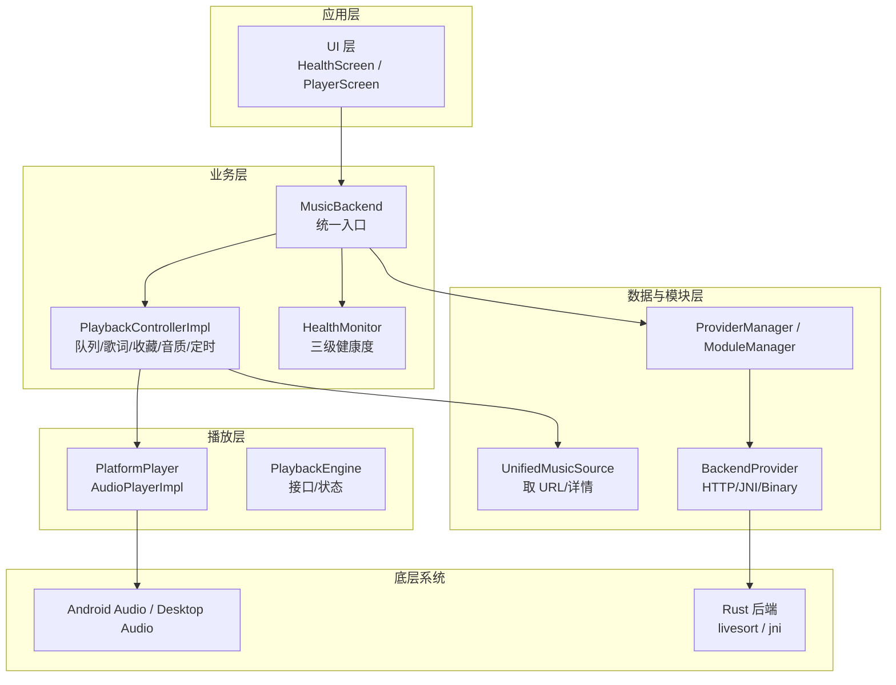
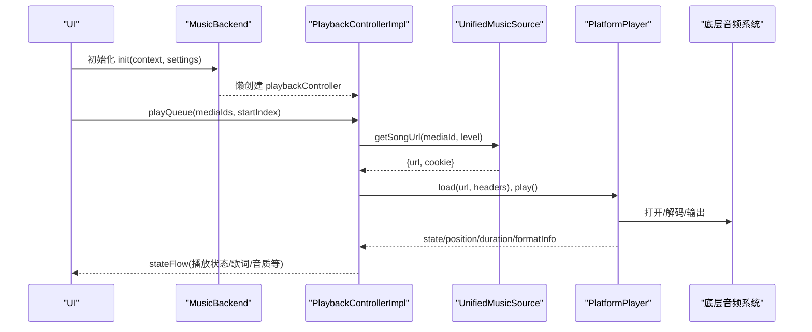
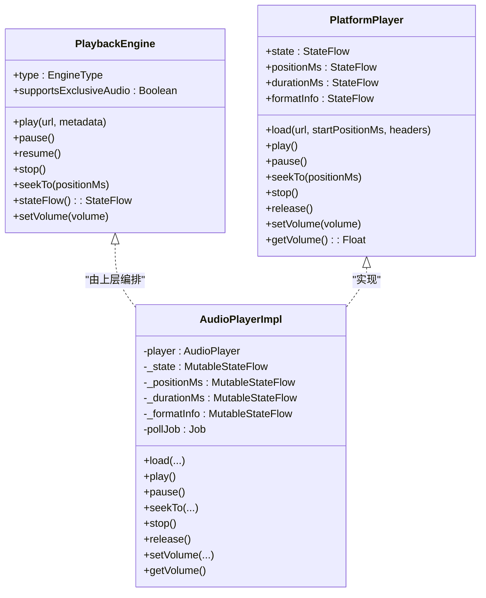
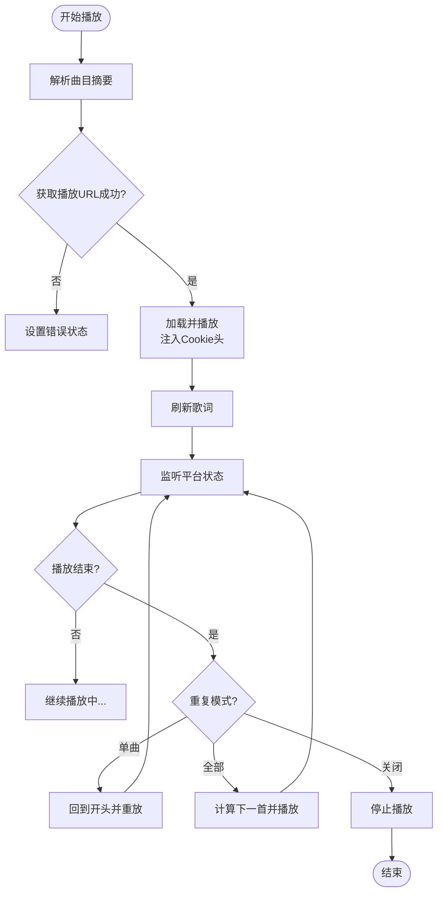
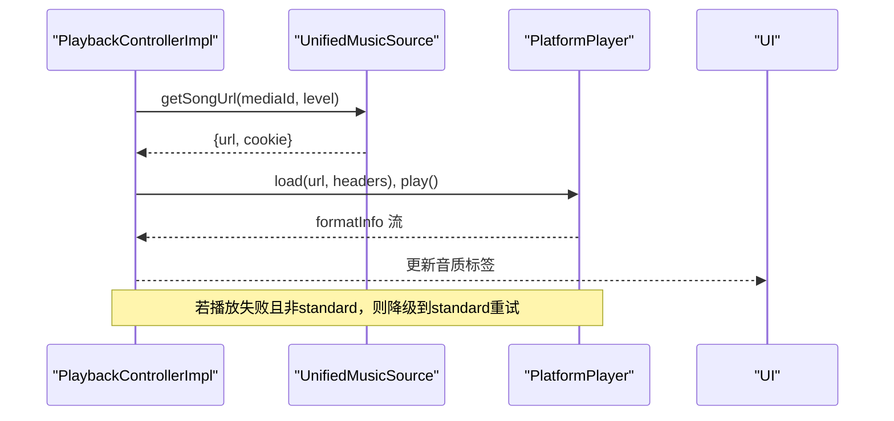
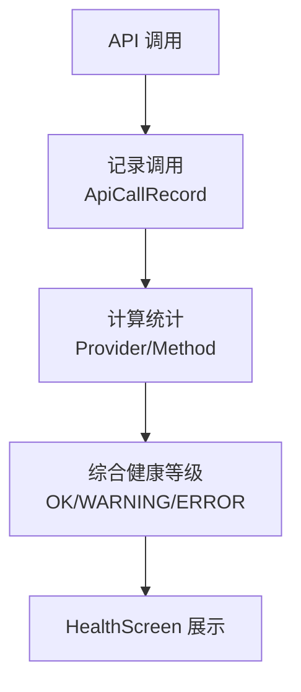
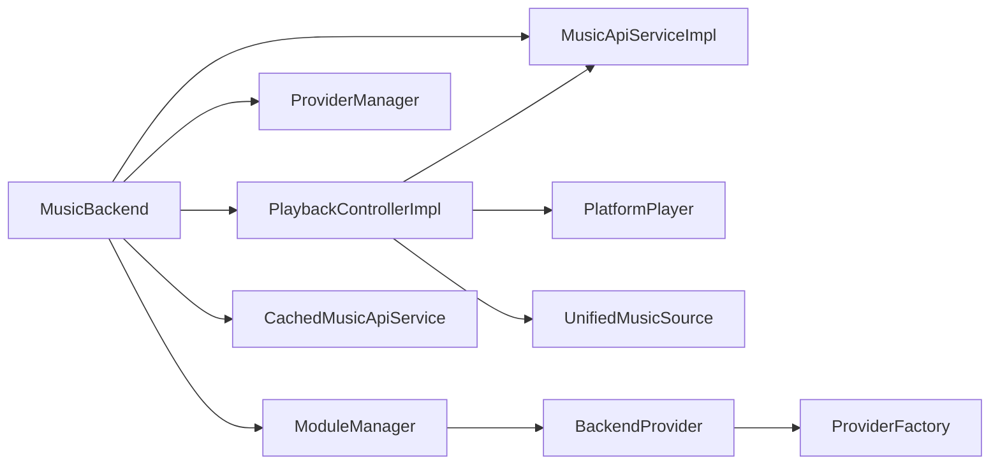

# 播放引擎管理

<cite>
**本文引用的文件**
- [PlaybackEngine.kt](file://kmp-pro/src/commonMain/kotlin/cp/player/kmp/playback/PlaybackEngine.kt)
- [PlatformPlayer.kt](file://kmp-pro/src/commonMain/kotlin/cp/player/kmp/playback/PlatformPlayer.kt)
- [AudioFormatInfo.kt](file://kmp-pro/src/commonMain/kotlin/cp/player/kmp/playback/AudioFormatInfo.kt)
- [PlaybackController.kt](file://kmp-pro/src/commonMain/kotlin/cp/player/kmp/playback/PlaybackController.kt)
- [PlaybackControllerImpl.kt](file://kmp-pro/src/commonMain/kotlin/cp/player/kmp/playback/PlaybackControllerImpl.kt)
- [MusicBackend.kt](file://kmp-pro/src/commonMain/kotlin/cp/player/kmp/MusicBackend.kt)
- [HealthMonitor.kt](file://kmp-pro/src/commonMain/kotlin/cp/player/kmp/monitor/HealthMonitor.kt)
- [BackendProvider.kt](file://kmp-pro/src/commonMain/kotlin/cp/player/kmp/provider/BackendProvider.kt)
- [ModuleManager.kt](file://kmp-pro/src/commonMain/kotlin/cp/player/kmp/provider/ModuleManager.kt)
- [ProviderFactory.kt](file://kmp-pro/src/commonMain/kotlin/cp/player/kmp/provider/ProviderFactory.kt)
- [PlatformInfo.kt](file://kmp-pro/src/commonMain/kotlin/cp/player/kmp/util/PlatformInfo.kt)
- [PlatformInfo.android.kt](file://kmp-pro/src/androidMain/kotlin/cp/player/kmp/util/PlatformInfo.kt)
- [PlatformInfo.desktop.kt](file://kmp-pro/src/desktopMain/kotlin/cp/player/kmp/util/PlatformInfo.kt)
- [livesort.rs](file://API_MODULE_AND_OLD_PROJECT_REPO/3rd-CPPlayer-netcloudMusic-Muti/src/util/livesort.rs)
- [jni.rs](file://API_MODULE_AND_OLD_PROJECT_REPO/3rd-CPPlayer-netcloudMusic-Muti/src/util/jni.rs)
- [song_url_v1.rs](file://API_MODULE_AND_OLD_PROJECT_REPO/3rd-CPPlayer-netcloudMusic-Muti/src/api/song_url_v1.rs)
- [HealthScreen.kt](file://app/src/commonMain/kotlin/cp/player/app/ui/screen/HealthScreen.kt)
</cite>

## 目录
1. [简介](#简介)
2. [项目结构](#项目结构)
3. [核心组件](#核心组件)
4. [架构总览](#架构总览)
5. [详细组件分析](#详细组件分析)
6. [依赖关系分析](#依赖关系分析)
7. [性能考量](#性能考量)
8. [故障排查指南](#故障排查指南)
9. [结论](#结论)
10. [附录](#附录)

## 简介
本技术文档面向“播放引擎管理系统”，围绕播放引擎的初始化流程、生命周期管理、资源分配机制，以及音频格式检测与处理、健康监控与错误恢复、与底层音频系统的交互和性能优化策略展开。同时提供配置选项与扩展点使用指南，并给出故障排查与性能调优的最佳实践。

## 项目结构
本项目采用 KMP（Kotlin Multiplatform）分层组织：
- commonMain：跨平台抽象与核心逻辑（播放控制、统一音乐源、健康监控、模块管理等）
- androidMain/desktopMain：平台特定实现（如 PlatformInfo、Provider 工厂等）
- jvmMain：JVM 侧 Provider 桥接（JNI/Binary）
- app：Compose UI 与示例页面（含健康监控界面）
- API_MODULE_AND_OLD_PROJECT_REPO：旧版 Rust 后端能力（音频分析、URL 获取等），通过 JNI 暴露给上层

图表来源
- [MusicBackend.kt:131-161](file://kmp-pro/src/commonMain/kotlin/cp/player/kmp/MusicBackend.kt#L131-L161)
- [PlaybackControllerImpl.kt:18-41](file://kmp-pro/src/commonMain/kotlin/cp/player/kmp/playback/PlaybackControllerImpl.kt#L18-L41)
- [PlatformPlayer.kt:16-31](file://kmp-pro/src/commonMain/kotlin/cp/player/kmp/playback/PlatformPlayer.kt#L16-L31)
- [BackendProvider.kt:24-96](file://kmp-pro/src/commonMain/kotlin/cp/player/kmp/provider/BackendProvider.kt#L24-L96)
- [HealthMonitor.kt:25-115](file://kmp-pro/src/commonMain/kotlin/cp/player/kmp/monitor/HealthMonitor.kt#L25-L115)

章节来源
- [MusicBackend.kt:30-72](file://kmp-pro/src/commonMain/kotlin/cp/player/kmp/MusicBackend.kt#L30-L72)
- [PlatformInfo.kt:5-20](file://kmp-pro/src/commonMain/kotlin/cp/player/kmp/util/PlatformInfo.kt#L5-L20)

## 核心组件
- PlaybackEngine：跨平台播放引擎接口，定义类型、独占音频支持、播放/暂停/停止/跳转/音量/状态流等能力。
- PlatformPlayer：平台播放器抽象与默认实现（基于 Compose Media Player），封装状态轮询、位置/时长/格式信息流。
- PlaybackController / PlaybackControllerImpl：前端唯一播控入口，负责队列管理、URL 解析、歌词抓取、收藏、音质选择、睡眠定时、自动下一首、Scrobble 上报等。
- MusicBackend：后端统一入口，管理 Provider、缓存、本地音乐、播放控制器、健康监控，并提供状态机。
- HealthMonitor：API 调用健康监控，记录调用、计算统计、综合等级（OK/WARNING/ERROR）。
- BackendProvider / ModuleManager / ProviderFactory：模块加载、Provider 创建与管理，支持 HTTP/JNI/Binary 多种接入方式。
- AudioFormatInfo：当前播放音频格式信息（编码名、采样率、位深、声道、码率、MIME），用于 UI 展示音质标签。

章节来源
- [PlaybackEngine.kt:21-96](file://kmp-pro/src/commonMain/kotlin/cp/player/kmp/playback/PlaybackEngine.kt#L21-L96)
- [PlatformPlayer.kt:16-135](file://kmp-pro/src/commonMain/kotlin/cp/player/kmp/playback/PlatformPlayer.kt#L16-L135)
- [PlaybackController.kt:6-106](file://kmp-pro/src/commonMain/kotlin/cp/player/kmp/playback/PlaybackController.kt#L6-L106)
- [PlaybackControllerImpl.kt:18-763](file://kmp-pro/src/commonMain/kotlin/cp/player/kmp/playback/PlaybackControllerImpl.kt#L18-L763)
- [MusicBackend.kt:73-161](file://kmp-pro/src/commonMain/kotlin/cp/player/kmp/MusicBackend.kt#L73-L161)
- [HealthMonitor.kt:25-115](file://kmp-pro/src/commonMain/kotlin/cp/player/kmp/monitor/HealthMonitor.kt#L25-L115)
- [BackendProvider.kt:24-110](file://kmp-pro/src/commonMain/kotlin/cp/player/kmp/provider/BackendProvider.kt#L24-L110)
- [ModuleManager.kt:10-137](file://kmp-pro/src/commonMain/kotlin/cp/player/kmp/provider/ModuleManager.kt#L10-L137)
- [AudioFormatInfo.kt:1-23](file://kmp-pro/src/commonMain/kotlin/cp/player/kmp/playback/AudioFormatInfo.kt#L1-L23)

## 架构总览
播放引擎管理以 MusicBackend 为统一入口，向上暴露状态流与播放控制器；向下协调 Provider 模块、缓存、本地音乐与平台播放器。播放控制器将平台播放器状态、位置、时长、格式信息折叠进统一的 UI 状态，屏蔽底层差异。健康监控贯穿 API 调用链路，提供三级健康度与统计。

图表来源
- [MusicBackend.kt:330-367](file://kmp-pro/src/commonMain/kotlin/cp/player/kmp/MusicBackend.kt#L330-L367)
- [PlaybackControllerImpl.kt:144-158](file://kmp-pro/src/commonMain/kotlin/cp/player/kmp/playback/PlaybackControllerImpl.kt#L144-L158)
- [PlaybackControllerImpl.kt:496-556](file://kmp-pro/src/commonMain/kotlin/cp/player/kmp/playback/PlaybackControllerImpl.kt#L496-L556)
- [PlatformPlayer.kt:92-122](file://kmp-pro/src/commonMain/kotlin/cp/player/kmp/playback/PlatformPlayer.kt#L92-L122)

## 详细组件分析

### 播放引擎接口与平台播放器
- PlaybackEngine 定义了跨平台的播放能力与状态模型，便于后续 Android（ExoPlayer/FlickPlayer）与桌面端替换实现。
- PlatformPlayer 提供状态流（播放/缓冲/就绪/结束/错误）、位置/时长/格式信息流，默认实现 AudioPlayerImpl 基于 Compose Media Player，内部启动轮询任务同步状态。

图表来源
- [PlaybackEngine.kt:21-96](file://kmp-pro/src/commonMain/kotlin/cp/player/kmp/playback/PlaybackEngine.kt#L21-L96)
- [PlatformPlayer.kt:16-135](file://kmp-pro/src/commonMain/kotlin/cp/player/kmp/playback/PlatformPlayer.kt#L16-L135)

章节来源
- [PlaybackEngine.kt:21-96](file://kmp-pro/src/commonMain/kotlin/cp/player/kmp/playback/PlaybackEngine.kt#L21-L96)
- [PlatformPlayer.kt:43-135](file://kmp-pro/src/commonMain/kotlin/cp/player/kmp/playback/PlatformPlayer.kt#L43-L135)

### 播放控制器与生命周期管理
- PlaybackControllerImpl 是前端唯一播控入口，维护队列、顺序（顺序/随机）、重复模式、收藏列表、歌词、音质、睡眠定时等。
- 生命周期：
  - 初始化时观察平台播放器状态流，将 playing/buffering/error/ended 折叠到 UI 状态。
  - 播放当前曲目时，先解析 TrackSummary，再取 URL（带 Cookie），调用 PlatformPlayer.load/play，并刷新歌词。
  - 播放结束时根据重复模式决定单曲循环、全部循环或停止；若设置“播完当前暂停”则直接暂停。
  - Scrobble 在播放期间每秒计数，按固定间隔上报，失败静默不影响体验。
  - 释放时取消所有协程并调用 platform.release。

图表来源
- [PlaybackControllerImpl.kt:96-127](file://kmp-pro/src/commonMain/kotlin/cp/player/kmp/playback/PlaybackControllerImpl.kt#L96-L127)
- [PlaybackControllerImpl.kt:496-556](file://kmp-pro/src/commonMain/kotlin/cp/player/kmp/playback/PlaybackControllerImpl.kt#L496-L556)
- [PlaybackControllerImpl.kt:577-602](file://kmp-pro/src/commonMain/kotlin/cp/player/kmp/playback/PlaybackControllerImpl.kt#L577-L602)
- [PlaybackControllerImpl.kt:719-753](file://kmp-pro/src/commonMain/kotlin/cp/player/kmp/playback/PlaybackControllerImpl.kt#L719-L753)

章节来源
- [PlaybackControllerImpl.kt:18-763](file://kmp-pro/src/commonMain/kotlin/cp/player/kmp/playback/PlaybackControllerImpl.kt#L18-L763)

### 音频格式检测与处理流程
- 平台播放器通过 formatInfo 流提供当前播放音频的格式信息（编码名、采样率、位深、声道、码率、MIME），UI 可据此显示“Hi-Res / 24bit 96kHz”等标签。
- 旧版 Rust 后端提供音频特征分析能力（BPM、能量、亮度），通过 JNI 暴露给上层，可用于智能排序等高级功能。
- 在线播放 URL 获取具备质量回退策略：当高音质不可用时，尝试降级到标准音质重试一次，提升兼容性。

图表来源
- [AudioFormatInfo.kt:1-23](file://kmp-pro/src/commonMain/kotlin/cp/player/kmp/playback/AudioFormatInfo.kt#L1-L23)
- [PlaybackControllerImpl.kt:540-575](file://kmp-pro/src/commonMain/kotlin/cp/player/kmp/playback/PlaybackControllerImpl.kt#L540-L575)
- [song_url_v1.rs:39-59](file://API_MODULE_AND_OLD_PROJECT_REPO/3rd-CPPlayer-netcloudMusic-Muti/src/api/song_url_v1.rs#L39-L59)
- [livesort.rs:18-143](file://API_MODULE_AND_OLD_PROJECT_REPO/3rd-CPPlayer-netcloudMusic-Muti/src/util/livesort.rs#L18-L143)
- [jni.rs:134-163](file://API_MODULE_AND_OLD_PROJECT_REPO/3rd-CPPlayer-netcloudMusic-Muti/src/util/jni.rs#L134-L163)

章节来源
- [AudioFormatInfo.kt:1-23](file://kmp-pro/src/commonMain/kotlin/cp/player/kmp/playback/AudioFormatInfo.kt#L1-L23)
- [PlaybackControllerImpl.kt:540-575](file://kmp-pro/src/commonMain/kotlin/cp/player/kmp/playback/PlaybackControllerImpl.kt#L540-L575)
- [song_url_v1.rs:39-59](file://API_MODULE_AND_OLD_PROJECT_REPO/3rd-CPPlayer-netcloudMusic-Muti/src/api/song_url_v1.rs#L39-L59)
- [livesort.rs:18-143](file://API_MODULE_AND_OLD_PROJECT_REPO/3rd-CPPlayer-netcloudMusic-Muti/src/util/livesort.rs#L18-L143)
- [jni.rs:134-163](file://API_MODULE_AND_OLD_PROJECT_REPO/3rd-CPPlayer-netcloudMusic-Muti/src/util/jni.rs#L134-L163)

### 健康监控与错误恢复
- HealthMonitor 记录每次 API 调用，包含耗时、是否回退、响应警告、原始响应等，提供按 Provider/方法维度的统计与综合健康等级。
- 综合等级基于最近窗口扫描，最差优先（ERROR > WARNING > OK）。
- UI 通过 HealthScreen 展示总体等级与记录过滤（全部/仅异常），支持清空记录。

图表来源
- [HealthMonitor.kt:117-143](file://kmp-pro/src/commonMain/kotlin/cp/player/kmp/monitor/HealthMonitor.kt#L117-L143)
- [HealthMonitor.kt:220-289](file://kmp-pro/src/commonMain/kotlin/cp/player/kmp/monitor/HealthMonitor.kt#L220-L289)
- [HealthScreen.kt:46-186](file://app/src/commonMain/kotlin/cp/player/app/ui/screen/HealthScreen.kt#L46-L186)

章节来源
- [HealthMonitor.kt:25-289](file://kmp-pro/src/commonMain/kotlin/cp/player/kmp/monitor/HealthMonitor.kt#L25-L289)
- [HealthScreen.kt:46-186](file://app/src/commonMain/kotlin/cp/player/app/ui/screen/HealthScreen.kt#L46-L186)

### 与底层音频系统的交互与性能优化
- PlatformPlayer 通过轮询（200ms）同步状态、位置、时长，避免频繁回调开销；错误监听直接映射为 Error 状态。
- 播放控制器将平台事件折叠到单一 UI 状态流，减少 UI 订阅复杂度。
- 队列批量解析（每批 50 条）降低网络压力；懒解析 TrackSummary 减少不必要请求。
- Scrobble 后台定时上报，失败静默，不阻塞主流程。

章节来源
- [PlatformPlayer.kt:70-90](file://kmp-pro/src/commonMain/kotlin/cp/player/kmp/playback/PlatformPlayer.kt#L70-L90)
- [PlaybackControllerImpl.kt:643-671](file://kmp-pro/src/commonMain/kotlin/cp/player/kmp/playback/PlaybackControllerImpl.kt#L643-L671)
- [PlaybackControllerImpl.kt:719-753](file://kmp-pro/src/commonMain/kotlin/cp/player/kmp/playback/PlaybackControllerImpl.kt#L719-L753)

### 引擎配置选项与自定义扩展点
- 音质选择：通过 setQuality(level) 设置后续加载曲目的音质等级（如 exhigh/lossless/hires/standard），失败时自动降级到 standard 重试一次。
- 睡眠定时：支持 N 分钟后暂停或“播完当前暂停”，到时自动暂停并清理定时器。
- 重复模式与随机播放：支持单曲循环、全部循环、关闭；随机播放维护独立顺序数组。
- 收藏状态：乐观更新，失败回滚；登录态变化时刷新收藏集合。
- 扩展点：
  - PlaybackEngine：平台具体实现（Android ExoPlayer/FlickPlayer、桌面端待定）。
  - BackendProvider：HTTP/JNI/Binary 三种接入方式，支持模块化管理与动态加载。
  - PlatformInfo：平台 ABI 与模块目录差异抽象，便于跨平台部署。

章节来源
- [PlaybackController.kt:73-87](file://kmp-pro/src/commonMain/kotlin/cp/player/kmp/playback/PlaybackController.kt#L73-L87)
- [PlaybackControllerImpl.kt:403-453](file://kmp-pro/src/commonMain/kotlin/cp/player/kmp/playback/PlaybackControllerImpl.kt#L403-L453)
- [BackendProvider.kt:24-110](file://kmp-pro/src/commonMain/kotlin/cp/player/kmp/provider/BackendProvider.kt#L24-L110)
- [PlatformInfo.kt:5-20](file://kmp-pro/src/commonMain/kotlin/cp/player/kmp/util/PlatformInfo.kt#L5-L20)
- [PlatformInfo.android.kt:1-13](file://kmp-pro/src/androidMain/kotlin/cp/player/kmp/util/PlatformInfo.kt#L1-L13)
- [PlatformInfo.desktop.kt:1-13](file://kmp-pro/src/desktopMain/kotlin/cp/player/kmp/util/PlatformInfo.kt#L1-L13)

## 依赖关系分析
- MusicBackend 依赖 ProviderManager、ModuleManager、MusicApiServiceImpl、CachedMusicApiService、SettingsStorage，并暴露 playbackController。
- PlaybackControllerImpl 依赖 PlatformPlayer、UnifiedMusicSource、MusicApiService，并通过 cookieProvider 注入认证信息。
- PlatformPlayer 依赖 Compose Media Player 的 AudioPlayer，暴露状态流供上层消费。
- ModuleManager 依赖 PlatformSupport 进行文件系统操作，通过 ProviderFactory 创建具体 Provider。
- HealthMonitor 被 MusicBackend 暴露，供 UI 与业务层查询。

图表来源
- [MusicBackend.kt:73-161](file://kmp-pro/src/commonMain/kotlin/cp/player/kmp/MusicBackend.kt#L73-L161)
- [PlaybackControllerImpl.kt:18-41](file://kmp-pro/src/commonMain/kotlin/cp/player/kmp/playback/PlaybackControllerImpl.kt#L18-L41)
- [ModuleManager.kt:10-137](file://kmp-pro/src/commonMain/kotlin/cp/player/kmp/provider/ModuleManager.kt#L10-L137)
- [ProviderFactory.kt:1-29](file://kmp-pro/src/commonMain/kotlin/cp/player/kmp/provider/ProviderFactory.kt#L1-L29)

章节来源
- [MusicBackend.kt:73-161](file://kmp-pro/src/commonMain/kotlin/cp/player/kmp/MusicBackend.kt#L73-L161)
- [PlaybackControllerImpl.kt:18-41](file://kmp-pro/src/commonMain/kotlin/cp/player/kmp/playback/PlaybackControllerImpl.kt#L18-L41)
- [ModuleManager.kt:10-137](file://kmp-pro/src/commonMain/kotlin/cp/player/kmp/provider/ModuleManager.kt#L10-L137)
- [ProviderFactory.kt:1-29](file://kmp-pro/src/commonMain/kotlin/cp/player/kmp/provider/ProviderFactory.kt#L1-L29)

## 性能考量
- 状态轮询频率：PlatformPlayer 每 200ms 轮询一次，平衡了实时性与 CPU 占用。
- 队列解析批次：每次最多解析 50 条摘要，避免一次性大量请求。
- 健康监控：使用 MutableStateFlow.update 避免完整列表复制，统计从快照计算，不阻塞记录路径。
- 音质回退：播放失败时自动降级到 standard 重试，提高兼容性与成功率。
- Scrobble 上报：后台定时上报，失败静默，不影响播放体验。

[本节为通用指导，无需列出具体文件来源]

## 故障排查指南
- 播放失败：检查 PlatformPlayer 的错误状态流；若高音质失败，确认是否已触发 standard 降级重试。
- 无法获取 URL：查看 UnifiedMusicSource 返回结果；结合 HealthMonitor 的响应警告（如缺失字段、慢响应）定位问题。
- Provider 未就绪：检查 ModuleManager.lastLoadError 与 Provider.isReady；JNI 类型可通过反射提取加载错误。
- 健康监控异常：通过 HealthScreen 筛选“仅异常”，查看最近失败记录与响应内容，定位上游服务问题。
- 收藏状态不一致：确认登录态变化后是否调用 refreshFavorites；乐观更新失败会回滚。

章节来源
- [PlatformPlayer.kt:61-68](file://kmp-pro/src/commonMain/kotlin/cp/player/kmp/playback/PlatformPlayer.kt#L61-L68)
- [PlaybackControllerImpl.kt:540-575](file://kmp-pro/src/commonMain/kotlin/cp/player/kmp/playback/PlaybackControllerImpl.kt#L540-L575)
- [ModuleManager.kt:88-117](file://kmp-pro/src/commonMain/kotlin/cp/player/kmp/provider/ModuleManager.kt#L88-L117)
- [HealthScreen.kt:46-186](file://app/src/commonMain/kotlin/cp/player/app/ui/screen/HealthScreen.kt#L46-L186)

## 结论
本播放引擎管理系统以 MusicBackend 为核心，通过 PlaybackControllerImpl 统一管理队列、播放、歌词、收藏、音质与定时等功能，借助 PlatformPlayer 屏蔽底层音频差异，结合 HealthMonitor 提供三级健康监控与统计。模块化的 BackendProvider 支持多类型接入，便于扩展与维护。整体设计强调解耦、可观测性与容错能力，适合跨平台多媒体应用的持续演进。

[本节为总结性内容，无需列出具体文件来源]

## 附录
- 初始化流程：
  - 调用 MusicBackend.init(context, settings) 完成 Provider 扫描、API 服务构建、缓存初始化与终态计算。
  - 首次无活跃 Provider 时进入 NoProvider 状态；导入模块后可自动激活首个可用 Provider。
- 生命周期管理：
  - 播放控制器在初始化时观察平台状态流，播放结束时根据重复模式自动推进或停止。
  - 释放时取消所有协程并调用 platform.release，确保资源回收。
- 资源分配机制：
  - 队列条目懒解析，按需拉取摘要；URL 获取失败时降级重试；Scrobble 后台上报。
- 配置与扩展：
  - 音质等级、重复模式、随机播放、睡眠定时均可通过 PlaybackController 配置。
  - 通过 BackendProvider 扩展新的音源接入方式（HTTP/JNI/Binary）。

[本节为补充说明，无需列出具体文件来源]