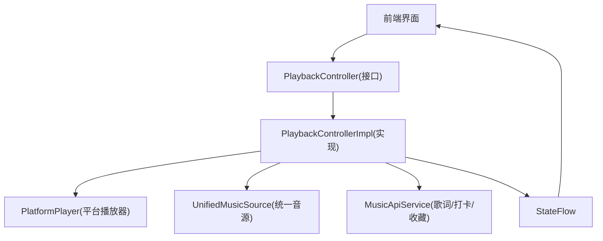
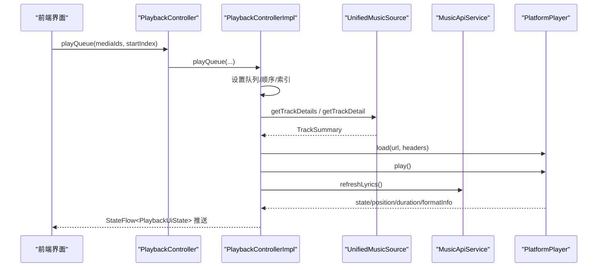
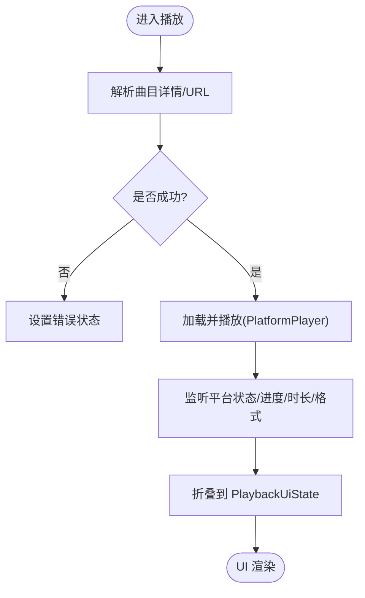
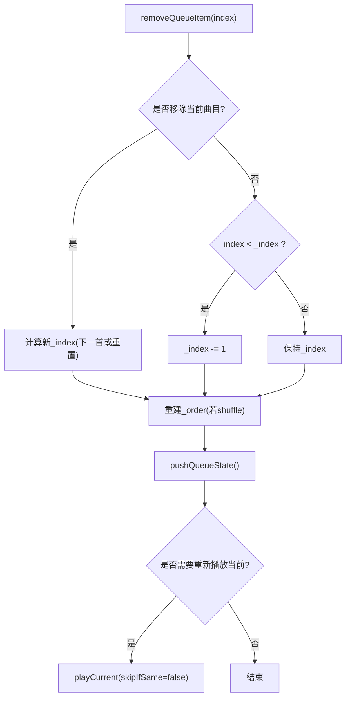
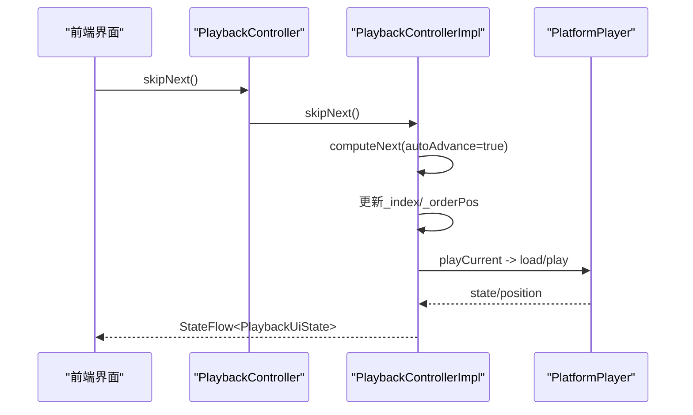
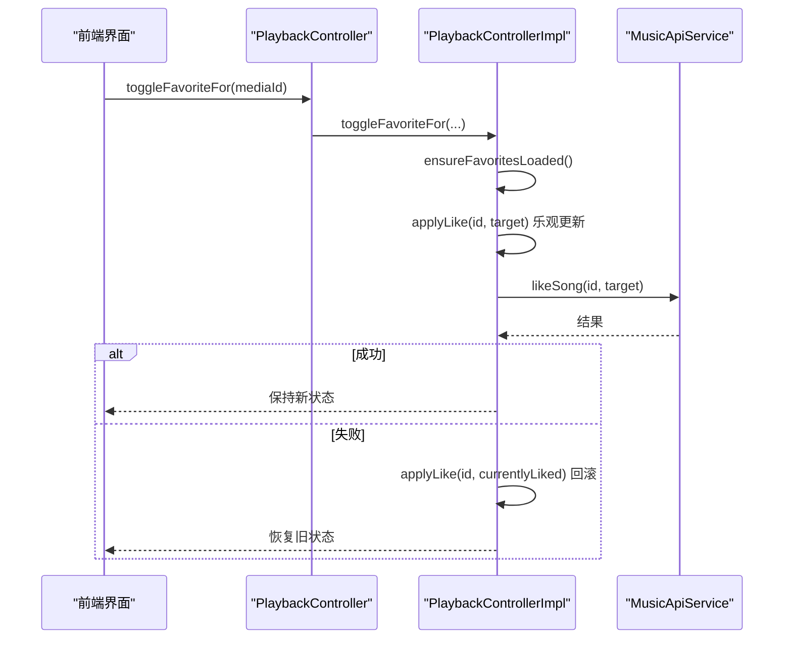
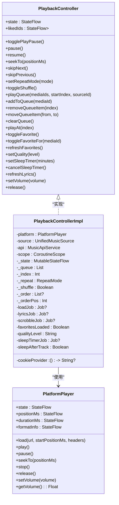

# 播放控制器接口

<cite>
**本文引用的文件**
- [PlaybackController.kt](file://kmp-pro/src/commonMain/kotlin/cp/player/kmp/playback/PlaybackController.kt)
- [PlaybackControllerImpl.kt](file://kmp-pro/src/commonMain/kotlin/cp/player/kmp/playback/PlaybackControllerImpl.kt)
- [PlaybackUiState.kt](file://kmp-pro/src/commonMain/kotlin/cp/player/kmp/playback/PlaybackUiState.kt)
- [RepeatMode.kt](file://kmp-pro/src/commonMain/kotlin/cp/player/kmp/playback/RepeatMode.kt)
- [PlatformPlayer.kt](file://kmp-pro/src/commonMain/kotlin/cp/player/kmp/playback/PlatformPlayer.kt)
- [LyricsState.kt](file://kmp-pro/src/commonMain/kotlin/cp/player/kmp/playback/LyricsState.kt)
</cite>

## 目录
1. [简介](#简介)
2. [项目结构](#项目结构)
3. [核心组件](#核心组件)
4. [架构总览](#架构总览)
5. [详细组件分析](#详细组件分析)
6. [依赖关系分析](#依赖关系分析)
7. [性能考量](#性能考量)
8. [故障排查指南](#故障排查指南)
9. [结论](#结论)
10. [附录：UI订阅与使用示例](#附录ui订阅与使用示例)

## 简介
本文件为 PlaybackController 接口的技术文档。该接口是前端播放控制的唯一入口，屏蔽底层引擎差异、统一播放状态管理，并提供播放控制、队列管理、播放模式、收藏管理、音质设置、睡眠定时、歌词刷新等能力。通过 StateFlow<PlaybackUiState> 暴露完整渲染状态，UI 层只需订阅并渲染，无需关心 URL 解析、Song↔MediaItem 转换或平台播放器细节。

## 项目结构
围绕播放控制的核心文件位于 kmp-pro/commonMain 的 playback 包中：
- 接口与实现：PlaybackController、PlaybackControllerImpl
- 状态模型：PlaybackUiState、LyricsState、QueueItem
- 枚举：RepeatMode
- 平台抽象：PlatformPlayer（含默认实现 AudioPlayerImpl）

图表来源
- [PlaybackController.kt:16-106](file://kmp-pro/src/commonMain/kotlin/cp/player/kmp/playback/PlaybackController.kt#L16-L106)
- [PlaybackControllerImpl.kt:35-44](file://kmp-pro/src/commonMain/kotlin/cp/player/kmp/playback/PlaybackControllerImpl.kt#L35-L44)
- [PlatformPlayer.kt:16-31](file://kmp-pro/src/commonMain/kotlin/cp/player/kmp/playback/PlatformPlayer.kt#L16-L31)

章节来源
- [PlaybackController.kt:16-106](file://kmp-pro/src/commonMain/kotlin/cp/player/kmp/playback/PlaybackController.kt#L16-L106)
- [PlaybackControllerImpl.kt:35-44](file://kmp-pro/src/commonMain/kotlin/cp/player/kmp/playback/PlaybackControllerImpl.kt#L35-L44)
- [PlatformPlayer.kt:16-31](file://kmp-pro/src/commonMain/kotlin/cp/player/kmp/playback/PlatformPlayer.kt#L16-L31)

## 核心组件
- PlaybackController：定义所有对外能力，包括播放控制、队列管理、播放模式、收藏、音质、睡眠定时、歌词刷新、音量与释放。
- PlaybackControllerImpl：具体实现，负责队列与顺序（含随机）、URL 获取与加载、平台播放器事件折叠到 UI 状态、歌词拉取与解析、听歌打卡、自动下一首、错误降级等。
- PlaybackUiState：不可变的状态数据类，包含当前曲目、队列、播放状态、进度、循环/随机、歌词、格式信息、错误、来源、收藏态、音质、睡眠定时等。
- PlatformPlayer：平台无关的播放器抽象，暴露状态流与基础操作；默认实现基于音频库进行轮询更新状态。
- LyricsState：歌词状态（空闲/加载中/成功/无歌词/错误）。
- RepeatMode：播放循环模式（关闭/单曲/列表）。

章节来源
- [PlaybackController.kt:16-106](file://kmp-pro/src/commonMain/kotlin/cp/player/kmp/playback/PlaybackController.kt#L16-L106)
- [PlaybackControllerImpl.kt:35-44](file://kmp-pro/src/commonMain/kotlin/cp/player/kmp/playback/PlaybackControllerImpl.kt#L35-L44)
- [PlaybackUiState.kt:12-35](file://kmp-pro/src/commonMain/kotlin/cp/player/kmp/playback/PlaybackUiState.kt#L12-L35)
- [PlatformPlayer.kt:16-31](file://kmp-pro/src/commonMain/kotlin/cp/player/kmp/playback/PlatformPlayer.kt#L16-L31)
- [LyricsState.kt:6-17](file://kmp-pro/src/commonMain/kotlin/cp/player/kmp/playback/LyricsState.kt#L6-L17)
- [RepeatMode.kt:4-11](file://kmp-pro/src/commonMain/kotlin/cp/player/kmp/playback/RepeatMode.kt#L4-L11)

## 架构总览
PlaybackControllerImpl 作为编排中心，将以下职责聚合：
- 队列与顺序：维护 _queue、_index、_order（shuffle）、_orderPos，支持追加、移除、移动、清空、跳转。
- 资源解析：懒解析 TrackSummary，批量后台解析，避免阻塞。
- 播放驱动：通过 PlatformPlayer 加载 URL 并播放，处理缓冲/就绪/播放/暂停/结束/错误。
- 状态折叠：将平台状态、位置、时长、格式信息折叠进 PlaybackUiState。
- 歌词：按需拉取并解析，计算活跃行索引。
- 打卡：播放中每秒计数，按固定间隔上报。
- 自动续播：根据 RepeatMode/shuffle 规则自动推进。
- 音质降级：播放失败时尝试以 standard 音质重试一次。

图表来源
- [PlaybackControllerImpl.kt:144-158](file://kmp-pro/src/commonMain/kotlin/cp/player/kmp/playback/PlaybackControllerImpl.kt#L144-L158)
- [PlaybackControllerImpl.kt:496-556](file://kmp-pro/src/commonMain/kotlin/cp/player/kmp/playback/PlaybackControllerImpl.kt#L496-L556)
- [PlatformPlayer.kt:16-31](file://kmp-pro/src/commonMain/kotlin/cp/player/kmp/playback/PlatformPlayer.kt#L16-L31)

## 详细组件分析

### 接口方法详解（PlaybackController）
- 播放控制
  - togglePlayPause：切换播放/暂停；结束时若队列有效则重新播放当前。
  - pause/resume：直接调用平台播放器暂停/恢复。
  - seekTo(positionMs)：跳转到指定毫秒位置。
  - skipNext/skipPrevious：下一首/上一首；上一首在 3 秒内回退到开头，否则跳到上一曲。
  - setRepeatMode(mode)：设置循环模式（OFF/ONE/ALL）。
  - toggleShuffle：开启/关闭随机播放，并重建播放顺序。
- 队列管理
  - play(mediaId)：播放单首（替换队列为仅该曲）。
  - playQueue(mediaIds, startIndex, sourceId)：设置队列并立即从 startIndex 开始播放。
  - setQueue(mediaIds, startIndex, sourceId)：设置队列但不立即播放。
  - addToQueue(mediaId)：追加到队列尾部；随机模式下同步更新顺序。
  - removeQueueItem(index)：移除条目；若移除的是当前曲目，按规则跳到下一首；空队列停止并清理状态。
  - moveQueueItem(from, to)：拖拽重排；随机模式失效后重建顺序。
  - clearQueue()：清空队列并停止。
  - playAt(index)：跳到指定索引并播放。
- 收藏管理
  - likedIds：当前账号已收藏的歌曲 ID 集合（裸资源 ID），未登录/未加载为空集。
  - toggleFavorite()：切换当前播放曲目的收藏状态（乐观更新，失败回滚）。
  - toggleFavoriteFor(mediaId)：切换指定 mediaId 的收藏状态。
  - refreshFavorites()：强制重新拉取收藏列表（登录/登出/切换账号后调用）。
- 音质与睡眠定时
  - setQuality(level)：设置在线音质等级，作用于后续加载的曲目。
  - setSleepTimer(minutes)：minutes > 0 表示 N 分钟后自动暂停；SLEEP_AFTER_TRACK 表示播完当前曲目后暂停。
  - cancelSleepTimer()：取消睡眠定时。
- 歌词与其他
  - refreshLyrics()：强制重新拉取当前曲目歌词。
  - setVolume(volume)：设置音量（0~1）。
  - release()：释放资源（取消任务、释放播放器）。

章节来源
- [PlaybackController.kt:20-106](file://kmp-pro/src/commonMain/kotlin/cp/player/kmp/playback/PlaybackController.kt#L20-L106)

### 状态管理机制（StateFlow<PlaybackUiState>）
- 状态来源
  - 平台事件：state、positionMs、durationMs、formatInfo 被 observePlatform 监听并 fold 进 UI 状态。
  - 业务逻辑：队列变更、播放/暂停、循环/随机、歌词、收藏、音质、睡眠定时等都会更新状态。
- 关键字段
  - currentTrack/currentIndex：当前曲目与索引。
  - queue/isPlaying/isBuffering/positionMs/durationMs：队列与播放进度。
  - repeatMode/shuffleEnabled：循环与随机。
  - lyrics/activeLyricIndex：歌词状态与活跃行。
  - formatInfo/error/sourceId：格式信息、错误、来源标识。
  - isFavorite/qualityLevel/sleepTimerRemainingMs/sleepAfterTrack：收藏态、音质、睡眠定时。
- 更新策略
  - 使用 MutableStateFlow + updateState 原子更新。
  - 懒解析与批量解析：队列项延迟填充 TrackSummary，减少初始开销。
  - 线程安全：导航相关操作使用 Mutex 保护队列与顺序。

图表来源
- [PlaybackControllerImpl.kt:96-127](file://kmp-pro/src/commonMain/kotlin/cp/player/kmp/playback/PlaybackControllerImpl.kt#L96-L127)
- [PlaybackControllerImpl.kt:496-556](file://kmp-pro/src/commonMain/kotlin/cp/player/kmp/playback/PlaybackControllerImpl.kt#L496-L556)
- [PlaybackUiState.kt:12-35](file://kmp-pro/src/commonMain/kotlin/cp/player/kmp/playback/PlaybackUiState.kt#L12-L35)

章节来源
- [PlaybackControllerImpl.kt:96-127](file://kmp-pro/src/commonMain/kotlin/cp/player/kmp/playback/PlaybackControllerImpl.kt#L96-L127)
- [PlaybackUiState.kt:12-35](file://kmp-pro/src/commonMain/kotlin/cp/player/kmp/playback/PlaybackUiState.kt#L12-L35)

### 队列与顺序算法
- 数据结构
  - _queue：Entry 列表，Entry.mediaId 唯一，summary 懒解析。
  - _index：当前曲目在 _queue 中的索引。
  - _order/_orderPos：当启用 shuffle 时，维护实际播放顺序及当前位置。
- 操作复杂度
  - addToQueue/removeQueueItem/moveQueueItem：O(n) 级别（重建顺序或调整索引）。
  - computeNext/computePrev：O(1)（顺序模式）或 O(1)（随机模式通过 _orderPos 计算）。
- 边界与一致性
  - 移除当前曲目时自动选择下一首或重置。
  - 随机模式切换时重建顺序并保持当前曲目优先。
  - 队列空时停止播放并清理状态。

图表来源
- [PlaybackControllerImpl.kt:183-211](file://kmp-pro/src/commonMain/kotlin/cp/player/kmp/playback/PlaybackControllerImpl.kt#L183-L211)
- [PlaybackControllerImpl.kt:228-248](file://kmp-pro/src/commonMain/kotlin/cp/player/kmp/playback/PlaybackControllerImpl.kt#L228-L248)

章节来源
- [PlaybackControllerImpl.kt:183-211](file://kmp-pro/src/commonMain/kotlin/cp/player/kmp/playback/PlaybackControllerImpl.kt#L183-L211)
- [PlaybackControllerImpl.kt:228-248](file://kmp-pro/src/commonMain/kotlin/cp/player/kmp/playback/PlaybackControllerImpl.kt#L228-L248)

### 播放控制流程
- togglePlayPause：根据平台状态决定 pause/play/replay。
- skipNext/skipPrevious：依据 RepeatMode/shuffle 计算 next/prev，更新索引并播放。
- seekTo：直接转发到平台播放器。
- setRepeatMode/toggleShuffle：更新内部状态并广播到 UI。

图表来源
- [PlaybackControllerImpl.kt:278-291](file://kmp-pro/src/commonMain/kotlin/cp/player/kmp/playback/PlaybackControllerImpl.kt#L278-L291)
- [PlaybackControllerImpl.kt:604-633](file://kmp-pro/src/commonMain/kotlin/cp/player/kmp/playback/PlaybackControllerImpl.kt#L604-L633)

章节来源
- [PlaybackControllerImpl.kt:261-315](file://kmp-pro/src/commonMain/kotlin/cp/player/kmp/playback/PlaybackControllerImpl.kt#L261-L315)
- [PlaybackControllerImpl.kt:604-633](file://kmp-pro/src/commonMain/kotlin/cp/player/kmp/playback/PlaybackControllerImpl.kt#L604-L633)

### 收藏管理与乐观更新
- 流程
  - 解析 mediaId 获取资源 ID（本地资源跳过）。
  - 确保收藏列表已加载（必要时后台拉取）。
  - 乐观更新 likedIds 与 isFavorite。
  - 调用 API 提交；失败则回滚到之前状态。
- 注意事项
  - 并发安全：favoritesLoadingJob.join 等待旧请求完成，避免覆盖。
  - 未登录/登出：清空收藏集合并同步 UI。

图表来源
- [PlaybackControllerImpl.kt:324-351](file://kmp-pro/src/commonMain/kotlin/cp/player/kmp/playback/PlaybackControllerImpl.kt#L324-L351)
- [PlaybackControllerImpl.kt:359-401](file://kmp-pro/src/commonMain/kotlin/cp/player/kmp/playback/PlaybackControllerImpl.kt#L359-L401)

章节来源
- [PlaybackControllerImpl.kt:324-351](file://kmp-pro/src/commonMain/kotlin/cp/player/kmp/playback/PlaybackControllerImpl.kt#L324-L351)
- [PlaybackControllerImpl.kt:359-401](file://kmp-pro/src/commonMain/kotlin/cp/player/kmp/playback/PlaybackControllerImpl.kt#L359-L401)

### 音质与错误降级
- setQuality：设置后续加载的音质等级，并广播到 UI。
- 播放失败降级：当加载失败且非 standard 音质时，尝试以 standard 音质重试一次，提升兼容性。

章节来源
- [PlaybackControllerImpl.kt:405-409](file://kmp-pro/src/commonMain/kotlin/cp/player/kmp/playback/PlaybackControllerImpl.kt#L405-L409)
- [PlaybackControllerImpl.kt:558-575](file://kmp-pro/src/commonMain/kotlin/cp/player/kmp/playback/PlaybackControllerImpl.kt#L558-L575)

### 睡眠定时
- setSleepTimer：支持“N 分钟后暂停”和“播完当前曲目后暂停”。
- 倒计时：每秒更新剩余时间；到时自动暂停并取消定时。
- cancelSleepTimer：取消定时并清除状态。

章节来源
- [PlaybackControllerImpl.kt:413-441](file://kmp-pro/src/commonMain/kotlin/cp/player/kmp/playback/PlaybackControllerImpl.kt#L413-L441)

### 歌词刷新与活跃行
- refreshLyrics：根据当前媒体 ID 拉取歌词，解析为 SyncedLyricLine 列表，并设置 Loading/Success/NoLyrics/Error。
- activeLyricIndex：根据 positionMs 与歌词时间戳计算当前活跃行。

章节来源
- [PlaybackControllerImpl.kt:457-481](file://kmp-pro/src/commonMain/kotlin/cp/player/kmp/playback/PlaybackControllerImpl.kt#L457-L481)
- [PlaybackControllerImpl.kt:131-140](file://kmp-pro/src/commonMain/kotlin/cp/player/kmp/playback/PlaybackControllerImpl.kt#L131-L140)
- [LyricsState.kt:6-17](file://kmp-pro/src/commonMain/kotlin/cp/player/kmp/playback/LyricsState.kt#L6-L17)

## 依赖关系分析
- 耦合与内聚
  - PlaybackControllerImpl 高内聚地封装了队列、播放、状态、歌词、打卡、音质、定时等职责。
  - 通过 PlatformPlayer 抽象解耦平台差异；通过 UnifiedMusicSource/MusicApiService 解耦数据源与网络。
- 外部依赖
  - PlatformPlayer：提供播放状态流与基础操作。
  - UnifiedMusicSource：提供曲目详情与播放 URL。
  - MusicApiService：提供歌词、收藏、打卡等 API。
- 潜在循环依赖
  - 当前实现未见循环依赖；各模块单向依赖。

图表来源
- [PlaybackController.kt:16-106](file://kmp-pro/src/commonMain/kotlin/cp/player/kmp/playback/PlaybackController.kt#L16-L106)
- [PlaybackControllerImpl.kt:35-44](file://kmp-pro/src/commonMain/kotlin/cp/player/kmp/playback/PlaybackControllerImpl.kt#L35-L44)
- [PlatformPlayer.kt:16-31](file://kmp-pro/src/commonMain/kotlin/cp/player/kmp/playback/PlatformPlayer.kt#L16-L31)

章节来源
- [PlaybackController.kt:16-106](file://kmp-pro/src/commonMain/kotlin/cp/player/kmp/playback/PlaybackController.kt#L16-L106)
- [PlaybackControllerImpl.kt:35-44](file://kmp-pro/src/commonMain/kotlin/cp/player/kmp/playback/PlaybackControllerImpl.kt#L35-L44)
- [PlatformPlayer.kt:16-31](file://kmp-pro/src/commonMain/kotlin/cp/player/kmp/playback/PlatformPlayer.kt#L16-L31)

## 性能考量
- 懒解析与批量解析：队列项延迟填充 TrackSummary，并按批（chunked）拉取详情，降低初始加载成本。
- 状态折叠频率：平台状态每 200ms 轮询一次，避免过于频繁更新导致 UI 抖动。
- 并发控制：导航相关操作使用 Mutex 保护队列与顺序，避免竞态。
- 错误降级：播放失败时尝试标准音质重试，提高成功率。
- 内存与生命周期：release 时取消所有任务并释放播放器，防止泄漏。

章节来源
- [PlaybackControllerImpl.kt:643-671](file://kmp-pro/src/commonMain/kotlin/cp/player/kmp/playback/PlaybackControllerImpl.kt#L643-L671)
- [PlatformPlayer.kt:70-89](file://kmp-pro/src/commonMain/kotlin/cp/player/kmp/playback/PlatformPlayer.kt#L70-L89)
- [PlaybackControllerImpl.kt:487-491](file://kmp-pro/src/commonMain/kotlin/cp/player/kmp/playback/PlaybackControllerImpl.kt#L487-L491)

## 故障排查指南
- 无法获取播放地址
  - 现象：error 显示“无法获取播放地址”。
  - 可能原因：网络异常、Cookie 缺失、音质不可用。
  - 处理：检查 cookieProvider 返回；尝试降低音质；查看日志。
- 歌词获取失败
  - 现象：lyrics 为 Error 或 NoLyrics。
  - 处理：确认媒体 ID 类型（本地无歌词）；重试 refreshLyrics；检查 API 响应。
- 收藏状态不一致
  - 现象：UI 显示收藏但后端未更新。
  - 处理：调用 refreshFavorites；检查网络与登录状态；查看回滚逻辑。
- 播放卡顿或缓冲
  - 现象：isBuffering 长时间为 true。
  - 处理：检查网络；尝试降低音质；查看 PlatformPlayer 状态。
- 睡眠定时不生效
  - 现象：到达时间未暂停。
  - 处理：确认 setSleepTimer 参数；检查是否在播放中；调用 cancelSleepTimer 重置。

章节来源
- [PlaybackControllerImpl.kt:525-554](file://kmp-pro/src/commonMain/kotlin/cp/player/kmp/playback/PlaybackControllerImpl.kt#L525-L554)
- [PlaybackControllerImpl.kt:457-481](file://kmp-pro/src/commonMain/kotlin/cp/player/kmp/playback/PlaybackControllerImpl.kt#L457-L481)
- [PlaybackControllerImpl.kt:359-401](file://kmp-pro/src/commonMain/kotlin/cp/player/kmp/playback/PlaybackControllerImpl.kt#L359-L401)
- [PlaybackControllerImpl.kt:413-441](file://kmp-pro/src/commonMain/kotlin/cp/player/kmp/playback/PlaybackControllerImpl.kt#L413-L441)

## 结论
PlaybackController 作为前端播放控制的唯一入口，提供了统一的播放控制、队列管理、播放模式、收藏管理、音质设置、睡眠定时与歌词刷新能力。通过 StateFlow<PlaybackUiState> 暴露完整渲染状态，屏蔽底层引擎差异与数据源细节，使 UI 层专注渲染与交互。实现采用懒解析、批量拉取、并发控制与错误降级等策略，兼顾性能与稳定性。

## 附录：UI订阅与使用示例
- 订阅状态
  - 在 UI 生命周期内 collect PlaybackController.state，根据 isPlaying、isBuffering、positionMs、durationMs、lyrics、repeatMode、shuffleEnabled、isFavorite、qualityLevel、sleepTimerRemainingMs、sleepAfterTrack 等字段渲染界面。
- 典型操作
  - 播放列表：调用 playQueue(mediaIds, startIndex)，UI 自动更新队列与当前曲目。
  - 播放控制：点击播放/暂停调用 togglePlayPause；下一首/上一首调用 skipNext/skipPrevious；拖动进度条调用 seekTo。
  - 队列编辑：addToQueue/removeQueueItem/moveQueueItem/clearQueue/playAt。
  - 播放模式：setRepeatMode/toggleShuffle。
  - 收藏：toggleFavorite/toggleFavoriteFor/refreshFavorites。
  - 音质与定时：setQuality/setSleepTimer/cancelSleepTimer。
  - 音量：setVolume。
- 最佳实践
  - 仅在 UI 层订阅状态，不做 Song↔MediaItem 转换或 URL 解析。
  - 避免重复请求：使用 refreshFavorites 在登录/登出/切换账号后刷新。
  - 错误提示：根据 error 字段展示友好提示，必要时引导用户重试或切换音质。
  - 生命周期：在页面销毁时调用 release 释放资源。

章节来源
- [PlaybackController.kt:20-106](file://kmp-pro/src/commonMain/kotlin/cp/player/kmp/playback/PlaybackController.kt#L20-L106)
- [PlaybackControllerImpl.kt:96-127](file://kmp-pro/src/commonMain/kotlin/cp/player/kmp/playback/PlaybackControllerImpl.kt#L96-L127)
- [PlaybackUiState.kt:12-35](file://kmp-pro/src/commonMain/kotlin/cp/player/kmp/playback/PlaybackUiState.kt#L12-L35)