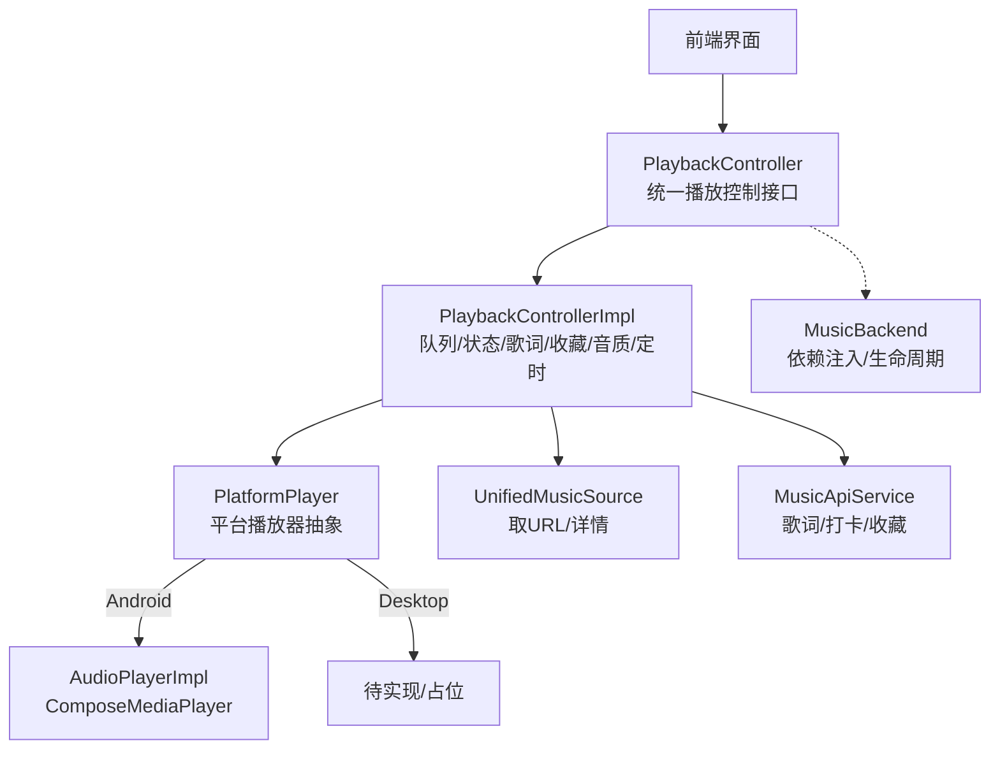
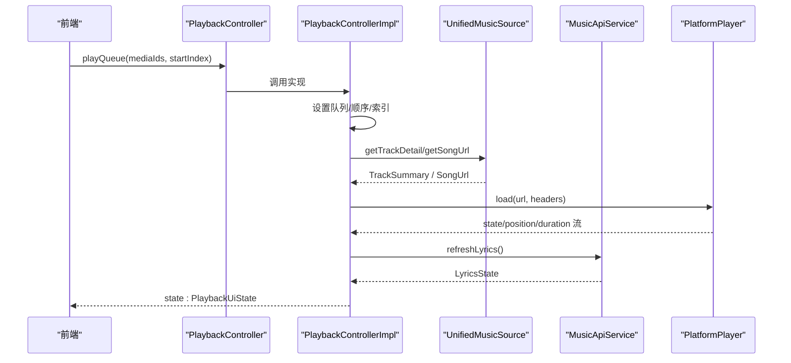
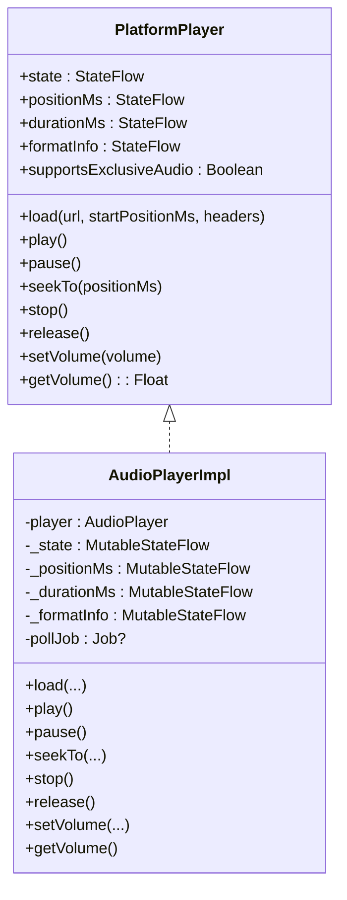
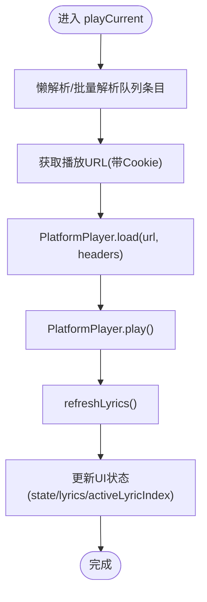
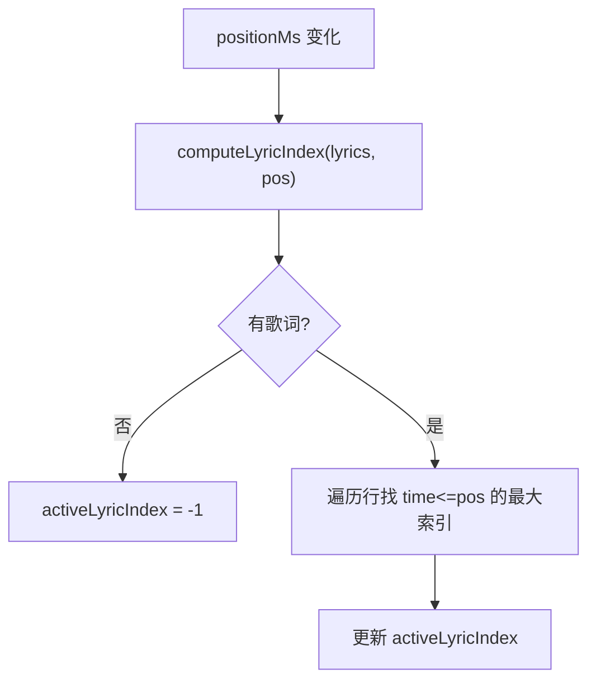
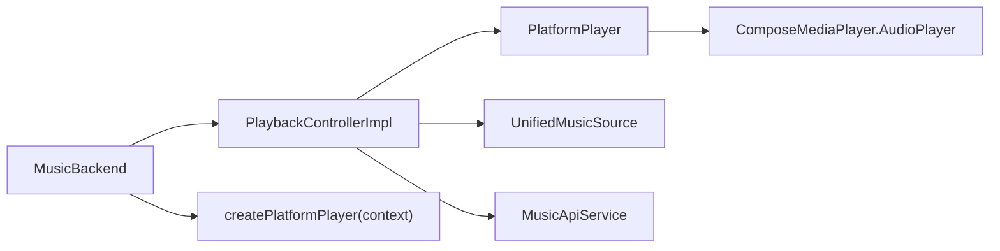

# 播放控制系统

<cite>
**本文引用的文件**
- [PlaybackController.kt](file://kmp-pro/src/commonMain/kotlin/cp/player/kmp/playback/PlaybackController.kt)
- [PlaybackControllerImpl.kt](file://kmp-pro/src/commonMain/kotlin/cp/player/kmp/playback/PlaybackControllerImpl.kt)
- [PlatformPlayer.kt](file://kmp-pro/src/commonMain/kotlin/cp/player/kmp/playback/PlatformPlayer.kt)
- [PlaybackEngine.kt](file://kmp-pro/src/commonMain/kotlin/cp/player/kmp/playback/PlaybackEngine.kt)
- [RepeatMode.kt](file://kmp-pro/src/commonMain/kotlin/cp/player/kmp/playback/RepeatMode.kt)
- [PlaybackUiState.kt](file://kmp-pro/src/commonMain/kotlin/cp/player/kmp/playback/PlaybackUiState.kt)
- [LyricsParser.kt](file://kmp-pro/src/commonMain/kotlin/cp/player/kmp/playback/LyricsParser.kt)
- [LyricsState.kt](file://kmp-pro/src/commonMain/kotlin/cp/player/kmp/playback/LyricsState.kt)
- [SyncedLyricLine.kt](file://kmp-pro/src/commonMain/kotlin/cp/player/kmp/playback/SyncedLyricLine.kt)
- [MusicBackend.kt](file://kmp-pro/src/commonMain/kotlin/cp/player/kmp/MusicBackend.kt)
- [PlatformContext.kt (common)](file://kmp-pro/src/commonMain/kotlin/cp/player/kmp/util/PlatformContext.kt)
- [PlatformContext.kt (android)](file://kmp-pro/src/androidMain/kotlin/cp/player/kmp/util/PlatformContext.kt)
- [PlatformContext.kt (desktop)](file://kmp-pro/src/desktopMain/kotlin/cp/player/kmp/util/PlatformContext.kt)
</cite>

## 目录
1. [简介](#简介)
2. [项目结构](#项目结构)
3. [核心组件](#核心组件)
4. [架构总览](#架构总览)
5. [详细组件分析](#详细组件分析)
6. [依赖关系分析](#依赖关系分析)
7. [性能考量](#性能考量)
8. [故障排查指南](#故障排查指南)
9. [结论](#结论)
10. [附录](#附录)

## 简介
本技术文档围绕 CPPlayer-KMP 的播放控制系统，系统阐述统一播放控制接口、平台抽象层、队列管理、歌词同步显示、状态管理与事件通知机制，并给出跨平台扩展指南。目标是让读者在不深入源码细节的前提下，理解“前端如何通过统一入口控制播放”，以及“平台差异如何被屏蔽”。

## 项目结构
播放控制相关代码集中在 kmp-pro 模块的 commonMain 中，采用分层与职责分离：
- 统一控制面：PlaybackController（接口）+ PlaybackControllerImpl（实现）
- 平台抽象面：PlatformPlayer（接口 + 默认实现 AudioPlayerImpl）
- 引擎抽象面：PlaybackEngine（未来多引擎切换的骨架）
- 数据与状态：PlaybackUiState、RepeatMode、LyricsState、SyncedLyricLine、LyricsParser
- 后端装配：MusicBackend 负责注入 PlatformPlayer、UnifiedMusicSource、MusicApiService 等依赖

图表来源
- [PlaybackController.kt:16-106](file://kmp-pro/src/commonMain/kotlin/cp/player/kmp/playback/PlaybackController.kt#L16-L106)
- [PlaybackControllerImpl.kt:35-92](file://kmp-pro/src/commonMain/kotlin/cp/player/kmp/playback/PlaybackControllerImpl.kt#L35-L92)
- [PlatformPlayer.kt:16-31](file://kmp-pro/src/commonMain/kotlin/cp/player/kmp/playback/PlatformPlayer.kt#L16-L31)
- [MusicBackend.kt:140-161](file://kmp-pro/src/commonMain/kotlin/cp/player/kmp/MusicBackend.kt#L140-L161)

章节来源
- [PlaybackController.kt:16-106](file://kmp-pro/src/commonMain/kotlin/cp/player/kmp/playback/PlaybackController.kt#L16-L106)
- [MusicBackend.kt:140-161](file://kmp-pro/src/commonMain/kotlin/cp/player/kmp/MusicBackend.kt#L140-L161)

## 核心组件
- 统一播放控制接口 PlaybackController：对外暴露播放、暂停、跳转、音量、队列操作、循环/随机模式、收藏、音质、睡眠定时、歌词刷新等能力；内部通过 StateFlow<PlaybackUiState> 推送完整渲染状态。
- 平台播放器抽象 PlatformPlayer：定义 load/play/pause/seekTo/stop/release/volume 等最小播放能力，并提供 state/positionMs/durationMs/formatInfo 等状态流；当前提供基于 ComposeMediaPlayer 的默认实现 AudioPlayerImpl。
- 播放控制器实现 PlaybackControllerImpl：封装队列管理、URL 解析、歌词拉取与解析、收藏状态同步、自动下一首、听歌打卡、音质降级重试、睡眠定时等。
- 播放引擎骨架 PlaybackEngine：面向未来的多引擎抽象（ExoPlayer/FlickPlayer/Desktop），当前为占位，便于后续替换底层解码/输出。
- 状态与模型：PlaybackUiState（UI 渲染态）、RepeatMode（循环模式）、LyricsState/LyricsParser/SyncedLyricLine（歌词）。

章节来源
- [PlaybackController.kt:16-106](file://kmp-pro/src/commonMain/kotlin/cp/player/kmp/playback/PlaybackController.kt#L16-L106)
- [PlatformPlayer.kt:16-135](file://kmp-pro/src/commonMain/kotlin/cp/player/kmp/playback/PlatformPlayer.kt#L16-L135)
- [PlaybackControllerImpl.kt:35-92](file://kmp-pro/src/commonMain/kotlin/cp/player/kmp/playback/PlaybackControllerImpl.kt#L35-L92)
- [PlaybackEngine.kt:21-96](file://kmp-pro/src/commonMain/kotlin/cp/player/kmp/playback/PlaybackEngine.kt#L21-L96)
- [PlaybackUiState.kt:12-35](file://kmp-pro/src/commonMain/kotlin/cp/player/kmp/playback/PlaybackUiState.kt#L12-L35)
- [RepeatMode.kt:4-11](file://kmp-pro/src/commonMain/kotlin/cp/player/kmp/playback/RepeatMode.kt#L4-L11)
- [LyricsState.kt:6-41](file://kmp-pro/src/commonMain/kotlin/cp/player/kmp/playback/LyricsState.kt#L6-L41)
- [LyricsParser.kt:21-152](file://kmp-pro/src/commonMain/kotlin/cp/player/kmp/playback/LyricsParser.kt#L21-L152)
- [SyncedLyricLine.kt:15-29](file://kmp-pro/src/commonMain/kotlin/cp/player/kmp/playback/SyncedLyricLine.kt#L15-L29)

## 架构总览
播放控制采用“控制面 + 平台抽象 + 数据源”的分层设计：
- 控制面：PlaybackController 是前端唯一入口，屏蔽 URL 解析、Song↔MediaItem 转换、引擎差异等。
- 平台抽象：PlatformPlayer 将具体音频库（如 ComposeMediaPlayer）隐藏起来，暴露稳定接口。
- 数据源：UnifiedMusicSource 负责获取播放地址与曲目详情；MusicApiService 负责歌词、收藏、打卡等。
- 装配：MusicBackend 在应用启动时创建 PlatformPlayer，并将 source/api/cookieProvider/scope 注入到 PlaybackControllerImpl。

图表来源
- [PlaybackController.kt:22-31](file://kmp-pro/src/commonMain/kotlin/cp/player/kmp/playback/PlaybackController.kt#L22-L31)
- [PlaybackControllerImpl.kt:144-158](file://kmp-pro/src/commonMain/kotlin/cp/player/kmp/playback/PlaybackControllerImpl.kt#L144-L158)
- [PlaybackControllerImpl.kt:496-556](file://kmp-pro/src/commonMain/kotlin/cp/player/kmp/playback/PlaybackControllerImpl.kt#L496-L556)
- [PlatformPlayer.kt:23-31](file://kmp-pro/src/commonMain/kotlin/cp/player/kmp/playback/PlatformPlayer.kt#L23-L31)

## 详细组件分析

### 统一播放控制接口 PlaybackController
- 设计目标：作为前端唯一入口，屏蔽所有平台与数据层差异；前端只订阅 state Flow 并调用方法。
- 核心能力：
  - 队列：play/playQueue/setQueue/addToQueue/removeQueueItem/moveQueueItem/clearQueue/playAt
  - 播控：togglePlayPause/pause/resume/seekTo/skipNext/skipPrevious
  - 模式：setRepeatMode/toggleShuffle
  - 收藏：likedIds/toggleFavorite/toggleFavoriteFor/refreshFavorites
  - 音质：setQuality
  - 定时：setSleepTimer/cancelSleepTimer
  - 歌词：refreshLyrics
  - 其它：setVolume/release

章节来源
- [PlaybackController.kt:16-106](file://kmp-pro/src/commonMain/kotlin/cp/player/kmp/playback/PlaybackController.kt#L16-L106)

### 平台播放器抽象 PlatformPlayer
- 抽象点：load/play/pause/seekTo/stop/release/setVolume/getVolume；state/positionMs/durationMs/formatInfo supportsExclusiveAudio。
- 默认实现 AudioPlayerImpl：
  - 使用 ComposeMediaPlayer 的 AudioPlayer 进行加载与播放。
  - 通过轮询更新 state/position/duration，错误回调映射为 Error 状态。
  - 提供 createPlatformPlayer(context) 工厂函数用于注入。

图表来源
- [PlatformPlayer.kt:16-31](file://kmp-pro/src/commonMain/kotlin/cp/player/kmp/playback/PlatformPlayer.kt#L16-L31)
- [PlatformPlayer.kt:43-135](file://kmp-pro/src/commonMain/kotlin/cp/player/kmp/playback/PlatformPlayer.kt#L43-L135)

章节来源
- [PlatformPlayer.kt:16-135](file://kmp-pro/src/commonMain/kotlin/cp/player/kmp/playback/PlatformPlayer.kt#L16-L135)

### 播放控制器实现 PlaybackControllerImpl
- 职责：
  - 队列管理：支持追加、移除、拖拽重排、按 shuffle 顺序播放、自然顺序播放。
  - URL 解析与播放：通过 UnifiedMusicSource 获取 TrackSummary 与 SongUrl，注入 Cookie 头后交给 PlatformPlayer。
  - 状态折叠：监听 PlatformPlayer 的 state/position/duration/formatInfo，合并到 PlaybackUiState。
  - 歌词：自动拉取并解析，计算 activeLyricIndex。
  - 收藏：乐观更新 likedIds，失败回滚；未登录清空集合。
  - 音质：setQuality 影响后续加载；播放失败自动降级到 standard 重试一次。
  - 睡眠定时：倒计时或“播完当前暂停”。
  - 自动下一首：根据 RepeatMode/shuffle 决定。
  - 听歌打卡：每 N 秒上报一次。

图表来源
- [PlaybackControllerImpl.kt:496-556](file://kmp-pro/src/commonMain/kotlin/cp/player/kmp/playback/PlaybackControllerImpl.kt#L496-L556)
- [PlaybackControllerImpl.kt:643-685](file://kmp-pro/src/commonMain/kotlin/cp/player/kmp/playback/PlaybackControllerImpl.kt#L643-L685)

章节来源
- [PlaybackControllerImpl.kt:35-92](file://kmp-pro/src/commonMain/kotlin/cp/player/kmp/playback/PlaybackControllerImpl.kt#L35-L92)
- [PlaybackControllerImpl.kt:144-172](file://kmp-pro/src/commonMain/kotlin/cp/player/kmp/playback/PlaybackControllerImpl.kt#L144-L172)
- [PlaybackControllerImpl.kt:174-257](file://kmp-pro/src/commonMain/kotlin/cp/player/kmp/playback/PlaybackControllerImpl.kt#L174-L257)
- [PlaybackControllerImpl.kt:259-315](file://kmp-pro/src/commonMain/kotlin/cp/player/kmp/playback/PlaybackControllerImpl.kt#L259-L315)
- [PlaybackControllerImpl.kt:319-401](file://kmp-pro/src/commonMain/kotlin/cp/player/kmp/playback/PlaybackControllerImpl.kt#L319-L401)
- [PlaybackControllerImpl.kt:405-453](file://kmp-pro/src/commonMain/kotlin/cp/player/kmp/playback/PlaybackControllerImpl.kt#L405-L453)
- [PlaybackControllerImpl.kt:457-481](file://kmp-pro/src/commonMain/kotlin/cp/player/kmp/playback/PlaybackControllerImpl.kt#L457-L481)
- [PlaybackControllerImpl.kt:496-556](file://kmp-pro/src/commonMain/kotlin/cp/player/kmp/playback/PlaybackControllerImpl.kt#L496-L556)
- [PlaybackControllerImpl.kt:558-602](file://kmp-pro/src/commonMain/kotlin/cp/player/kmp/playback/PlaybackControllerImpl.kt#L558-L602)
- [PlaybackControllerImpl.kt:604-637](file://kmp-pro/src/commonMain/kotlin/cp/player/kmp/playback/PlaybackControllerImpl.kt#L604-L637)
- [PlaybackControllerImpl.kt:643-685](file://kmp-pro/src/commonMain/kotlin/cp/player/kmp/playback/PlaybackControllerImpl.kt#L643-L685)
- [PlaybackControllerImpl.kt:721-758](file://kmp-pro/src/commonMain/kotlin/cp/player/kmp/playback/PlaybackControllerImpl.kt#L721-L758)

### 播放队列管理机制
- 数据结构：内部维护 Entry(mediaId, summary?) 列表，以及 _index/_order/_orderPos 表示当前与顺序位置。
- 排序与模式：
  - 顺序：自然索引递增。
  - 随机：生成 _order 列表，按 _orderPos 前进；支持 moveQueueItem 后重建顺序。
  - 循环：RepeatMode.OFF/ONE/ALL 控制结束行为。
- 懒解析：对未解析的 Entry 批量拉取详情，优先解析当前及附近条目。
- 边界处理：移除当前条目时自动跳到下一首；空队列停止播放并清理状态。

章节来源
- [PlaybackControllerImpl.kt:48-60](file://kmp-pro/src/commonMain/kotlin/cp/player/kmp/playback/PlaybackControllerImpl.kt#L48-L60)
- [PlaybackControllerImpl.kt:144-172](file://kmp-pro/src/commonMain/kotlin/cp/player/kmp/playback/PlaybackControllerImpl.kt#L144-L172)
- [PlaybackControllerImpl.kt:174-257](file://kmp-pro/src/commonMain/kotlin/cp/player/kmp/playback/PlaybackControllerImpl.kt#L174-L257)
- [PlaybackControllerImpl.kt:577-637](file://kmp-pro/src/commonMain/kotlin/cp/player/kmp/playback/PlaybackControllerImpl.kt#L577-L637)
- [RepeatMode.kt:4-11](file://kmp-pro/src/commonMain/kotlin/cp/player/kmp/playback/RepeatMode.kt#L4-L11)

### 歌词同步显示技术
- 解析：LyricsParser 支持 LRC 行级、翻译/罗马音合并、YRC 逐字时间戳；输出统一的 SyncedLyricLine。
- 匹配：根据 positionMs 计算 activeLyricIndex（最后一行 time<=pos）。
- 展示：LyricsState 表达 Idle/Loading/Success/NoLyrics/Error；UI 仅消费该状态。
- 交互：用户可触发 refreshLyrics；滚动效果由 UI 层根据 activeLyricIndex 驱动。

图表来源
- [PlaybackControllerImpl.kt:131-140](file://kmp-pro/src/commonMain/kotlin/cp/player/kmp/playback/PlaybackControllerImpl.kt#L131-L140)
- [LyricsParser.kt:21-152](file://kmp-pro/src/commonMain/kotlin/cp/player/kmp/playback/LyricsParser.kt#L21-L152)
- [LyricsState.kt:6-41](file://kmp-pro/src/commonMain/kotlin/cp/player/kmp/playback/LyricsState.kt#L6-L41)
- [SyncedLyricLine.kt:15-29](file://kmp-pro/src/commonMain/kotlin/cp/player/kmp/playback/SyncedLyricLine.kt#L15-L29)

章节来源
- [LyricsParser.kt:21-152](file://kmp-pro/src/commonMain/kotlin/cp/player/kmp/playback/LyricsParser.kt#L21-L152)
- [LyricsState.kt:6-41](file://kmp-pro/src/commonMain/kotlin/cp/player/kmp/playback/LyricsState.kt#L6-L41)
- [SyncedLyricLine.kt:15-29](file://kmp-pro/src/commonMain/kotlin/cp/player/kmp/playback/SyncedLyricLine.kt#L15-L29)
- [PlaybackControllerImpl.kt:131-140](file://kmp-pro/src/commonMain/kotlin/cp/player/kmp/playback/PlaybackControllerImpl.kt#L131-L140)

### 播放状态管理与事件通知
- 状态来源：PlatformPlayer.state/positionMs/durationMs/formatInfo 经 observePlatform 折叠进 PlaybackUiState。
- 事件：
  - Ended：触发 onTrackEnded，按 RepeatMode 决定是否继续或停止。
  - Playing/Paused：控制 scrobble 计时器启停。
  - Error：透传到 UI 状态，供提示。
- 通知方式：StateFlow<PlaybackUiState> 供前端 collect 渲染。

章节来源
- [PlaybackControllerImpl.kt:96-127](file://kmp-pro/src/commonMain/kotlin/cp/player/kmp/playback/PlaybackControllerImpl.kt#L96-L127)
- [PlaybackControllerImpl.kt:577-602](file://kmp-pro/src/commonMain/kotlin/cp/player/kmp/playback/PlaybackControllerImpl.kt#L577-L602)
- [PlaybackUiState.kt:12-35](file://kmp-pro/src/commonMain/kotlin/cp/player/kmp/playback/PlaybackUiState.kt#L12-L35)

### 跨平台播放器实现与扩展指南
- 当前默认实现：AudioPlayerImpl 基于 ComposeMediaPlayer 的 AudioPlayer，适用于 Android 场景。
- 平台上下文：PlatformContext 在 Android 包装 Context，在 Desktop 为空占位；createPlatformPlayer(context) 用于构造播放器。
- 扩展步骤：
  1) 在对应平台源集实现 PlatformPlayer actual（或替换 createPlatformPlayer 返回的平台实现）。
  2) 若需多引擎切换，可在 MusicBackend 中注入不同的 PlaybackEngine 实现（当前为 NoopPlaybackEngine 占位）。
  3) 保持 state/position/duration/formatInfo 语义一致，确保上层无需感知差异。
  4) 如需独占音频通路，实现 supportsExclusiveAudio 并在平台侧启用。

章节来源
- [PlatformPlayer.kt:133-135](file://kmp-pro/src/commonMain/kotlin/cp/player/kmp/playback/PlatformPlayer.kt#L133-L135)
- [PlatformContext.kt (common):11-14](file://kmp-pro/src/commonMain/kotlin/cp/player/kmp/util/PlatformContext.kt#L11-L14)
- [PlatformContext.kt (android):1-14](file://kmp-pro/src/androidMain/kotlin/cp/player/kmp/util/PlatformContext.kt#L1-L14)
- [PlatformContext.kt (desktop):1-10](file://kmp-pro/src/desktopMain/kotlin/cp/player/kmp/util/PlatformContext.kt#L1-L10)
- [MusicBackend.kt:131-161](file://kmp-pro/src/commonMain/kotlin/cp/player/kmp/MusicBackend.kt#L131-L161)
- [PlaybackEngine.kt:21-96](file://kmp-pro/src/commonMain/kotlin/cp/player/kmp/playback/PlaybackEngine.kt#L21-L96)

## 依赖关系分析
- 耦合度：
  - PlaybackControllerImpl 强依赖 PlatformPlayer、UnifiedMusicSource、MusicApiService；但通过接口隔离，易于替换。
  - PlatformPlayer 与具体音频库解耦，便于在不同平台接入不同实现。
- 外部依赖：
  - Android：ComposeMediaPlayer（AudioPlayer）、Media3 ExoPlayer（构建配置中引入）。
  - Desktop：JavaFX/JNA/dbus-java（构建配置中引入），用于桌面端多媒体集成。
- 潜在循环依赖：无直接循环；通过 MusicBackend 集中装配。

图表来源
- [PlaybackControllerImpl.kt:35-41](file://kmp-pro/src/commonMain/kotlin/cp/player/kmp/playback/PlaybackControllerImpl.kt#L35-L41)
- [PlatformPlayer.kt:133-135](file://kmp-pro/src/commonMain/kotlin/cp/player/kmp/playback/PlatformPlayer.kt#L133-L135)
- [MusicBackend.kt:140-161](file://kmp-pro/src/commonMain/kotlin/cp/player/kmp/MusicBackend.kt#L140-L161)

章节来源
- [PlaybackControllerImpl.kt:35-41](file://kmp-pro/src/commonMain/kotlin/cp/player/kmp/playback/PlaybackControllerImpl.kt#L35-L41)
- [MusicBackend.kt:140-161](file://kmp-pro/src/commonMain/kotlin/cp/player/kmp/MusicBackend.kt#L140-L161)

## 性能考量
- 队列解析：批量拉取 TrackSummary，减少网络请求次数；优先解析当前及邻近条目。
- 状态更新：PlatformPlayer 以固定间隔轮询状态，避免频繁 UI 刷新；必要时可调整轮询频率。
- 音质降级：播放失败自动降级到 standard，提高兼容性，减少卡顿。
- 歌词解析：按时间排序并补齐 endTime，降低 UI 计算成本。
- Scrobble：后台定时上报，不影响主线程播放体验。

[本节为通用指导，不直接分析具体文件]

## 故障排查指南
- 无法获取播放地址：检查 UnifiedMusicSource.getSongUrl 返回值与 Cookie 注入逻辑。
- 播放失败：查看 PlatformPlayer.state.Error 消息；确认格式是否受支持；观察是否触发标准音质降级。
- 歌词为空：确认 LyricsState 是否为 NoLyrics/Error；检查 API 返回结构与 LyricsParser 解析路径。
- 收藏状态异常：确认已登录且 likedIds 已加载；检查 toggleFavoriteFor 的乐观更新与回滚逻辑。
- 队列错乱：检查 moveQueueItem/removeQueueItem 后的 _order/_orderPos/_index 维护是否正确。

章节来源
- [PlaybackControllerImpl.kt:525-556](file://kmp-pro/src/commonMain/kotlin/cp/player/kmp/playback/PlaybackControllerImpl.kt#L525-L556)
- [PlaybackControllerImpl.kt:319-401](file://kmp-pro/src/commonMain/kotlin/cp/player/kmp/playback/PlaybackControllerImpl.kt#L319-L401)
- [LyricsParser.kt:21-152](file://kmp-pro/src/commonMain/kotlin/cp/player/kmp/playback/LyricsParser.kt#L21-L152)
- [PlatformPlayer.kt:61-68](file://kmp-pro/src/commonMain/kotlin/cp/player/kmp/playback/PlatformPlayer.kt#L61-L68)

## 结论
CPPlayer-KMP 的播放控制系统通过清晰的层次划分与稳定的接口设计，实现了跨平台的统一播放控制。PlaybackController 作为唯一入口屏蔽了平台差异，PlatformPlayer 抽象了底层音频库，PlaybackControllerImpl 则集中处理队列、状态、歌词、收藏、音质与定时等复杂逻辑。配合 MusicBackend 的依赖注入，系统具备良好的可扩展性与可维护性，便于后续接入更多平台与引擎。

[本节为总结性内容，不直接分析具体文件]

## 附录
- 关键状态字段说明（来自 PlaybackUiState）：
  - currentTrack/currentIndex/queue：当前曲目与队列信息
  - isPlaying/isBuffering/positionMs/durationMs：播放进度与缓冲
  - repeatMode/shuffleEnabled：循环与随机模式
  - lyrics/activeLyricIndex：歌词内容与高亮行
  - formatInfo/error/sourceId：格式信息、错误、来源
  - isFavorite/qualityLevel/sleepTimerRemainingMs/sleepAfterTrack：收藏、音质、睡眠定时

章节来源
- [PlaybackUiState.kt:12-35](file://kmp-pro/src/commonMain/kotlin/cp/player/kmp/playback/PlaybackUiState.kt#L12-L35)