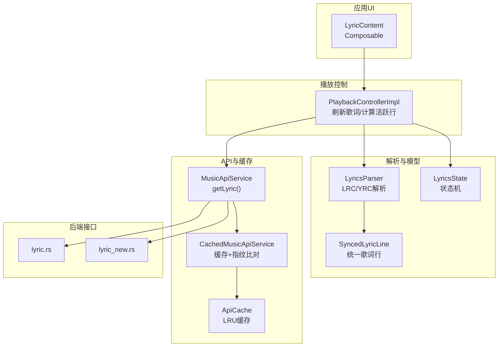
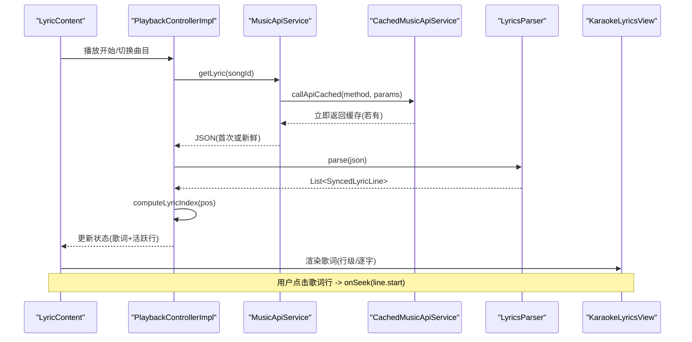
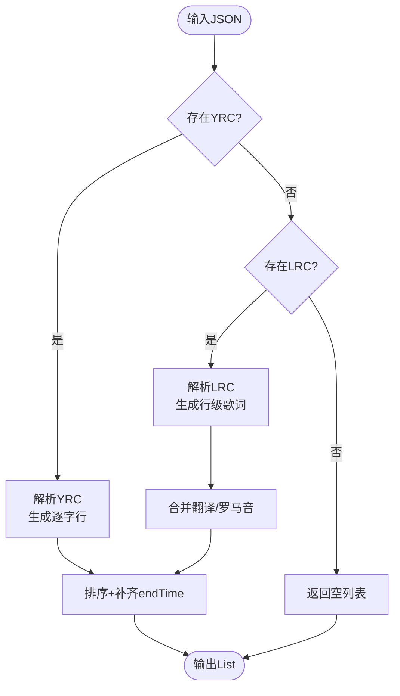
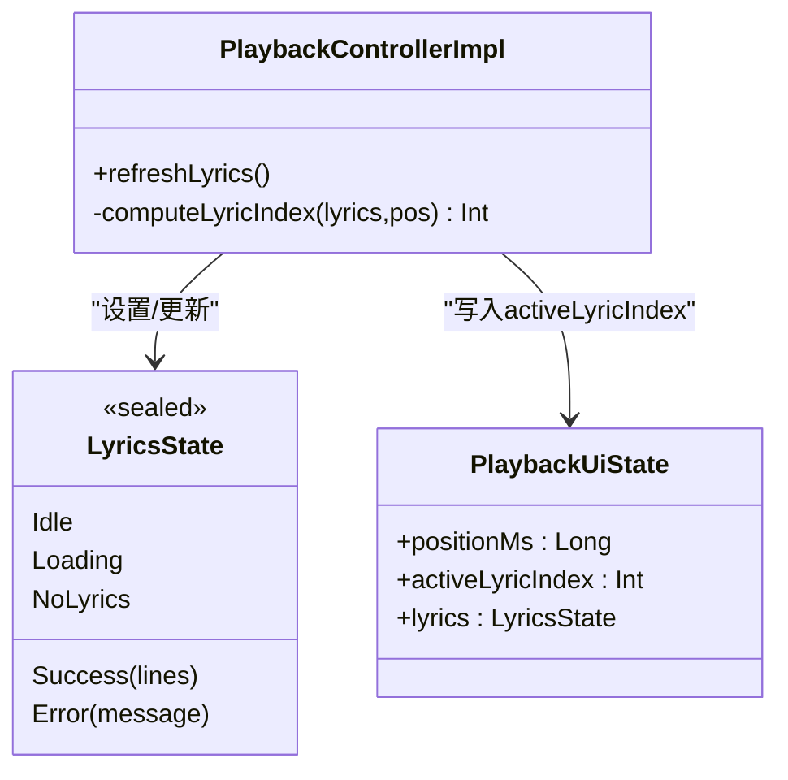
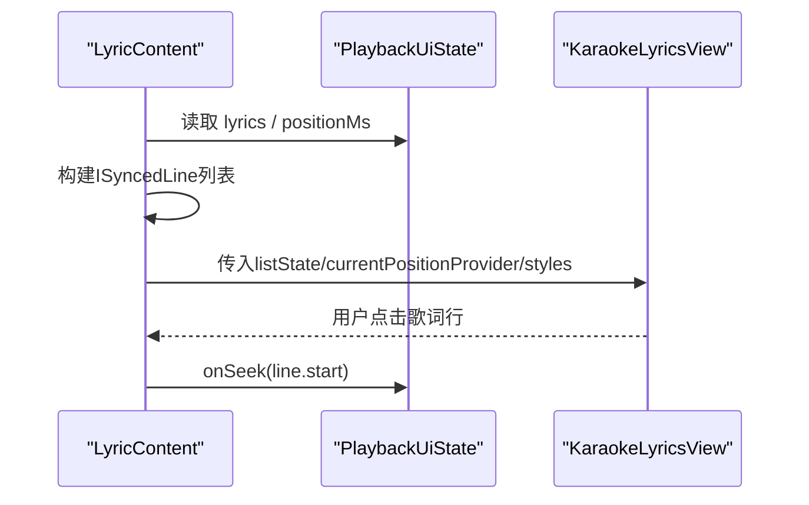
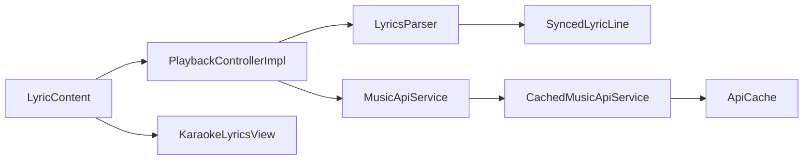

# 歌词同步系统

<cite>
**本文引用的文件**
- [LyricsParser.kt](file://kmp-pro/src/commonMain/kotlin/cp/player/kmp/playback/LyricsParser.kt)
- [SyncedLyricLine.kt](file://kmp-pro/src/commonMain/kotlin/cp/player/kmp/playback/SyncedLyricLine.kt)
- [LyricsState.kt](file://kmp-pro/src/commonMain/kotlin/cp/player/kmp/playback/LyricsState.kt)
- [PlaybackControllerImpl.kt](file://kmp-pro/src/commonMain/kotlin/cp/player/kmp/playback/PlaybackControllerImpl.kt)
- [PlaybackUiState.kt](file://kmp-pro/src/commonMain/kotlin/cp/player/kmp/playback/PlaybackUiState.kt)
- [MusicApiService.kt](file://kmp-pro/src/commonMain/kotlin/cp/player/kmp/api/MusicApiService.kt)
- [CachedMusicApiService.kt](file://kmp-pro/src/commonMain/kotlin/cp/player/kmp/cache/CachedMusicApiService.kt)
- [ApiCache.kt](file://kmp-pro/src/commonMain/kotlin/cp/player/kmp/cache/ApiCache.kt)
- [LyricContent.kt](file://app/src/commonMain/kotlin/cp/player/app/ui/component/LyricContent.kt)
- [lyric.rs](file://API_MODULE_AND_OLD_PROJECT_REPO/3rd-CPPlayer-netcloudMusic-Muti/src/api/lyric.rs)
- [lyric_new.rs](file://API_MODULE_AND_OLD_PROJECT_REPO/3rd-CPPlayer-netcloudMusic-Muti/src/api/lyric_new.rs)
</cite>

## 目录
1. [简介](#简介)
2. [项目结构](#项目结构)
3. [核心组件](#核心组件)
4. [架构总览](#架构总览)
5. [详细组件分析](#详细组件分析)
6. [依赖关系分析](#依赖关系分析)
7. [性能考虑](#性能考虑)
8. [故障排查指南](#故障排查指南)
9. [结论](#结论)
10. [附录：扩展与自定义格式](#附录：扩展与自定义格式)

## 简介
本技术文档面向“歌词同步系统”，覆盖从歌词数据获取、解析、状态管理到 UI 展示的全链路实现。重点包括：
- LRC/YRC 等格式的解析与时间轴提取
- 当前播放位置对应的歌词行计算与滚动交互
- 歌词缓存策略与网络请求优化
- 歌词显示组件的动画、字体适配与多语言支持
- 调试工具与常见问题解决方案
- 自定义歌词格式支持与扩展开发指南

## 项目结构
歌词相关代码主要分布在以下模块：
- 解析与模型层：`kmp-pro` 中的 `playback` 包（解析器、统一歌词行、状态）
- 播放控制层：`PlaybackControllerImpl` 负责触发歌词加载、计算活跃行索引
- API 与缓存层：`api` 与 `cache` 包提供统一的歌词接口与带缓存的网络调用
- UI 层：`app` 中的 `LyricContent` 使用 Compose 与 accompanist-lyrics-ui 渲染歌词
- 后端接口定义：旧仓库中 Rust 实现的歌词接口，用于理解返回数据结构

图表来源
- [LyricContent.kt:33-142](file://app/src/commonMain/kotlin/cp/player/app/ui/component/LyricContent.kt#L33-L142)
- [PlaybackControllerImpl.kt:455-481](file://kmp-pro/src/commonMain/kotlin/cp/player/kmp/playback/PlaybackControllerImpl.kt#L455-L481)
- [LyricsParser.kt:21-152](file://kmp-pro/src/commonMain/kotlin/cp/player/kmp/playback/LyricsParser.kt#L21-L152)
- [MusicApiService.kt:193-195](file://kmp-pro/src/commonMain/kotlin/cp/player/kmp/api/MusicApiService.kt#L193-L195)
- [CachedMusicApiService.kt:18-87](file://kmp-pro/src/commonMain/kotlin/cp/player/kmp/cache/CachedMusicApiService.kt#L18-L87)
- [ApiCache.kt:6-67](file://kmp-pro/src/commonMain/kotlin/cp/player/kmp/cache/ApiCache.kt#L6-L67)
- [lyric.rs:1-27](file://API_MODULE_AND_OLD_PROJECT_REPO/3rd-CPPlayer-netcloudMusic-Muti/src/api/lyric.rs#L1-L27)
- [lyric_new.rs:1-30](file://API_MODULE_AND_OLD_PROJECT_REPO/3rd-CPPlayer-netcloudMusic-Muti/src/api/lyric_new.rs#L1-L30)

章节来源
- [LyricContent.kt:33-142](file://app/src/commonMain/kotlin/cp/player/app/ui/component/LyricContent.kt#L33-L142)
- [PlaybackControllerImpl.kt:455-481](file://kmp-pro/src/commonMain/kotlin/cp/player/kmp/playback/PlaybackControllerImpl.kt#L455-L481)
- [LyricsParser.kt:21-152](file://kmp-pro/src/commonMain/kotlin/cp/player/kmp/playback/LyricsParser.kt#L21-L152)
- [MusicApiService.kt:193-195](file://kmp-pro/src/commonMain/kotlin/cp/player/kmp/api/MusicApiService.kt#L193-L195)
- [CachedMusicApiService.kt:18-87](file://kmp-pro/src/commonMain/kotlin/cp/player/kmp/cache/CachedMusicApiService.kt#L18-L87)
- [ApiCache.kt:6-67](file://kmp-pro/src/commonMain/kotlin/cp/player/kmp/cache/ApiCache.kt#L6-L67)
- [lyric.rs:1-27](file://API_MODULE_AND_OLD_PROJECT_REPO/3rd-CPPlayer-netcloudMusic-Muti/src/api/lyric.rs#L1-L27)
- [lyric_new.rs:1-30](file://API_MODULE_AND_OLD_PROJECT_REPO/3rd-CPPlayer-netcloudMusic-Muti/src/api/lyric_new.rs#L1-L30)

## 核心组件
- 歌词解析器 LyricsParser：将后端 JSON（可能包含 YRC、LRC、翻译、罗马音）转换为统一的 SyncedLyricLine 列表，并补齐 endTime、排序去重。
- 统一歌词行 SyncedLyricLine：抽象出 time、endTime、translation、romanization、words（逐字时间戳）。
- 歌词状态 LyricsState：Idle/Loading/Success/NoLyrics/Error，驱动 UI 展示不同阶段。
- 播放控制器 PlaybackControllerImpl：在播放时自动拉取歌词、计算当前活跃行索引、处理错误与降级。
- API 服务 MusicApiService：统一歌词接口 getLyric(songId)。
- 缓存 CachedMusicApiService + ApiCache：先返回缓存，再后台拉取并指纹比对，减少重复网络开销。
- UI 组件 LyricContent：基于 accompanist-lyrics-ui 渲染行级或逐字歌词，支持翻译/罗马音显示、点击跳转、动画与字体样式。

章节来源
- [LyricsParser.kt:21-152](file://kmp-pro/src/commonMain/kotlin/cp/player/kmp/playback/LyricsParser.kt#L21-L152)
- [SyncedLyricLine.kt:5-29](file://kmp-pro/src/commonMain/kotlin/cp/player/kmp/playback/SyncedLyricLine.kt#L5-L29)
- [LyricsState.kt:6-17](file://kmp-pro/src/commonMain/kotlin/cp/player/kmp/playback/LyricsState.kt#L6-L17)
- [PlaybackControllerImpl.kt:455-481](file://kmp-pro/src/commonMain/kotlin/cp/player/kmp/playback/PlaybackControllerImpl.kt#L455-L481)
- [MusicApiService.kt:193-195](file://kmp-pro/src/commonMain/kotlin/cp/player/kmp/api/MusicApiService.kt#L193-L195)
- [CachedMusicApiService.kt:18-87](file://kmp-pro/src/commonMain/kotlin/cp/player/kmp/cache/CachedMusicApiService.kt#L18-L87)
- [ApiCache.kt:6-67](file://kmp-pro/src/commonMain/kotlin/cp/player/kmp/cache/ApiCache.kt#L6-L67)
- [LyricContent.kt:33-142](file://app/src/commonMain/kotlin/cp/player/app/ui/component/LyricContent.kt#L33-L142)

## 架构总览
歌词同步的整体流程如下：
- 播放控制器在曲目加载完成后调用 refreshLyrics，通过 MusicApiService.getLyric 获取 JSON。
- 若启用缓存，CachedMusicApiService 会先返回缓存条目，再后台拉取并与指纹比对，避免重复大对象传输。
- 解析器将 JSON 转为 SyncedLyricLine 列表，按时间排序并补齐结束时间。
- 控制器根据当前播放位置计算活跃行索引，更新 UI 状态。
- UI 组件将内部模型映射为 accompanist-lyrics-ui 的数据结构，进行滚动、高亮、逐字动画等展示。

图表来源
- [PlaybackControllerImpl.kt:455-481](file://kmp-pro/src/commonMain/kotlin/cp/player/kmp/playback/PlaybackControllerImpl.kt#L455-L481)
- [CachedMusicApiService.kt:18-87](file://kmp-pro/src/commonMain/kotlin/cp/player/kmp/cache/CachedMusicApiService.kt#L18-L87)
- [LyricsParser.kt:21-152](file://kmp-pro/src/commonMain/kotlin/cp/player/kmp/playback/LyricsParser.kt#L21-L152)
- [LyricContent.kt:33-142](file://app/src/commonMain/kotlin/cp/player/app/ui/component/LyricContent.kt#L33-L142)

## 详细组件分析

### 歌词解析器 LyricsParser
- 优先级：优先解析逐字 YRC；若无则回退到行级 LRC，并合并翻译与罗马音。
- LRC 解析：支持一行多时间标签，毫秒精度兼容多种长度；输出统一 SyncedLyricLine。
- 翻译/罗马音合并：按时间近似匹配（误差阈值内），将 tlyric/romalrc 合并到主歌词行。
- YRC 解析：提取行头开始时间与持续时间，以及词级起止时间，生成逐字信息。
- 后处理：按时间升序排序，补齐缺失的 endTime（下一行时间或默认时长）。

图表来源
- [LyricsParser.kt:21-152](file://kmp-pro/src/commonMain/kotlin/cp/player/kmp/playback/LyricsParser.kt#L21-L152)

章节来源
- [LyricsParser.kt:21-152](file://kmp-pro/src/commonMain/kotlin/cp/player/kmp/playback/LyricsParser.kt#L21-L152)

### 歌词状态管理与播放位置计算
- 状态机：Idle/Loading/Success/NoLyrics/Error，UI 根据不同状态展示相应提示。
- 活跃行计算：遍历已排序的歌词行，找到最后一个 time <= pos 的行作为活跃行。
- 播放位置流：平台播放器 positionMs 变化时，控制器实时计算 activeLyricIndex 并更新 UI。

图表来源
- [LyricsState.kt:6-17](file://kmp-pro/src/commonMain/kotlin/cp/player/kmp/playback/LyricsState.kt#L6-L17)
- [PlaybackControllerImpl.kt:118-140](file://kmp-pro/src/commonMain/kotlin/cp/player/kmp/playback/PlaybackControllerImpl.kt#L118-L140)
- [PlaybackUiState.kt:22-23](file://kmp-pro/src/commonMain/kotlin/cp/player/kmp/playback/PlaybackUiState.kt#L22-L23)

章节来源
- [LyricsState.kt:6-17](file://kmp-pro/src/commonMain/kotlin/cp/player/kmp/playback/LyricsState.kt#L6-L17)
- [PlaybackControllerImpl.kt:118-140](file://kmp-pro/src/commonMain/kotlin/cp/player/kmp/playback/PlaybackControllerImpl.kt#L118-L140)
- [PlaybackUiState.kt:22-23](file://kmp-pro/src/commonMain/kotlin/cp/player/kmp/playback/PlaybackUiState.kt#L22-L23)

### 歌词显示组件 LyricContent
- 数据转换：将 SyncedLyricLine 映射为 accompanist-lyrics-ui 的 ISyncedLine（行级或逐字）。
- 动画与样式：使用 TextMotion.Animated 实现文本动画；配置正常行、伴奏行、音标行的字体大小与行高。
- 用户交互：点击歌词行触发 onSeek 跳转到对应时间点；支持显示翻译与罗马音。
- 滚动与定位：LazyListState 管理滚动；currentPositionProvider 提供实时播放位置以驱动高亮与滚动。

图表来源
- [LyricContent.kt:33-142](file://app/src/commonMain/kotlin/cp/player/app/ui/component/LyricContent.kt#L33-L142)

章节来源
- [LyricContent.kt:33-142](file://app/src/commonMain/kotlin/cp/player/app/ui/component/LyricContent.kt#L33-L142)

### 歌词缓存策略与网络优化
- 缓存键：providerId#method#sortedParams#cookieHash，确保唯一性。
- 缓存行为：
  - 立即返回缓存（标记是否过期），提升首屏速度。
  - 后台拉取新数据，计算指纹并与缓存比对：相同则忽略，不同则发射 Fresh 并写回缓存。
  - 失败时返回 Error，可附带 fallback 缓存。
- 适用场景：歌词 JSON 通常较大且频繁访问，缓存可显著降低网络与解析开销。

章节来源
- [CachedMusicApiService.kt:18-87](file://kmp-pro/src/commonMain/kotlin/cp/player/kmp/cache/CachedMusicApiService.kt#L18-L87)
- [ApiCache.kt:6-67](file://kmp-pro/src/commonMain/kotlin/cp/player/kmp/cache/ApiCache.kt#L6-L67)

### 后端歌词接口
- 旧版接口 lyric.rs：请求 /api/song/lyric，返回传统 LRC 等结构。
- 新版接口 lyric_new.rs：请求 /api/song/lyric/v1，返回包含逐字歌词的结构，便于更精细的同步效果。

章节来源
- [lyric.rs:1-27](file://API_MODULE_AND_OLD_PROJECT_REPO/3rd-CPPlayer-netcloudMusic-Muti/src/api/lyric.rs#L1-L27)
- [lyric_new.rs:1-30](file://API_MODULE_AND_OLD_PROJECT_REPO/3rd-CPPlayer-netcloudMusic-Muti/src/api/lyric_new.rs#L1-L30)

## 依赖关系分析
- 解析器依赖统一模型 SyncedLyricLine，屏蔽底层格式差异。
- 控制器依赖 API 服务与解析器，负责协调歌词生命周期与 UI 状态。
- UI 组件依赖 accompanist-lyrics-ui，将内部模型转换为渲染所需结构。
- 缓存层封装 API 服务，提供透明缓存能力，不影响上层调用。

图表来源
- [LyricsParser.kt:21-152](file://kmp-pro/src/commonMain/kotlin/cp/player/kmp/playback/LyricsParser.kt#L21-L152)
- [PlaybackControllerImpl.kt:455-481](file://kmp-pro/src/commonMain/kotlin/cp/player/kmp/playback/PlaybackControllerImpl.kt#L455-L481)
- [MusicApiService.kt:193-195](file://kmp-pro/src/commonMain/kotlin/cp/player/kmp/api/MusicApiService.kt#L193-L195)
- [CachedMusicApiService.kt:18-87](file://kmp-pro/src/commonMain/kotlin/cp/player/kmp/cache/CachedMusicApiService.kt#L18-L87)
- [ApiCache.kt:6-67](file://kmp-pro/src/commonMain/kotlin/cp/player/kmp/cache/ApiCache.kt#L6-L67)
- [LyricContent.kt:33-142](file://app/src/commonMain/kotlin/cp/player/app/ui/component/LyricContent.kt#L33-L142)

章节来源
- [LyricsParser.kt:21-152](file://kmp-pro/src/commonMain/kotlin/cp/player/kmp/playback/LyricsParser.kt#L21-L152)
- [PlaybackControllerImpl.kt:455-481](file://kmp-pro/src/commonMain/kotlin/cp/player/kmp/playback/PlaybackControllerImpl.kt#L455-L481)
- [MusicApiService.kt:193-195](file://kmp-pro/src/commonMain/kotlin/cp/player/kmp/api/MusicApiService.kt#L193-L195)
- [CachedMusicApiService.kt:18-87](file://kmp-pro/src/commonMain/kotlin/cp/player/kmp/cache/CachedMusicApiService.kt#L18-L87)
- [ApiCache.kt:6-67](file://kmp-pro/src/commonMain/kotlin/cp/player/kmp/cache/ApiCache.kt#L6-L67)
- [LyricContent.kt:33-142](file://app/src/commonMain/kotlin/cp/player/app/ui/component/LyricContent.kt#L33-L142)

## 性能考虑
- 解析复杂度：LRC/YRC 解析为线性扫描，整体 O(n)，n 为行数；翻译合并为每行一次查找，近似 O(n)。
- 排序与补齐：finalize 对结果排序并补齐 endTime，O(n log n)。
- 缓存命中：首次冷启动可能较慢，后续命中缓存可显著降低延迟。
- UI 渲染：accompanist-lyrics-ui 内部懒加载与动画优化，建议避免频繁重建 syncedLyrics 对象（已在组件中使用 remember）。

[本节为通用性能讨论，不直接分析具体文件]

## 故障排查指南
- 无歌词或解析失败：
  - 检查后端返回 JSON 是否包含 lrc/yrc/tlyric/romalrc 字段。
  - 确认 LyricsParser 是否能识别时间标签与词级时间戳。
  - 查看 LyricsState 是否为 Error，并记录 message。
- 歌词不同步：
  - 核对 time/endTime 是否正确，尤其是 YRC 的词级起止时间。
  - 检查 computeLyricIndex 逻辑是否找到正确的活跃行。
- 网络问题：
  - 观察 CachedMusicApiService 是否返回 Cached/Fresh/Error。
  - 检查缓存键生成是否正确（参数顺序、cookie 影响）。
- UI 显示异常：
  - 确认 ISyncedLine 映射是否正确（start/end 单位一致）。
  - 检查字体样式与动画配置是否导致布局问题。

章节来源
- [LyricsParser.kt:21-152](file://kmp-pro/src/commonMain/kotlin/cp/player/kmp/playback/LyricsParser.kt#L21-L152)
- [PlaybackControllerImpl.kt:118-140](file://kmp-pro/src/commonMain/kotlin/cp/player/kmp/playback/PlaybackControllerImpl.kt#L118-L140)
- [CachedMusicApiService.kt:18-87](file://kmp-pro/src/commonMain/kotlin/cp/player/kmp/cache/CachedMusicApiService.kt#L18-L87)
- [LyricContent.kt:33-142](file://app/src/commonMain/kotlin/cp/player/app/ui/component/LyricContent.kt#L33-L142)

## 结论
歌词同步系统通过清晰的职责划分与模块化设计，实现了从数据获取、解析、状态管理到 UI 展示的完整闭环。解析器兼容多种歌词格式，控制器保证播放同步与状态一致性，缓存层优化网络开销，UI 组件提供流畅的交互体验。未来可通过扩展解析器与 UI 样式进一步提升用户体验。

[本节为总结性内容，不直接分析具体文件]

## 附录：扩展与自定义格式
- 新增格式支持：
  - 在 LyricsParser 中添加新的解析分支，输出 SyncedLyricLine。
  - 保持 finalize 的排序与补齐逻辑不变。
- 自定义 UI 效果：
  - 调整 LyricContent 中的样式与动画参数。
  - 扩展 accompanist-lyrics-ui 的配置项以实现更多视觉效果。
- 缓存策略调优：
  - 调整 ApiCache 的容量与淘汰策略。
  - 根据业务需求配置 freshTtlMs 与缓存开关。

[本节为概念性指导，不直接分析具体文件]