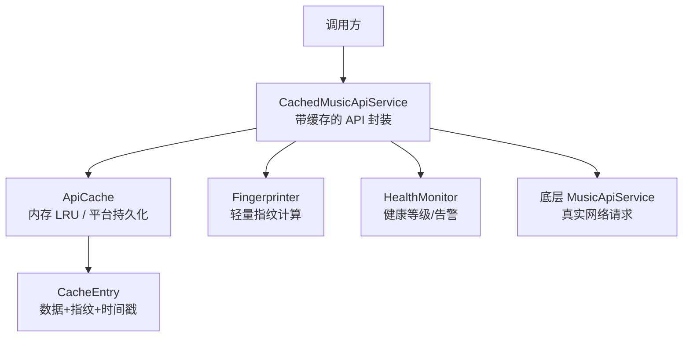
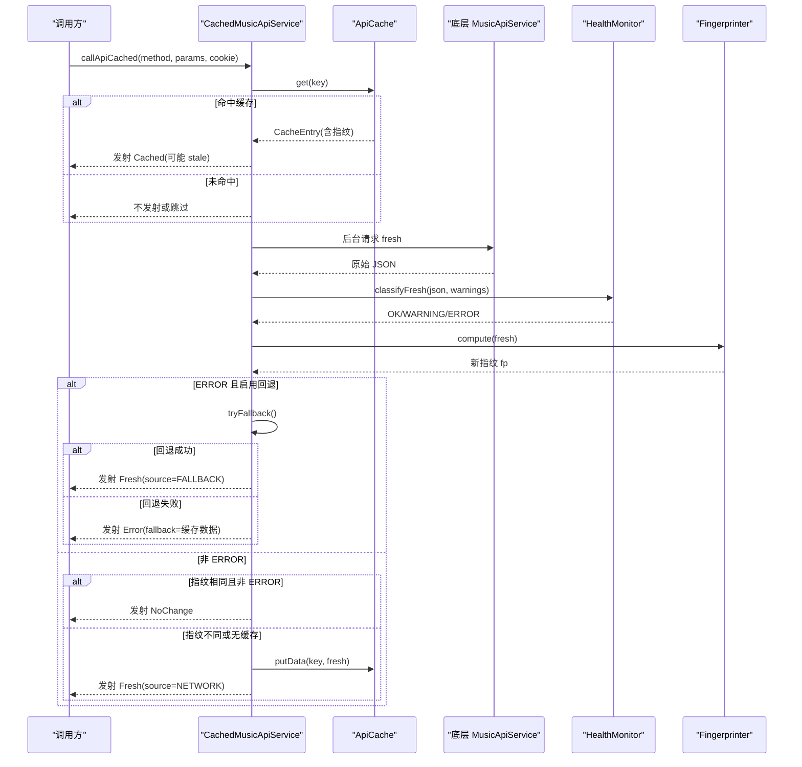
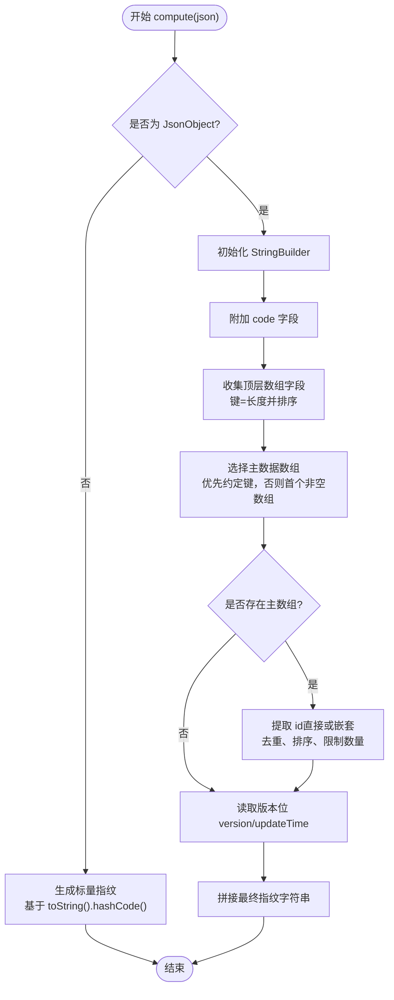
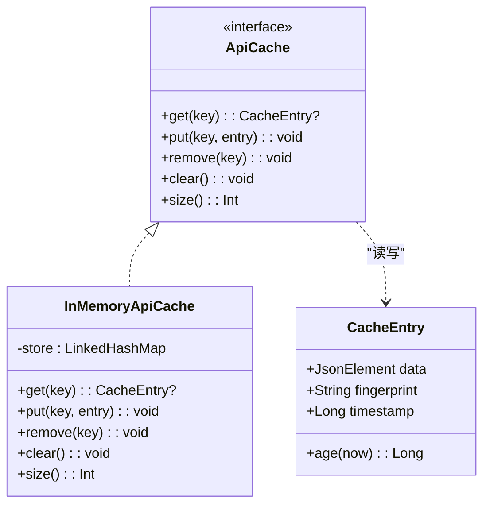
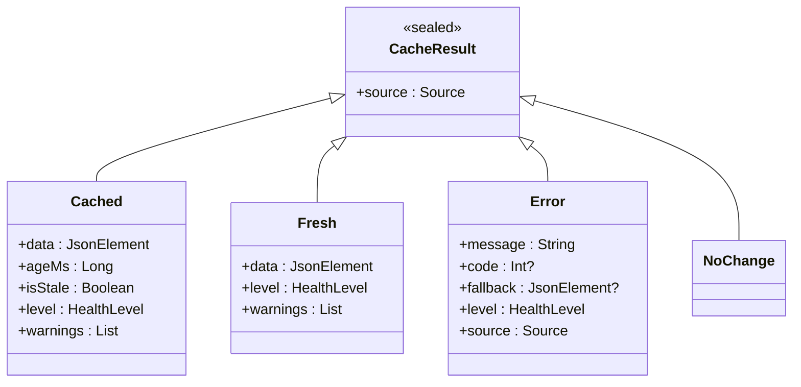
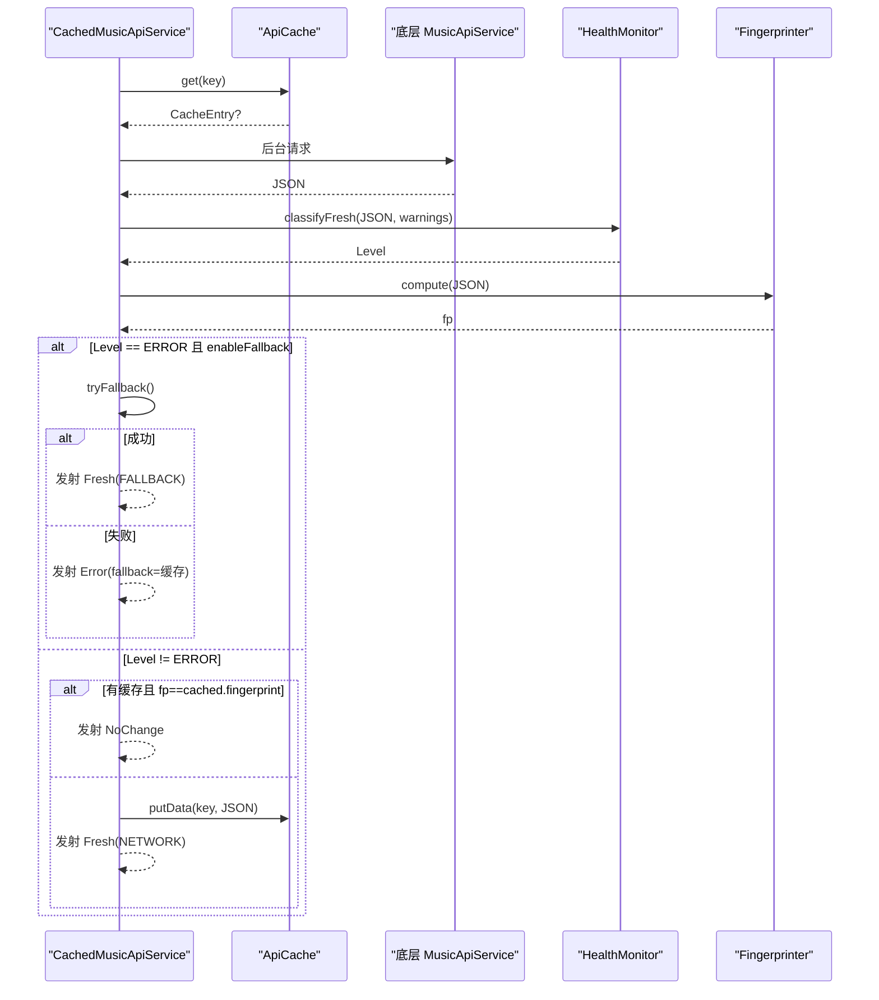
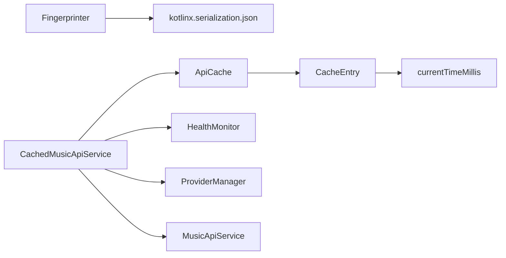

# 指纹计算系统

<cite>
**本文引用的文件**
- [Fingerprinter.kt](file://kmp-pro/src/commonMain/kotlin/cp/player/kmp/cache/Fingerprinter.kt)
- [ApiCache.kt](file://kmp-pro/src/commonMain/kotlin/cp/player/kmp/cache/ApiCache.kt)
- [CacheEntry.kt](file://kmp-pro/src/commonMain/kotlin/cp/player/kmp/cache/CacheEntry.kt)
- [CacheResult.kt](file://kmp-pro/src/commonMain/kotlin/cp/player/kmp/cache/CacheResult.kt)
- [CachedMusicApiService.kt](file://kmp-pro/src/commonMain/kotlin/cp/player/kmp/cache/CachedMusicApiService.kt)
- [HealthMonitor.kt](file://kmp-pro/src/commonMain/kotlin/cp/player/kmp/monitor/HealthMonitor.kt)
</cite>

## 目录
1. [简介](#简介)
2. [项目结构](#项目结构)
3. [核心组件](#核心组件)
4. [架构总览](#架构总览)
5. [详细组件分析](#详细组件分析)
6. [依赖关系分析](#依赖关系分析)
7. [性能与效率](#性能与效率)
8. [故障排查指南](#故障排查指南)
9. [结论](#结论)
10. [附录：配置与扩展](#附录：配置与扩展)

## 简介
本技术文档围绕“指纹计算系统”展开，重点解释 Fingerprinter 类的设计目的、工作原理与算法细节，说明如何通过稳定且轻量的数据指纹检测内容变化，并结合缓存层实现“先返回旧数据、后台比对更新”的高效体验。文档还涵盖指纹比对机制、性能优化策略、配置选项与扩展方式，以及实际使用示例和调试技巧。

## 项目结构
指纹相关能力集中在 kmp-pro 模块的 cache 包中，并与 monitor 健康监控协作，形成“网络请求 → 缓存命中 → 后台拉取 → 指纹比对 → 回写缓存”的完整链路。

图表来源
- [CachedMusicApiService.kt:18-52](file://kmp-pro/src/commonMain/kotlin/cp/player/kmp/cache/CachedMusicApiService.kt#L18-L52)
- [ApiCache.kt:6-18](file://kmp-pro/src/commonMain/kotlin/cp/player/kmp/cache/ApiCache.kt#L6-L18)
- [Fingerprinter.kt:10-23](file://kmp-pro/src/commonMain/kotlin/cp/player/kmp/cache/Fingerprinter.kt#L10-L23)
- [CacheEntry.kt:6-22](file://kmp-pro/src/commonMain/kotlin/cp/player/kmp/cache/CacheEntry.kt#L6-L22)
- [HealthMonitor.kt:10-24](file://kmp-pro/src/commonMain/kotlin/cp/player/kmp/monitor/HealthMonitor.kt#L10-L24)

章节来源
- [CachedMusicApiService.kt:18-52](file://kmp-pro/src/commonMain/kotlin/cp/player/kmp/cache/CachedMusicApiService.kt#L18-L52)
- [ApiCache.kt:6-18](file://kmp-pro/src/commonMain/kotlin/cp/player/kmp/cache/ApiCache.kt#L6-L18)

## 核心组件
- Fingerprinter：对 JSON 响应生成稳定、轻量、可比较的指纹字符串，用于判断“内容是否变化”。
- CacheEntry：保存完整 JSON、对应指纹与时间戳，作为缓存条目。
- ApiCache：缓存抽象与默认内存 LRU 实现；提供便捷写入方法自动计算指纹并打时间戳。
- CachedMusicApiService：将缓存、健康监控、多 Provider 容灾与指纹比对整合到统一的 API 调用流程中。
- HealthMonitor：对 API 调用的健康状态进行三级分类（OK/WARNING/ERROR），驱动回退与告警。

章节来源
- [Fingerprinter.kt:10-23](file://kmp-pro/src/commonMain/kotlin/cp/player/kmp/cache/Fingerprinter.kt#L10-L23)
- [CacheEntry.kt:6-22](file://kmp-pro/src/commonMain/kotlin/cp/player/kmp/cache/CacheEntry.kt#L6-L22)
- [ApiCache.kt:6-18](file://kmp-pro/src/commonMain/kotlin/cp/player/kmp/cache/ApiCache.kt#L6-L18)
- [CachedMusicApiService.kt:18-52](file://kmp-pro/src/commonMain/kotlin/cp/player/kmp/cache/CachedMusicApiService.kt#L18-L52)
- [HealthMonitor.kt:10-24](file://kmp-pro/src/commonMain/kotlin/cp/player/kmp/monitor/HealthMonitor.kt#L10-L24)

## 架构总览
下图展示了从调用到返回的完整时序，包括缓存优先、后台拉取、指纹比对与健康监控驱动的容灾逻辑。

图表来源
- [CachedMusicApiService.kt:60-140](file://kmp-pro/src/commonMain/kotlin/cp/player/kmp/cache/CachedMusicApiService.kt#L60-L140)
- [ApiCache.kt:64-67](file://kmp-pro/src/commonMain/kotlin/cp/player/kmp/cache/ApiCache.kt#L64-L67)
- [Fingerprinter.kt:26-62](file://kmp-pro/src/commonMain/kotlin/cp/player/kmp/cache/Fingerprinter.kt#L26-L62)
- [HealthMonitor.kt:194-203](file://kmp-pro/src/commonMain/kotlin/cp/player/kmp/monitor/HealthMonitor.kt#L194-L203)

## 详细组件分析

### Fingerprinter 设计与算法
- 设计目标：以极小开销生成稳定签名，比较两次响应的“内容身份”，避免逐字段比对大对象。
- 指纹组成（按顺序拼接，用分隔符区分）：
  - code：原始字符串（缺失记为占位符）。
  - 顶层数组长度集合：所有顶层数组字段的“键=长度”，按字典序排序后拼接。
  - 主数据数组 id 列表：探测常见主数据数组键，提取每个对象的 id（支持直接 id 与嵌套 song/track 等结构的 id），去重、排序、限制数量后拼接。
  - 版本位：version 或 updateTime 任一存在则取其字符串值，否则占位符。
- 稳定性与敏感性：
  - 同一份“内容”产生相同指纹；增删/重排条目会改变指纹；无关字段（如广告、统计信息）不影响。
- 复杂度与性能：
  - 主要成本在遍历顶层字段、识别主数组、提取 id 与排序；整体近似 O(N log N)（N 为主数组元素数），适合中等规模响应。
  - 通过限制 id 数量与仅关注关键字段，显著降低大对象处理成本。

图表来源
- [Fingerprinter.kt:26-62](file://kmp-pro/src/commonMain/kotlin/cp/player/kmp/cache/Fingerprinter.kt#L26-L62)
- [Fingerprinter.kt:64-93](file://kmp-pro/src/commonMain/kotlin/cp/player/kmp/cache/Fingerprinter.kt#L64-L93)

章节来源
- [Fingerprinter.kt:10-23](file://kmp-pro/src/commonMain/kotlin/cp/player/kmp/cache/Fingerprinter.kt#L10-L23)
- [Fingerprinter.kt:26-62](file://kmp-pro/src/commonMain/kotlin/cp/player/kmp/cache/Fingerprinter.kt#L26-L62)
- [Fingerprinter.kt:64-93](file://kmp-pro/src/commonMain/kotlin/cp/player/kmp/cache/Fingerprinter.kt#L64-L93)

### 缓存条目与写入流程
- CacheEntry：包含完整 JSON、指纹与存入时间戳；提供 age(now) 计算年龄。
- ApiCache.putData：便捷写入，自动调用 Fingerprinter.compute(data) 计算指纹并打时间戳。
- InMemoryApiCache：进程内 LRU 缓存，线程安全，超过最大条目数淘汰最旧项。

图表来源
- [CacheEntry.kt:6-22](file://kmp-pro/src/commonMain/kotlin/cp/player/kmp/cache/CacheEntry.kt#L6-L22)
- [ApiCache.kt:6-18](file://kmp-pro/src/commonMain/kotlin/cp/player/kmp/cache/ApiCache.kt#L6-L18)
- [ApiCache.kt:20-49](file://kmp-pro/src/commonMain/kotlin/cp/player/kmp/cache/ApiCache.kt#L20-L49)

章节来源
- [CacheEntry.kt:6-22](file://kmp-pro/src/commonMain/kotlin/cp/player/kmp/cache/CacheEntry.kt#L6-L22)
- [ApiCache.kt:6-18](file://kmp-pro/src/commonMain/kotlin/cp/player/kmp/cache/ApiCache.kt#L6-L18)
- [ApiCache.kt:20-49](file://kmp-pro/src/commonMain/kotlin/cp/player/kmp/cache/ApiCache.kt#L20-L49)
- [ApiCache.kt:64-67](file://kmp-pro/src/commonMain/kotlin/cp/player/kmp/cache/ApiCache.kt#L64-L67)

### 缓存结果与健康监控集成
- CacheResult：统一返回契约，包含 Cached（来自缓存）、Fresh（来自网络）、Error（失败，可附带 fallback）、NoChange（后台比对一致）。
- HealthMonitor：对 API 响应进行分类（OK/WARNING/ERROR），并提供最近告警查询；CachedMusicApiService 据此决定是否触发多 Provider 容灾。

图表来源
- [CacheResult.kt:6-44](file://kmp-pro/src/commonMain/kotlin/cp/player/kmp/cache/CacheResult.kt#L6-L44)
- [HealthMonitor.kt:10-24](file://kmp-pro/src/commonMain/kotlin/cp/player/kmp/monitor/HealthMonitor.kt#L10-L24)

章节来源
- [CacheResult.kt:6-44](file://kmp-pro/src/commonMain/kotlin/cp/player/kmp/cache/CacheResult.kt#L6-L44)
- [HealthMonitor.kt:10-24](file://kmp-pro/src/commonMain/kotlin/cp/player/kmp/monitor/HealthMonitor.kt#L10-L24)

### 缓存服务与指纹比对流程
- 调用流程：
  1) 若开启缓存且命中，立即发射 Cached（标记是否过期）。
  2) 后台拉取最新数据，计算健康等级与新指纹。
  3) 若健康等级为 ERROR 且启用回退，尝试其他 Provider 获取数据；成功则标记 FALLBACK。
  4) 若指纹与缓存相同且非 ERROR，发射 NoChange。
  5) 否则写回缓存并发射 Fresh。
- 可缓存接口白名单：仅幂等读类接口缓存，写/动作类直通网络。

图表来源
- [CachedMusicApiService.kt:60-140](file://kmp-pro/src/commonMain/kotlin/cp/player/kmp/cache/CachedMusicApiService.kt#L60-L140)
- [CachedMusicApiService.kt:149-184](file://kmp-pro/src/commonMain/kotlin/cp/player/kmp/cache/CachedMusicApiService.kt#L149-L184)
- [ApiCache.kt:64-67](file://kmp-pro/src/commonMain/kotlin/cp/player/kmp/cache/ApiCache.kt#L64-L67)

章节来源
- [CachedMusicApiService.kt:60-140](file://kmp-pro/src/commonMain/kotlin/cp/player/kmp/cache/CachedMusicApiService.kt#L60-L140)
- [CachedMusicApiService.kt:149-184](file://kmp-pro/src/commonMain/kotlin/cp/player/kmp/cache/CachedMusicApiService.kt#L149-L184)
- [ApiCache.kt:64-67](file://kmp-pro/src/commonMain/kotlin/cp/player/kmp/cache/ApiCache.kt#L64-L67)

## 依赖关系分析
- Fingerprinter 依赖 kotlinx.serialization.json 类型进行解析与遍历。
- CachedMusicApiService 依赖 ApiCache、HealthMonitor、ProviderManager 与底层 MusicApiService。
- ApiCache 默认实现 InMemoryApiCache 使用 LinkedHashMap 实现 LRU。
- CacheEntry 依赖时间工具函数 currentTimeMillis。

图表来源
- [Fingerprinter.kt:3-8](file://kmp-pro/src/commonMain/kotlin/cp/player/kmp/cache/Fingerprinter.kt#L3-L8)
- [CachedMusicApiService.kt:3-16](file://kmp-pro/src/commonMain/kotlin/cp/player/kmp/cache/CachedMusicApiService.kt#L3-L16)
- [ApiCache.kt:1-5](file://kmp-pro/src/commonMain/kotlin/cp/player/kmp/cache/ApiCache.kt#L1-L5)
- [CacheEntry.kt:1-5](file://kmp-pro/src/commonMain/kotlin/cp/player/kmp/cache/CacheEntry.kt#L1-L5)

章节来源
- [Fingerprinter.kt:3-8](file://kmp-pro/src/commonMain/kotlin/cp/player/kmp/cache/Fingerprinter.kt#L3-L8)
- [CachedMusicApiService.kt:3-16](file://kmp-pro/src/commonMain/kotlin/cp/player/kmp/cache/CachedMusicApiService.kt#L3-L16)
- [ApiCache.kt:1-5](file://kmp-pro/src/commonMain/kotlin/cp/player/kmp/cache/ApiCache.kt#L1-L5)
- [CacheEntry.kt:1-5](file://kmp-pro/src/commonMain/kotlin/cp/player/kmp/cache/CacheEntry.kt#L1-L5)

## 性能与效率
- 指纹计算优化：
  - 仅关注关键路径：code、顶层数组长度、主数据数组 id、版本位；忽略无关字段，减少序列化与比较成本。
  - 主数组 id 去重与限制数量，避免超大列表带来的排序与拼接开销。
  - 使用 StringBuilder 累积指纹，避免多次字符串创建。
- 缓存策略：
  - 先返回缓存（可能 stale），后台异步拉取并比对指纹，提升首屏速度。
  - 仅对幂等读接口缓存，避免写操作污染缓存一致性。
- 健康监控：
  - 快速分类响应质量，必要时触发多 Provider 容灾，保障可用性。
- 大对象处理建议：
  - 控制主数组大小与 id 提取范围；必要时可在上层裁剪响应后再传入 Fingerprinter。
  - 结合业务语义调整 PRIMARY_KEYS 与 NESTED_ID_KEYS，确保覆盖主流数据结构。

[本节为通用性能指导，不直接分析具体文件]

## 故障排查指南
- 常见问题定位：
  - 指纹不稳定：检查主数据数组键是否被正确识别；确认 id 提取逻辑是否覆盖嵌套结构。
  - 缓存未更新：确认方法是否在可缓存白名单；检查健康等级是否为 ERROR（错误时不写缓存）。
  - 频繁 NoChange：确认业务侧是否期望“内容不变”；核对 code 与版本位是否变化。
- 调试技巧：
  - 打印 CacheEntry 的指纹与时间戳，对比前后变化。
  - 查看 HealthMonitor 的最近记录与警告，定位响应质量问题。
  - 临时关闭缓存开关，验证问题是否由缓存引起。

章节来源
- [CachedMusicApiService.kt:194-203](file://kmp-pro/src/commonMain/kotlin/cp/player/kmp/cache/CachedMusicApiService.kt#L194-L203)
- [HealthMonitor.kt:159-178](file://kmp-pro/src/commonMain/kotlin/cp/player/kmp/monitor/HealthMonitor.kt#L159-L178)

## 结论
Fingerprinter 通过聚焦关键语义字段与稳定排序，提供了高效、稳定的内容指纹，配合缓存层的“先旧后新”策略与健康监控的容灾机制，实现了高可用与高性能的数据获取体验。合理配置与扩展 PRIMARY_KEYS/NESTED_ID_KEYS，可适配更多 API 结构，进一步提升系统的鲁棒性与可维护性。

[本节为总结性内容，不直接分析具体文件]

## 附录：配置与扩展
- 配置项（CacheConfig）：
  - freshTtlMs：缓存新鲜阈值，超过视为 stale 但仍可先返回。
  - maxEntries：内存缓存最大条目数，超出时淘汰最旧项。
  - enableFallback：是否启用多 Provider 容灾。
  - enableCache：总开关，false 时所有请求直通网络。
- 自定义扩展：
  - 扩展 PRIMARY_KEYS 与 NESTED_ID_KEYS 以适配新的主数据数组键与嵌套 id 结构。
  - 替换 ApiCache 实现为平台持久化存储，以实现跨重启保留缓存。
  - 在 CachedMusicApiService 的可缓存白名单中添加新的读接口方法。
- 使用示例（概念性步骤）：
  - 构造 CachedMusicApiService，注入 delegate、cache、providerManager、allProviders 与 config。
  - 调用 callApiCached(method, params, cookie)，订阅 Flow 接收 Cached/Fresh/Error/NoChange。
  - 根据 isStale 与 level 决定 UI 展示与刷新策略。
- 调试技巧：
  - 观察 CacheResult 的 source 与 level，判断数据来源与健康状态。
  - 通过 HealthMonitor.getRecentRecords 获取最近告警，定位异常响应。

章节来源
- [CacheConfig.kt:1-16](file://kmp-pro/src/commonMain/kotlin/cp/player/kmp/cache/CacheConfig.kt#L1-L16)
- [ApiCache.kt:64-67](file://kmp-pro/src/commonMain/kotlin/cp/player/kmp/cache/ApiCache.kt#L64-L67)
- [CachedMusicApiService.kt:205-218](file://kmp-pro/src/commonMain/kotlin/cp/player/kmp/cache/CachedMusicApiService.kt#L205-L218)
- [HealthMonitor.kt:159-178](file://kmp-pro/src/commonMain/kotlin/cp/player/kmp/monitor/HealthMonitor.kt#L159-L178)