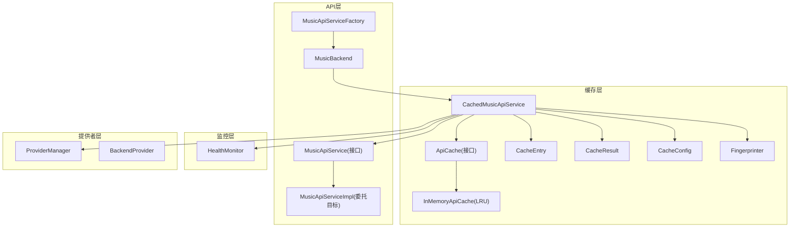
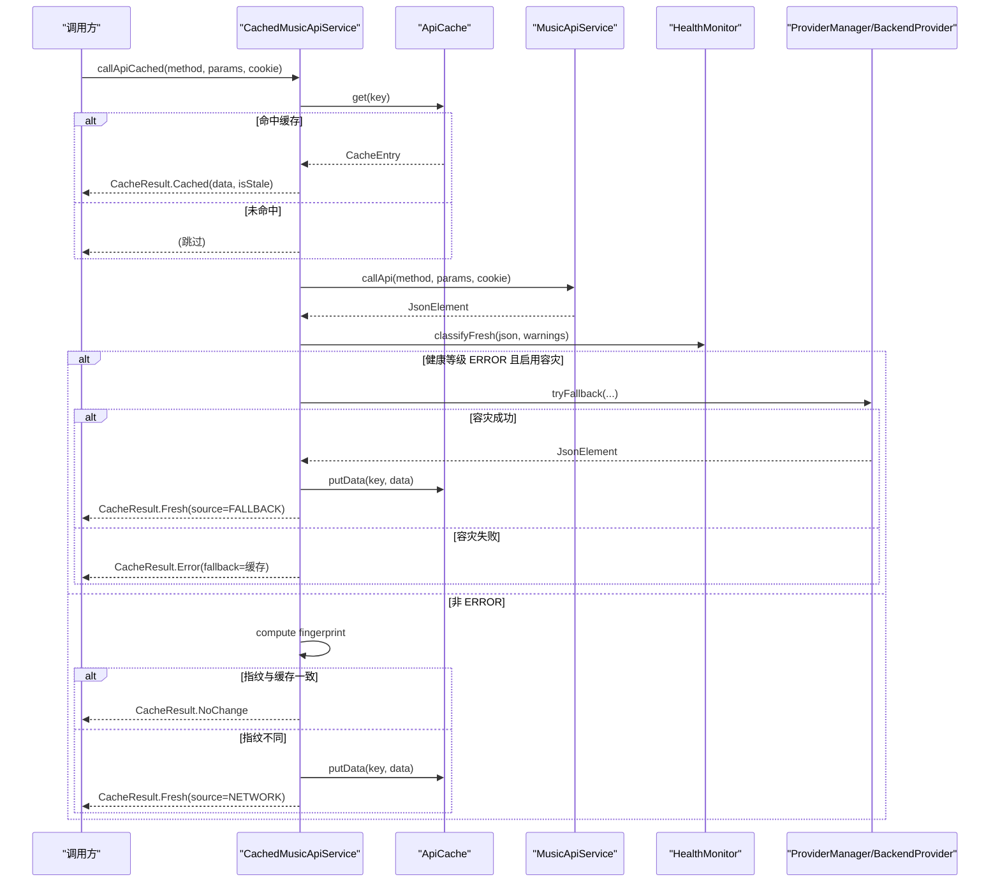
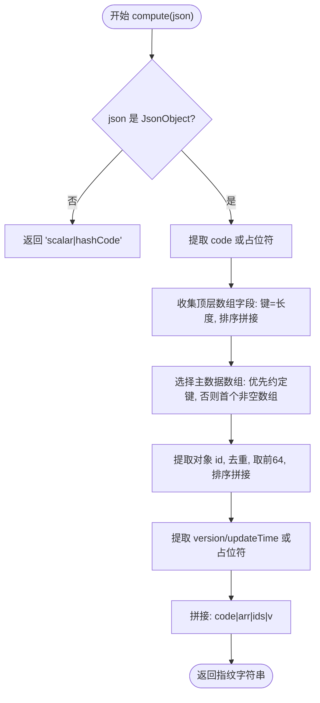
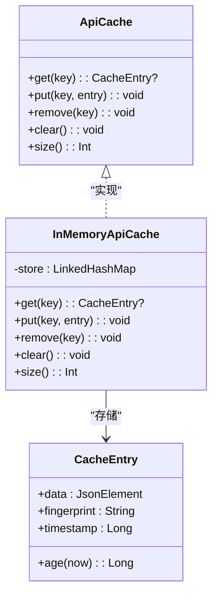
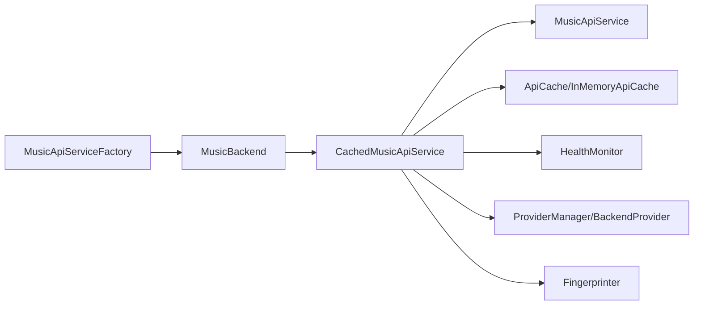

# 智能缓存机制

<cite>
**本文引用的文件**
- [CachedMusicApiService.kt](file://kmp-pro/src/commonMain/kotlin/cp/player/kmp/cache/CachedMusicApiService.kt)
- [Fingerprinter.kt](file://kmp-pro/src/commonMain/kotlin/cp/player/kmp/cache/Fingerprinter.kt)
- [CacheConfig.kt](file://kmp-pro/src/commonMain/kotlin/cp/player/kmp/cache/CacheConfig.kt)
- [ApiCache.kt](file://kmp-pro/src/commonMain/kotlin/cp/player/kmp/cache/ApiCache.kt)
- [CacheEntry.kt](file://kmp-pro/src/commonMain/kotlin/cp/player/kmp/cache/CacheEntry.kt)
- [CacheResult.kt](file://kmp-pro/src/commonMain/kotlin/cp/player/kmp/cache/CacheResult.kt)
- [HealthMonitor.kt](file://kmp-pro/src/commonMain/kotlin/cp/player/kmp/monitor/HealthMonitor.kt)
- [MusicApiService.kt](file://kmp-pro/src/commonMain/kotlin/cp/player/kmp/api/MusicApiService.kt)
- [MusicApiServiceFactory.kt](file://kmp-pro/src/commonMain/kotlin/cp/player/kmp/api/MusicApiServiceFactory.kt)
- [MusicBackend.kt](file://kmp-pro/src/commonMain/kotlin/cp/player/kmp/MusicBackend.kt)
</cite>

## 目录
1. [简介](#简介)
2. [项目结构](#项目结构)
3. [核心组件](#核心组件)
4. [架构总览](#架构总览)
5. [详细组件分析](#详细组件分析)
6. [依赖关系分析](#依赖关系分析)
7. [性能考量](#性能考量)
8. [故障排查指南](#故障排查指南)
9. [结论](#结论)
10. [附录：配置与使用示例](#附录：配置与使用示例)

## 简介
本技术文档围绕 CPPlayer-KMP 的智能缓存机制展开，重点解析 CachedMusicApiService 的设计模式与实现原理、多级缓存架构（内存/LRU）、指纹计算算法 Fingerprinter、缓存失效策略与过期控制、健康监控驱动的多 Provider 容灾回退、以及缓存命中率统计与调优建议。文档同时提供实际使用方式与最佳实践，帮助读者在 KMP 环境下高效集成并优化 API 调用性能与稳定性。

## 项目结构
缓存相关代码集中在 kmp-pro 模块的 cache 包中，并与 api、monitor、provider 等模块协作：
- cache：封装缓存抽象、默认实现、结果模型、指纹计算与服务装饰器
- api：统一音乐 API 服务接口与工厂
- monitor：API 健康监控与统计
- provider：多后端提供者管理与容灾

图表来源
- [CachedMusicApiService.kt:46-88](file://kmp-pro/src/commonMain/kotlin/cp/player/kmp/cache/CachedMusicApiService.kt#L46-L88)
- [ApiCache.kt:11-67](file://kmp-pro/src/commonMain/kotlin/cp/player/kmp/cache/ApiCache.kt#L11-L67)
- [CacheEntry.kt:16-22](file://kmp-pro/src/commonMain/kotlin/cp/player/kmp/cache/CacheEntry.kt#L16-L22)
- [CacheResult.kt:14-44](file://kmp-pro/src/commonMain/kotlin/cp/player/kmp/cache/CacheResult.kt#L14-L44)
- [CacheConfig.kt:11-16](file://kmp-pro/src/commonMain/kotlin/cp/player/kmp/cache/CacheConfig.kt#L11-L16)
- [Fingerprinter.kt:24-62](file://kmp-pro/src/commonMain/kotlin/cp/player/kmp/cache/Fingerprinter.kt#L24-L62)
- [MusicApiService.kt:24-40](file://kmp-pro/src/commonMain/kotlin/cp/player/kmp/api/MusicApiService.kt#L24-L40)
- [MusicApiServiceFactory.kt:21-48](file://kmp-pro/src/commonMain/kotlin/cp/player/kmp/api/MusicApiServiceFactory.kt#L21-L48)
- [MusicBackend.kt:334-346](file://kmp-pro/src/commonMain/kotlin/cp/player/kmp/MusicBackend.kt#L334-L346)

章节来源
- [MusicApiService.kt:24-40](file://kmp-pro/src/commonMain/kotlin/cp/player/kmp/api/MusicApiService.kt#L24-L40)
- [MusicApiServiceFactory.kt:21-48](file://kmp-pro/src/commonMain/kotlin/cp/player/kmp/api/MusicApiServiceFactory.kt#L21-L48)
- [MusicBackend.kt:334-346](file://kmp-pro/src/commonMain/kotlin/cp/player/kmp/MusicBackend.kt#L334-L346)

## 核心组件
- CachedMusicApiService：对 MusicApiService 进行装饰，提供“先返回缓存、后台拉取网络、指纹比对、健康监控与多 Provider 容灾”的 Flow 式调用。
- ApiCache/InMemoryApiCache：缓存抽象与进程内 LRU 实现，支持容量管理、线程安全访问。
- CacheEntry：缓存条目，包含数据、指纹、时间戳，用于过期判断与指纹比对。
- CacheResult：统一的结果模型，区分缓存命中、新鲜数据、错误降级与无变更信号。
- CacheConfig：缓存开关、新鲜度阈值、最大条目数、是否启用容灾回退等配置。
- Fingerprinter：轻量级响应指纹生成器，基于 code、顶层数组长度、主数据 id 列表与版本位，稳定且低成本。
- HealthMonitor：三级健康等级（OK/WARNING/ERROR），记录调用统计、告警与整体健康状态，驱动容灾与 UI 提示。

章节来源
- [CachedMusicApiService.kt:46-219](file://kmp-pro/src/commonMain/kotlin/cp/player/kmp/cache/CachedMusicApiService.kt#L46-L219)
- [ApiCache.kt:11-67](file://kmp-pro/src/commonMain/kotlin/cp/player/kmp/cache/ApiCache.kt#L11-L67)
- [CacheEntry.kt:16-22](file://kmp-pro/src/commonMain/kotlin/cp/player/kmp/cache/CacheEntry.kt#L16-L22)
- [CacheResult.kt:14-44](file://kmp-pro/src/commonMain/kotlin/cp/player/kmp/cache/CacheResult.kt#L14-L44)
- [CacheConfig.kt:11-16](file://kmp-pro/src/commonMain/kotlin/cp/player/kmp/cache/CacheConfig.kt#L11-L16)
- [Fingerprinter.kt:24-93](file://kmp-pro/src/commonMain/kotlin/cp/player/kmp/cache/Fingerprinter.kt#L24-L93)
- [HealthMonitor.kt:25-290](file://kmp-pro/src/commonMain/kotlin/cp/player/kmp/monitor/HealthMonitor.kt#L25-L290)

## 架构总览
CachedMusicApiService 采用装饰器模式，透明地增强底层 MusicApiService 的能力，对外暴露 callApiCached 返回 Flow<CacheResult<JsonElement>>。调用流程如下：
- 立即返回缓存（若存在），标记是否 stale
- 后台发起网络请求，计算新响应指纹
- 指纹相同则发射 NoChange；不同则写回缓存并发射 Fresh
- 健康等级为 ERROR 时触发多 Provider 容灾，成功则标记 FALLBACK
- 异常时返回 Error，可能附带缓存作为 fallback

图表来源
- [CachedMusicApiService.kt:60-140](file://kmp-pro/src/commonMain/kotlin/cp/player/kmp/cache/CachedMusicApiService.kt#L60-L140)
- [ApiCache.kt:51-67](file://kmp-pro/src/commonMain/kotlin/cp/player/kmp/cache/ApiCache.kt#L51-L67)
- [HealthMonitor.kt:194-203](file://kmp-pro/src/commonMain/kotlin/cp/player/kmp/cache/CachedMusicApiService.kt#L194-L203)

## 详细组件分析

### 装饰器模式与调用流
- 通过 Kotlin 委托 by delegate 将 MusicApiService 的方法透传，仅对需要缓存的读类接口进行增强。
- callApiCached 以 Flow 形式发射多个结果：先缓存后网络，保证低延迟首帧展示。
- 键生成策略：providerId#method#sortedParams#cookieHash，确保同一 Provider、方法、参数与认证上下文下的唯一性。

章节来源
- [CachedMusicApiService.kt:46-88](file://kmp-pro/src/commonMain/kotlin/cp/player/kmp/cache/CachedMusicApiService.kt#L46-L88)
- [ApiCache.kt:51-62](file://kmp-pro/src/commonMain/kotlin/cp/player/kmp/cache/ApiCache.kt#L51-L62)

### 指纹计算算法（Fingerprinter）
- 目标：用极小开销生成稳定签名，比较两次响应的“内容身份”，避免完整 JSON 对比。
- 组成：
  - code 原始字符串（缺失记为占位符）
  - 顶层所有数组字段的“键=长度”，按字典序拼接
  - 主数据数组中每个对象的 id 取值（最多 64 个），去重排序后拼接
  - 顶层 version/updateTime 等版本位（若存在）
- 特性：增删/重排条目会改变指纹；无关字段变化不影响；对常见数据结构（songs、playlist、albums 等）有优先探测。

图表来源
- [Fingerprinter.kt:24-62](file://kmp-pro/src/commonMain/kotlin/cp/player/kmp/cache/Fingerprinter.kt#L24-L62)
- [Fingerprinter.kt:64-93](file://kmp-pro/src/commonMain/kotlin/cp/player/kmp/cache/Fingerprinter.kt#L64-L93)

章节来源
- [Fingerprinter.kt:24-93](file://kmp-pro/src/commonMain/kotlin/cp/player/kmp/cache/Fingerprinter.kt#L24-L93)

### 多级缓存架构与容量管理
- 抽象层：ApiCache 定义 get/put/remove/clear/size 接口，便于平台扩展持久化实现。
- 默认实现：InMemoryApiCache 基于 LinkedHashMap 的 LRU 淘汰策略，线程安全（同步锁）。
- 容量管理：maxEntries 控制最大条目数，超过时自动淘汰最旧条目。
- 便捷写入：putData 自动计算指纹并打时间戳，简化上层调用。

图表来源
- [ApiCache.kt:11-49](file://kmp-pro/src/commonMain/kotlin/cp/player/kmp/cache/ApiCache.kt#L11-L49)
- [CacheEntry.kt:16-22](file://kmp-pro/src/commonMain/kotlin/cp/player/kmp/cache/CacheEntry.kt#L16-L22)

章节来源
- [ApiCache.kt:11-67](file://kmp-pro/src/commonMain/kotlin/cp/player/kmp/cache/ApiCache.kt#L11-L67)
- [CacheEntry.kt:16-22](file://kmp-pro/src/commonMain/kotlin/cp/player/kmp/cache/CacheEntry.kt#L16-L22)

### 缓存失效策略、过期时间与冲突解决
- 新鲜度阈值：freshTtlMs 决定缓存是否视为 stale；即使 stale 也会先返回，随后后台刷新。
- 过期处理：CacheEntry.age(now) 计算年龄，isStale = age > freshTtlMs。
- 冲突解决：
  - 指纹比对：若新响应指纹与缓存一致，发射 NoChange，避免重复更新。
  - 幂等性限制：仅读类接口可缓存，写/动作类直通网络，避免状态不一致。
  - 健康监控：ERROR 级别触发多 Provider 容灾，成功则标记 FALLBACK；失败则返回 Error 并携带缓存 fallback。

章节来源
- [CachedMusicApiService.kt:60-140](file://kmp-pro/src/commonMain/kotlin/cp/player/kmp/cache/CachedMusicApiService.kt#L60-L140)
- [CacheConfig.kt:11-16](file://kmp-pro/src/commonMain/kotlin/cp/player/kmp/cache/CacheConfig.kt#L11-L16)
- [CacheEntry.kt:16-22](file://kmp-pro/src/commonMain/kotlin/cp/player/kmp/cache/CacheEntry.kt#L16-L22)

### 健康监控与多 Provider 容灾
- 健康等级：OK/WARNING/ERROR，由 HealthMonitor 分类响应与警告。
- 容灾流程：当当前 Provider 返回 ERROR 且启用 enableFallback，依次尝试其他 Provider，记录调用统计与 wasFallback。
- 统计指标：成功率、平均耗时、P95 耗时、回退次数、最近错误与告警类型，支持按 Provider 与方法维度查询。

章节来源
- [HealthMonitor.kt:25-290](file://kmp-pro/src/commonMain/kotlin/cp/player/kmp/monitor/HealthMonitor.kt#L25-L290)
- [CachedMusicApiService.kt:142-180](file://kmp-pro/src/commonMain/kotlin/cp/player/kmp/cache/CachedMusicApiService.kt#L142-L180)

### 缓存配置选项与调优建议
- freshTtlMs：控制“新鲜”阈值，建议根据业务数据更新频率设置（如 5 分钟）。
- maxEntries：内存缓存最大条目数，建议结合热点接口数量与设备内存调整（默认 64）。
- enableFallback：是否启用多 Provider 容灾，建议在弱网或多源场景开启。
- enableCache：全局缓存开关，调试时可关闭以直连网络。
- 命中率监控：通过 HealthMonitor 统计各 Provider 的成功率、回退次数与慢响应，结合 CacheEntry 年龄分布评估缓存有效性。
- 调优建议：
  - 针对高频读接口提高 freshTtlMs 以降低网络压力。
  - 针对大响应集合理设置 maxEntries，避免频繁淘汰导致命中率下降。
  - 结合 HealthMonitor 的 WARNING/ERROR 比例动态调整容灾策略。

章节来源
- [CacheConfig.kt:11-16](file://kmp-pro/src/commonMain/kotlin/cp/player/kmp/cache/CacheConfig.kt#L11-L16)
- [HealthMonitor.kt:147-216](file://kmp-pro/src/commonMain/kotlin/cp/player/kmp/monitor/HealthMonitor.kt#L147-L216)

## 依赖关系分析
- CachedMusicApiService 依赖：
  - MusicApiService：被委托的目标服务
  - ApiCache：缓存抽象，默认 InMemoryApiCache
  - ProviderManager/BackendProvider：多 Provider 容灾
  - HealthMonitor：健康监控与统计
  - Fingerprinter：指纹计算
- 工厂与后端：
  - MusicApiServiceFactory 提供 cachedInstance，内部委托 MusicBackend
  - MusicBackend 负责初始化并注入缓存配置与 Provider 管理

图表来源
- [MusicApiServiceFactory.kt:21-48](file://kmp-pro/src/commonMain/kotlin/cp/player/kmp/api/MusicApiServiceFactory.kt#L21-L48)
- [MusicBackend.kt:334-346](file://kmp-pro/src/commonMain/kotlin/cp/player/kmp/MusicBackend.kt#L334-L346)
- [CachedMusicApiService.kt:46-88](file://kmp-pro/src/commonMain/kotlin/cp/player/kmp/cache/CachedMusicApiService.kt#L46-L88)

章节来源
- [MusicApiServiceFactory.kt:21-48](file://kmp-pro/src/commonMain/kotlin/cp/player/kmp/api/MusicApiServiceFactory.kt#L21-L48)
- [MusicBackend.kt:334-346](file://kmp-pro/src/commonMain/kotlin/cp/player/kmp/MusicBackend.kt#L334-L346)

## 性能考量
- 首屏延迟优化：先返回缓存，再后台刷新，显著降低首次渲染等待时间。
- 指纹比对成本：仅抽取关键特征，避免完整 JSON 对比，减少 CPU 与内存占用。
- LRU 淘汰：InMemoryApiCache 使用 LinkedHashMap 的 LRU 策略，保证热点数据常驻。
- 健康监控开销：使用 MutableStateFlow.update 避免每次记录都复制列表，统计查询从快照计算，不阻塞记录路径。
- 容灾代价：仅在 ERROR 级别触发多 Provider 尝试，避免不必要的额外网络开销。

[本节为通用性能讨论，无需特定文件引用]

## 故障排查指南
- 常见问题定位：
  - 缓存未命中：检查 key 生成是否正确（providerId/method/params/cookie），确认 isCacheable 是否允许缓存该接口。
  - 缓存未更新：核对指纹逻辑，确认主数据数组 id 列表是否因结构变化而稳定。
  - 频繁回退：查看 HealthMonitor 的 WARNING/ERROR 比例，评估是否需要调整 freshTtlMs 或 maxEntries。
- 诊断步骤：
  - 使用 HealthMonitor.getRecentRecords 获取最近调用记录，筛选 onlyWarnings/onlyErrors。
  - 使用 HealthMonitor.getStatsByMethod 分析各方法的失败率与回退次数。
  - 检查 InMemoryApiCache.size() 与 maxEntries，评估是否因容量不足导致频繁淘汰。
- 恢复策略：
  - 临时关闭缓存（enableCache=false）验证网络问题。
  - 开启或关闭容灾（enableFallback）观察稳定性变化。
  - 调整 freshTtlMs 与 maxEntries 平衡命中率与内存占用。

章节来源
- [HealthMonitor.kt:159-216](file://kmp-pro/src/commonMain/kotlin/cp/player/kmp/monitor/HealthMonitor.kt#L159-L216)
- [ApiCache.kt:26-49](file://kmp-pro/src/commonMain/kotlin/cp/player/kmp/cache/ApiCache.kt#L26-L49)
- [CachedMusicApiService.kt:205-219](file://kmp-pro/src/commonMain/kotlin/cp/player/kmp/cache/CachedMusicApiService.kt#L205-L219)

## 结论
CPPlayer-KMP 的智能缓存机制通过装饰器模式、指纹比对、多级缓存与健康监控，实现了高可用、低延迟与易维护的 API 调用体验。其设计兼顾了性能与稳定性，适用于多端 KMP 环境。通过合理的配置与监控，可进一步提升命中率与用户体验。

[本节为总结性内容，无需特定文件引用]

## 附录：配置与使用示例
- 创建缓存服务实例：
  - 通过 MusicApiServiceFactory.cachedInstance 获取已配置的 CachedMusicApiService。
  - 或通过 MusicBackend 构造时传入 CacheConfig 自定义行为。
- 调用示例：
  - 使用 callApiCached(method, params, cookie) 获取 Flow<CacheResult<JsonElement>>。
  - 处理 CacheResult.Cached/Fresh/Error/NoChange 分支，UI 可根据 isStale 与 level 显示状态。
- 配置示例：
  - freshTtlMs：根据数据更新频率设置，如 5 分钟。
  - maxEntries：根据热点接口数量与设备内存调整，如 64~256。
  - enableFallback：在多源场景开启以提升可用性。
  - enableCache：调试时可关闭以直连网络。
- 监控与调优：
  - 使用 HealthMonitor.getStatsByMethod 分析各方法成功率与回退次数。
  - 结合 CacheEntry.age 分布评估缓存有效性，必要时调整 freshTtlMs。
  - 针对慢响应接口，考虑增加缓存权重或引入本地预取策略。

章节来源
- [MusicApiServiceFactory.kt:21-48](file://kmp-pro/src/commonMain/kotlin/cp/player/kmp/api/MusicApiServiceFactory.kt#L21-L48)
- [MusicBackend.kt:334-346](file://kmp-pro/src/commonMain/kotlin/cp/player/kmp/MusicBackend.kt#L334-L346)
- [CacheConfig.kt:11-16](file://kmp-pro/src/commonMain/kotlin/cp/player/kmp/cache/CacheConfig.kt#L11-L16)
- [HealthMonitor.kt:147-216](file://kmp-pro/src/commonMain/kotlin/cp/player/kmp/monitor/HealthMonitor.kt#L147-L216)