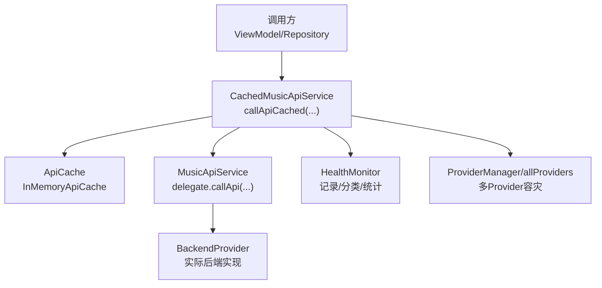
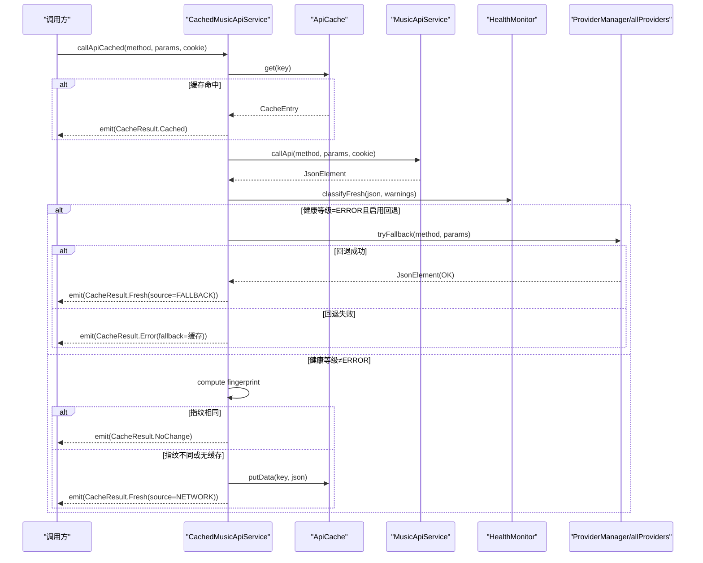
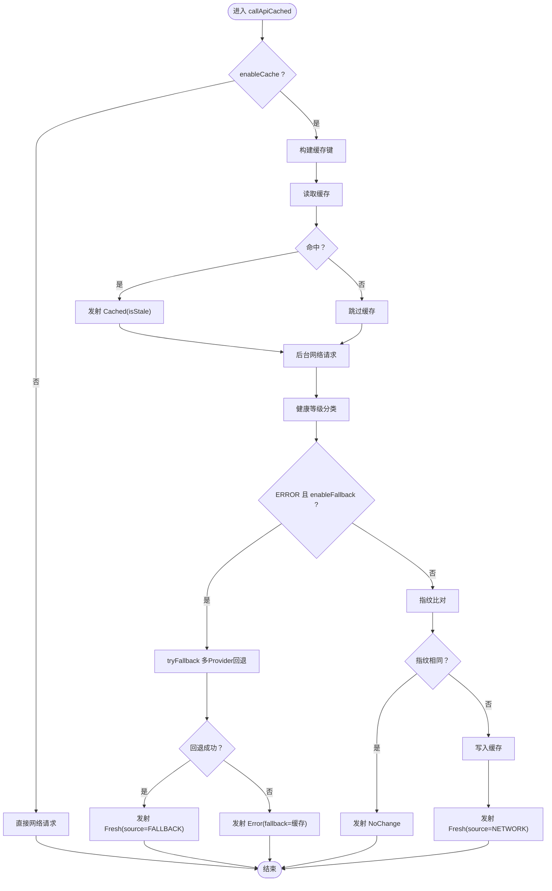
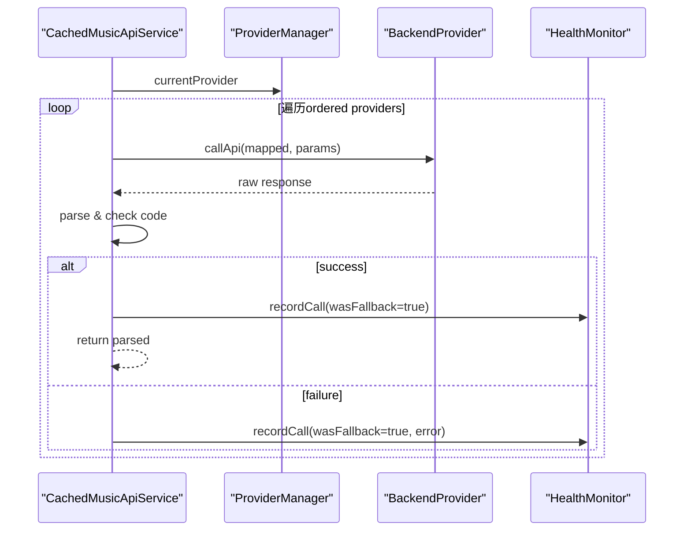
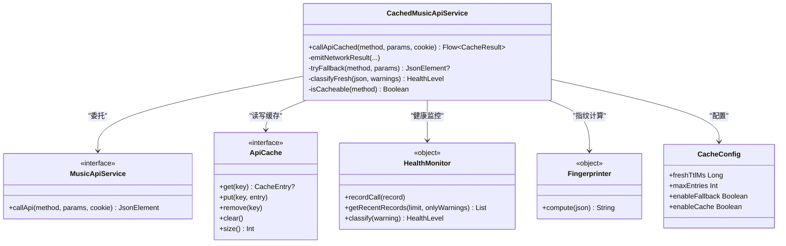

# 缓存API服务

<cite>
**本文引用的文件**
- [CachedMusicApiService.kt](file://kmp-pro/src/commonMain/kotlin/cp/player/kmp/cache/CachedMusicApiService.kt)
- [CacheResult.kt](file://kmp-pro/src/commonMain/kotlin/cp/player/kmp/cache/CacheResult.kt)
- [ApiCache.kt](file://kmp-pro/src/commonMain/kotlin/cp/player/kmp/cache/ApiCache.kt)
- [CacheEntry.kt](file://kmp-pro/src/commonMain/kotlin/cp/player/kmp/cache/CacheEntry.kt)
- [Fingerprinter.kt](file://kmp-pro/src/commonMain/kotlin/cp/player/kmp/cache/Fingerprinter.kt)
- [CacheConfig.kt](file://kmp-pro/src/commonMain/kotlin/cp/player/kmp/cache/CacheConfig.kt)
- [HealthMonitor.kt](file://kmp-pro/src/commonMain/kotlin/cp/player/kmp/monitor/HealthMonitor.kt)
- [MusicApiService.kt](file://kmp-pro/src/commonMain/kotlin/cp/player/kmp/api/MusicApiService.kt)
- [MusicApiMethod.kt](file://kmp-pro/src/commonMain/kotlin/cp/player/kmp/api/MusicApiMethod.kt)
- [MusicApiServiceFactory.kt](file://kmp-pro/src/commonMain/kotlin/cp/player/kmp/api/MusicApiServiceFactory.kt)
</cite>

## 目录
1. [简介](#简介)
2. [项目结构](#项目结构)
3. [核心组件](#核心组件)
4. [架构总览](#架构总览)
5. [详细组件分析](#详细组件分析)
6. [依赖关系分析](#依赖关系分析)
7. [性能考量](#性能考量)
8. [故障排查指南](#故障排查指南)
9. [结论](#结论)
10. [附录：使用示例与最佳实践](#附录使用示例与最佳实践)

## 简介
本技术文档围绕 CachedMusicApiService 展开，系统性说明其基于装饰器模式对 MusicApiService 的封装策略，重点解释 callApiCached 方法的完整调用流程（缓存检查、网络请求、指纹比对、结果处理），Flow 异步流的使用模式与 CacheResult 的不同状态语义；同时阐述多 Provider 容灾机制与健康监控集成（错误分类、警告收集、降级策略），并提供使用示例与最佳实践。

## 项目结构
该能力位于 KMP 模块的 cache 与 monitor 包中，配合 api 层接口与常量定义，形成“接口抽象 + 装饰器增强 + 健康监控”的分层结构。关键文件职责如下：
- MusicApiService：统一 API 接口定义，所有音乐 API 调用的唯一入口。
- CachedMusicApiService：装饰器实现，提供带缓存、异步、健康监控与多 Provider 回退能力的 API 调用。
- ApiCache / InMemoryApiCache / CacheEntry / Fingerprinter：缓存抽象、内存 LRU 实现、条目结构与轻量指纹计算。
- HealthMonitor：三级健康等级、记录与统计、警告分类与整体健康度。
- MusicApiMethod：统一的 API 方法名常量，用于判断是否可缓存等策略。
- CacheConfig：缓存开关、新鲜度阈值、最大条目数、回退开关等配置项。
- MusicApiServiceFactory：工厂持有 cachedInstance，便于全局获取带缓存的服务实例。

图表来源
- [CachedMusicApiService.kt:46-88](file://kmp-pro/src/commonMain/kotlin/cp/player/kmp/cache/CachedMusicApiService.kt#L46-L88)
- [ApiCache.kt:11-67](file://kmp-pro/src/commonMain/kotlin/cp/player/kmp/cache/ApiCache.kt#L11-L67)
- [HealthMonitor.kt:25-138](file://kmp-pro/src/commonMain/kotlin/cp/player/kmp/monitor/HealthMonitor.kt#L25-L138)
- [MusicApiService.kt:24-40](file://kmp-pro/src/commonMain/kotlin/cp/player/kmp/api/MusicApiService.kt#L24-L40)

章节来源
- [MusicApiService.kt:24-40](file://kmp-pro/src/commonMain/kotlin/cp/player/kmp/api/MusicApiService.kt#L24-L40)
- [CachedMusicApiService.kt:46-88](file://kmp-pro/src/commonMain/kotlin/cp/player/kmp/cache/CachedMusicApiService.kt#L46-L88)
- [ApiCache.kt:11-67](file://kmp-pro/src/commonMain/kotlin/cp/player/kmp/cache/ApiCache.kt#L11-L67)
- [HealthMonitor.kt:25-138](file://kmp-pro/src/commonMain/kotlin/cp/player/kmp/monitor/HealthMonitor.kt#L25-L138)

## 核心组件
- CachedMusicApiService：装饰器，包装 MusicApiService，提供 callApiCached 返回 Flow<CacheResult<JsonElement>>，实现“先缓存后网络”的多值发射策略，并集成健康监控与多 Provider 容灾。
- CacheResult：密封类，表示缓存/网络/错误/无变更四种结果状态，携带来源、健康等级与警告列表。
- ApiCache：缓存抽象，默认 InMemoryApiCache 为进程内 LRU；提供 get/put/remove/clear/size 等方法。
- CacheEntry：缓存条目，包含数据、指纹与时间戳，支持 age(now) 计算年龄。
- Fingerprinter：轻量指纹提取器，从响应中提取 code、顶层数组长度、主数据数组 id 列表与版本位，用于低成本比对内容是否变化。
- HealthMonitor：健康监控单例，提供记录、查询、统计与整体健康等级流，支持三级分类（OK/WARNING/ERROR）与警告类型。
- CacheConfig：配置项，控制 freshTtlMs、maxEntries、enableFallback、enableCache。
- MusicApiMethod：API 方法名常量集合，用于判断哪些接口可缓存（幂等读）。

章节来源
- [CacheResult.kt:6-44](file://kmp-pro/src/commonMain/kotlin/cp/player/kmp/cache/CacheResult.kt#L6-L44)
- [ApiCache.kt:11-67](file://kmp-pro/src/commonMain/kotlin/cp/player/kmp/cache/ApiCache.kt#L11-L67)
- [CacheEntry.kt:6-22](file://kmp-pro/src/commonMain/kotlin/cp/player/kmp/cache/CacheEntry.kt#L6-L22)
- [Fingerprinter.kt:10-93](file://kmp-pro/src/commonMain/kotlin/cp/player/kmp/cache/Fingerprinter.kt#L10-L93)
- [HealthMonitor.kt:25-138](file://kmp-pro/src/commonMain/kotlin/cp/player/kmp/monitor/HealthMonitor.kt#L25-L138)
- [CacheConfig.kt:1-16](file://kmp-pro/src/commonMain/kotlin/cp/player/kmp/cache/CacheConfig.kt#L1-L16)
- [MusicApiMethod.kt:1-458](file://kmp-pro/src/commonMain/kotlin/cp/player/kmp/api/MusicApiMethod.kt#L1-L458)

## 架构总览
CachedMusicApiService 通过委托 MusicApiService 实现接口复用，并在 callApiCached 中注入缓存、健康监控与回退逻辑。整体流程如下：
- 若关闭缓存开关，直接走网络路径。
- 否则先查缓存，命中则立即发射 Cached（标注是否过期）。
- 后台调用 delegate.callApi(...)，计算新指纹并与缓存指纹比对：
  - 相同且非 ERROR → 发射 NoChange（无需替换）。
  - 不同或无缓存 → 写回缓存并发射 Fresh。
- 若健康等级为 ERROR 且开启回退，尝试其他 Provider 进行容灾，成功则标记 FALLBACK。
- 异常时发射 Error，并附带 fallback（缓存数据）。

图表来源
- [CachedMusicApiService.kt:60-140](file://kmp-pro/src/commonMain/kotlin/cp/player/kmp/cache/CachedMusicApiService.kt#L60-L140)
- [ApiCache.kt:51-67](file://kmp-pro/src/commonMain/kotlin/cp/player/kmp/cache/ApiCache.kt#L51-L67)
- [HealthMonitor.kt:194-203](file://kmp-pro/src/commonMain/kotlin/cp/player/kmp/monitor/HealthMonitor.kt#L194-L203)

## 详细组件分析

### 装饰器模式在 API 服务中的应用
- 委托复用：CachedMusicApiService 通过 Kotlin 委托 by delegate 复用 MusicApiService 的所有方法，仅对需要增强的 callApi 行为进行覆盖（以 callApiCached 暴露）。
- 横切关注点：将缓存、健康监控、回退等横切逻辑集中在装饰器中，保持底层实现简洁。
- 扩展性：可通过替换 delegate、cache、providerManager 与 allProviders 灵活组合不同实现。

章节来源
- [CachedMusicApiService.kt:46-52](file://kmp-pro/src/commonMain/kotlin/cp/player/kmp/cache/CachedMusicApiService.kt#L46-L52)
- [MusicApiService.kt:24-40](file://kmp-pro/src/commonMain/kotlin/cp/player/kmp/api/MusicApiService.kt#L24-L40)

### callApiCached 方法完整调用流程
- 缓存总开关：若 enableCache=false，直接走网络路径，不写缓存。
- 键生成：providerId#method#sortedParams#cookieHash，确保参数顺序一致。
- 先缓存后网络：命中则立即发射 Cached（isStale 由 freshTtlMs 判定）；随后后台拉取。
- 健康监控分类：classifyFresh 根据 code 与 warnings 判定 OK/WARNING/ERROR。
- 指纹比对：Fingerprinter.compute 生成轻量指纹，相同则 NoChange，不同则写回缓存并 Fresh。
- 多 Provider 容灾：ERROR 且 enableFallback=true 时，tryFallback 依次尝试其它 Provider，成功则标记 FALLBACK。
- 异常处理：捕获异常发射 Error，并附带 fallback（缓存数据）。

图表来源
- [CachedMusicApiService.kt:60-140](file://kmp-pro/src/commonMain/kotlin/cp/player/kmp/cache/CachedMusicApiService.kt#L60-L140)
- [ApiCache.kt:51-67](file://kmp-pro/src/commonMain/kotlin/cp/player/kmp/cache/ApiCache.kt#L51-L67)
- [Fingerprinter.kt:26-62](file://kmp-pro/src/commonMain/kotlin/cp/player/kmp/cache/Fingerprinter.kt#L26-L62)
- [HealthMonitor.kt:194-203](file://kmp-pro/src/commonMain/kotlin/cp/player/kmp/monitor/HealthMonitor.kt#L194-L203)

章节来源
- [CachedMusicApiService.kt:60-140](file://kmp-pro/src/commonMain/kotlin/cp/player/kmp/cache/CachedMusicApiService.kt#L60-L140)
- [CacheConfig.kt:1-16](file://kmp-pro/src/commonMain/kotlin/cp/player/kmp/cache/CacheConfig.kt#L1-L16)
- [ApiCache.kt:51-67](file://kmp-pro/src/commonMain/kotlin/cp/player/kmp/cache/ApiCache.kt#L51-L67)
- [Fingerprinter.kt:26-62](file://kmp-pro/src/commonMain/kotlin/cp/player/kmp/cache/Fingerprinter.kt#L26-L62)
- [HealthMonitor.kt:194-203](file://kmp-pro/src/commonMain/kotlin/cp/player/kmp/monitor/HealthMonitor.kt#L194-L203)

### Flow 异步流的使用模式与返回值类型
- Flow 多值发射：首个值可能为 Cached（即时），随后为 Fresh/NoChange/Error（后台网络结果）。
- 调用方按需收集：可在 UI 层分别处理即时展示与更新提示。
- CacheResult 状态：
  - Cached：来自缓存，携带 ageMs、isStale、source=CACHE、level、warnings。
  - Fresh：来自网络或回退，携带 source=NETWORK/FALLBACK、level、warnings。
  - Error：请求失败，携带 message、fallback（缓存数据）、level=ERROR。
  - NoChange：后台比对发现与缓存一致，可忽略。

章节来源
- [CacheResult.kt:6-44](file://kmp-pro/src/commonMain/kotlin/cp/player/kmp/cache/CacheResult.kt#L6-L44)
- [CachedMusicApiService.kt:60-88](file://kmp-pro/src/commonMain/kotlin/cp/player/kmp/cache/CachedMusicApiService.kt#L60-L88)

### 多 Provider 容灾机制（tryFallback）
- 触发条件：当前响应健康等级为 ERROR 且 enableFallback=true。
- 执行策略：
  - 获取 ordered providers，优先尝试当前 provider（已失败），再尝试其它。
  - 通过 provider.apiMap 映射方法名，跳过 unsupported。
  - 解析 JSON，校验 code ∈ {200,0,201,301} 视为成功。
  - 记录到 HealthMonitor（wasFallback=true，fallbackFrom=current.id）。
  - 返回第一个成功的响应，否则返回 null。
- 结果处理：成功则发射 Fresh(source=FALLBACK)，失败则继续走 Error 分支。

图表来源
- [CachedMusicApiService.kt:149-180](file://kmp-pro/src/commonMain/kotlin/cp/player/kmp/cache/CachedMusicApiService.kt#L149-L180)
- [HealthMonitor.kt:122-138](file://kmp-pro/src/commonMain/kotlin/cp/player/kmp/monitor/HealthMonitor.kt#L122-L138)

章节来源
- [CachedMusicApiService.kt:149-180](file://kmp-pro/src/commonMain/kotlin/cp/player/kmp/cache/CachedMusicApiService.kt#L149-L180)
- [HealthMonitor.kt:122-138](file://kmp-pro/src/commonMain/kotlin/cp/player/kmp/monitor/HealthMonitor.kt#L122-L138)

### 健康监控集成（错误分类、警告收集、降级策略）
- 错误分类：classifyFresh 依据 code 与 warnings 判定 OK/WARNING/ERROR。
- 警告收集：collectRecentWarnings 从 HealthMonitor 获取最近一条相关 method 的 warnings。
- 降级策略：
  - ERROR：触发多 Provider 容灾；若失败则返回 Error（附 fallback 缓存）。
  - WARNING：仍发射数据，附带 warnings，供上层做弱提示或降级展示。
  - OK：正常发射 Fresh。
- 统计与整体健康：HealthMonitor 维护环形缓冲区记录，提供整体健康等级流与统计查询。

章节来源
- [CachedMusicApiService.kt:97-132](file://kmp-pro/src/commonMain/kotlin/cp/player/kmp/cache/CachedMusicApiService.kt#L97-L132)
- [HealthMonitor.kt:194-203](file://kmp-pro/src/commonMain/kotlin/cp/player/kmp/monitor/HealthMonitor.kt#L194-L203)
- [HealthMonitor.kt:159-178](file://kmp-pro/src/commonMain/kotlin/cp/player/kmp/monitor/HealthMonitor.kt#L159-L178)

## 依赖关系分析
- CachedMusicApiService 依赖：
  - MusicApiService：底层 API 实现。
  - ApiCache：缓存读写。
  - ProviderManager/allProviders：多 Provider 容灾。
  - HealthMonitor：健康监控与统计。
  - Fingerprinter：指纹计算。
  - MusicApiMethod：可缓存方法白名单。
- 耦合与内聚：
  - 高内聚：缓存、指纹、健康监控逻辑集中在 CachedMusicApiService。
  - 低耦合：通过接口与配置解耦具体实现，便于替换与测试。
- 外部依赖：
  - kotlinx.coroutines.flow：异步流。
  - kotlinx.serialization.json：JSON 解析与操作。

图表来源
- [CachedMusicApiService.kt:46-219](file://kmp-pro/src/commonMain/kotlin/cp/player/kmp/cache/CachedMusicApiService.kt#L46-L219)
- [MusicApiService.kt:24-40](file://kmp-pro/src/commonMain/kotlin/cp/player/kmp/api/MusicApiService.kt#L24-L40)
- [ApiCache.kt:11-67](file://kmp-pro/src/commonMain/kotlin/cp/player/kmp/cache/ApiCache.kt#L11-L67)
- [HealthMonitor.kt:25-138](file://kmp-pro/src/commonMain/kotlin/cp/player/kmp/monitor/HealthMonitor.kt#L25-L138)
- [Fingerprinter.kt:26-62](file://kmp-pro/src/commonMain/kotlin/cp/player/kmp/cache/Fingerprinter.kt#L26-L62)
- [CacheConfig.kt:1-16](file://kmp-pro/src/commonMain/kotlin/cp/player/kmp/cache/CacheConfig.kt#L1-L16)

章节来源
- [CachedMusicApiService.kt:46-219](file://kmp-pro/src/commonMain/kotlin/cp/player/kmp/cache/CachedMusicApiService.kt#L46-L219)
- [MusicApiService.kt:24-40](file://kmp-pro/src/commonMain/kotlin/cp/player/kmp/api/MusicApiService.kt#L24-L40)
- [ApiCache.kt:11-67](file://kmp-pro/src/commonMain/kotlin/cp/player/kmp/cache/ApiCache.kt#L11-L67)
- [HealthMonitor.kt:25-138](file://kmp-pro/src/commonMain/kotlin/cp/player/kmp/monitor/HealthMonitor.kt#L25-L138)
- [Fingerprinter.kt:26-62](file://kmp-pro/src/commonMain/kotlin/cp/player/kmp/cache/Fingerprinter.kt#L26-L62)
- [CacheConfig.kt:1-16](file://kmp-pro/src/commonMain/kotlin/cp/player/kmp/cache/CacheConfig.kt#L1-L16)

## 性能考量
- 指纹比对开销低：仅抽取 code、顶层数组长度、主数据数组 id 列表（前 64 个，去重排序）与版本位，避免全量比对。
- 缓存命中率：键包含 providerId、method、排序后的 params、cookie hash，减少误命中。
- 内存限制：InMemoryApiCache 默认最大条目数 64，LRU 淘汰最旧条目，防止内存膨胀。
- 健康监控记录：环形缓冲区 MAX_RECORDS=500，避免无限增长；统计查询从快照计算，不阻塞记录路径。
- 回退成本：仅在 ERROR 且 enableFallback=true 时触发，降低常规路径开销。

[本节为通用性能讨论，不直接分析具体文件]

## 故障排查指南
- 常见问题定位：
  - 未命中缓存：检查 key 生成是否正确（params 排序、cookie 哈希）。
  - 频繁 NoChange：确认指纹是否稳定，避免无关字段变化影响。
  - 频繁 Error：查看 HealthMonitor 记录，定位 provider 错误或解析失败。
  - 回退未生效：检查 enableFallback 与 provider.apiMap 映射是否有效。
- 诊断手段：
  - 使用 HealthMonitor.getRecentRecords(limit=100, onlyWarnings=true) 获取最近警告。
  - 使用 HealthMonitor.getAllStats() 查看各 provider 的健康统计与整体等级。
  - 调整 CacheConfig.freshTtlMs 与 maxEntries 平衡新鲜度与内存占用。

章节来源
- [HealthMonitor.kt:159-178](file://kmp-pro/src/commonMain/kotlin/cp/player/kmp/monitor/HealthMonitor.kt#L159-L178)
- [HealthMonitor.kt:147-157](file://kmp-pro/src/commonMain/kotlin/cp/player/kmp/monitor/HealthMonitor.kt#L147-L157)
- [CacheConfig.kt:1-16](file://kmp-pro/src/commonMain/kotlin/cp/player/kmp/cache/CacheConfig.kt#L1-L16)

## 结论
CachedMusicApiService 通过装饰器模式在 MusicApiService 之上提供了强大的缓存、异步、健康监控与多 Provider 容灾能力。其设计清晰、扩展性强，能够有效提升 API 调用的稳定性与用户体验。结合 CacheResult 的状态语义与 Flow 的多值发射，调用方可灵活处理即时展示与后台更新。健康监控与回退机制进一步增强了系统的鲁棒性。

[本节为总结性内容，不直接分析具体文件]

## 附录：使用示例与最佳实践
- 获取带缓存的服务实例：
  - 通过 MusicApiServiceFactory.cachedInstance 获取 CachedMusicApiService。
- 基本用法：
  - 调用 callApiCached(method, params, cookie)，收集 Flow 结果。
  - 处理 Cached：立即展示，标注 isStale 以便提示刷新。
  - 处理 Fresh：更新界面，区分 NETWORK 与 FALLBACK 来源。
  - 处理 Error：显示错误信息，必要时使用 fallback 数据降级。
  - 处理 NoChange：可忽略或提示“数据未更新”。
- 最佳实践：
  - 合理设置 CacheConfig.freshTtlMs，平衡新鲜度与缓存命中率。
  - 对写/动作类接口（登录、点赞、评论等）不要期望缓存命中，因其不在 isCacheable 白名单。
  - 利用 HealthMonitor 监控整体健康等级，及时告警与切换 provider。
  - 在多 Provider 环境下，确保 apiMap 映射正确，避免 unsupported 方法导致回退失败。

章节来源
- [MusicApiServiceFactory.kt:21-36](file://kmp-pro/src/commonMain/kotlin/cp/player/kmp/api/MusicApiServiceFactory.kt#L21-L36)
- [CachedMusicApiService.kt:206-218](file://kmp-pro/src/commonMain/kotlin/cp/player/kmp/cache/CachedMusicApiService.kt#L206-L218)
- [CacheConfig.kt:1-16](file://kmp-pro/src/commonMain/kotlin/cp/player/kmp/cache/CacheConfig.kt#L1-L16)