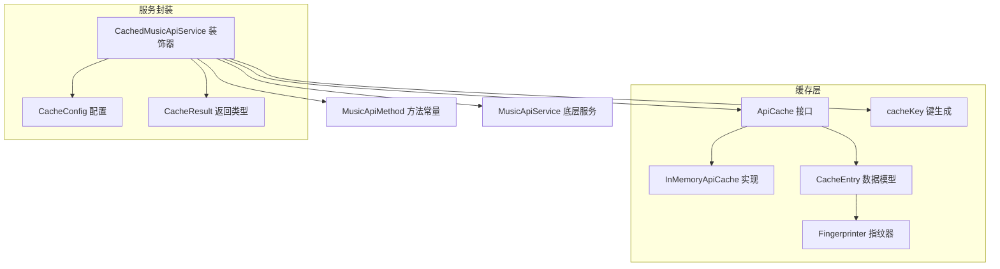
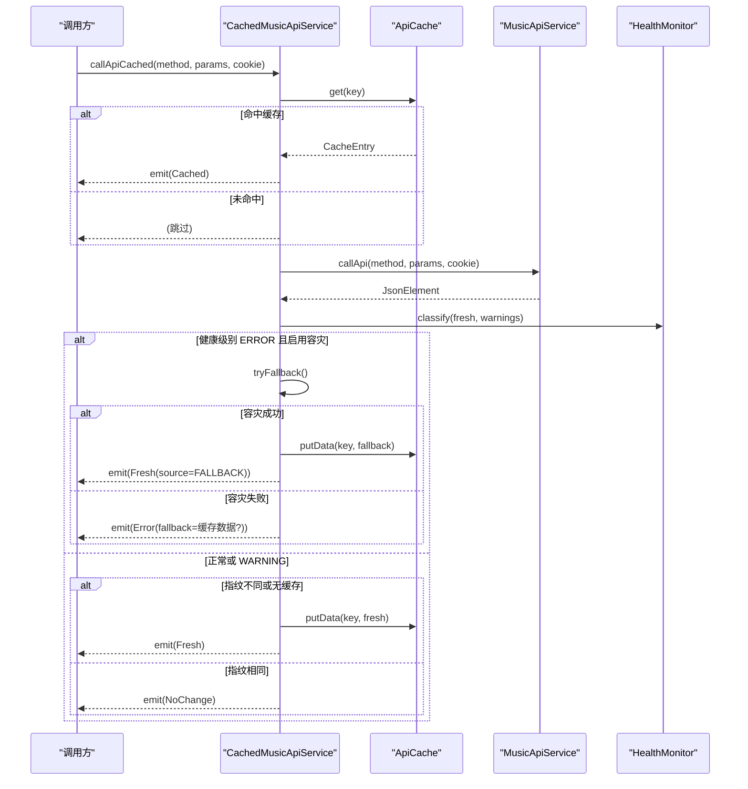
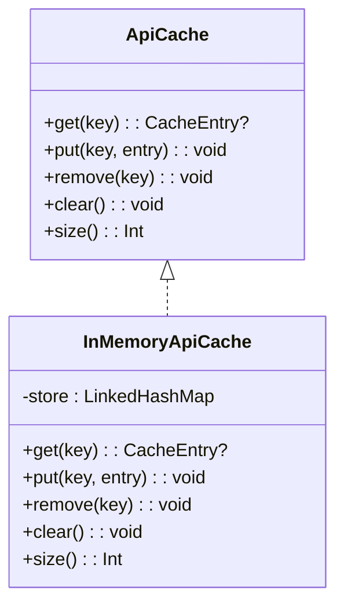
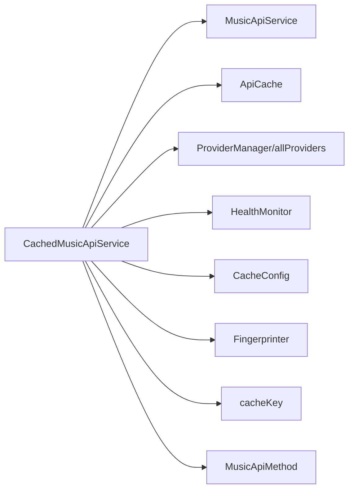

# 缓存存储层

<cite>
**本文引用的文件**
- [ApiCache.kt](file://kmp-pro/src/commonMain/kotlin/cp/player/kmp/cache/ApiCache.kt)
- [CacheEntry.kt](file://kmp-pro/src/commonMain/kotlin/cp/player/kmp/cache/CacheEntry.kt)
- [CachedMusicApiService.kt](file://kmp-pro/src/commonMain/kotlin/cp/player/kmp/cache/CachedMusicApiService.kt)
- [CacheConfig.kt](file://kmp-pro/src/commonMain/kotlin/cp/player/kmp/cache/CacheConfig.kt)
- [Fingerprinter.kt](file://kmp-pro/src/commonMain/kotlin/cp/player/kmp/cache/Fingerprinter.kt)
- [CacheResult.kt](file://kmp-pro/src/commonMain/kotlin/cp/player/kmp/cache/CacheResult.kt)
- [MusicApiMethod.kt](file://kmp-pro/src/commonMain/kotlin/cp/player/kmp/api/MusicApiMethod.kt)
</cite>

## 目录
1. [简介](#简介)
2. [项目结构](#项目结构)
3. [核心组件](#核心组件)
4. [架构总览](#架构总览)
5. [详细组件分析](#详细组件分析)
6. [依赖关系分析](#依赖关系分析)
7. [性能与容量管理](#性能与容量管理)
8. [故障排查指南](#故障排查指南)
9. [结论](#结论)
10. [附录：最佳实践与调优建议](#附录：最佳实践与调优建议)

## 简介
本技术文档聚焦于缓存存储层，围绕 ApiCache 抽象、CacheEntry 数据模型、缓存键生成策略、读写接口、容量管理与清理策略，以及缓存在 API 调用链路中的集成方式进行全面说明。目标是帮助开发者理解并正确使用该缓存层，在保证一致性的前提下提升响应速度与系统韧性。

## 项目结构
缓存相关代码集中在 kmp-pro 模块的 commonMain 下，采用“接口 + 默认实现 + 装饰器”的组织方式：
- 抽象与默认实现：ApiCache（接口）、InMemoryApiCache（进程内 LRU）
- 数据模型：CacheEntry（含指纹与时间戳）
- 工具：Fingerprinter（轻量指纹计算）、cacheKey（键生成）
- 服务封装：CachedMusicApiService（带缓存与容灾的 MusicApiService 装饰器）
- 配置与结果：CacheConfig（阈值与开关）、CacheResult（统一返回类型）

图表来源
- [ApiCache.kt:11-67](file://kmp-pro/src/commonMain/kotlin/cp/player/kmp/cache/ApiCache.kt#L11-L67)
- [CachedMusicApiService.kt:18-52](file://kmp-pro/src/commonMain/kotlin/cp/player/kmp/cache/CachedMusicApiService.kt#L18-L52)
- [CacheConfig.kt:1-16](file://kmp-pro/src/commonMain/kotlin/cp/player/kmp/cache/CacheConfig.kt#L1-L16)
- [CacheResult.kt:6-44](file://kmp-pro/src/commonMain/kotlin/cp/player/kmp/cache/CacheResult.kt#L6-L44)
- [Fingerprinter.kt:10-62](file://kmp-pro/src/commonMain/kotlin/cp/player/kmp/cache/Fingerprinter.kt#L10-L62)
- [MusicApiMethod.kt:14-458](file://kmp-pro/src/commonMain/kotlin/cp/player/kmp/api/MusicApiMethod.kt#L14-L458)

章节来源
- [ApiCache.kt:11-67](file://kmp-pro/src/commonMain/kotlin/cp/player/kmp/cache/ApiCache.kt#L11-L67)
- [CachedMusicApiService.kt:18-52](file://kmp-pro/src/commonMain/kotlin/cp/player/kmp/cache/CachedMusicApiService.kt#L18-L52)

## 核心组件
- ApiCache：定义 get/put/remove/clear/size 等基础能力；默认实现为进程内 LRU，线程安全。
- CacheEntry：保存完整 JSON、轻量指纹与存入时间戳；提供 age(now) 计算条目年龄。
- cacheKey：基于 providerId、method、排序后的 params、cookie 哈希组合成稳定键。
- CachedMusicApiService：对 MusicApiService 进行装饰，提供“先缓存后网络”的 Flow 式返回，支持健康监控与多 Provider 容灾。
- Fingerprinter：从 JSON 提取稳定指纹，用于判断内容是否变化。
- CacheConfig：控制 freshTtlMs、maxEntries、enableFallback、enableCache。
- CacheResult：统一描述 Cached/Fresh/Error/NoChange 四种结果。

章节来源
- [ApiCache.kt:11-67](file://kmp-pro/src/commonMain/kotlin/cp/player/kmp/cache/ApiCache.kt#L11-L67)
- [CacheEntry.kt:6-22](file://kmp-pro/src/commonMain/kotlin/cp/player/kmp/cache/CacheEntry.kt#L6-L22)
- [Fingerprinter.kt:10-62](file://kmp-pro/src/commonMain/kotlin/cp/player/kmp/cache/Fingerprinter.kt#L10-L62)
- [CacheConfig.kt:1-16](file://kmp-pro/src/commonMain/kotlin/cp/player/kmp/cache/CacheConfig.kt#L1-L16)
- [CacheResult.kt:6-44](file://kmp-pro/src/commonMain/kotlin/cp/player/kmp/cache/CacheResult.kt#L6-L44)

## 架构总览
CachedMusicApiService 作为装饰器，将缓存与健康监控、多 Provider 容灾整合到统一的 Flow 中：
- 若启用缓存且命中，立即发射 Cached（标记 isStale 是否超过 freshTtlMs）。
- 后台调用底层 MusicApiService，计算新指纹并与缓存比对：
  - 相同且非 ERROR → 发射 NoChange（可忽略）。
  - 不同或无缓存 → 写回缓存并发射 Fresh。
  - 失败 → 发射 Error，可能附带 fallback（来自缓存或多 Provider 容灾）。
- 健康监控 ERROR 时，尝试其它 Provider 容灾，成功则标记 FALLBACK。

图表来源
- [CachedMusicApiService.kt:60-140](file://kmp-pro/src/commonMain/kotlin/cp/player/kmp/cache/CachedMusicApiService.kt#L60-L140)
- [CachedMusicApiService.kt:149-180](file://kmp-pro/src/commonMain/kotlin/cp/player/kmp/cache/CachedMusicApiService.kt#L149-L180)
- [ApiCache.kt:11-67](file://kmp-pro/src/commonMain/kotlin/cp/player/kmp/cache/ApiCache.kt#L11-L67)

## 详细组件分析

### ApiCache 接口与 InMemoryApiCache 实现
- 职责：定义缓存的最小契约（get/put/remove/clear/size），屏蔽具体存储细节。
- 默认实现：InMemoryApiCache 使用 LinkedHashMap 实现 LRU，超过 maxEntries 淘汰最旧项；所有操作加锁保证线程安全。
- 适用场景：进程内临时缓存；如需跨重启保留，应提供平台持久化 actual 实现。

图表来源
- [ApiCache.kt:11-49](file://kmp-pro/src/commonMain/kotlin/cp/player/kmp/cache/ApiCache.kt#L11-L49)

章节来源
- [ApiCache.kt:11-49](file://kmp-pro/src/commonMain/kotlin/cp/player/kmp/cache/ApiCache.kt#L11-L49)

### CacheEntry 数据模型
- 字段：
  - data：完整响应 JSON（JsonElement）
  - fingerprint：轻量指纹（字符串），用于快速比较内容是否变化
  - timestamp：存入时间（epoch ms）
- 过期计算：age(now) = now - timestamp；结合 freshTtlMs 判断是否 stale。
- 设计要点：指纹由 Fingerprinter 计算，避免全量比对大对象；时间戳用于 TTL 与 UI 展示。

章节来源
- [CacheEntry.kt:6-22](file://kmp-pro/src/commonMain/kotlin/cp/player/kmp/cache/CacheEntry.kt#L6-L22)
- [ApiCache.kt:64-67](file://kmp-pro/src/commonMain/kotlin/cp/player/kmp/cache/ApiCache.kt#L64-L67)

### 缓存键生成策略
- 组成：providerId#method#sortedParams#cookieHash
- 规则：
  - providerId：当前后端提供者 ID，区分不同后端的数据空间
  - method：API 方法名（来自 MusicApiMethod）
  - sortedParams：参数按字典序排序后拼接为 key=value&...，确保顺序无关性
  - cookieHash：cookie 的 hashCode，用于区分登录态差异
- 作用：保证同一请求在不同顺序参数、不同登录态下的唯一性与稳定性。

章节来源
- [ApiCache.kt:51-62](file://kmp-pro/src/commonMain/kotlin/cp/player/kmp/cache/ApiCache.kt#L51-L62)
- [MusicApiMethod.kt:14-458](file://kmp-pro/src/commonMain/kotlin/cp/player/kmp/api/MusicApiMethod.kt#L14-L458)

### 缓存读写接口与使用场景
- get(key)：读取缓存条目；若存在则立即返回，供 UI 快速渲染。
- put(key, entry)：写入条目；通常通过 putData(key, data, now) 自动计算指纹与时间戳。
- remove(key)/clear()：删除指定条目或清空缓存，用于失效或重置。
- size()：查询当前缓存大小，便于监控与调试。
- 典型场景：
  - 列表页：先返回 Cached（可能 stale），后台拉取 Fresh 更新。
  - 详情页：优先命中缓存减少网络开销。
  - 写操作：不缓存（见 isCacheable 白名单）。

章节来源
- [ApiCache.kt:11-67](file://kmp-pro/src/commonMain/kotlin/cp/player/kmp/cache/ApiCache.kt#L11-L67)
- [CachedMusicApiService.kt:60-88](file://kmp-pro/src/commonMain/kotlin/cp/player/kmp/cache/CachedMusicApiService.kt#L60-L88)

### 指纹计算与一致性保障
- Fingerprinter.compute(json) 提取稳定签名：
  - code（原始字符串，缺失记为 _）
  - 顶层数组字段长度集合（键=长度，字典序）
  - 主数据数组的 id 列表（去重、排序、最多 64 个）
  - 版本位（version/updateTime）
- 优势：对同一内容稳定；增删/重排会变化；无关字段不影响。
- 用途：在网络成功后与缓存指纹比对，决定是否替换缓存与发射 NoChange。

章节来源
- [Fingerprinter.kt:10-62](file://kmp-pro/src/commonMain/kotlin/cp/player/kmp/cache/Fingerprinter.kt#L10-L62)
- [CachedMusicApiService.kt:118-127](file://kmp-pro/src/commonMain/kotlin/cp/player/kmp/cache/CachedMusicApiService.kt#L118-L127)

### 健康监控与多 Provider 容灾
- 健康级别分类：根据响应 code 与最近警告判定 OK/WARNING/ERROR。
- ERROR 时触发容灾：依次尝试其它 Provider 调用同一方法（经 apiMap 映射），首个成功即返回并标记 FALLBACK。
- 记录：每次尝试记录到 HealthMonitor，包含 duration、success、wasFallback、fallbackFrom、responseCode 等。

章节来源
- [CachedMusicApiService.kt:90-140](file://kmp-pro/src/commonMain/kotlin/cp/player/kmp/cache/CachedMusicApiService.kt#L90-L140)
- [CachedMusicApiService.kt:149-180](file://kmp-pro/src/commonMain/kotlin/cp/player/kmp/cache/CachedMusicApiService.kt#L149-L180)

### 可缓存方法白名单
- isCacheable 仅允许幂等读类接口缓存，写/动作类直通网络。
- 覆盖范围包括歌曲 URL、详情、歌词、专辑、歌单、用户信息、搜索、榜单、推荐、相似、评论等。

章节来源
- [CachedMusicApiService.kt:205-218](file://kmp-pro/src/commonMain/kotlin/cp/player/kmp/cache/CachedMusicApiService.kt#L205-L218)
- [MusicApiMethod.kt:14-458](file://kmp-pro/src/commonMain/kotlin/cp/player/kmp/api/MusicApiMethod.kt#L14-L458)

## 依赖关系分析
- CachedMusicApiService 依赖：
  - MusicApiService（底层网络）
  - ApiCache（缓存抽象）
  - ProviderManager/allProviders（多 Provider 容灾）
  - HealthMonitor（健康监控与告警）
  - CacheConfig（阈值与开关）
  - Fingerprinter（指纹）
  - cacheKey（键生成）
- 耦合点：
  - 通过 MusicApiMethod 常量统一方法名，降低硬编码风险
  - 通过 HealthMonitor 解耦健康状态收集与决策逻辑

图表来源
- [CachedMusicApiService.kt:18-52](file://kmp-pro/src/commonMain/kotlin/cp/player/kmp/cache/CachedMusicApiService.kt#L18-L52)
- [ApiCache.kt:11-67](file://kmp-pro/src/commonMain/kotlin/cp/player/kmp/cache/ApiCache.kt#L11-L67)
- [CacheConfig.kt:1-16](file://kmp-pro/src/commonMain/kotlin/cp/player/kmp/cache/CacheConfig.kt#L1-L16)
- [Fingerprinter.kt:10-62](file://kmp-pro/src/commonMain/kotlin/cp/player/kmp/cache/Fingerprinter.kt#L10-L62)
- [MusicApiMethod.kt:14-458](file://kmp-pro/src/commonMain/kotlin/cp/player/kmp/api/MusicApiMethod.kt#L14-L458)

章节来源
- [CachedMusicApiService.kt:18-52](file://kmp-pro/src/commonMain/kotlin/cp/player/kmp/cache/CachedMusicApiService.kt#L18-L52)

## 性能与容量管理
- 容量上限：InMemoryApiCache 默认 maxEntries=64，超出时淘汰最旧项；可通过 CacheConfig.maxEntries 调整（注意：实际生效取决于具体实现，当前默认实现以构造参数为准）。
- 内存优化：
  - 使用 JsonElement 直接存储，避免重复序列化
  - 指纹仅包含必要标识，降低比较成本
  - LRU 淘汰策略减少热点外数据的占用
- 清理策略：
  - 显式 remove/clear 用于失效或重置
  - 通过 TTL（freshTtlMs）控制“新鲜度”，UI 可据此决定提示刷新
- 并发安全：InMemoryApiCache 关键方法加 @Synchronized，适合多线程环境

章节来源
- [ApiCache.kt:26-49](file://kmp-pro/src/commonMain/kotlin/cp/player/kmp/cache/ApiCache.kt#L26-L49)
- [CacheConfig.kt:11-16](file://kmp-pro/src/commonMain/kotlin/cp/player/kmp/cache/CacheConfig.kt#L11-L16)

## 故障排查指南
- 常见问题定位：
  - 缓存未命中：检查 cacheKey 生成是否正确（params 排序、cookie 变化）
  - 数据未更新：核对指纹是否因无关字段变化而误判；确认 isCacheable 是否包含该方法
  - 容灾未触发：确认 HealthMonitor 级别是否为 ERROR 且 enableFallback=true
- 诊断步骤：
  - 打印 CacheResult 的 source、level、warnings
  - 观察 CacheEntry.age 与 freshTtlMs 的关系
  - 查看 HealthMonitor 最近记录，确认是否有警告或错误
- 恢复手段：
  - 调用 clear()/remove(key) 强制失效
  - 调整 CacheConfig.freshTtlMs 与 maxEntries
  - 切换 Provider 或修复后端问题

章节来源
- [CachedMusicApiService.kt:90-140](file://kmp-pro/src/commonMain/kotlin/cp/player/kmp/cache/CachedMusicApiService.kt#L90-L140)
- [CacheResult.kt:6-44](file://kmp-pro/src/commonMain/kotlin/cp/player/kmp/cache/CacheResult.kt#L6-L44)

## 结论
该缓存层通过清晰的抽象（ApiCache）、稳定的键生成（cacheKey）、轻量指纹（Fingerprinter）与健壮的容灾（多 Provider 回退），实现了高可用、低延迟的 API 响应体验。配合 CacheConfig 的可控阈值与 CacheResult 的统一语义，既能满足即时渲染需求，又能保证数据新鲜度与一致性。

## 附录：最佳实践与调优建议
- 键设计
  - 始终使用 cacheKey(providerId, method, sorted(params), cookie) 生成键，避免遗漏 cookie 导致登录态污染
  - 对动态参数（如分页）谨慎缓存，必要时纳入键中
- 过期策略
  - 合理设置 freshTtlMs：列表类可稍长，实时类应较短
  - UI 层依据 isStale 提示“数据可能过期”，引导刷新
- 容量与内存
  - 根据设备内存与热点数据规模调整 maxEntries
  - 定期监控 size()，避免热点膨胀
- 健康与容灾
  - 开启 enableFallback，提升弱网或后端抖动时的可用性
  - 关注 HealthMonitor 的 WARNING/ERROR，及时治理后端问题
- 方法选择
  - 仅对幂等读类接口启用缓存（isCacheable 白名单）
  - 写/动作类接口（登录、点赞、发评论等）直通网络，避免脏数据
- 指纹与一致性
  - 保持响应结构稳定，避免频繁变更字段名
  - 利用指纹快速判断内容变化，减少不必要的全量比对

[本节为通用指导，不直接分析具体文件]