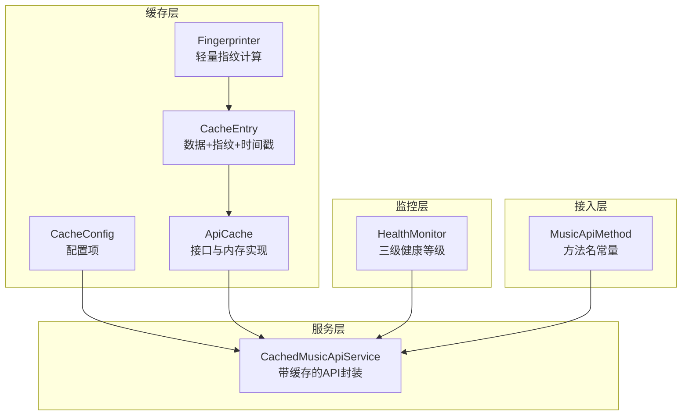
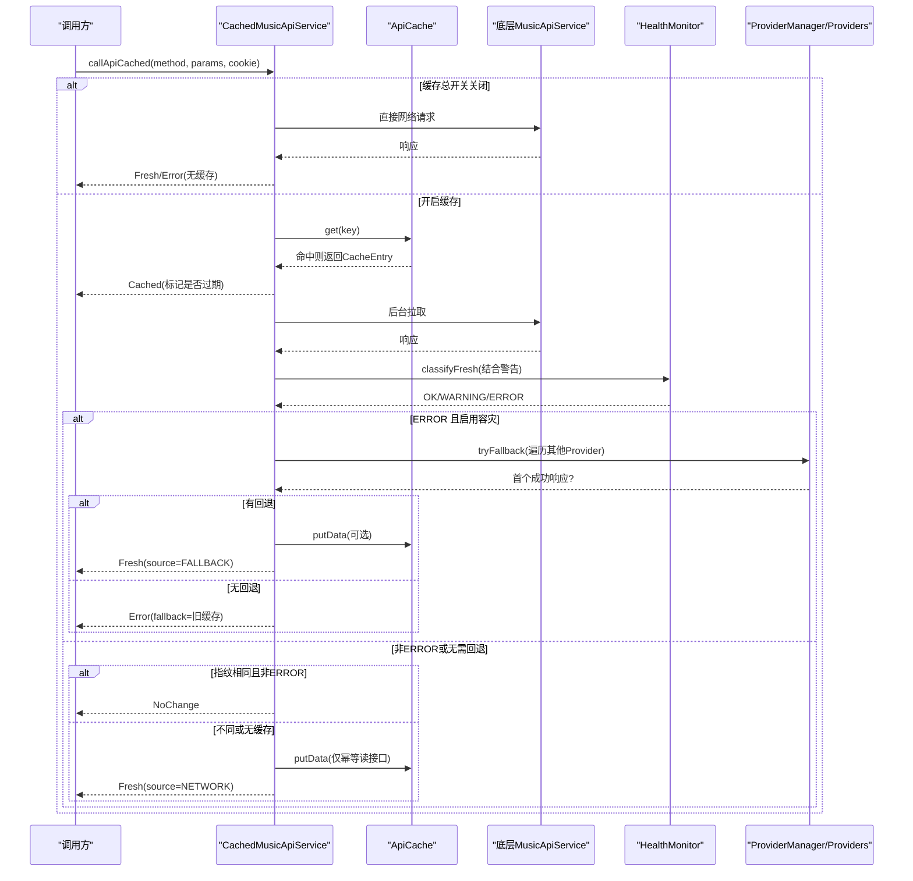
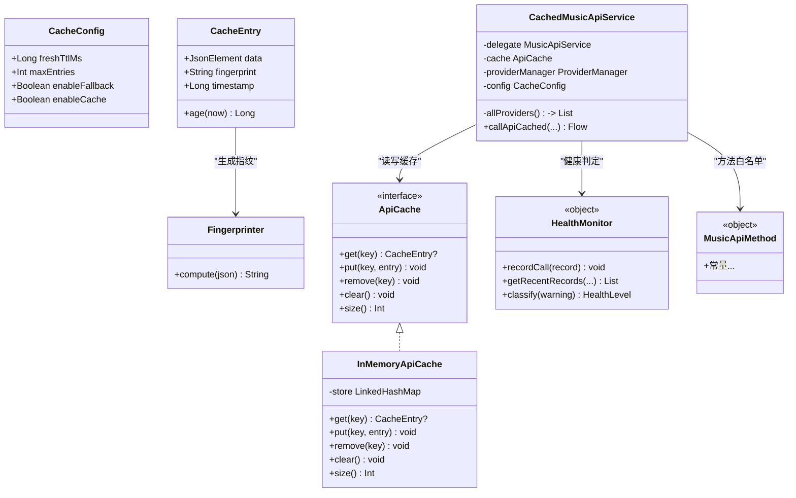

# 缓存配置管理

<cite>
**本文引用的文件**
- [CacheConfig.kt](file://kmp-pro/src/commonMain/kotlin/cp/player/kmp/cache/CacheConfig.kt)
- [CacheResult.kt](file://kmp-pro/src/commonMain/kotlin/cp/player/kmp/cache/CacheResult.kt)
- [CachedMusicApiService.kt](file://kmp-pro/src/commonMain/kotlin/cp/player/kmp/cache/CachedMusicApiService.kt)
- [ApiCache.kt](file://kmp-pro/src/commonMain/kotlin/cp/player/kmp/cache/ApiCache.kt)
- [CacheEntry.kt](file://kmp-pro/src/commonMain/kotlin/cp/player/kmp/cache/CacheEntry.kt)
- [Fingerprinter.kt](file://kmp-pro/src/commonMain/kotlin/cp/player/kmp/cache/Fingerprinter.kt)
- [HealthMonitor.kt](file://kmp-pro/src/commonMain/kotlin/cp/player/kmp/monitor/HealthMonitor.kt)
- [MusicApiMethod.kt](file://kmp-pro/src/commonMain/kotlin/cp/player/kmp/api/MusicApiMethod.kt)
</cite>

## 目录
1. [简介](#简介)
2. [项目结构](#项目结构)
3. [核心组件](#核心组件)
4. [架构总览](#架构总览)
5. [详细组件分析](#详细组件分析)
6. [依赖关系分析](#依赖关系分析)
7. [性能考量](#性能考量)
8. [故障排查指南](#故障排查指南)
9. [结论](#结论)
10. [附录](#附录)

## 简介
本文件面向“缓存配置管理”，围绕 CacheConfig、CacheResult、Source、缓存读写与回退策略，系统阐述参数含义、影响范围、热更新能力、推荐配置与调优建议，并给出错误处理与验证机制的落地方式。目标是帮助读者在不深入源码的情况下也能正确配置与排障。

## 项目结构
缓存相关代码集中在 kmp-pro 模块的 cache 包中，配合 monitor 健康监控与 api 方法常量，形成“先返回缓存 → 后台拉取 → 指纹比对 → 容灾回退”的完整链路。

图表来源
- [CacheConfig.kt:1-16](file://kmp-pro/src/commonMain/kotlin/cp/player/kmp/cache/CacheConfig.kt#L1-L16)
- [ApiCache.kt:1-67](file://kmp-pro/src/commonMain/kotlin/cp/player/kmp/cache/ApiCache.kt#L1-L67)
- [CacheEntry.kt:1-22](file://kmp-pro/src/commonMain/kotlin/cp/player/kmp/cache/CacheEntry.kt#L1-L22)
- [Fingerprinter.kt:1-93](file://kmp-pro/src/commonMain/kotlin/cp/player/kmp/cache/Fingerprinter.kt#L1-L93)
- [CachedMusicApiService.kt:1-219](file://kmp-pro/src/commonMain/kotlin/cp/player/kmp/cache/CachedMusicApiService.kt#L1-L219)
- [HealthMonitor.kt:1-290](file://kmp-pro/src/commonMain/kotlin/cp/player/kmp/monitor/HealthMonitor.kt#L1-L290)
- [MusicApiMethod.kt:1-458](file://kmp-pro/src/commonMain/kotlin/cp/player/kmp/api/MusicApiMethod.kt#L1-L458)

章节来源
- [CacheConfig.kt:1-16](file://kmp-pro/src/commonMain/kotlin/cp/player/kmp/cache/CacheConfig.kt#L1-L16)
- [ApiCache.kt:1-67](file://kmp-pro/src/commonMain/kotlin/cp/player/kmp/cache/ApiCache.kt#L1-L67)
- [CacheEntry.kt:1-22](file://kmp-pro/src/commonMain/kotlin/cp/player/kmp/cache/CacheEntry.kt#L1-L22)
- [Fingerprinter.kt:1-93](file://kmp-pro/src/commonMain/kotlin/cp/player/kmp/cache/Fingerprinter.kt#L1-L93)
- [CachedMusicApiService.kt:1-219](file://kmp-pro/src/commonMain/kotlin/cp/player/kmp/cache/CachedMusicApiService.kt#L1-L219)
- [HealthMonitor.kt:1-290](file://kmp-pro/src/commonMain/kotlin/cp/player/kmp/monitor/HealthMonitor.kt#L1-L290)
- [MusicApiMethod.kt:1-458](file://kmp-pro/src/commonMain/kotlin/cp/player/kmp/api/MusicApiMethod.kt#L1-L458)

## 核心组件
- CacheConfig：定义缓存开关、新鲜度阈值、最大条目数与容灾开关，是运行时可调的核心配置。
- CacheResult + Source：统一描述数据来源与状态（来自缓存、网络、回退或无变更），供上层消费。
- CachedMusicApiService：串联缓存读取、后台拉取、指纹比对、健康监控与多 Provider 容灾。
- ApiCache + InMemoryApiCache：提供进程内 LRU 缓存抽象与默认实现。
- CacheEntry + Fingerprinter：以“数据+指纹+时间戳”形式存储，并用轻量指纹进行差异判断。
- HealthMonitor：对响应进行三级分类（OK/WARNING/ERROR），驱动回退与告警。

章节来源
- [CacheConfig.kt:1-16](file://kmp-pro/src/commonMain/kotlin/cp/player/kmp/cache/CacheConfig.kt#L1-L16)
- [CacheResult.kt:1-44](file://kmp-pro/src/commonMain/kotlin/cp/player/kmp/cache/CacheResult.kt#L1-L44)
- [CachedMusicApiService.kt:1-219](file://kmp-pro/src/commonMain/kotlin/cp/player/kmp/cache/CachedMusicApiService.kt#L1-L219)
- [ApiCache.kt:1-67](file://kmp-pro/src/commonMain/kotlin/cp/player/kmp/cache/ApiCache.kt#L1-L67)
- [CacheEntry.kt:1-22](file://kmp-pro/src/commonMain/kotlin/cp/player/kmp/cache/CacheEntry.kt#L1-L22)
- [Fingerprinter.kt:1-93](file://kmp-pro/src/commonMain/kotlin/cp/player/kmp/cache/Fingerprinter.kt#L1-L93)
- [HealthMonitor.kt:1-290](file://kmp-pro/src/commonMain/kotlin/cp/player/kmp/monitor/HealthMonitor.kt#L1-L290)

## 架构总览
下图展示一次 API 调用在缓存层的完整流程：先返回缓存（若存在），再后台拉取并进行指纹比对；根据健康监控结果决定是否触发多 Provider 容灾；最终将新数据写回缓存（仅对幂等读类接口）。

图表来源
- [CachedMusicApiService.kt:46-219](file://kmp-pro/src/commonMain/kotlin/cp/player/kmp/cache/CachedMusicApiService.kt#L46-L219)
- [ApiCache.kt:11-67](file://kmp-pro/src/commonMain/kotlin/cp/player/kmp/cache/ApiCache.kt#L11-L67)
- [HealthMonitor.kt:25-290](file://kmp-pro/src/commonMain/kotlin/cp/player/kmp/monitor/HealthMonitor.kt#L25-L290)

## 详细组件分析

### CacheConfig 配置项说明
- enableCache：总开关。为 false 时所有请求直通底层，不读/不写缓存，适合调试或临时禁用缓存。
- freshTtlMs：新鲜度阈值。超过该时间的缓存视为“陈旧”，但仍会优先返回，同时标记 isStale=true，以便上层决定是否需要刷新。
- maxEntries：内存缓存最大条目数。达到上限后按 LRU 淘汰最久未使用的条目。
- enableFallback：容灾开关。当响应被判定为 ERROR 时，尝试通过其他 Provider 获取数据作为降级。

影响范围
- enableCache 控制整体路径，直接影响首屏速度与后端压力。
- freshTtlMs 影响“先返回缓存”的用户体验与数据新鲜度平衡。
- maxEntries 影响内存占用与命中率，过大增加 GC 压力，过小降低命中率。
- enableFallback 影响异常场景下的可用性，但会增加额外网络开销。

章节来源
- [CacheConfig.kt:1-16](file://kmp-pro/src/commonMain/kotlin/cp/player/kmp/cache/CacheConfig.kt#L1-L16)
- [CachedMusicApiService.kt:60-88](file://kmp-pro/src/commonMain/kotlin/cp/player/kmp/cache/CachedMusicApiService.kt#L60-L88)
- [ApiCache.kt:20-49](file://kmp-pro/src/commonMain/kotlin/cp/player/kmp/cache/ApiCache.kt#L20-L49)

### CacheResult 与 Source 枚举
- CacheResult.Cached：来自缓存，携带 ageMs、isStale、source=CACHE、健康等级与警告列表。用于立即渲染与提示“可能陈旧”。
- CacheResult.Fresh：来自网络的最新数据，携带 source=NETWORK 或 FALLBACK，以及健康等级与警告。用于替换 UI 数据。
- CacheResult.Error：请求失败，可附带 fallback（旧缓存）作为兜底，source 通常为 NETWORK。
- CacheResult.NoChange：后台比对发现与缓存一致，无需替换，可作为优化信号忽略。

Source 取值
- CACHE：数据来源于本地缓存。
- NETWORK：数据来源于当前 Provider 的网络请求。
- FALLBACK：数据来源于其他 Provider 的回退响应。

使用建议
- 先显示 Cached，再根据后续 Fresh/NoChange/Error 做增量更新。
- 对 Error 场景，优先使用 fallback 保证基本可用。
- 对 NoChange 可直接跳过 UI 更新，减少重绘。

章节来源
- [CacheResult.kt:1-44](file://kmp-pro/src/commonMain/kotlin/cp/player/kmp/cache/CacheResult.kt#L1-L44)
- [CachedMusicApiService.kt:74-139](file://kmp-pro/src/commonMain/kotlin/cp/player/kmp/cache/CachedMusicApiService.kt#L74-L139)

### 缓存键与指纹机制
- 缓存键：providerId#method#sortedParams#cookieHash，确保同一 Provider、方法、参数与登录态组合唯一。
- 指纹：基于 code、顶层数组长度集合、主数据数组 id 列表、版本位等生成轻量签名，用于后台比对是否变化。
- 写入时机：仅在幂等读类接口且非 ERROR 时写回缓存，避免污染写操作。

章节来源
- [ApiCache.kt:51-67](file://kmp-pro/src/commonMain/kotlin/cp/player/kmp/cache/ApiCache.kt#L51-L67)
- [CacheEntry.kt:1-22](file://kmp-pro/src/commonMain/kotlin/cp/player/kmp/cache/CacheEntry.kt#L1-L22)
- [Fingerprinter.kt:10-93](file://kmp-pro/src/commonMain/kotlin/cp/player/kmp/cache/Fingerprinter.kt#L10-L93)
- [CachedMusicApiService.kt:118-132](file://kmp-pro/src/commonMain/kotlin/cp/player/kmp/cache/CachedMusicApiService.kt#L118-L132)
- [MusicApiMethod.kt:1-458](file://kmp-pro/src/commonMain/kotlin/cp/player/kmp/api/MusicApiMethod.kt#L1-L458)

### 健康监控与回退策略
- 健康等级：OK/WARNING/ERROR，由响应码与警告综合判定。
- WARNING：仍可返回数据，附带 warnings 供上层提示。
- ERROR：触发多 Provider 容灾（若 enableFallback=true），否则返回 Error 并附带 fallback。
- 回退过程：遍历其他 Provider，解析 JSON 并检查业务码，首个成功即返回，记录 wasFallback 与来源。

章节来源
- [HealthMonitor.kt:25-56](file://kmp-pro/src/commonMain/kotlin/cp/player/kmp/monitor/HealthMonitor.kt#L25-L56)
- [CachedMusicApiService.kt:90-180](file://kmp-pro/src/commonMain/kotlin/cp/player/kmp/cache/CachedMusicApiService.kt#L90-L180)

### 配置的热更新与运行时调整
- 运行时调整：CacheConfig 为 data class，可在应用启动后随时替换实例，CachedMusicApiService 会依据新配置生效（如切换 enableCache、freshTtlMs、enableFallback）。
- 行为即时性：
  - enableCache=false：立即停止读写缓存。
  - freshTtlMs 增大：延长“先返回缓存”的时间窗口，提升首屏速度但降低新鲜度。
  - maxEntries 调整：影响内存占用与命中率，需结合设备内存与访问模式评估。
  - enableFallback 切换：影响异常场景下的回退行为。
- 持久化建议：可将配置持久化到 SettingsStorage（平台实现），并在设置页动态更新。

章节来源
- [CacheConfig.kt:1-16](file://kmp-pro/src/commonMain/kotlin/cp/player/kmp/cache/CacheConfig.kt#L1-L16)
- [CachedMusicApiService.kt:46-88](file://kmp-pro/src/commonMain/kotlin/cp/player/kmp/cache/CachedMusicApiService.kt#L46-L88)

### 不同场景的推荐配置与调优
- 弱网/首屏优先：
  - enableCache=true，freshTtlMs 适当增大（例如 5-10 分钟），maxEntries 适中（如 64-128），enableFallback=true。
  - 目的：更快首屏，容忍短暂陈旧，异常时自动回退。
- 强网/低延迟：
  - enableCache=true，freshTtlMs 较小（如 1-3 分钟），maxEntries 适中，enableFallback=true。
  - 目的：更频繁拉取最新数据，保持高新鲜度。
- 离线/容灾优先：
  - enableCache=true，freshTtlMs 较大，maxEntries 较大，enableFallback=true。
  - 目的：最大化本地可用性与回退成功率。
- 调试/禁用缓存：
  - enableCache=false，enableFallback 可保留以观察网络情况。
  - 目的：排除缓存干扰，定位问题。
- 性能调优要点：
  - 合理设置 maxEntries，避免过高导致 GC 抖动。
  - 关注 fingerprint 计算成本，通常极低；大数据集下仍应保持轻量。
  - 结合 HealthMonitor 统计，观察 WARNING/ERROR 比例与 p95 延迟，动态调整 freshTtlMs 与回退策略。

章节来源
- [ApiCache.kt:20-49](file://kmp-pro/src/commonMain/kotlin/cp/player/kmp/cache/ApiCache.kt#L20-L49)
- [HealthMonitor.kt:147-216](file://kmp-pro/src/commonMain/kotlin/cp/player/kmp/monitor/HealthMonitor.kt#L147-L216)
- [CachedMusicApiService.kt:205-219](file://kmp-pro/src/commonMain/kotlin/cp/player/kmp/cache/CachedMusicApiService.kt#L205-L219)

## 依赖关系分析
缓存层依赖关系如下：
- CachedMusicApiService 依赖 ApiCache、HealthMonitor、MusicApiMethod 与 ProviderManager。
- ApiCache 默认实现 InMemoryApiCache 提供进程内 LRU。
- CacheEntry 依赖 Fingerprinter 生成指纹。
- HealthMonitor 提供三级健康等级与统计查询，驱动回退与告警。

图表来源
- [CacheConfig.kt:1-16](file://kmp-pro/src/commonMain/kotlin/cp/player/kmp/cache/CacheConfig.kt#L1-L16)
- [ApiCache.kt:11-49](file://kmp-pro/src/commonMain/kotlin/cp/player/kmp/cache/ApiCache.kt#L11-L49)
- [CacheEntry.kt:1-22](file://kmp-pro/src/commonMain/kotlin/cp/player/kmp/cache/CacheEntry.kt#L1-L22)
- [Fingerprinter.kt:10-93](file://kmp-pro/src/commonMain/kotlin/cp/player/kmp/cache/Fingerprinter.kt#L10-L93)
- [CachedMusicApiService.kt:46-219](file://kmp-pro/src/commonMain/kotlin/cp/player/kmp/cache/CachedMusicApiService.kt#L46-L219)
- [HealthMonitor.kt:25-290](file://kmp-pro/src/commonMain/kotlin/cp/player/kmp/monitor/HealthMonitor.kt#L25-L290)
- [MusicApiMethod.kt:1-458](file://kmp-pro/src/commonMain/kotlin/cp/player/kmp/api/MusicApiMethod.kt#L1-L458)

章节来源
- [CachedMusicApiService.kt:46-219](file://kmp-pro/src/commonMain/kotlin/cp/player/kmp/cache/CachedMusicApiService.kt#L46-L219)
- [ApiCache.kt:11-49](file://kmp-pro/src/commonMain/kotlin/cp/player/kmp/cache/ApiCache.kt#L11-L49)
- [HealthMonitor.kt:25-290](file://kmp-pro/src/commonMain/kotlin/cp/player/kmp/monitor/HealthMonitor.kt#L25-L290)

## 性能考量
- 首屏速度：利用 Cached 快速返回，减少等待；通过 freshTtlMs 平衡新鲜度与速度。
- 内存占用：maxEntries 控制 LRU 容量，过大增加 GC 压力，过小降低命中率。
- 网络开销：enableFallback 会在 ERROR 时触发额外请求，需权衡可用性需求。
- 指纹计算：轻量级，对大数据集友好；避免复杂字段参与指纹，保持稳定性。
- 监控指标：通过 HealthMonitor 统计成功率、WARNING/ERROR 比例、p95 延迟，指导调参。

[本节为通用性能讨论，不直接分析具体文件]

## 故障排查指南
- 现象：始终返回 Cached 且不刷新
  - 检查 freshTtlMs 是否过大；确认后台拉取是否执行；查看 HealthMonitor 是否有 WARNING/ERROR。
- 现象：频繁 Error 且无回退
  - 确认 enableFallback 是否为 true；检查其他 Provider 是否可用；查看 HealthMonitor 的 lastError 与 responseWarnings。
- 现象：缓存命中率低
  - 检查缓存键生成是否正确（providerId/method/params/cookie）；确认方法是否在幂等读白名单内。
- 现象：UI 重复更新
  - 关注 NoChange 信号，避免不必要的刷新；检查指纹是否稳定。

章节来源
- [HealthMonitor.kt:147-216](file://kmp-pro/src/commonMain/kotlin/cp/player/kmp/monitor/HealthMonitor.kt#L147-L216)
- [CachedMusicApiService.kt:118-180](file://kmp-pro/src/commonMain/kotlin/cp/player/kmp/cache/CachedMusicApiService.kt#L118-L180)
- [ApiCache.kt:51-67](file://kmp-pro/src/commonMain/kotlin/cp/player/kmp/cache/ApiCache.kt#L51-L67)

## 结论
通过 CacheConfig 精细控制缓存行为，结合 CacheResult/Source 明确数据来源与健康状态，辅以指纹比对与多 Provider 容灾，可实现高性能、高可用的数据加载体验。建议结合 HealthMonitor 持续观测与调优，针对不同场景选择合适配置，并在运行期灵活调整以应对变化。

[本节为总结性内容，不直接分析具体文件]

## 附录
- 幂等读接口白名单：见 MusicApiMethod 中的方法名，仅这些接口会被缓存。
- 健康等级判定：基于响应码与警告类型，ERROR 触发回退，WARNING 附带告警。
- 缓存键规则：providerId#method#sortedParams#cookieHash，确保唯一性。
- 指纹组成：code、顶层数组长度、主数据 id 列表、版本位，保证稳定且轻量。

章节来源
- [MusicApiMethod.kt:1-458](file://kmp-pro/src/commonMain/kotlin/cp/player/kmp/api/MusicApiMethod.kt#L1-L458)
- [HealthMonitor.kt:25-56](file://kmp-pro/src/commonMain/kotlin/cp/player/kmp/monitor/HealthMonitor.kt#L25-L56)
- [ApiCache.kt:51-67](file://kmp-pro/src/commonMain/kotlin/cp/player/kmp/cache/ApiCache.kt#L51-L67)
- [Fingerprinter.kt:10-93](file://kmp-pro/src/commonMain/kotlin/cp/player/kmp/cache/Fingerprinter.kt#L10-L93)