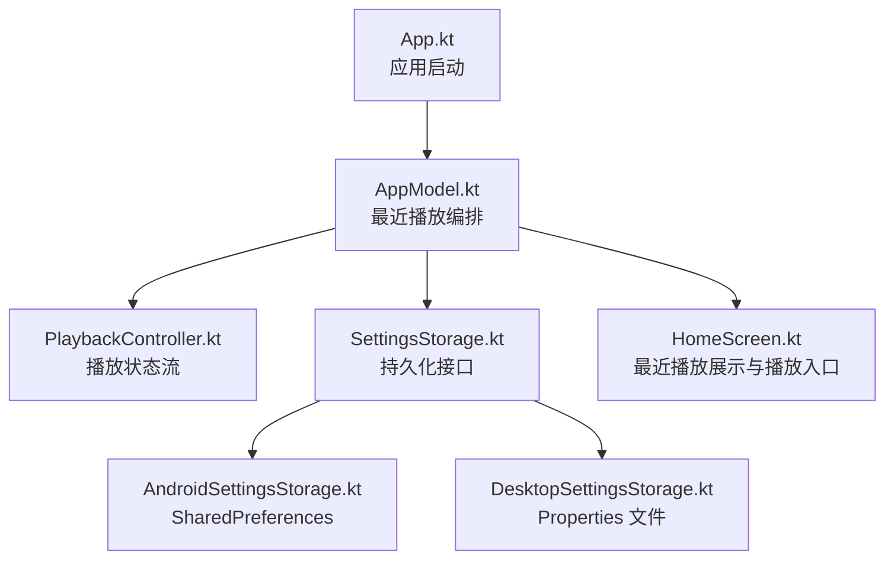
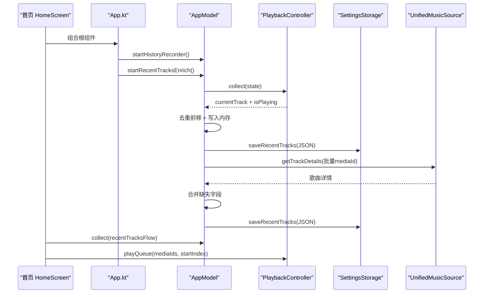
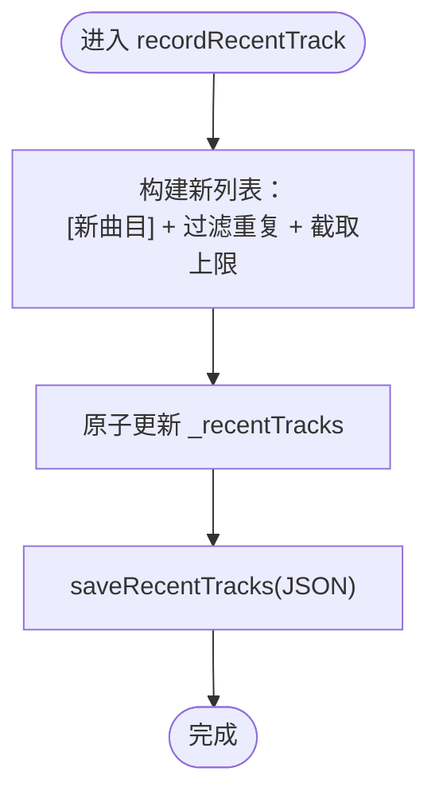
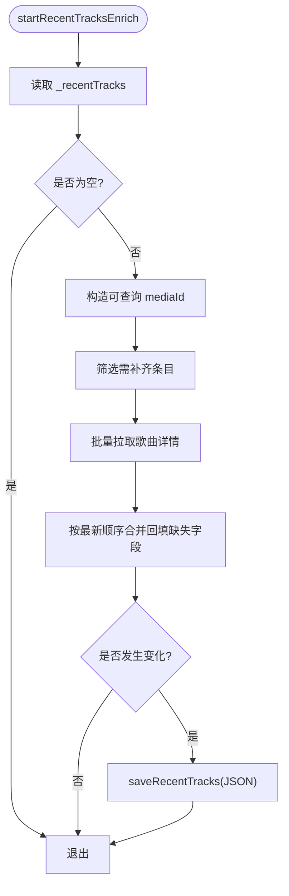
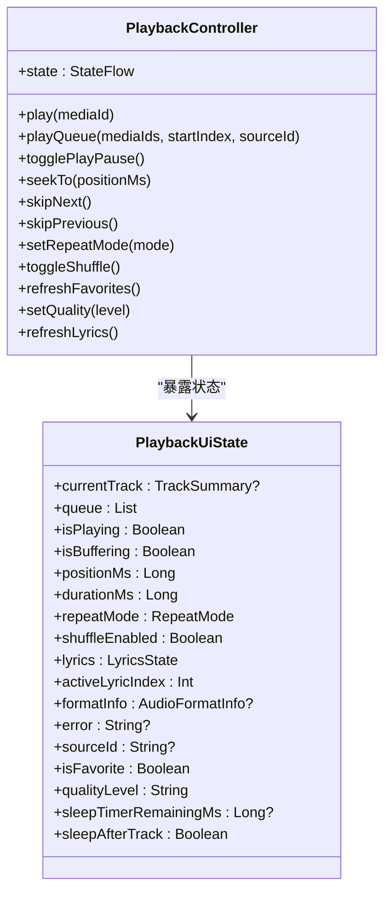
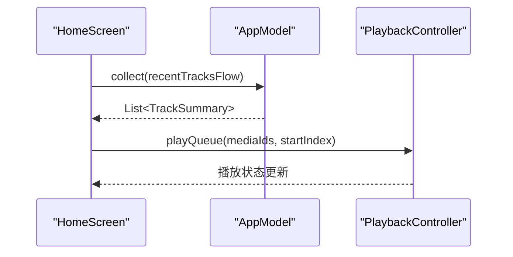
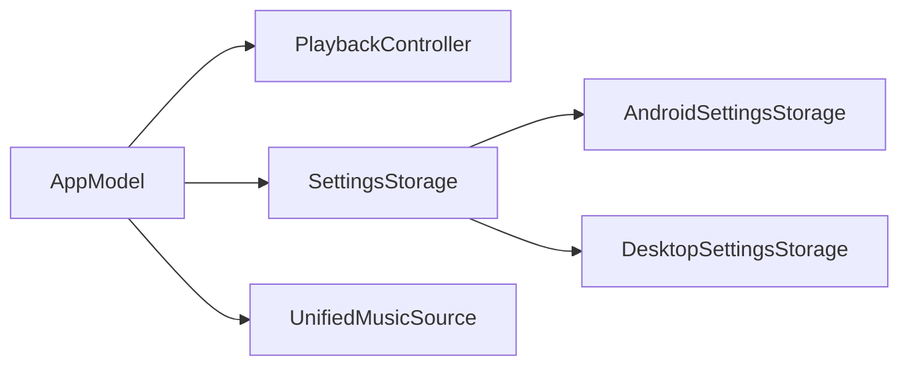

# 最近播放记录增强

<cite>
**本文引用的文件**
- [AppModel.kt](file://app/src/commonMain/kotlin/cp/player/app/AppModel.kt)
- [App.kt](file://app/src/commonMain/kotlin/cp/player/app/App.kt)
- [HomeScreen.kt](file://app/src/commonMain/kotlin/cp/player/app/ui/screen/HomeScreen.kt)
- [PlaybackController.kt](file://kmp-pro/src/commonMain/kotlin/cp/player/kmp/playback/PlaybackController.kt)
- [PlaybackUiState.kt](file://kmp-pro/src/commonMain/kotlin/cp/player/kmp/playback/PlaybackUiState.kt)
- [SettingsStorage.kt](file://kmp-pro/src/commonMain/kotlin/cp/player/kmp/util/SettingsStorage.kt)
- [AndroidSettingsStorage.kt](file://kmp-pro/src/androidMain/kotlin/cp/player/kmp/util/AndroidSettingsStorage.kt)
- [DesktopSettingsStorage.kt](file://kmp-pro/src/desktopMain/kotlin/cp/player/kmp/util/DesktopSettingsStorage.kt)
</cite>

## 目录
1. [简介](#简介)
2. [项目结构](#项目结构)
3. [核心组件](#核心组件)
4. [架构总览](#架构总览)
5. [详细组件分析](#详细组件分析)
6. [依赖关系分析](#依赖关系分析)
7. [性能考量](#性能考量)
8. [故障排查指南](#故障排查指南)
9. [结论](#结论)
10. [附录](#附录)

## 简介
本文件聚焦“最近播放记录增强”功能，围绕应用启动时的历史记录采集、本地持久化、历史数据补齐（封面/专辑/时长等字段回填）以及首页展示与播放入口进行系统化说明。该能力由应用层 AppModel 统一编排，通过监听播放控制器状态变化实现去重前移与持久化，并通过统一媒体源批量拉取详情以修复历史条目缺失字段，最终在首页提供“最近播放”列表与一键播放。

## 项目结构
- 应用层（app）：负责 UI 与业务编排，包含 App 根入口、AppModel（最近播放逻辑）、HomeScreen（最近播放展示）。
- 播放层（kmp-pro）：暴露 PlaybackController 接口与 PlaybackUiState 状态，屏蔽平台差异，供上层消费。
- 存储层（kmp-pro/util）：跨平台 SettingsStorage 抽象及 Android/Desktop 具体实现，用于最近播放记录的 JSON 持久化。

图表来源
- [App.kt:31-43](file://app/src/commonMain/kotlin/cp/player/app/App.kt#L31-L43)
- [AppModel.kt:277-415](file://app/src/commonMain/kotlin/cp/player/app/AppModel.kt#L277-L415)
- [PlaybackController.kt:16-18](file://kmp-pro/src/commonMain/kotlin/cp/player/kmp/playback/PlaybackController.kt#L16-L18)
- [SettingsStorage.kt:12-19](file://kmp-pro/src/commonMain/kotlin/cp/player/kmp/util/SettingsStorage.kt#L12-L19)
- [AndroidSettingsStorage.kt:9-22](file://kmp-pro/src/androidMain/kotlin/cp/player/kmp/util/AndroidSettingsStorage.kt#L9-L22)
- [DesktopSettingsStorage.kt:12-44](file://kmp-pro/src/desktopMain/kotlin/cp/player/kmp/util/DesktopSettingsStorage.kt#L12-L44)

章节来源
- [App.kt:31-43](file://app/src/commonMain/kotlin/cp/player/app/App.kt#L31-L43)
- [AppModel.kt:277-415](file://app/src/commonMain/kotlin/cp/player/app/AppModel.kt#L277-L415)
- [HomeScreen.kt:174-211](file://app/src/commonMain/kotlin/cp/player/app/ui/screen/HomeScreen.kt#L174-L211)

## 核心组件
- 最近播放编排器（AppModel）：维护最近播放列表 StateFlow，监听播放状态变更，执行去重前移与持久化；提供历史数据补齐能力。
- 播放控制器（PlaybackController）：对外暴露播放状态流 state，UI 仅消费该状态，不感知底层实现。
- 播放界面状态（PlaybackUiState）：描述当前曲目、队列、播放进度、歌词等渲染所需的全部信息。
- 设置存储（SettingsStorage）：跨平台键值存储，最近播放记录以 JSON 数组形式持久化。

章节来源
- [AppModel.kt:277-415](file://app/src/commonMain/kotlin/cp/player/app/AppModel.kt#L277-L415)
- [PlaybackController.kt:16-18](file://kmp-pro/src/commonMain/kotlin/cp/player/kmp/playback/PlaybackController.kt#L16-L18)
- [PlaybackUiState.kt:12-35](file://kmp-pro/src/commonMain/kotlin/cp/player/kmp/playback/PlaybackUiState.kt#L12-L35)
- [SettingsStorage.kt:12-19](file://kmp-pro/src/commonMain/kotlin/cp/player/kmp/util/SettingsStorage.kt#L12-L19)

## 架构总览
最近播放增强由“采集—存储—补齐—展示—播放”五步闭环构成：
- 采集：应用启动后启动历史记录监听，当播放状态为“正在播放”且曲目切换时，将新曲目插入列表头部并去重。
- 存储：使用 SettingsStorage 将最近播放序列化为 JSON 字符串持久化，限制最大条数。
- 补齐：对缺失封面/专辑/时长等字段的旧条目，按当前 Provider 构造 mediaId 批量拉取歌曲详情，合并回写并持久化。
- 展示：首页收集 recentTracksFlow 渲染“最近播放”区块，并提供“播放”按钮与单条点击播放。
- 播放：将最近播放的 id 转换为 mediaId 后调用 playback.playQueue 开始播放。

图表来源
- [App.kt:37-43](file://app/src/commonMain/kotlin/cp/player/app/App.kt#L37-L43)
- [AppModel.kt:287-312](file://app/src/commonMain/kotlin/cp/player/app/AppModel.kt#L287-L312)
- [AppModel.kt:314-354](file://app/src/commonMain/kotlin/cp/player/app/AppModel.kt#L314-L354)
- [AppModel.kt:364-415](file://app/src/commonMain/kotlin/cp/player/app/AppModel.kt#L364-L415)
- [HomeScreen.kt:174-211](file://app/src/commonMain/kotlin/cp/player/app/ui/screen/HomeScreen.kt#L174-L211)
- [PlaybackController.kt:16-18](file://kmp-pro/src/commonMain/kotlin/cp/player/kmp/playback/PlaybackController.kt#L16-L18)

## 详细组件分析

### 最近播放采集与持久化（AppModel）
- 启动幂等：startHistoryRecorder 保证只启动一次监听。
- 触发条件：currentTrack 非空、isPlaying 为真、track.id 与上次记录不同。
- 去重前移：将新曲目置于首位，过滤重复 id，截取固定上限（RECENT_LIMIT）。
- 持久化：将 TrackSummary 关键字段序列化到 JSON 数组，通过 SettingsStorage.putString 保存。
- 加载：应用启动时从 SettingsStorage 读取并反序列化为 TrackSummary 列表，作为初始状态。

图表来源
- [AppModel.kt:303-330](file://app/src/commonMain/kotlin/cp/player/app/AppModel.kt#L303-L330)

章节来源
- [AppModel.kt:287-330](file://app/src/commonMain/kotlin/cp/player/app/AppModel.kt#L287-L330)

### 历史数据补齐（AppModel.startRecentTracksEnrich）
- 目的：修复历史条目缺失封面、专辑、时长等字段。
- 流程：
  - 获取当前最近播放列表，若为空则结束。
  - 根据当前 activeProviderId 将裸 id 或完整 mediaId 统一为可查询的 mediaId。
  - 筛选需要补齐的条目（缺少封面且非 local://）。
  - 通过 backend.unifiedSource.getTrackDetails 批量拉取详情。
  - 建立 mediaId 与裸 id 的双索引，按最新列表顺序合并，仅回填缺失字段。
  - 若发生改动，重新持久化。

图表来源
- [AppModel.kt:364-415](file://app/src/commonMain/kotlin/cp/player/app/AppModel.kt#L364-L415)

章节来源
- [AppModel.kt:364-415](file://app/src/commonMain/kotlin/cp/player/app/AppModel.kt#L364-L415)

### 播放控制器与状态流（PlaybackController / PlaybackUiState）
- 播放控制器对外暴露 state: StateFlow<PlaybackUiState>，UI 仅消费该状态。
- 播放状态包含当前曲目、队列、播放/缓冲/错误、进度、歌词、音质等级等信息。
- 最近播放采集通过 collect(state) 获取 currentTrack 与 isPlaying，确保仅在真正播放时记录。

图表来源
- [PlaybackController.kt:16-106](file://kmp-pro/src/commonMain/kotlin/cp/player/kmp/playback/PlaybackController.kt#L16-L106)
- [PlaybackUiState.kt:12-35](file://kmp-pro/src/commonMain/kotlin/cp/player/kmp/playback/PlaybackUiState.kt#L12-L35)

章节来源
- [PlaybackController.kt:16-106](file://kmp-pro/src/commonMain/kotlin/cp/player/kmp/playback/PlaybackController.kt#L16-L106)
- [PlaybackUiState.kt:12-35](file://kmp-pro/src/commonMain/kotlin/cp/player/kmp/playback/PlaybackUiState.kt#L12-L35)

### 首页展示与播放入口（HomeScreen）
- 收集 AppModel.recentTracksFlow 渲染“最近播放”区块。
- 提供“播放”按钮：将最近播放列表的 id 转为 mediaId 后调用 playback.playQueue(startIndex=0)。
- 支持点击单条：传入对应 index 作为 startIndex，从指定曲目开始播放。

图表来源
- [HomeScreen.kt:174-211](file://app/src/commonMain/kotlin/cp/player/app/ui/screen/HomeScreen.kt#L174-L211)
- [AppModel.kt:283](file://app/src/commonMain/kotlin/cp/player/app/AppModel.kt#L283)
- [PlaybackController.kt:22-31](file://kmp-pro/src/commonMain/kotlin/cp/player/kmp/playback/PlaybackController.kt#L22-L31)

章节来源
- [HomeScreen.kt:174-211](file://app/src/commonMain/kotlin/cp/player/app/ui/screen/HomeScreen.kt#L174-L211)

### 应用启动编排（App）
- 应用根组合时执行：同步播放音质、刷新用户资料、启动历史记录采集、启动最近播放数据补齐。
- 这些操作均为幂等设计，避免重复启动。

章节来源
- [App.kt:37-43](file://app/src/commonMain/kotlin/cp/player/app/App.kt#L37-L43)

## 依赖关系分析
- AppModel 依赖：
  - PlaybackController.state 用于采集播放事件。
  - SettingsStorage 用于最近播放记录的读写。
  - MusicBackend.unifiedSource 用于批量拉取歌曲详情以补齐字段。
- 平台差异：
  - Android 使用 SharedPreferences 持久化。
  - Desktop 使用 Properties 文件持久化。
- 耦合与内聚：
  - AppModel 集中处理最近播放的业务逻辑，内聚度高。
  - 通过 PlaybackController 与 SettingsStorage 抽象降低耦合。

图表来源
- [AppModel.kt:277-415](file://app/src/commonMain/kotlin/cp/player/app/AppModel.kt#L277-L415)
- [SettingsStorage.kt:12-19](file://kmp-pro/src/commonMain/kotlin/cp/player/kmp/util/SettingsStorage.kt#L12-L19)
- [AndroidSettingsStorage.kt:9-22](file://kmp-pro/src/androidMain/kotlin/cp/player/kmp/util/AndroidSettingsStorage.kt#L9-L22)
- [DesktopSettingsStorage.kt:12-44](file://kmp-pro/src/desktopMain/kotlin/cp/player/kmp/util/DesktopSettingsStorage.kt#L12-L44)

章节来源
- [AppModel.kt:277-415](file://app/src/commonMain/kotlin/cp/player/app/AppModel.kt#L277-L415)
- [SettingsStorage.kt:12-19](file://kmp-pro/src/commonMain/kotlin/cp/player/kmp/util/SettingsStorage.kt#L12-L19)

## 性能考量
- 采集频率控制：仅在 isPlaying 且 track.id 变化时记录，避免频繁写入。
- 列表去重与截断：每次更新先过滤重复并截取上限，减少后续补齐与渲染压力。
- 批量补齐：通过 unifiedSource.getTrackDetails 批量拉取详情，减少网络往返。
- 原子更新：使用 update 进行 CAS 更新，避免与补齐回写的读改写窗口互覆。
- 存储优化：JSON 字符串一次性写入，减少多次 I/O。

## 故障排查指南
- 最近播放无更新：
  - 检查是否在应用启动时调用了 startHistoryRecorder。
  - 确认 playback.state 中 currentTrack 与 isPlaying 是否符合预期。
- 历史数据未补齐：
  - 检查 startRecentTracksEnrich 是否被调用。
  - 确认 activeProviderId 是否正确，mediaId 格式是否合法。
  - 查看 unifiedSource.getTrackDetails 返回是否为空。
- 持久化失败：
  - 检查 SettingsStorage 实现是否正常初始化（Android 需注入 Context）。
  - 查看 JSON 解析与序列化过程是否抛出异常。
- 首页无法播放：
  - 确认 recentTracksFlow 是否有数据。
  - 检查 toMediaId 转换逻辑与 playback.playQueue 调用。

章节来源
- [AppModel.kt:287-415](file://app/src/commonMain/kotlin/cp/player/app/AppModel.kt#L287-L415)
- [AndroidSettingsStorage.kt:28-35](file://kmp-pro/src/androidMain/kotlin/cp/player/kmp/util/AndroidSettingsStorage.kt#L28-L35)
- [DesktopSettingsStorage.kt:18-44](file://kmp-pro/src/desktopMain/kotlin/cp/player/kmp/util/DesktopSettingsStorage.kt#L18-L44)
- [HomeScreen.kt:174-211](file://app/src/commonMain/kotlin/cp/player/app/ui/screen/HomeScreen.kt#L174-L211)

## 结论
最近播放记录增强通过“采集—存储—补齐—展示—播放”的闭环设计，实现了稳定、可扩展的最近播放能力。其关键优势包括：
- 幂等启动与原子更新，保障并发安全。
- 批量补齐提升数据完整性与用户体验。
- 跨平台存储抽象，便于多端复用。
- UI 与播放控制解耦，便于扩展与维护。

## 附录
- 最近播放数据结构（持久化 JSON 字段）：
  - id：资源标识（可为裸 id 或完整 mediaId）
  - name：曲目标题
  - artist：艺术家
  - album：专辑（可选）
  - coverUrl：封面地址（可选）
  - durationMs：时长毫秒（可选）
- 相关配置：
  - RECENT_LIMIT：最近播放最大条目数
  - KEY_RECENT_TRACKS：持久化 key