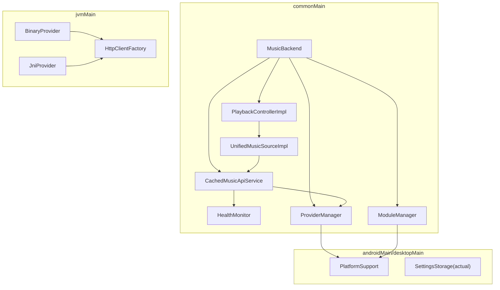
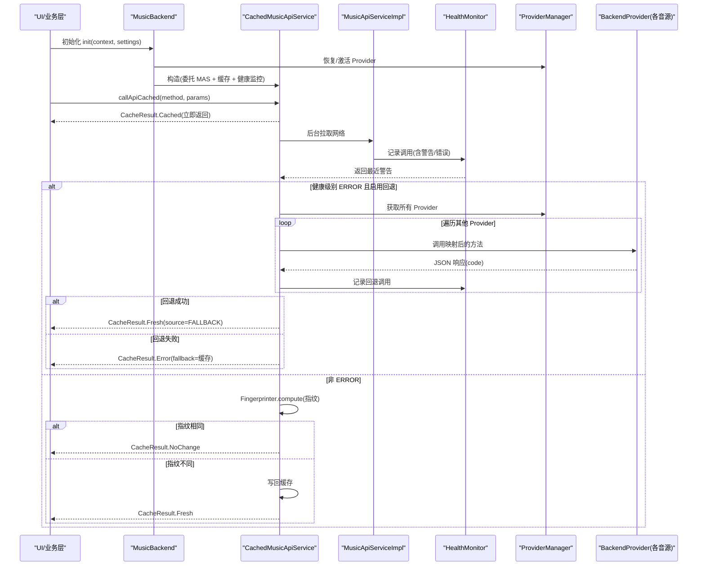
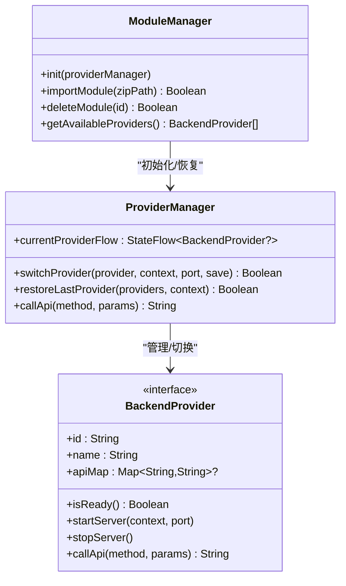
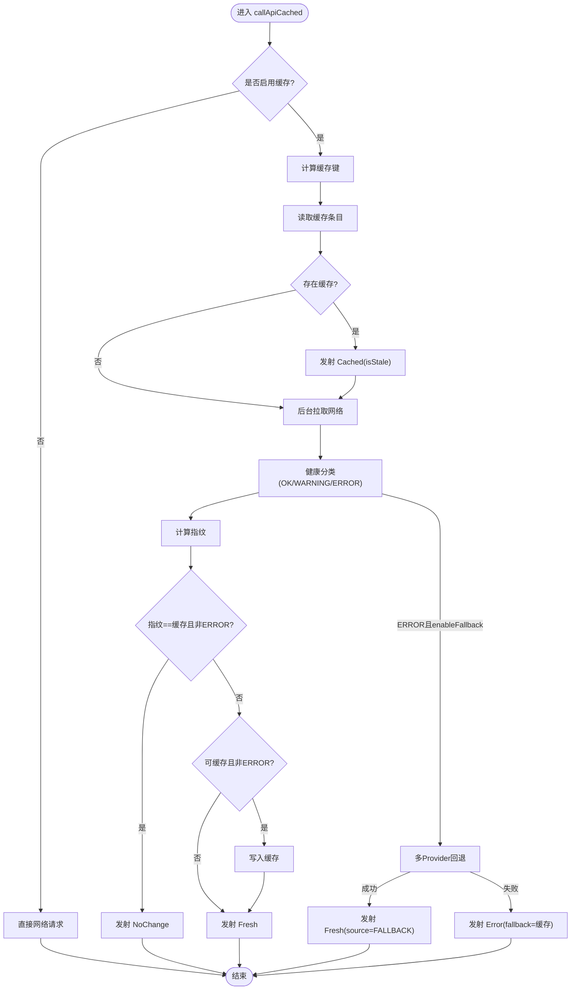
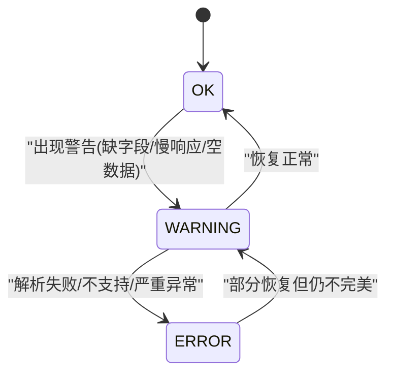
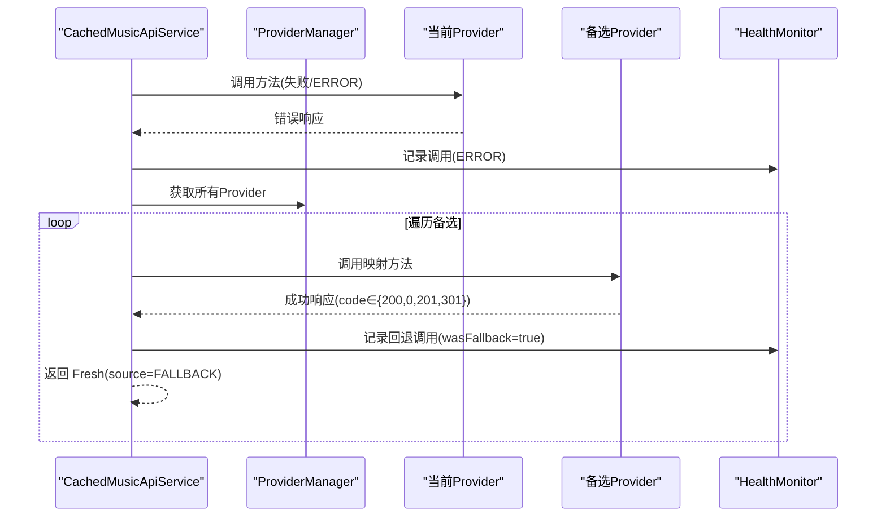
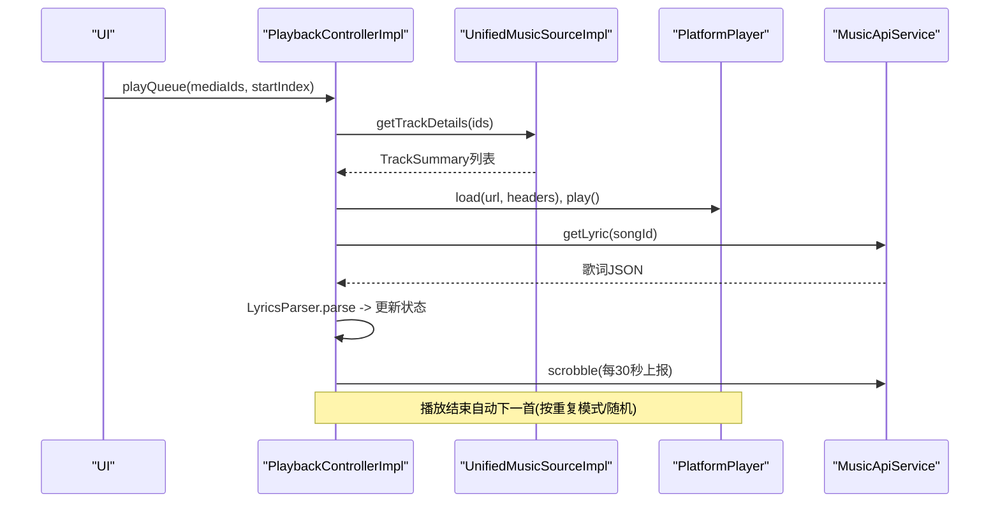
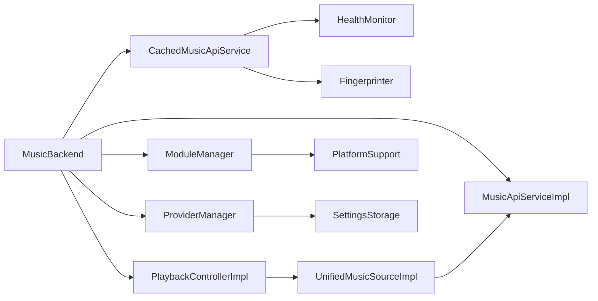

# 核心特性

<cite>
**本文引用的文件**
- [README.md](file://README.md)
- [MusicBackend.kt](file://kmp-pro/src/commonMain/kotlin/cp/player/kmp/MusicBackend.kt)
- [CachedMusicApiService.kt](file://kmp-pro/src/commonMain/kotlin/cp/player/kmp/cache/CachedMusicApiService.kt)
- [Fingerprinter.kt](file://kmp-pro/src/commonMain/kotlin/cp/player/kmp/cache/Fingerprinter.kt)
- [HealthMonitor.kt](file://kmp-pro/src/commonMain/kotlin/cp/player/kmp/monitor/HealthMonitor.kt)
- [ProviderManager.kt](file://kmp-pro/src/commonMain/kotlin/cp/player/kmp/provider/ProviderManager.kt)
- [ModuleManager.kt](file://kmp-pro/src/commonMain/kotlin/cp/player/kmp/provider/ModuleManager.kt)
- [PlaybackControllerImpl.kt](file://kmp-pro/src/commonMain/kotlin/cp/player/kmp/playback/PlaybackControllerImpl.kt)
- [UnifiedMusicSourceImpl.kt](file://kmp-pro/src/commonMain/kotlin/cp/player/kmp/music/UnifiedMusicSourceImpl.kt)
- [MusicApiServiceFactory.kt](file://kmp-pro/src/commonMain/kotlin/cp/player/kmp/api/MusicApiServiceFactory.kt)
</cite>

## 目录
1. [简介](#简介)
2. [项目结构](#项目结构)
3. [核心组件](#核心组件)
4. [架构总览](#架构总览)
5. [详细组件分析](#详细组件分析)
6. [依赖关系分析](#依赖关系分析)
7. [性能考量](#性能考量)
8. [故障排查指南](#故障排查指南)
9. [结论](#结论)
10. [附录：使用示例与配置选项](#附录使用示例与配置选项)

## 简介
本章节聚焦 CPPlayer-KMP 的核心特性，围绕以下能力展开：
- 插件化 Provider 系统：动态加载、切换与管理不同音源模块（JNI/Binary/HTTP）。
- 智能缓存机制：基于指纹的“先缓存后更新”策略，减少网络开销并提升首屏速度。
- 三级健康监控：OK/WARNING/ERROR 分类，驱动容灾回退与 UI 状态指示。
- 多 Provider 容灾回退：当前 Provider 不可用时自动尝试其他已加载 Provider。
- 跨平台播放控制：统一的 PlaybackController 抽象，屏蔽平台差异，提供队列、歌词、打卡、音质降级等能力。

这些能力通过 MusicBackend 统一编排，对外暴露稳定接口，使上层应用无需关心底层实现细节。

**章节来源**
- [README.md:1-167](file://README.md#L1-L167)

## 项目结构
KMP 模块采用 commonMain → jvmMain → { androidMain, desktopMain } 的分层组织：
- commonMain：跨平台业务逻辑（API 封装、缓存、健康监控、Provider 管理、播放控制、统一数据源）。
- jvmMain：JVM 共享实现（二进制 Provider、HttpClient 工厂、端口探测等）。
- androidMain/desktopMain：平台专属实现（Context、设置存储、JNI 支持等）。

**图表来源**
- [MusicBackend.kt:73-367](file://kmp-pro/src/commonMain/kotlin/cp/player/kmp/MusicBackend.kt#L73-L367)
- [CachedMusicApiService.kt:46-219](file://kmp-pro/src/commonMain/kotlin/cp/player/kmp/cache/CachedMusicApiService.kt#L46-L219)
- [HealthMonitor.kt:25-290](file://kmp-pro/src/commonMain/kotlin/cp/player/kmp/monitor/HealthMonitor.kt#L25-L290)
- [ProviderManager.kt:31-145](file://kmp-pro/src/commonMain/kotlin/cp/player/kmp/provider/ProviderManager.kt#L31-L145)
- [ModuleManager.kt:19-137](file://kmp-pro/src/commonMain/kotlin/cp/player/kmp/provider/ModuleManager.kt#L19-L137)
- [PlaybackControllerImpl.kt:35-763](file://kmp-pro/src/commonMain/kotlin/cp/player/kmp/playback/PlaybackControllerImpl.kt#L35-L763)
- [UnifiedMusicSourceImpl.kt:15-176](file://kmp-pro/src/commonMain/kotlin/cp/player/kmp/music/UnifiedMusicSourceImpl.kt#L15-L176)

**章节来源**
- [README.md:11-28](file://README.md#L11-L28)

## 核心组件
- MusicBackend：后端统一入口，负责生命周期、Provider 管理、音乐数据访问、本地音乐、播放控制与健康监控。
- CachedMusicApiService：在 MusicApiServiceImpl 之上增加缓存、指纹比对、健康监控与多 Provider 容灾。
- HealthMonitor：记录 API 调用并输出 OK/WARNING/ERROR 三级分类，维护整体健康等级流。
- ProviderManager/ModuleManager：加载/导入/删除模块，切换活跃 Provider，持久化最近选择。
- PlaybackControllerImpl：跨平台播放控制器，管理队列、歌词、收藏、打卡、音质降级与自动续播。
- UnifiedMusicSourceImpl：统一数据源，将 CPMediaId 路由到本地或云端，解析为领域模型。

**章节来源**
- [MusicBackend.kt:30-161](file://kmp-pro/src/commonMain/kotlin/cp/player/kmp/MusicBackend.kt#L30-L161)
- [CachedMusicApiService.kt:18-52](file://kmp-pro/src/commonMain/kotlin/cp/player/kmp/cache/CachedMusicApiService.kt#L18-L52)
- [HealthMonitor.kt:10-24](file://kmp-pro/src/commonMain/kotlin/cp/player/kmp/monitor/HealthMonitor.kt#L10-L24)
- [ProviderManager.kt:15-35](file://kmp-pro/src/commonMain/kotlin/cp/player/kmp/provider/ProviderManager.kt#L15-L35)
- [ModuleManager.kt:10-22](file://kmp-pro/src/commonMain/kotlin/cp/player/kmp/provider/ModuleManager.kt#L10-L22)
- [PlaybackControllerImpl.kt:18-41](file://kmp-pro/src/commonMain/kotlin/cp/player/kmp/playback/PlaybackControllerImpl.kt#L18-L41)
- [UnifiedMusicSourceImpl.kt:15-18](file://kmp-pro/src/commonMain/kotlin/cp/player/kmp/music/UnifiedMusicSourceImpl.kt#L15-L18)

## 架构总览
下图展示了从 UI 到 Provider 的完整调用链，以及缓存与健康监控的集成点。

**图表来源**
- [MusicBackend.kt:330-367](file://kmp-pro/src/commonMain/kotlin/cp/player/kmp/MusicBackend.kt#L330-L367)
- [CachedMusicApiService.kt:60-140](file://kmp-pro/src/commonMain/kotlin/cp/player/kmp/cache/CachedMusicApiService.kt#L60-L140)
- [HealthMonitor.kt:119-138](file://kmp-pro/src/commonMain/kotlin/cp/player/kmp/monitor/HealthMonitor.kt#L119-L138)
- [ProviderManager.kt:129-141](file://kmp-pro/src/commonMain/kotlin/cp/player/kmp/provider/ProviderManager.kt#L129-L141)

## 详细组件分析

### 插件化 Provider 系统
- 动态加载：ModuleManager 扫描 modulesDir，读取 manifest.json，创建 BackendProvider（JNI/Binary/HTTP），并注入 PlatformSupport 进行文件操作。
- 切换与管理：ProviderManager 负责启动/停止服务、端口分配、切换活跃 Provider、持久化最近选择；通过 StateFlow 暴露变更给 UI。
- 多类型支持：Android 端可加载 JNI 模块；Desktop 端不支持 JNI 时标记不可用；BinaryProvider 通过进程+Ktor localhost 通信。

**图表来源**
- [ModuleManager.kt:19-137](file://kmp-pro/src/commonMain/kotlin/cp/player/kmp/provider/ModuleManager.kt#L19-L137)
- [ProviderManager.kt:31-145](file://kmp-pro/src/commonMain/kotlin/cp/player/kmp/provider/ProviderManager.kt#L31-L145)

**章节来源**
- [ModuleManager.kt:35-117](file://kmp-pro/src/commonMain/kotlin/cp/player/kmp/provider/ModuleManager.kt#L35-L117)
- [ProviderManager.kt:62-121](file://kmp-pro/src/commonMain/kotlin/cp/player/kmp/provider/ProviderManager.kt#L62-L121)

### 智能缓存机制（CachedMusicApiService）
- 调用流程：先返回缓存（可能 stale），后台拉取网络，计算指纹，比较后决定 NoChange/Fresh/Error。
- 指纹计算：Fingerprinter 抽取 code、顶层数组长度集合、主数据数组 id 列表（去重排序，最多 64）、版本位，生成稳定签名。
- 缓存策略：键由 providerId#method#sortedParams#cookieHash 组成；仅对幂等读类接口缓存；写/动作类直通网络。
- 健康监控集成：根据 HealthMonitor 分类决定是否触发多 Provider 容灾；WARNING 附带告警；ERROR 触发回退或带缓存降级。

**图表来源**
- [CachedMusicApiService.kt:60-140](file://kmp-pro/src/commonMain/kotlin/cp/player/kmp/cache/CachedMusicApiService.kt#L60-L140)
- [Fingerprinter.kt:24-62](file://kmp-pro/src/commonMain/kotlin/cp/player/kmp/cache/Fingerprinter.kt#L24-L62)

**章节来源**
- [CachedMusicApiService.kt:18-52](file://kmp-pro/src/commonMain/kotlin/cp/player/kmp/cache/CachedMusicApiService.kt#L18-L52)
- [CachedMusicApiService.kt:142-219](file://kmp-pro/src/commonMain/kotlin/cp/player/kmp/cache/CachedMusicApiService.kt#L142-L219)
- [Fingerprinter.kt:10-23](file://kmp-pro/src/commonMain/kotlin/cp/player/kmp/cache/Fingerprinter.kt#L10-L23)

### 三级健康监控（HealthMonitor）
- 分类规则：UNSUPPORTED_BY_PROVIDER 与 MALFORMED_RESPONSE 归为 ERROR；其余归为 WARNING；正常为 OK。
- 记录与统计：环形缓冲区保存最近 N 条记录，提供按 Provider/Method 的统计、总体健康等级流。
- 综合等级：扫描最近窗口，最差等级优先（ERROR > WARNING > OK），供 UI 顶部状态指示。

**图表来源**
- [HealthMonitor.kt:31-56](file://kmp-pro/src/commonMain/kotlin/cp/player/kmp/monitor/HealthMonitor.kt#L31-L56)
- [HealthMonitor.kt:220-233](file://kmp-pro/src/commonMain/kotlin/cp/player/kmp/monitor/HealthMonitor.kt#L220-L233)

**章节来源**
- [HealthMonitor.kt:10-24](file://kmp-pro/src/commonMain/kotlin/cp/player/kmp/monitor/HealthMonitor.kt#L10-L24)
- [HealthMonitor.kt:119-178](file://kmp-pro/src/commonMain/kotlin/cp/player/kmp/monitor/HealthMonitor.kt#L119-L178)

### 多 Provider 容灾回退
- 触发条件：当前 Provider 响应被分类为 ERROR，且启用回退。
- 执行流程：按顺序尝试其他已加载 Provider，调用其 apiMap 映射的方法；首次返回成功 code 即视为回退成功。
- 记录与标注：每次尝试记录到 HealthMonitor，成功时标记 wasFallback 与 fallbackFrom。

**图表来源**
- [CachedMusicApiService.kt:142-180](file://kmp-pro/src/commonMain/kotlin/cp/player/kmp/cache/CachedMusicApiService.kt#L142-L180)
- [HealthMonitor.kt:119-138](file://kmp-pro/src/commonMain/kotlin/cp/player/kmp/monitor/HealthMonitor.kt#L119-L138)

**章节来源**
- [CachedMusicApiService.kt:142-180](file://kmp-pro/src/commonMain/kotlin/cp/player/kmp/cache/CachedMusicApiService.kt#L142-L180)

### 跨平台播放控制（PlaybackControllerImpl）
- 职责：队列管理、URL 解析、歌词抓取、收藏同步、听歌打卡、自动续播、音质降级。
- 平台无关：通过 PlatformPlayer 抽象屏蔽 Android/Desktop 差异；统一状态折叠进 PlaybackUiState。
- 关键流程：播放当前曲目时先懒解析 TrackSummary，再获取 URL 并加载；若格式不支持则降级到 standard 音质重试一次。

**图表来源**
- [PlaybackControllerImpl.kt:144-158](file://kmp-pro/src/commonMain/kotlin/cp/player/kmp/playback/PlaybackControllerImpl.kt#L144-L158)
- [PlaybackControllerImpl.kt:495-556](file://kmp-pro/src/commonMain/kotlin/cp/player/kmp/playback/PlaybackControllerImpl.kt#L495-L556)
- [UnifiedMusicSourceImpl.kt:20-52](file://kmp-pro/src/commonMain/kotlin/cp/player/kmp/music/UnifiedMusicSourceImpl.kt#L20-L52)

**章节来源**
- [PlaybackControllerImpl.kt:18-41](file://kmp-pro/src/commonMain/kotlin/cp/player/kmp/playback/PlaybackControllerImpl.kt#L18-L41)
- [PlaybackControllerImpl.kt:558-575](file://kmp-pro/src/commonMain/kotlin/cp/player/kmp/playback/PlaybackControllerImpl.kt#L558-L575)

## 依赖关系分析
- MusicBackend 组合 ProviderManager、ModuleManager、MusicApiServiceImpl、CachedMusicApiService、LocalMusicSource、PlaybackEngine。
- CachedMusicApiService 依赖 MusicApiServiceImpl、ApiCache、ProviderManager、HealthMonitor、Fingerprinter。
- PlaybackControllerImpl 依赖 UnifiedMusicSourceImpl、MusicApiService、PlatformPlayer。
- ModuleManager 依赖 PlatformSupport（跨平台文件/目录操作）。
- ProviderManager 依赖 SettingsStorage（持久化最近 Provider）与 PlatformSupport（端口探测）。

**图表来源**
- [MusicBackend.kt:73-161](file://kmp-pro/src/commonMain/kotlin/cp/player/kmp/MusicBackend.kt#L73-L161)
- [CachedMusicApiService.kt:46-52](file://kmp-pro/src/commonMain/kotlin/cp/player/kmp/cache/CachedMusicApiService.kt#L46-L52)
- [PlaybackControllerImpl.kt:35-41](file://kmp-pro/src/commonMain/kotlin/cp/player/kmp/playback/PlaybackControllerImpl.kt#L35-L41)
- [ModuleManager.kt:19-22](file://kmp-pro/src/commonMain/kotlin/cp/player/kmp/provider/ModuleManager.kt#L19-L22)
- [ProviderManager.kt:31-35](file://kmp-pro/src/commonMain/kotlin/cp/player/kmp/provider/ProviderManager.kt#L31-L35)

**章节来源**
- [MusicBackend.kt:73-161](file://kmp-pro/src/commonMain/kotlin/cp/player/kmp/MusicBackend.kt#L73-L161)
- [CachedMusicApiService.kt:46-52](file://kmp-pro/src/commonMain/kotlin/cp/player/kmp/cache/CachedMusicApiService.kt#L46-L52)
- [PlaybackControllerImpl.kt:35-41](file://kmp-pro/src/commonMain/kotlin/cp/player/kmp/playback/PlaybackControllerImpl.kt#L35-L41)

## 性能考量
- 缓存键设计：providerId#method#sortedParams#cookieHash，避免并发冲突与 Cookie 污染。
- 指纹比对：仅计算必要字段，降低大响应比对成本；增删/重排条目会变化，无关字段不影响。
- 健康监控：环形缓冲区与 Flow update 避免频繁复制；统计查询快照计算，不阻塞记录路径。
- 播放控制：懒解析 TrackSummary，批量解析（chunked）避免 URI 过长；音质降级提高兼容性。

[本节为通用指导，不直接分析具体文件]

## 故障排查指南
- 导入模块失败：检查 manifest.json 是否存在、模块类型是否受支持、ABI 是否匹配；查看 lastLoadError。
- Provider 未就绪：确认 startServer 成功、端口未被占用；检查 JNI/Binary 入口文件完整性。
- 缓存未更新：确认 isCacheable(method) 是否为真；检查指纹是否因无关字段变化而保持不变。
- 健康监控 ERROR：查看最近记录 with onlyErrors，定位 method/provider；必要时启用回退或更换 Provider。
- 播放失败：观察错误信息，尝试 setQuality("standard") 降级；检查 Cookie 注入与 URL 有效性。

**章节来源**
- [ModuleManager.kt:56-86](file://kmp-pro/src/commonMain/kotlin/cp/player/kmp/provider/ModuleManager.kt#L56-L86)
- [ProviderManager.kt:62-109](file://kmp-pro/src/commonMain/kotlin/cp/player/kmp/provider/ProviderManager.kt#L62-L109)
- [CachedMusicApiService.kt:205-219](file://kmp-pro/src/commonMain/kotlin/cp/player/kmp/cache/CachedMusicApiService.kt#L205-L219)
- [HealthMonitor.kt:159-178](file://kmp-pro/src/commonMain/kotlin/cp/player/kmp/monitor/HealthMonitor.kt#L159-L178)
- [PlaybackControllerImpl.kt:558-575](file://kmp-pro/src/commonMain/kotlin/cp/player/kmp/playback/PlaybackControllerImpl.kt#L558-L575)

## 结论
CPPlayer-KMP 通过 MusicBackend 统一编排 Provider 插件、缓存与健康监控，结合跨平台播放控制，实现了高可用、高性能、易扩展的音乐后端。其核心优势在于：
- 插件化架构便于扩展新音源。
- 智能缓存显著降低网络压力并提升首屏体验。
- 三级健康监控驱动容灾回退，保障服务稳定性。
- 跨平台播放控制屏蔽差异，提供一致的用户体验。

[本节为总结性内容，不直接分析具体文件]

## 附录：使用示例与配置选项
- 初始化：
  - Android：在 Application.onCreate 中注入 PlatformContext 并调用 MusicApiServiceFactory.init。
  - Desktop：传入 PlatformContext.EMPTY 与默认 SettingsStorage。
- 使用缓存版 API：
  - 通过 MusicApiServiceFactory.cachedInstance.callApiCached(method, params) 收集 Flow，处理 Cached/Fresh/NoChange/Error。
- 配置项：
  - CacheConfig：freshTtlMs、maxEntries、enableFallback、enableCache。
  - 播放控制：setQuality(level)、toggleShuffle()、setRepeatMode(mode)。
- 健康监控：
  - 订阅 overallLevelFlow 显示顶部状态；查询 getRecentRecords(onlyWarnings/onlyErrors) 诊断问题。

**章节来源**
- [README.md:104-167](file://README.md#L104-L167)
- [MusicApiServiceFactory.kt:21-57](file://kmp-pro/src/commonMain/kotlin/cp/player/kmp/api/MusicApiServiceFactory.kt#L21-L57)
- [CachedMusicApiService.kt:60-88](file://kmp-pro/src/commonMain/kotlin/cp/player/kmp/cache/CachedMusicApiService.kt#L60-L88)
- [HealthMonitor.kt:113-116](file://kmp-pro/src/commonMain/kotlin/cp/player/kmp/monitor/HealthMonitor.kt#L113-L116)