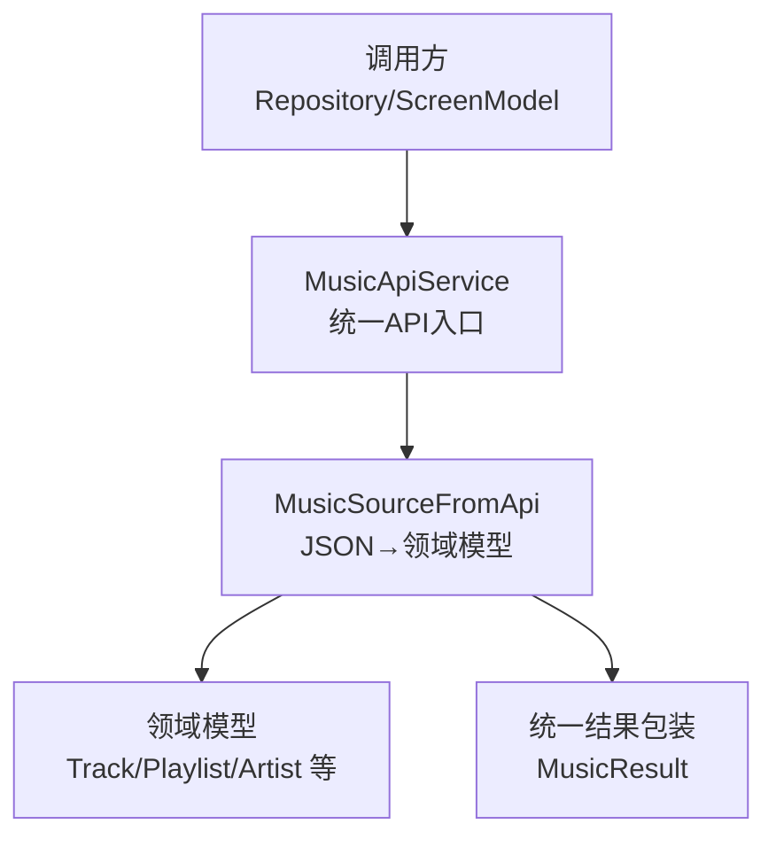
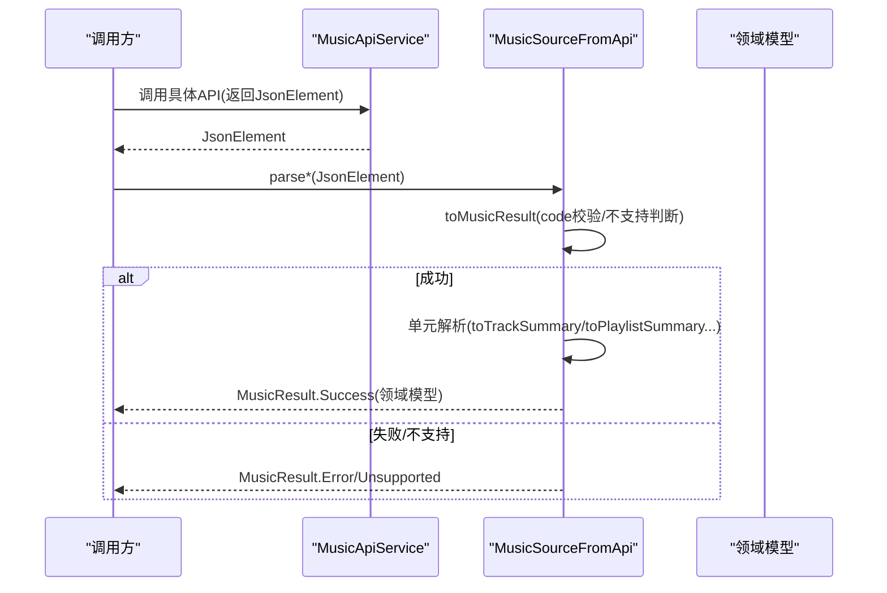
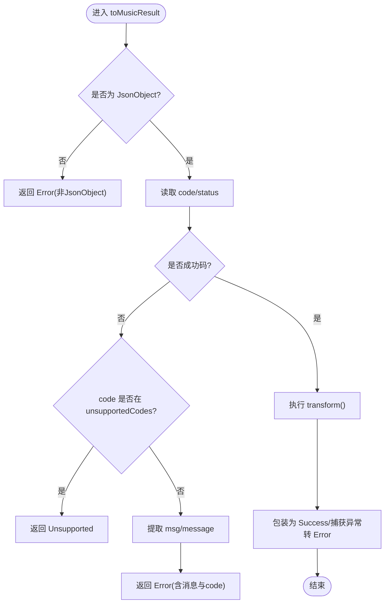
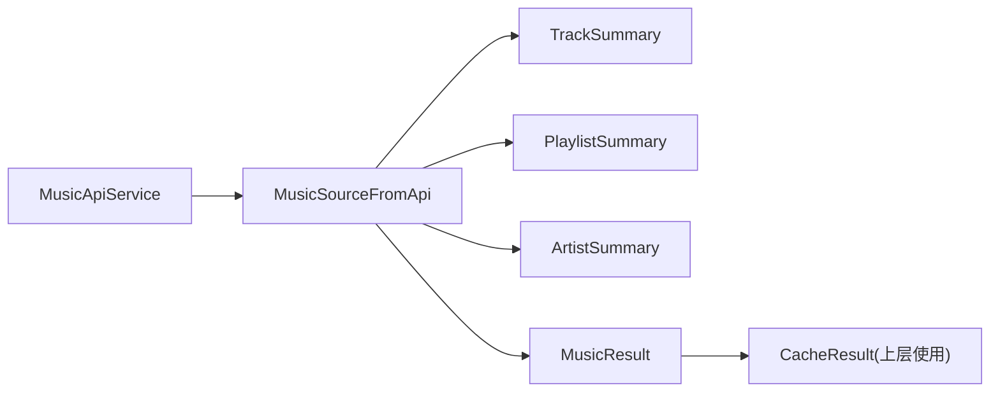

# API 数据映射层

<cite>
**本文引用的文件**
- [MusicSourceFromApi.kt](file://kmp-pro/src/commonMain/kotlin/cp/player/kmp/music/MusicSourceFromApi.kt)
- [MusicApiService.kt](file://kmp-pro/src/commonMain/kotlin/cp/player/kmp/api/MusicApiService.kt)
- [Song.kt](file://kmp-pro/src/commonMain/kotlin/cp/player/kmp/model/Song.kt)
- [Artist.kt](file://kmp-pro/src/commonMain/kotlin/cp/player/kmp/model/Artist.kt)
- [Playlist.kt](file://kmp-pro/src/commonMain/kotlin/cp/player/kmp/model/Playlist.kt)
- [Comment.kt](file://kmp-pro/src/commonMain/kotlin/cp/player/kmp/model/Comment.kt)
- [LyricsInfo.kt](file://kmp-pro/src/commonMain/kotlin/cp/player/kmp/model/LyricsInfo.kt)
- [CacheResult.kt](file://kmp-pro/src/commonMain/kotlin/cp/player/kmp/cache/CacheResult.kt)
</cite>

## 目录
1. [简介](#简介)
2. [项目结构](#项目结构)
3. [核心组件](#核心组件)
4. [架构总览](#架构总览)
5. [详细组件分析](#详细组件分析)
6. [依赖关系分析](#依赖关系分析)
7. [性能考量](#性能考量)
8. [故障排查指南](#故障排查指南)
9. [结论](#结论)
10. [附录](#附录)

## 简介
本技术文档聚焦于 API 数据映射层，围绕 MusicSourceFromApi 如何把云音乐 API 返回的 JSON 数据转换为统一的领域模型进行系统化说明。内容涵盖字段映射、类型转换与默认值处理；API 版本差异与数据结构变更的兼容策略；数据验证与清洗（空值、格式校验、业务规则）；批量数据处理优化（并行转换、内存管理）；错误映射机制（底层 API 错误到统一业务异常）；以及扩展指南（新增数据源适配器与自定义转换逻辑）。文末提供具体转换示例与最佳实践建议。

## 项目结构
该映射层位于 KMP 模块中，核心入口为 MusicSourceFromApi，负责将 MusicApiService 返回的 JsonElement 解析为领域模型（如 TrackSummary、PlaylistSummary、ArtistSummary 等），并封装为统一的 MusicResult。与之配合的是统一的 API 服务接口 MusicApiService，它定义了所有音乐相关 API 的调用契约，返回原始 JSON 元素，由上层或映射层进行解析。

图表来源
- [MusicApiService.kt:24-156](file://kmp-pro/src/commonMain/kotlin/cp/player/kmp/api/MusicApiService.kt#L24-L156)
- [MusicSourceFromApi.kt:17-61](file://kmp-pro/src/commonMain/kotlin/cp/player/kmp/music/MusicSourceFromApi.kt#L17-L61)

章节来源
- [MusicApiService.kt:24-156](file://kmp-pro/src/commonMain/kotlin/cp/player/kmp/api/MusicApiService.kt#L24-L156)
- [MusicSourceFromApi.kt:17-61](file://kmp-pro/src/commonMain/kotlin/cp/player/kmp/music/MusicSourceFromApi.kt#L17-L61)

## 核心组件
- MusicSourceFromApi：JSON 到强类型模型的解析桥，覆盖推荐歌单、日推、搜索、歌单详情、用户歌单、云盘歌曲、私人 FM 等场景。
- MusicApiService：统一 API 服务接口，屏蔽 Provider 差异，返回 JsonElement，供映射层解析。
- 领域模型：Song、Artist、Playlist、Comment、LyricsInfo 等，作为应用内统一的数据表示。
- 缓存结果：CacheResult 用于描述数据来源与状态（缓存命中、网络新鲜数据、错误降级等）。

章节来源
- [MusicSourceFromApi.kt:17-61](file://kmp-pro/src/commonMain/kotlin/cp/player/kmp/music/MusicSourceFromApi.kt#L17-L61)
- [MusicApiService.kt:24-156](file://kmp-pro/src/commonMain/kotlin/cp/player/kmp/api/MusicApiService.kt#L24-L156)
- [Song.kt:1-14](file://kmp-pro/src/commonMain/kotlin/cp/player/kmp/model/Song.kt#L1-L14)
- [Artist.kt:1-13](file://kmp-pro/src/commonMain/kotlin/cp/player/kmp/model/Artist.kt#L1-L13)
- [Playlist.kt:1-17](file://kmp-pro/src/commonMain/kotlin/cp/player/kmp/model/Playlist.kt#L1-L17)
- [Comment.kt:1-25](file://kmp-pro/src/commonMain/kotlin/cp/player/kmp/model/Comment.kt#L1-L25)
- [LyricsInfo.kt:1-12](file://kmp-pro/src/commonMain/kotlin/cp/player/kmp/model/LyricsInfo.kt#L1-L12)
- [CacheResult.kt:1-44](file://kmp-pro/src/commonMain/kotlin/cp/player/kmp/cache/CacheResult.kt#L1-L44)

## 架构总览
MusicSourceFromApi 通过 toMusicResult 统一处理响应码判定、不支持功能识别与解析异常封装，再按不同 API 场景调用具体的单元解析器（toPlaylistSummary、toTrackSummary、toArtistSummary），最终产出领域模型列表或对象。

图表来源
- [MusicSourceFromApi.kt:31-61](file://kmp-pro/src/commonMain/kotlin/cp/player/kmp/music/MusicSourceFromApi.kt#L31-L61)
- [MusicApiService.kt:24-156](file://kmp-pro/src/commonMain/kotlin/cp/player/kmp/api/MusicApiService.kt#L24-L156)

## 详细组件分析

### 统一结果封装与错误映射
- 响应码判定：优先读取 code，其次 status；成功码包括 200、0、201、301。
- 不支持功能：当 code 属于预设集合（如 -1、501、404）时，返回 Unsupported。
- 错误信息提取：优先 msg，其次 message；否则使用通用提示并附带 code。
- 解析异常捕获：使用 runCatching 包裹 transform，捕获解析异常并转为 Error。

图表来源
- [MusicSourceFromApi.kt:31-61](file://kmp-pro/src/commonMain/kotlin/cp/player/kmp/music/MusicSourceFromApi.kt#L31-L61)

章节来源
- [MusicSourceFromApi.kt:31-61](file://kmp-pro/src/commonMain/kotlin/cp/player/kmp/music/MusicSourceFromApi.kt#L31-L61)

### 字段映射与类型转换
- 推荐歌单：从 recommend/result/playlists 数组解析 PlaylistSummary。
- 推荐歌曲（日推）：从 data.dailySongs/data/songs/recommend 数组解析 TrackSummary。
- 搜索：从 result.songs/result.playlists/result.artists 分别解析对应摘要。
- 歌单详情：从 playlist/data 取主体，tracks 解析曲目列表，description 可选。
- 歌单曲目分页：兼容 songs/tracks 字段；hasMore/more 布尔字段，缺失默认 false。
- 用户歌单：从 playlist/playlists/data 数组解析。
- 云盘歌曲：兼容 {data:[{song/simpleSong:...}]} 与 {data:[...track...]} 两种形态。
- 私人 FM：从 data/songs 数组解析。

字段映射要点：
- 多字段兼容：同一语义支持多个键名（如 id/songId、name/song、ar/artists、al/album 等）。
- 类型转换：long/int/string/boolean 安全转换，缺失时使用默认值（0、空串、false）。
- 聚合字段：artistNames 由 ar/artists 列表拼接，或回退至 artist 字符串。
- 图片 URL：coverUrl/picUrl/coverImgUrl/avatarUrl/img1v1Url 等多路径兼容。

章节来源
- [MusicSourceFromApi.kt:65-184](file://kmp-pro/src/commonMain/kotlin/cp/player/kmp/music/MusicSourceFromApi.kt#L65-L184)
- [MusicSourceFromApi.kt:188-224](file://kmp-pro/src/commonMain/kotlin/cp/player/kmp/music/MusicSourceFromApi.kt#L188-L224)

### 数据验证与清洗
- 空值处理：对缺失字段采用空串、0、false 等默认值，避免空指针。
- 格式校验：确保目标字段类型可解析，不可解析则忽略或置默认。
- 业务规则：过滤无效条目（如 track.id 为空则丢弃），保证数据一致性。
- 分页标志：hasMore/more 缺失时默认 false，调用方可用 tracks.size >= limit 兜底。

章节来源
- [MusicSourceFromApi.kt:124-137](file://kmp-pro/src/commonMain/kotlin/cp/player/kmp/music/MusicSourceFromApi.kt#L124-L137)
- [MusicSourceFromApi.kt:157-170](file://kmp-pro/src/commonMain/kotlin/cp/player/kmp/music/MusicSourceFromApi.kt#L157-L170)

### 批量数据处理与优化
- 并行转换：对数组元素使用 map/mapNotNull 进行批量转换，适合后续结合并发库提升吞吐。
- 内存管理：避免中间大对象堆积，及时丢弃无效项；合理使用 takeIf 过滤。
- 分页策略：对于歌单曲目等分页接口，结合 hasMore 与 limit/offset 控制请求规模。

章节来源
- [MusicSourceFromApi.kt:65-184](file://kmp-pro/src/commonMain/kotlin/cp/player/kmp/music/MusicSourceFromApi.kt#L65-L184)

### 便捷调用封装
- 提供 getPlaylistDetail/getPlaylistTracks/getRecommendedPlaylists/search/getUserPlaylists/getUserCloud/getPersonalFm 等便捷方法，内部组合 API 调用与解析。

章节来源
- [MusicSourceFromApi.kt:228-249](file://kmp-pro/src/commonMain/kotlin/cp/player/kmp/music/MusicSourceFromApi.kt#L228-L249)

### 领域模型与注释
- Song：包含 id、name、artist、artistId、album、albumArtUrl、durationMs。
- Artist：包含 id、name、picUrl、alias、albumSize、briefDesc。
- Playlist：包含 id、name、coverImgUrl、trackCount、creatorName、creatorUserId、subscribed、description、composer、totalDurationMs。
- Comment：评论及回复结构。
- LyricsInfo：歌词元信息（来源、格式、是否含词级/翻译/音标）。

章节来源
- [Song.kt:1-14](file://kmp-pro/src/commonMain/kotlin/cp/player/kmp/model/Song.kt#L1-L14)
- [Artist.kt:1-13](file://kmp-pro/src/commonMain/kotlin/cp/player/kmp/model/Artist.kt#L1-L13)
- [Playlist.kt:1-17](file://kmp-pro/src/commonMain/kotlin/cp/player/kmp/model/Playlist.kt#L1-L17)
- [Comment.kt:1-25](file://kmp-pro/src/commonMain/kotlin/cp/player/kmp/model/Comment.kt#L1-L25)
- [LyricsInfo.kt:1-12](file://kmp-pro/src/commonMain/kotlin/cp/player/kmp/model/LyricsInfo.kt#L1-L12)

## 依赖关系分析
- MusicSourceFromApi 依赖 MusicApiService 获取原始 JSON。
- 解析产物为领域模型（Track/Playlist/Artist 等），并通过统一结果包装返回。
- 缓存层 CacheResult 可用于上层区分数据来源与健康等级。

图表来源
- [MusicApiService.kt:24-156](file://kmp-pro/src/commonMain/kotlin/cp/player/kmp/api/MusicApiService.kt#L24-L156)
- [MusicSourceFromApi.kt:17-61](file://kmp-pro/src/commonMain/kotlin/cp/player/kmp/music/MusicSourceFromApi.kt#L17-L61)
- [CacheResult.kt:1-44](file://kmp-pro/src/commonMain/kotlin/cp/player/kmp/cache/CacheResult.kt#L1-L44)

章节来源
- [MusicApiService.kt:24-156](file://kmp-pro/src/commonMain/kotlin/cp/player/kmp/api/MusicApiService.kt#L24-L156)
- [MusicSourceFromApi.kt:17-61](file://kmp-pro/src/commonMain/kotlin/cp/player/kmp/music/MusicSourceFromApi.kt#L17-L61)
- [CacheResult.kt:1-44](file://kmp-pro/src/commonMain/kotlin/cp/player/kmp/cache/CacheResult.kt#L1-L44)

## 性能考量
- 解析效率：使用安全的类型转换与空合并策略，减少分支与异常开销。
- 批量处理：对数组元素进行 map/mapNotNull 批量转换，便于后续并行化。
- 内存占用：及时丢弃无效项，避免构建无用对象；合理设置分页 limit。
- 错误快速失败：在 toMusicResult 早期判断 code，避免无意义解析。

[本节为通用指导，不直接分析具体文件]

## 故障排查指南
- 响应码异常：检查 code/status 是否落入成功码集合；若为不支持码，确认音源能力。
- 字段缺失：核对各 API 返回字段名是否与兼容路径一致（如 songs/tracks、recommend/result）。
- 类型转换失败：确认字段类型是否符合预期，必要时增加容错与日志。
- 解析异常：查看 toMusicResult 捕获的异常信息，定位具体解析步骤。
- 缓存与降级：结合 CacheResult 判断数据来源与健康等级，必要时启用降级策略。

章节来源
- [MusicSourceFromApi.kt:31-61](file://kmp-pro/src/commonMain/kotlin/cp/player/kmp/music/MusicSourceFromApi.kt#L31-L61)
- [CacheResult.kt:1-44](file://kmp-pro/src/commonMain/kotlin/cp/player/kmp/cache/CacheResult.kt#L1-L44)

## 结论
MusicSourceFromApi 以统一的 toMusicResult 为核心，实现了跨音源的 JSON 到领域模型的安全、健壮映射。通过多字段兼容、类型安全转换、默认值处理与错误映射，有效应对 API 版本差异与数据结构变更。结合批量处理与分页策略，可在保证正确性的前提下提升性能。上层可通过 CacheResult 进行缓存与健康监控，形成完整的 API 数据链路。

[本节为总结性内容，不直接分析具体文件]

## 附录

### 转换示例与最佳实践
- 推荐歌单：从 recommend/result/playlists 任一数组解析 PlaylistSummary。
- 日推歌曲：从 data.dailySongs/data/songs/recommend 任一数组解析 TrackSummary。
- 搜索：分别解析 songs/playlists/artists 三类结果。
- 歌单详情：主体取自 playlist/data，tracks 解析曲目列表，description 可选。
- 歌单曲目分页：兼容 songs/tracks，hasMore/more 缺失默认 false。
- 云盘歌曲：兼容嵌套 song/simpleSong 或直接 track 对象。
- 私人 FM：从 data/songs 数组解析。

最佳实践：
- 始终使用 toMusicResult 统一处理响应码与异常。
- 对缺失字段采用默认值，避免空引用。
- 对无效条目进行过滤（如 id 为空）。
- 对分页接口结合 hasMore 与 limit/offset 控制请求规模。
- 在需要时结合并发库对数组元素进行并行转换以提升吞吐。

章节来源
- [MusicSourceFromApi.kt:65-184](file://kmp-pro/src/commonMain/kotlin/cp/player/kmp/music/MusicSourceFromApi.kt#L65-L184)
- [MusicSourceFromApi.kt:188-224](file://kmp-pro/src/commonMain/kotlin/cp/player/kmp/music/MusicSourceFromApi.kt#L188-L224)

### 扩展指南：新增数据源适配器与自定义转换逻辑
- 新增适配：在 MusicSourceFromApi 中添加新的 parse* 方法，复用 toMusicResult 进行统一错误处理。
- 字段兼容：为新 API 定义多字段兼容路径，确保向后兼容。
- 类型转换：使用安全的类型转换与默认值，避免异常传播。
- 单元测试：针对新解析逻辑编写用例，覆盖正常、异常与边界情况。
- 集成测试：结合 MusicApiService 的 callApi 或具体方法，端到端验证 JSON 到模型的转换。

章节来源
- [MusicSourceFromApi.kt:17-61](file://kmp-pro/src/commonMain/kotlin/cp/player/kmp/music/MusicSourceFromApi.kt#L17-L61)
- [MusicApiService.kt:24-156](file://kmp-pro/src/commonMain/kotlin/cp/player/kmp/api/MusicApiService.kt#L24-L156)