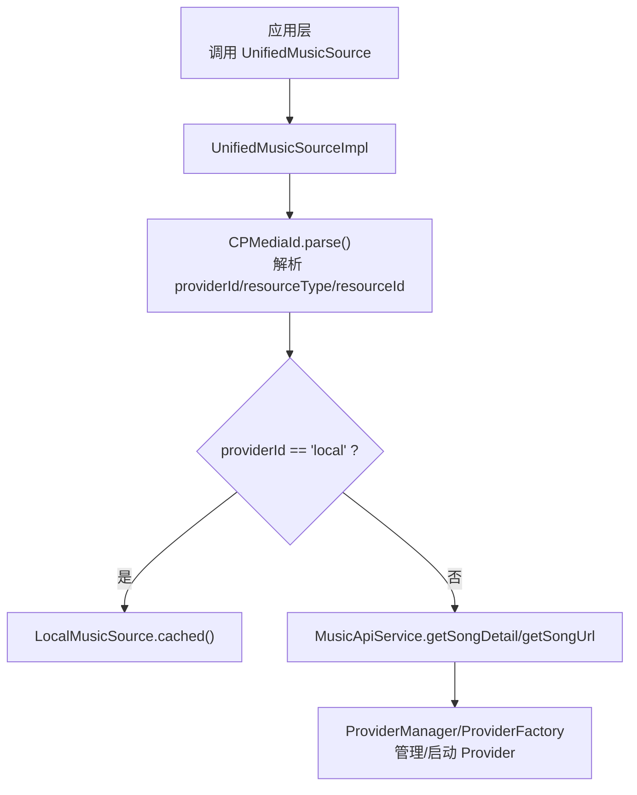
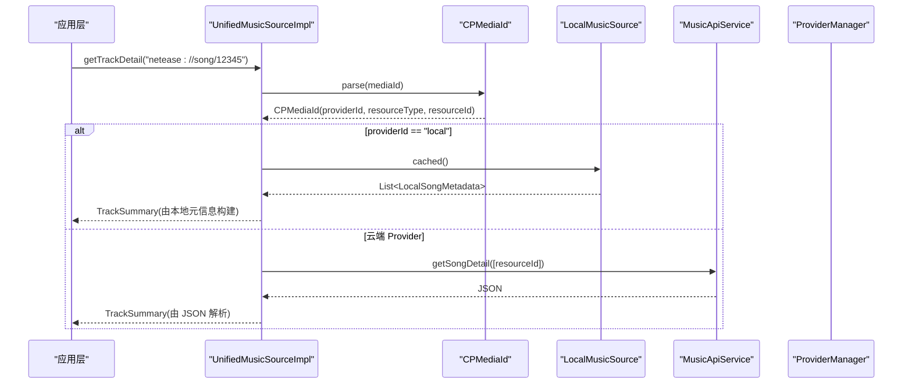
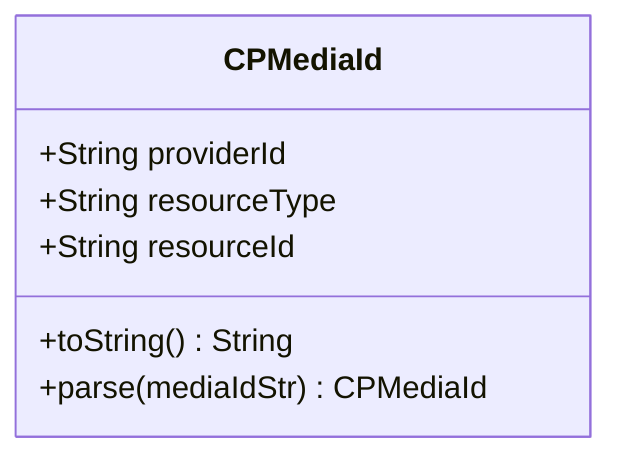
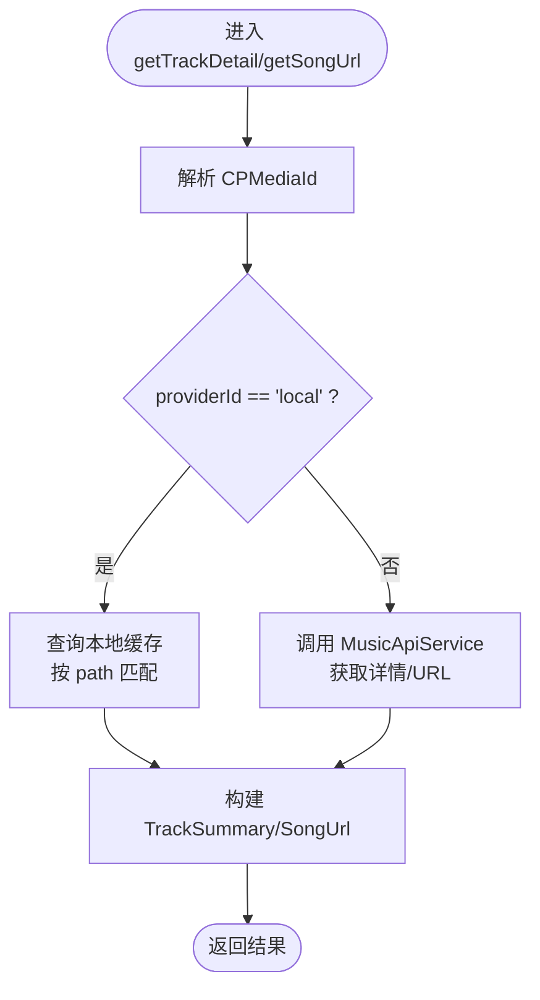
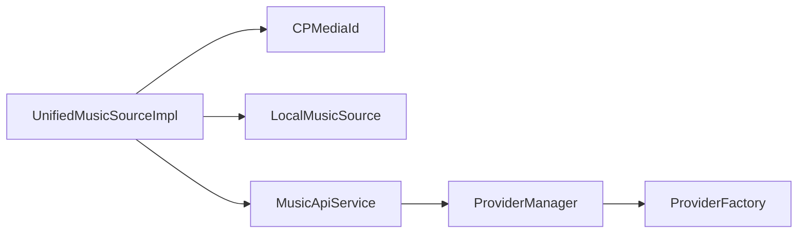

# CPMediaId 设计原理

<cite>
**本文引用的文件**
- [CPMediaId.kt](file://kmp-pro/src/commonMain/kotlin/cp/player/kmp/music/CPMediaId.kt)
- [UnifiedMusicSource.kt](file://kmp-pro/src/commonMain/kotlin/cp/player/kmp/music/UnifiedMusicSource.kt)
- [UnifiedMusicSourceImpl.kt](file://kmp-pro/src/commonMain/kotlin/cp/player/kmp/music/UnifiedMusicSourceImpl.kt)
- [LocalMusicSource.kt](file://kmp-pro/src/commonMain/kotlin/cp/player/kmp/local/LocalMusicSource.kt)
- [ProviderFactory.kt](file://kmp-pro/src/commonMain/kotlin/cp/player/kmp/provider/ProviderFactory.kt)
- [ProviderManager.kt](file://kmp-pro/src/commonMain/kotlin/cp/player/kmp/provider/ProviderManager.kt)
</cite>

## 目录
1. [简介](#简介)
2. [项目结构](#项目结构)
3. [核心组件](#核心组件)
4. [架构总览](#架构总览)
5. [详细组件分析](#详细组件分析)
6. [依赖关系分析](#依赖关系分析)
7. [性能考量](#性能考量)
8. [故障排查指南](#故障排查指南)
9. [结论](#结论)
10. [附录：使用示例与最佳实践](#附录使用示例与最佳实践)

## 简介
本文件围绕统一媒体 ID（CPMediaId）的设计与实现，系统阐述其命名空间约定、格式规范、路由机制、解析与验证逻辑、版本兼容性策略，以及在不同 Provider 之间的转换方式。通过该统一 ID，前端无需关心数据来自本地还是云端 Provider，后端可基于 ID 自动路由到正确的数据源并返回一致的结果模型。

## 项目结构
CPMediaId 位于音乐模块中，作为跨 Provider 的统一资源定位标识。与之配合的接口和实现包括：
- UnifiedMusicSource：面向前端的统一入口，所有涉及资源定位的参数均采用字符串形式的 CPMediaId。
- UnifiedMusicSourceImpl：根据 CPMediaId 的 providerId 进行路由，分别调用本地音乐源或云侧 API。
- LocalMusicSource：本地音乐扫描与缓存能力，路径即唯一标识。
- ProviderFactory / ProviderManager：负责加载、启动和管理不同 Provider（HTTP/Binary/JNI），为云侧数据提供支撑。

图表来源
- [UnifiedMusicSource.kt:1-38](file://kmp-pro/src/commonMain/kotlin/cp/player/kmp/music/UnifiedMusicSource.kt#L1-L38)
- [UnifiedMusicSourceImpl.kt:20-118](file://kmp-pro/src/commonMain/kotlin/cp/player/kmp/music/UnifiedMusicSourceImpl.kt#L20-L118)
- [CPMediaId.kt:11-31](file://kmp-pro/src/commonMain/kotlin/cp/player/kmp/music/CPMediaId.kt#L11-L31)
- [LocalMusicSource.kt:15-31](file://kmp-pro/src/commonMain/kotlin/cp/player/kmp/local/LocalMusicSource.kt#L15-L31)
- [ProviderFactory.kt:1-29](file://kmp-pro/src/commonMain/kotlin/cp/player/kmp/provider/ProviderFactory.kt#L1-L29)
- [ProviderManager.kt:31-66](file://kmp-pro/src/commonMain/kotlin/cp/player/kmp/provider/ProviderManager.kt#L31-L66)

章节来源
- [UnifiedMusicSource.kt:1-38](file://kmp-pro/src/commonMain/kotlin/cp/player/kmp/music/UnifiedMusicSource.kt#L1-L38)
- [UnifiedMusicSourceImpl.kt:20-118](file://kmp-pro/src/commonMain/kotlin/cp/player/kmp/music/UnifiedMusicSourceImpl.kt#L20-L118)
- [CPMediaId.kt:11-31](file://kmp-pro/src/commonMain/kotlin/cp/player/kmp/music/CPMediaId.kt#L11-L31)
- [LocalMusicSource.kt:15-31](file://kmp-pro/src/commonMain/kotlin/cp/player/kmp/local/LocalMusicSource.kt#L15-L31)
- [ProviderFactory.kt:1-29](file://kmp-pro/src/commonMain/kotlin/cp/player/kmp/provider/ProviderFactory.kt#L1-L29)
- [ProviderManager.kt:31-66](file://kmp-pro/src/commonMain/kotlin/cp/player/kmp/provider/ProviderManager.kt#L31-L66)

## 核心组件
- CPMediaId：定义统一媒体 ID 的数据结构与解析方法，采用 {providerId}://{resourceType}/{resourceId} 格式。
- UnifiedMusicSource：统一接口，所有资源定位参数以字符串形式传入，内部再解析为 CPMediaId。
- UnifiedMusicSourceImpl：具体实现，依据 providerId 路由到本地或云侧；对本地资源按路径匹配，对云端资源按 resourceId 调用 API。
- LocalMusicSource：本地音乐元信息接口，path 字段作为唯一标识。
- ProviderFactory / ProviderManager：Provider 生命周期管理与实例化，确保云侧服务可用。

章节来源
- [CPMediaId.kt:11-31](file://kmp-pro/src/commonMain/kotlin/cp/player/kmp/music/CPMediaId.kt#L11-L31)
- [UnifiedMusicSource.kt:1-38](file://kmp-pro/src/commonMain/kotlin/cp/player/kmp/music/UnifiedMusicSource.kt#L1-L38)
- [UnifiedMusicSourceImpl.kt:20-118](file://kmp-pro/src/commonMain/kotlin/cp/player/kmp/music/UnifiedMusicSourceImpl.kt#L20-L118)
- [LocalMusicSource.kt:15-31](file://kmp-pro/src/commonMain/kotlin/cp/player/kmp/local/LocalMusicSource.kt#L15-L31)
- [ProviderFactory.kt:1-29](file://kmp-pro/src/commonMain/kotlin/cp/player/kmp/provider/ProviderFactory.kt#L1-L29)
- [ProviderManager.kt:31-66](file://kmp-pro/src/commonMain/kotlin/cp/player/kmp/provider/ProviderManager.kt#L31-L66)

## 架构总览
CPMediaId 作为统一资源定位符贯穿前后端：
- 前端构造或接收字符串形式的 mediaId，例如 "netease://song/12345" 或 "local://song/path/to/file"。
- 后端在 UnifiedMusicSourceImpl 中解析出 providerId、resourceType、resourceId。
- 若 providerId 为 local，则从本地缓存中按 path 查找对应曲目；否则调用 MusicApiService 获取详情或播放地址。
- 云侧通过 ProviderManager/ProviderFactory 管理实际 Provider 的启动与通信。

图表来源
- [UnifiedMusicSourceImpl.kt:20-52](file://kmp-pro/src/commonMain/kotlin/cp/player/kmp/music/UnifiedMusicSourceImpl.kt#L20-L52)
- [CPMediaId.kt:20-31](file://kmp-pro/src/commonMain/kotlin/cp/player/kmp/music/CPMediaId.kt#L20-L31)
- [LocalMusicSource.kt:15-31](file://kmp-pro/src/commonMain/kotlin/cp/player/kmp/local/LocalMusicSource.kt#L15-L31)
- [ProviderManager.kt:31-66](file://kmp-pro/src/commonMain/kotlin/cp/player/kmp/provider/ProviderManager.kt#L31-L66)

## 详细组件分析

### CPMediaId：统一媒体 ID 的结构与解析
- 数据结构包含三个字段：providerId（提供者标识）、resourceType（资源类型）、resourceId（资源唯一标识）。
- toString 输出标准格式：{providerId}://{resourceType}/{resourceId}。
- parse 方法将字符串解析为对象，严格校验分隔符与段数，不合法时抛出异常。

图表来源
- [CPMediaId.kt:11-31](file://kmp-pro/src/commonMain/kotlin/cp/player/kmp/music/CPMediaId.kt#L11-L31)

章节来源
- [CPMediaId.kt:11-31](file://kmp-pro/src/commonMain/kotlin/cp/player/kmp/music/CPMediaId.kt#L11-L31)

### 路由机制：基于 providerId 的分发
- UnifiedMusicSourceImpl 在 getTrackDetail/getSongUrl 等方法中先解析 CPMediaId，再判断 providerId。
- 当 providerId 为 "local" 时，走本地音乐源路径，按 path 精确匹配曲目元信息。
- 其他 providerId 视为云端，调用 MusicApiService 获取详情或 URL，并进行 JSON 解析与错误封装。

图表来源
- [UnifiedMusicSourceImpl.kt:20-118](file://kmp-pro/src/commonMain/kotlin/cp/player/kmp/music/UnifiedMusicSourceImpl.kt#L20-L118)

章节来源
- [UnifiedMusicSourceImpl.kt:20-118](file://kmp-pro/src/commonMain/kotlin/cp/player/kmp/music/UnifiedMusicSourceImpl.kt#L20-L118)

### 本地音乐源：路径即唯一标识
- LocalMusicSource 暴露扫描与缓存能力，LocalSongMetadata.path 作为本地资源的唯一标识。
- 在 CPMediaId 中，local 的 resourceId 即为文件的绝对路径，便于快速匹配。

章节来源
- [LocalMusicSource.kt:15-48](file://kmp-pro/src/commonMain/kotlin/cp/player/kmp/local/LocalMusicSource.kt#L15-L48)

### Provider 管理：多后端接入与生命周期
- ProviderFactory 根据模块清单创建 HTTP/Binary/JNI 类型的 Provider。
- ProviderManager 维护当前活跃 Provider，负责启动/停止服务、端口检测与持久化选择。
- 这些组件为云端数据访问提供运行时支撑，使 CPMediaId 的云端路由得以生效。

章节来源
- [ProviderFactory.kt:1-29](file://kmp-pro/src/commonMain/kotlin/cp/player/kmp/provider/ProviderFactory.kt#L1-L29)
- [ProviderManager.kt:31-66](file://kmp-pro/src/commonMain/kotlin/cp/player/kmp/provider/ProviderManager.kt#L31-L66)

## 依赖关系分析
- UnifiedMusicSourceImpl 依赖 CPMediaId 进行解析，依赖 LocalMusicSource 处理本地资源，依赖 MusicApiService 处理云端资源。
- MusicApiService 的实际调用受 ProviderManager/ProviderFactory 管理，确保目标 Provider 已就绪。
- LocalMusicSource 与 CPMediaId 通过 path 字段形成隐式契约：resourceId 必须与本地元信息的 path 完全一致。

图表来源
- [UnifiedMusicSourceImpl.kt:15-176](file://kmp-pro/src/commonMain/kotlin/cp/player/kmp/music/UnifiedMusicSourceImpl.kt#L15-L176)
- [CPMediaId.kt:11-31](file://kmp-pro/src/commonMain/kotlin/cp/player/kmp/music/CPMediaId.kt#L11-L31)
- [LocalMusicSource.kt:15-48](file://kmp-pro/src/commonMain/kotlin/cp/player/kmp/local/LocalMusicSource.kt#L15-L48)
- [ProviderManager.kt:31-66](file://kmp-pro/src/commonMain/kotlin/cp/player/kmp/provider/ProviderManager.kt#L31-L66)
- [ProviderFactory.kt:1-29](file://kmp-pro/src/commonMain/kotlin/cp/player/kmp/provider/ProviderFactory.kt#L1-L29)

章节来源
- [UnifiedMusicSourceImpl.kt:15-176](file://kmp-pro/src/commonMain/kotlin/cp/player/kmp/music/UnifiedMusicSourceImpl.kt#L15-L176)
- [CPMediaId.kt:11-31](file://kmp-pro/src/commonMain/kotlin/cp/player/kmp/music/CPMediaId.kt#L11-L31)
- [LocalMusicSource.kt:15-48](file://kmp-pro/src/commonMain/kotlin/cp/player/kmp/local/LocalMusicSource.kt#L15-L48)
- [ProviderManager.kt:31-66](file://kmp-pro/src/commonMain/kotlin/cp/player/kmp/provider/ProviderManager.kt#L31-L66)
- [ProviderFactory.kt:1-29](file://kmp-pro/src/commonMain/kotlin/cp/player/kmp/provider/ProviderFactory.kt#L1-L29)

## 性能考量
- 批量获取歌曲详情时，云端请求会分块（chunked）以避免 URI 过长，降低网络与解析开销。
- 本地资源通过缓存列表直接匹配，避免重复扫描。
- 解析 URL 时采用递归查找与过滤，减少无效响应体的处理成本。

章节来源
- [UnifiedMusicSourceImpl.kt:54-98](file://kmp-pro/src/commonMain/kotlin/cp/player/kmp/music/UnifiedMusicSourceImpl.kt#L54-L98)
- [UnifiedMusicSourceImpl.kt:146-174](file://kmp-pro/src/commonMain/kotlin/cp/player/kmp/music/UnifiedMusicSourceImpl.kt#L146-L174)

## 故障排查指南
- 格式非法：CPMediaId.parse 在分隔符或段数不符合预期时抛出异常，需检查传入字符串是否符合 {providerId}://{resourceType}/{resourceId}。
- 本地资源未找到：当 providerId 为 local 但缓存列表中无匹配 path 时，返回错误；请确认本地扫描是否完成且路径一致。
- 云端资源失败：API 调用异常或返回无效 URL 时会封装错误；检查 Provider 是否已启动、网络状态及响应体结构。

章节来源
- [CPMediaId.kt:20-31](file://kmp-pro/src/commonMain/kotlin/cp/player/kmp/music/CPMediaId.kt#L20-L31)
- [UnifiedMusicSourceImpl.kt:20-52](file://kmp-pro/src/commonMain/kotlin/cp/player/kmp/music/UnifiedMusicSourceImpl.kt#L20-L52)
- [UnifiedMusicSourceImpl.kt:100-118](file://kmp-pro/src/commonMain/kotlin/cp/player/kmp/music/UnifiedMusicSourceImpl.kt#L100-L118)

## 结论
CPMediaId 通过简洁而严格的命名空间与格式规范，实现了跨 Provider 的统一资源定位。结合 UnifiedMusicSourceImpl 的路由逻辑，前端可以透明地访问本地与云端音乐资源；Provider 管理机制保障了云侧服务的可用性与扩展性。遵循本文的构造与解析规则，可在保证兼容性的同时提升系统的可维护性与可扩展性。

## 附录：使用示例与最佳实践

- 命名空间约定
  - 本地音乐：local://song//storage/emulated/0/Music/song.mp3
  - 网易云：netease://song/12345
  - 说明：providerId 用于路由，resourceType 描述资源类别（如 song），resourceId 为资源唯一标识（本地为路径，云端为服务端 ID）。

- 构造与解析
  - 构造：直接使用字符串形式 mediaId，或在需要时通过 CPMediaId.parse 解析。
  - 解析：确保字符串符合 {providerId}://{resourceType}/{resourceId}，否则将抛出异常。

- 路由与转换
  - 本地路由：providerId 为 local 时，resourceId 必须与本地元信息的 path 完全一致。
  - 云端路由：providerId 非 local 时，resourceId 将被传递给 MusicApiService 进行查询。
  - 跨 Provider 转换：上层可通过业务层将某一 Provider 的 ID 转换为另一 Provider 的 ID（例如将 netease 的 songId 映射到本地或其他音源的等效 ID），但需保持 resourceType 语义一致。

- 生成规则与验证
  - 生成：建议由上游统一生成，避免拼接错误；本地资源应使用绝对路径。
  - 验证：在入口处调用 CPMediaId.parse 进行格式校验，捕获并记录非法输入。

- 版本兼容性
  - 向后兼容：resourceType 与 providerId 的语义应保持稳定；新增类型应在上层做兼容处理。
  - 向前兼容：云端返回字段可能变化，解析层应做容错与回退（参考 MusicSourceFromApi 的字段兼容策略）。

- 最佳实践
  - 始终通过 UnifiedMusicSource 接口访问资源，不要绕过 CPMediaId 解析。
  - 批量操作时使用分块请求，避免 URI 过长。
  - 对本地资源，确保扫描完成后再生成或消费 local 类型的 mediaId。
  - 对云端资源，做好错误处理与重试策略，关注 Provider 就绪状态。

章节来源
- [UnifiedMusicSource.kt:1-38](file://kmp-pro/src/commonMain/kotlin/cp/player/kmp/music/UnifiedMusicSource.kt#L1-L38)
- [UnifiedMusicSourceImpl.kt:20-118](file://kmp-pro/src/commonMain/kotlin/cp/player/kmp/music/UnifiedMusicSourceImpl.kt#L20-L118)
- [CPMediaId.kt:11-31](file://kmp-pro/src/commonMain/kotlin/cp/player/kmp/music/CPMediaId.kt#L11-L31)
- [LocalMusicSource.kt:15-48](file://kmp-pro/src/commonMain/kotlin/cp/player/kmp/local/LocalMusicSource.kt#L15-L48)