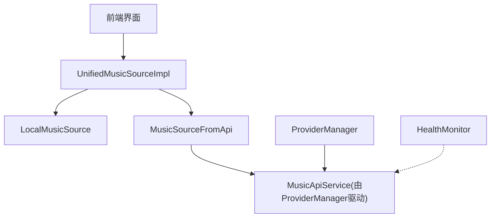
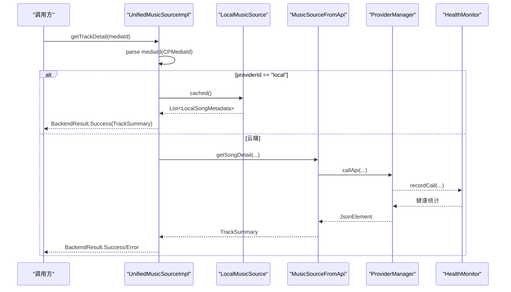
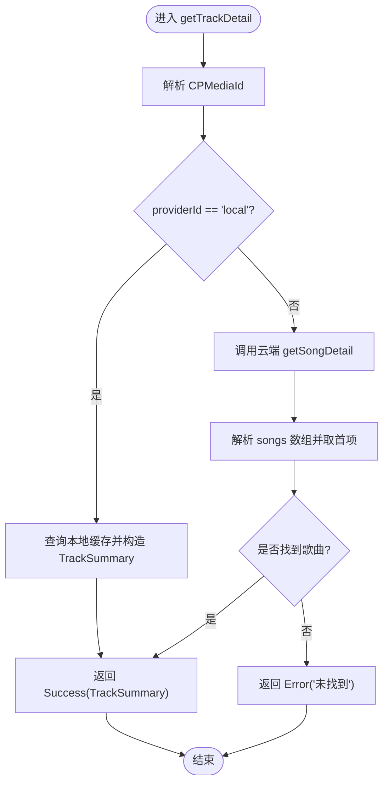
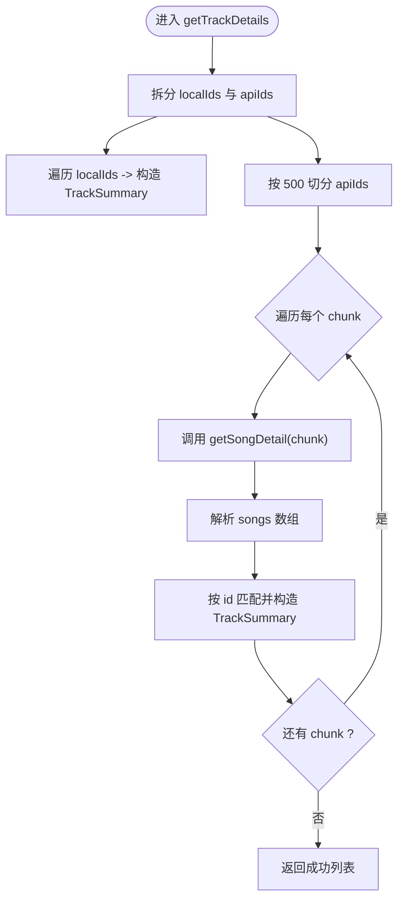
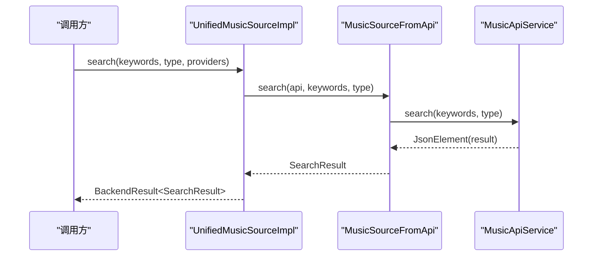
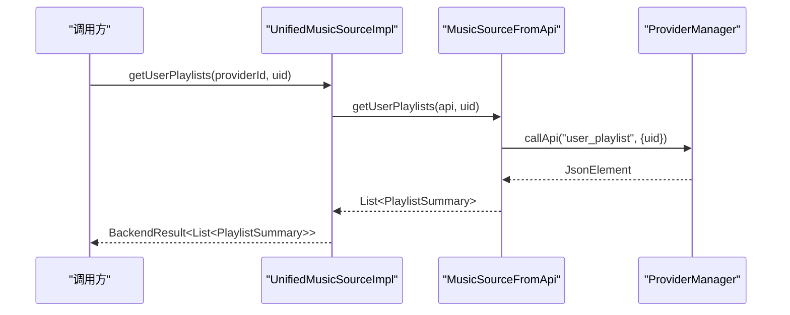
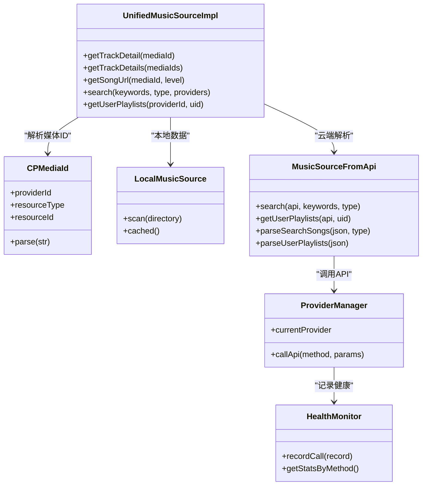

# UnifiedMusicSourceImpl 实现

<cite>
**本文引用的文件**
- [UnifiedMusicSourceImpl.kt](file://kmp-pro/src/commonMain/kotlin/cp/player/kmp/music/UnifiedMusicSourceImpl.kt)
- [UnifiedMusicSource.kt](file://kmp-pro/src/commonMain/kotlin/cp/player/kmp/music/UnifiedMusicSource.kt)
- [MusicSource.kt](file://kmp-pro/src/commonMain/kotlin/cp/player/kmp/music/MusicSource.kt)
- [MusicSourceFromApi.kt](file://kmp-pro/src/commonMain/kotlin/cp/player/kmp/music/MusicSourceFromApi.kt)
- [CPMediaId.kt](file://kmp-pro/src/commonMain/kotlin/cp/player/kmp/music/CPMediaId.kt)
- [LocalMusicSource.kt](file://kmp-pro/src/commonMain/kotlin/cp/player/kmp/local/LocalMusicSource.kt)
- [ProviderManager.kt](file://kmp-pro/src/commonMain/kotlin/cp/player/kmp/provider/ProviderManager.kt)
- [HealthMonitor.kt](file://kmp-pro/src/commonMain/kotlin/cp/player/kmp/monitor/HealthMonitor.kt)
- [BackendState.kt](file://kmp-pro/src/commonMain/kotlin/cp/player/kmp/BackendState.kt)
</cite>

## 目录
1. [简介](#简介)
2. [项目结构](#项目结构)
3. [核心组件](#核心组件)
4. [架构总览](#架构总览)
5. [详细组件分析](#详细组件分析)
6. [依赖关系分析](#依赖关系分析)
7. [性能考量](#性能考量)
8. [故障排查指南](#故障排查指南)
9. [结论](#结论)
10. [附录：使用模式与示例路径](#附录使用模式与示例路径)

## 简介
本文件围绕 UnifiedMusicSourceImpl 的实现，系统性说明统一数据源的核心逻辑：请求路由、Provider 选择策略、数据聚合算法、批量操作优化（并发与错误恢复）、搜索跨 Provider 聚合（去重、排序、分页）、用户歌单获取适配与转换、错误处理策略、超时控制与重试机制，以及性能优化建议与监控指标。文档同时提供代码级图示与“代码片段路径”以便快速定位实现位置。

## 项目结构
UnifiedMusicSourceImpl 位于 KMP 模块的 music 包中，作为前端访问音乐数据的统一入口，屏蔽本地与云端差异，并通过 MusicSourceFromApi 将 JSON 响应转换为强类型领域模型。其关键依赖包括：
- 统一接口：UnifiedMusicSource
- 领域模型：MusicSource（TrackSummary、PlaylistSummary、SearchResult 等）
- 媒体标识：CPMediaId（providerId://resourceType/resourceId）
- 本地数据源：LocalMusicSource
- API 适配层：MusicSourceFromApi（解析 JSON→领域模型）
- Provider 管理：ProviderManager（当前活跃 Provider、切换、调用封装）
- 健康监控：HealthMonitor（记录调用、统计、告警）

图表来源
- [UnifiedMusicSourceImpl.kt:15-126](file://kmp-pro/src/commonMain/kotlin/cp/player/kmp/music/UnifiedMusicSourceImpl.kt#L15-L126)
- [MusicSourceFromApi.kt:28-249](file://kmp-pro/src/commonMain/kotlin/cp/player/kmp/music/MusicSourceFromApi.kt#L28-L249)
- [ProviderManager.kt:129-141](file://kmp-pro/src/commonMain/kotlin/cp/player/kmp/provider/ProviderManager.kt#L129-L141)
- [HealthMonitor.kt:117-138](file://kmp-pro/src/commonMain/kotlin/cp/player/kmp/monitor/HealthMonitor.kt#L117-L138)

章节来源
- [UnifiedMusicSourceImpl.kt:15-126](file://kmp-pro/src/commonMain/kotlin/cp/player/kmp/music/UnifiedMusicSourceImpl.kt#L15-L126)
- [MusicSource.kt:22-143](file://kmp-pro/src/commonMain/kotlin/cp/player/kmp/music/MusicSource.kt#L22-L143)

## 核心组件
- UnifiedMusicSourceImpl：统一入口，负责按 providerId 路由到本地或云端，并聚合结果。
- CPMediaId：统一的媒体 ID 规范，形如 local://song/path 或 netease://song/id。
- LocalMusicSource：本地音乐扫描与缓存能力。
- MusicSourceFromApi：JSON→领域模型的解析桥，覆盖推荐、搜索、歌单详情、用户歌单等。
- ProviderManager：管理当前活跃 Provider，提供 callApi 封装与状态流转。
- HealthMonitor：API 调用的健康监控与统计，支持失败回退与慢响应告警。

章节来源
- [UnifiedMusicSourceImpl.kt:15-126](file://kmp-pro/src/commonMain/kotlin/cp/player/kmp/music/UnifiedMusicSourceImpl.kt#L15-L126)
- [CPMediaId.kt:1-33](file://kmp-pro/src/commonMain/kotlin/cp/player/kmp/music/CPMediaId.kt#L1-L33)
- [LocalMusicSource.kt:15-32](file://kmp-pro/src/commonMain/kotlin/cp/player/kmp/local/LocalMusicSource.kt#L15-L32)
- [MusicSourceFromApi.kt:28-249](file://kmp-pro/src/commonMain/kotlin/cp/player/kmp/music/MusicSourceFromApi.kt#L28-L249)
- [ProviderManager.kt:15-145](file://kmp-pro/src/commonMain/kotlin/cp/player/kmp/provider/ProviderManager.kt#L15-L145)
- [HealthMonitor.kt:10-138](file://kmp-pro/src/commonMain/kotlin/cp/player/kmp/monitor/HealthMonitor.kt#L10-L138)

## 架构总览
UnifiedMusicSourceImpl 通过 CPMediaId.providerId 进行请求路由：
- 若 providerId == "local"，则走本地数据源；
- 否则走云端 API，借助 MusicSourceFromApi 完成 JSON→领域模型转换。

搜索与用户歌单等方法委托给 MusicSourceFromApi，后者再调用底层 MusicApiService（由 ProviderManager 驱动）。

图表来源
- [UnifiedMusicSourceImpl.kt:20-52](file://kmp-pro/src/commonMain/kotlin/cp/player/kmp/music/UnifiedMusicSourceImpl.kt#L20-L52)
- [MusicSourceFromApi.kt:228-249](file://kmp-pro/src/commonMain/kotlin/cp/player/kmp/music/MusicSourceFromApi.kt#L228-L249)
- [ProviderManager.kt:129-141](file://kmp-pro/src/commonMain/kotlin/cp/player/kmp/provider/ProviderManager.kt#L129-L141)
- [HealthMonitor.kt:117-138](file://kmp-pro/src/commonMain/kotlin/cp/player/kmp/monitor/HealthMonitor.kt#L117-L138)

## 详细组件分析

### 请求路由机制（getTrackDetail / getSongUrl）
- 解析 mediaId 为 CPMediaId，根据 providerId 决定路由：
  - local：从 LocalMusicSource.cached() 查找匹配路径，构造 TrackSummary。
  - 非 local：调用 MusicApiService.getSongDetail/getSongUrl，解析 JSON 并返回。
- 错误处理：捕获异常并返回 BackendResult.Error，携带 cause。

图表来源
- [UnifiedMusicSourceImpl.kt:20-52](file://kmp-pro/src/commonMain/kotlin/cp/player/kmp/music/UnifiedMusicSourceImpl.kt#L20-L52)
- [CPMediaId.kt:20-30](file://kmp-pro/src/commonMain/kotlin/cp/player/kmp/music/CPMediaId.kt#L20-L30)

章节来源
- [UnifiedMusicSourceImpl.kt:20-52](file://kmp-pro/src/commonMain/kotlin/cp/player/kmp/music/UnifiedMusicSourceImpl.kt#L20-L52)
- [UnifiedMusicSourceImpl.kt:100-118](file://kmp-pro/src/commonMain/kotlin/cp/player/kmp/music/UnifiedMusicSourceImpl.kt#L100-L118)

### 批量操作优化（getTrackDetails）
- 分批请求：将非本地 IDs 按每批 500 个分片，避免 URI 过长导致失败。
- 顺序执行批次：逐批调用 getSongDetail，解析 songs 数组后映射到 TrackSummary。
- 错误恢复：单批异常被捕获并忽略，继续后续批次，最终返回已成功的汇总列表。
- 本地优先：先处理 local 类型的 IDs，直接命中缓存。

图表来源
- [UnifiedMusicSourceImpl.kt:54-98](file://kmp-pro/src/commonMain/kotlin/cp/player/kmp/music/UnifiedMusicSourceImpl.kt#L54-L98)

章节来源
- [UnifiedMusicSourceImpl.kt:54-98](file://kmp-pro/src/commonMain/kotlin/cp/player/kmp/music/UnifiedMusicSourceImpl.kt#L54-L98)

### 搜索功能的跨 Provider 聚合
- 统一入口：search(keywords, type, providers?) 委托给 MusicSourceFromApi.search。
- 聚合与解析：MusicSourceFromApi.parseSearchSongs 从 result.songs/playlists/artists 提取并构建 SearchResult。
- 去重与排序：当前实现未显式做跨 Provider 的去重与排序；如需增强，可在上层对搜索结果按名称/歌手/专辑进行合并与排序。
- 分页：当前 search 方法未暴露 offset/limit；可通过扩展参数并在 MusicApiService 层传入以支持分页。

图表来源
- [UnifiedMusicSourceImpl.kt:120-122](file://kmp-pro/src/commonMain/kotlin/cp/player/kmp/music/UnifiedMusicSourceImpl.kt#L120-L122)
- [MusicSourceFromApi.kt:86-100](file://kmp-pro/src/commonMain/kotlin/cp/player/kmp/music/MusicSourceFromApi.kt#L86-L100)
- [MusicSourceFromApi.kt:238-239](file://kmp-pro/src/commonMain/kotlin/cp/player/kmp/music/MusicSourceFromApi.kt#L238-L239)

章节来源
- [UnifiedMusicSourceImpl.kt:120-122](file://kmp-pro/src/commonMain/kotlin/cp/player/kmp/music/UnifiedMusicSourceImpl.kt#L120-L122)
- [MusicSourceFromApi.kt:86-100](file://kmp-pro/src/commonMain/kotlin/cp/player/kmp/music/MusicSourceFromApi.kt#L86-L100)

### 用户歌单获取的实现细节
- 统一入口：getUserPlaylists(providerId, uid) 委托给 MusicSourceFromApi.getUserPlaylists。
- 数据转换：MusicSourceFromApi.parseUserPlaylists 兼容 playlist/playlists/data 字段，提取 PlaylistSummary 列表。
- Provider 适配：实际 Provider 的选择由 ProviderManager.currentProvider 决定，callApi 会映射到具体 Provider 的方法名。

图表来源
- [UnifiedMusicSourceImpl.kt:124-126](file://kmp-pro/src/commonMain/kotlin/cp/player/kmp/music/UnifiedMusicSourceImpl.kt#L124-L126)
- [MusicSourceFromApi.kt:139-147](file://kmp-pro/src/commonMain/kotlin/cp/player/kmp/music/MusicSourceFromApi.kt#L139-L147)
- [MusicSourceFromApi.kt:241-242](file://kmp-pro/src/commonMain/kotlin/cp/player/kmp/music/MusicSourceFromApi.kt#L241-L242)
- [ProviderManager.kt:129-141](file://kmp-pro/src/commonMain/kotlin/cp/player/kmp/provider/ProviderManager.kt#L129-L141)

章节来源
- [UnifiedMusicSourceImpl.kt:124-126](file://kmp-pro/src/commonMain/kotlin/cp/player/kmp/music/UnifiedMusicSourceImpl.kt#L124-L126)
- [MusicSourceFromApi.kt:139-147](file://kmp-pro/src/commonMain/kotlin/cp/player/kmp/music/MusicSourceFromApi.kt#L139-L147)

### 错误处理策略、超时控制与重试机制
- 错误封装：所有可失败操作返回 BackendResult（Success/Error/Unsupported），便于 UI 穷举处理。
- 异常捕获：在 getTrackDetail/getSongUrl 中使用 try-catch，返回 Error 并附带 cause。
- 不支持判定：MusicSourceFromApi.toMusicResult 根据 code/status 判断是否 Unsupported（如 -1、501、404）。
- 超时与重试：
  - 当前 UnifiedMusicSourceImpl 未内置超时与重试；
  - 更底层的 ProviderManager.callApi 与健康监控记录调用耗时与失败信息；
  - 播放控制器在加载失败时具备音质降级重试（standard 级别），属于播放层容错。
- 建议：
  - 在 getTrackDetails 中引入并发（如 coroutineScope + async）以提升吞吐；
  - 增加超时控制（例如 per-batch 超时）与指数退避重试；
  - 结合 HealthMonitor 的 p95 延迟与失败率阈值触发自动降级。

章节来源
- [UnifiedMusicSourceImpl.kt:20-52](file://kmp-pro/src/commonMain/kotlin/cp/player/kmp/music/UnifiedMusicSourceImpl.kt#L20-L52)
- [UnifiedMusicSourceImpl.kt:100-118](file://kmp-pro/src/commonMain/kotlin/cp/player/kmp/music/UnifiedMusicSourceImpl.kt#L100-L118)
- [MusicSourceFromApi.kt:31-61](file://kmp-pro/src/commonMain/kotlin/cp/player/kmp/music/MusicSourceFromApi.kt#L31-L61)
- [ProviderManager.kt:129-141](file://kmp-pro/src/commonMain/kotlin/cp/player/kmp/provider/ProviderManager.kt#L129-L141)
- [BackendState.kt:59-72](file://kmp-pro/src/commonMain/kotlin/cp/player/kmp/BackendState.kt#L59-L72)

### 数据聚合与解析
- TrackSummary 构造：
  - 本地：从 LocalSongMetadata 映射 name/artist/album/durationMs。
  - 云端：从 JSON 的 ar/artists、al/album、name、dt/duration 等字段提取。
- URL 提取：
  - 优先取 redirectUrl；
  - 递归查找 url/picUrl/coverImgUrl/avatarUrl 等键值，过滤非法 URL。
- 搜索与歌单：
  - 统一从 result 或 data 字段提取对应数组，并映射为领域模型。

章节来源
- [UnifiedMusicSourceImpl.kt:130-174](file://kmp-pro/src/commonMain/kotlin/cp/player/kmp/music/UnifiedMusicSourceImpl.kt#L130-L174)
- [MusicSourceFromApi.kt:188-224](file://kmp-pro/src/commonMain/kotlin/cp/player/kmp/music/MusicSourceFromApi.kt#L188-L224)

## 依赖关系分析
- UnifiedMusicSourceImpl 依赖：
  - CPMediaId：用于路由与资源定位；
  - LocalMusicSource：本地数据读取；
  - MusicApiService（通过 MusicSourceFromApi）：云端数据获取；
  - ProviderManager：当前 Provider 的选择与调用；
  - HealthMonitor：记录调用健康度。
- 耦合与内聚：
  - UnifiedMusicSourceImpl 仅关注路由与聚合，解析逻辑下沉至 MusicSourceFromApi，提升内聚性；
  - ProviderManager 抽象了 Provider 切换与调用，降低上层复杂度；
  - HealthMonitor 独立于业务逻辑，提供可观测性。

图表来源
- [UnifiedMusicSourceImpl.kt:15-126](file://kmp-pro/src/commonMain/kotlin/cp/player/kmp/music/UnifiedMusicSourceImpl.kt#L15-L126)
- [CPMediaId.kt:1-33](file://kmp-pro/src/commonMain/kotlin/cp/player/kmp/music/CPMediaId.kt#L1-L33)
- [LocalMusicSource.kt:15-32](file://kmp-pro/src/commonMain/kotlin/cp/player/kmp/local/LocalMusicSource.kt#L15-L32)
- [MusicSourceFromApi.kt:28-249](file://kmp-pro/src/commonMain/kotlin/cp/player/kmp/music/MusicSourceFromApi.kt#L28-L249)
- [ProviderManager.kt:129-141](file://kmp-pro/src/commonMain/kotlin/cp/player/kmp/provider/ProviderManager.kt#L129-L141)
- [HealthMonitor.kt:117-138](file://kmp-pro/src/commonMain/kotlin/cp/player/kmp/monitor/HealthMonitor.kt#L117-L138)

章节来源
- [UnifiedMusicSourceImpl.kt:15-126](file://kmp-pro/src/commonMain/kotlin/cp/player/kmp/music/UnifiedMusicSourceImpl.kt#L15-L126)
- [MusicSourceFromApi.kt:28-249](file://kmp-pro/src/commonMain/kotlin/cp/player/kmp/music/MusicSourceFromApi.kt#L28-L249)

## 性能考量
- 批量请求优化：
  - 当前实现按 500 个 IDs 分批顺序调用，避免 URI 过长；
  - 建议引入并发（协程并行）与限流（令牌桶/信号量）以提升吞吐，同时保证错误隔离。
- 超时控制：
  - 建议在 MusicApiService 层配置连接/读取超时，并在 UnifiedMusicSourceImpl 中对每批设置整体超时；
  - 结合 HealthMonitor 的慢响应告警（SLOW_RESPONSE）动态调整超时。
- 重试机制：
  - 针对网络抖动或临时不可用，采用指数退避重试（最多 2 次）；
  - 区分可重试错误（超时、5xx）与不可重试错误（4xx 客户端错误）。
- 缓存策略：
  - 本地数据通过 LocalMusicSource.cached() 减少重复扫描；
  - 云端可考虑短期缓存热门歌曲详情与 URL（注意过期策略）。
- 监控指标：
  - 成功率、平均延迟、P95 延迟、失败原因分布、回退次数；
  - 通过 HealthMonitor.getStatsByMethod() 与 getAllStats() 获取。

[本节为通用性能指导，不直接分析具体文件]

## 故障排查指南
- 常见问题定位：
  - 媒体 ID 格式错误：检查 CPMediaId.parse 抛出的异常；
  - 本地歌曲未找到：确认 LocalMusicSource.cached() 是否包含该路径；
  - 云端返回不支持：查看 MusicSourceFromApi.toMusicResult 的 unsupportedCodes；
  - URL 为空或无效：检查 extractUrl/findUrlRecursive 的返回值。
- 监控与日志：
  - 使用 HealthMonitor.recordCall 记录每次调用耗时与失败信息；
  - 通过 HealthMonitor.getRecentRecords 获取最近失败记录；
  - 通过 HealthMonitor.getStatsByMethod 分析各方法的健康状况。
- 回退与降级：
  - 播放层在加载失败时尝试 standard 音质重试；
  - 云端调用失败时可考虑切换到备用 Provider（由 ProviderManager 管理）。

章节来源
- [UnifiedMusicSourceImpl.kt:20-52](file://kmp-pro/src/commonMain/kotlin/cp/player/kmp/music/UnifiedMusicSourceImpl.kt#L20-L52)
- [UnifiedMusicSourceImpl.kt:100-118](file://kmp-pro/src/commonMain/kotlin/cp/player/kmp/music/UnifiedMusicSourceImpl.kt#L100-L118)
- [MusicSourceFromApi.kt:31-61](file://kmp-pro/src/commonMain/kotlin/cp/player/kmp/music/MusicSourceFromApi.kt#L31-L61)
- [HealthMonitor.kt:159-216](file://kmp-pro/src/commonMain/kotlin/cp/player/kmp/monitor/HealthMonitor.kt#L159-L216)

## 结论
UnifiedMusicSourceImpl 提供了统一的数据源入口，通过 CPMediaId 实现本地与云端的透明路由，并利用 MusicSourceFromApi 完成 JSON 到领域模型的转换。当前实现已具备基本的批量处理与错误恢复能力，但尚未引入并发与超时控制。建议在未来版本中增强并发、超时与重试机制，并结合 HealthMonitor 提供更完善的可观测性与自适应降级策略。

[本节为总结性内容，不直接分析具体文件]

## 附录：使用模式与示例路径
- 获取单曲详情：
  - 参考路径：[getTrackDetail:20-52](file://kmp-pro/src/commonMain/kotlin/cp/player/kmp/music/UnifiedMusicSourceImpl.kt#L20-L52)
- 批量获取详情：
  - 参考路径：[getTrackDetails:54-98](file://kmp-pro/src/commonMain/kotlin/cp/player/kmp/music/UnifiedMusicSourceImpl.kt#L54-L98)
- 获取播放地址：
  - 参考路径：[getSongUrl:100-118](file://kmp-pro/src/commonMain/kotlin/cp/player/kmp/music/UnifiedMusicSourceImpl.kt#L100-L118)
- 搜索：
  - 参考路径：[search:120-122](file://kmp-pro/src/commonMain/kotlin/cp/player/kmp/music/UnifiedMusicSourceImpl.kt#L120-L122), [parseSearchSongs:86-100](file://kmp-pro/src/commonMain/kotlin/cp/player/kmp/music/MusicSourceFromApi.kt#L86-L100)
- 用户歌单：
  - 参考路径：[getUserPlaylists:124-126](file://kmp-pro/src/commonMain/kotlin/cp/player/kmp/music/UnifiedMusicSourceImpl.kt#L124-L126), [parseUserPlaylists:139-147](file://kmp-pro/src/commonMain/kotlin/cp/player/kmp/music/MusicSourceFromApi.kt#L139-L147)
- 媒体 ID 解析：
  - 参考路径：[CPMediaId.parse:20-30](file://kmp-pro/src/commonMain/kotlin/cp/player/kmp/music/CPMediaId.kt#L20-L30)
- 健康监控：
  - 参考路径：[recordCall:117-138](file://kmp-pro/src/commonMain/kotlin/cp/player/kmp/monitor/HealthMonitor.kt#L117-L138), [getStatsByMethod:180-216](file://kmp-pro/src/commonMain/kotlin/cp/player/kmp/monitor/HealthMonitor.kt#L180-L216)