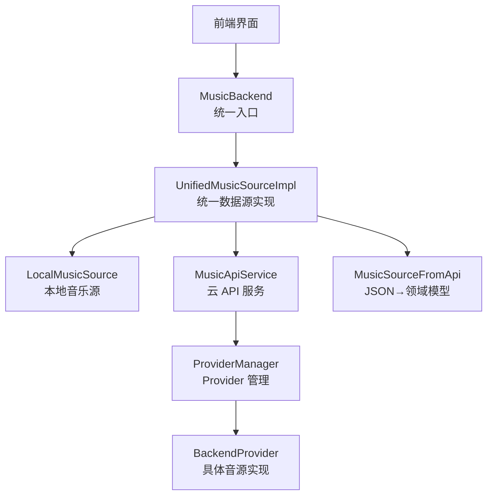
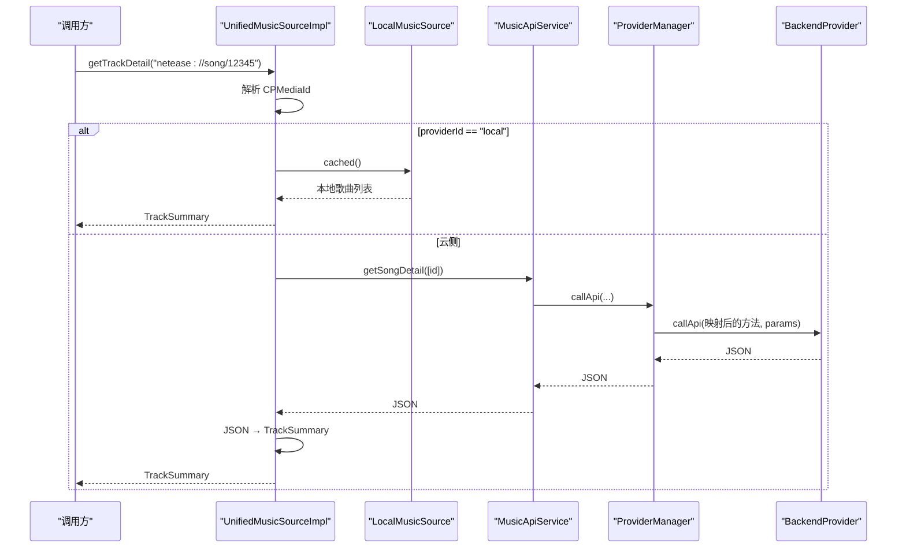
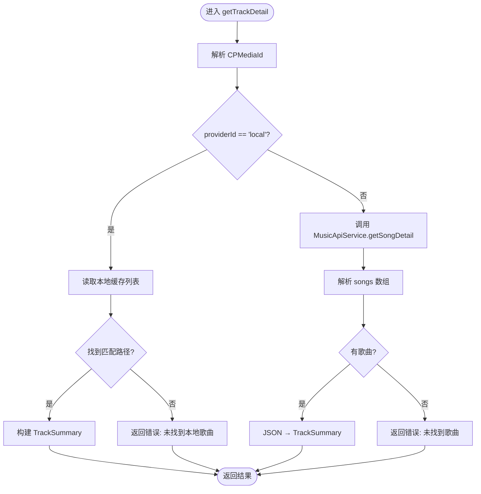
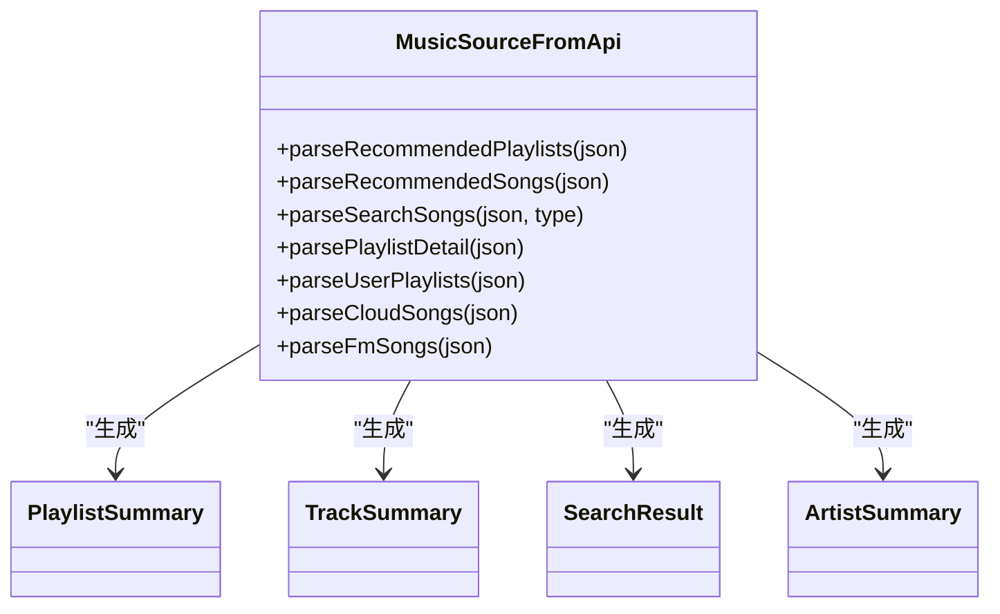
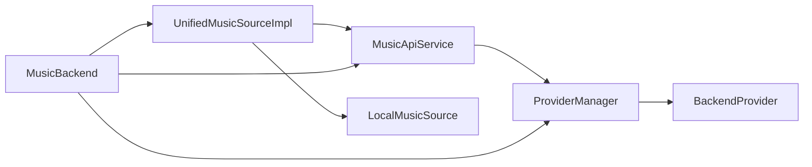

# 统一数据源

<cite>
**本文引用的文件**
- [UnifiedMusicSource.kt](file://kmp-pro/src/commonMain/kotlin/cp/player/kmp/music/UnifiedMusicSource.kt)
- [UnifiedMusicSourceImpl.kt](file://kmp-pro/src/commonMain/kotlin/cp/player/kmp/music/UnifiedMusicSourceImpl.kt)
- [CPMediaId.kt](file://kmp-pro/src/commonMain/kotlin/cp/player/kmp/music/CPMediaId.kt)
- [MusicSourceFromApi.kt](file://kmp-pro/src/commonMain/kotlin/cp/player/kmp/music/MusicSourceFromApi.kt)
- [MusicSource.kt](file://kmp-pro/src/commonMain/kotlin/cp/player/kmp/music/MusicSource.kt)
- [LocalMusicSource.kt](file://kmp-pro/src/commonMain/kotlin/cp/player/kmp/local/LocalMusicSource.kt)
- [MusicApiService.kt](file://kmp-pro/src/commonMain/kotlin/cp/player/kmp/api/MusicApiService.kt)
- [MusicBackend.kt](file://kmp-pro/src/commonMain/kotlin/cp/player/kmp/MusicBackend.kt)
- [ProviderManager.kt](file://kmp-pro/src/commonMain/kotlin/cp/player/kmp/provider/ProviderManager.kt)
- [BackendProvider.kt](file://kmp-pro/src/commonMain/kotlin/cp/player/kmp/provider/BackendProvider.kt)
</cite>

## 目录
1. [简介](#简介)
2. [项目结构](#项目结构)
3. [核心组件](#核心组件)
4. [架构总览](#架构总览)
5. [详细组件分析](#详细组件分析)
6. [依赖关系分析](#依赖关系分析)
7. [性能考量](#性能考量)
8. [故障排查指南](#故障排查指南)
9. [结论](#结论)
10. [附录：扩展与最佳实践](#附录：扩展与最佳实践)

## 简介
本技术文档围绕 CPPlayer-KMP 的统一数据源系统，系统性阐述 UnifiedMusicSource 的设计理念、CPMediaId 的 ID 规范与路由机制、UnifiedMusicSourceImpl 的数据分发策略、MusicSourceFromApi 的云 API 到领域模型的转换方式，以及数据模型版本兼容与迁移策略。同时提供数据源扩展指南、使用示例与最佳实践，帮助开发者在 KMP 环境下以统一接口屏蔽底层 Provider 差异，实现本地与云端音乐资源的无缝访问。

## 项目结构
统一数据源位于 kmp-pro 模块的 music 包中，围绕以下关键文件组织：
- 统一接口与实现：UnifiedMusicSource、UnifiedMusicSourceImpl
- 媒体标识：CPMediaId
- 云侧解析桥：MusicSourceFromApi
- 领域模型与旧版抽象：MusicSource（含 PlaylistSummary、TrackSummary、SongUrl、SearchResult、ArtistSummary）
- 本地数据源：LocalMusicSource
- 云 API 服务：MusicApiService
- 后端入口与装配：MusicBackend
- Provider 管理与类型：ProviderManager、BackendProvider

图表来源
- [MusicBackend.kt:104-129](file://kmp-pro/src/commonMain/kotlin/cp/player/kmp/MusicBackend.kt#L104-L129)
- [UnifiedMusicSourceImpl.kt:15-126](file://kmp-pro/src/commonMain/kotlin/cp/player/kmp/music/UnifiedMusicSourceImpl.kt#L15-L126)
- [MusicApiService.kt:1-23](file://kmp-pro/src/commonMain/kotlin/cp/player/kmp/api/MusicApiService.kt#L1-L23)
- [ProviderManager.kt:15-30](file://kmp-pro/src/commonMain/kotlin/cp/player/kmp/provider/ProviderManager.kt#L15-L30)
- [BackendProvider.kt:5-23](file://kmp-pro/src/commonMain/kotlin/cp/player/kmp/provider/BackendProvider.kt#L5-L23)

章节来源
- [MusicBackend.kt:104-129](file://kmp-pro/src/commonMain/kotlin/cp/player/kmp/MusicBackend.kt#L104-L129)
- [UnifiedMusicSource.kt:1-39](file://kmp-pro/src/commonMain/kotlin/cp/player/kmp/music/UnifiedMusicSource.kt#L1-L39)
- [MusicSource.kt:1-132](file://kmp-pro/src/commonMain/kotlin/cp/player/kmp/music/MusicSource.kt#L1-L132)

## 核心组件
- UnifiedMusicSource：定义统一的音乐数据访问接口，所有资源定位采用 CPMediaId（字符串形式），屏蔽 Provider 差异。
- UnifiedMusicSourceImpl：根据 CPMediaId 的 providerId 进行路由，将请求分发到本地或云 API；负责 JSON 到 TrackSummary/SongUrl 等模型的转换。
- CPMediaId：统一媒体 ID 格式 {providerId}://{resourceType}/{resourceId}，用于跨 Provider 的资源寻址。
- MusicSourceFromApi：将云 API 返回的 JsonElement 转换为强类型领域模型，处理多字段兼容与错误码映射。
- LocalMusicSource：平台无关的本地音乐扫描与缓存接口。
- MusicApiService：统一云 API 调用入口，内部通过 ProviderManager 转发至具体 BackendProvider。
- MusicBackend：后端统一入口，装配 UnifiedMusicSourceImpl、MusicApiService、ProviderManager 等，并暴露 unifiedSource。

章节来源
- [UnifiedMusicSource.kt:1-39](file://kmp-pro/src/commonMain/kotlin/cp/player/kmp/music/UnifiedMusicSource.kt#L1-L39)
- [UnifiedMusicSourceImpl.kt:15-126](file://kmp-pro/src/commonMain/kotlin/cp/player/kmp/music/UnifiedMusicSourceImpl.kt#L15-L126)
- [CPMediaId.kt:1-33](file://kmp-pro/src/commonMain/kotlin/cp/player/kmp/music/CPMediaId.kt#L1-L33)
- [MusicSourceFromApi.kt:16-26](file://kmp-pro/src/commonMain/kotlin/cp/player/kmp/music/MusicSourceFromApi.kt#L16-L26)
- [LocalMusicSource.kt:1-48](file://kmp-pro/src/commonMain/kotlin/cp/player/kmp/local/LocalMusicSource.kt#L1-L48)
- [MusicApiService.kt:1-23](file://kmp-pro/src/commonMain/kotlin/cp/player/kmp/api/MusicApiService.kt#L1-L23)
- [MusicBackend.kt:104-129](file://kmp-pro/src/commonMain/kotlin/cp/player/kmp/MusicBackend.kt#L104-L129)

## 架构总览
统一数据源通过“统一接口 + 统一 ID + 路由分发 + 模型转换”四层设计，屏蔽底层 Provider 差异：
- 统一接口：UnifiedMusicSource 暴露 getTrackDetail/getSongUrl/search/getUserPlaylists 等方法。
- 统一 ID：CPMediaId 以 providerId 区分来源，支持 local 与任意 Provider。
- 路由分发：UnifiedMusicSourceImpl 按 providerId 选择本地或云 API。
- 模型转换：MusicSourceFromApi 将 JSON 响应转为领域模型，兼容不同字段名与错误码。

图表来源
- [UnifiedMusicSourceImpl.kt:20-52](file://kmp-pro/src/commonMain/kotlin/cp/player/kmp/music/UnifiedMusicSourceImpl.kt#L20-L52)
- [MusicApiService.kt:150-188](file://kmp-pro/src/commonMain/kotlin/cp/player/kmp/api/MusicApiService.kt#L150-L188)
- [ProviderManager.kt:123-141](file://kmp-pro/src/commonMain/kotlin/cp/player/kmp/provider/ProviderManager.kt#L123-L141)
- [BackendProvider.kt:70-77](file://kmp-pro/src/commonMain/kotlin/cp/player/kmp/provider/BackendProvider.kt#L70-L77)

## 详细组件分析

### UnifiedMusicSource 与 UnifiedMusicSourceImpl
- 设计理念：以 CPMediaId 作为唯一资源定位符，屏蔽 Provider 差异；对外仅暴露统一方法签名。
- 路由逻辑：
  - 若 providerId 为 "local"，从 LocalMusicSource.cached() 查找匹配路径，构造 TrackSummary。
  - 否则调用 MusicApiService.getSongDetail/getSongUrl，并将 JSON 转换为领域模型。
- 批量处理：getTrackDetails 对 API 请求进行分块（chunked），避免 URI 过长。
- URL 提取：extractUrl/findUrlRecursive 递归查找 JSON 中的 URL 字段，兼容 redirectUrl/url/picUrl 等命名。

图表来源
- [UnifiedMusicSourceImpl.kt:20-52](file://kmp-pro/src/commonMain/kotlin/cp/player/kmp/music/UnifiedMusicSourceImpl.kt#L20-L52)
- [UnifiedMusicSourceImpl.kt:130-144](file://kmp-pro/src/commonMain/kotlin/cp/player/kmp/music/UnifiedMusicSourceImpl.kt#L130-L144)

章节来源
- [UnifiedMusicSource.kt:1-39](file://kmp-pro/src/commonMain/kotlin/cp/player/kmp/music/UnifiedMusicSource.kt#L1-L39)
- [UnifiedMusicSourceImpl.kt:20-126](file://kmp-pro/src/commonMain/kotlin/cp/player/kmp/music/UnifiedMusicSourceImpl.kt#L20-L126)

### CPMediaId 的设计原理与路由机制
- ID 格式：{providerId}://{resourceType}/{resourceId}
  - 本地音乐示例：local://song//storage/emulated/0/Music/song.mp3
  - 网易云示例：netease://song/12345
- 解析规则：split("://", limit=2) 分离 providerId 与资源部分；再 split("/", limit=2) 分离 resourceType 与 resourceId。
- 路由机制：UnifiedMusicSourceImpl 依据 providerId 决定走本地还是云 API；resourceType 可用于未来扩展（如 playlist、artist）。

章节来源
- [CPMediaId.kt:1-33](file://kmp-pro/src/commonMain/kotlin/cp/player/kmp/music/CPMediaId.kt#L1-L33)
- [UnifiedMusicSourceImpl.kt:20-25](file://kmp-pro/src/commonMain/kotlin/cp/player/kmp/music/UnifiedMusicSourceImpl.kt#L20-L25)

### MusicSourceFromApi 的领域模型转换
- 目标：将 MusicApiService 返回的 JsonElement 转换为强类型领域模型（PlaylistSummary、TrackSummary、SearchResult 等）。
- 兼容性策略：
  - 优先识别兼容字段名（如 ar/artists、al/album、name/song 等），找不到则回退到 null/Empty。
  - code 判定：codeOf 兼容 code/status；isSuccess 接受 200/0/201/301。
  - 不支持的 API：当 code 属于预设集合（-1、501、404）时返回 BackendResult.Unsupported。
- 覆盖场景：推荐歌单、日推、搜索、歌单详情、用户歌单、云盘歌曲、私人 FM。

图表来源
- [MusicSourceFromApi.kt:64-122](file://kmp-pro/src/commonMain/kotlin/cp/player/kmp/music/MusicSourceFromApi.kt#L64-L122)
- [MusicSourceFromApi.kt:163-199](file://kmp-pro/src/commonMain/kotlin/cp/player/kmp/music/MusicSourceFromApi.kt#L163-L199)

章节来源
- [MusicSourceFromApi.kt:16-26](file://kmp-pro/src/commonMain/kotlin/cp/player/kmp/music/MusicSourceFromApi.kt#L16-L26)
- [MusicSourceFromApi.kt:29-60](file://kmp-pro/src/commonMain/kotlin/cp/player/kmp/music/MusicSourceFromApi.kt#L29-L60)
- [MusicSourceFromApi.kt:64-122](file://kmp-pro/src/commonMain/kotlin/cp/player/kmp/music/MusicSourceFromApi.kt#L64-L122)
- [MusicSourceFromApi.kt:163-199](file://kmp-pro/src/commonMain/kotlin/cp/player/kmp/music/MusicSourceFromApi.kt#L163-L199)

### 数据模型与版本兼容性
- 领域模型：PlaylistSummary、TrackSummary、SongUrl、SearchResult、ArtistSummary 定义于 MusicSource.kt。
- 兼容性策略：
  - 字段兼容：toTrackSummary/toPlaylistSummary 等多处兼容多种字段名（如 ar/artists、al/album、picUrl/coverImgUrl）。
  - 错误码兼容：codeOf 兼容 code/status；isSuccess 接受多个成功码。
  - 不支持处理：BackendResult.Unsupported 明确标记功能不被当前 Provider 支持。
- 迁移策略：
  - 逐步从 MusicApiService 的 JsonElement 返回迁移到强类型 MusicResult<T>。
  - 新增解析器时遵循“先兼容后弃用”的原则，保留旧字段读取路径。

章节来源
- [MusicSource.kt:65-132](file://kmp-pro/src/commonMain/kotlin/cp/player/kmp/music/MusicSource.kt#L65-L132)
- [MusicSourceFromApi.kt:29-60](file://kmp-pro/src/commonMain/kotlin/cp/player/kmp/music/MusicSourceFromApi.kt#L29-L60)
- [MusicSourceFromApi.kt:163-199](file://kmp-pro/src/commonMain/kotlin/cp/player/kmp/music/MusicSourceFromApi.kt#L163-L199)

### 数据源扩展指南
- 添加新的 Provider：
  - 实现 BackendProvider（HTTP/JNI/BINARY），并在 ProviderManager 中注册。
  - 通过 MusicApiService 暴露所需 API，确保返回 JSON 符合 MusicSourceFromApi 的兼容字段集。
- 自定义数据转换逻辑：
  - 在 MusicSourceFromApi 中添加新的 parse* 方法，遵循 toMusicResult 的错误码与兼容性策略。
  - 在 UnifiedMusicSourceImpl 中增加路由分支（如需支持新 providerId）。
- 本地数据源扩展：
  - 实现 LocalMusicSource 的 scan/cached，确保 path 作为唯一标识，便于 CPMediaId 路由。

章节来源
- [BackendProvider.kt:5-23](file://kmp-pro/src/commonMain/kotlin/cp/player/kmp/provider/BackendProvider.kt#L5-L23)
- [ProviderManager.kt:15-30](file://kmp-pro/src/commonMain/kotlin/cp/player/kmp/provider/ProviderManager.kt#L15-L30)
- [MusicSourceFromApi.kt:16-26](file://kmp-pro/src/commonMain/kotlin/cp/player/kmp/music/MusicSourceFromApi.kt#L16-L26)
- [LocalMusicSource.kt:1-48](file://kmp-pro/src/commonMain/kotlin/cp/player/kmp/local/LocalMusicSource.kt#L1-L48)

## 依赖关系分析
- 耦合与内聚：
  - UnifiedMusicSourceImpl 高内聚地封装了路由与转换逻辑，低耦合地依赖 MusicApiService 与 LocalMusicSource。
  - MusicSourceFromApi 专注于 JSON→模型转换，与具体 Provider 解耦。
- 直接/间接依赖：
  - UnifiedMusicSourceImpl → MusicApiService → ProviderManager → BackendProvider
  - UnifiedMusicSourceImpl → LocalMusicSource
  - MusicBackend 装配上述组件，提供统一入口 unifiedSource。
- 外部集成点：
  - ProviderManager 通过 PlatformSupport 管理端口与启动/停止 Provider。
  - Cookie 隔离由 ProviderCookieStorage 实现，按 providerId 持久化。

图表来源
- [UnifiedMusicSourceImpl.kt:15-126](file://kmp-pro/src/commonMain/kotlin/cp/player/kmp/music/UnifiedMusicSourceImpl.kt#L15-L126)
- [MusicApiService.kt:1-23](file://kmp-pro/src/commonMain/kotlin/cp/player/kmp/api/MusicApiService.kt#L1-L23)
- [ProviderManager.kt:15-30](file://kmp-pro/src/commonMain/kotlin/cp/player/kmp/provider/ProviderManager.kt#L15-L30)
- [MusicBackend.kt:104-129](file://kmp-pro/src/commonMain/kotlin/cp/player/kmp/MusicBackend.kt#L104-L129)

章节来源
- [UnifiedMusicSourceImpl.kt:15-126](file://kmp-pro/src/commonMain/kotlin/cp/player/kmp/music/UnifiedMusicSourceImpl.kt#L15-L126)
- [MusicApiService.kt:1-23](file://kmp-pro/src/commonMain/kotlin/cp/player/kmp/api/MusicApiService.kt#L1-L23)
- [ProviderManager.kt:15-30](file://kmp-pro/src/commonMain/kotlin/cp/player/kmp/provider/ProviderManager.kt#L15-L30)
- [MusicBackend.kt:104-129](file://kmp-pro/src/commonMain/kotlin/cp/player/kmp/MusicBackend.kt#L104-L129)

## 性能考量
- 批量请求分块：getTrackDetails 对 API 请求进行 chunked(500)，避免 URI 过长导致失败。
- 本地缓存：LocalMusicSource.cached() 避免重复扫描，提升本地资源访问速度。
- 网络优化：MusicApiService 内部自动注入 cookie，减少重复认证开销；ProviderManager 自动端口检测与重试。
- 模型转换效率：MusicSourceFromApi 使用轻量 JSON 字段读取，避免不必要的对象创建。

[本节为通用性能讨论，不直接分析具体文件]

## 故障排查指南
- 常见错误与处理：
  - 本地歌曲未找到：UnifiedMusicSourceImpl 返回错误信息，检查 LocalMusicSource.cached() 是否包含对应 path。
  - 云 API 失败：MusicSourceFromApi 将非成功码映射为 BackendResult.Error，并携带 msg/code；Unsupported 表示该 Provider 不支持此功能。
  - URL 无效：extractUrl 要求 http 开头且长度合理，否则返回错误。
- 调试建议：
  - 打印 CPMediaId 解析结果，确认 providerId/resourceId 正确。
  - 检查 ProviderManager.callApi 的返回值，确认 apiMap 映射是否正确。
  - 观察 MusicBackend.stateFlow，确认 Provider 状态是否为 Ready。

章节来源
- [UnifiedMusicSourceImpl.kt:20-52](file://kmp-pro/src/commonMain/kotlin/cp/player/kmp/music/UnifiedMusicSourceImpl.kt#L20-L52)
- [UnifiedMusicSourceImpl.kt:100-118](file://kmp-pro/src/commonMain/kotlin/cp/player/kmp/music/UnifiedMusicSourceImpl.kt#L100-L118)
- [MusicSourceFromApi.kt:29-60](file://kmp-pro/src/commonMain/kotlin/cp/player/kmp/music/MusicSourceFromApi.kt#L29-L60)
- [ProviderManager.kt:123-141](file://kmp-pro/src/commonMain/kotlin/cp/player/kmp/provider/ProviderManager.kt#L123-L141)

## 结论
统一数据源系统通过 UnifiedMusicSource、CPMediaId、UnifiedMusicSourceImpl 与 MusicSourceFromApi 的协同，实现了本地与云端音乐资源的统一访问。其设计强调接口抽象、ID 规范、路由分发与模型转换，具备良好的可扩展性与兼容性。结合 MusicBackend 的装配与管理，开发者可以以最小成本接入新 Provider，并通过一致的领域模型进行上层业务开发。

[本节为总结性内容，不直接分析具体文件]

## 附录：扩展与最佳实践
- 添加新 Provider：
  - 实现 BackendProvider，配置 apiMap 映射。
  - 在 ProviderManager 中注册并确保 isReady() 正确。
  - 通过 MusicApiService 暴露 API，返回符合 MusicSourceFromApi 兼容格式的 JSON。
- 自定义转换逻辑：
  - 在 MusicSourceFromApi 中添加 parse* 方法，遵循 toMusicResult 的错误处理与字段兼容策略。
  - 在 UnifiedMusicSourceImpl 中增加路由分支，支持新的 providerId。
- 使用示例：
  - 获取歌曲详情：unifiedSource.getTrackDetail("netease://song/12345")
  - 批量获取：unifiedSource.getTrackDetails(listOf("netease://song/1", "local://song//path/to/file"))
  - 获取播放地址：unifiedSource.getSongUrl("netease://song/12345", "standard")
  - 搜索：unifiedSource.search("关键词", type=1)
  - 用户歌单：unifiedSource.getUserPlaylists("netease", uid=123456)
- 最佳实践：
  - 始终使用 CPMediaId 进行资源定位，避免硬编码 Provider 名称。
  - 对批量请求进行分块，避免 URI 过长。
  - 利用 MusicSourceFromApi 的兼容性策略，逐步迁移旧字段到新字段。
  - 通过 MusicBackend.stateFlow 监控 Provider 状态，及时处理错误与恢复。

章节来源
- [UnifiedMusicSource.kt:1-39](file://kmp-pro/src/commonMain/kotlin/cp/player/kmp/music/UnifiedMusicSource.kt#L1-L39)
- [UnifiedMusicSourceImpl.kt:20-126](file://kmp-pro/src/commonMain/kotlin/cp/player/kmp/music/UnifiedMusicSourceImpl.kt#L20-L126)
- [MusicSourceFromApi.kt:16-26](file://kmp-pro/src/commonMain/kotlin/cp/player/kmp/music/MusicSourceFromApi.kt#L16-L26)
- [MusicBackend.kt:104-129](file://kmp-pro/src/commonMain/kotlin/cp/player/kmp/MusicBackend.kt#L104-L129)