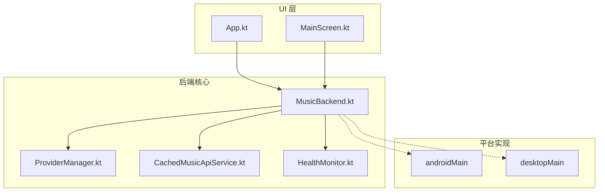
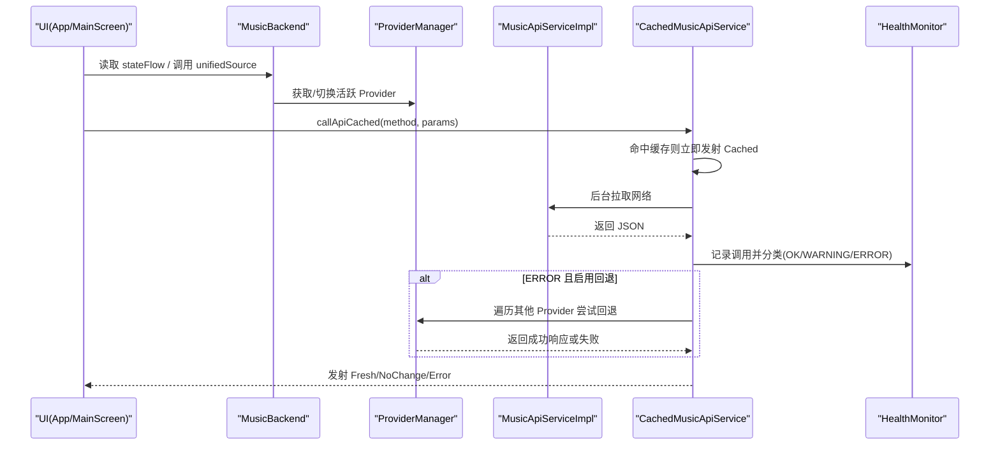
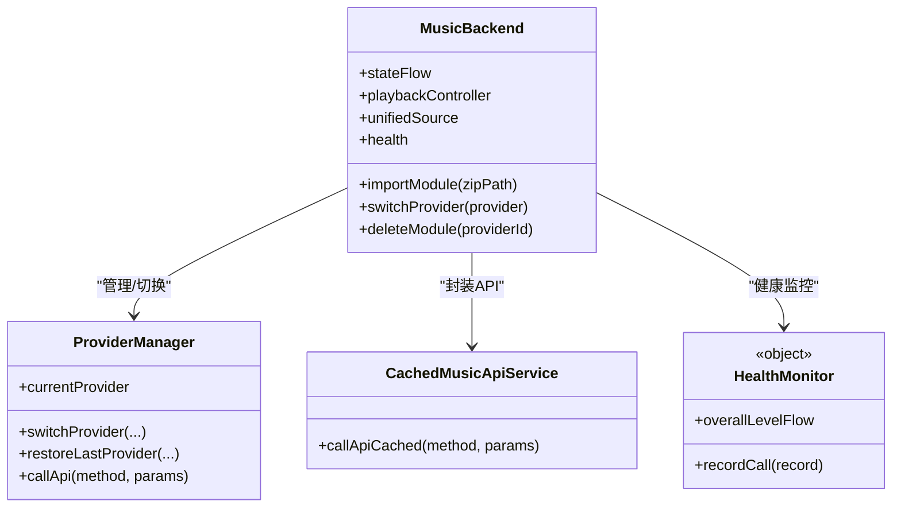
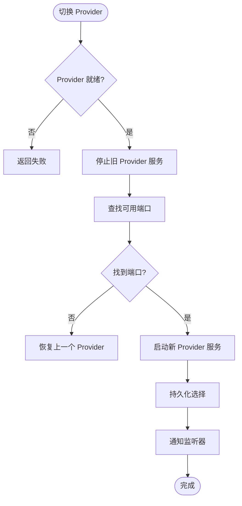
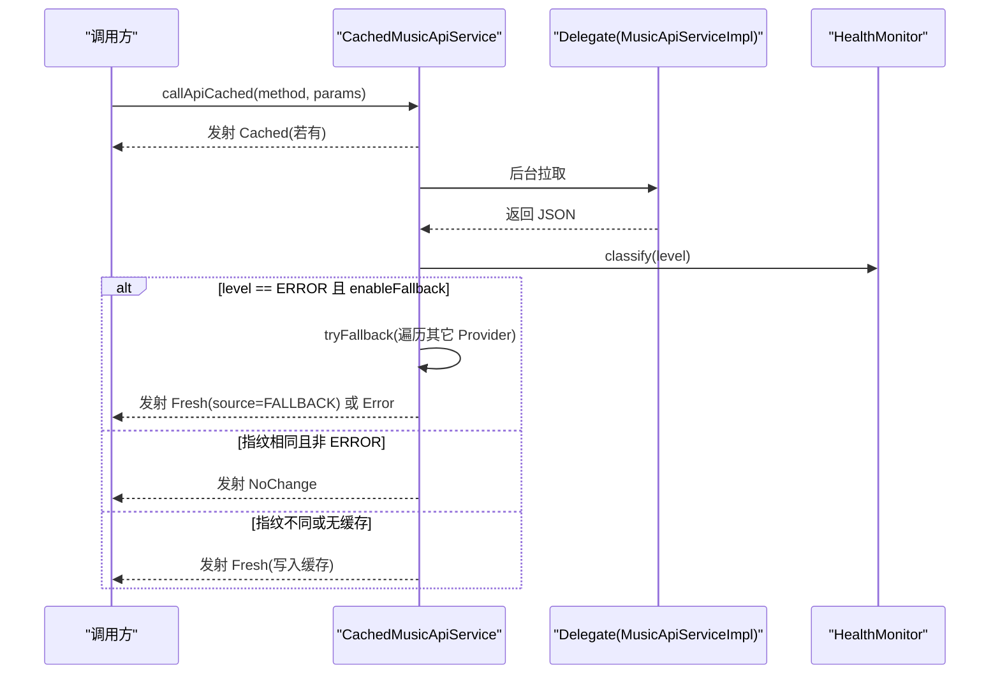
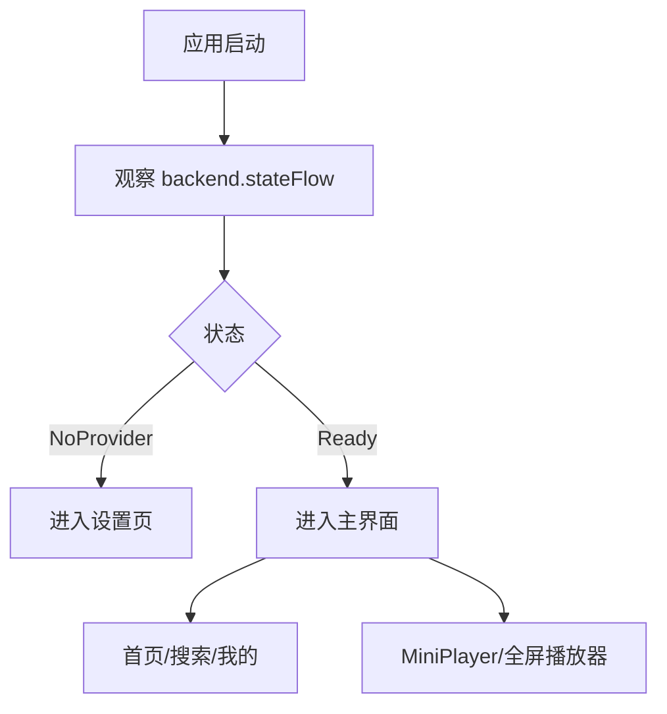
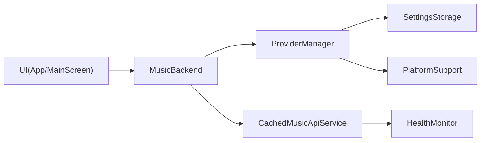

# 项目介绍

<cite>
**本文引用的文件**
- [README.md](file://README.md)
- [App.kt](file://app/src/commonMain/kotlin/cp/player/app/App.kt)
- [MusicBackend.kt](file://kmp-pro/src/commonMain/kotlin/cp/player/kmp/MusicBackend.kt)
- [ProviderManager.kt](file://kmp-pro/src/commonMain/kotlin/cp/player/kmp/provider/ProviderManager.kt)
- [CachedMusicApiService.kt](file://kmp-pro/src/commonMain/kotlin/cp/player/kmp/cache/CachedMusicApiService.kt)
- [HealthMonitor.kt](file://kmp-pro/src/commonMain/kotlin/cp/player/kmp/monitor/HealthMonitor.kt)
- [Song.kt](file://kmp-pro/src/commonMain/kotlin/cp/player/kmp/model/Song.kt)
- [MainScreen.kt](file://app/src/commonMain/kotlin/cp/player/app/ui/screen/MainScreen.kt)
- [libs.versions.toml](file://gradle/libs.versions.toml)
</cite>

## 目录
1. [简介](#简介)
2. [项目结构](#项目结构)
3. [核心组件](#核心组件)
4. [架构总览](#架构总览)
5. [详细组件分析](#详细组件分析)
6. [依赖关系分析](#依赖关系分析)
7. [性能考量](#性能考量)
8. [故障排查指南](#故障排查指南)
9. [结论](#结论)
10. [附录](#附录)

## 简介
CPPlayer-KMP 是一个基于 Kotlin Multiplatform 的跨平台音乐播放器项目，目标是在 Android 与 Desktop（JVM）上提供一致的音乐体验。项目将原 Android 工程中的 Provider 插件系统与 API 层抽象为可复用的 KMP 库模块，并在此基础上新增网络缓存、异步加载、健康监控（错误回退/警告/错误三级分类）等关键能力。通过统一的 MusicBackend 入口，前端 UI 仅依赖高层接口，屏蔽底层 Provider、网络与播放细节，从而获得更好的可测试性与可维护性。

该项目的核心价值主张：
- 跨平台复用：commonMain 共享业务逻辑，androidMain/desktopMain 处理平台差异。
- 插件化音源：Provider 机制支持多音源模块动态导入、切换与容灾。
- 稳健的网络层：缓存优先 + 指纹比对 + 健康监控 + 多 Provider 回退。
- 清晰的职责边界：后端统一入口封装状态机、Provider 管理、数据访问与播放控制。

**章节来源**
- [README.md:1-8](file://README.md#L1-L8)

## 项目结构
项目采用典型的多模块 KMP 组织方式：
- app：跨平台 Compose UI 应用，负责页面导航、主题、播放控件与用户交互。
- kmp-pro：KMP 库模块，包含 Provider 系统、API 服务、缓存、健康监控、模型与播放抽象。
- androidApp：Android 应用壳，负责初始化平台上下文与启动。

**图表来源**
- [App.kt:20-71](file://app/src/commonMain/kotlin/cp/player/app/App.kt#L20-L71)
- [MusicBackend.kt:30-161](file://kmp-pro/src/commonMain/kotlin/cp/player/kmp/MusicBackend.kt#L30-L161)
- [ProviderManager.kt:15-145](file://kmp-pro/src/commonMain/kotlin/cp/player/kmp/provider/ProviderManager.kt#L15-L145)
- [CachedMusicApiService.kt:18-88](file://kmp-pro/src/commonMain/kotlin/cp/player/kmp/cache/CachedMusicApiService.kt#L18-L88)
- [HealthMonitor.kt:10-116](file://kmp-pro/src/commonMain/kotlin/cp/player/kmp/monitor/HealthMonitor.kt#L10-L116)

**章节来源**
- [README.md:11-28](file://README.md#L11-L28)
- [libs.versions.toml:1-22](file://gradle/libs.versions.toml#L1-L22)

## 核心组件
- MusicBackend：后端统一入口，封装生命周期、状态机、Provider 管理、数据访问与播放控制；对外暴露 stateFlow 供 UI 观察。
- ProviderManager：管理已加载 Provider、当前活跃 Provider 切换、端口分配与 Cookie 隔离存储。
- CachedMusicApiService：在 MusicApiServiceImpl 之上增加“缓存先返回 + 后台拉取 + 指纹比对 + 健康监控 + 多 Provider 回退”的能力。
- HealthMonitor：对 API 调用进行三级健康分类（OK/WARNING/ERROR），并提供统计与整体健康等级流。
- 模型与 UI：Song 等数据模型使用 kotlinx-serialization；UI 使用 Compose + Voyager 导航。

这些组件共同构成“插件化音源 + 健壮网络层 + 跨平台 UI”的整体方案。

**章节来源**
- [MusicBackend.kt:30-161](file://kmp-pro/src/commonMain/kotlin/cp/player/kmp/MusicBackend.kt#L30-L161)
- [ProviderManager.kt:15-145](file://kmp-pro/src/commonMain/kotlin/cp/player/kmp/provider/ProviderManager.kt#L15-L145)
- [CachedMusicApiService.kt:18-88](file://kmp-pro/src/commonMain/kotlin/cp/player/kmp/cache/CachedMusicApiService.kt#L18-L88)
- [HealthMonitor.kt:10-116](file://kmp-pro/src/commonMain/kotlin/cp/player/kmp/monitor/HealthMonitor.kt#L10-L116)
- [Song.kt:1-14](file://kmp-pro/src/commonMain/kotlin/cp/player/kmp/model/Song.kt#L1-L14)

## 架构总览
下图展示了从 UI 到后端、再到 Provider 与缓存/健康监控的关键交互路径。

**图表来源**
- [MusicBackend.kt:30-161](file://kmp-pro/src/commonMain/kotlin/cp/player/kmp/MusicBackend.kt#L30-L161)
- [CachedMusicApiService.kt:60-140](file://kmp-pro/src/commonMain/kotlin/cp/player/kmp/cache/CachedMusicApiService.kt#L60-L140)
- [HealthMonitor.kt:117-138](file://kmp-pro/src/commonMain/kotlin/cp/player/kmp/monitor/HealthMonitor.kt#L117-L138)

## 详细组件分析

### 后端统一入口 MusicBackend
- 职责：生命周期与状态机（Uninitialized/NoProvider/Ready/Error）、Provider 导入与激活、统一数据访问（unifiedSource）、播放控制器装配、健康监控接入。
- 设计要点：
  - 通过 stateFlow 暴露状态，UI 根据 NoProvider/Ready 决定路由。
  - importModule 成功后自动激活首个可用 Provider，修复旧版“导入后仍显示未加载”的问题。
  - playbackController 惰性创建，绑定 UnifiedMusicSourceImpl、MusicApiServiceImpl 与平台 Player。
  - 内部通过反射安全提取 JNI Provider 的错误信息，避免 commonMain 直接依赖 androidMain。

**图表来源**
- [MusicBackend.kt:73-161](file://kmp-pro/src/commonMain/kotlin/cp/player/kmp/MusicBackend.kt#L73-L161)
- [ProviderManager.kt:31-145](file://kmp-pro/src/commonMain/kotlin/cp/player/kmp/provider/ProviderManager.kt#L31-L145)
- [CachedMusicApiService.kt:46-88](file://kmp-pro/src/commonMain/kotlin/cp/player/kmp/cache/CachedMusicApiService.kt#L46-L88)
- [HealthMonitor.kt:25-116](file://kmp-pro/src/commonMain/kotlin/cp/player/kmp/monitor/HealthMonitor.kt#L25-L116)

**章节来源**
- [MusicBackend.kt:30-161](file://kmp-pro/src/commonMain/kotlin/cp/player/kmp/MusicBackend.kt#L30-L161)
- [MusicBackend.kt:181-242](file://kmp-pro/src/commonMain/kotlin/cp/player/kmp/MusicBackend.kt#L181-L242)
- [MusicBackend.kt:314-388](file://kmp-pro/src/commonMain/kotlin/cp/player/kmp/MusicBackend.kt#L314-L388)

### 插件化 Provider 系统
- ProviderManager 负责：
  - 端口探测与分配（默认起始端口 + 最大尝试次数）。
  - 切换时停止旧服务、启动新服务，持久化最近使用的 Provider ID。
  - 按 providerId 前缀隔离 cookie，避免多账号冲突。
  - 通过 apiMap 映射方法名，屏蔽不同 Provider 的差异。
- 导入流程：
  - 导入 zip 模块后，若当前无活跃 Provider 或不可用，自动激活首个可用 Provider。
  - 删除模块时，若删除的是当前活跃 Provider，尝试切换到剩余第一个；若无剩余则回到 NoProvider。

**图表来源**
- [ProviderManager.kt:62-109](file://kmp-pro/src/commonMain/kotlin/cp/player/kmp/provider/ProviderManager.kt#L62-L109)
- [ProviderManager.kt:111-145](file://kmp-pro/src/commonMain/kotlin/cp/player/kmp/provider/ProviderManager.kt#L111-L145)

**章节来源**
- [ProviderManager.kt:15-145](file://kmp-pro/src/commonMain/kotlin/cp/player/kmp/provider/ProviderManager.kt#L15-L145)
- [MusicBackend.kt:181-242](file://kmp-pro/src/commonMain/kotlin/cp/player/kmp/MusicBackend.kt#L181-L242)

### 网络缓存与健康监控
- 缓存策略：
  - 键由 providerId、method、排序后的参数与 cookieHash 组成。
  - 读类接口缓存，写/动作类直通网络。
  - 首次立即返回缓存（标记是否过期），后台拉取后进行指纹比对，相同则 NoChange，不同则 Fresh 并写回缓存。
- 健康监控：
  - 三级分类：OK（正常）、WARNING（勉强可用，附带 warnings）、ERROR（不可用，触发回退）。
  - 当分类为 ERROR 且启用回退时，依次尝试其它 Provider 调用同一方法，成功则标记 FALLBACK。
  - 提供 overallLevelFlow 用于 UI 顶部状态指示。

**图表来源**
- [CachedMusicApiService.kt:60-140](file://kmp-pro/src/commonMain/kotlin/cp/player/kmp/cache/CachedMusicApiService.kt#L60-L140)
- [HealthMonitor.kt:117-138](file://kmp-pro/src/commonMain/kotlin/cp/player/kmp/monitor/HealthMonitor.kt#L117-L138)

**章节来源**
- [CachedMusicApiService.kt:18-219](file://kmp-pro/src/commonMain/kotlin/cp/player/kmp/cache/CachedMusicApiService.kt#L18-L219)
- [HealthMonitor.kt:10-116](file://kmp-pro/src/commonMain/kotlin/cp/player/kmp/monitor/HealthMonitor.kt#L10-L116)
- [HealthMonitor.kt:147-216](file://kmp-pro/src/commonMain/kotlin/cp/player/kmp/monitor/HealthMonitor.kt#L147-L216)

### UI 与状态驱动
- App 根 Composable 根据 MusicBackend.stateFlow 决定初始路由：NoProvider → SetupScreen；Ready → MainScreen。
- MainScreen 提供响应式布局（移动端底部导航栏、桌面端侧边导航栏），集成 MiniPlayer 与全屏播放器动画。
- 全局 Snackbar 收集各 Screen/ScreenModel 的操作反馈。

**图表来源**
- [App.kt:20-71](file://app/src/commonMain/kotlin/cp/player/app/App.kt#L20-L71)
- [MainScreen.kt:72-234](file://app/src/commonMain/kotlin/cp/player/app/ui/screen/MainScreen.kt#L72-L234)

**章节来源**
- [App.kt:20-71](file://app/src/commonMain/kotlin/cp/player/app/App.kt#L20-L71)
- [MainScreen.kt:72-234](file://app/src/commonMain/kotlin/cp/player/app/ui/screen/MainScreen.kt#L72-L234)

## 依赖关系分析
- 技术栈版本集中在 libs.versions.toml，包括 Kotlin、Coroutines、Serialization、Ktor、Compose、Voyager、Media3、Coil 等。
- 模块间耦合：
  - UI 仅依赖 MusicBackend 暴露的高层接口，降低与具体 Provider/网络实现的耦合。
  - 缓存层依赖 HealthMonitor 与 ProviderManager，形成“缓存 + 健康 + 容灾”的闭环。
  - ProviderManager 通过 PlatformSupport 与 SettingsStorage 解耦平台差异。

**图表来源**
- [libs.versions.toml:23-64](file://gradle/libs.versions.toml#L23-L64)
- [MusicBackend.kt:30-161](file://kmp-pro/src/commonMain/kotlin/cp/player/kmp/MusicBackend.kt#L30-L161)
- [ProviderManager.kt:15-145](file://kmp-pro/src/commonMain/kotlin/cp/player/kmp/provider/ProviderManager.kt#L15-L145)

**章节来源**
- [libs.versions.toml:1-64](file://gradle/libs.versions.toml#L1-L64)

## 性能考量
- 缓存优先：首次即时返回缓存，减少首屏等待时间；后台拉取后再决定是否更新。
- 指纹比对：轻量级指纹计算，避免频繁替换相同内容，降低 UI 重绘与内存压力。
- 健康监控环形缓冲区：固定大小记录最近调用，避免无限增长；统计查询基于快照计算，不阻塞记录路径。
- 端口探测与 Provider 启动：限制最大尝试次数，快速失败并回滚到上一状态，提升稳定性。

[本节为通用性能讨论，无需特定文件引用]

## 故障排查指南
- 常见症状与定位：
  - 无法进入主页：检查 MusicBackend.stateFlow 是否为 NoProvider；确认已导入并激活 Provider。
  - 数据不更新：查看 CachedMusicApiService 是否命中缓存且指纹未变化；必要时刷新或禁用缓存。
  - 接口报错：查看 HealthMonitor 的 overallLevelFlow 与最近记录，定位 WARNING/ERROR；若为 ERROR，检查是否触发多 Provider 回退。
  - Provider 启动失败：查看 lastLoadError 与 Provider 日志；JNI 模块仅在 Android 可用，Desktop 会返回不可用。
- 建议操作：
  - 清理缓存或切换 Provider 以验证问题范围。
  - 使用 HealthMonitor.getRecentRecords 过滤 onlyWarnings/onlyErrors 快速定位异常。
  - 在 ProviderManager 中检查端口占用情况与 apiMap 映射是否正确。

**章节来源**
- [MusicBackend.kt:247-248](file://kmp-pro/src/commonMain/kotlin/cp/player/kmp/MusicBackend.kt#L247-L248)
- [ProviderManager.kt:62-109](file://kmp-pro/src/commonMain/kotlin/cp/player/kmp/provider/ProviderManager.kt#L62-L109)
- [HealthMonitor.kt:159-178](file://kmp-pro/src/commonMain/kotlin/cp/player/kmp/monitor/HealthMonitor.kt#L159-L178)

## 结论
CPPlayer-KMP 通过 KMP 架构将原 Android 工程的 Provider 插件系统与 API 层抽象为跨平台库，结合缓存、健康监控与多 Provider 回退，显著提升了应用的鲁棒性与可维护性。MusicBackend 作为统一入口，使 UI 层专注于用户体验，同时保持对底层实现的低耦合。该项目为跨平台音乐播放器提供了清晰的设计范式与可扩展的基础设施。

[本节为总结性内容，无需特定文件引用]

## 附录
- 构建与运行：参考 README 中的 Gradle 命令，分别编译 Android 与 Desktop 目标。
- 接入示例：在 Application.onCreate 中初始化 MusicBackend 与缓存配置；在 UI 中通过 Flow 订阅状态与数据。
- 术语说明：
  - Provider：音源模块，提供具体的音乐数据接口。
  - UnifiedMusicSource：统一数据源，屏蔽不同 Provider 的差异。
  - CacheResult：缓存结果类型，包含 Cached/Fresh/NoChange/Error。
  - HealthLevel：健康等级，OK/WARNING/ERROR。

**章节来源**
- [README.md:104-166](file://README.md#L104-L166)