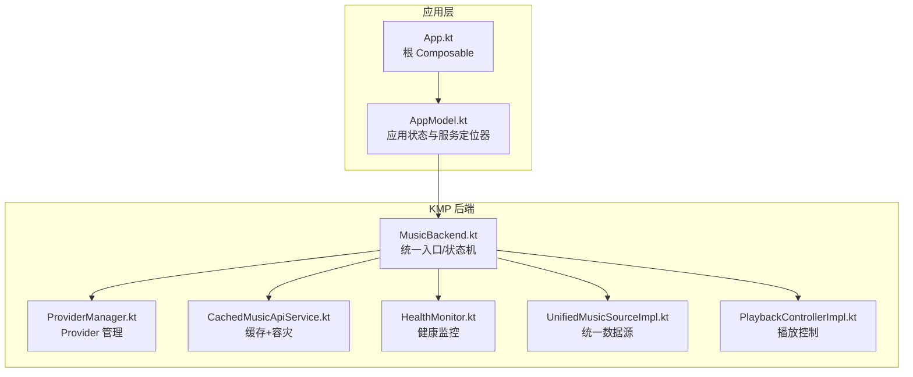
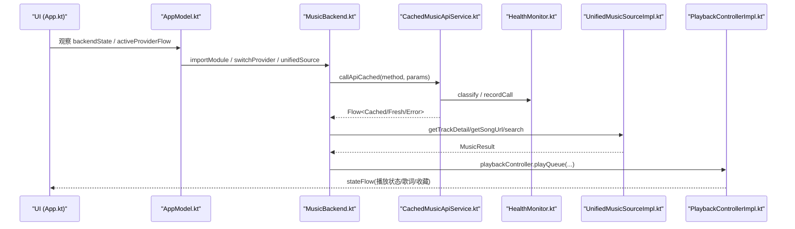
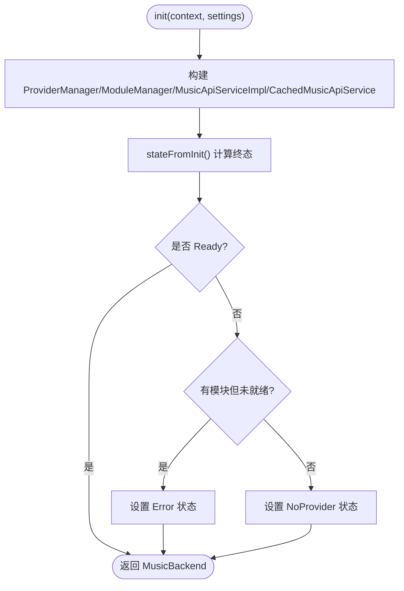
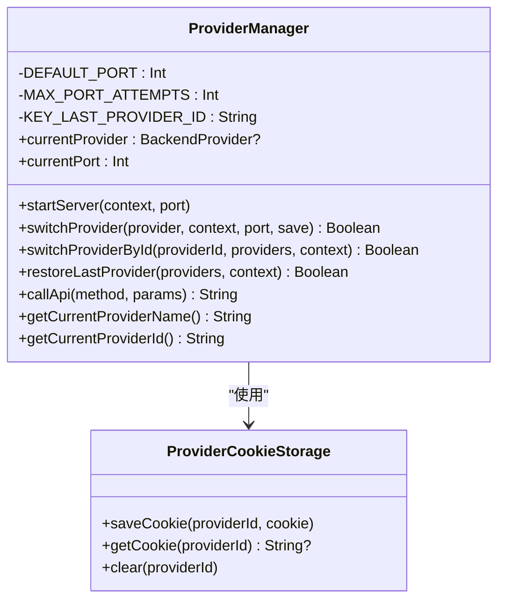
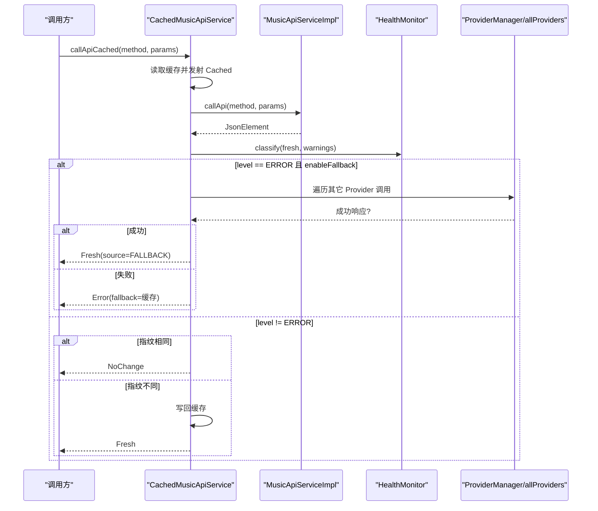
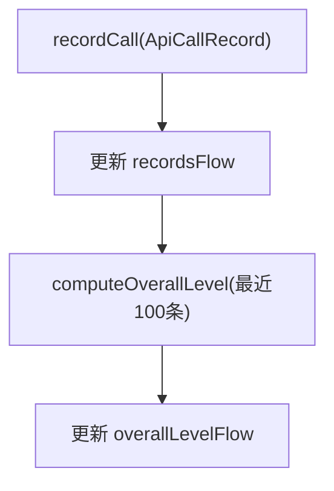
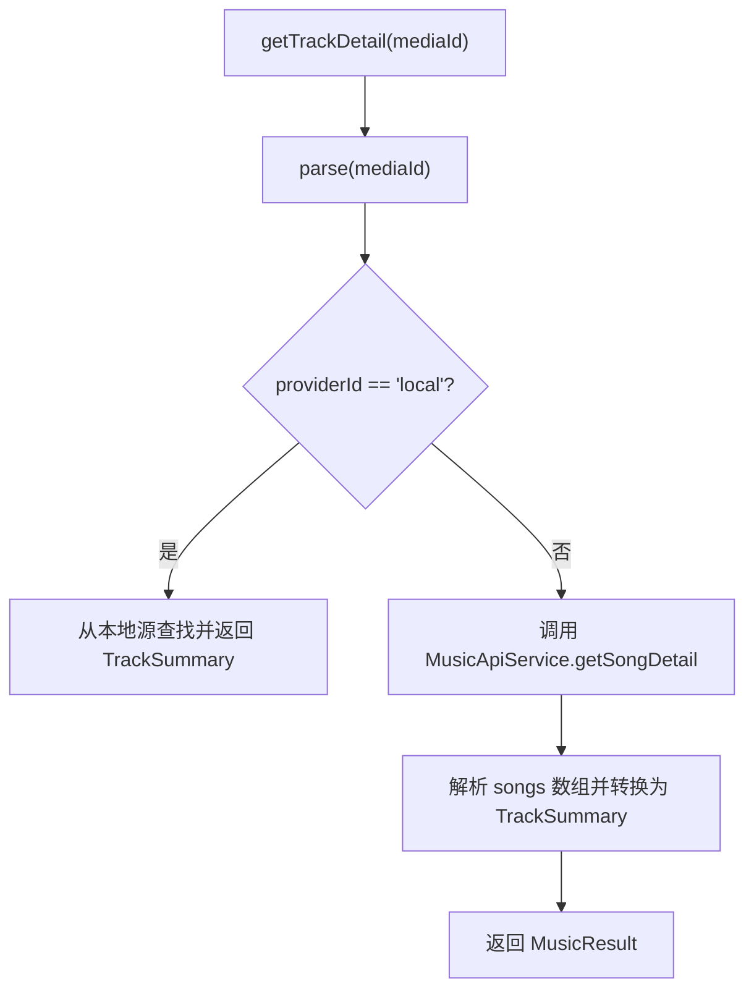
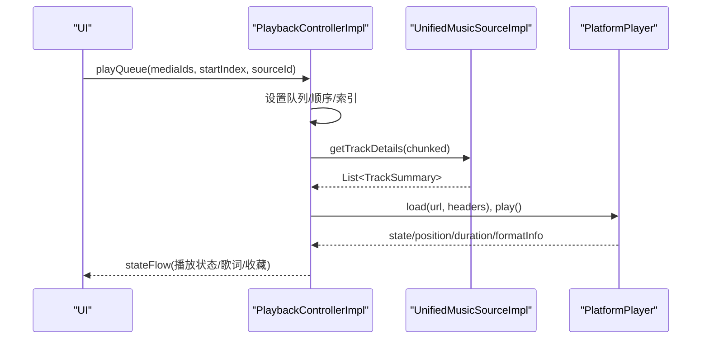
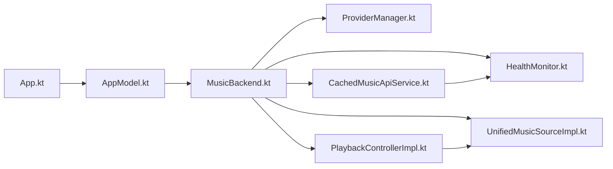

# 项目概述

<cite>
**本文引用的文件**
- [README.md](file://README.md)
- [App.kt](file://app/src/commonMain/kotlin/cp/player/app/App.kt)
- [AppModel.kt](file://app/src/commonMain/kotlin/cp/player/app/AppModel.kt)
- [MusicBackend.kt](file://kmp-pro/src/commonMain/kotlin/cp/player/kmp/MusicBackend.kt)
- [ProviderManager.kt](file://kmp-pro/src/commonMain/kotlin/cp/player/kmp/provider/ProviderManager.kt)
- [CachedMusicApiService.kt](file://kmp-pro/src/commonMain/kotlin/cp/player/kmp/cache/CachedMusicApiService.kt)
- [HealthMonitor.kt](file://kmp-pro/src/commonMain/kotlin/cp/player/kmp/monitor/HealthMonitor.kt)
- [UnifiedMusicSourceImpl.kt](file://kmp-pro/src/commonMain/kotlin/cp/player/kmp/music/UnifiedMusicSourceImpl.kt)
- [PlaybackControllerImpl.kt](file://kmp-pro/src/commonMain/kotlin/cp/player/kmp/playback/PlaybackControllerImpl.kt)
</cite>

## 目录
1. [简介](#简介)
2. [项目结构](#项目结构)
3. [核心组件](#核心组件)
4. [架构总览](#架构总览)
5. [详细组件分析](#详细组件分析)
6. [依赖关系分析](#依赖关系分析)
7. [性能考量](#性能考量)
8. [故障排查指南](#故障排查指南)
9. [结论](#结论)
10. [附录：快速开始](#附录快速开始)

## 简介
CPPlayer-KMP 是一个基于 Kotlin Multiplatform 的跨平台音乐播放器项目，目标是在 Android 与 Desktop（JVM）共享同一套后端逻辑与数据访问层，并通过统一的 UI 入口提供一致的播放体验。项目采用“插件化 Provider + API 缓存 + 健康监控”的设计，使音源模块可插拔、网络请求具备容灾能力，同时通过统一播放控制器屏蔽平台差异。

- 跨平台理念：commonMain 实现业务与数据层；androidMain/desktopMain 提供平台相关实现（如存储、HTTP、JNI）。
- 插件化 Provider：通过 ModuleManager/ProviderManager 动态加载与管理音源模块，支持切换、删除与自动激活。
- 缓存机制：CachedMusicApiService 在 MusicApiServiceImpl 之上封装，先返回缓存、后台拉取并指纹比对，减少不必要的数据更新。
- 健康监控：三级分类（OK/WARNING/ERROR），结合多 Provider 容灾回退，提升可用性。
- 统一播放控制：PlaybackControllerImpl 管理队列、歌词、收藏、打卡、音质降级等，屏蔽平台播放器差异。

**章节来源**
- [README.md:1-167](file://README.md#L1-L167)

## 项目结构
项目由应用层 app 与 KMP 库模块 kmp-pro 组成：
- app：Compose UI、路由、主题、设置与页面模型，依赖 MusicBackend 暴露的统一接口。
- kmp-pro：跨平台后端核心，包含 Provider 系统、API 服务、缓存、健康监控、统一音乐源、播放控制等。

**图表来源**
- [App.kt:20-71](file://app/src/commonMain/kotlin/cp/player/app/App.kt#L20-L71)
- [AppModel.kt:17-64](file://app/src/commonMain/kotlin/cp/player/app/AppModel.kt#L17-L64)
- [MusicBackend.kt:30-161](file://kmp-pro/src/commonMain/kotlin/cp/player/kmp/MusicBackend.kt#L30-L161)
- [ProviderManager.kt:15-145](file://kmp-pro/src/commonMain/kotlin/cp/player/kmp/provider/ProviderManager.kt#L15-L145)
- [CachedMusicApiService.kt:18-52](file://kmp-pro/src/commonMain/kotlin/cp/player/kmp/cache/CachedMusicApiService.kt#L18-L52)
- [HealthMonitor.kt:10-24](file://kmp-pro/src/commonMain/kotlin/cp/player/kmp/monitor/HealthMonitor.kt#L10-L24)
- [UnifiedMusicSourceImpl.kt:15-20](file://kmp-pro/src/commonMain/kotlin/cp/player/kmp/music/UnifiedMusicSourceImpl.kt#L15-L20)
- [PlaybackControllerImpl.kt:18-41](file://kmp-pro/src/commonMain/kotlin/cp/player/kmp/playback/PlaybackControllerImpl.kt#L18-L41)

**章节来源**
- [App.kt:20-71](file://app/src/commonMain/kotlin/cp/player/app/App.kt#L20-L71)
- [AppModel.kt:17-64](file://app/src/commonMain/kotlin/cp/player/app/AppModel.kt#L17-L64)
- [MusicBackend.kt:30-161](file://kmp-pro/src/commonMain/kotlin/cp/player/kmp/MusicBackend.kt#L30-L161)

## 核心组件
- MusicBackend：后端统一入口，负责生命周期、状态机、Provider 管理、统一数据源、播放控制与健康监控。
- ProviderManager：管理已加载 Provider、当前活跃 Provider、端口分配与 Cookie 隔离。
- CachedMusicApiService：带缓存与多 Provider 容灾的 API 调用封装，返回 Flow 的多阶段结果。
- HealthMonitor：记录 API 调用并分类为 OK/WARNING/ERROR，维护整体健康等级流。
- UnifiedMusicSourceImpl：根据 CPMediaId 路由到本地或云端，统一获取曲目详情、URL 与搜索。
- PlaybackControllerImpl：队列管理、播放控制、歌词抓取、收藏同步、听歌打卡、音质降级与睡眠定时。

**章节来源**
- [MusicBackend.kt:30-161](file://kmp-pro/src/commonMain/kotlin/cp/player/kmp/MusicBackend.kt#L30-L161)
- [ProviderManager.kt:15-145](file://kmp-pro/src/commonMain/kotlin/cp/player/kmp/provider/ProviderManager.kt#L15-L145)
- [CachedMusicApiService.kt:18-52](file://kmp-pro/src/commonMain/kotlin/cp/player/kmp/cache/CachedMusicApiService.kt#L18-L52)
- [HealthMonitor.kt:10-24](file://kmp-pro/src/commonMain/kotlin/cp/player/kmp/monitor/HealthMonitor.kt#L10-L24)
- [UnifiedMusicSourceImpl.kt:15-20](file://kmp-pro/src/commonMain/kotlin/cp/player/kmp/music/UnifiedMusicSourceImpl.kt#L15-L20)
- [PlaybackControllerImpl.kt:18-41](file://kmp-pro/src/commonMain/kotlin/cp/player/kmp/playback/PlaybackControllerImpl.kt#L18-L41)

## 架构总览
下图展示了从 UI 到后端的核心交互路径：UI 通过 AppModel 访问 MusicBackend，后者协调 Provider、API 缓存、健康监控与播放控制。

**图表来源**
- [App.kt:20-71](file://app/src/commonMain/kotlin/cp/player/app/App.kt#L20-L71)
- [AppModel.kt:17-64](file://app/src/commonMain/kotlin/cp/player/app/AppModel.kt#L17-L64)
- [MusicBackend.kt:30-161](file://kmp-pro/src/commonMain/kotlin/cp/player/kmp/MusicBackend.kt#L30-L161)
- [CachedMusicApiService.kt:18-52](file://kmp-pro/src/commonMain/kotlin/cp/player/kmp/cache/CachedMusicApiService.kt#L18-L52)
- [HealthMonitor.kt:10-24](file://kmp-pro/src/commonMain/kotlin/cp/player/kmp/monitor/HealthMonitor.kt#L10-L24)
- [UnifiedMusicSourceImpl.kt:15-20](file://kmp-pro/src/commonMain/kotlin/cp/player/kmp/music/UnifiedMusicSourceImpl.kt#L15-L20)
- [PlaybackControllerImpl.kt:18-41](file://kmp-pro/src/commonMain/kotlin/cp/player/kmp/playback/PlaybackControllerImpl.kt#L18-L41)

## 详细组件分析

### MusicBackend：统一后端入口与状态机
- 职责：初始化 Provider/Module/API/缓存；暴露 stateFlow 驱动 UI；管理导入/切换/删除 Provider；提供统一数据源与播放控制器。
- 关键点：
  - 初始化后计算终态（Ready/NoProvider/Error）。
  - 导入模块时自动激活首个可用 Provider。
  - 删除活跃 Provider 时尝试切换到剩余第一个或进入 NoProvider。
  - 通过反射安全提取 JNI Provider 的错误信息。

**图表来源**
- [MusicBackend.kt:330-388](file://kmp-pro/src/commonMain/kotlin/cp/player/kmp/MusicBackend.kt#L330-L388)

**章节来源**
- [MusicBackend.kt:30-161](file://kmp-pro/src/commonMain/kotlin/cp/player/kmp/MusicBackend.kt#L30-L161)
- [MusicBackend.kt:180-248](file://kmp-pro/src/commonMain/kotlin/cp/player/kmp/MusicBackend.kt#L180-L248)
- [MusicBackend.kt:330-388](file://kmp-pro/src/commonMain/kotlin/cp/player/kmp/MusicBackend.kt#L330-L388)

### ProviderManager：插件化 Provider 管理
- 职责：加载/切换/停止 Provider；端口检测与回退；Cookie 按 Provider 隔离；持久化最近活跃 Provider。
- 关键点：
  - 切换前停止旧 Provider 的服务，启动新 Provider 的服务。
  - 失败时回滚到上一个 Provider。
  - 提供 callApi 方法映射与错误包装。

**图表来源**
- [ProviderManager.kt:15-145](file://kmp-pro/src/commonMain/kotlin/cp/player/kmp/provider/ProviderManager.kt#L15-L145)

**章节来源**
- [ProviderManager.kt:15-145](file://kmp-pro/src/commonMain/kotlin/cp/player/kmp/provider/ProviderManager.kt#L15-L145)

### CachedMusicApiService：缓存 + 健康监控 + 多 Provider 容灾
- 职责：对 MusicApiService 进行缓存封装，返回 Flow 多值结果；健康监控集成；多 Provider 容灾回退。
- 关键点：
  - 先返回缓存（可能 stale），后台拉取并计算指纹，若相同则 NoChange，否则 Fresh 写回缓存。
  - ERROR 级别触发 tryFallback，成功标记 FALLBACK 源。
  - 仅读类接口缓存，写/动作直通网络。

**图表来源**
- [CachedMusicApiService.kt:60-140](file://kmp-pro/src/commonMain/kotlin/cp/player/kmp/cache/CachedMusicApiService.kt#L60-L140)
- [CachedMusicApiService.kt:142-180](file://kmp-pro/src/commonMain/kotlin/cp/player/kmp/cache/CachedMusicApiService.kt#L142-L180)
- [HealthMonitor.kt:10-24](file://kmp-pro/src/commonMain/kotlin/cp/player/kmp/monitor/HealthMonitor.kt#L10-L24)

**章节来源**
- [CachedMusicApiService.kt:18-52](file://kmp-pro/src/commonMain/kotlin/cp/player/kmp/cache/CachedMusicApiService.kt#L18-L52)
- [CachedMusicApiService.kt:60-140](file://kmp-pro/src/commonMain/kotlin/cp/player/kmp/cache/CachedMusicApiService.kt#L60-L140)
- [CachedMusicApiService.kt:142-180](file://kmp-pro/src/commonMain/kotlin/cp/player/kmp/cache/CachedMusicApiService.kt#L142-L180)

### HealthMonitor：三级健康分类与统计
- 职责：记录 API 调用，分类为 OK/WARNING/ERROR；维护整体健康等级流；提供统计查询。
- 关键点：
  - ResponseWarning 类型归入 HealthLevel。
  - 环形缓冲区限制记录数量，避免内存增长。
  - overallLevelFlow 供 UI 顶部状态指示。

**图表来源**
- [HealthMonitor.kt:119-138](file://kmp-pro/src/commonMain/kotlin/cp/player/kmp/monitor/HealthMonitor.kt#L119-L138)
- [HealthMonitor.kt:220-233](file://kmp-pro/src/commonMain/kotlin/cp/player/kmp/monitor/HealthMonitor.kt#L220-L233)

**章节来源**
- [HealthMonitor.kt:10-24](file://kmp-pro/src/commonMain/kotlin/cp/player/kmp/monitor/HealthMonitor.kt#L10-L24)
- [HealthMonitor.kt:119-138](file://kmp-pro/src/commonMain/kotlin/cp/player/kmp/monitor/HealthMonitor.kt#L119-L138)
- [HealthMonitor.kt:220-233](file://kmp-pro/src/commonMain/kotlin/cp/player/kmp/monitor/HealthMonitor.kt#L220-L233)

### UnifiedMusicSourceImpl：统一数据源路由
- 职责：根据 CPMediaId 将请求路由到本地或云端；解析 TrackSummary、SongUrl；批量获取详情。
- 关键点：
  - local providerId 直接走本地音乐源。
  - 云端通过 MusicApiService 获取详情与 URL，支持递归查找 URL。
  - 搜索与用户歌单委托给 MusicSourceFromApi。

**图表来源**
- [UnifiedMusicSourceImpl.kt:20-52](file://kmp-pro/src/commonMain/kotlin/cp/player/kmp/music/UnifiedMusicSourceImpl.kt#L20-L52)
- [UnifiedMusicSourceImpl.kt:100-118](file://kmp-pro/src/commonMain/kotlin/cp/player/kmp/music/UnifiedMusicSourceImpl.kt#L100-L118)

**章节来源**
- [UnifiedMusicSourceImpl.kt:15-20](file://kmp-pro/src/commonMain/kotlin/cp/player/kmp/music/UnifiedMusicSourceImpl.kt#L15-L20)
- [UnifiedMusicSourceImpl.kt:20-52](file://kmp-pro/src/commonMain/kotlin/cp/player/kmp/music/UnifiedMusicSourceImpl.kt#L20-L52)
- [UnifiedMusicSourceImpl.kt:100-118](file://kmp-pro/src/commonMain/kotlin/cp/player/kmp/music/UnifiedMusicSourceImpl.kt#L100-L118)

### PlaybackControllerImpl：播放控制与队列管理
- 职责：队列管理、播放控制、歌词抓取、收藏同步、听歌打卡、音质降级与睡眠定时。
- 关键点：
  - 懒解析队列条目，批量获取详情以提升性能。
  - 播放失败时自动降级到 standard 音质重试。
  - 每 30 秒上报一次听歌打卡，失败静默。
  - 收藏列表懒加载，乐观更新并在失败时回滚。

**图表来源**
- [PlaybackControllerImpl.kt:144-158](file://kmp-pro/src/commonMain/kotlin/cp/player/kmp/playback/PlaybackControllerImpl.kt#L144-L158)
- [PlaybackControllerImpl.kt:495-556](file://kmp-pro/src/commonMain/kotlin/cp/player/kmp/playback/PlaybackControllerImpl.kt#L495-L556)
- [PlaybackControllerImpl.kt:643-671](file://kmp-pro/src/commonMain/kotlin/cp/player/kmp/playback/PlaybackControllerImpl.kt#L643-L671)

**章节来源**
- [PlaybackControllerImpl.kt:18-41](file://kmp-pro/src/commonMain/kotlin/cp/player/kmp/playback/PlaybackControllerImpl.kt#L18-L41)
- [PlaybackControllerImpl.kt:144-158](file://kmp-pro/src/commonMain/kotlin/cp/player/kmp/playback/PlaybackControllerImpl.kt#L144-L158)
- [PlaybackControllerImpl.kt:495-556](file://kmp-pro/src/commonMain/kotlin/cp/player/kmp/playback/PlaybackControllerImpl.kt#L495-L556)
- [PlaybackControllerImpl.kt:643-671](file://kmp-pro/src/commonMain/kotlin/cp/player/kmp/playback/PlaybackControllerImpl.kt#L643-L671)

## 依赖关系分析
- UI 层（App.kt/AppModel.kt）依赖 MusicBackend，不直接触碰内部组件。
- MusicBackend 组合 ProviderManager、ModuleManager、MusicApiServiceImpl、CachedMusicApiService、统一数据源与播放控制器。
- CachedMusicApiService 依赖 MusicApiServiceImpl、ProviderManager、HealthMonitor 与 ApiCache。
- PlaybackControllerImpl 依赖 UnifiedMusicSourceImpl、MusicApiService、PlatformPlayer。

**图表来源**
- [App.kt:20-71](file://app/src/commonMain/kotlin/cp/player/app/App.kt#L20-L71)
- [AppModel.kt:17-64](file://app/src/commonMain/kotlin/cp/player/app/AppModel.kt#L17-L64)
- [MusicBackend.kt:30-161](file://kmp-pro/src/commonMain/kotlin/cp/player/kmp/MusicBackend.kt#L30-L161)
- [CachedMusicApiService.kt:18-52](file://kmp-pro/src/commonMain/kotlin/cp/player/kmp/cache/CachedMusicApiService.kt#L18-L52)
- [PlaybackControllerImpl.kt:18-41](file://kmp-pro/src/commonMain/kotlin/cp/player/kmp/playback/PlaybackControllerImpl.kt#L18-L41)

**章节来源**
- [App.kt:20-71](file://app/src/commonMain/kotlin/cp/player/app/App.kt#L20-L71)
- [AppModel.kt:17-64](file://app/src/commonMain/kotlin/cp/player/app/AppModel.kt#L17-L64)
- [MusicBackend.kt:30-161](file://kmp-pro/src/commonMain/kotlin/cp/player/kmp/MusicBackend.kt#L30-L161)

## 性能考量
- 缓存策略：CachedMusicApiService 先返回缓存，后台拉取并指纹比对，减少 UI 更新与网络开销。
- 批量请求：UnifiedMusicSourceImpl 与 PlaybackControllerImpl 对详情获取进行分批处理，避免 URI 过长与过多并发。
- 健康监控：环形缓冲区限制记录数量，统计查询基于快照计算，避免阻塞记录路径。
- 音质降级：PlaybackControllerImpl 在播放失败时自动降级到 standard 音质重试，提高兼容性。

[本节为通用性能讨论，无需特定文件引用]

## 故障排查指南
- 健康监控：通过 HealthMonitor.recordsFlow 与 overallLevelFlow 查看最近调用与综合等级，定位 WARNING/ERROR 原因。
- Provider 切换失败：检查 ProviderManager.switchProvider 返回值与 lastLoadError；确认端口占用与 isReady 状态。
- 缓存异常：关注 CachedMusicApiService 的 CacheResult.Error 与 fallback；检查 isCacheable 方法与指纹比对逻辑。
- 播放失败：查看 PlaybackControllerImpl 的错误信息与是否触发音质降级；确认 PlatformPlayer 状态与 URL 有效性。

**章节来源**
- [HealthMonitor.kt:119-138](file://kmp-pro/src/commonMain/kotlin/cp/player/kmp/monitor/HealthMonitor.kt#L119-L138)
- [ProviderManager.kt:80-109](file://kmp-pro/src/commonMain/kotlin/cp/player/kmp/provider/ProviderManager.kt#L80-L109)
- [CachedMusicApiService.kt:90-140](file://kmp-pro/src/commonMain/kotlin/cp/player/kmp/cache/CachedMusicApiService.kt#L90-L140)
- [PlaybackControllerImpl.kt:495-556](file://kmp-pro/src/commonMain/kotlin/cp/player/kmp/playback/PlaybackControllerImpl.kt#L495-L556)

## 结论
CPPlayer-KMP 通过统一的 MusicBackend 抽象了跨平台后端逻辑，结合插件化 Provider、缓存与健康监控，提供了稳定可扩展的音乐播放体验。UI 层仅需依赖 AppModel 与 MusicBackend，即可实现跨平台一致的功能与行为。未来可继续完善统一数据源与平台播放器注入，进一步提升功能覆盖与性能表现。

[本节为总结性内容，无需特定文件引用]

## 附录：快速开始
- 初始化后端：
  - Android：在 Application.onCreate 中注入 PlatformContext 与 SettingsStorage，调用 MusicBackend.init。
  - Desktop：使用 PlatformContext.EMPTY 与默认 SettingsStorage 初始化。
- 使用缓存 API：
  - 通过 MusicApiServiceFactory.cachedInstance 获取 CachedMusicApiService，调用 callApiCached 并收集 Flow 结果。
- 导入模块：
  - 调用 MusicBackend.importModule(zipPath)，自动激活首个可用 Provider。
- 播放控制：
  - 通过 MusicBackend.playbackController 管理队列与播放状态，监听 stateFlow 渲染 UI。

**章节来源**
- [README.md:104-154](file://README.md#L104-L154)
- [MusicBackend.kt:330-367](file://kmp-pro/src/commonMain/kotlin/cp/player/kmp/MusicBackend.kt#L330-L367)
- [AppModel.kt:17-64](file://app/src/commonMain/kotlin/cp/player/app/AppModel.kt#L17-L64)